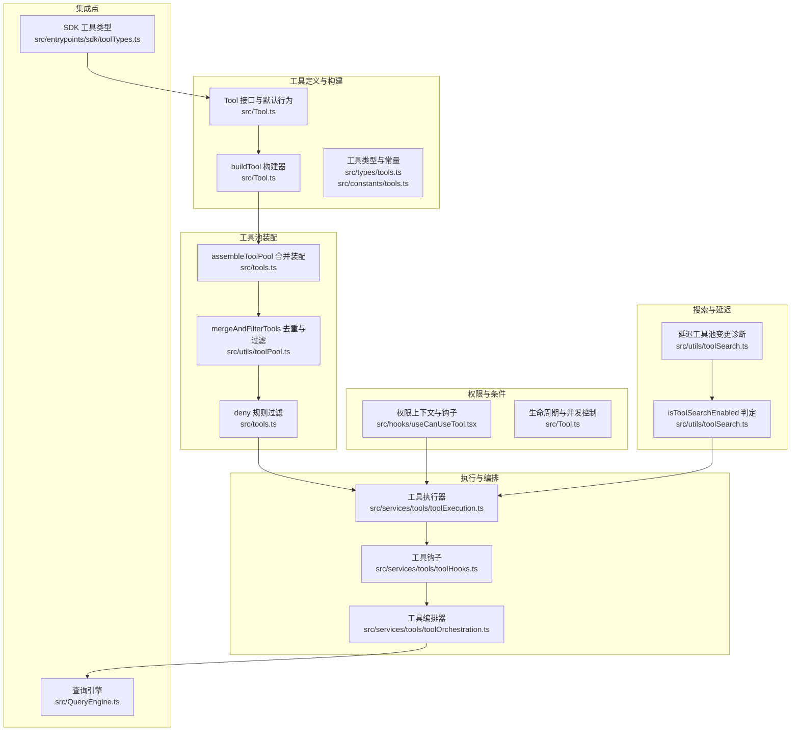
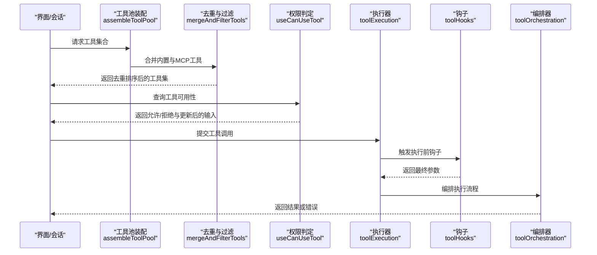
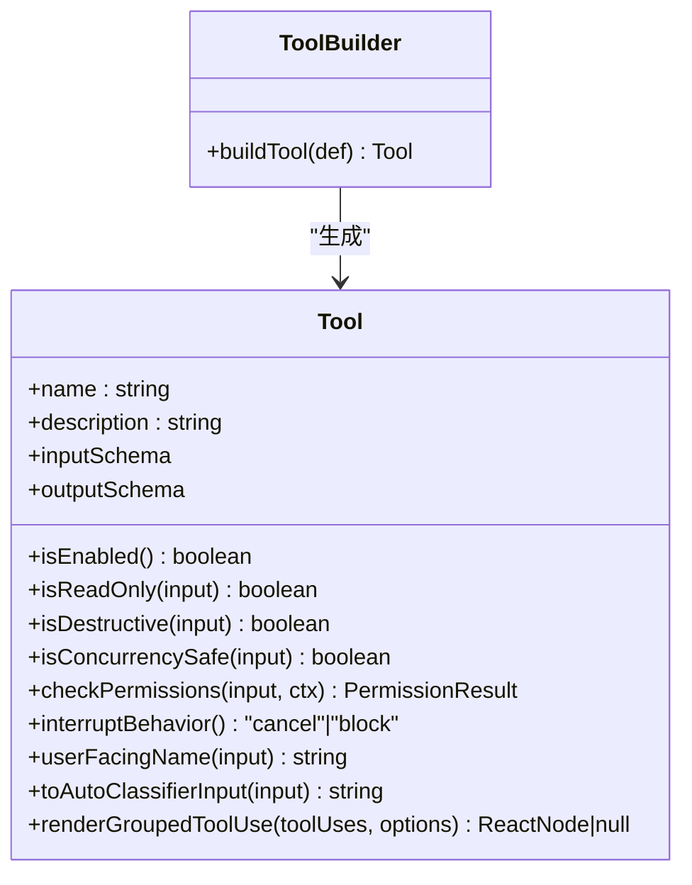
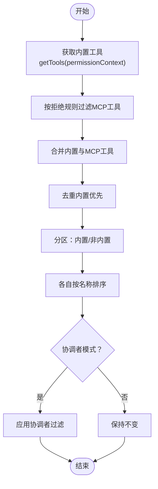
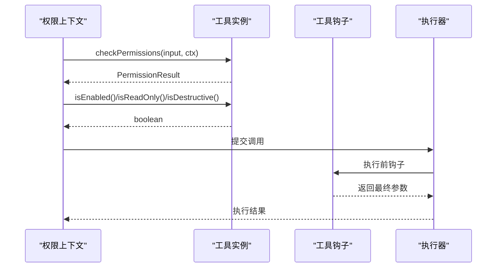
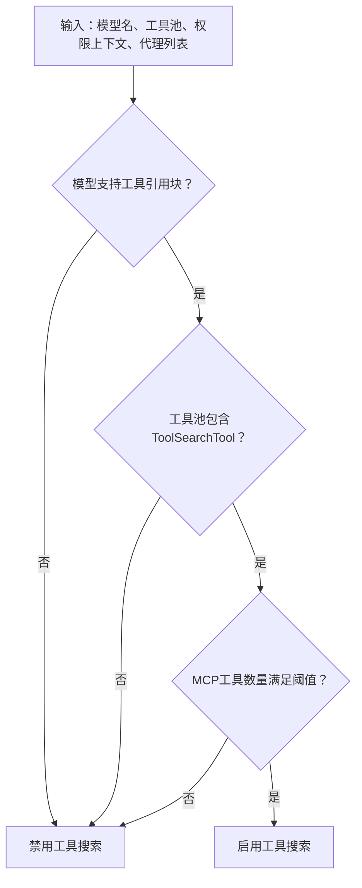
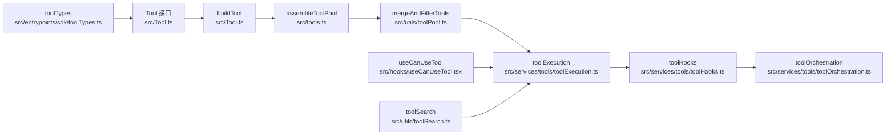

# 核心工具架构

<cite>
**本文引用的文件**
- [src/Tool.ts](file://src/Tool.ts)
- [src/tools.ts](file://src/tools.ts)
- [src/utils/toolPool.ts](file://src/utils/toolPool.ts)
- [src/utils/toolSearch.ts](file://src/utils/toolSearch.ts)
- [src/constants/tools.ts](file://src/constants/tools.ts)
- [src/services/tools/toolExecution.ts](file://src/services/tools/toolExecution.ts)
- [src/services/tools/toolHooks.ts](file://src/services/tools/toolHooks.ts)
- [src/services/tools/toolOrchestration.ts](file://src/services/tools/toolOrchestration.ts)
- [src/hooks/useMergedTools.ts](file://src/hooks/useMergedTools.ts)
- [src/hooks/useCanUseTool.tsx](file://src/hooks/useCanUseTool.tsx)
- [src/components/mcp/MCPServerDialog.tsx](file://src/components/mcp/MCPServerDialog.tsx)
- [src/QueryEngine.ts](file://src/QueryEngine.ts)
- [src/entrypoints/sdk/toolTypes.ts](file://src/entrypoints/sdk/toolTypes.ts)
- [src/types/tools.ts](file://src/types/tools.ts)
- [src/constants/toolLimits.ts](file://src/constants/toolLimits.ts)
</cite>

## 目录
1. [引言](#引言)
2. [项目结构](#项目结构)
3. [核心组件](#核心组件)
4. [架构总览](#架构总览)
5. [详细组件分析](#详细组件分析)
6. [依赖分析](#依赖分析)
7. [性能考虑](#性能考虑)
8. [故障排查指南](#故障排查指南)
9. [结论](#结论)
10. [附录](#附录)

## 引言
本文件系统性阐述核心工具架构的设计与实现，覆盖工具基类 Tool 的接口定义、工具注册与装配机制、工具池管理、生命周期与并发控制、条件加载与权限过滤、与查询引擎及会话管理的集成关系，并提供可直接定位到源码的参考路径，帮助开发者快速理解与扩展工具系统。

## 项目结构
工具系统围绕“工具定义—构建—装配—执行—权限与搜索—UI渲染”的完整链路组织，主要模块如下：
- 工具定义与构建：工具基类、工具构建器、默认行为与类型约束
- 工具池装配：内置工具与 MCP 工具合并、去重、排序与过滤
- 权限与条件：权限上下文、工具可用性判断、只读/破坏性标记、中断行为
- 搜索与延迟：基于模型能力的工具搜索开关、延迟工具池变更诊断
- 执行与编排：工具执行钩子、执行器、编排器
- 集成点：查询引擎、会话/代理、SDK 类型与常量

图表来源
- [src/Tool.ts:399-792](file://src/Tool.ts#L399-L792)
- [src/tools.ts:329-352](file://src/tools.ts#L329-L352)
- [src/utils/toolPool.ts:43-79](file://src/utils/toolPool.ts#L43-L79)
- [src/utils/toolSearch.ts:185-392](file://src/utils/toolSearch.ts#L185-L392)
- [src/services/tools/toolExecution.ts](file://src/services/tools/toolExecution.ts)
- [src/services/tools/toolHooks.ts](file://src/services/tools/toolHooks.ts)
- [src/services/tools/toolOrchestration.ts](file://src/services/tools/toolOrchestration.ts)
- [src/hooks/useCanUseTool.tsx](file://src/hooks/useCanUseTool.tsx)
- [src/QueryEngine.ts](file://src/QueryEngine.ts)
- [src/entrypoints/sdk/toolTypes.ts](file://src/entrypoints/sdk/toolTypes.ts)

章节来源
- [src/Tool.ts:399-792](file://src/Tool.ts#L399-L792)
- [src/tools.ts:329-352](file://src/tools.ts#L329-L352)
- [src/utils/toolPool.ts:43-79](file://src/utils/toolPool.ts#L43-L79)
- [src/utils/toolSearch.ts:185-392](file://src/utils/toolSearch.ts#L185-L392)

## 核心组件
- 工具基类与构建器
  - 工具接口包含输入输出模式、并发安全、只读/破坏性标记、权限检查、用户可见名、分组渲染等能力；通过构建器统一填充默认行为，确保一致性与安全性。
  - 参考路径：[src/Tool.ts:399-792](file://src/Tool.ts#L399-L792)
- 工具池装配
  - 将内置工具与 MCP 工具合并、去重（内置优先）、按名称排序、在协调者模式下进一步过滤。
  - 参考路径：[src/tools.ts:329-352](file://src/tools.ts#L329-L352)，[src/utils/toolPool.ts:43-79](file://src/utils/toolPool.ts#L43-L79)
- 权限与条件
  - 使用权限上下文进行工具可用性判定；支持只读/破坏性标记与中断行为；生命周期方法用于并发控制与资源管理。
  - 参考路径：[src/hooks/useCanUseTool.tsx](file://src/hooks/useCanUseTool.tsx)，[src/Tool.ts:399-792](file://src/Tool.ts#L399-L792)
- 搜索与延迟
  - 基于模型是否支持工具引用块、工具池中 ToolSearchTool 是否存在、阈值等综合判定是否启用工具搜索；对延迟工具池变更进行诊断记录。
  - 参考路径：[src/utils/toolSearch.ts:185-392](file://src/utils/toolSearch.ts#L185-L392)，[src/utils/toolSearch.ts:665-706](file://src/utils/toolSearch.ts#L665-L706)

章节来源
- [src/Tool.ts:399-792](file://src/Tool.ts#L399-L792)
- [src/tools.ts:329-352](file://src/tools.ts#L329-L352)
- [src/utils/toolPool.ts:43-79](file://src/utils/toolPool.ts#L43-L79)
- [src/utils/toolSearch.ts:185-392](file://src/utils/toolSearch.ts#L185-L392)
- [src/utils/toolSearch.ts:665-706](file://src/utils/toolSearch.ts#L665-L706)
- [src/hooks/useCanUseTool.tsx](file://src/hooks/useCanUseTool.tsx)

## 架构总览
工具系统采用“声明式定义 + 统一构建 + 分层装配 + 条件执行”的架构模式：
- 定义层：每个工具以最小必要字段声明自身能力与约束
- 构建层：通过构建器填充默认行为，保证安全与一致
- 装配层：内置与 MCP 工具在运行时合并、去重、排序、过滤
- 权限层：根据上下文动态决定工具可用性与交互行为
- 执行层：执行器与钩子负责生命周期管理、并发控制与错误处理
- 搜索层：依据模型能力与配置决定是否启用工具搜索与延迟

图表来源
- [src/tools.ts:329-352](file://src/tools.ts#L329-L352)
- [src/utils/toolPool.ts:43-79](file://src/utils/toolPool.ts#L43-L79)
- [src/hooks/useCanUseTool.tsx](file://src/hooks/useCanUseTool.tsx)
- [src/services/tools/toolExecution.ts](file://src/services/tools/toolExecution.ts)
- [src/services/tools/toolHooks.ts](file://src/services/tools/toolHooks.ts)
- [src/services/tools/toolOrchestration.ts](file://src/services/tools/toolOrchestration.ts)

## 详细组件分析

### 工具基类与构建器
- 接口要点
  - 输入/输出模式：使用 Zod 类型描述输入输出，便于校验与自动分类
  - 并发安全：isConcurrencySafe 控制是否允许并发执行
  - 只读/破坏性：isReadOnly/isDestructive 标记操作风险
  - 权限检查：checkPermissions 支持动态权限评估与输入修正
  - 用户可见名：userFacingName 用于 UI 展示
  - 中断行为：interruptBehavior 控制用户输入干扰时的行为
  - 分组渲染：renderGroupedToolUse 支持批量工具的聚合展示
- 默认行为
  - 失败关闭策略：isEnabled 默认开启；isConcurrencySafe 默认不安全；isReadOnly 默认写入；isDestructive 默认否
  - 权限默认：checkPermissions 默认放行并返回原输入
  - 自动分类：toAutoClassifierInput 默认跳过分类
  - 名称默认：userFacingName 默认回退为工具 name
- 构建器
  - buildTool 将默认值与用户定义合并，形成完整的 Tool 实例，避免分散的默认处理

图表来源
- [src/Tool.ts:399-792](file://src/Tool.ts#L399-L792)

章节来源
- [src/Tool.ts:399-792](file://src/Tool.ts#L399-L792)

### 工具池装配与合并
- 合并策略
  - 内置工具优先：当同名工具同时存在于内置与 MCP 时，内置版本优先
  - 去重与排序：按工具名进行去重，内置与 MCP 分区后分别排序
  - 协调者模式：在协调者模式下进一步应用工具过滤规则
- 关键函数
  - assembleToolPool：组装内置与 MCP 工具池
  - mergeAndFilterTools：合并、去重、排序与过滤
  - filterToolsByDenyRules：基于权限上下文的拒绝规则过滤

图表来源
- [src/tools.ts:329-352](file://src/tools.ts#L329-L352)
- [src/utils/toolPool.ts:43-79](file://src/utils/toolPool.ts#L43-L79)

章节来源
- [src/tools.ts:329-352](file://src/tools.ts#L329-L352)
- [src/utils/toolPool.ts:43-79](file://src/utils/toolPool.ts#L43-L79)

### 权限过滤与条件加载
- 权限上下文
  - 通过 useCanUseTool 等钩子获取当前工具使用的权限上下文
  - 工具可通过 checkPermissions 动态评估输入合法性与访问范围
- 条件加载
  - isEnabled 控制工具是否对用户可见或可调用
  - isReadOnly/isDestructive 用于 UI 与安全提示
  - interruptBehavior 控制并发输入干扰时的处理策略
- 生命周期
  - 工具可实现生命周期方法（如初始化/清理），由执行器与钩子协调调用

图表来源
- [src/hooks/useCanUseTool.tsx](file://src/hooks/useCanUseTool.tsx)
- [src/Tool.ts:399-792](file://src/Tool.ts#L399-L792)
- [src/services/tools/toolHooks.ts](file://src/services/tools/toolHooks.ts)
- [src/services/tools/toolExecution.ts](file://src/services/tools/toolExecution.ts)

章节来源
- [src/hooks/useCanUseTool.tsx](file://src/hooks/useCanUseTool.tsx)
- [src/Tool.ts:399-792](file://src/Tool.ts#L399-L792)

### 工具搜索与延迟策略
- 模型兼容性
  - modelSupportsToolReference 基于模型名模式判断是否支持工具引用块
- 搜索启用判定
  - isToolSearchEnabled 综合 MCP 工具数量、工具池可用性、阈值与 ToolSearchTool 存在性决定是否启用工具搜索
- 延迟工具池变更诊断
  - 对新增/移除的延迟工具进行统计与日志记录，辅助问题定位

图表来源
- [src/utils/toolSearch.ts:185-392](file://src/utils/toolSearch.ts#L185-L392)

章节来源
- [src/utils/toolSearch.ts:185-392](file://src/utils/toolSearch.ts#L185-L392)
- [src/utils/toolSearch.ts:665-706](file://src/utils/toolSearch.ts#L665-L706)

### 执行与编排
- 执行器
  - 负责工具调用的生命周期管理、并发控制、错误捕获与恢复
- 钩子
  - 在执行前后注入横切逻辑（如预处理、后处理、进度上报）
- 编排器
  - 协调多个工具的顺序、依赖与结果传递，适配不同场景（如代理工作流）

章节来源
- [src/services/tools/toolExecution.ts](file://src/services/tools/toolExecution.ts)
- [src/services/tools/toolHooks.ts](file://src/services/tools/toolHooks.ts)
- [src/services/tools/toolOrchestration.ts](file://src/services/tools/toolOrchestration.ts)

### 与查询引擎、会话/代理的集成
- 查询引擎
  - 工具执行结果作为查询过程的一部分参与上下文构建与响应生成
- 会话/代理
  - 工具池在会话启动时装配，权限上下文随会话状态变化而动态调整
- SDK 类型
  - SDK 提供工具类型定义，确保外部扩展与核心类型一致

章节来源
- [src/QueryEngine.ts](file://src/QueryEngine.ts)
- [src/entrypoints/sdk/toolTypes.ts](file://src/entrypoints/sdk/toolTypes.ts)

## 依赖分析
- 组件耦合
  - 工具定义与构建器低耦合，通过统一接口与构建器实现高内聚
  - 装配层依赖权限上下文与工具常量，但不直接依赖具体工具实现
  - 执行层依赖钩子与编排器，形成清晰的职责边界
- 外部依赖
  - 模型能力检测依赖特征开关与环境变量
  - MCP 工具通过对话框与状态管理进行动态接入

图表来源
- [src/Tool.ts:399-792](file://src/Tool.ts#L399-L792)
- [src/tools.ts:329-352](file://src/tools.ts#L329-L352)
- [src/utils/toolPool.ts:43-79](file://src/utils/toolPool.ts#L43-L79)
- [src/services/tools/toolExecution.ts](file://src/services/tools/toolExecution.ts)
- [src/services/tools/toolHooks.ts](file://src/services/tools/toolHooks.ts)
- [src/services/tools/toolOrchestration.ts](file://src/services/tools/toolOrchestration.ts)
- [src/hooks/useCanUseTool.tsx](file://src/hooks/useCanUseTool.tsx)
- [src/utils/toolSearch.ts:185-392](file://src/utils/toolSearch.ts#L185-L392)
- [src/entrypoints/sdk/toolTypes.ts](file://src/entrypoints/sdk/toolTypes.ts)

章节来源
- [src/Tool.ts:399-792](file://src/Tool.ts#L399-L792)
- [src/tools.ts:329-352](file://src/tools.ts#L329-L352)
- [src/utils/toolPool.ts:43-79](file://src/utils/toolPool.ts#L43-L79)
- [src/services/tools/toolExecution.ts](file://src/services/tools/toolExecution.ts)
- [src/services/tools/toolHooks.ts](file://src/services/tools/toolHooks.ts)
- [src/services/tools/toolOrchestration.ts](file://src/services/tools/toolOrchestration.ts)
- [src/hooks/useCanUseTool.tsx](file://src/hooks/useCanUseTool.tsx)
- [src/utils/toolSearch.ts:185-392](file://src/utils/toolSearch.ts#L185-L392)
- [src/entrypoints/sdk/toolTypes.ts](file://src/entrypoints/sdk/toolTypes.ts)

## 性能考虑
- 工具池装配
  - 合并与去重采用分区排序策略，保证提示缓存稳定性与确定性
- 并发控制
  - 通过 isConcurrencySafe 显式声明安全策略，默认不安全，避免竞态
- 权限检查
  - 将权限评估前置到调用前，减少无效执行开销
- 搜索启用
  - 基于模型能力与阈值快速短路，避免不必要的工具引用块生成

## 故障排查指南
- 工具未显示或不可用
  - 检查 isEnabled 与权限上下文；确认工具是否被拒绝规则过滤
  - 参考路径：[src/hooks/useCanUseTool.tsx](file://src/hooks/useCanUseTool.tsx)，[src/tools.ts:329-352](file://src/tools.ts#L329-L352)
- 工具执行失败或中断
  - 查看 interruptBehavior 设置与并发冲突；检查执行器与钩子日志
  - 参考路径：[src/Tool.ts:399-792](file://src/Tool.ts#L399-L792)，[src/services/tools/toolExecution.ts](file://src/services/tools/toolExecution.ts)，[src/services/tools/toolHooks.ts](file://src/services/tools/toolHooks.ts)
- 工具搜索未生效
  - 确认模型是否支持工具引用块、工具池是否包含 ToolSearchTool、阈值是否满足
  - 参考路径：[src/utils/toolSearch.ts:185-392](file://src/utils/toolSearch.ts#L185-L392)
- 延迟工具池变更异常
  - 检查变更诊断日志，定位新增/移除工具的统计信息
  - 参考路径：[src/utils/toolSearch.ts:665-706](file://src/utils/toolSearch.ts#L665-L706)

章节来源
- [src/hooks/useCanUseTool.tsx](file://src/hooks/useCanUseTool.tsx)
- [src/tools.ts:329-352](file://src/tools.ts#L329-L352)
- [src/Tool.ts:399-792](file://src/Tool.ts#L399-L792)
- [src/services/tools/toolExecution.ts](file://src/services/tools/toolExecution.ts)
- [src/services/tools/toolHooks.ts](file://src/services/tools/toolHooks.ts)
- [src/utils/toolSearch.ts:185-392](file://src/utils/toolSearch.ts#L185-L392)
- [src/utils/toolSearch.ts:665-706](file://src/utils/toolSearch.ts#L665-L706)

## 结论
该工具架构以“声明式 + 统一构建 + 分层装配 + 条件执行”为核心设计思想，在保证安全性与一致性的同时，提供了灵活的扩展点与强大的运行时控制能力。通过明确的生命周期、权限与并发控制、以及与查询引擎和会话系统的深度集成，工具系统能够稳定支撑复杂场景下的自动化与智能决策需求。

## 附录
- 常用工具类型与常量
  - 参考路径：[src/types/tools.ts](file://src/types/tools.ts)，[src/constants/tools.ts](file://src/constants/tools.ts)
- 工具限制与配额
  - 参考路径：[src/constants/toolLimits.ts](file://src/constants/toolLimits.ts)
- MCP 服务器接入与对话框
  - 参考路径：[src/components/mcp/MCPServerDialog.tsx](file://src/components/mcp/MCPServerDialog.tsx)