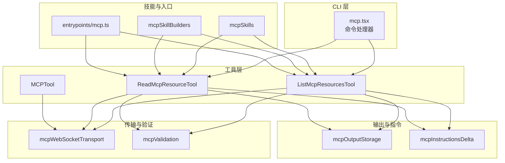
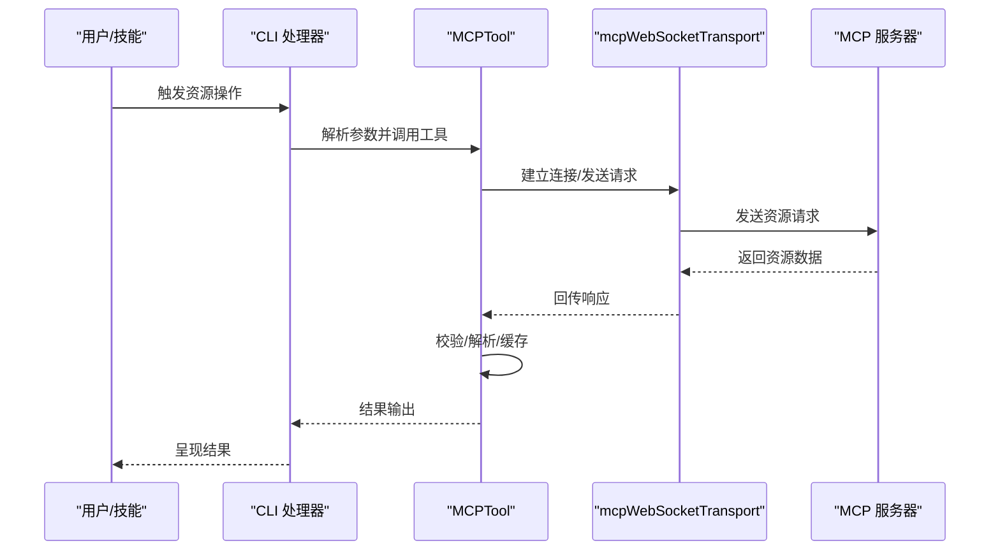
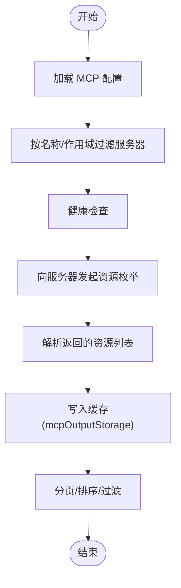
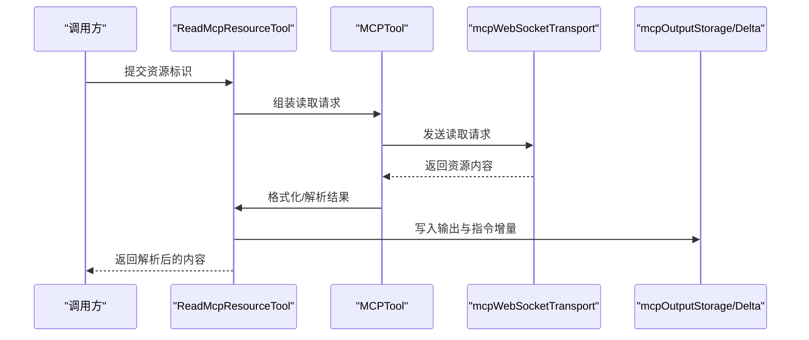
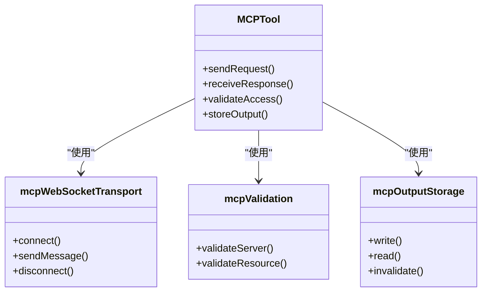
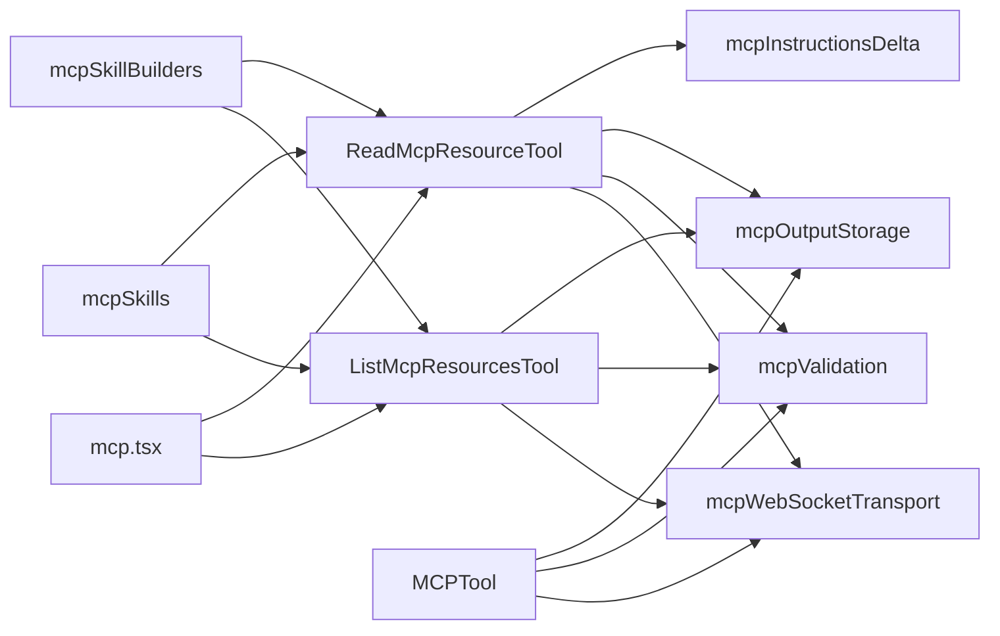

# MCP 资源工具

<cite>
**本文引用的文件**
- [ListMcpResourcesTool.ts](file://src/tools/ListMcpResourcesTool/ListMcpResourcesTool.ts)
- [ReadMcpResourceTool.ts](file://src/tools/ReadMcpResourceTool/ReadMcpResourceTool.ts)
- [MCPTool.ts](file://src/tools/MCPTool/MCPTool.ts)
- [mcp.tsx](file://src/cli/handlers/mcp.tsx)
- [mcp.ts](file://src/entrypoints/mcp.ts)
- [mcpValidation.ts](file://src/utils/mcpValidation.ts)
- [mcpWebSocketTransport.ts](file://src/utils/mcpWebSocketTransport.ts)
- [mcpOutputStorage.ts](file://src/utils/mcpOutputStorage.ts)
- [mcpInstructionsDelta.ts](file://src/utils/mcpInstructionsDelta.ts)
- [mcpServer.ts（计算机使用）](file://src/utils/computerUse/mcpServer.ts)
- [mcpServer.ts（Chrome 扩展）](file://src/utils/claudeInChrome/mcpServer.ts)
- [mcpSkills.ts](file://src/skills/mcpSkills.ts)
- [mcpSkillBuilders.ts](file://src/skills/mcpSkillBuilders.ts)
- [types.ts](file://src/types/tools.ts)
- [types.ts](file://src/types/generated/mcp.ts)
</cite>

## 目录
1. [简介](#简介)
2. [项目结构](#项目结构)
3. [核心组件](#核心组件)
4. [架构总览](#架构总览)
5. [详细组件分析](#详细组件分析)
6. [依赖关系分析](#依赖关系分析)
7. [性能考量](#性能考量)
8. [故障排除指南](#故障排除指南)
9. [结论](#结论)
10. [附录](#附录)

## 简介
本文件聚焦于 MCP（Model Context Protocol）资源工具链：ListMcpResourcesTool 与 ReadMcpResourceTool。前者负责在已配置的 MCP 服务器中发现与枚举可用资源；后者负责从指定服务器读取并解析目标资源内容。文档将系统阐述：
- 资源发现与枚举机制
- 资源读取与解析流程
- MCP 协议的资源管理、权限控制与访问模式
- 使用示例、配置选项与故障排除
- 资源缓存策略与性能优化技巧

## 项目结构
围绕 MCP 资源工具的相关模块分布如下：
- 工具实现层：ListMcpResourcesTool、ReadMcpResourceTool、MCPTool
- CLI 层：mcp 命令处理器，用于列出/获取 MCP 服务器状态
- 传输与验证：mcpWebSocketTransport、mcpValidation
- 输出与指令：mcpOutputStorage、mcpInstructionsDelta
- 技能与入口：mcpSkills、mcpSkillBuilders、entrypoints/mcp.ts
- 类型定义：tools.ts、generated/mcp.ts

图表来源
- [ListMcpResourcesTool.ts](file://src/tools/ListMcpResourcesTool/ListMcpResourcesTool.ts)
- [ReadMcpResourceTool.ts](file://src/tools/ReadMcpResourceTool/ReadMcpResourceTool.ts)
- [MCPTool.ts](file://src/tools/MCPTool/MCPTool.ts)
- [mcp.tsx](file://src/cli/handlers/mcp.tsx)
- [mcpWebSocketTransport.ts](file://src/utils/mcpWebSocketTransport.ts)
- [mcpValidation.ts](file://src/utils/mcpValidation.ts)
- [mcpOutputStorage.ts](file://src/utils/mcpOutputStorage.ts)
- [mcpInstructionsDelta.ts](file://src/utils/mcpInstructionsDelta.ts)
- [mcpSkills.ts](file://src/skills/mcpSkills.ts)
- [mcpSkillBuilders.ts](file://src/skills/mcpSkillBuilders.ts)
- [mcp.ts](file://src/entrypoints/mcp.ts)

章节来源
- [ListMcpResourcesTool.ts](file://src/tools/ListMcpResourcesTool/ListMcpResourcesTool.ts)
- [ReadMcpResourceTool.ts](file://src/tools/ReadMcpResourceTool/ReadMcpResourceTool.ts)
- [mcp.tsx](file://src/cli/handlers/mcp.tsx)

## 核心组件
- ListMcpResourcesTool：列举 MCP 服务器提供的资源清单，支持过滤、分页与错误处理。
- ReadMcpResourceTool：根据资源标识从服务器读取资源内容，并进行格式化与解析。
- MCPTool：通用 MCP 工具封装，协调传输、权限与输出存储。

章节来源
- [ListMcpResourcesTool.ts](file://src/tools/ListMcpResourcesTool/ListMcpResourcesTool.ts)
- [ReadMcpResourceTool.ts](file://src/tools/ReadMcpResourceTool/ReadMcpResourceTool.ts)
- [MCPTool.ts](file://src/tools/MCPTool/MCPTool.ts)

## 架构总览
MCP 资源工具通过 CLI 或技能入口被调用，经由 MCPTool 统一调度，借助 mcpWebSocketTransport 建立与服务器的连接，使用 mcpValidation 进行参数与权限校验，最终通过 mcpOutputStorage 与 mcpInstructionsDelta 管理输出与指令增量更新。

图表来源
- [mcp.tsx](file://src/cli/handlers/mcp.tsx)
- [MCPTool.ts](file://src/tools/MCPTool/MCPTool.ts)
- [mcpWebSocketTransport.ts](file://src/utils/mcpWebSocketTransport.ts)

## 详细组件分析

### ListMcpResourcesTool：资源发现与枚举
职责与流程
- 从已配置的 MCP 服务器集合中，按名称或作用域筛选目标服务器。
- 向服务器发起资源枚举请求，接收资源列表并进行本地缓存。
- 提供过滤、排序与分页能力，避免一次性加载过多资源。
- 对异常与无响应服务器进行降级处理与提示。

关键实现要点
- 服务器选择与健康检查：结合 CLI 层的服务器状态检查逻辑，确保仅对健康服务器执行枚举。
- 列表缓存：利用 mcpOutputStorage 缓存资源清单，减少重复请求。
- 错误处理：对网络超时、协议不匹配、权限不足等情况进行分类处理与用户提示。

图表来源
- [ListMcpResourcesTool.ts](file://src/tools/ListMcpResourcesTool/ListMcpResourcesTool.ts)
- [mcp.tsx](file://src/cli/handlers/mcp.tsx)
- [mcpOutputStorage.ts](file://src/utils/mcpOutputStorage.ts)

章节来源
- [ListMcpResourcesTool.ts](file://src/tools/ListMcpResourcesTool/ListMcpResourcesTool.ts)
- [mcp.tsx](file://src/cli/handlers/mcp.tsx)

### ReadMcpResourceTool：资源读取与解析
职责与流程
- 接收资源标识（如 URI），通过 MCPTool 发起读取请求。
- 依据资源类型与内容格式进行解析（文本、JSON、二进制等）。
- 将解析后的数据写入输出存储，支持增量指令更新与回溯。

关键实现要点
- 传输安全：通过 mcpWebSocketTransport 建立受控通道，确保凭据与权限符合要求。
- 内容解析：根据 Content-Type 或扩展名判断格式，必要时进行解码与结构化处理。
- 指令集成：使用 mcpInstructionsDelta 记录与合并指令变更，便于后续审计与回放。

图表来源
- [ReadMcpResourceTool.ts](file://src/tools/ReadMcpResourceTool/ReadMcpResourceTool.ts)
- [MCPTool.ts](file://src/tools/MCPTool/MCPTool.ts)
- [mcpWebSocketTransport.ts](file://src/utils/mcpWebSocketTransport.ts)
- [mcpOutputStorage.ts](file://src/utils/mcpOutputStorage.ts)
- [mcpInstructionsDelta.ts](file://src/utils/mcpInstructionsDelta.ts)

章节来源
- [ReadMcpResourceTool.ts](file://src/tools/ReadMcpResourceTool/ReadMcpResourceTool.ts)
- [MCPTool.ts](file://src/tools/MCPTool/MCPTool.ts)

### MCPTool：统一工具封装
职责与流程
- 负责与传输层交互，统一封装请求/响应生命周期。
- 协调权限校验与输出存储，为上层工具提供一致接口。

图表来源
- [MCPTool.ts](file://src/tools/MCPTool/MCPTool.ts)
- [mcpWebSocketTransport.ts](file://src/utils/mcpWebSocketTransport.ts)
- [mcpValidation.ts](file://src/utils/mcpValidation.ts)
- [mcpOutputStorage.ts](file://src/utils/mcpOutputStorage.ts)

章节来源
- [MCPTool.ts](file://src/tools/MCPTool/MCPTool.ts)

## 依赖关系分析
- 工具层依赖传输与验证模块，确保请求安全与合法。
- CLI 层与技能层通过统一入口调用工具，形成清晰的调用链。
- 输出与指令模块贯穿工具生命周期，支撑缓存与审计。

图表来源
- [ListMcpResourcesTool.ts](file://src/tools/ListMcpResourcesTool/ListMcpResourcesTool.ts)
- [ReadMcpResourceTool.ts](file://src/tools/ReadMcpResourceTool/ReadMcpResourceTool.ts)
- [MCPTool.ts](file://src/tools/MCPTool/MCPTool.ts)
- [mcp.tsx](file://src/cli/handlers/mcp.tsx)
- [mcpWebSocketTransport.ts](file://src/utils/mcpWebSocketTransport.ts)
- [mcpValidation.ts](file://src/utils/mcpValidation.ts)
- [mcpOutputStorage.ts](file://src/utils/mcpOutputStorage.ts)
- [mcpInstructionsDelta.ts](file://src/utils/mcpInstructionsDelta.ts)
- [mcpSkills.ts](file://src/skills/mcpSkills.ts)
- [mcpSkillBuilders.ts](file://src/skills/mcpSkillBuilders.ts)

章节来源
- [ListMcpResourcesTool.ts](file://src/tools/ListMcpResourcesTool/ListMcpResourcesTool.ts)
- [ReadMcpResourceTool.ts](file://src/tools/ReadMcpResourceTool/ReadMcpResourceTool.ts)
- [mcp.tsx](file://src/cli/handlers/mcp.tsx)

## 性能考量
- 缓存策略
  - 清单缓存：对资源列表采用短期缓存，结合 TTL 与失效策略，降低重复枚举开销。
  - 输出缓存：对已解析内容进行持久化，避免重复读取与解析。
- 分页与批量
  - 列表枚举支持分页，按需加载，减少内存占用与网络压力。
- 传输优化
  - 复用 WebSocket 连接，减少握手成本；对高并发场景进行队列化与背压控制。
- 指令增量
  - 使用 mcpInstructionsDelta 记录最小变更，便于快速回滚与审计。

[本节为通用性能建议，无需特定文件引用]

## 故障排除指南
常见问题与处理
- 服务器不可达
  - 现象：枚举/读取失败，提示连接超时或拒绝。
  - 处理：检查服务器健康状态与网络连通性；确认 mcpValidation 中的权限与证书配置。
- 权限不足
  - 现象：返回权限错误或资源被拒。
  - 处理：核对服务器作用域与授权范围；必要时重新授权或调整配置。
- 资源格式异常
  - 现象：解析失败或内容为空。
  - 处理：确认 Content-Type 与扩展名一致性；检查 mcpOutputStorage 是否正确写入。
- 缓存污染
  - 现象：旧数据导致读取异常。
  - 处理：清理 mcpOutputStorage 缓存；设置合理的失效策略。

章节来源
- [mcpValidation.ts](file://src/utils/mcpValidation.ts)
- [mcpOutputStorage.ts](file://src/utils/mcpOutputStorage.ts)
- [mcp.tsx](file://src/cli/handlers/mcp.tsx)

## 结论
MCP 资源工具通过标准化的工具封装与传输验证，实现了资源发现、读取与解析的完整闭环。配合缓存与增量指令机制，能够在保证安全性的同时提升性能与可维护性。建议在生产环境中启用严格的权限控制与健康检查，并结合缓存策略与分页机制以获得最佳体验。

[本节为总结性内容，无需特定文件引用]

## 附录

### 使用示例
- 列出所有 MCP 服务器及其状态
  - 通过 CLI 处理器触发服务器列表与健康检查。
- 枚举指定服务器的资源
  - 在工具层发起资源枚举请求，结合过滤与分页。
- 读取指定资源并解析
  - 提交资源标识，工具自动解析并写入输出存储。

章节来源
- [mcp.tsx](file://src/cli/handlers/mcp.tsx)
- [ListMcpResourcesTool.ts](file://src/tools/ListMcpResourcesTool/ListMcpResourcesTool.ts)
- [ReadMcpResourceTool.ts](file://src/tools/ReadMcpResourceTool/ReadMcpResourceTool.ts)

### 配置选项
- 服务器配置
  - 名称、作用域、地址、凭据与 TLS 设置。
- 工具参数
  - 资源标识、过滤条件、分页大小、缓存策略。
- 安全与权限
  - 作用域白名单、权限回调、授权范围。

章节来源
- [mcp.tsx](file://src/cli/handlers/mcp.tsx)
- [mcpValidation.ts](file://src/utils/mcpValidation.ts)
- [types.ts](file://src/types/tools.ts)

### MCP 协议与访问模式
- 资源管理
  - 通过统一的枚举与读取接口管理资源生命周期。
- 权限控制
  - 基于作用域与授权范围限制资源访问。
- 访问模式
  - 受控传输通道（WebSocket）、幂等读取、增量指令更新。

章节来源
- [mcpWebSocketTransport.ts](file://src/utils/mcpWebSocketTransport.ts)
- [mcpInstructionsDelta.ts](file://src/utils/mcpInstructionsDelta.ts)
- [types.ts](file://src/types/generated/mcp.ts)