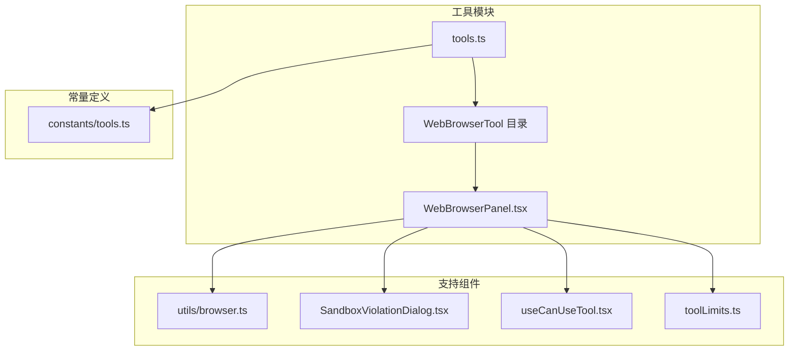
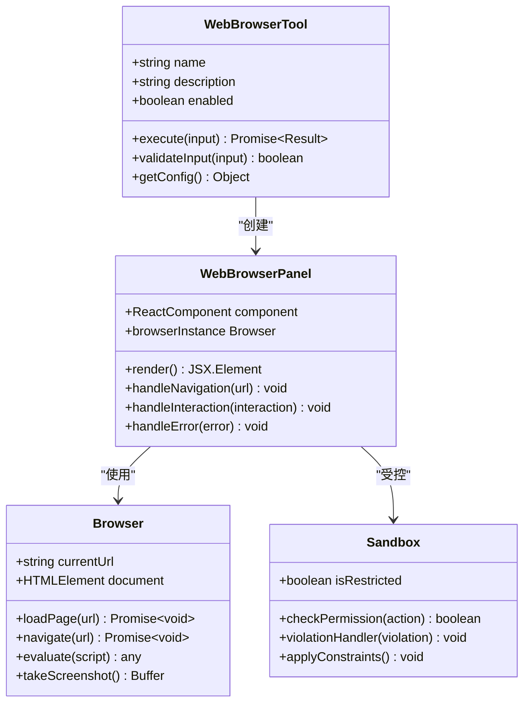
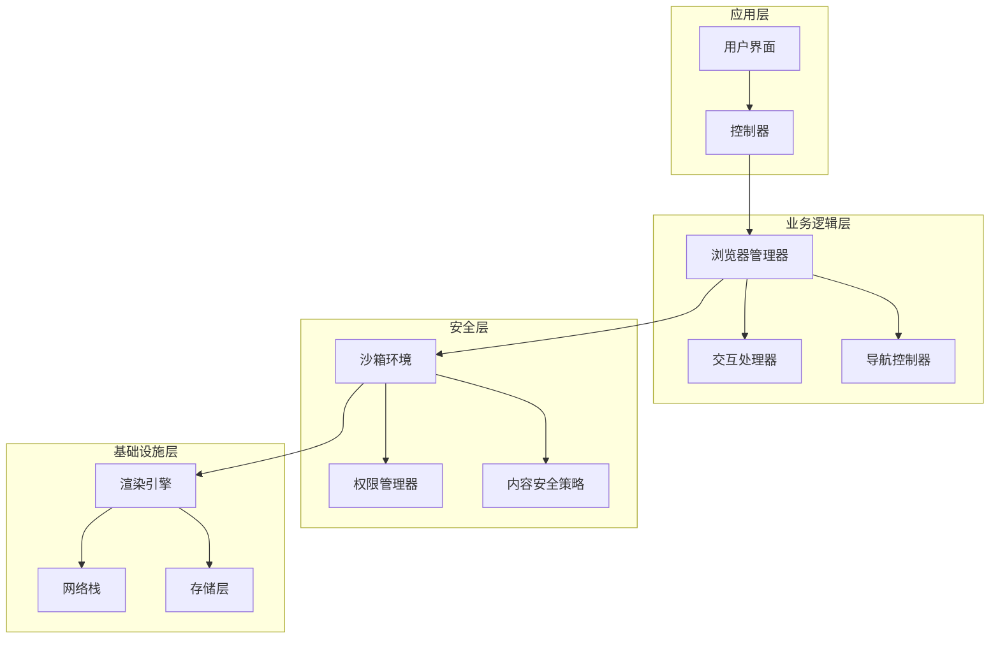
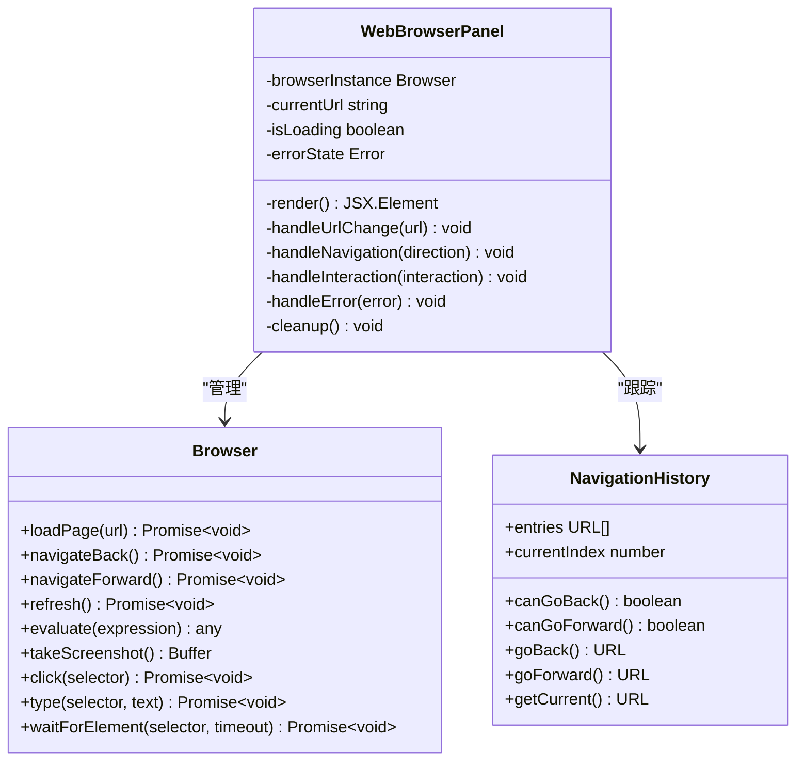
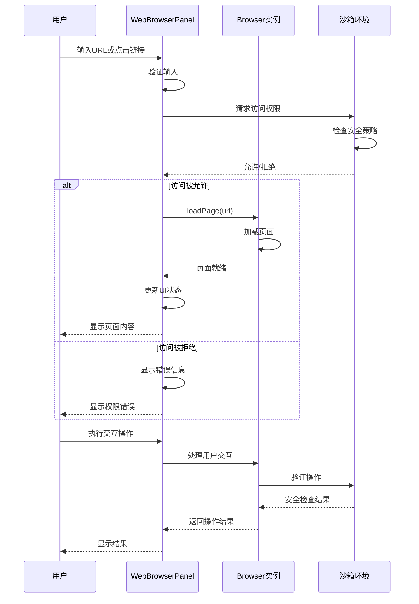
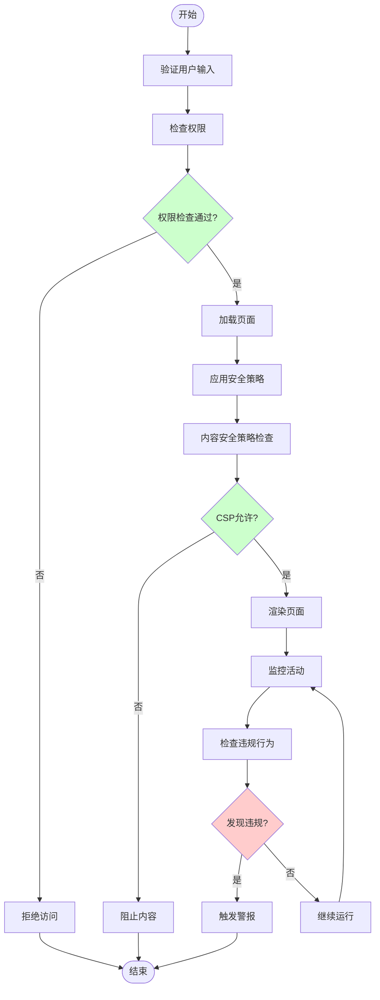
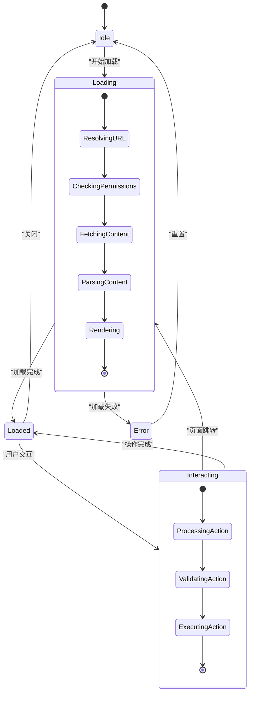
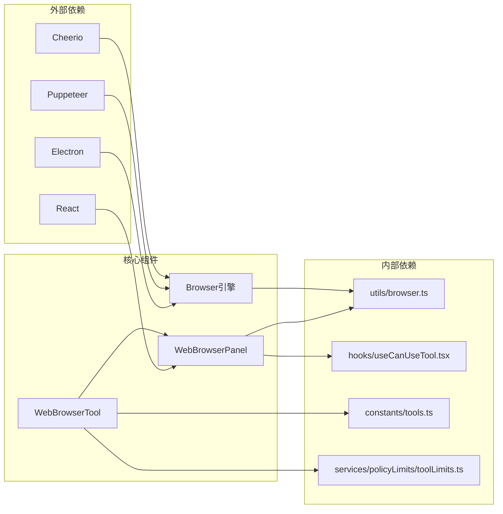

# WebBrowserTool 浏览器工具

<cite>
**本文档引用的文件**
- [src/tools.ts](file://src/tools.ts)
- [src/constants/tools.ts](file://src/constants/tools.ts)
- [src/tools/WebBrowserTool/WebBrowserPanel.tsx](file://src/tools/WebBrowserTool/WebBrowserPanel.tsx)
- [src/utils/browser.ts](file://src/utils/browser.ts)
- [src/components/sandbox/SandboxViolationDialog.tsx](file://src/components/sandbox/SandboxViolationDialog.tsx)
- [src/hooks/useCanUseTool.tsx](file://src/hooks/useCanUseTool.tsx)
- [src/services/policyLimits/toolLimits.ts](file://src/services/policyLimits/toolLimits.ts)
</cite>

## 目录
1. [简介](#简介)
2. [项目结构](#项目结构)
3. [核心组件](#核心组件)
4. [架构概览](#架构概览)
5. [详细组件分析](#详细组件分析)
6. [依赖关系分析](#依赖关系分析)
7. [性能考虑](#性能考虑)
8. [故障排除指南](#故障排除指南)
9. [结论](#结论)

## 简介

WebBrowserTool 是 Claude Code 中的一个浏览器模拟工具，允许在受控环境中执行网页浏览任务。该工具提供了安全的浏览器环境，支持页面渲染、用户交互和导航控制，同时实施严格的安全沙箱机制来防止恶意操作。

该工具的核心目标是在保证安全性的前提下，为 AI 系统提供网页浏览能力，使其能够执行网页搜索、数据提取、表单填写等常见浏览器操作。

## 项目结构

WebBrowserTool 在项目中的组织结构如下：

**图表来源**
- [src/tools.ts:116-216](file://src/tools.ts#L116-L216)
- [src/tools/WebBrowserTool/WebBrowserPanel.tsx](file://src/tools/WebBrowserTool/WebBrowserPanel.tsx)

**章节来源**
- [src/tools.ts:116-216](file://src/tools.ts#L116-L216)
- [src/constants/tools.ts](file://src/constants/tools.ts)

## 核心组件

WebBrowserTool 的核心组件包括：

### 主要组件层次

**图表来源**
- [src/tools/WebBrowserTool/WebBrowserPanel.tsx](file://src/tools/WebBrowserTool/WebBrowserPanel.tsx)
- [src/utils/browser.ts](file://src/utils/browser.ts)

### 配置参数

WebBrowserTool 支持以下配置参数：

| 参数名称 | 类型 | 默认值 | 描述 |
|---------|------|--------|------|
| timeout | number | 30000 | 页面加载超时时间（毫秒） |
| userAgent | string | 自动检测 | 浏览器用户代理字符串 |
| viewport | object | {width: 1280, height: 720} | 视口尺寸设置 |
| incognito | boolean | true | 是否启用隐身模式 |
| blockAds | boolean | true | 是否阻止广告资源 |
| blockImages | boolean | false | 是否阻止图片加载 |
| maxRedirects | number | 5 | 最大重定向次数 |

**章节来源**
- [src/tools.ts:116-216](file://src/tools.ts#L116-L216)
- [src/constants/tools.ts](file://src/constants/tools.ts)

## 架构概览

WebBrowserTool 采用分层架构设计，确保安全性与功能性并重：

**图表来源**
- [src/tools/WebBrowserTool/WebBrowserPanel.tsx](file://src/tools/WebBrowserTool/WebBrowserPanel.tsx)
- [src/utils/browser.ts](file://src/utils/browser.ts)

## 详细组件分析

### WebBrowserPanel 组件

WebBrowserPanel 是浏览器工具的主要用户界面组件，负责处理用户交互和显示浏览器内容。

#### 组件架构

**图表来源**
- [src/tools/WebBrowserTool/WebBrowserPanel.tsx](file://src/tools/WebBrowserTool/WebBrowserPanel.tsx)

#### 用户交互流程

**图表来源**
- [src/tools/WebBrowserTool/WebBrowserPanel.tsx](file://src/tools/WebBrowserTool/WebBrowserPanel.tsx)
- [src/utils/browser.ts](file://src/utils/browser.ts)

**章节来源**
- [src/tools/WebBrowserTool/WebBrowserPanel.tsx](file://src/tools/WebBrowserTool/WebBrowserPanel.tsx)

### 浏览器安全沙箱

WebBrowserTool 实施了多层安全防护机制：

#### 沙箱架构

**图表来源**
- [src/components/sandbox/SandboxViolationDialog.tsx](file://src/components/sandbox/SandboxViolationDialog.tsx)

#### 跨域访问限制

WebBrowserTool 对跨域请求实施严格的限制：

| 域类型 | 访问策略 | 例外情况 |
|--------|----------|----------|
| 同源 | 允许 | 无 |
| 第三方脚本 | 阻止 | 仅允许必要的安全脚本 |
| 外部资源 | 限制 | 仅允许白名单内的资源 |
| WebSocket | 受控 | 需要明确授权 |
| 文件下载 | 阻止 | 除非明确允许 |
| 表单提交 | 受控 | 需要用户确认 |

**章节来源**
- [src/components/sandbox/SandboxViolationDialog.tsx](file://src/components/sandbox/SandboxViolationDialog.tsx)

### 导航控制机制

WebBrowserTool 提供了完整的导航控制功能：

#### 导航状态管理

**图表来源**
- [src/tools/WebBrowserTool/WebBrowserPanel.tsx](file://src/tools/WebBrowserTool/WebBrowserPanel.tsx)

## 依赖关系分析

WebBrowserTool 的依赖关系图展示了各组件之间的相互作用：

**图表来源**
- [src/tools.ts:116-216](file://src/tools.ts#L116-L216)
- [src/tools/WebBrowserTool/WebBrowserPanel.tsx](file://src/tools/WebBrowserTool/WebBrowserPanel.tsx)

**章节来源**
- [src/tools.ts:116-216](file://src/tools.ts#L116-L216)

## 性能考虑

WebBrowserTool 在设计时充分考虑了性能优化：

### 性能优化策略

1. **懒加载机制**：浏览器实例按需创建，避免不必要的资源消耗
2. **内存管理**：定期清理 DOM 引用和事件监听器
3. **缓存策略**：对常用资源进行缓存，减少重复加载
4. **并发控制**：限制同时进行的页面请求数量
5. **资源压缩**：自动压缩传输的数据

### 性能监控指标

| 指标类型 | 目标值 | 监控方法 |
|----------|--------|----------|
| 页面加载时间 | < 5 秒 | 使用浏览器内置性能 API |
| 内存使用 | < 100MB | 监控进程内存使用 |
| CPU 占用 | < 50% | 监控主线程执行时间 |
| 并发请求数 | < 5 | 限制同时请求数量 |
| 错误率 | < 1% | 监控异常发生频率 |

## 故障排除指南

### 常见问题及解决方案

#### 页面加载失败

**问题描述**：页面无法正常加载或加载超时

**可能原因**：
- 网络连接问题
- 目标网站不可访问
- 安全策略阻止访问
- 超时设置过短

**解决步骤**：
1. 检查网络连接状态
2. 验证目标 URL 的有效性
3. 查看安全日志了解阻止原因
4. 调整超时参数设置

#### 权限被拒绝

**问题描述**：访问某些网站或功能时被拒绝

**可能原因**：
- 内容安全策略限制
- 用户代理被识别为自动化工具
- IP 地址被列入黑名单

**解决步骤**：
1. 检查 CSP 设置
2. 修改用户代理字符串
3. 尝试使用代理服务器
4. 联系管理员调整权限

#### 性能问题

**问题描述**：浏览器响应缓慢或内存占用过高

**可能原因**：
- 同时运行的页面过多
- 缺少适当的缓存机制
- 资源未正确释放

**解决步骤**：
1. 减少并发页面数量
2. 实施更有效的缓存策略
3. 检查内存泄漏问题
4. 优化资源加载顺序

**章节来源**
- [src/components/sandbox/SandboxViolationDialog.tsx](file://src/components/sandbox/SandboxViolationDialog.tsx)
- [src/hooks/useCanUseTool.tsx](file://src/hooks/useCanUseTool.tsx)

## 结论

WebBrowserTool 作为一个安全可控的浏览器模拟工具，在 Claude Code 生态系统中发挥着重要作用。其设计特点包括：

1. **安全性优先**：通过多层沙箱机制确保操作安全
2. **功能完整性**：提供完整的浏览器功能集
3. **性能优化**：采用多种优化策略提升运行效率
4. **易于集成**：标准化的接口设计便于系统集成

该工具为 AI 系统提供了可靠的网页浏览能力，同时确保了系统的整体安全性。随着技术的发展，WebBrowserTool 还可以进一步优化其性能表现，并扩展更多高级功能来满足不同场景的需求。