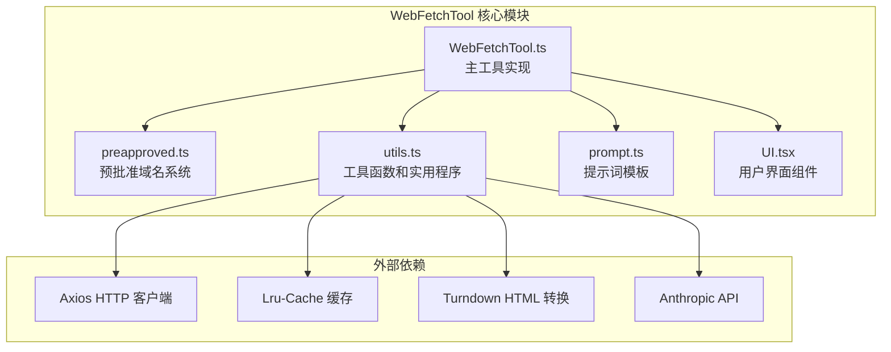
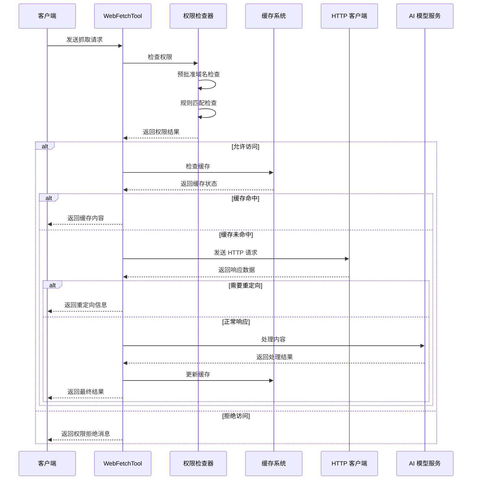
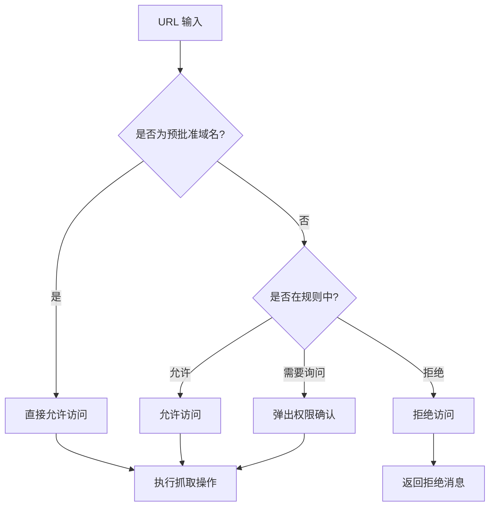
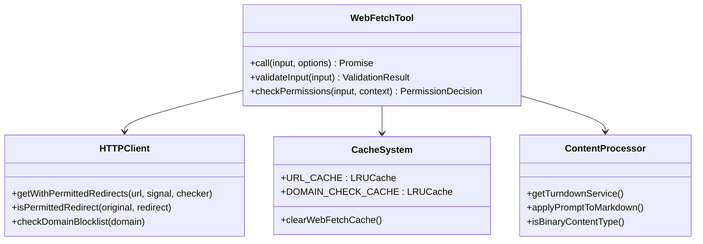
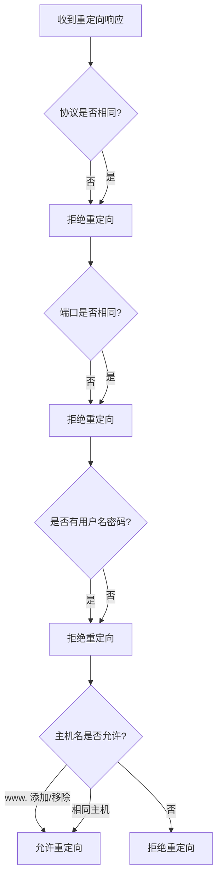
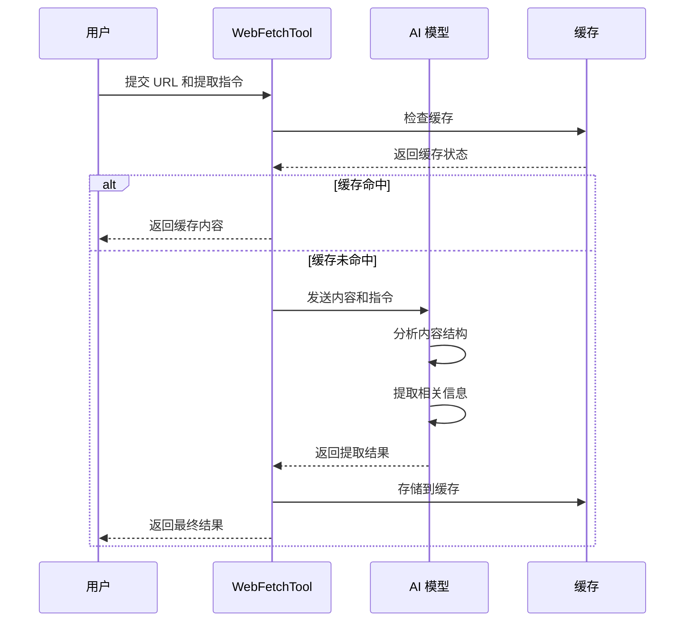
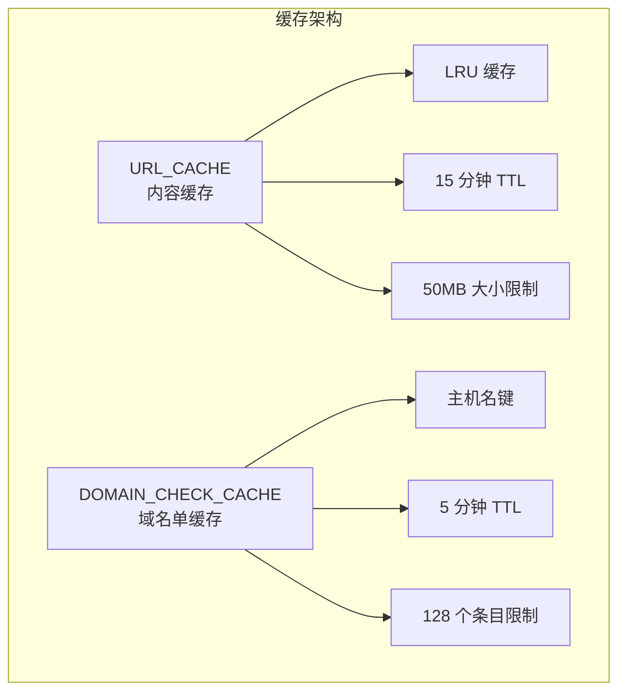
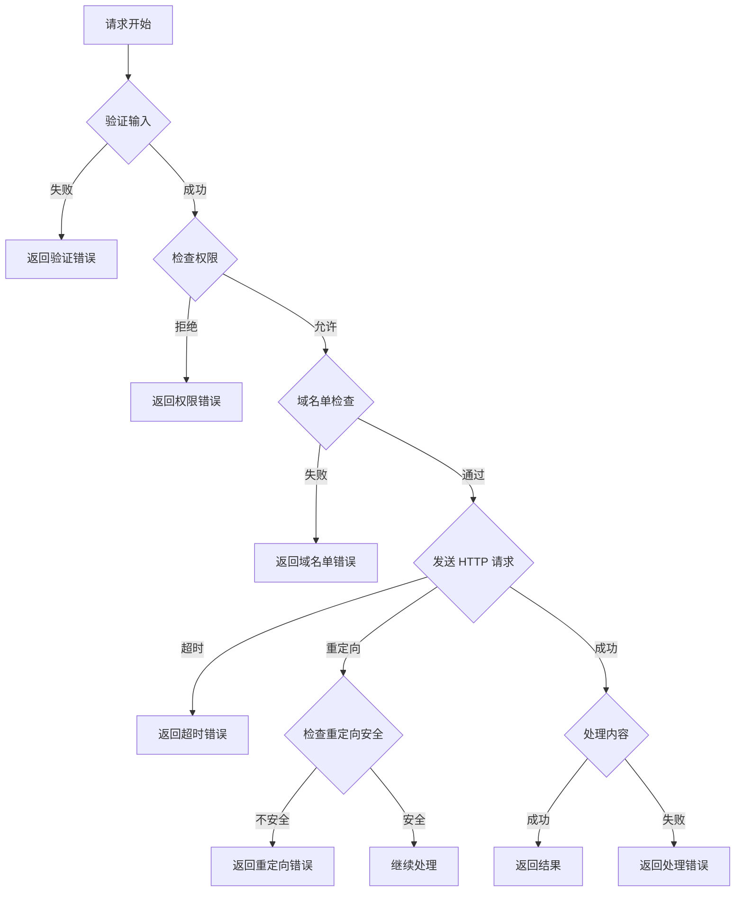

# WebFetchTool 抓取工具

<cite>
**本文档引用的文件**
- [WebFetchTool.ts](file://src/tools/WebFetchTool/WebFetchTool.ts)
- [preapproved.ts](file://src/tools/WebFetchTool/preapproved.ts)
- [utils.ts](file://src/tools/WebFetchTool/utils.ts)
- [UI.tsx](file://src/tools/WebFetchTool/UI.tsx)
- [prompt.ts](file://src/tools/WebFetchTool/prompt.ts)
- [caches.ts](file://src/commands/clear/caches.ts)
</cite>

## 目录
1. [简介](#简介)
2. [项目结构](#项目结构)
3. [核心组件](#核心组件)
4. [架构概览](#架构概览)
5. [详细组件分析](#详细组件分析)
6. [依赖关系分析](#依赖关系分析)
7. [性能考虑](#性能考虑)
8. [故障排除指南](#故障排除指南)
9. [结论](#结论)

## 简介

WebFetchTool 是一个专为 Claude Code 设计的网页内容抓取工具，它能够从指定 URL 获取网页内容并进行智能处理。该工具实现了严格的安全限制机制，包括预批准域名系统、网络出口代理检测和内容提取功能。

该工具的主要特点包括：
- 支持 HTTP 和 HTTPS 协议的网页内容抓取
- 自动 HTML 到 Markdown 的转换
- 智能内容提取和摘要生成
- 严格的域名安全检查和访问控制
- 内置缓存系统提高重复访问性能
- 防重定向攻击的安全机制

## 项目结构

WebFetchTool 工具位于 `src/tools/WebFetchTool/` 目录下，包含以下核心文件：



**图表来源**
- [WebFetchTool.ts:1-319](file://src/tools/WebFetchTool/WebFetchTool.ts#L1-L319)
- [preapproved.ts:1-167](file://src/tools/WebFetchTool/preapproved.ts#L1-L167)
- [utils.ts:1-531](file://src/tools/WebFetchTool/utils.ts#L1-L531)

**章节来源**
- [WebFetchTool.ts:1-319](file://src/tools/WebFetchTool/WebFetchTool.ts#L1-L319)
- [preapproved.ts:1-167](file://src/tools/WebFetchTool/preapproved.ts#L1-L167)
- [utils.ts:1-531](file://src/tools/WebFetchTool/utils.ts#L1-L531)

## 核心组件

### 主要功能组件

WebFetchTool 由以下核心组件构成：

1. **输入验证器** - 使用 Zod 模式验证确保输入参数的有效性
2. **权限检查器** - 实施多层权限控制系统
3. **HTTP 客户端** - 基于 Axios 的自定义 HTTP 处理器
4. **内容处理器** - HTML 到 Markdown 转换和内容提取
5. **缓存系统** - LRU 缓存机制优化性能
6. **UI 渲染器** - 提供友好的用户界面反馈

### 安全控制组件

工具实现了多层次的安全控制：

- **预批准域名系统** - 允许特定可信域名的无限制访问
- **域名单检查** - 通过 Anthropic API 验证域名安全性
- **重定向安全检查** - 防止开放重定向攻击
- **内容长度限制** - 防止资源耗尽攻击
- **超时控制** - 防止长时间挂起

**章节来源**
- [WebFetchTool.ts:24-46](file://src/tools/WebFetchTool/WebFetchTool.ts#L24-L46)
- [utils.ts:171-203](file://src/tools/WebFetchTool/utils.ts#L171-L203)

## 架构概览

WebFetchTool 采用模块化架构设计，各组件职责明确且高度解耦：



**图表来源**
- [WebFetchTool.ts:104-180](file://src/tools/WebFetchTool/WebFetchTool.ts#L104-L180)
- [utils.ts:347-482](file://src/tools/WebFetchTool/utils.ts#L347-L482)

## 详细组件分析

### 预批准域名系统

预批准域名系统是 WebFetchTool 的核心安全机制，允许对特定可信域名进行无限制访问：



**图表来源**
- [preapproved.ts:14-131](file://src/tools/WebFetchTool/preapproved.ts#L14-L131)
- [WebFetchTool.ts:108-121](file://src/tools/WebFetchTool/WebFetchTool.ts#L108-L121)

#### 预批准域名列表

系统维护了包含 131 个预批准域名的列表，涵盖：

- **编程语言文档**：Python、Java、JavaScript、Go、Swift 等主流编程语言官方文档
- **框架和库**：React、Vue.js、Angular、TensorFlow、PyTorch 等知名开源项目
- **开发工具**：Git、Docker、Kubernetes、AWS 等开发基础设施
- **企业平台**：GitHub、Google Cloud、Microsoft Azure 等云服务平台

#### 路径前缀支持

对于部分域名，系统支持路径级别的精确控制：

- `github.com/anthropics` - 仅允许特定组织仓库
- `docs.aws.amazon.com` - 仅允许官方文档路径
- `learn.microsoft.com` - 仅允许官方学习资源

**章节来源**
- [preapproved.ts:14-167](file://src/tools/WebFetchTool/preapproved.ts#L14-L167)

### HTTP 请求处理机制

WebFetchTool 使用定制化的 HTTP 客户端处理所有网络请求：



**图表来源**
- [WebFetchTool.ts:208-299](file://src/tools/WebFetchTool/WebFetchTool.ts#L208-L299)
- [utils.ts:262-329](file://src/tools/WebFetchTool/utils.ts#L262-L329)

#### 请求限制和安全措施

系统实施了多项安全限制：

- **最大内容大小**：10MB（`MAX_HTTP_CONTENT_LENGTH`）
- **请求超时**：60 秒（`FETCH_TIMEOUT_MS`）
- **域名单检查超时**：10 秒（`DOMAIN_CHECK_TIMEOUT_MS`）
- **最大重定向次数**：10 次（`MAX_REDIRECTS`）
- **URL 最大长度**：2000 字符
- **缓存 TTL**：15 分钟
- **缓存大小限制**：50MB

#### 重定向安全检查

为了防止开放重定向攻击，系统实现了严格的重定向验证：



**图表来源**
- [utils.ts:212-243](file://src/tools/WebFetchTool/utils.ts#L212-L243)

**章节来源**
- [utils.ts:108-129](file://src/tools/WebFetchTool/utils.ts#L108-L129)
- [utils.ts:262-329](file://src/tools/WebFetchTool/utils.ts#L262-L329)

### 内容处理和提取

WebFetchTool 提供了强大的内容处理能力：

#### HTML 到 Markdown 转换

系统使用 Turndown 库进行 HTML 到 Markdown 的高质量转换：

- **智能标签处理**：保留代码块、链接、列表等结构
- **内容清理**：移除不必要的样式和脚本
- **格式保持**：维持原文档的语义结构

#### AI 内容提取

对于非预批准域名的内容，系统会使用 AI 模型进行智能提取：



**图表来源**
- [utils.ts:484-530](file://src/tools/WebFetchTool/utils.ts#L484-L530)

#### 内容长度控制

系统实施了严格的内容长度控制：

- **最大 Markdown 长度**：100,000 字符
- **自动截断**：超过限制的内容会被截断并添加提示
- **二进制内容处理**：PDF、图片等二进制内容会被保存到磁盘

**章节来源**
- [utils.ts:484-530](file://src/tools/WebFetchTool/utils.ts#L484-L530)

### 缓存系统

WebFetchTool 实现了双层缓存系统以优化性能：



**图表来源**
- [utils.ts:66-78](file://src/tools/WebFetchTool/utils.ts#L66-L78)

#### 缓存策略

- **URL_CACHE**：存储完整的网页内容，支持快速重复访问
- **DOMAIN_CHECK_CACHE**：缓存域名单检查结果，避免重复验证
- **内存管理**：自动清理过期内容，控制内存使用

**章节来源**
- [utils.ts:66-83](file://src/tools/WebFetchTool/utils.ts#L66-L83)

## 依赖关系分析

WebFetchTool 的依赖关系清晰且模块化：

```mermaid
graph TD
subgraph "WebFetchTool 核心"
A[WebFetchTool.ts]
B[preapproved.ts]
C[utils.ts]
D[prompt.ts]
E[UI.tsx]
end
subgraph "外部依赖"
F[axios]
G[lru-cache]
H[turndown]
I[@mixmark-io/domino]
J[Anthropic API]
end
subgraph "内部依赖"
K[permissions]
L[analytics]
M[http utils]
N[mcpOutputStorage]
O[format utils]
end
A --> B
A --> C
A --> D
A --> E
C --> F
C --> G
C --> H
C --> I
C --> J
A --> K
A --> L
A --> M
C --> N
E --> O
```

**图表来源**
- [WebFetchTool.ts:1-22](file://src/tools/WebFetchTool/WebFetchTool.ts#L1-L22)
- [utils.ts:1-18](file://src/tools/WebFetchTool/utils.ts#L1-L18)

### 关键依赖说明

- **axios**：用于 HTTP 请求处理，支持超时、重定向和内容类型检查
- **lru-cache**：实现高效的缓存管理，支持 TTL 和大小限制
- **turndown**：HTML 到 Markdown 的转换库，提供高质量的内容格式化
- **@mixmark-io/domino**：DOM 解析库，用于 HTML 结构分析
- **Anthropic API**：域名单检查服务，确保访问的安全性

**章节来源**
- [WebFetchTool.ts:1-22](file://src/tools/WebFetchTool/WebFetchTool.ts#L1-L22)
- [utils.ts:1-18](file://src/tools/WebFetchTool/utils.ts#L1-L18)

## 性能考虑

WebFetchTool 在设计时充分考虑了性能优化：

### 缓存优化

- **双层缓存**：同时缓存内容和域名单检查结果
- **智能淘汰**：基于 LRU 算法的自动内容淘汰
- **内存控制**：严格的大小和时间限制防止内存泄漏

### 并发控制

- **并发安全**：工具标记为并发安全，支持多线程访问
- **资源限制**：防止单个请求占用过多系统资源
- **超时保护**：避免长时间阻塞影响系统性能

### 内存管理

- **流式处理**：大文件采用流式处理减少内存占用
- **及时释放**：使用完的缓冲区及时释放给垃圾回收器
- **类型安全**：使用 TypeScript 确保类型安全，避免运行时错误

## 故障排除指南

### 常见问题及解决方案

#### 权限被拒绝

**症状**：工具提示需要权限或直接拒绝访问

**原因**：
- 域名不在预批准列表中
- 用户设置了拒绝规则
- 企业网络策略阻止访问

**解决方法**：
1. 检查 URL 是否在预批准域名列表中
2. 查看用户设置中的权限规则
3. 联系管理员检查网络策略

#### 域名被阻止

**症状**：收到 "无法获取域名" 错误

**原因**：
- Anthropic API 检测到域名不安全
- 企业防火墙阻止访问
- 网络连接问题

**解决方法**：
1. 检查网络连接是否正常
2. 确认企业防火墙设置
3. 稍后重试或联系支持

#### 缓存问题

**症状**：内容显示异常或过期

**解决方法**：
1. 手动清除缓存：`claude clear caches`
2. 等待缓存自动过期（15 分钟）
3. 检查磁盘空间是否充足

#### 超时错误

**症状**：请求超时或响应缓慢

**解决方法**：
1. 检查网络连接质量
2. 尝试稍后重试
3. 减少同时进行的请求数量

**章节来源**
- [caches.ts:126-144](file://src/commands/clear/caches.ts#L126-L144)

### 错误处理机制

WebFetchTool 实现了完善的错误处理：



**图表来源**
- [WebFetchTool.ts:191-204](file://src/tools/WebFetchTool/WebFetchTool.ts#L191-L204)
- [utils.ts:347-482](file://src/tools/WebFetchTool/utils.ts#L347-L482)

## 结论

WebFetchTool 是一个设计精良的网页内容抓取工具，它在功能性和安全性之间取得了良好的平衡。通过实施多层安全控制、智能缓存系统和严格的资源限制，该工具能够在保证安全的前提下提供高效的内容抓取和处理能力。

### 主要优势

1. **强安全保障**：预批准域名系统和域名单检查确保访问的安全性
2. **高性能设计**：双层缓存系统和智能资源管理提供优秀的性能表现
3. **用户友好**：清晰的错误提示和权限管理界面提升用户体验
4. **可扩展性**：模块化设计便于功能扩展和维护

### 适用场景

- 开发者文档查阅和学习
- 技术文章内容提取和总结
- 代码示例和最佳实践收集
- 学习资源的快速获取和整理

该工具为 Claude Code 生态系统提供了重要的内容获取能力，是开发者日常工作中的有力助手。