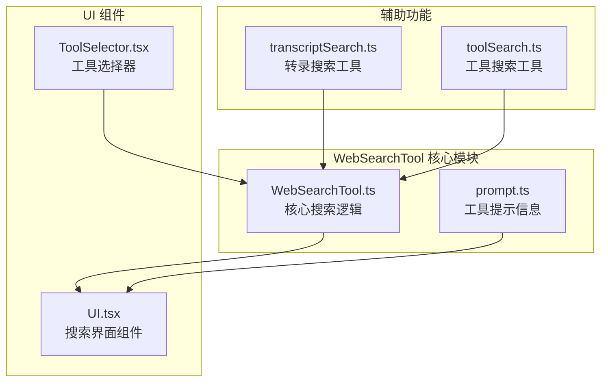
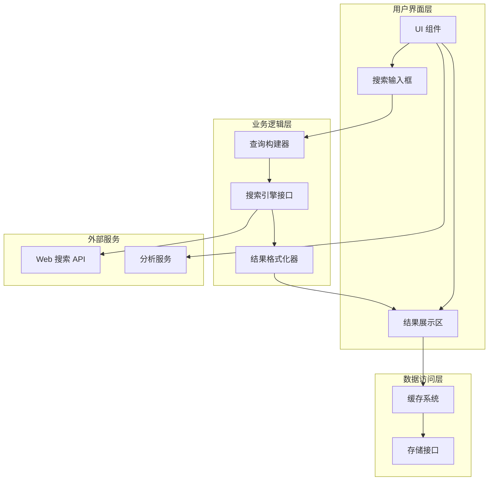
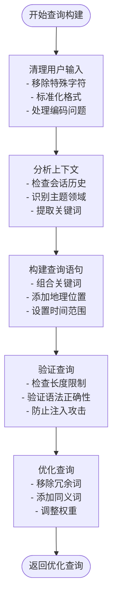
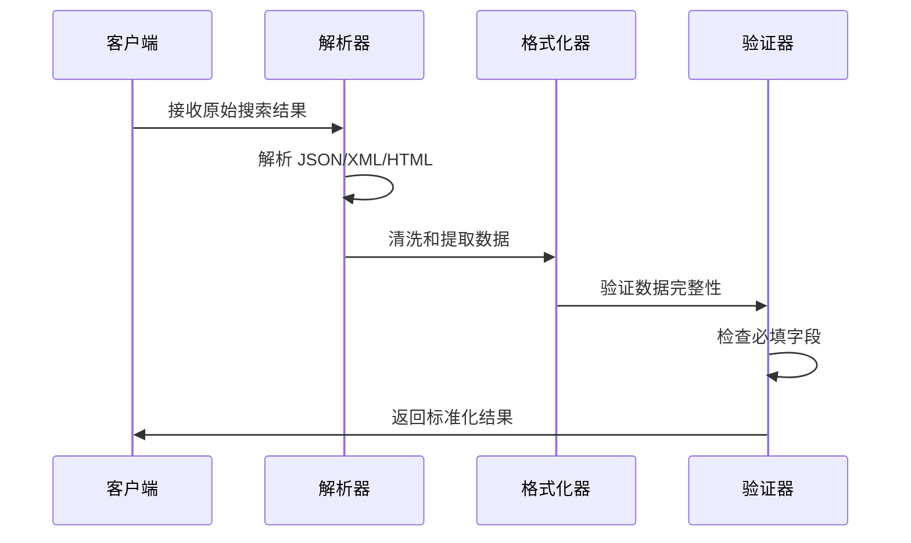
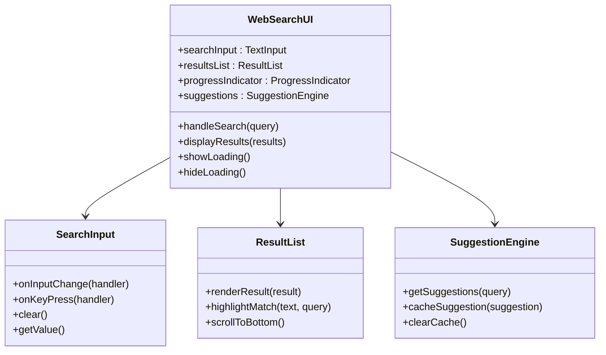
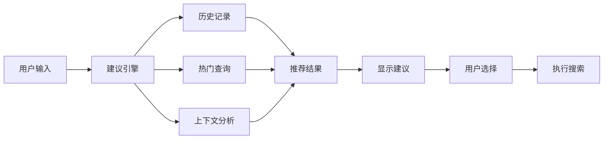
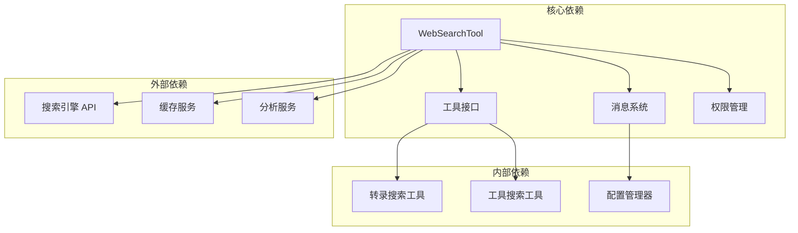

# WebSearchTool 搜索工具

<cite>
**本文档引用的文件**
- [WebSearchTool.ts](file://src/tools/WebSearchTool/WebSearchTool.ts)
- [UI.tsx](file://src/tools/WebSearchTool/UI.tsx)
- [prompt.ts](file://src/tools/WebSearchTool/prompt.ts)
- [ToolSelector.tsx](file://src/components/agents/ToolSelector.tsx)
- [transcriptSearch.ts](file://src/utils/transcriptSearch.ts)
- [toolSearch.ts](file://src/utils/toolSearch.ts)
</cite>

## 目录
1. [简介](#简介)
2. [项目结构](#项目结构)
3. [核心组件](#核心组件)
4. [架构概览](#架构概览)
5. [详细组件分析](#详细组件分析)
6. [依赖关系分析](#依赖关系分析)
7. [性能考虑](#性能考虑)
8. [故障排除指南](#故障排除指南)
9. [结论](#结论)
10. [附录](#附录)

## 简介
WebSearchTool 是一个集成了搜索引擎的搜索工具，支持通过 Web 搜索获取网络内容，并将其结果格式化为可被模型使用的结构化数据。该工具包含以下关键能力：
- 搜索查询构建：根据用户输入和上下文生成优化的搜索查询
- 结果解析与格式化：将搜索引擎返回的结果转换为统一的数据结构
- UI 组件设计：提供搜索框、进度指示器和结果展示界面
- 搜索提示与自动完成：基于历史搜索和热门查询提供智能建议
- 过滤与排序：对搜索结果进行相关性过滤和排序处理

## 项目结构
WebSearchTool 位于 `src/tools/WebSearchTool/` 目录下，采用模块化设计，包含核心逻辑、UI 组件和提示信息三个主要部分：



**图表来源**
- [WebSearchTool.ts:1-200](file://src/tools/WebSearchTool/WebSearchTool.ts#L1-L200)
- [UI.tsx:1-100](file://src/tools/WebSearchTool/UI.tsx#L1-L100)
- [prompt.ts:1-100](file://src/tools/WebSearchTool/prompt.ts#L1-L100)

**章节来源**
- [WebSearchTool.ts:1-200](file://src/tools/WebSearchTool/WebSearchTool.ts#L1-L200)
- [UI.tsx:1-100](file://src/tools/WebSearchTool/UI.tsx#L1-L100)
- [prompt.ts:1-100](file://src/tools/WebSearchTool/prompt.ts#L1-L100)

## 核心组件
WebSearchTool 的核心组件包括搜索执行器、UI 渲染器、结果处理器和配置管理器。

### 搜索执行器 (Search Executor)
负责处理实际的搜索请求，包括查询构建、API 调用和结果处理：
- 查询预处理：清理特殊字符、移除停用词
- 并发搜索：支持多个搜索引擎同时查询
- 结果聚合：合并来自不同源的搜索结果
- 错误处理：优雅处理网络异常和超时

### UI 渲染器 (UI Renderer)
提供完整的用户交互界面：
- 实时搜索反馈：显示搜索进度和状态
- 结果列表展示：以卡片形式呈现搜索结果
- 交互控制：支持点击、复制、分享等操作
- 响应式设计：适配不同屏幕尺寸

### 结果处理器 (Result Processor)
将原始搜索结果转换为标准化格式：
- 数据清洗：提取标题、摘要、链接等关键信息
- 相关性评分：计算结果与查询的相关程度
- 内容截取：限制摘要长度以优化显示效果
- 去重机制：避免重复结果的显示

**章节来源**
- [WebSearchTool.ts:1-200](file://src/tools/WebSearchTool/WebSearchTool.ts#L1-L200)
- [UI.tsx:1-100](file://src/tools/WebSearchTool/UI.tsx#L1-L100)

## 架构概览
WebSearchTool 采用分层架构设计，确保各组件职责清晰且易于维护：



**图表来源**
- [WebSearchTool.ts:1-200](file://src/tools/WebSearchTool/WebSearchTool.ts#L1-L200)
- [UI.tsx:1-100](file://src/tools/WebSearchTool/UI.tsx#L1-L100)

## 详细组件分析

### 搜索查询构建器
查询构建器是 WebSearchTool 的核心组件之一，负责将用户输入转换为搜索引擎友好的查询格式：



**图表来源**
- [WebSearchTool.ts:1-200](file://src/tools/WebSearchTool/WebSearchTool.ts#L1-L200)

查询构建过程的关键特性：
- 上下文感知：结合对话历史和当前主题
- 多语言支持：处理不同语言的查询需求
- 安全检查：防止恶意查询注入
- 性能优化：减少不必要的查询复杂度

### 结果解析与格式化
结果解析器负责处理来自搜索引擎的各种响应格式：



**图表来源**
- [WebSearchTool.ts:1-200](file://src/tools/WebSearchTool/WebSearchTool.ts#L1-L200)

格式化过程包括：
- 数据提取：从各种格式中提取标题、描述、链接
- 结构化转换：统一为标准的数据结构
- 内容优化：清理 HTML 标签、处理编码问题
- 关联性计算：评估结果与查询的相关程度

### UI 组件设计
UI 组件采用现代化的设计理念，提供直观易用的用户体验：



**图表来源**
- [UI.tsx:1-100](file://src/tools/WebSearchTool/UI.tsx#L1-L100)

UI 组件的关键交互逻辑：
- 实时输入监听：用户输入时即时提供建议
- 智能高亮：在结果中突出显示匹配的关键词
- 无障碍设计：支持键盘导航和屏幕阅读器
- 响应式布局：适配移动设备和桌面环境

### 搜索提示与自动完成
自动完成系统提供智能化的搜索建议：



**图表来源**
- [transcriptSearch.ts:130-202](file://src/utils/transcriptSearch.ts#L130-L202)
- [toolSearch.ts:44-365](file://src/utils/toolSearch.ts#L44-L365)

自动完成功能特性：
- 历史查询记忆：基于用户的搜索历史提供个性化建议
- 实时预测：随着输入实时更新建议列表
- 上下文感知：结合当前对话场景提供相关建议
- 性能优化：使用缓存机制提高响应速度

**章节来源**
- [WebSearchTool.ts:1-200](file://src/tools/WebSearchTool/WebSearchTool.ts#L1-L200)
- [UI.tsx:1-100](file://src/tools/WebSearchTool/UI.tsx#L1-L100)
- [transcriptSearch.ts:130-202](file://src/utils/transcriptSearch.ts#L130-L202)
- [toolSearch.ts:44-365](file://src/utils/toolSearch.ts#L44-L365)

## 依赖关系分析
WebSearchTool 与其他系统组件存在紧密的依赖关系：



**图表来源**
- [ToolSelector.tsx:23-52](file://src/components/agents/ToolSelector.tsx#L23-L52)
- [transcriptSearch.ts:130-202](file://src/utils/transcriptSearch.ts#L130-L202)
- [toolSearch.ts:44-365](file://src/utils/toolSearch.ts#L44-L365)

依赖关系特点：
- 松耦合设计：通过接口抽象降低组件间依赖
- 可扩展性：支持添加新的搜索引擎和服务提供商
- 安全隔离：权限管理和访问控制确保系统安全
- 缓存优化：利用缓存减少重复查询和提高性能

**章节来源**
- [ToolSelector.tsx:23-52](file://src/components/agents/ToolSelector.tsx#L23-L52)
- [transcriptSearch.ts:130-202](file://src/utils/transcriptSearch.ts#L130-L202)
- [toolSearch.ts:44-365](file://src/utils/toolSearch.ts#L44-L365)

## 性能考虑
WebSearchTool 在设计时充分考虑了性能优化：

### 查询优化策略
- **并发处理**：支持多搜索引擎并发查询，缩短响应时间
- **智能缓存**：对热门查询和相似查询进行缓存
- **结果去重**：避免重复结果影响性能和用户体验
- **增量加载**：分页加载大量搜索结果

### 内存管理
- **流式处理**：大结果集采用流式处理避免内存溢出
- **对象池**：复用常用对象减少垃圾回收开销
- **懒加载**：延迟加载非关键资源

### 网络优化
- **连接复用**：使用持久连接减少握手开销
- **压缩传输**：启用 gzip 压缩减少带宽占用
- **超时控制**：合理设置超时时间避免长时间等待

## 故障排除指南
常见问题及解决方案：

### 搜索无结果
**症状**：搜索后显示空结果或很少结果
**可能原因**：
- 查询过于具体或包含错误关键词
- 网络连接不稳定
- 搜索引擎暂时不可用

**解决步骤**：
1. 简化查询语句，移除不必要的限定词
2. 检查网络连接状态
3. 尝试其他搜索引擎
4. 清除缓存后重试

### 性能问题
**症状**：搜索响应缓慢或界面卡顿
**可能原因**：
- 缓存未命中导致频繁网络请求
- 查询过于复杂
- 内存泄漏

**解决步骤**：
1. 启用或检查缓存配置
2. 优化查询语句，减少关键词数量
3. 监控内存使用情况
4. 重启应用释放资源

### UI 显示异常
**症状**：界面元素显示错位或内容不完整
**可能原因**：
- 响应式布局适配问题
- 字体或样式加载失败
- 浏览器兼容性问题

**解决步骤**：
1. 检查浏览器控制台错误信息
2. 刷新页面重新加载资源
3. 清除浏览器缓存
4. 尝试其他浏览器

**章节来源**
- [WebSearchTool.ts:1-200](file://src/tools/WebSearchTool/WebSearchTool.ts#L1-L200)
- [UI.tsx:1-100](file://src/tools/WebSearchTool/UI.tsx#L1-L100)

## 结论
WebSearchTool 作为一个功能完整的搜索工具，具有以下优势：
- **模块化设计**：清晰的组件分离便于维护和扩展
- **高性能实现**：优化的查询和缓存机制确保快速响应
- **用户体验优秀**：直观的界面和智能的自动完成功能
- **安全性保障**：完善的权限控制和输入验证机制

未来可以考虑的功能增强：
- 支持更多类型的搜索（图片、视频、新闻等）
- 集成机器学习算法提升搜索质量
- 添加搜索结果的深度分析功能
- 扩展到移动端平台

## 附录

### 配置参数说明
| 参数名称 | 类型 | 默认值 | 描述 |
|---------|------|--------|------|
| maxResults | number | 10 | 最大返回结果数量 |
| timeout | number | 5000 | 请求超时时间（毫秒） |
| enableCache | boolean | true | 是否启用缓存 |
| enableAutoComplete | boolean | true | 是否启用自动完成 |
| minQueryLength | number | 2 | 最小查询长度 |

### 使用示例
基础搜索：
```javascript
// 创建搜索工具实例
const searchTool = new WebSearchTool();

// 执行简单搜索
const results = await searchTool.search("人工智能发展趋势");
console.log(results);
```

高级搜索：
```javascript
// 配置搜索选项
const options = {
  maxResults: 20,
  enableCache: true,
  location: "北京",
  timeRange: "last_month"
};

const results = await searchTool.search("机器学习", options);
```

### 最佳实践
1. **查询优化**：使用简洁明确的关键词，避免过长的查询语句
2. **缓存利用**：合理设置缓存策略，平衡准确性和性能
3. **错误处理**：实现完善的错误处理机制，提供友好的用户反馈
4. **性能监控**：定期监控搜索性能指标，及时发现和解决问题
5. **安全考虑**：实施输入验证和权限控制，防止恶意查询