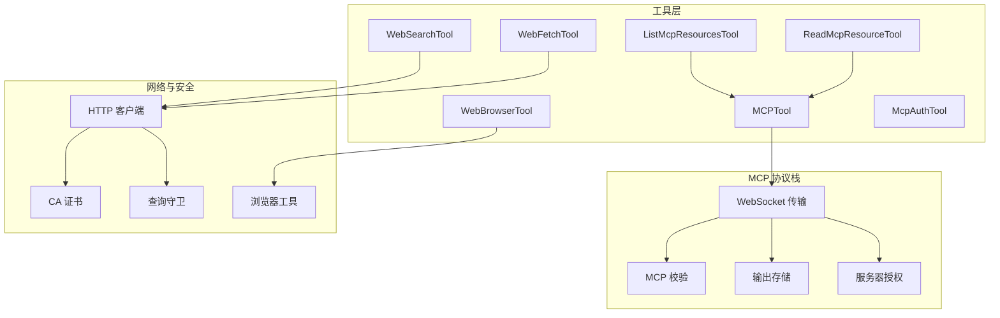
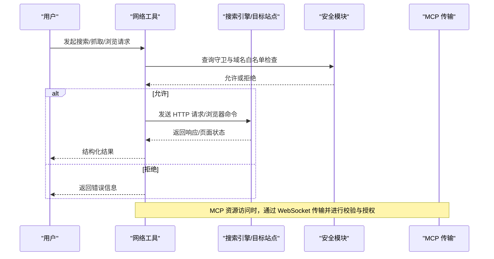
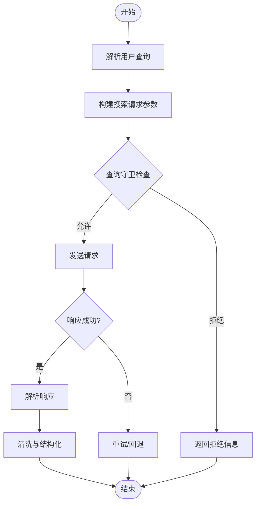
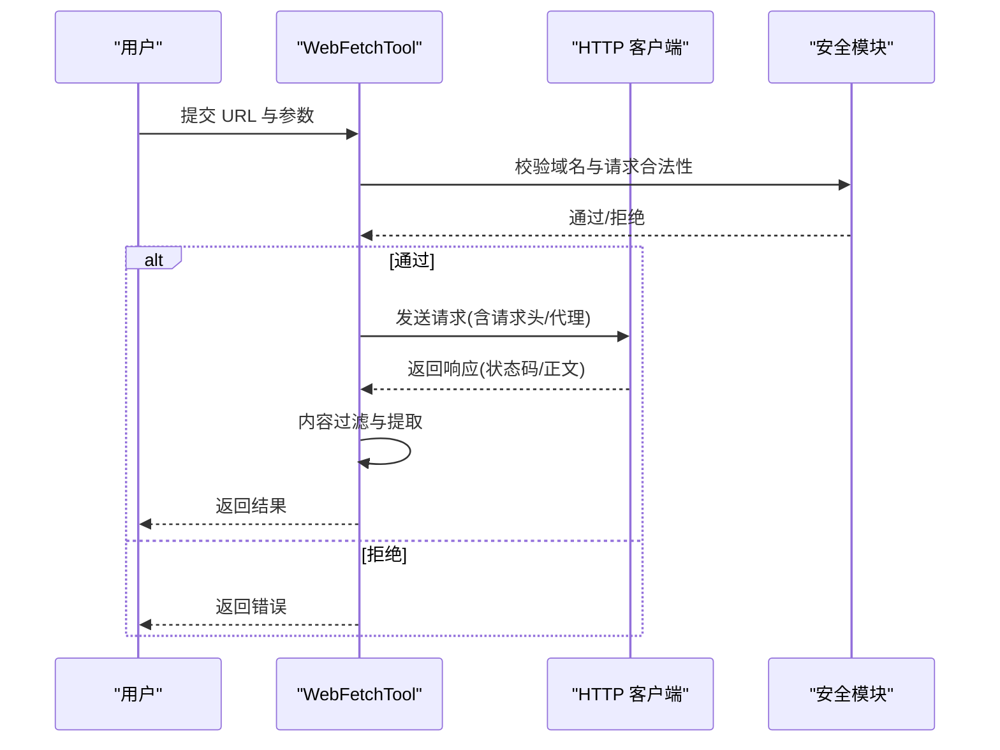
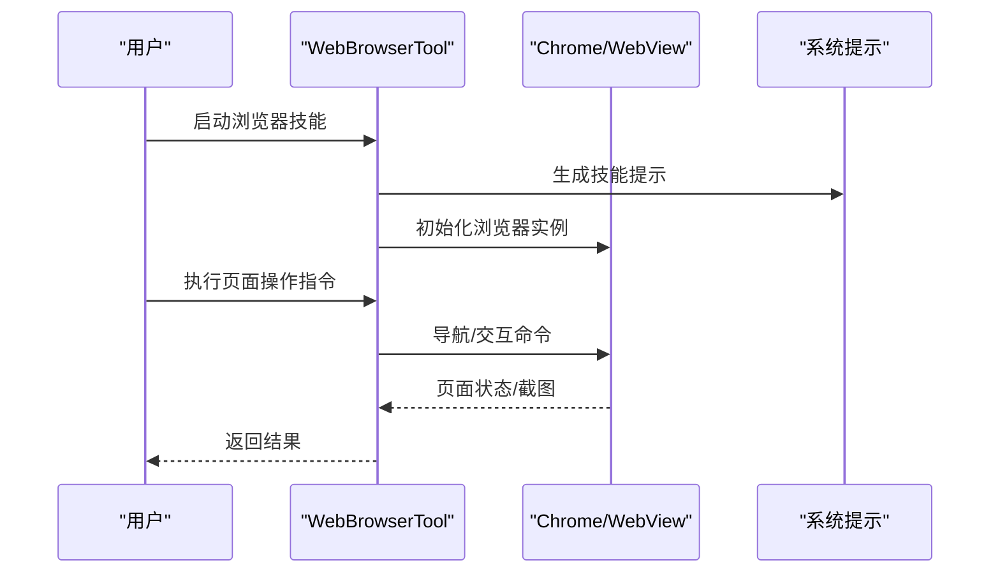
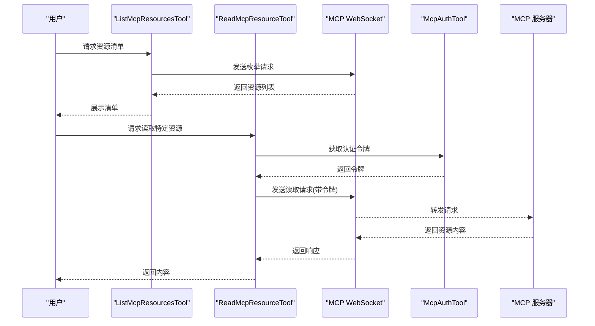
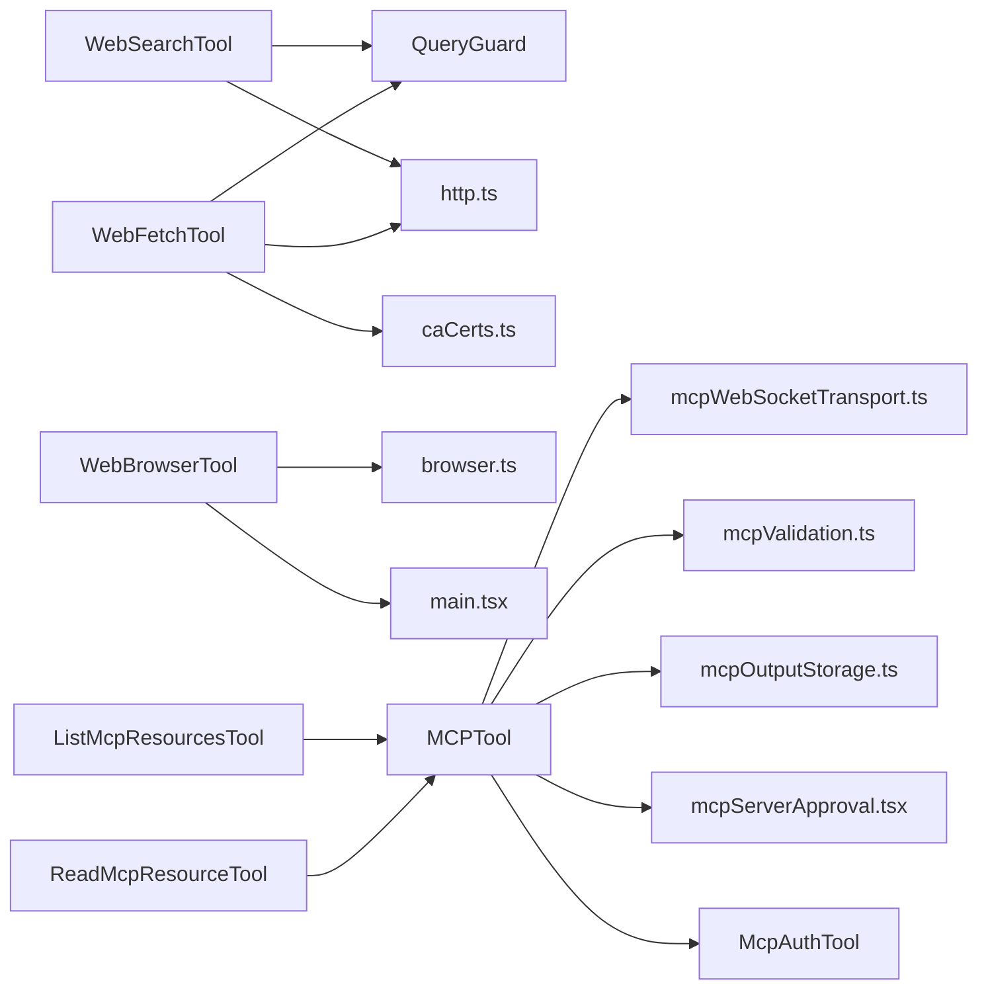

# 网络工具

<cite>
**本文档引用的文件**
- [WebSearchTool.ts](file://src/tools/WebSearchTool/WebSearchTool.ts)
- [WebFetchTool.ts](file://src/tools/WebFetchTool/WebFetchTool.ts)
- [WebBrowserTool.ts](file://src/tools/WebBrowserTool/WebBrowserTool.ts)
- [ListMcpResourcesTool.ts](file://src/tools/ListMcpResourcesTool/ListMcpResourcesTool.ts)
- [ReadMcpResourceTool.ts](file://src/tools/ReadMcpResourceTool/ReadMcpResourceTool.ts)
- [MCPTool.ts](file://src/tools/MCPTool/MCPTool.ts)
- [McpAuthTool.ts](file://src/tools/McpAuthTool/McpAuthTool.ts)
- [init-verifiers.ts](file://src/commands/init-verifiers.ts)
- [main.tsx](file://src/main.tsx)
- [mcp.ts](file://src/entrypoints/mcp.ts)
- [mcpValidation.ts](file://src/utils/mcp/mcpValidation.ts)
- [mcpWebSocketTransport.ts](file://src/utils/mcp/mcpWebSocketTransport.ts)
- [mcpOutputStorage.ts](file://src/utils/mcp/mcpOutputStorage.ts)
- [mcpInstructionsDelta.ts](file://src/utils/mcp/mcpInstructionsDelta.ts)
- [browser.ts](file://src/utils/browser.ts)
- [http.ts](file://src/utils/http.ts)
- [caCerts.ts](file://src/utils/caCerts.ts)
- [caCertsConfig.ts](file://src/utils/caCertsConfig.ts)
- [QueryGuard.ts](file://src/utils/QueryGuard.ts)
- [platform.ts](file://src/utils/platform.ts)
- [env.ts](file://src/utils/env.ts)
- [settings.ts](file://src/utils/settings.ts)
- [managedEnv.ts](file://src/utils/managedEnv.ts)
- [managedEnvConstants.ts](file://src/utils/managedEnvConstants.ts)
- [mcpServerApproval.tsx](file://src/services/mcpServerApproval.tsx)
- [mcpSkillBuilders.ts](file://src/skills/mcpSkillBuilders.ts)
- [mcpSkills.ts](file://src/skills/mcpSkills.ts)
- [url-handler-napi/index.ts](file://shims/url-handler-napi/index.ts)
</cite>

## 目录
1. [简介](#简介)
2. [项目结构](#项目结构)
3. [核心组件](#核心组件)
4. [架构总览](#架构总览)
5. [详细组件分析](#详细组件分析)
6. [依赖关系分析](#依赖关系分析)
7. [性能考虑](#性能考虑)
8. [故障排除指南](#故障排除指南)
9. [结论](#结论)
10. [附录](#附录)

## 简介
本文件为网络工具的综合技术文档，重点覆盖以下能力：
- WebSearchTool：搜索引擎集成，支持查询构建、结果解析与安全限制
- WebFetchTool：网页抓取，支持请求头管理、内容提取与反爬虫应对
- WebBrowserTool：浏览器模拟（基于 Claude in Chrome 技能），支持自动化交互与页面控制
- MCP 资源列表与读取工具：通过 MCP 协议枚举与读取远端资源
- 安全限制与预批准域名：统一的访问控制策略
- 反爬虫防护机制：请求频率控制、User-Agent 策略与内容过滤
- 使用示例与配置选项：如何启用、配置与调用这些工具
- 代理与认证系统集成：HTTP 代理、证书与认证流程

## 项目结构
网络工具主要位于 src/tools 目录下，围绕 MCP 协议与浏览器自动化两条主线组织：
- 搜索与抓取类工具：WebSearchTool、WebFetchTool
- 浏览器自动化：WebBrowserTool（通过 Claude in Chrome 技能）
- MCP 资源访问：ListMcpResourcesTool、ReadMcpResourceTool、MCPTool、McpAuthTool
- 工具入口与技能：mcp.ts、mcpSkills.ts、mcpSkillBuilders.ts
- 安全与网络基础设施：http.ts、browser.ts、caCerts.ts、QueryGuard.ts

**图表来源**
- [WebSearchTool.ts](file://src/tools/WebSearchTool/WebSearchTool.ts)
- [WebFetchTool.ts](file://src/tools/WebFetchTool/WebFetchTool.ts)
- [WebBrowserTool.ts](file://src/tools/WebBrowserTool/WebBrowserTool.ts)
- [ListMcpResourcesTool.ts](file://src/tools/ListMcpResourcesTool/ListMcpResourcesTool.ts)
- [ReadMcpResourceTool.ts](file://src/tools/ReadMcpResourceTool/ReadMcpResourceTool.ts)
- [MCPTool.ts](file://src/tools/MCPTool/MCPTool.ts)
- [mcpWebSocketTransport.ts](file://src/utils/mcp/mcpWebSocketTransport.ts)
- [mcpValidation.ts](file://src/utils/mcp/mcpValidation.ts)
- [mcpOutputStorage.ts](file://src/utils/mcp/mcpOutputStorage.ts)
- [mcpServerApproval.tsx](file://src/services/mcpServerApproval.tsx)
- [http.ts](file://src/utils/http.ts)
- [browser.ts](file://src/utils/browser.ts)
- [caCerts.ts](file://src/utils/caCerts.ts)
- [QueryGuard.ts](file://src/utils/QueryGuard.ts)

**章节来源**
- [WebSearchTool.ts](file://src/tools/WebSearchTool/WebSearchTool.ts)
- [WebFetchTool.ts](file://src/tools/WebFetchTool/WebFetchTool.ts)
- [WebBrowserTool.ts](file://src/tools/WebBrowserTool/WebBrowserTool.ts)
- [ListMcpResourcesTool.ts](file://src/tools/ListMcpResourcesTool/ListMcpResourcesTool.ts)
- [ReadMcpResourceTool.ts](file://src/tools/ReadMcpResourceTool/ReadMcpResourceTool.ts)
- [MCPTool.ts](file://src/tools/MCPTool/MCPTool.ts)
- [mcp.ts](file://src/entrypoints/mcp.ts)

## 核心组件
本节概述三大网络工具与 MCP 资源访问工具的核心职责与交互模式。

- WebSearchTool：负责将用户查询转换为搜索引擎请求，处理响应并返回结构化结果；内置查询守卫与预批准域名检查，防止越权访问。
- WebFetchTool：执行 HTTP 请求获取网页内容，支持自定义请求头、内容类型过滤与反爬虫策略（如延迟、随机 UA）。
- WebBrowserTool：通过 Claude in Chrome 技能实现浏览器自动化，支持页面导航、元素交互与截图等操作。
- ListMcpResourcesTool / ReadMcpResourceTool：通过 MCP 协议枚举远端资源清单并读取指定资源内容。
- MCPTool / McpAuthTool：封装 MCP 服务器连接、权限校验与认证流程，确保安全通信。

**章节来源**
- [WebSearchTool.ts](file://src/tools/WebSearchTool/WebSearchTool.ts)
- [WebFetchTool.ts](file://src/tools/WebFetchTool/WebFetchTool.ts)
- [WebBrowserTool.ts](file://src/tools/WebBrowserTool/WebBrowserTool.ts)
- [ListMcpResourcesTool.ts](file://src/tools/ListMcpResourcesTool/ListMcpResourcesTool.ts)
- [ReadMcpResourceTool.ts](file://src/tools/ReadMcpResourceTool/ReadMcpResourceTool.ts)
- [MCPTool.ts](file://src/tools/MCPTool/MCPTool.ts)
- [McpAuthTool.ts](file://src/tools/McpAuthTool/McpAuthTool.ts)

## 架构总览
网络工具的整体架构由“工具层”、“MCP 协议栈”、“网络与安全层”三部分组成。工具层负责具体业务逻辑；MCP 协议栈提供跨进程/跨服务的标准化通信；网络与安全层保障请求合法性与数据安全。

**图表来源**
- [QueryGuard.ts](file://src/utils/QueryGuard.ts)
- [mcpWebSocketTransport.ts](file://src/utils/mcp/mcpWebSocketTransport.ts)
- [mcpValidation.ts](file://src/utils/mcp/mcpValidation.ts)
- [mcpServerApproval.tsx](file://src/services/mcpServerApproval.tsx)

## 详细组件分析

### WebSearchTool 组件分析
WebSearchTool 将自然语言查询转化为可执行的搜索请求，并对结果进行清洗与结构化输出。其关键特性包括：
- 查询构建：根据输入生成搜索引擎请求参数
- 响应解析：提取标题、摘要、链接等字段
- 安全限制：通过 QueryGuard 与预批准域名列表进行访问控制
- 错误处理：对网络异常、解析失败等情况进行降级处理

**图表来源**
- [WebSearchTool.ts](file://src/tools/WebSearchTool/WebSearchTool.ts)
- [QueryGuard.ts](file://src/utils/QueryGuard.ts)

**章节来源**
- [WebSearchTool.ts](file://src/tools/WebSearchTool/WebSearchTool.ts)
- [QueryGuard.ts](file://src/utils/QueryGuard.ts)

### WebFetchTool 组件分析
WebFetchTool 提供网页抓取能力，支持：
- 自定义请求头与内容类型过滤
- 反爬虫应对：随机 User-Agent、请求间隔、内容长度限制
- 多种内容提取策略：HTML、纯文本、JSON 等
- 错误恢复：超时重试、代理切换

**图表来源**
- [WebFetchTool.ts](file://src/tools/WebFetchTool/WebFetchTool.ts)
- [http.ts](file://src/utils/http.ts)
- [QueryGuard.ts](file://src/utils/QueryGuard.ts)

**章节来源**
- [WebFetchTool.ts](file://src/tools/WebFetchTool/WebFetchTool.ts)
- [http.ts](file://src/utils/http.ts)
- [QueryGuard.ts](file://src/utils/QueryGuard.ts)

### WebBrowserTool 组件分析
WebBrowserTool 通过 Claude in Chrome 技能实现浏览器自动化。其核心流程包括：
- 初始化浏览器环境（Bun WebView 或 Chrome DevTools）
- 页面导航与交互（点击、输入、滚动、截图）
- 页面状态监控与错误处理
- 与主应用的系统提示集成

**图表来源**
- [WebBrowserTool.ts](file://src/tools/WebBrowserTool/WebBrowserTool.ts)
- [main.tsx](file://src/main.tsx)
- [init-verifiers.ts](file://src/commands/init-verifiers.ts)

**章节来源**
- [WebBrowserTool.ts](file://src/tools/WebBrowserTool/WebBrowserTool.ts)
- [main.tsx](file://src/main.tsx)
- [init-verifiers.ts](file://src/commands/init-verifiers.ts)

### MCP 资源列表与读取工具
ListMcpResourcesTool 与 ReadMcpResourceTool 通过 MCP 协议与远端服务器交互：
- 列表工具：枚举可用资源清单
- 读取工具：按资源标识读取具体内容
- 传输层：基于 WebSocket 的 MCP 传输
- 校验与授权：协议校验、服务器授权对话

**图表来源**
- [ListMcpResourcesTool.ts](file://src/tools/ListMcpResourcesTool/ListMcpResourcesTool.ts)
- [ReadMcpResourceTool.ts](file://src/tools/ReadMcpResourceTool/ReadMcpResourceTool.ts)
- [McpAuthTool.ts](file://src/tools/McpAuthTool/McpAuthTool.ts)
- [mcpWebSocketTransport.ts](file://src/utils/mcp/mcpWebSocketTransport.ts)
- [mcpValidation.ts](file://src/utils/mcp/mcpValidation.ts)
- [mcpServerApproval.tsx](file://src/services/mcpServerApproval.tsx)

**章节来源**
- [ListMcpResourcesTool.ts](file://src/tools/ListMcpResourcesTool/ListMcpResourcesTool.ts)
- [ReadMcpResourceTool.ts](file://src/tools/ReadMcpResourceTool/ReadMcpResourceTool.ts)
- [McpAuthTool.ts](file://src/tools/McpAuthTool/McpAuthTool.ts)
- [mcpWebSocketTransport.ts](file://src/utils/mcp/mcpWebSocketTransport.ts)
- [mcpValidation.ts](file://src/utils/mcp/mcpValidation.ts)
- [mcpServerApproval.tsx](file://src/services/mcpServerApproval.tsx)

## 依赖关系分析
网络工具的依赖关系如下图所示：

**图表来源**
- [WebSearchTool.ts](file://src/tools/WebSearchTool/WebSearchTool.ts)
- [WebFetchTool.ts](file://src/tools/WebFetchTool/WebFetchTool.ts)
- [WebBrowserTool.ts](file://src/tools/WebBrowserTool/WebBrowserTool.ts)
- [ListMcpResourcesTool.ts](file://src/tools/ListMcpResourcesTool/ListMcpResourcesTool.ts)
- [ReadMcpResourceTool.ts](file://src/tools/ReadMcpResourceTool/ReadMcpResourceTool.ts)
- [MCPTool.ts](file://src/tools/MCPTool/MCPTool.ts)
- [McpAuthTool.ts](file://src/tools/McpAuthTool/McpAuthTool.ts)
- [QueryGuard.ts](file://src/utils/QueryGuard.ts)
- [http.ts](file://src/utils/http.ts)
- [browser.ts](file://src/utils/browser.ts)
- [caCerts.ts](file://src/utils/caCerts.ts)
- [mcpWebSocketTransport.ts](file://src/utils/mcp/mcpWebSocketTransport.ts)
- [mcpValidation.ts](file://src/utils/mcp/mcpValidation.ts)
- [mcpOutputStorage.ts](file://src/utils/mcp/mcpOutputStorage.ts)
- [mcpServerApproval.tsx](file://src/services/mcpServerApproval.tsx)
- [main.tsx](file://src/main.tsx)

**章节来源**
- [WebSearchTool.ts](file://src/tools/WebSearchTool/WebSearchTool.ts)
- [WebFetchTool.ts](file://src/tools/WebFetchTool/WebFetchTool.ts)
- [WebBrowserTool.ts](file://src/tools/WebBrowserTool/WebBrowserTool.ts)
- [ListMcpResourcesTool.ts](file://src/tools/ListMcpResourcesTool/ListMcpResourcesTool.ts)
- [ReadMcpResourceTool.ts](file://src/tools/ReadMcpResourceTool/ReadMcpResourceTool.ts)
- [MCPTool.ts](file://src/tools/MCPTool/MCPTool.ts)
- [McpAuthTool.ts](file://src/tools/McpAuthTool/McpAuthTool.ts)
- [QueryGuard.ts](file://src/utils/QueryGuard.ts)
- [http.ts](file://src/utils/http.ts)
- [browser.ts](file://src/utils/browser.ts)
- [caCerts.ts](file://src/utils/caCerts.ts)
- [mcpWebSocketTransport.ts](file://src/utils/mcp/mcpWebSocketTransport.ts)
- [mcpValidation.ts](file://src/utils/mcp/mcpValidation.ts)
- [mcpOutputStorage.ts](file://src/utils/mcp/mcpOutputStorage.ts)
- [mcpServerApproval.tsx](file://src/services/mcpServerApproval.tsx)
- [main.tsx](file://src/main.tsx)

## 性能考虑
- 请求频率控制：WebFetchTool 与 WebSearchTool 应设置合理的请求间隔，避免触发目标站点的速率限制。
- 内容缓存：对重复请求的结果进行短期缓存，减少网络开销。
- 并发限制：限制同时发起的请求数量，避免资源争用。
- 代理与证书：在企业网络环境下优先使用受信任的 CA 证书与代理服务器，减少握手失败与超时。
- 浏览器自动化：合理设置页面等待时间与超时阈值，避免长时间阻塞。

## 故障排除指南
- 域名被拒绝：检查预批准域名列表与 QueryGuard 配置，确认目标域名是否在白名单中。
- MCP 连接失败：确认 MCP 服务器地址、认证令牌与 WebSocket 传输配置正确。
- 证书问题：验证 caCerts 与 caCertsConfig 是否包含目标站点的根证书链。
- 代理认证失败：检查代理服务器的认证凭据与网络连通性。
- 浏览器初始化失败：确认 Claude in Chrome 技能已安装且系统平台支持 WebView。

**章节来源**
- [QueryGuard.ts](file://src/utils/QueryGuard.ts)
- [mcpWebSocketTransport.ts](file://src/utils/mcp/mcpWebSocketTransport.ts)
- [mcpValidation.ts](file://src/utils/mcp/mcpValidation.ts)
- [caCerts.ts](file://src/utils/caCerts.ts)
- [caCertsConfig.ts](file://src/utils/caCertsConfig.ts)
- [main.tsx](file://src/main.tsx)

## 结论
网络工具通过统一的安全框架与 MCP 协议实现了从搜索引擎到网页抓取再到浏览器自动化的完整能力谱系。结合预批准域名、证书与代理等基础设施，能够在保证安全的前提下高效完成各类网络任务。建议在生产环境中严格配置访问控制与日志审计，并根据目标站点的反爬虫策略调整请求行为。

## 附录

### 使用示例与配置选项
- WebSearchTool
  - 输入：自然语言查询
  - 输出：结构化搜索结果
  - 配置：预批准域名、最大结果数、内容过滤规则
- WebFetchTool
  - 输入：URL、请求头、内容类型
  - 输出：网页内容或错误信息
  - 配置：代理、User-Agent、超时、重试次数
- WebBrowserTool
  - 输入：页面操作指令（导航、点击、输入）
  - 输出：页面截图或状态信息
  - 配置：浏览器类型、窗口尺寸、等待时间
- MCP 资源访问
  - 输入：资源标识符
  - 输出：资源内容
  - 配置：MCP 服务器地址、认证令牌、传输参数

**章节来源**
- [WebSearchTool.ts](file://src/tools/WebSearchTool/WebSearchTool.ts)
- [WebFetchTool.ts](file://src/tools/WebFetchTool/WebFetchTool.ts)
- [WebBrowserTool.ts](file://src/tools/WebBrowserTool/WebBrowserTool.ts)
- [ListMcpResourcesTool.ts](file://src/tools/ListMcpResourcesTool/ListMcpResourcesTool.ts)
- [ReadMcpResourceTool.ts](file://src/tools/ReadMcpResourceTool/ReadMcpResourceTool.ts)
- [MCPTool.ts](file://src/tools/MCPTool/MCPTool.ts)
- [McpAuthTool.ts](file://src/tools/McpAuthTool/McpAuthTool.ts)

### 与代理服务器和认证系统的集成
- 代理集成：WebFetchTool 支持通过 http.ts 配置代理；MCP 传输层可通过 mcpWebSocketTransport.ts 设置代理通道。
- 认证系统：McpAuthTool 负责获取与刷新认证令牌；mcpServerApproval.tsx 提供服务器授权流程。
- 证书管理：caCerts.ts 与 caCertsConfig.ts 提供企业级证书注入与配置。

**章节来源**
- [http.ts](file://src/utils/http.ts)
- [mcpWebSocketTransport.ts](file://src/utils/mcp/mcpWebSocketTransport.ts)
- [McpAuthTool.ts](file://src/tools/McpAuthTool/McpAuthTool.ts)
- [mcpServerApproval.tsx](file://src/services/mcpServerApproval.tsx)
- [caCerts.ts](file://src/utils/caCerts.ts)
- [caCertsConfig.ts](file://src/utils/caCertsConfig.ts)