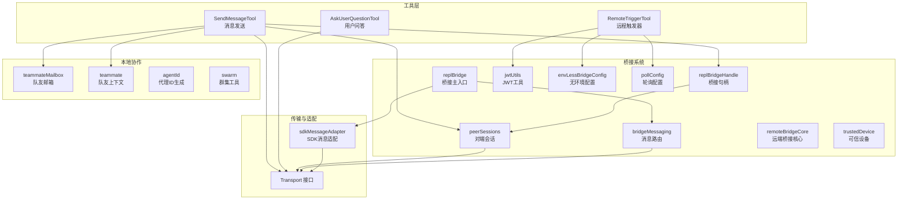
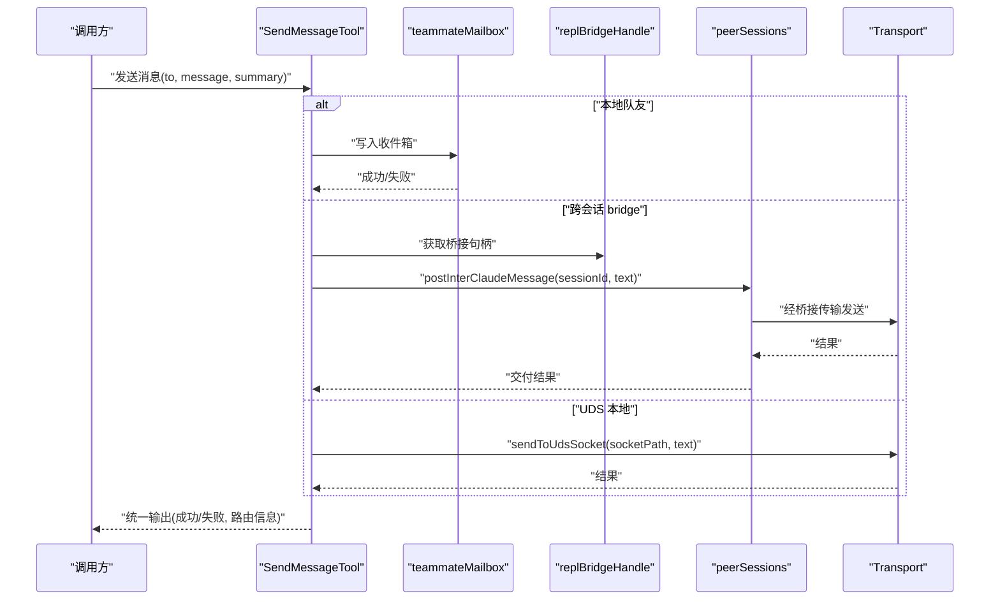
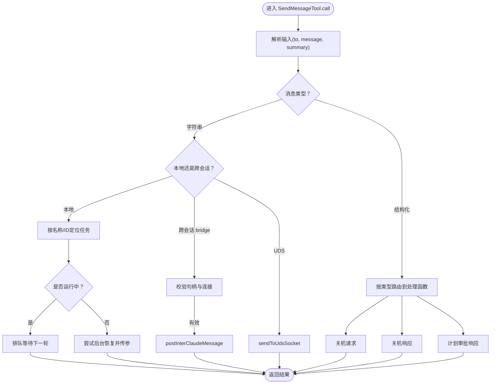
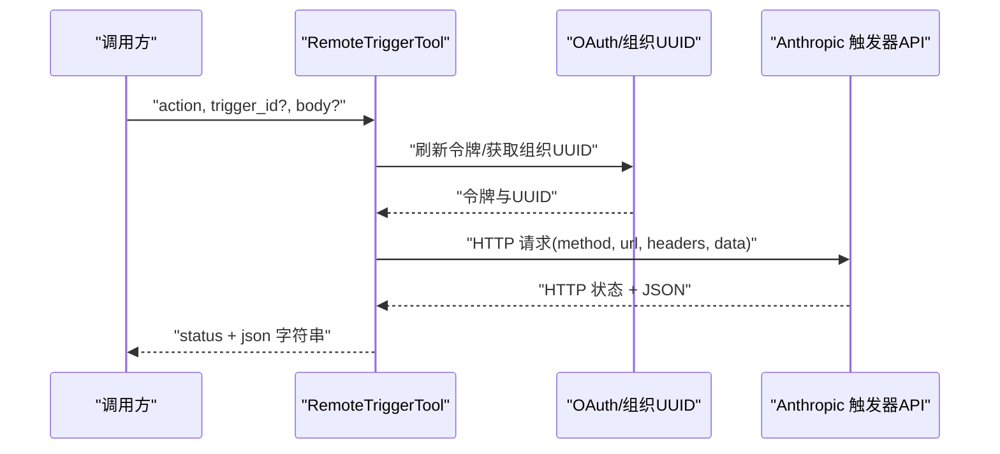
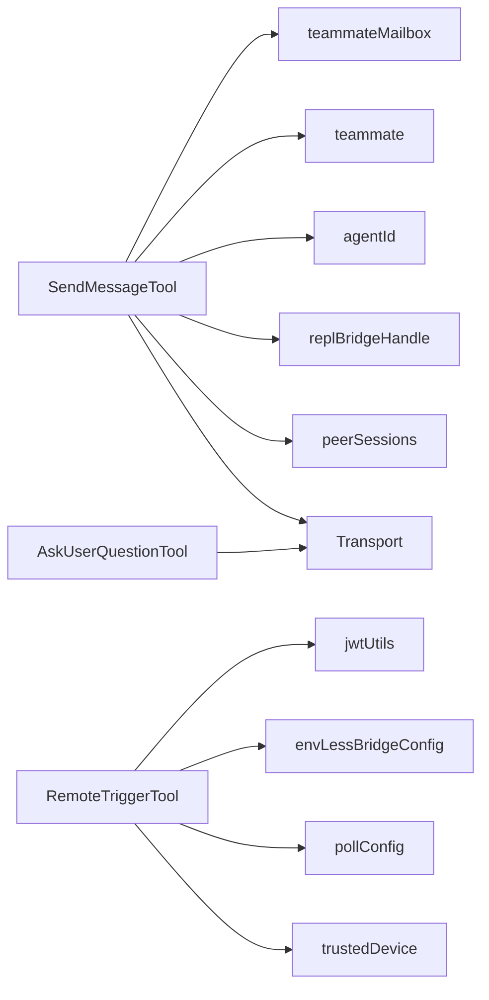

# 通信工具

<cite>
**本文引用的文件**
- [SendMessageTool.ts](file://src/tools/SendMessageTool/SendMessageTool.ts)
- [RemoteTriggerTool.ts](file://src/tools/RemoteTriggerTool/RemoteTriggerTool.ts)
- [AskUserQuestionTool.tsx](file://src/tools/AskUserQuestionTool/AskUserQuestionTool.tsx)
- [bridge.md](file://docs/06-bridge.md)
- [replBridge.ts](file://src/bridge/replBridge.ts)
- [replBridgeHandle.ts](file://src/bridge/replBridgeHandle.ts)
- [peerSessions.ts](file://src/bridge/peerSessions.ts)
- [transport.ts](file://src/cli/transports/Transport.ts)
- [jwtUtils.ts](file://src/bridge/jwtUtils.ts)
- [envLessBridgeConfig.ts](file://src/bridge/envLessBridgeConfig.ts)
- [pollConfig.ts](file://src/bridge/pollConfig.ts)
- [bridgePermissionCallbacks.ts](file://src/bridge/bridgePermissionCallbacks.ts)
- [trustedDevice.ts](file://src/bridge/trustedDevice.ts)
- [remoteBridgeCore.ts](file://src/bridge/remoteBridgeCore.ts)
- [sdkMessageAdapter.ts](file://src/remote/sdkMessageAdapter.ts)
- [mailboxes](file://src/utils/teammateMailbox.js)
- [teammate.js](file://src/utils/teammate.js)
- [agentId.ts](file://src/utils/agentId.js)
- [swarm](file://src/utils/swarm/)
- [constants.ts](file://src/tools/SendMessageTool/constants.ts)
- [prompt.ts](file://src/tools/SendMessageTool/prompt.ts)
- [prompt.ts](file://src/tools/RemoteTriggerTool/prompt.ts)
- [prompt.ts](file://src/tools/AskUserQuestionTool/prompt.ts)
- [print.ts](file://src/cli/print.ts)
</cite>

## 目录
1. [简介](#简介)
2. [项目结构](#项目结构)
3. [核心组件](#核心组件)
4. [架构总览](#架构总览)
5. [详细组件分析](#详细组件分析)
6. [依赖关系分析](#依赖关系分析)
7. [性能考量](#性能考量)
8. [故障排查指南](#故障排查指南)
9. [结论](#结论)
10. [附录](#附录)

## 简介
本文件聚焦于三类通信工具的技术实现与使用说明：
- SendMessageTool：在本地团队内或跨会话（Remote Control）发送消息，支持普通文本与结构化消息（如关机请求/响应、计划审批等），并具备广播、路由与状态同步能力。
- RemoteTriggerTool：面向远程桥接系统的触发器管理工具，用于列出、获取、创建、更新与运行远程触发器，依赖 OAuth 认证与组织上下文。
- AskUserQuestionTool：用于向用户发起问题以获得交互式输入，作为权限与交互流程中的关键节点。

文档将从系统架构、数据流、处理逻辑、安全机制、与远程桥接与权限系统的集成、配置示例与使用场景、消息路由与状态同步等方面进行深入解析。

## 项目结构
通信工具相关的核心文件分布如下：
- 工具实现：SendMessageTool、RemoteTriggerTool、AskUserQuestionTool
- 桥接系统：replBridge、replBridgeHandle、peerSessions、bridgeMessaging、bridgePermissionCallbacks、remoteBridgeCore、sdkMessageAdapter、jwtUtils、envLessBridgeConfig、pollConfig、trustedDevice
- 文档与规范：docs/06-bridge.md
- 传输抽象：cli/transports/Transport.ts
- 本地消息与团队协作：teammateMailbox、teammate、agentId、swarm

图示来源
- [SendMessageTool.ts:520-918](file://src/tools/SendMessageTool/SendMessageTool.ts#L520-L918)
- [RemoteTriggerTool.ts:46-162](file://src/tools/RemoteTriggerTool/RemoteTriggerTool.ts#L46-L162)
- [AskUserQuestionTool.tsx](file://src/tools/AskUserQuestionTool/AskUserQuestionTool.tsx)
- [replBridge.ts](file://src/bridge/replBridge.ts)
- [replBridgeHandle.ts](file://src/bridge/replBridgeHandle.ts)
- [peerSessions.ts](file://src/bridge/peerSessions.ts)
- [bridge.md:61-113](file://docs/06-bridge.md#L61-L113)
- [transport.ts:1-7](file://src/cli/transports/Transport.ts#L1-L7)
- [sdkMessageAdapter.ts](file://src/remote/sdkMessageAdapter.ts)

章节来源
- [bridge.md:61-113](file://docs/06-bridge.md#L61-L113)
- [transport.ts:1-7](file://src/cli/transports/Transport.ts#L1-L7)

## 核心组件
- SendMessageTool
  - 支持普通文本消息、广播、结构化消息（关机请求/响应、计划审批响应）。
  - 本地路由：按队友名称或代理ID分发至本地子代理；若目标停止则尝试后台恢复。
  - 跨会话路由：通过 Remote Control 桥接发送至远端 Claude；UDS 方案支持本地 Unix Domain Socket。
  - 权限与安全：对跨会话消息进行显式许可检查，禁止结构化消息跨会话；校验桥接连接状态。
  - 输出：统一输出结构包含成功标志、消息摘要、路由信息、请求ID等。
- RemoteTriggerTool
  - 功能：列出、获取、创建、更新、运行远程触发器。
  - 认证：依赖 Claude.ai OAuth 令牌与组织UUID，携带 Anthropic 特定头与 Beta 标记。
  - 并发：标记为并发安全；超时控制与中止信号。
- AskUserQuestionTool
  - 作用：在工具调用链中插入用户问答环节，用于权限确认、输入收集与交互式决策。
  - 集成：与权限系统、工具分类器、UI 渲染紧密配合。

章节来源
- [SendMessageTool.ts:520-918](file://src/tools/SendMessageTool/SendMessageTool.ts#L520-L918)
- [RemoteTriggerTool.ts:46-162](file://src/tools/RemoteTriggerTool/RemoteTriggerTool.ts#L46-L162)
- [AskUserQuestionTool.tsx](file://src/tools/AskUserQuestionTool/AskUserQuestionTool.tsx)

## 架构总览
SendMessageTool 的消息路径分为两条主线：
- 本地团队内：通过 teammateMailbox 写入收件箱，必要时自动恢复/唤醒目标代理。
- 跨会话：通过 replBridgeHandle 与 peerSessions 发送至远端会话；UDS 场景直连本地 socket。

RemoteTriggerTool 通过 OAuth 与 Anthropic API 交互，绕过本地工具执行，直接在远端平台完成触发器管理。

图示来源
- [SendMessageTool.ts:741-798](file://src/tools/SendMessageTool/SendMessageTool.ts#L741-L798)
- [replBridgeHandle.ts](file://src/bridge/replBridgeHandle.ts)
- [peerSessions.ts](file://src/bridge/peerSessions.ts)
- [transport.ts:1-7](file://src/cli/transports/Transport.ts#L1-L7)

章节来源
- [SendMessageTool.ts:741-798](file://src/tools/SendMessageTool/SendMessageTool.ts#L741-L798)
- [bridge.md:61-113](file://docs/06-bridge.md#L61-L113)

## 详细组件分析

### SendMessageTool：消息发送与路由
- 输入与类型推断
  - 支持字符串消息与结构化消息（shutdown_request/shutdown_response/plan_approval_response）。
  - 自动推断类型：当 to 为 "*" 时广播；字符串消息要求 summary；结构化消息禁止广播。
- 本地路由
  - 解析 to 为目标代理ID（名称或原始ID），若任务存在且非主会话任务：
    - 若正在运行：排队等待下一轮工具回合。
    - 若已停止：尝试后台恢复并传递消息；若无活动任务则尝试从磁盘转录恢复。
- 跨会话路由
  - bridge 地址：仅允许纯文本消息；需桥接处于活跃状态；发送前二次校验句柄与连接。
  - uds 地址：本地 Unix Domain Socket，发送纯文本消息。
- 结构化消息处理
  - 关机请求/响应：生成 requestId，写入收件箱；响应侧根据后端类型决定中止或优雅退出。
  - 计划审批：仅团队领导可批准/拒绝，返回带权限模式继承的响应。
- 权限与安全
  - 对 bridge 地址的结构化消息强制许可提示，防止跨机器注入。
  - 对 bridge 地址的纯文本消息进行连接状态校验，避免无效发送。
- 输出与路由信息
  - 统一输出包含 success、message、routing/request_id/recipients 等字段，便于 UI 展示与后续处理。

图示来源
- [SendMessageTool.ts:520-918](file://src/tools/SendMessageTool/SendMessageTool.ts#L520-L918)
- [peerSessions.ts](file://src/bridge/peerSessions.ts)
- [replBridgeHandle.ts](file://src/bridge/replBridgeHandle.ts)

章节来源
- [SendMessageTool.ts:520-918](file://src/tools/SendMessageTool/SendMessageTool.ts#L520-L918)
- [constants.ts](file://src/tools/SendMessageTool/constants.ts)
- [prompt.ts](file://src/tools/SendMessageTool/prompt.ts)

### RemoteTriggerTool：远程触发器管理
- 功能范围
  - list/get/create/update/run：覆盖触发器全生命周期管理。
- 认证与上下文
  - 依赖 Claude.ai OAuth 令牌与组织UUID；设置 Anthropic 特定头与 Beta 标记。
  - 受策略限制与特性开关约束。
- 请求构造
  - 根据 action 选择 HTTP 方法与 URL；run 动作为 POST /{id}/run。
- 安全与可靠性
  - 超时控制与中止信号；返回 HTTP 状态码与 JSON 数据字符串化结果。

图示来源
- [RemoteTriggerTool.ts:78-151](file://src/tools/RemoteTriggerTool/RemoteTriggerTool.ts#L78-L151)
- [envLessBridgeConfig.ts](file://src/bridge/envLessBridgeConfig.ts)
- [pollConfig.ts](file://src/bridge/pollConfig.ts)

章节来源
- [RemoteTriggerTool.ts:46-162](file://src/tools/RemoteTriggerTool/RemoteTriggerTool.ts#L46-L162)

### AskUserQuestionTool：用户问答工具
- 作用
  - 在工具调用过程中插入用户提问，用于权限确认、输入收集与交互式决策。
- 集成点
  - 与权限系统、工具分类器、UI 渲染协同，确保在合适时机弹出用户问答界面。
- 使用场景
  - 当工具需要用户明确授权或补充信息时，通过该工具阻塞并等待用户输入。

章节来源
- [AskUserQuestionTool.tsx](file://src/tools/AskUserQuestionTool/AskUserQuestionTool.tsx)
- [prompt.ts](file://src/tools/AskUserQuestionTool/prompt.ts)

## 依赖关系分析
- SendMessageTool 依赖
  - 本地：teammateMailbox、teammate、agentId、swarm 工具集。
  - 跨会话：replBridgeHandle、peerSessions、Transport 抽象。
- RemoteTriggerTool 依赖
  - 认证：jwtUtils、envLessBridgeConfig、OAuth 工具。
  - 配置：pollConfig、trustedDevice。
- AskUserQuestionTool 依赖
  - UI 与权限系统集成，作为交互式输入的桥梁。

图示来源
- [SendMessageTool.ts:1-50](file://src/tools/SendMessageTool/SendMessageTool.ts#L1-L50)
- [RemoteTriggerTool.ts:1-20](file://src/tools/RemoteTriggerTool/RemoteTriggerTool.ts#L1-L20)
- [AskUserQuestionTool.tsx](file://src/tools/AskUserQuestionTool/AskUserQuestionTool.tsx)

章节来源
- [SendMessageTool.ts:1-50](file://src/tools/SendMessageTool/SendMessageTool.ts#L1-L50)
- [RemoteTriggerTool.ts:1-20](file://src/tools/RemoteTriggerTool/RemoteTriggerTool.ts#L1-L20)

## 性能考量
- SendMessageTool
  - 本地消息写入与队列操作为 O(1)，广播遍历团队成员为 O(n)。
  - 后台恢复与转录恢复涉及磁盘 IO，建议在批量广播时合并消息或延迟触发。
- RemoteTriggerTool
  - 单次请求超时上限 20 秒，适合短时交互；长任务应考虑轮询或异步化。
- 传输层
  - Transport 接口抽象了连接、关闭、发送与事件回调，便于替换不同传输实现（WebSocket、SSE、UDS）。

章节来源
- [transport.ts:1-7](file://src/cli/transports/Transport.ts#L1-L7)
- [RemoteTriggerTool.ts:140-143](file://src/tools/RemoteTriggerTool/RemoteTriggerTool.ts#L140-L143)

## 故障排查指南
- SendMessageTool
  - 跨会话发送失败：检查 Remote Control 是否连接（isReplBridgeActive）、桥接句柄是否存在；结构化消息不可跨会话。
  - 本地消息未送达：确认目标代理是否在运行或可恢复；查看队列与恢复日志。
- RemoteTriggerTool
  - 401/403：检查 OAuth 令牌与组织UUID解析；确认 Anthropic Beta 头与版本头正确。
  - 404：检查 trigger_id 是否正确；确认资源是否存在。
  - 超时：调整客户端超时或重试策略。
- AskUserQuestionTool
  - 未弹出问答：确认工具可用性与权限提示流程是否被拦截；检查 UI 渲染与交互链路。

章节来源
- [SendMessageTool.ts:604-718](file://src/tools/SendMessageTool/SendMessageTool.ts#L604-L718)
- [RemoteTriggerTool.ts:78-98](file://src/tools/RemoteTriggerTool/RemoteTriggerTool.ts#L78-L98)

## 结论
- SendMessageTool 提供了从本地到跨会话的一致消息语义与路由能力，结合结构化消息与权限控制，支撑团队协作与远程桥接。
- RemoteTriggerTool 将本地工具能力扩展至远端平台，通过 OAuth 与 Anthropic API 实现触发器全生命周期管理。
- AskUserQuestionTool 作为交互式输入的关键节点，完善了权限与用户体验闭环。

## 附录

### 消息格式与传输协议
- 消息格式
  - 普通文本：包含 from、text、summary、timestamp、color 等字段。
  - 结构化消息：shutdown_request/shutdown_response/plan_approval_response，携带 requestId、approve/reason/feedback 等。
- 传输协议
  - 本地：teammateMailbox 写入收件箱，必要时通过队列与恢复机制传递。
  - 跨会话：v2 协议通过 SSE 读取与 CCRClient 写入；v1 协议通过 HybridTransport（WebSocket 读 + HTTP POST 写）。
  - UDS：Unix Domain Socket 直连本地进程。

章节来源
- [bridge.md:61-113](file://docs/06-bridge.md#L61-L113)
- [mailboxes](file://src/utils/teammateMailbox.js)
- [prompt.ts](file://src/tools/SendMessageTool/prompt.ts)

### 安全机制
- 跨会话消息限制：结构化消息禁止跨会话；bridge 地址发送必须为纯文本。
- 显式许可：bridge 地址的跨会话消息需用户确认，防止跨机器注入。
- 认证与授权：RemoteTriggerTool 依赖 OAuth 令牌与组织UUID，设置 Anthropic 特定头与 Beta 标记。
- 传输安全：JWT 到期前主动刷新；可信设备与轮询配置保障连接稳定性。

章节来源
- [SendMessageTool.ts:585-602](file://src/tools/SendMessageTool/SendMessageTool.ts#L585-L602)
- [RemoteTriggerTool.ts:78-98](file://src/tools/RemoteTriggerTool/RemoteTriggerTool.ts#L78-L98)
- [jwtUtils.ts](file://src/bridge/jwtUtils.ts)
- [trustedDevice.ts](file://src/bridge/trustedDevice.ts)
- [pollConfig.ts](file://src/bridge/pollConfig.ts)

### 与远程桥接系统和权限管理的集成
- 桥接系统
  - replBridge 主入口负责初始化与状态变更通知；replBridgeHandle 提供桥接句柄；peerSessions 负责跨会话消息投递。
  - bridgeMessaging 实现入站消息去重与路由；sdkMessageAdapter 适配 SDK 消息。
- 权限管理
  - bridgePermissionCallbacks 与权限提示工具协同，确保敏感操作（如跨会话消息）得到用户确认。
  - RemoteTriggerTool 受策略限制与特性开关双重约束。

章节来源
- [replBridge.ts](file://src/bridge/replBridge.ts)
- [replBridgeHandle.ts](file://src/bridge/replBridgeHandle.ts)
- [peerSessions.ts](file://src/bridge/peerSessions.ts)
- [bridge.md:61-113](file://docs/06-bridge.md#L61-L113)
- [bridgePermissionCallbacks.ts](file://src/bridge/bridgePermissionCallbacks.ts)
- [sdkMessageAdapter.ts](file://src/remote/sdkMessageAdapter.ts)

### 配置示例与使用场景
- SendMessageTool
  - 本地单播：指定队友名称，提供 summary 与字符串消息。
  - 广播：to 设为 "*"，仅支持字符串消息与 summary。
  - 跨会话：to 使用 bridge:session-id 或 uds:socket-path，纯文本消息。
  - 结构化消息：关机请求/响应、计划审批响应，注意权限与路由差异。
- RemoteTriggerTool
  - 列表/获取：action=list/get，无需 trigger_id/body。
  - 创建/更新：action=create/update，需提供 body。
  - 运行：action=run，需提供 trigger_id。
- AskUserQuestionTool
  - 在工具调用链中插入问答，用于权限确认与输入收集。

章节来源
- [SendMessageTool.ts:520-918](file://src/tools/SendMessageTool/SendMessageTool.ts#L520-L918)
- [RemoteTriggerTool.ts:46-162](file://src/tools/RemoteTriggerTool/RemoteTriggerTool.ts#L46-L162)
- [AskUserQuestionTool.tsx](file://src/tools/AskUserQuestionTool/AskUserQuestionTool.tsx)

### 消息路由与状态同步
- 路由
  - 本地：按名称/ID定位任务，运行中排队，停止中恢复。
  - 跨会话：通过桥接句柄与 peerSessions 发送；UDS 直连本地。
- 状态同步
  - 关机响应：根据后端类型决定中止或优雅退出；必要时通过 teammateMailbox 通知团队领导。
  - 计划审批：团队领导批准/拒绝，返回带权限模式继承的响应，确保后续权限切换一致。

章节来源
- [SendMessageTool.ts:268-518](file://src/tools/SendMessageTool/SendMessageTool.ts#L268-L518)
- [mailboxes](file://src/utils/teammateMailbox.js)
- [teammate.js](file://src/utils/teammate.js)
- [agentId.ts](file://src/utils/agentId.js)
- [swarm](file://src/utils/swarm/)