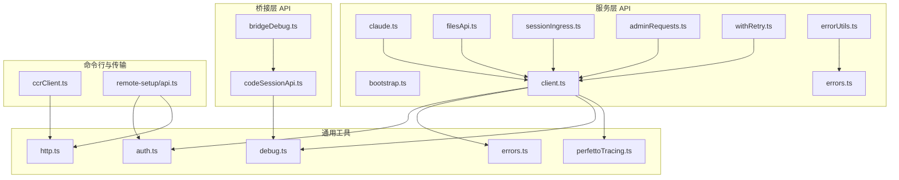
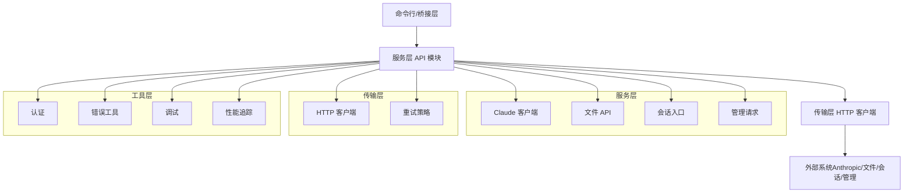
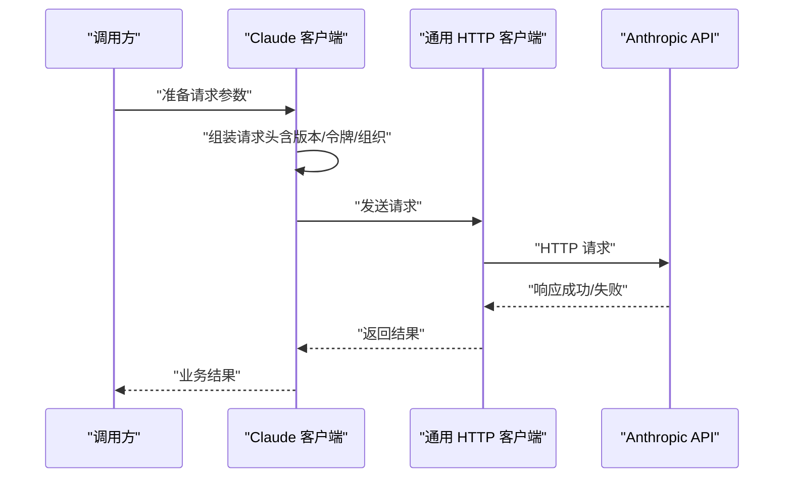
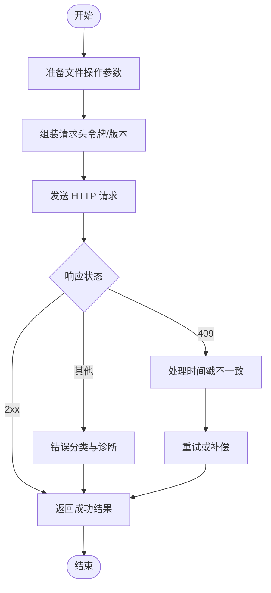
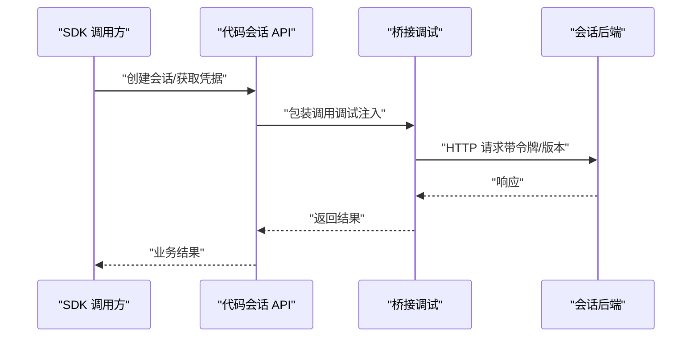
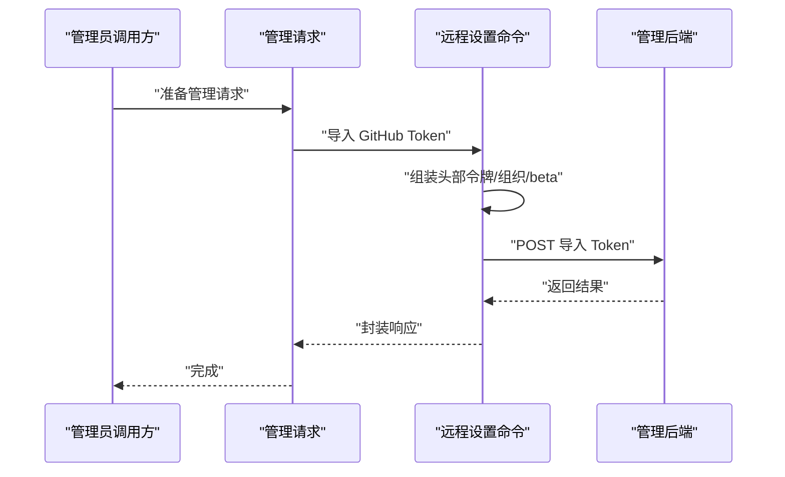
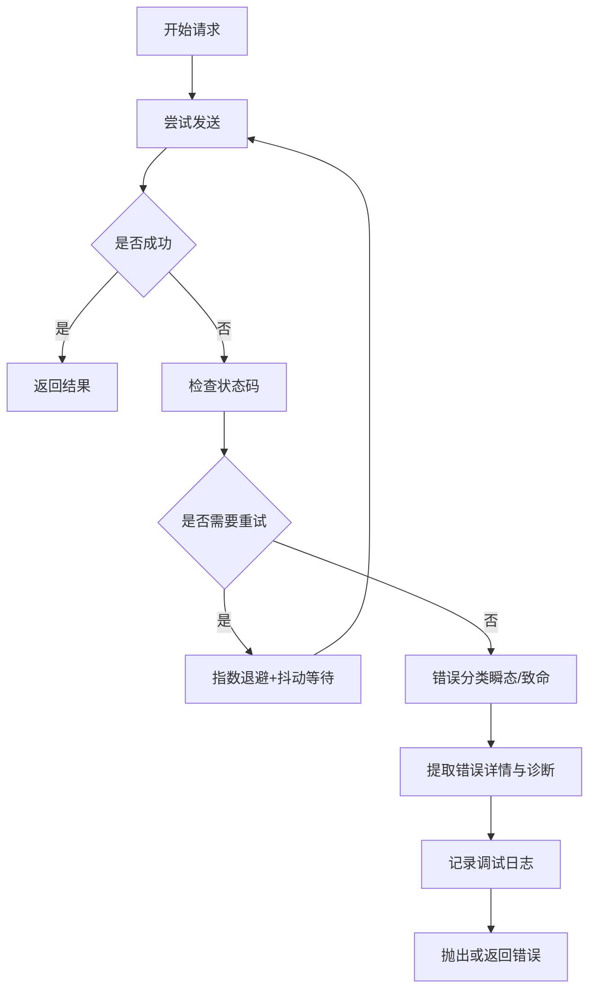
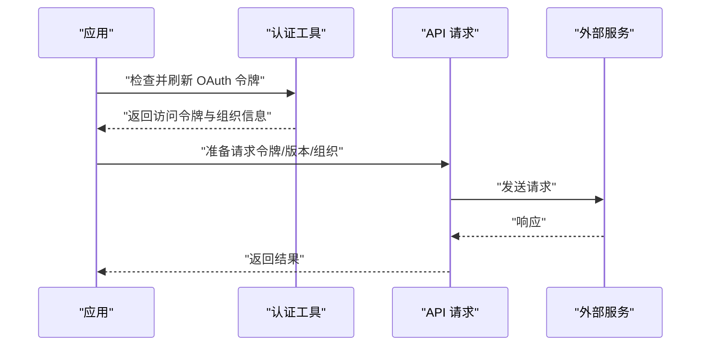
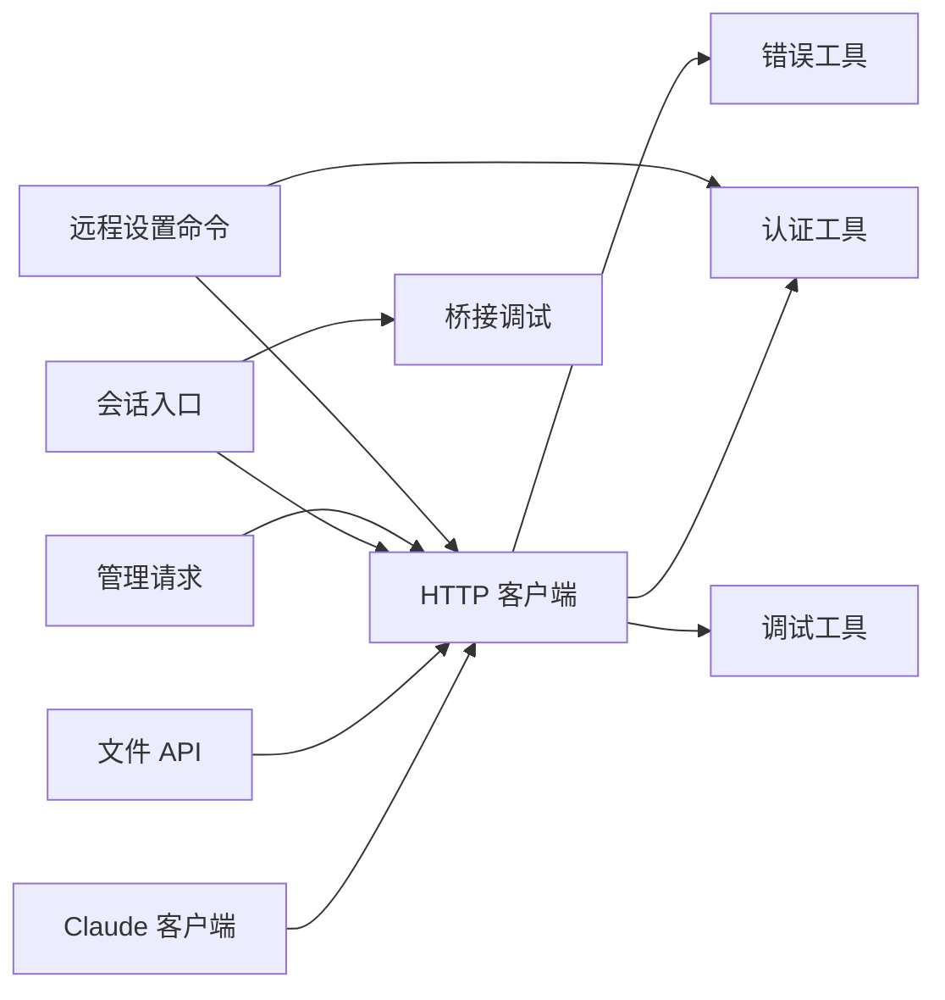

# API 服务

<cite>
**本文引用的文件**
- [src/services/api/bootstrap.ts](file://src/services/api/bootstrap.ts)
- [src/services/api/claude.ts](file://src/services/api/claude.ts)
- [src/services/api/client.ts](file://src/services/api/client.ts)
- [src/services/api/filesApi.ts](file://src/services/api/filesApi.ts)
- [src/services/api/sessionIngress.ts](file://src/services/api/sessionIngress.ts)
- [src/services/api/adminRequests.ts](file://src/services/api/adminRequests.ts)
- [src/services/api/withRetry.ts](file://src/services/api/withRetry.ts)
- [src/services/api/errorUtils.ts](file://src/services/api/errorUtils.ts)
- [src/services/api/errors.ts](file://src/services/api/errors.ts)
- [src/bridge/codeSessionApi.ts](file://src/bridge/codeSessionApi.ts)
- [src/bridge/bridgeDebug.ts](file://src/bridge/bridgeDebug.ts)
- [src/commands/remote-setup/api.ts](file://src/commands/remote-setup/api.ts)
- [src/cli/transports/ccrClient.ts](file://src/cli/transports/ccrClient.ts)
- [src/utils/auth.ts](file://src/utils/auth.ts)
- [src/utils/errors.ts](file://src/utils/errors.ts)
- [src/utils/debug.ts](file://src/utils/debug.ts)
- [src/utils/http.ts](file://src/utils/http.ts)
- [src/utils/telemetry/perfettoTracing.ts](file://src/utils/telemetry/perfettoTracing.ts)
</cite>

## 目录
1. [简介](#简介)
2. [项目结构](#项目结构)
3. [核心组件](#核心组件)
4. [架构总览](#架构总览)
5. [详细组件分析](#详细组件分析)
6. [依赖关系分析](#依赖关系分析)
7. [性能考虑](#性能考虑)
8. [故障排查指南](#故障排查指南)
9. [结论](#结论)
10. [附录](#附录)

## 简介
本文件系统性梳理 API 服务模块的设计与实现，覆盖客户端初始化、请求处理、错误管理与重试机制；详解各类 API（Claude API、文件 API、会话 API、管理 API）的功能与使用方式；阐述认证机制、请求格式化、响应解析与异常处理策略，并给出同步与异步调用的参考路径与最佳实践。同时说明与外部系统的集成方式与配置要点，以及性能优化与错误恢复策略。

## 项目结构
API 服务主要分布在以下区域：
- 服务层 API：位于 src/services/api 下，包含 Claude 客户端、文件 API、会话入口、管理请求、重试与错误工具等。
- 桥接层 API：位于 src/bridge 下，提供代码会话相关 HTTP 封装与调试注入能力。
- 命令行与传输层：位于 src/cli/transports 与命令实现中，提供带指数退避的 HTTP 请求封装。
- 认证与通用工具：位于 src/utils 下，提供认证、错误、HTTP 工具与性能追踪。

**图示来源**
- [src/services/api/bootstrap.ts](file://src/services/api/bootstrap.ts)
- [src/services/api/claude.ts](file://src/services/api/claude.ts)
- [src/services/api/client.ts](file://src/services/api/client.ts)
- [src/services/api/filesApi.ts](file://src/services/api/filesApi.ts)
- [src/services/api/sessionIngress.ts](file://src/services/api/sessionIngress.ts)
- [src/services/api/adminRequests.ts](file://src/services/api/adminRequests.ts)
- [src/services/api/withRetry.ts](file://src/services/api/withRetry.ts)
- [src/services/api/errorUtils.ts](file://src/services/api/errorUtils.ts)
- [src/services/api/errors.ts](file://src/services/api/errors.ts)
- [src/bridge/codeSessionApi.ts](file://src/bridge/codeSessionApi.ts)
- [src/bridge/bridgeDebug.ts](file://src/bridge/bridgeDebug.ts)
- [src/cli/transports/ccrClient.ts](file://src/cli/transports/ccrClient.ts)
- [src/commands/remote-setup/api.ts](file://src/commands/remote-setup/api.ts)
- [src/utils/auth.ts](file://src/utils/auth.ts)
- [src/utils/errors.ts](file://src/utils/errors.ts)
- [src/utils/debug.ts](file://src/utils/debug.ts)
- [src/utils/http.ts](file://src/utils/http.ts)
- [src/utils/telemetry/perfettoTracing.ts](file://src/utils/telemetry/perfettoTracing.ts)

**章节来源**
- [src/services/api/bootstrap.ts](file://src/services/api/bootstrap.ts)
- [src/services/api/claude.ts](file://src/services/api/claude.ts)
- [src/services/api/client.ts](file://src/services/api/client.ts)
- [src/services/api/filesApi.ts](file://src/services/api/filesApi.ts)
- [src/services/api/sessionIngress.ts](file://src/services/api/sessionIngress.ts)
- [src/services/api/adminRequests.ts](file://src/services/api/adminRequests.ts)
- [src/services/api/withRetry.ts](file://src/services/api/withRetry.ts)
- [src/services/api/errorUtils.ts](file://src/services/api/errorUtils.ts)
- [src/services/api/errors.ts](file://src/services/api/errors.ts)
- [src/bridge/codeSessionApi.ts](file://src/bridge/codeSessionApi.ts)
- [src/bridge/bridgeDebug.ts](file://src/bridge/bridgeDebug.ts)
- [src/cli/transports/ccrClient.ts](file://src/cli/transports/ccrClient.ts)
- [src/commands/remote-setup/api.ts](file://src/commands/remote-setup/api.ts)
- [src/utils/auth.ts](file://src/utils/auth.ts)
- [src/utils/errors.ts](file://src/utils/errors.ts)
- [src/utils/debug.ts](file://src/utils/debug.ts)
- [src/utils/http.ts](file://src/utils/http.ts)
- [src/utils/telemetry/perfettoTracing.ts](file://src/utils/telemetry/perfettoTracing.ts)

## 核心组件
- Claude 客户端与通用 API 客户端：封装 Anthropic API 调用与通用 HTTP 客户端，负责请求头、版本号、超时与重试策略。
- 文件 API：提供文件上传、下载、删除等操作的统一接口。
- 会话入口 API：面向代码会话的后端交互封装，支持桥接与远程会话。
- 管理 API：面向管理员或内部使用的请求封装。
- 重试与错误工具：提供统一的指数退避重试、错误分类与诊断信息提取。
- 桥接调试：在特定构建下对 API 调用进行“故障注入”，便于测试容错与恢复。
- 命令行传输层：提供带重试的 HTTP GET 封装，支持幂等与状态码处理。
- 认证与通用工具：提供 OAuth 令牌刷新、准备 API 请求参数、错误消息提取与调试日志。

**章节来源**
- [src/services/api/claude.ts](file://src/services/api/claude.ts)
- [src/services/api/client.ts](file://src/services/api/client.ts)
- [src/services/api/filesApi.ts](file://src/services/api/filesApi.ts)
- [src/services/api/sessionIngress.ts](file://src/services/api/sessionIngress.ts)
- [src/services/api/adminRequests.ts](file://src/services/api/adminRequests.ts)
- [src/services/api/withRetry.ts](file://src/services/api/withRetry.ts)
- [src/services/api/errorUtils.ts](file://src/services/api/errorUtils.ts)
- [src/bridge/codeSessionApi.ts](file://src/bridge/codeSessionApi.ts)
- [src/bridge/bridgeDebug.ts](file://src/bridge/bridgeDebug.ts)
- [src/cli/transports/ccrClient.ts](file://src/cli/transports/ccrClient.ts)
- [src/utils/auth.ts](file://src/utils/auth.ts)
- [src/utils/errors.ts](file://src/utils/errors.ts)
- [src/utils/debug.ts](file://src/utils/debug.ts)

## 架构总览
API 服务采用分层设计：
- 表现层：命令行与桥接层发起请求。
- 服务层：各 API 模块（Claude、文件、会话、管理）提供业务语义化的封装。
- 传输层：通用 HTTP 客户端与指数退避重试。
- 工具层：认证、错误、调试与性能追踪。

**图示来源**
- [src/services/api/claude.ts](file://src/services/api/claude.ts)
- [src/services/api/client.ts](file://src/services/api/client.ts)
- [src/services/api/filesApi.ts](file://src/services/api/filesApi.ts)
- [src/services/api/sessionIngress.ts](file://src/services/api/sessionIngress.ts)
- [src/services/api/adminRequests.ts](file://src/services/api/adminRequests.ts)
- [src/services/api/withRetry.ts](file://src/services/api/withRetry.ts)
- [src/services/api/errorUtils.ts](file://src/services/api/errorUtils.ts)
- [src/utils/auth.ts](file://src/utils/auth.ts)
- [src/utils/errors.ts](file://src/utils/errors.ts)
- [src/utils/debug.ts](file://src/utils/debug.ts)
- [src/utils/telemetry/perfettoTracing.ts](file://src/utils/telemetry/perfettoTracing.ts)

## 详细组件分析

### Claude API 组件
- 功能概述：封装与 Anthropic Claude API 的交互，设置标准请求头（含版本号）、组织标识与访问令牌。
- 关键点：
  - 请求头标准化：包含授权、内容类型与 API 版本。
  - 组织维度：通过组织 UUID 限定调用范围。
  - 与通用客户端协作：复用统一的 HTTP 客户端与重试策略。
- 典型调用路径参考：
  - [src/services/api/claude.ts](file://src/services/api/claude.ts)
  - [src/services/api/client.ts](file://src/services/api/client.ts)
  - [src/utils/auth.ts](file://src/utils/auth.ts)

**图示来源**
- [src/services/api/claude.ts](file://src/services/api/claude.ts)
- [src/services/api/client.ts](file://src/services/api/client.ts)
- [src/utils/auth.ts](file://src/utils/auth.ts)

**章节来源**
- [src/services/api/claude.ts](file://src/services/api/claude.ts)
- [src/services/api/client.ts](file://src/services/api/client.ts)
- [src/utils/auth.ts](file://src/utils/auth.ts)

### 文件 API 组件
- 功能概述：提供文件上传、下载、删除等操作的统一接口，确保请求头与版本兼容。
- 关键点：
  - 请求头标准化：授权、内容类型与 API 版本。
  - 错误分类与诊断：结合错误工具与调试日志定位问题。
- 典型调用路径参考：
  - [src/services/api/filesApi.ts](file://src/services/api/filesApi.ts)
  - [src/services/api/client.ts](file://src/services/api/client.ts)
  - [src/utils/errors.ts](file://src/utils/errors.ts)

**图示来源**
- [src/services/api/filesApi.ts](file://src/services/api/filesApi.ts)
- [src/services/api/client.ts](file://src/services/api/client.ts)
- [src/utils/errors.ts](file://src/utils/errors.ts)

**章节来源**
- [src/services/api/filesApi.ts](file://src/services/api/filesApi.ts)
- [src/services/api/client.ts](file://src/services/api/client.ts)
- [src/utils/errors.ts](file://src/utils/errors.ts)

### 会话 API 组件
- 功能概述：面向代码会话的后端交互，提供桥接与远程会话能力，支持独立导出以避免捆绑重型 CLI 依赖。
- 关键点：
  - 独立导出：SDK 桥接子路径可单独导出会话 API，减少打包体积。
  - 请求头标准化：授权、JSON 内容类型与 API 版本。
  - 调试注入：在特定构建下对调用进行故障注入，便于测试。
- 典型调用路径参考：
  - [src/bridge/codeSessionApi.ts](file://src/bridge/codeSessionApi.ts)
  - [src/bridge/bridgeDebug.ts](file://src/bridge/bridgeDebug.ts)
  - [src/utils/debug.ts](file://src/utils/debug.ts)

**图示来源**
- [src/bridge/codeSessionApi.ts](file://src/bridge/codeSessionApi.ts)
- [src/bridge/bridgeDebug.ts](file://src/bridge/bridgeDebug.ts)
- [src/utils/debug.ts](file://src/utils/debug.ts)

**章节来源**
- [src/bridge/codeSessionApi.ts](file://src/bridge/codeSessionApi.ts)
- [src/bridge/bridgeDebug.ts](file://src/bridge/bridgeDebug.ts)
- [src/utils/debug.ts](file://src/utils/debug.ts)

### 管理 API 组件
- 功能概述：面向管理员或内部使用的请求封装，统一处理认证与组织维度。
- 关键点：
  - 组织维度：通过 x-organization-uuid 限定作用域。
  - 头部扩展：支持特定 beta 标识。
- 典型调用路径参考：
  - [src/services/api/adminRequests.ts](file://src/services/api/adminRequests.ts)
  - [src/commands/remote-setup/api.ts](file://src/commands/remote-setup/api.ts)
  - [src/utils/auth.ts](file://src/utils/auth.ts)

**图示来源**
- [src/services/api/adminRequests.ts](file://src/services/api/adminRequests.ts)
- [src/commands/remote-setup/api.ts](file://src/commands/remote-setup/api.ts)
- [src/utils/auth.ts](file://src/utils/auth.ts)

**章节来源**
- [src/services/api/adminRequests.ts](file://src/services/api/adminRequests.ts)
- [src/commands/remote-setup/api.ts](file://src/commands/remote-setup/api.ts)
- [src/utils/auth.ts](file://src/utils/auth.ts)

### 重试与错误管理
- 重试策略：指数退避与抖动，限制最大重试次数，记录调试日志。
- 错误分类：区分瞬态与致命错误，支持错误详情提取与诊断。
- 性能追踪：在性能追踪中记录请求阶段、重试阶段与首 token 阶段，辅助定位瓶颈。
- 典型调用路径参考：
  - [src/services/api/withRetry.ts](file://src/services/api/withRetry.ts)
  - [src/services/api/errorUtils.ts](file://src/services/api/errorUtils.ts)
  - [src/services/api/errors.ts](file://src/services/api/errors.ts)
  - [src/cli/transports/ccrClient.ts](file://src/cli/transports/ccrClient.ts)
  - [src/utils/telemetry/perfettoTracing.ts](file://src/utils/telemetry/perfettoTracing.ts)

**图示来源**
- [src/services/api/withRetry.ts](file://src/services/api/withRetry.ts)
- [src/services/api/errorUtils.ts](file://src/services/api/errorUtils.ts)
- [src/services/api/errors.ts](file://src/services/api/errors.ts)
- [src/cli/transports/ccrClient.ts](file://src/cli/transports/ccrClient.ts)
- [src/utils/telemetry/perfettoTracing.ts](file://src/utils/telemetry/perfettoTracing.ts)

**章节来源**
- [src/services/api/withRetry.ts](file://src/services/api/withRetry.ts)
- [src/services/api/errorUtils.ts](file://src/services/api/errorUtils.ts)
- [src/services/api/errors.ts](file://src/services/api/errors.ts)
- [src/cli/transports/ccrClient.ts](file://src/cli/transports/ccrClient.ts)
- [src/utils/telemetry/perfettoTracing.ts](file://src/utils/telemetry/perfettoTracing.ts)

### 认证机制与请求格式化
- 认证流程：在应用启动时准备 API 请求参数，必要时刷新 OAuth 令牌，生成访问令牌与组织 UUID。
- 请求格式化：统一设置授权头、内容类型与 API 版本；部分场景附加组织维度与 beta 标识。
- 典型调用路径参考：
  - [src/utils/auth.ts](file://src/utils/auth.ts)
  - [src/services/api/claude.ts](file://src/services/api/claude.ts)
  - [src/services/api/client.ts](file://src/services/api/client.ts)
  - [src/commands/remote-setup/api.ts](file://src/commands/remote-setup/api.ts)

**图示来源**
- [src/utils/auth.ts](file://src/utils/auth.ts)
- [src/services/api/claude.ts](file://src/services/api/claude.ts)
- [src/services/api/client.ts](file://src/services/api/client.ts)
- [src/commands/remote-setup/api.ts](file://src/commands/remote-setup/api.ts)

**章节来源**
- [src/utils/auth.ts](file://src/utils/auth.ts)
- [src/services/api/claude.ts](file://src/services/api/claude.ts)
- [src/services/api/client.ts](file://src/services/api/client.ts)
- [src/commands/remote-setup/api.ts](file://src/commands/remote-setup/api.ts)

### 响应解析与异常处理策略
- 响应解析：根据状态码判断成功或失败，解析数据体；对特定状态码（如 409）执行特殊处理（如时间戳不一致）。
- 异常处理：区分瞬态与致命错误，记录调试日志与错误详情；在桥接层支持故障注入以模拟网络与服务端错误。
- 典型调用路径参考：
  - [src/services/api/client.ts](file://src/services/api/client.ts)
  - [src/bridge/codeSessionApi.ts](file://src/bridge/codeSessionApi.ts)
  - [src/bridge/bridgeDebug.ts](file://src/bridge/bridgeDebug.ts)
  - [src/utils/errors.ts](file://src/utils/errors.ts)

**章节来源**
- [src/services/api/client.ts](file://src/services/api/client.ts)
- [src/bridge/codeSessionApi.ts](file://src/bridge/codeSessionApi.ts)
- [src/bridge/bridgeDebug.ts](file://src/bridge/bridgeDebug.ts)
- [src/utils/errors.ts](file://src/utils/errors.ts)

### 同步与异步调用示例（路径指引）
- Claude API 同步调用：准备请求参数 → 组装请求头 → 发送请求 → 解析响应。
  - 参考路径：[src/services/api/claude.ts](file://src/services/api/claude.ts)
- 文件 API 异步调用：准备文件参数 → 组装请求头 → 发送请求（带重试） → 解析响应。
  - 参考路径：[src/services/api/filesApi.ts](file://src/services/api/filesApi.ts)
- 会话 API 异步调用：SDK 调用 → 包装调用（调试注入） → 发送请求 → 返回结果。
  - 参考路径：[src/bridge/codeSessionApi.ts](file://src/bridge/codeSessionApi.ts)
- 管理 API 异步调用：准备管理请求 → 组装头部（令牌/组织/beta） → 发送请求 → 返回结果。
  - 参考路径：[src/commands/remote-setup/api.ts](file://src/commands/remote-setup/api.ts)

**章节来源**
- [src/services/api/claude.ts](file://src/services/api/claude.ts)
- [src/services/api/filesApi.ts](file://src/services/api/filesApi.ts)
- [src/bridge/codeSessionApi.ts](file://src/bridge/codeSessionApi.ts)
- [src/commands/remote-setup/api.ts](file://src/commands/remote-setup/api.ts)

## 依赖关系分析
- 组件耦合：
  - 服务层 API 模块依赖通用 HTTP 客户端与认证工具。
  - 桥接层 API 依赖调试工具与通用 HTTP 客户端。
  - 命令行传输层独立封装 HTTP 请求，复用通用 HTTP 工具。
- 外部依赖：
  - 与 Anthropic API 的版本兼容性由请求头中的版本号保证。
  - 与 GitHub 的集成通过远程设置命令完成，使用 OAuth 令牌与组织维度。
- 循环依赖：
  - 通过模块拆分与独立导出避免循环依赖（例如会话 API 的 SDK 导出）。

**图示来源**
- [src/services/api/claude.ts](file://src/services/api/claude.ts)
- [src/services/api/client.ts](file://src/services/api/client.ts)
- [src/services/api/filesApi.ts](file://src/services/api/filesApi.ts)
- [src/services/api/sessionIngress.ts](file://src/services/api/sessionIngress.ts)
- [src/services/api/adminRequests.ts](file://src/services/api/adminRequests.ts)
- [src/bridge/codeSessionApi.ts](file://src/bridge/codeSessionApi.ts)
- [src/bridge/bridgeDebug.ts](file://src/bridge/bridgeDebug.ts)
- [src/commands/remote-setup/api.ts](file://src/commands/remote-setup/api.ts)
- [src/utils/auth.ts](file://src/utils/auth.ts)
- [src/utils/errors.ts](file://src/utils/errors.ts)
- [src/utils/debug.ts](file://src/utils/debug.ts)

**章节来源**
- [src/services/api/claude.ts](file://src/services/api/claude.ts)
- [src/services/api/client.ts](file://src/services/api/client.ts)
- [src/services/api/filesApi.ts](file://src/services/api/filesApi.ts)
- [src/services/api/sessionIngress.ts](file://src/services/api/sessionIngress.ts)
- [src/services/api/adminRequests.ts](file://src/services/api/adminRequests.ts)
- [src/bridge/codeSessionApi.ts](file://src/bridge/codeSessionApi.ts)
- [src/bridge/bridgeDebug.ts](file://src/bridge/bridgeDebug.ts)
- [src/commands/remote-setup/api.ts](file://src/commands/remote-setup/api.ts)
- [src/utils/auth.ts](file://src/utils/auth.ts)
- [src/utils/errors.ts](file://src/utils/errors.ts)
- [src/utils/debug.ts](file://src/utils/debug.ts)

## 性能考虑
- 指数退避与抖动：降低并发冲突与后端压力，提升成功率。
- 首 token 采样与 TTFT 追踪：在性能追踪中记录请求阶段、重试阶段与首 token 阶段，辅助定位延迟瓶颈。
- 请求头与版本兼容：统一的 API 版本与内容类型减少不必要的重试与解析开销。
- 最大重试次数与超时：在传输层设置合理的超时与最大重试次数，避免长时间阻塞。

**章节来源**
- [src/services/api/withRetry.ts](file://src/services/api/withRetry.ts)
- [src/utils/telemetry/perfettoTracing.ts](file://src/utils/telemetry/perfettoTracing.ts)
- [src/cli/transports/ccrClient.ts](file://src/cli/transports/ccrClient.ts)

## 故障排查指南
- 常见问题：
  - 瞬态错误：网络波动、服务端 5xx，通过重试策略自动恢复。
  - 致命错误：认证失败、参数错误，需人工介入修正。
  - 时间戳不一致：遇到 409 状态码时触发补偿逻辑。
- 调试手段：
  - 使用桥接调试对调用进行故障注入，模拟网络与服务端错误。
  - 提取错误详情与诊断信息，结合调试日志定位问题。
- 建议流程：
  - 记录请求与响应上下文 → 分类错误类型 → 应用重试或补偿 → 上报与告警。

**章节来源**
- [src/bridge/bridgeDebug.ts](file://src/bridge/bridgeDebug.ts)
- [src/services/api/errorUtils.ts](file://src/services/api/errorUtils.ts)
- [src/services/api/errors.ts](file://src/services/api/errors.ts)
- [src/utils/errors.ts](file://src/utils/errors.ts)
- [src/utils/debug.ts](file://src/utils/debug.ts)

## 结论
本 API 服务模块通过清晰的分层设计与统一的客户端封装，实现了对 Claude API、文件 API、会话 API 与管理 API 的一致化接入。配合指数退避重试、错误分类与调试注入机制，能够在复杂环境中保持高可用与可观测性。建议在生产环境遵循统一的请求头规范、合理设置重试与超时参数，并持续利用性能追踪与调试工具优化体验。

## 附录
- 配置与环境变量：组织 UUID、访问令牌、API 版本与用户代理等通过认证与客户端工具集中管理。
- 最佳实践：
  - 统一请求头与版本号，避免兼容性问题。
  - 对易失败接口启用重试策略，对瞬态错误快速恢复。
  - 在开发与测试构建中启用桥接调试，验证容错与恢复链路。
  - 使用性能追踪记录关键阶段，持续优化首 token 与整体延迟。