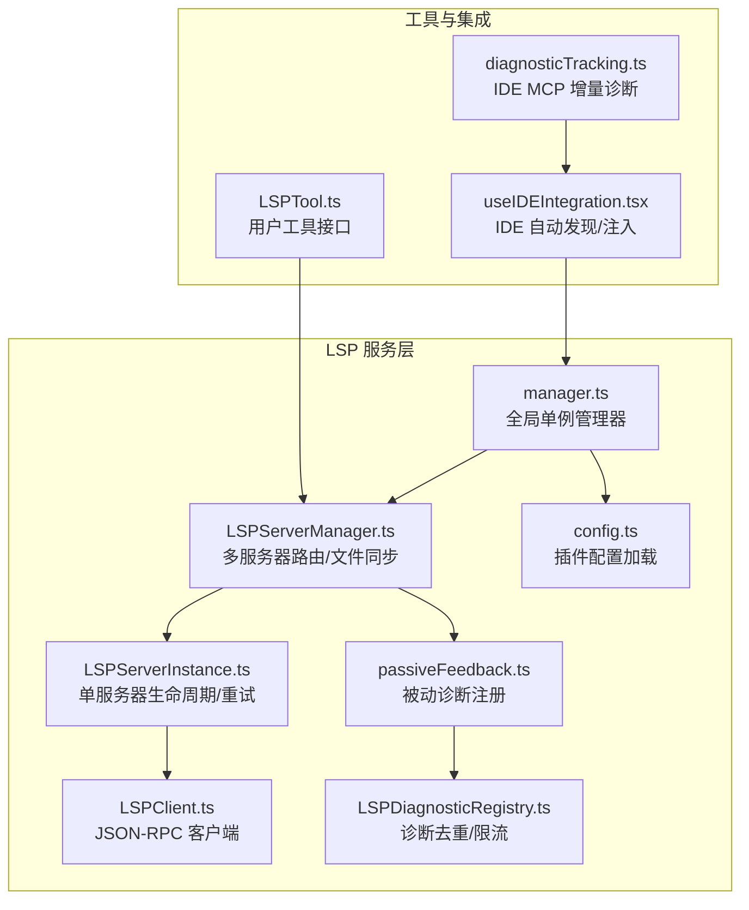
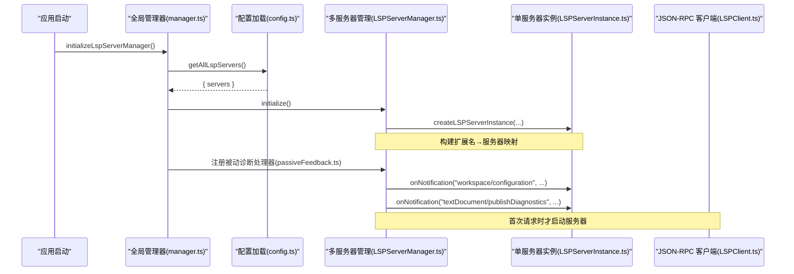
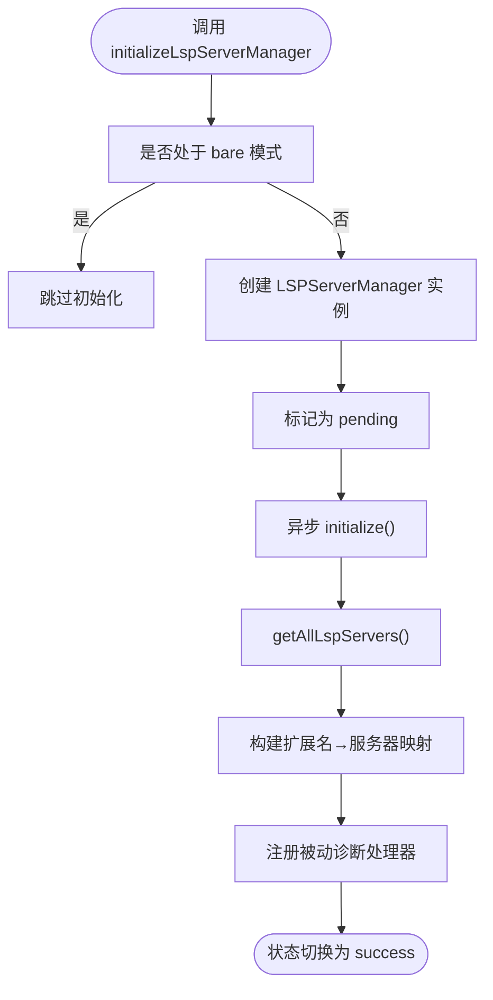
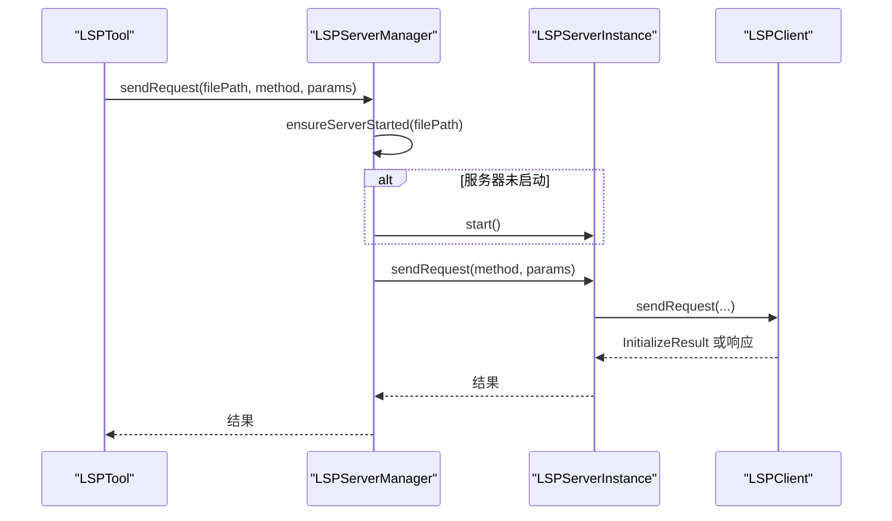
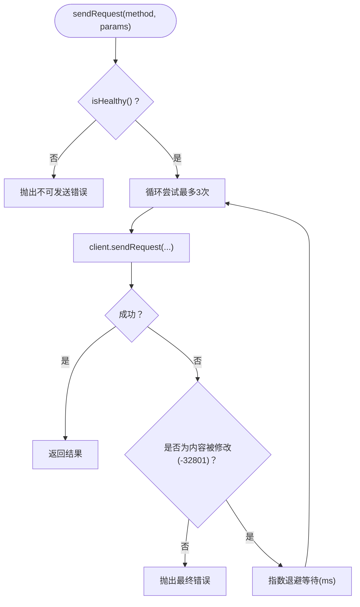
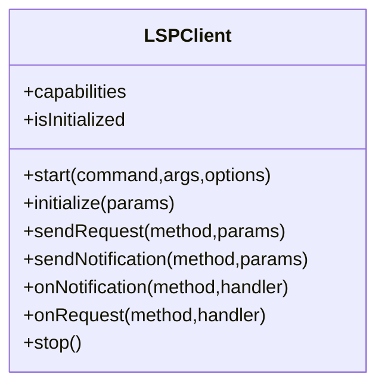
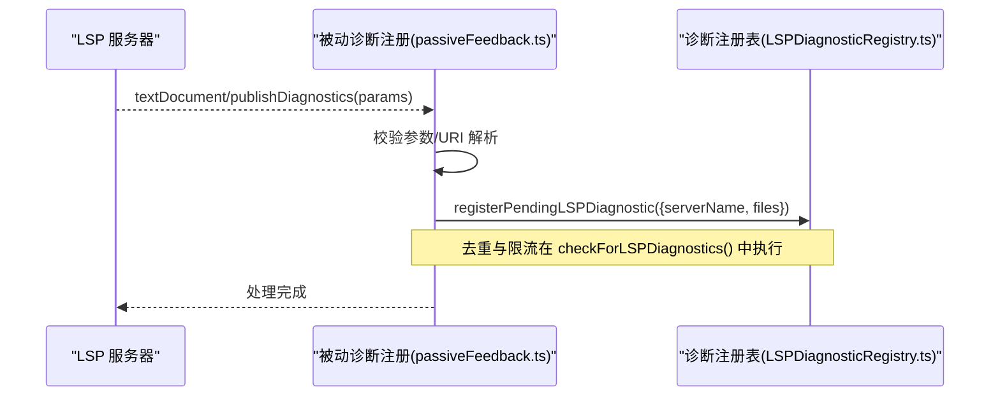
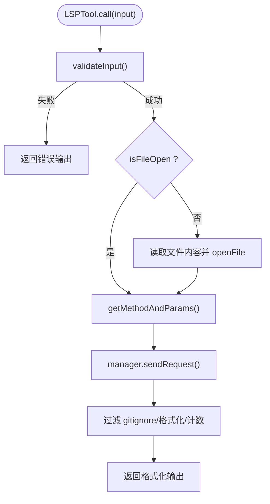
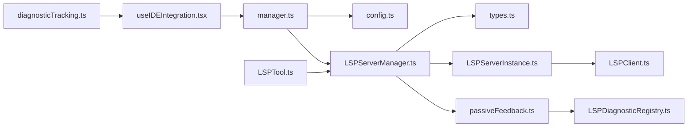

# LSP 服务

<cite>
**本文引用的文件**
- [LSPServerManager.ts](file://src/services/lsp/LSPServerManager.ts)
- [LSPServerInstance.ts](file://src/services/lsp/LSPServerInstance.ts)
- [LSPClient.ts](file://src/services/lsp/LSPClient.ts)
- [LSPDiagnosticRegistry.ts](file://src/services/lsp/LSPDiagnosticRegistry.ts)
- [passiveFeedback.ts](file://src/services/lsp/passiveFeedback.ts)
- [config.ts](file://src/services/lsp/config.ts)
- [manager.ts](file://src/services/lsp/manager.ts)
- [types.ts](file://src/services/lsp/types.ts)
- [LSPTool.ts](file://src/tools/LSPTool/LSPTool.ts)
- [useIDEIntegration.tsx](file://src/hooks/useIDEIntegration.tsx)
- [diagnosticTracking.ts](file://src/services/diagnosticTracking.ts)
</cite>

## 目录
1. [简介](#简介)
2. [项目结构](#项目结构)
3. [核心组件](#核心组件)
4. [架构总览](#架构总览)
5. [详细组件分析](#详细组件分析)
6. [依赖关系分析](#依赖关系分析)
7. [性能考虑](#性能考虑)
8. [故障排除指南](#故障排除指南)
9. [结论](#结论)
10. [附录](#附录)

## 简介
本文件系统性阐述 Claude Code 中 LSP（Language Server Protocol）服务模块的设计与实现，覆盖服务器管理、客户端连接、诊断注册与被动反馈机制、服务器生命周期管理、配置加载与连接建立流程、协议处理与错误恢复策略，并给出与 IDE 集成、代码分析与智能提示的关系说明。同时提供性能优化建议与故障排除指引，帮助开发者在不直接阅读源码的情况下也能高效理解和扩展该模块。

## 项目结构
LSP 服务位于 src/services/lsp 目录下，围绕“单进程多语言服务器”的管理模型构建，采用工厂函数模式封装状态与行为，避免类实例化带来的复杂继承与初始化开销。核心文件职责如下：
- manager.ts：全局单例管理器，负责异步初始化、重初始化与优雅关闭，暴露统一入口供工具层调用。
- LSPServerManager.ts：多服务器路由与请求分发，按文件扩展名选择对应服务器，负责文件同步（didOpen/didChange/didSave/didClose）。
- LSPServerInstance.ts：单服务器生命周期管理（start/stop/restart）、健康检查、请求转发与重试、通知与请求处理器注册。
- LSPClient.ts：基于 vscode-jsonrpc 的进程间通信封装，负责子进程启动、stdio 连接、消息编解码、错误与崩溃处理。
- config.ts：从插件中动态加载 LSP 服务器配置，支持并发加载与合并策略。
- passiveFeedback.ts：被动诊断收集与注册，监听 textDocument/publishDiagnostics 并转换为内部诊断附件格式。
- LSPDiagnosticRegistry.ts：诊断去重、限流与跨轮次去重，保证对话附件稳定交付。
- LSPTool.ts：面向用户的 LSP 工具实现，封装请求映射、权限校验、结果格式化与过滤。
- useIDEIntegration.tsx：IDE 自动发现与动态注入，间接影响 LSP 服务器可用性与诊断来源。
- diagnosticTracking.ts：与 IDE 的 MCP 诊断跟踪服务，对比 baseline 生成增量诊断摘要。

图表来源
- [manager.ts:1-290](file://src/services/lsp/manager.ts#L1-L290)
- [LSPServerManager.ts:1-421](file://src/services/lsp/LSPServerManager.ts#L1-L421)
- [LSPServerInstance.ts:1-512](file://src/services/lsp/LSPServerInstance.ts#L1-L512)
- [LSPClient.ts:1-448](file://src/services/lsp/LSPClient.ts#L1-L448)
- [config.ts:1-80](file://src/services/lsp/config.ts#L1-L80)
- [passiveFeedback.ts:1-329](file://src/services/lsp/passiveFeedback.ts#L1-L329)
- [LSPDiagnosticRegistry.ts:1-387](file://src/services/lsp/LSPDiagnosticRegistry.ts#L1-L387)
- [LSPTool.ts:1-861](file://src/tools/LSPTool/LSPTool.ts#L1-L861)
- [useIDEIntegration.tsx:1-70](file://src/hooks/useIDEIntegration.tsx#L1-L70)
- [diagnosticTracking.ts:1-398](file://src/services/diagnosticTracking.ts#L1-L398)

章节来源
- [manager.ts:1-290](file://src/services/lsp/manager.ts#L1-L290)
- [LSPServerManager.ts:1-421](file://src/services/lsp/LSPServerManager.ts#L1-L421)
- [LSPServerInstance.ts:1-512](file://src/services/lsp/LSPServerInstance.ts#L1-L512)
- [LSPClient.ts:1-448](file://src/services/lsp/LSPClient.ts#L1-L448)
- [config.ts:1-80](file://src/services/lsp/config.ts#L1-L80)
- [passiveFeedback.ts:1-329](file://src/services/lsp/passiveFeedback.ts#L1-L329)
- [LSPDiagnosticRegistry.ts:1-387](file://src/services/lsp/LSPDiagnosticRegistry.ts#L1-L387)
- [LSPTool.ts:1-861](file://src/tools/LSPTool/LSPTool.ts#L1-L861)
- [useIDEIntegration.tsx:1-70](file://src/hooks/useIDEIntegration.tsx#L1-L70)
- [diagnosticTracking.ts:1-398](file://src/services/diagnosticTracking.ts#L1-L398)

## 核心组件
- 全局管理器（manager.ts）
  - 提供 initializeLspServerManager()/shutdownLspServerManager()/reinitializeLspServerManager() 等方法，确保幂等与可重试。
  - 使用 generation 计数器避免陈旧初始化任务覆盖当前状态。
  - 暴露 getLspServerManager()/getInitializationStatus()/waitForInitialization() 供上层安全查询。
- 多服务器管理器（LSPServerManager.ts）
  - 维护服务器实例 Map 与扩展名到服务器列表的映射，按文件扩展名路由请求。
  - 提供 openFile/changeFile/saveFile/closeFile/isFileOpen 等文件同步能力。
  - 对每个服务器注册 workspace/configuration 请求的空响应处理器以满足协议但不提供配置。
- 单服务器实例（LSPServerInstance.ts）
  - 封装状态机（stopped/starting/running/stopping/error），支持手动 restart 与 crashRecoveryCount 限制。
  - sendRequest 内置对“内容被修改”（-32801）的指数退避重试，提升鲁棒性。
  - initialize 时声明客户端能力，兼容新旧 LSP 版本字段。
- JSON-RPC 客户端（LSPClient.ts）
  - 负责子进程 spawn/stdout/stdin/stderr 管理，连接建立与错误/关闭事件处理。
  - 支持延迟注册通知与请求处理器，避免连接未就绪导致的丢失。
- 插件配置加载（config.ts）
  - 并行加载启用插件中的 LSP 服务器定义，合并为全局作用域的服务器集合。
- 被动诊断注册（passiveFeedback.ts）
  - 在所有服务器上注册 textDocument/publishDiagnostics 处理器，转换为内部格式并交由 LSPDiagnosticRegistry 管理。
- 诊断注册表（LSPDiagnosticRegistry.ts）
  - 去重（同文件内与跨轮次）、限流（每文件与总量上限）、排序（按严重程度）。
- 用户工具（LSPTool.ts）
  - 将用户输入映射为标准 LSP 方法，自动确保文件已打开，过滤 gitignore 文件位置，格式化输出。
- IDE 集成钩子（useIDEIntegration.tsx）
  - 自动检测 IDE 并注入动态 MCP 配置，间接影响 LSP 可用性与诊断来源。
- IDE 增量诊断（diagnosticTracking.ts）
  - 通过 MCP 获取 IDE 侧诊断，与 baseline 对比生成增量摘要，用于对话上下文。

章节来源
- [manager.ts:1-290](file://src/services/lsp/manager.ts#L1-L290)
- [LSPServerManager.ts:1-421](file://src/services/lsp/LSPServerManager.ts#L1-L421)
- [LSPServerInstance.ts:1-512](file://src/services/lsp/LSPServerInstance.ts#L1-L512)
- [LSPClient.ts:1-448](file://src/services/lsp/LSPClient.ts#L1-L448)
- [config.ts:1-80](file://src/services/lsp/config.ts#L1-L80)
- [passiveFeedback.ts:1-329](file://src/services/lsp/passiveFeedback.ts#L1-L329)
- [LSPDiagnosticRegistry.ts:1-387](file://src/services/lsp/LSPDiagnosticRegistry.ts#L1-L387)
- [LSPTool.ts:1-861](file://src/tools/LSPTool/LSPTool.ts#L1-L861)
- [useIDEIntegration.tsx:1-70](file://src/hooks/useIDEIntegration.tsx#L1-L70)
- [diagnosticTracking.ts:1-398](file://src/services/diagnosticTracking.ts#L1-L398)

## 架构总览
LSP 服务采用“全局单例 + 多服务器实例 + JSON-RPC 连接”的分层架构。初始化阶段从插件加载配置，随后在首次请求或工具调用时按需启动服务器；运行期通过 LSPServerManager 路由请求并维护文件同步；被动诊断通过注册表进行去重与限流，最终作为对话附件呈现给用户。

图表来源
- [manager.ts:135-208](file://src/services/lsp/manager.ts#L135-L208)
- [config.ts:15-79](file://src/services/lsp/config.ts#L15-L79)
- [LSPServerManager.ts:66-148](file://src/services/lsp/LSPServerManager.ts#L66-L148)
- [LSPServerInstance.ts:106-125](file://src/services/lsp/LSPServerInstance.ts#L106-L125)
- [LSPClient.ts:88-254](file://src/services/lsp/LSPClient.ts#L88-L254)

## 详细组件分析

### 全局管理器（manager.ts）
- 初始化流程
  - 创建 LSPServerManager 实例，标记为 pending。
  - 异步执行 initialize()：加载插件配置、构建映射、注册被动诊断处理器。
  - 使用 generation 计数器防止陈旧初始化任务覆盖当前状态。
- 关闭与重初始化
  - shutdownLspServerManager() 优雅停止所有运行中的服务器并清理状态。
  - reinitializeLspServerManager() 在插件缓存刷新后强制重新加载配置。
- 查询状态
  - getInitializationStatus()/waitForInitialization() 提供状态查询与等待能力。

图表来源
- [manager.ts:145-208](file://src/services/lsp/manager.ts#L145-L208)
- [config.ts:15-79](file://src/services/lsp/config.ts#L15-L79)
- [LSPServerManager.ts:66-148](file://src/services/lsp/LSPServerManager.ts#L66-L148)
- [passiveFeedback.ts:125-328](file://src/services/lsp/passiveFeedback.ts#L125-L328)

章节来源
- [manager.ts:135-290](file://src/services/lsp/manager.ts#L135-L290)

### 多服务器管理器（LSPServerManager.ts）
- 扩展名路由
  - 依据配置中的 extensionToLanguage 映射，将文件扩展名映射到服务器名称列表。
- 文件同步
  - openFile/changeFile/saveFile/closeFile：将本地文件同步到对应 LSP 服务器，确保 didOpen 在 didChange/didSave 前触发。
- 请求分发
  - sendRequest：确保服务器已启动，再转发请求；失败时记录错误并抛出。
- 状态追踪
  - openedFiles：记录文件 URI 到服务器名称的映射，避免重复发送 didOpen。

图表来源
- [LSPServerManager.ts:214-263](file://src/services/lsp/LSPServerManager.ts#L214-L263)
- [LSPServerInstance.ts:355-410](file://src/services/lsp/LSPServerInstance.ts#L355-L410)
- [LSPClient.ts:289-314](file://src/services/lsp/LSPClient.ts#L289-L314)

章节来源
- [LSPServerManager.ts:187-421](file://src/services/lsp/LSPServerManager.ts#L187-L421)

### 单服务器实例（LSPServerInstance.ts）
- 生命周期
  - start()：spawn 子进程、建立连接、发送 initialize 与 initialized，设置状态为 running。
  - stop()/restart()：支持手动重启与 crashRecoveryCount 限制。
- 健康检查
  - isHealthy()：要求 state 为 running 且 client.isInitialized 为真。
- 请求重试
  - sendRequest()：对“内容被修改”错误进行最多 3 次指数退避重试（500ms、1000ms、2000ms）。
- 能力声明
  - initialize() 参数中声明 capabilities，兼容新旧 LSP 字段（如 workspaceFolders、rootUri 等）。

图表来源
- [LSPServerInstance.ts:355-410](file://src/services/lsp/LSPServerInstance.ts#L355-L410)

章节来源
- [LSPServerInstance.ts:90-493](file://src/services/lsp/LSPServerInstance.ts#L90-L493)

### JSON-RPC 客户端（LSPClient.ts）
- 进程管理
  - spawn 启动语言服务器，等待 spawn 成功后再使用 stdout/stdin，避免异步 error 导致未捕获异常。
  - 监听 stderr 输出，便于调试与问题定位。
- 连接与协议
  - 使用 vscode-jsonrpc 建立 MessageConnection，注册 onError/onClose 处理器，避免未处理拒绝。
  - 支持 trace 日志（$setTrace），便于协议级调试。
- 延迟处理器注册
  - 若连接未就绪，将通知与请求处理器加入队列，待连接建立后批量应用。

图表来源
- [LSPClient.ts:21-447](file://src/services/lsp/LSPClient.ts#L21-L447)

章节来源
- [LSPClient.ts:1-448](file://src/services/lsp/LSPClient.ts#L1-L448)

### 被动诊断注册与注册表（passiveFeedback.ts + LSPDiagnosticRegistry.ts）
- 被动诊断注册
  - 遍历所有服务器实例，注册 textDocument/publishDiagnostics 处理器。
  - 对无效参数进行严格校验与日志记录，避免影响其他服务器。
  - 将 LSP 诊断转换为内部 DiagnosticFile[] 格式并交由注册表管理。
- 诊断注册表
  - 去重策略：同批内按内容键去重，跨轮次按文件 URI 与内容键去重。
  - 限流策略：每文件最多 10 条，总计最多 30 条；按严重程度排序（Error>Warning>Info>Hint）。
  - 清理与重置：支持清除待交付项、重置跨轮次跟踪、按文件清理。

图表来源
- [passiveFeedback.ts:125-328](file://src/services/lsp/passiveFeedback.ts#L125-L328)
- [LSPDiagnosticRegistry.ts:65-338](file://src/services/lsp/LSPDiagnosticRegistry.ts#L65-L338)

章节来源
- [passiveFeedback.ts:1-329](file://src/services/lsp/passiveFeedback.ts#L1-329)
- [LSPDiagnosticRegistry.ts:1-387](file://src/services/lsp/LSPDiagnosticRegistry.ts#L1-L387)

### 用户工具（LSPTool.ts）
- 输入验证与权限
  - 使用 Zod 模式校验输入，检查文件存在性与类型，必要时请求文件读取权限。
- 请求映射
  - 将操作（如 goToDefinition/findReferences/hover 等）映射为标准 LSP 方法与参数。
- 文件同步与大小限制
  - 若文件未打开，先读取内容并调用 manager.openFile；对超大文件（默认 10MB）直接返回提示。
- 结果处理
  - 对位置型结果（Location/LocationLink）过滤 gitignore 文件，格式化输出并统计数量。
  - 对调用层次（incomingCalls/outgoingCalls）采用两步流程：先 prepareCallHierarchy，再请求具体 calls。

图表来源
- [LSPTool.ts:224-422](file://src/tools/LSPTool/LSPTool.ts#L224-L422)

章节来源
- [LSPTool.ts:1-861](file://src/tools/LSPTool/LSPTool.ts#L1-L861)

### IDE 集成与诊断来源（useIDEIntegration.tsx + diagnosticTracking.ts）
- IDE 自动发现
  - useIDEIntegration.tsx 在满足条件时自动注入动态 MCP 配置，使 IDE 与 Claude Code 之间具备诊断通道。
- 增量诊断
  - diagnosticTracking.ts 通过 MCP RPC 获取 IDE 诊断，与 baseline 对比生成增量摘要，支持 file:// 与 _claude_fs_right 等 URI 规范化处理。

章节来源
- [useIDEIntegration.tsx:1-70](file://src/hooks/useIDEIntegration.tsx#L1-L70)
- [diagnosticTracking.ts:1-398](file://src/services/diagnosticTracking.ts#L1-L398)

## 依赖关系分析
- 组件耦合
  - manager.ts 仅依赖 config.ts 与 LSPServerManager 接口，保持低耦合。
  - LSPServerManager.ts 依赖 LSPServerInstance 接口与 types.ts 类型，不直接依赖具体实现。
  - LSPServerInstance.ts 依赖 LSPClient 接口，形成清晰的抽象边界。
- 外部依赖
  - vscode-jsonrpc：提供 JSON-RPC 连接与消息编解码。
  - 插件系统：通过 getPluginLspServers 动态加载服务器配置。
- 循环依赖
  - 通过接口与工厂函数避免了循环导入；各模块仅通过公共接口交互。

图表来源
- [manager.ts:1-290](file://src/services/lsp/manager.ts#L1-L290)
- [config.ts:1-80](file://src/services/lsp/config.ts#L1-L80)
- [LSPServerManager.ts:1-421](file://src/services/lsp/LSPServerManager.ts#L1-L421)
- [LSPServerInstance.ts:1-512](file://src/services/lsp/LSPServerInstance.ts#L1-L512)
- [LSPClient.ts:1-448](file://src/services/lsp/LSPClient.ts#L1-L448)
- [passiveFeedback.ts:1-329](file://src/services/lsp/passiveFeedback.ts#L1-L329)
- [LSPDiagnosticRegistry.ts:1-387](file://src/services/lsp/LSPDiagnosticRegistry.ts#L1-L387)
- [LSPTool.ts:1-861](file://src/tools/LSPTool/LSPTool.ts#L1-L861)
- [useIDEIntegration.tsx:1-70](file://src/hooks/useIDEIntegration.tsx#L1-L70)
- [diagnosticTracking.ts:1-398](file://src/services/diagnosticTracking.ts#L1-L398)

章节来源
- [manager.ts:1-290](file://src/services/lsp/manager.ts#L1-L290)
- [LSPServerManager.ts:1-421](file://src/services/lsp/LSPServerManager.ts#L1-L421)
- [LSPServerInstance.ts:1-512](file://src/services/lsp/LSPServerInstance.ts#L1-L512)
- [LSPClient.ts:1-448](file://src/services/lsp/LSPClient.ts#L1-L448)
- [passiveFeedback.ts:1-329](file://src/services/lsp/passiveFeedback.ts#L1-L329)
- [LSPDiagnosticRegistry.ts:1-387](file://src/services/lsp/LSPDiagnosticRegistry.ts#L1-L387)
- [LSPTool.ts:1-861](file://src/tools/LSPTool/LSPTool.ts#L1-L861)
- [useIDEIntegration.tsx:1-70](file://src/hooks/useIDEIntegration.tsx#L1-L70)
- [diagnosticTracking.ts:1-398](file://src/services/diagnosticTracking.ts#L1-L398)

## 性能考虑
- 启动与初始化
  - 使用 generation 计数器避免陈旧初始化任务覆盖当前状态，减少不必要的资源浪费。
  - 并行加载插件 LSP 配置，缩短初始化时间。
- 请求重试与退避
  - 对“内容被修改”错误采用指数退避重试，降低服务器索引期间的抖动影响。
- 文件同步
  - 仅在必要时读取文件内容并 openFile，避免重复 I/O；保存后触发 didSave 以减少无谓请求。
- 诊断处理
  - 去重与限流降低对话附件体积与渲染压力；跨轮次 LRU 缓存控制内存增长。
- 连接健壮性
  - 延迟处理器注册与连接错误/关闭处理，避免未处理拒绝与资源泄漏。

## 故障排除指南
- 服务器无法启动
  - 检查命令是否存在、工作目录是否正确、环境变量是否完整；查看 stderr 输出与错误日志。
  - 若多次 crash，crashRecoveryCount 会阻止无限重启，需手动 restart 或检查服务器配置。
- 请求失败
  - 确认服务器健康状态（isHealthy），若为 error，先 restart 再重试。
  - 对“内容被修改”错误，等待服务器索引完成或稍后重试。
- 诊断未显示
  - 确认被动诊断处理器已注册；检查 URI 解析与参数有效性；确认注册表去重逻辑未过滤掉有效诊断。
- 工具调用无响应
  - 等待初始化完成（waitForInitialization），确保文件已打开（openFile），检查文件大小限制与 gitignore 过滤。
- IDE 诊断缺失
  - 检查 useIDEIntegration 是否注入动态 MCP 配置；确认 diagnosticTracking 初始化与 baseline 正常更新。

章节来源
- [LSPServerInstance.ts:135-264](file://src/services/lsp/LSPServerInstance.ts#L135-L264)
- [LSPClient.ts:144-207](file://src/services/lsp/LSPClient.ts#L144-L207)
- [passiveFeedback.ts:160-277](file://src/services/lsp/passiveFeedback.ts#L160-L277)
- [LSPDiagnosticRegistry.ts:218-338](file://src/services/lsp/LSPDiagnosticRegistry.ts#L218-L338)
- [LSPTool.ts:224-422](file://src/tools/LSPTool/LSPTool.ts#L224-L422)
- [diagnosticTracking.ts:103-182](file://src/services/diagnosticTracking.ts#L103-L182)

## 结论
该 LSP 服务模块通过清晰的分层设计与严格的错误处理，实现了稳定、可扩展的语言服务器管理与诊断集成。其核心优势在于：
- 低耦合的工厂函数模式，易于测试与演进；
- 健壮的生命周期管理与重试策略，适配多种语言服务器；
- 主动与被动诊断结合，既满足即时反馈也兼顾对话上下文；
- 与 IDE 的无缝集成路径，为用户提供一致的编辑体验。

## 附录
- 集成新语言服务器步骤
  - 在插件中提供 LSP 服务器定义（命令、参数、扩展名映射、工作区路径等）。
  - 通过 getAllLspServers 加载配置，LSPServerManager 自动构建路由映射。
  - 首次请求时按需启动服务器，随后即可通过 sendRequest 发送标准 LSP 方法。
- 处理诊断信息
  - 在所有服务器上注册 textDocument/publishDiagnostics 处理器，转换为内部格式并交由注册表去重与限流。
  - 通过 checkForLSPDiagnostics 获取待交付诊断，按需作为对话附件呈现。
- 实现智能提示
  - 使用 LSPTool 的操作映射（如 hover/definition/references/documentSymbol/workspaceSymbol），在工具层统一格式化与过滤，提升用户体验。

章节来源
- [config.ts:15-79](file://src/services/lsp/config.ts#L15-L79)
- [LSPServerManager.ts:66-148](file://src/services/lsp/LSPServerManager.ts#L66-L148)
- [passiveFeedback.ts:125-328](file://src/services/lsp/passiveFeedback.ts#L125-L328)
- [LSPDiagnosticRegistry.ts:65-338](file://src/services/lsp/LSPDiagnosticRegistry.ts#L65-L338)
- [LSPTool.ts:424-513](file://src/tools/LSPTool/LSPTool.ts#L424-L513)