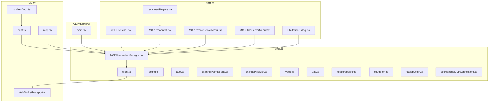
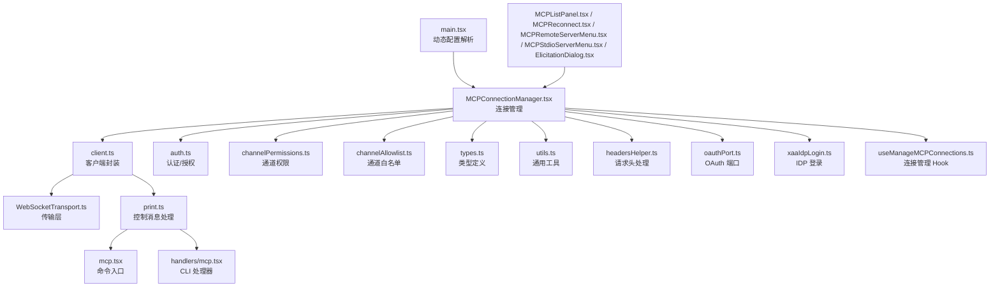
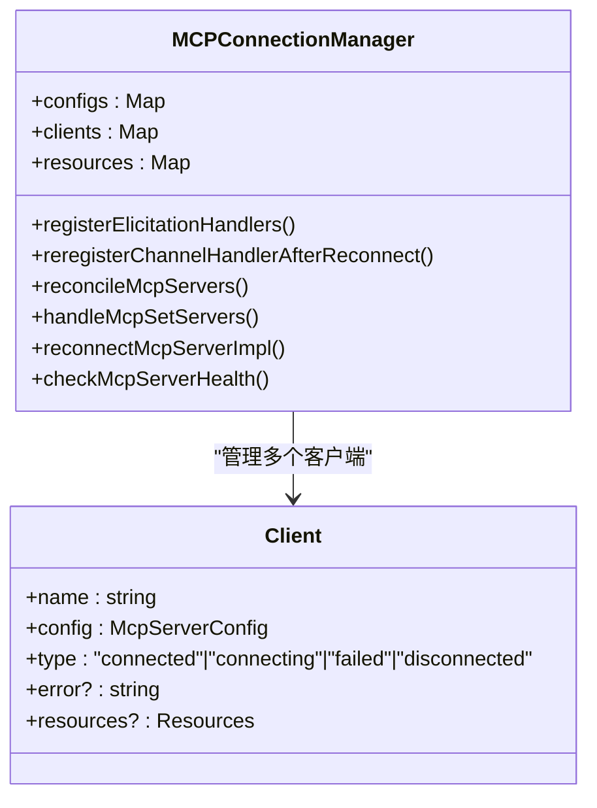
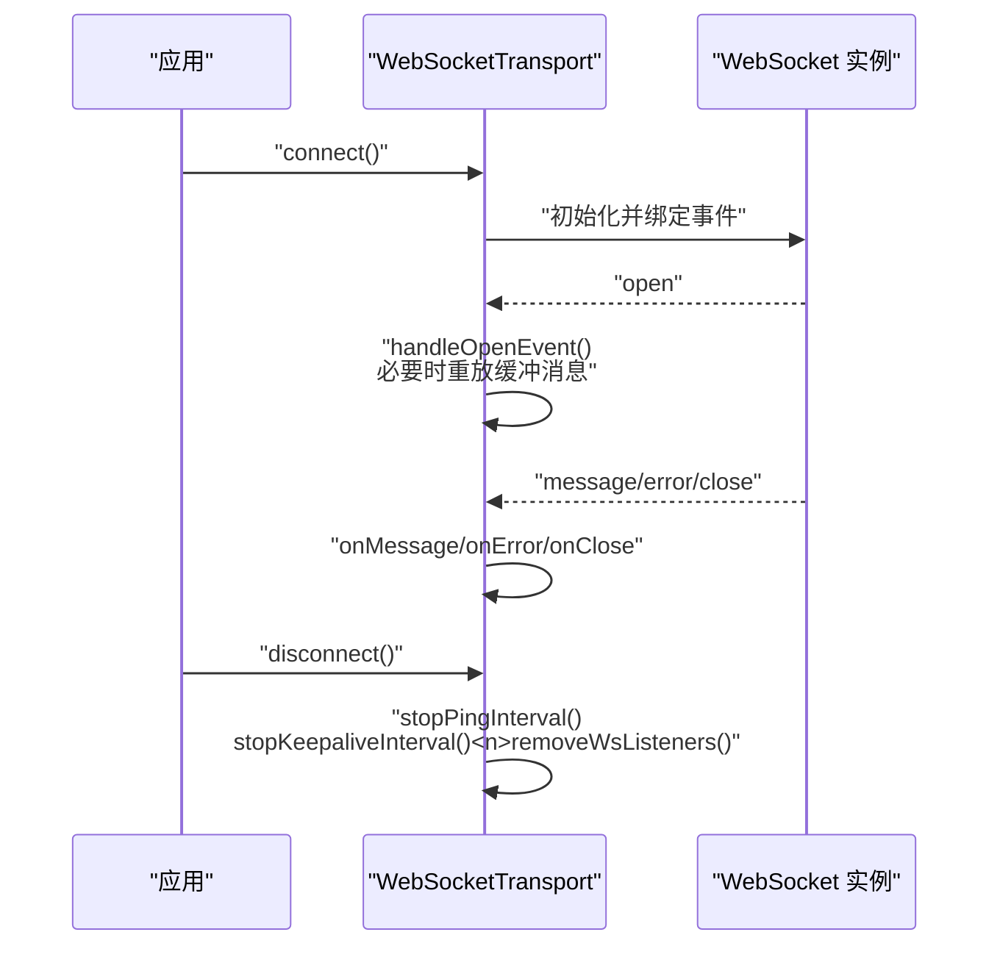
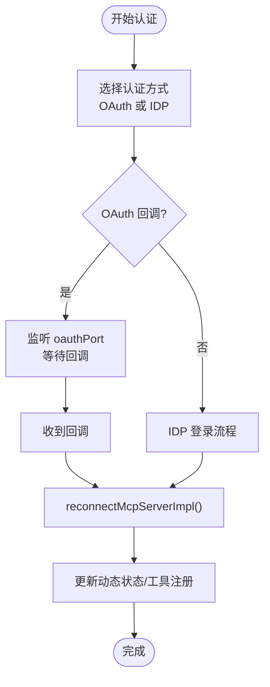
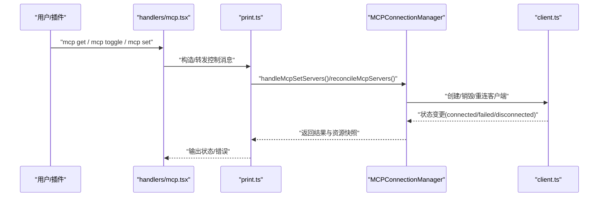
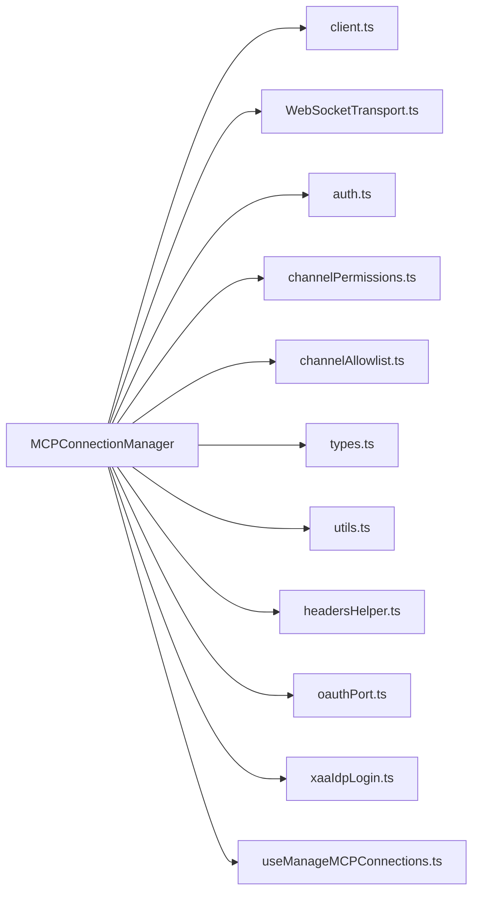

# MCP 服务

<cite>
**本文引用的文件**
- [src/services/mcp/MCPConnectionManager.tsx](file://src/services/mcp/MCPConnectionManager.tsx)
- [src/services/mcp/client.ts](file://src/services/mcp/client.ts)
- [src/services/mcp/config.ts](file://src/services/mcp/config.ts)
- [src/services/mcp/auth.ts](file://src/services/mcp/auth.ts)
- [src/services/mcp/channelPermissions.ts](file://src/services/mcp/channelPermissions.ts)
- [src/services/mcp/channelAllowlist.ts](file://src/services/mcp/channelAllowlist.ts)
- [src/services/mcp/officialRegistry.ts](file://src/services/mcp/officialRegistry.ts)
- [src/services/mcp/types.ts](file://src/services/mcp/types.ts)
- [src/services/mcp/utils.ts](file://src/services/mcp/utils.ts)
- [src/services/mcp/headersHelper.ts](file://src/services/mcp/headersHelper.ts)
- [src/services/mcp/oauthPort.ts](file://src/services/mcp/oauthPort.ts)
- [src/services/mcp/xaaIdpLogin.ts](file://src/services/mcp/xaaIdpLogin.ts)
- [src/services/mcp/useManageMCPConnections.ts](file://src/services/mcp/useManageMCPConnections.ts)
- [src/cli/transports/WebSocketTransport.ts](file://src/cli/transports/WebSocketTransport.ts)
- [src/cli/print.ts](file://src/cli/print.ts)
- [src/commands/mcp/mcp.tsx](file://src/commands/mcp/mcp.tsx)
- [src/cli/handlers/mcp.tsx](file://src/cli/handlers/mcp.tsx)
- [src/components/mcp/MCPListPanel.tsx](file://src/components/mcp/MCPListPanel.tsx)
- [src/components/mcp/MCPReconnect.tsx](file://src/components/mcp/MCPReconnect.tsx)
- [src/components/mcp/MCPRemoteServerMenu.tsx](file://src/components/mcp/MCPRemoteServerMenu.tsx)
- [src/components/mcp/MCPStdioServerMenu.tsx](file://src/components/mcp/MCPStdioServerMenu.tsx)
- [src/components/mcp/ElicitationDialog.tsx](file://src/components/mcp/ElicitationDialog.tsx)
- [src/components/mcp/utils/reconnectHelpers.tsx](file://src/components/mcp/utils/reconnectHelpers.tsx)
- [src/main.tsx](file://src/main.tsx)
</cite>

## 目录
1. [引言](#引言)
2. [项目结构](#项目结构)
3. [核心组件](#核心组件)
4. [架构总览](#架构总览)
5. [详细组件分析](#详细组件分析)
6. [依赖关系分析](#依赖关系分析)
7. [性能考虑](#性能考虑)
8. [故障排查指南](#故障排查指南)
9. [结论](#结论)
10. [附录](#附录)

## 引言
本文件系统性梳理 MCP（Model Context Protocol）服务在该代码库中的实现与使用方式，覆盖连接管理、传输层抽象、认证与授权、通道权限控制、客户端生命周期、动态服务器编排、以及与外部工具的集成与安全控制。文档面向不同层次读者，既提供高层架构视图，也给出关键流程的时序与类图，帮助开发者快速理解并扩展 MCP 能力。

## 项目结构
MCP 相关能力主要分布在以下区域：
- 服务层：连接管理、客户端封装、认证与授权、通道权限、配置与类型定义等
- 命令行与 CLI：传输层实现（WebSocket）、控制消息处理、命令入口
- 组件层：MCP 列表面板、重连组件、菜单与对话框、重连辅助工具
- 入口与动态配置：应用启动时解析动态 MCP 配置，驱动运行时服务器编排

图表来源
- [src/services/mcp/MCPConnectionManager.tsx](file://src/services/mcp/MCPConnectionManager.tsx)
- [src/services/mcp/client.ts](file://src/services/mcp/client.ts)
- [src/cli/transports/WebSocketTransport.ts](file://src/cli/transports/WebSocketTransport.ts)
- [src/cli/print.ts](file://src/cli/print.ts)
- [src/commands/mcp/mcp.tsx](file://src/commands/mcp/mcp.tsx)
- [src/cli/handlers/mcp.tsx](file://src/cli/handlers/mcp.tsx)
- [src/components/mcp/MCPListPanel.tsx](file://src/components/mcp/MCPListPanel.tsx)
- [src/components/mcp/MCPReconnect.tsx](file://src/components/mcp/MCPReconnect.tsx)
- [src/components/mcp/MCPRemoteServerMenu.tsx](file://src/components/mcp/MCPRemoteServerMenu.tsx)
- [src/components/mcp/MCPStdioServerMenu.tsx](file://src/components/mcp/MCPStdioServerMenu.tsx)
- [src/components/mcp/ElicitationDialog.tsx](file://src/components/mcp/ElicitationDialog.tsx)
- [src/components/mcp/utils/reconnectHelpers.tsx](file://src/components/mcp/utils/reconnectHelpers.tsx)
- [src/main.tsx](file://src/main.tsx)

章节来源
- [src/main.tsx:1419-1428](file://src/main.tsx#L1419-L1428)
- [src/services/mcp/MCPConnectionManager.tsx](file://src/services/mcp/MCPConnectionManager.tsx)
- [src/services/mcp/client.ts](file://src/services/mcp/client.ts)
- [src/cli/transports/WebSocketTransport.ts:170-386](file://src/cli/transports/WebSocketTransport.ts#L170-L386)
- [src/cli/print.ts:1533-5479](file://src/cli/print.ts#L1533-L5479)
- [src/commands/mcp/mcp.tsx:10-41](file://src/commands/mcp/mcp.tsx#L10-L41)
- [src/cli/handlers/mcp.tsx:192-210](file://src/cli/handlers/mcp.tsx#L192-L210)
- [src/components/mcp/MCPListPanel.tsx](file://src/components/mcp/MCPListPanel.tsx)
- [src/components/mcp/MCPReconnect.tsx](file://src/components/mcp/MCPReconnect.tsx)
- [src/components/mcp/MCPRemoteServerMenu.tsx](file://src/components/mcp/MCPRemoteServerMenu.tsx)
- [src/components/mcp/MCPStdioServerMenu.tsx](file://src/components/mcp/MCPStdioServerMenu.tsx)
- [src/components/mcp/ElicitationDialog.tsx](file://src/components/mcp/ElicitationDialog.tsx)
- [src/components/mcp/utils/reconnectHelpers.tsx](file://src/components/mcp/utils/reconnectHelpers.tsx)

## 核心组件
- 连接管理器：负责服务器发现、连接建立、重连策略、状态监控与资源同步
- 客户端封装：统一消息序列化、协议处理、错误恢复与通道事件注册
- 认证与授权：支持 OAuth 端口回调、IDP 登录、令牌清除与重连
- 通道权限：基于白名单与权限模型控制工具调用范围
- 传输层抽象：WebSocketTransport 提供跨平台连接、心跳与重放缓冲
- 动态服务器编排：通过控制消息与 CLI reconcile 实现动态增删改
- UI 与交互：列表面板、重连组件、菜单与弹窗，支撑用户操作与反馈

章节来源
- [src/services/mcp/MCPConnectionManager.tsx](file://src/services/mcp/MCPConnectionManager.tsx)
- [src/services/mcp/client.ts](file://src/services/mcp/client.ts)
- [src/services/mcp/auth.ts](file://src/services/mcp/auth.ts)
- [src/services/mcp/channelPermissions.ts](file://src/services/mcp/channelPermissions.ts)
- [src/services/mcp/channelAllowlist.ts](file://src/services/mcp/channelAllowlist.ts)
- [src/services/mcp/officialRegistry.ts](file://src/services/mcp/officialRegistry.ts)
- [src/services/mcp/types.ts](file://src/services/mcp/types.ts)
- [src/services/mcp/utils.ts](file://src/services/mcp/utils.ts)
- [src/services/mcp/headersHelper.ts](file://src/services/mcp/headersHelper.ts)
- [src/services/mcp/oauthPort.ts](file://src/services/mcp/oauthPort.ts)
- [src/services/mcp/xaaIdpLogin.ts](file://src/services/mcp/xaaIdpLogin.ts)
- [src/services/mcp/useManageMCPConnections.ts](file://src/services/mcp/useManageMCPConnections.ts)
- [src/cli/transports/WebSocketTransport.ts:170-386](file://src/cli/transports/WebSocketTransport.ts#L170-L386)
- [src/cli/print.ts:1533-5479](file://src/cli/print.ts#L1533-L5479)

## 架构总览
下图展示了 MCP 服务从应用入口到传输层、再到 UI 的整体交互：

图表来源
- [src/main.tsx:1419-1428](file://src/main.tsx#L1419-L1428)
- [src/services/mcp/MCPConnectionManager.tsx](file://src/services/mcp/MCPConnectionManager.tsx)
- [src/services/mcp/client.ts](file://src/services/mcp/client.ts)
- [src/cli/transports/WebSocketTransport.ts:170-386](file://src/cli/transports/WebSocketTransport.ts#L170-L386)
- [src/services/mcp/auth.ts](file://src/services/mcp/auth.ts)
- [src/services/mcp/channelPermissions.ts](file://src/services/mcp/channelPermissions.ts)
- [src/services/mcp/channelAllowlist.ts](file://src/services/mcp/channelAllowlist.ts)
- [src/services/mcp/types.ts](file://src/services/mcp/types.ts)
- [src/services/mcp/utils.ts](file://src/services/mcp/utils.ts)
- [src/services/mcp/headersHelper.ts](file://src/services/mcp/headersHelper.ts)
- [src/services/mcp/oauthPort.ts](file://src/services/mcp/oauthPort.ts)
- [src/services/mcp/xaaIdpLogin.ts](file://src/services/mcp/xaaIdpLogin.ts)
- [src/services/mcp/useManageMCPConnections.ts](file://src/services/mcp/useManageMCPConnections.ts)
- [src/cli/print.ts:1533-5479](file://src/cli/print.ts#L1533-L5479)
- [src/commands/mcp/mcp.tsx:10-41](file://src/commands/mcp/mcp.tsx#L10-L41)
- [src/cli/handlers/mcp.tsx:192-210](file://src/cli/handlers/mcp.tsx#L192-L210)
- [src/components/mcp/MCPListPanel.tsx](file://src/components/mcp/MCPListPanel.tsx)
- [src/components/mcp/MCPReconnect.tsx](file://src/components/mcp/MCPReconnect.tsx)
- [src/components/mcp/MCPRemoteServerMenu.tsx](file://src/components/mcp/MCPRemoteServerMenu.tsx)
- [src/components/mcp/MCPStdioServerMenu.tsx](file://src/components/mcp/MCPStdioServerMenu.tsx)
- [src/components/mcp/ElicitationDialog.tsx](file://src/components/mcp/ElicitationDialog.tsx)

## 详细组件分析

### 连接管理器（MCPConnectionManager）
职责与特性
- 服务器发现与配置合并：从多源配置池（应用状态、SDK、动态）聚合并去重
- 连接建立与状态监控：维护客户端集合，跟踪连接、失败、断开等状态
- 重连策略：按服务器维度进行指数退避或固定间隔重试；支持手动触发与自动重连
- 资源同步：连接成功后注册征询处理器、重新注册通道处理器，并同步资源快照
- 控制消息处理：响应 mcp_reconnect、mcp_toggle、channel_enable、mcp_authenticate、mcp_clear_auth 等

图表来源
- [src/services/mcp/MCPConnectionManager.tsx](file://src/services/mcp/MCPConnectionManager.tsx)
- [src/services/mcp/client.ts](file://src/services/mcp/client.ts)

章节来源
- [src/services/mcp/MCPConnectionManager.tsx](file://src/services/mcp/MCPConnectionManager.tsx)
- [src/services/mcp/client.ts](file://src/services/mcp/client.ts)
- [src/cli/print.ts:3197-5479](file://src/cli/print.ts#L3197-L5479)

### 传输层抽象（WebSocketTransport）
职责与特性
- 跨平台连接：在 Bun 与 Node 环境分别绑定事件监听，确保可移除监听避免内存泄漏
- 心跳与保活：周期性 ping/pong，断线后停止并清理回调
- 消息重放：Bun 环境不暴露升级响应头，需重放已发送但未确认的消息以保证幂等
- 断开与清理：断开时移除所有事件监听，停止心跳与保活定时器

图表来源
- [src/cli/transports/WebSocketTransport.ts:170-386](file://src/cli/transports/WebSocketTransport.ts#L170-L386)

章节来源
- [src/cli/transports/WebSocketTransport.ts:170-386](file://src/cli/transports/WebSocketTransport.ts#L170-L386)

### 认证机制与安全控制
- OAuth 端口回调：通过 oauthPort 管理授权回调，成功后自动重连并更新动态状态
- IDP 登录：支持 IDP 登录流程，便于企业级身份集成
- 清理令牌：mcp_clear_auth 支持对 SSE/HTTP 类型服务器清除认证信息并重连
- 请求头注入：headersHelper 统一处理认证头与自定义头

图表来源
- [src/services/mcp/oauthPort.ts](file://src/services/mcp/oauthPort.ts)
- [src/services/mcp/xaaIdpLogin.ts](file://src/services/mcp/xaaIdpLogin.ts)
- [src/services/mcp/auth.ts](file://src/services/mcp/auth.ts)
- [src/cli/print.ts:3310-3670](file://src/cli/print.ts#L3310-L3670)

章节来源
- [src/services/mcp/oauthPort.ts](file://src/services/mcp/oauthPort.ts)
- [src/services/mcp/xaaIdpLogin.ts](file://src/services/mcp/xaaIdpLogin.ts)
- [src/services/mcp/auth.ts](file://src/services/mcp/auth.ts)
- [src/cli/print.ts:3310-3670](file://src/cli/print.ts#L3310-L3670)

### 通道权限与白名单
- 白名单策略：channelAllowlist 定义允许的通道集合，限制工具调用范围
- 权限模型：channelPermissions 将权限与通道映射，结合 UI 与控制流执行授权检查
- 与连接管理联动：在重连后重新注册通道处理器，确保权限生效

章节来源
- [src/services/mcp/channelAllowlist.ts](file://src/services/mcp/channelAllowlist.ts)
- [src/services/mcp/channelPermissions.ts](file://src/services/mcp/channelPermissions.ts)
- [src/services/mcp/MCPConnectionManager.tsx](file://src/services/mcp/MCPConnectionManager.tsx)

### 客户端实现原理（消息序列化、协议处理、错误恢复）
- 消息序列化：统一通过 client.ts 的消息封装与传输层发送
- 协议处理：在连接建立后注册征询处理器与通道处理器，处理资源与工具调用
- 错误恢复：失败状态触发重连；重连后同步资源并重新注册处理器

章节来源
- [src/services/mcp/client.ts](file://src/services/mcp/client.ts)
- [src/services/mcp/MCPConnectionManager.tsx](file://src/services/mcp/MCPConnectionManager.tsx)

### 动态服务器配置与编排
- 应用入口解析：main.tsx 解析动态 MCP 配置字符串数组，生成作用域化配置
- 控制消息处理：print.ts 中 reconcileMcpServers 对比当前与期望状态，执行增删改与替换
- CLI 与命令：handlers/mcp.tsx 与 commands/mcp/mcp.tsx 提供查询、切换与批量启用/禁用能力

图表来源
- [src/cli/handlers/mcp.tsx:192-210](file://src/cli/handlers/mcp.tsx#L192-L210)
- [src/commands/mcp/mcp.tsx:10-41](file://src/commands/mcp/mcp.tsx#L10-L41)
- [src/cli/print.ts:1533-5479](file://src/cli/print.ts#L1533-L5479)
- [src/services/mcp/MCPConnectionManager.tsx](file://src/services/mcp/MCPConnectionManager.tsx)
- [src/services/mcp/client.ts](file://src/services/mcp/client.ts)

章节来源
- [src/main.tsx:1419-1428](file://src/main.tsx#L1419-L1428)
- [src/cli/print.ts:5446-5479](file://src/cli/print.ts#L5446-L5479)
- [src/cli/handlers/mcp.tsx:192-210](file://src/cli/handlers/mcp.tsx#L192-L210)
- [src/commands/mcp/mcp.tsx:10-41](file://src/commands/mcp/mcp.tsx#L10-L41)

### UI 与交互组件
- MCPListPanel：展示服务器列表、状态与基本操作
- MCPReconnect：封装重连逻辑与用户提示
- MCPRemoteServerMenu / MCPStdioServerMenu：远程与本地进程菜单
- ElicitationDialog：征询对话框，配合征询处理器使用
- reconnectHelpers：重连辅助工具，提供退避与节流策略

章节来源
- [src/components/mcp/MCPListPanel.tsx](file://src/components/mcp/MCPListPanel.tsx)
- [src/components/mcp/MCPReconnect.tsx](file://src/components/mcp/MCPReconnect.tsx)
- [src/components/mcp/MCPRemoteServerMenu.tsx](file://src/components/mcp/MCPRemoteServerMenu.tsx)
- [src/components/mcp/MCPStdioServerMenu.tsx](file://src/components/mcp/MCPStdioServerMenu.tsx)
- [src/components/mcp/ElicitationDialog.tsx](file://src/components/mcp/ElicitationDialog.tsx)
- [src/components/mcp/utils/reconnectHelpers.tsx](file://src/components/mcp/utils/reconnectHelpers.tsx)

## 依赖关系分析
- 低耦合高内聚：连接管理器作为中枢协调客户端、传输层、认证与权限模块
- 可观测性：通过状态字段与资源快照，支持健康检查与诊断
- 扩展点：传输层抽象、通道白名单与权限模型为新服务器类型与权限策略预留空间

图表来源
- [src/services/mcp/MCPConnectionManager.tsx](file://src/services/mcp/MCPConnectionManager.tsx)
- [src/services/mcp/client.ts](file://src/services/mcp/client.ts)
- [src/cli/transports/WebSocketTransport.ts:170-386](file://src/cli/transports/WebSocketTransport.ts#L170-L386)
- [src/services/mcp/auth.ts](file://src/services/mcp/auth.ts)
- [src/services/mcp/channelPermissions.ts](file://src/services/mcp/channelPermissions.ts)
- [src/services/mcp/channelAllowlist.ts](file://src/services/mcp/channelAllowlist.ts)
- [src/services/mcp/types.ts](file://src/services/mcp/types.ts)
- [src/services/mcp/utils.ts](file://src/services/mcp/utils.ts)
- [src/services/mcp/headersHelper.ts](file://src/services/mcp/headersHelper.ts)
- [src/services/mcp/oauthPort.ts](file://src/services/mcp/oauthPort.ts)
- [src/services/mcp/xaaIdpLogin.ts](file://src/services/mcp/xaaIdpLogin.ts)
- [src/services/mcp/useManageMCPConnections.ts](file://src/services/mcp/useManageMCPConnections.ts)

章节来源
- [src/services/mcp/MCPConnectionManager.tsx](file://src/services/mcp/MCPConnectionManager.tsx)
- [src/services/mcp/client.ts](file://src/services/mcp/client.ts)
- [src/cli/transports/WebSocketTransport.ts:170-386](file://src/cli/transports/WebSocketTransport.ts#L170-L386)
- [src/services/mcp/auth.ts](file://src/services/mcp/auth.ts)
- [src/services/mcp/channelPermissions.ts](file://src/services/mcp/channelPermissions.ts)
- [src/services/mcp/channelAllowlist.ts](file://src/services/mcp/channelAllowlist.ts)
- [src/services/mcp/types.ts](file://src/services/mcp/types.ts)
- [src/services/mcp/utils.ts](file://src/services/mcp/utils.ts)
- [src/services/mcp/headersHelper.ts](file://src/services/mcp/headersHelper.ts)
- [src/services/mcp/oauthPort.ts](file://src/services/mcp/oauthPort.ts)
- [src/services/mcp/xaaIdpLogin.ts](file://src/services/mcp/xaaIdpLogin.ts)
- [src/services/mcp/useManageMCPConnections.ts](file://src/services/mcp/useManageMCPConnections.ts)

## 性能考虑
- 事件监听移除：传输层在断开时移除所有事件监听，避免内存泄漏与句柄堆积
- 心跳与保活：合理设置 ping/pong 周期，降低网络抖动下的 CPU 开销
- 消息重放：Bun 环境重放缓冲消息，减少重复请求带来的网络压力
- 并发控制：applyMcpServerChanges 使用串行化，避免并发控制消息导致的状态竞争
- 资源同步：仅在连接成功后注册处理器与同步资源，减少无效工作

章节来源
- [src/cli/transports/WebSocketTransport.ts:354-386](file://src/cli/transports/WebSocketTransport.ts#L354-L386)
- [src/cli/print.ts:1533-1567](file://src/cli/print.ts#L1533-L1567)

## 故障排查指南
常见问题与定位建议
- 连接失败：检查服务器状态与错误信息；查看重连日志与资源快照
- 认证异常：确认 OAuth 回调是否到达、令牌是否被清除；尝试 mcp_clear_auth 后重连
- 权限受限：核对通道白名单与权限模型；确认重连后处理器是否重新注册
- 传输层问题：关注事件监听是否正确移除；检查心跳是否中断
- CLI 行为异常：核对控制消息 subtype（如 mcp_reconnect、mcp_toggle、channel_enable、mcp_authenticate、mcp_clear_auth）

章节来源
- [src/cli/print.ts:3197-3670](file://src/cli/print.ts#L3197-L3670)
- [src/services/mcp/MCPConnectionManager.tsx](file://src/services/mcp/MCPConnectionManager.tsx)
- [src/services/mcp/channelPermissions.ts](file://src/services/mcp/channelPermissions.ts)
- [src/services/mcp/channelAllowlist.ts](file://src/services/mcp/channelAllowlist.ts)
- [src/cli/transports/WebSocketTransport.ts:170-386](file://src/cli/transports/WebSocketTransport.ts#L170-L386)

## 结论
该 MCP 服务模块通过连接管理器统一调度客户端、传输层、认证与权限，结合动态服务器编排与丰富的 UI 组件，提供了稳定、可观测且可扩展的模型上下文协议接入能力。传输层的心跳与重放机制、控制消息的串行化处理、以及通道权限与白名单策略共同保障了在复杂网络环境下的可靠性与安全性。

## 附录
- 配置 MCP 服务器
  - 在应用启动时传入动态配置数组，由入口解析为作用域化配置
  - 参考路径：[src/main.tsx:1419-1428](file://src/main.tsx#L1419-L1428)
- 处理工具调用
  - 通过连接管理器注册征询与通道处理器，确保工具可用与权限生效
  - 参考路径：[src/services/mcp/MCPConnectionManager.tsx](file://src/services/mcp/MCPConnectionManager.tsx)
- 管理会话状态
  - 使用控制消息 subtype：mcp_reconnect、mcp_toggle、channel_enable、mcp_authenticate、mcp_clear_auth
  - 参考路径：[src/cli/print.ts:3197-3670](file://src/cli/print.ts#L3197-L3670)
- 重连策略与 UI 辅助
  - 使用 MCPReconnect 与 reconnectHelpers 提供的退避与节流
  - 参考路径：[src/components/mcp/MCPReconnect.tsx](file://src/components/mcp/MCPReconnect.tsx)
  - 参考路径：[src/components/mcp/utils/reconnectHelpers.tsx](file://src/components/mcp/utils/reconnectHelpers.tsx)