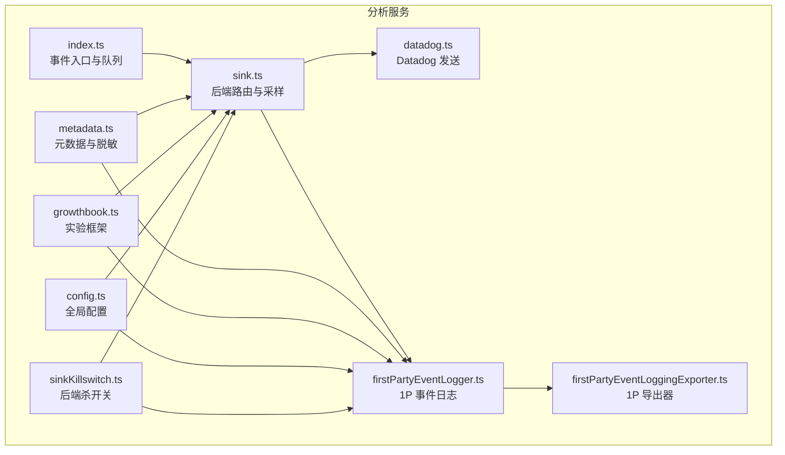
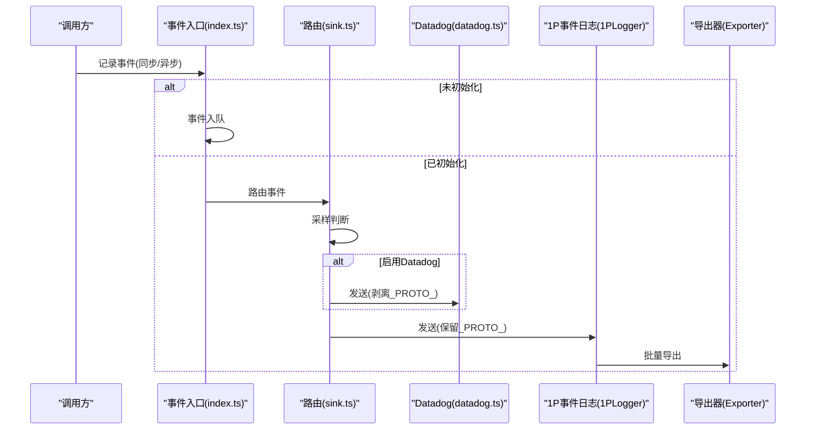
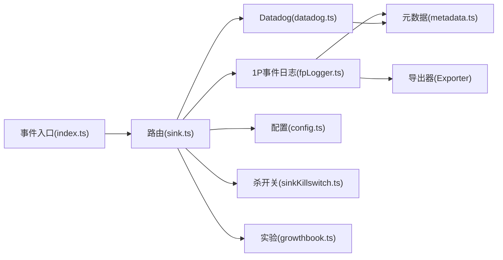

# 分析服务

<cite>
**本文档引用的文件**
- [src/services/analytics/index.ts](file://src/services/analytics/index.ts)
- [src/services/analytics/sink.ts](file://src/services/analytics/sink.ts)
- [src/services/analytics/datadog.ts](file://src/services/analytics/datadog.ts)
- [src/services/analytics/firstPartyEventLogger.ts](file://src/services/analytics/firstPartyEventLogger.ts)
- [src/services/analytics/firstPartyEventLoggingExporter.ts](file://src/services/analytics/firstPartyEventLoggingExporter.ts)
- [src/services/analytics/metadata.ts](file://src/services/analytics/metadata.ts)
- [src/services/analytics/config.ts](file://src/services/analytics/config.ts)
- [src/services/analytics/growthbook.ts](file://src/services/analytics/growthbook.ts)
- [src/services/analytics/sinkKillswitch.ts](file://src/services/analytics/sinkKillswitch.ts)
</cite>

## 目录
1. [简介](#简介)
2. [项目结构](#项目结构)
3. [核心组件](#核心组件)
4. [架构总览](#架构总览)
5. [详细组件分析](#详细组件分析)
6. [依赖关系分析](#依赖关系分析)
7. [性能考量](#性能考量)
8. [故障排查指南](#故障排查指南)
9. [结论](#结论)
10. [附录](#附录)

## 简介
本文件系统性阐述分析服务模块的设计与实现，涵盖事件采集、数据聚合、指标计算与报告生成的完整流程。分析服务通过统一入口对外暴露事件记录能力，内部路由至多个后端：Datadog 日志后端与第一方事件日志后端（BigQuery）。同时，服务集成了增长实验框架（GrowthBook），用于动态配置与实验分组，并通过采样与杀开关控确保性能与合规。

分析服务的关键特性：
- 无依赖的事件入口，避免循环依赖；事件在初始化前入队，初始化后异步冲刷。
- 双后端输出：Datadog（通用访问）与第一方事件日志（PII 敏感字段受控）。
- 动态配置驱动：事件采样率、批次导出参数、后端开关等均来自 GrowthBook 动态配置。
- 数据安全：PII 标记字段仅投递至第一方后端，通用后端在发送前剥离敏感键；工具名、文件扩展名等进行脱敏处理。
- 实验与观测：支持实验曝光日志、特征门控、远程刷新与配置覆盖。

## 项目结构
分析服务位于 src/services/analytics 目录，核心文件如下：
- 入口与队列：index.ts
- 后端路由：sink.ts
- Datadog 集成：datadog.ts
- 第一方事件日志：firstPartyEventLogger.ts、firstPartyEventLoggingExporter.ts
- 元数据与脱敏：metadata.ts
- 配置与开关：config.ts、sinkKillswitch.ts
- 增长实验框架：growthbook.ts

图表来源
- [src/services/analytics/index.ts:1-174](file://src/services/analytics/index.ts#L1-L174)
- [src/services/analytics/sink.ts:1-115](file://src/services/analytics/sink.ts#L1-L115)
- [src/services/analytics/datadog.ts:1-308](file://src/services/analytics/datadog.ts#L1-L308)
- [src/services/analytics/firstPartyEventLogger.ts:1-450](file://src/services/analytics/firstPartyEventLogger.ts#L1-L450)
- [src/services/analytics/firstPartyEventLoggingExporter.ts:1-807](file://src/services/analytics/firstPartyEventLoggingExporter.ts#L1-L807)
- [src/services/analytics/metadata.ts:1-974](file://src/services/analytics/metadata.ts#L1-L974)
- [src/services/analytics/growthbook.ts:1-1156](file://src/services/analytics/growthbook.ts#L1-L1156)
- [src/services/analytics/config.ts:1-39](file://src/services/analytics/config.ts#L1-L39)
- [src/services/analytics/sinkKillswitch.ts:1-26](file://src/services/analytics/sinkKillswitch.ts#L1-L26)

章节来源
- [src/services/analytics/index.ts:1-174](file://src/services/analytics/index.ts#L1-L174)
- [src/services/analytics/sink.ts:1-115](file://src/services/analytics/sink.ts#L1-L115)

## 核心组件
- 事件入口与队列：提供同步与异步事件记录方法，未绑定后端；初始化前的事件进入队列，初始化后批量冲刷。
- 后端路由与采样：根据动态配置决定是否采样与是否启用 Datadog；对通用后端剥离 PII 标记键；对第一方后端保留并按协议转换。
- Datadog 集成：限制事件白名单、归一化模型名与版本、构建标签与字段、批处理与定时冲刷。
- 第一方事件日志：基于 OpenTelemetry Logs 的批处理器与导出器，支持失败事件落盘重试、指数退避、认证回退。
- 元数据与脱敏：统一收集环境上下文、会话信息、进程指标；对工具名、文件扩展名、输入参数进行脱敏与截断。
- 增长实验框架：远程评估特征值、实验曝光日志、动态配置刷新与订阅通知。
- 配置与开关：全局禁用分析、反馈抑制、后端杀开关。

章节来源
- [src/services/analytics/index.ts:60-174](file://src/services/analytics/index.ts#L60-L174)
- [src/services/analytics/sink.ts:17-115](file://src/services/analytics/sink.ts#L17-L115)
- [src/services/analytics/datadog.ts:12-308](file://src/services/analytics/datadog.ts#L12-L308)
- [src/services/analytics/firstPartyEventLogger.ts:1-450](file://src/services/analytics/firstPartyEventLogger.ts#L1-L450)
- [src/services/analytics/firstPartyEventLoggingExporter.ts:1-807](file://src/services/analytics/firstPartyEventLoggingExporter.ts#L1-L807)
- [src/services/analytics/metadata.ts:1-974](file://src/services/analytics/metadata.ts#L1-L974)
- [src/services/analytics/growthbook.ts:1-1156](file://src/services/analytics/growthbook.ts#L1-L1156)
- [src/services/analytics/config.ts:1-39](file://src/services/analytics/config.ts#L1-L39)
- [src/services/analytics/sinkKillswitch.ts:1-26](file://src/services/analytics/sinkKillswitch.ts#L1-L26)

## 架构总览
分析服务采用“事件入口 + 路由 + 多后端”的架构。事件首先到达入口模块，随后由路由模块根据动态配置与开关决定采样与后端选择。Datadog 作为通用访问后端，接收经脱敏的数据；第一方事件日志作为特权后端，接收包含 PII 标记键的数据，并在导出前进行协议转换与二次脱敏。

图表来源
- [src/services/analytics/index.ts:125-164](file://src/services/analytics/index.ts#L125-L164)
- [src/services/analytics/sink.ts:45-86](file://src/services/analytics/sink.ts#L45-L86)
- [src/services/analytics/datadog.ts:159-279](file://src/services/analytics/datadog.ts#L159-L279)
- [src/services/analytics/firstPartyEventLogger.ts:216-230](file://src/services/analytics/firstPartyEventLogger.ts#L216-L230)
- [src/services/analytics/firstPartyEventLoggingExporter.ts:277-377](file://src/services/analytics/firstPartyEventLoggingExporter.ts#L277-L377)

## 详细组件分析

### 事件入口与队列（index.ts）
- 设计要点
  - 无后端依赖，避免循环导入；事件在初始化前入队，初始化后异步冲刷，不影响启动路径。
  - 提供同步与异步事件记录方法；支持采样配置注入到元数据。
  - 提供类型标记用于静态检查，防止无意中记录敏感字符串。
- 关键函数
  - attachAnalyticsSink：挂载后端；幂等，避免重复初始化。
  - logEvent / logEventAsync：记录事件；若未初始化则入队。
  - stripProtoFields：剥离以 _PROTO_ 开头的键，用于通用后端。
- 性能与可靠性
  - 使用微任务冲刷队列，避免阻塞主线程。
  - 对蚂蚁用户统计队列大小，辅助调试初始化时机。

章节来源
- [src/services/analytics/index.ts:60-174](file://src/services/analytics/index.ts#L60-L174)

### 后端路由与采样（sink.ts）
- 设计要点
  - 采样：从动态配置读取事件采样率，命中则附加采样率到元数据。
  - Datadog 开关：通过特征门控控制；默认使用缓存值，初始化后更新。
  - 安全：向通用后端发送前剥离 _PROTO_* 键；向第一方后端保留并由导出器转换。
  - 杀开关：支持 per-sink 杀开关，运行时可禁用特定后端。
- 关键函数
  - initializeAnalyticsGates：初始化 Datadog 特征门状态。
  - initializeAnalyticsSink：注册后端实现。
  - logEventImpl / logEventAsyncImpl：实际路由逻辑。

章节来源
- [src/services/analytics/sink.ts:17-115](file://src/services/analytics/sink.ts#L17-L115)
- [src/services/analytics/sinkKillswitch.ts:1-26](file://src/services/analytics/sinkKillswitch.ts#L1-L26)

### Datadog 集成（datadog.ts）
- 设计要点
  - 事件白名单：仅允许预置事件进入 Datadog。
  - 归一化：模型名、版本、工具名等进行降维与标准化，降低基数。
  - 标签与字段：构建 ddtags 便于过滤；驼峰转蛇形字段名。
  - 批处理：达到阈值或定时触发冲刷；异常捕获与错误日志。
  - 初始化：memoized 初始化，避免重复网络请求；生产环境才启用。
- 关键函数
  - initializeDatadog / shutdownDatadog：初始化与优雅关闭。
  - trackDatadogEvent：事件转换与发送。
  - getUserBucket：用户桶哈希，用于估算受影响用户数。

章节来源
- [src/services/analytics/datadog.ts:12-308](file://src/services/analytics/datadog.ts#L12-L308)

### 第一方事件日志（firstPartyEventLogger.ts）
- 设计要点
  - 采样：从动态配置读取事件采样率，支持 0-1 范围。
  - 批次：基于 OpenTelemetry BatchLogRecordProcessor，支持延迟、批量大小、队列上限等参数。
  - 认证：支持信任缺失或令牌过期时的认证回退；支持跳过认证。
  - 生命周期：提供初始化、重建、关闭与强制刷新。
- 关键函数
  - getEventSamplingConfig / shouldSampleEvent：采样决策。
  - initialize1PEventLogging / reinitialize1PEventLoggingIfConfigChanged：初始化与动态重建。
  - logEventTo1P / logGrowthBookExperimentTo1P：事件与实验曝光日志。

章节来源
- [src/services/analytics/firstPartyEventLogger.ts:1-450](file://src/services/analytics/firstPartyEventLogger.ts#L1-L450)

### 导出器与重试（firstPartyEventLoggingExporter.ts）
- 设计要点
  - 批量导出：按最大批量切片，带批次间隔；失败时写入本地 JSONL 文件。
  - 重试：指数退避（平方级）；支持后台重试与健康探测；达到最大尝试次数丢弃。
  - 协议转换：将事件转换为 1P 协议格式，Hoist 已知 _PROTO_* 字段到特权位置，其余剥离。
  - 安全：认证失败自动回退；信任缺失时跳过认证。
- 关键函数
  - export / doExport：导出主流程。
  - sendEventsInBatches / sendBatchWithRetry：批量发送与重试。
  - transformLogsToEvents：事件转换与脱敏。
  - retryPreviousBatches / retryFailedEvents：启动时重试历史失败事件。

章节来源
- [src/services/analytics/firstPartyEventLoggingExporter.ts:1-807](file://src/services/analytics/firstPartyEventLoggingExporter.ts#L1-L807)

### 元数据与脱敏（metadata.ts）
- 设计要点
  - 统一元数据：环境上下文、会话、进程指标、订阅与代理信息等。
  - 工具名脱敏：MCP 工具名标准化，内置工具名保留。
  - 输入参数脱敏：深度与长度限制、集合项裁剪、内部键过滤。
  - 文件扩展名脱敏：超长扩展名替换为 other，命令行场景提取扩展名。
  - PII 标记：_PROTO_* 键用于特权列，导出前在通用后端剥离。
- 关键函数
  - getEventMetadata：构建核心元数据。
  - sanitizeToolNameForAnalytics / mcpToolDetailsForAnalytics：工具名脱敏与细节提取。
  - extractToolInputForTelemetry / getFileExtensionForAnalytics：输入与扩展名脱敏。
  - to1PEventFormat / stripProtoFields：1P 协议格式与字段剥离。

章节来源
- [src/services/analytics/metadata.ts:1-974](file://src/services/analytics/metadata.ts#L1-L974)

### 增长实验框架（growthbook.ts）
- 设计要点
  - 远程评估：remoteEval 模式，内存缓存与磁盘持久化；定期刷新。
  - 用户属性：设备、平台、组织、账户、订阅等级、首次令牌时间等。
  - 实验曝光：按特征访问记录实验数据，去重曝光日志。
  - 动态配置：onGrowthBookRefresh 订阅者在配置变更时重建依赖。
  - 覆盖与调试：环境变量与 UI 覆盖优先于远端配置。
- 关键函数
  - initializeGrowthBook / getGrowthBookClient：客户端初始化与懒加载。
  - getFeatureValue_CACHED_MAY_BE_STALE / getFeatureValue_DEPRECATED：特征值读取。
  - onGrowthBookRefresh / reinitialize1PEventLoggingIfConfigChanged：刷新与重建。
  - logGrowthBookExperimentTo1P：实验曝光日志。

章节来源
- [src/services/analytics/growthbook.ts:1-1156](file://src/services/analytics/growthbook.ts#L1-L1156)

### 配置与开关（config.ts、sinkKillswitch.ts）
- 设计要点
  - 全局禁用：测试环境、第三方云提供商、隐私级别禁用遥测。
  - 后端杀开关：按后端粒度禁用，运行时生效，避免递归依赖。
- 关键函数
  - isAnalyticsDisabled / isFeedbackSurveyDisabled：全局禁用判定。
  - isSinkKilled：后端杀开关查询。

章节来源
- [src/services/analytics/config.ts:1-39](file://src/services/analytics/config.ts#L1-L39)
- [src/services/analytics/sinkKillswitch.ts:1-26](file://src/services/analytics/sinkKillswitch.ts#L1-L26)

## 依赖关系分析
- 低耦合高内聚：入口模块无后端依赖，路由模块仅依赖配置与实验框架，后端实现相互独立。
- 动态配置驱动：采样率、批次参数、后端开关均由 GrowthBook 动态配置提供，支持热更新。
- 安全边界清晰：PII 标记键仅流向第一方后端，通用后端在发送前剥离。
- 可观测性：Datadog 用于通用监控，第一方事件日志用于内部分析与合规审计。

图表来源
- [src/services/analytics/index.ts:1-174](file://src/services/analytics/index.ts#L1-L174)
- [src/services/analytics/sink.ts:1-115](file://src/services/analytics/sink.ts#L1-L115)
- [src/services/analytics/datadog.ts:1-308](file://src/services/analytics/datadog.ts#L1-L308)
- [src/services/analytics/firstPartyEventLogger.ts:1-450](file://src/services/analytics/firstPartyEventLogger.ts#L1-L450)
- [src/services/analytics/firstPartyEventLoggingExporter.ts:1-807](file://src/services/analytics/firstPartyEventLoggingExporter.ts#L1-L807)
- [src/services/analytics/metadata.ts:1-974](file://src/services/analytics/metadata.ts#L1-L974)
- [src/services/analytics/config.ts:1-39](file://src/services/analytics/config.ts#L1-L39)
- [src/services/analytics/sinkKillswitch.ts:1-26](file://src/services/analytics/sinkKillswitch.ts#L1-L26)
- [src/services/analytics/growthbook.ts:1-1156](file://src/services/analytics/growthbook.ts#L1-L1156)

## 性能考量
- 事件队列与微任务冲刷：避免阻塞启动路径，减少首帧延迟。
- 批处理与定时冲刷：Datadog 批量阈值与定时器结合，平衡实时性与网络开销。
- 指数退避重试：1P 导出器采用平方级退避，降低峰值压力，提升稳定性。
- 采样与降维：事件采样率与模型名、版本、工具名归一化显著降低基数与传输体积。
- 动态配置缓存：GrowthBook 远程评估值内存缓存，磁盘持久化，减少网络与解析开销。
- 进程指标：CPU 百分比增量计算，避免频繁系统调用。

## 故障排查指南
- Datadog 未收到事件
  - 检查是否为第三方云提供商（Bedrock/Vertex/Foundry）导致禁用。
  - 确认事件是否在白名单内；确认 Datadog 特征门是否开启。
  - 查看初始化日志与 flush 行为，确认网络请求与定时器。
- 1P 事件丢失或积压
  - 检查导出器错误日志与失败文件（JSONL）存放目录。
  - 观察指数退避是否持续，确认最大尝试次数与基座延迟设置。
  - 确认认证状态：令牌过期或缺少用户资料作用域时会回退为非认证发送。
- 实验配置未生效
  - 确认 GrowthBook 客户端已初始化且具备认证头。
  - 检查 onGrowthBookRefresh 订阅是否正确重建依赖。
  - 使用环境变量或 UI 覆盖验证配置优先级。
- 安全与合规
  - 确认 _PROTO_* 键仅出现在第一方后端；通用后端应被剥离。
  - 工具名与文件扩展名脱敏策略是否符合预期。

章节来源
- [src/services/analytics/datadog.ts:102-157](file://src/services/analytics/datadog.ts#L102-L157)
- [src/services/analytics/firstPartyEventLoggingExporter.ts:277-377](file://src/services/analytics/firstPartyEventLoggingExporter.ts#L277-L377)
- [src/services/analytics/firstPartyEventLogger.ts:391-450](file://src/services/analytics/firstPartyEventLogger.ts#L391-L450)
- [src/services/analytics/growthbook.ts:487-664](file://src/services/analytics/growthbook.ts#L487-L664)
- [src/services/analytics/metadata.ts:70-807](file://src/services/analytics/metadata.ts#L70-L807)

## 结论
分析服务通过统一入口与多后端路由，实现了事件采集、动态采样、安全脱敏与可观测性增强。Datadog 与第一方事件日志分别满足通用监控与内部审计需求，GrowthBook 提供了灵活的动态配置与实验能力。整体设计兼顾性能、可靠性与合规，适合在复杂产品环境中长期演进。

## 附录

### 代码示例（路径引用）
- 记录自定义事件
  - 同步记录：[src/services/analytics/index.ts:133-144](file://src/services/analytics/index.ts#L133-L144)
  - 异步记录：[src/services/analytics/index.ts:154-164](file://src/services/analytics/index.ts#L154-L164)
- 配置实验条件
  - 获取特征值（缓存优先）：[src/services/analytics/growthbook.ts:734-775](file://src/services/analytics/growthbook.ts#L734-L775)
  - 注册刷新监听：[src/services/analytics/growthbook.ts:139-157](file://src/services/analytics/growthbook.ts#L139-L157)
  - 设置/清除配置覆盖（仅蚂蚁）：[src/services/analytics/growthbook.ts:245-290](file://src/services/analytics/growthbook.ts#L245-L290)
- 获取分析结果
  - 事件采样配置：[src/services/analytics/firstPartyEventLogger.ts:43-48](file://src/services/analytics/firstPartyEventLogger.ts#L43-L48)
  - 后端初始化与挂载：[src/services/analytics/sink.ts:109-114](file://src/services/analytics/sink.ts#L109-L114)
  - 1P 事件导出器配置：[src/services/analytics/firstPartyEventLogger.ts:312-389](file://src/services/analytics/firstPartyEventLogger.ts#L312-L389)

### 数据隐私与合规
- PII 标记字段：_PROTO_* 仅投递至第一方后端；通用后端发送前剥离。
- 工具名与文件扩展名：MCP 工具名标准化，超长扩展名替换为 other。
- 输入参数脱敏：深度与长度限制、集合项裁剪、内部键过滤。
- 认证回退：令牌过期或缺少作用域时自动回退为非认证发送。

章节来源
- [src/services/analytics/metadata.ts:56-807](file://src/services/analytics/metadata.ts#L56-L807)
- [src/services/analytics/firstPartyEventLoggingExporter.ts:527-615](file://src/services/analytics/firstPartyEventLoggingExporter.ts#L527-L615)