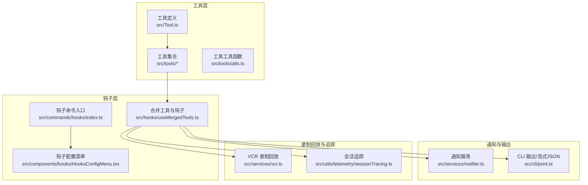
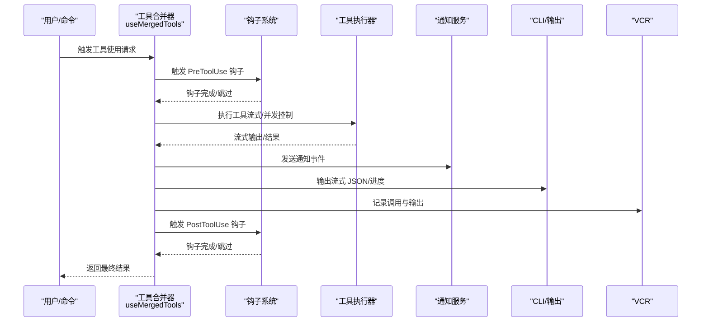
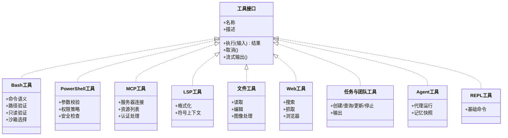
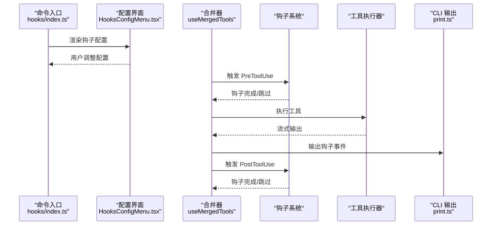
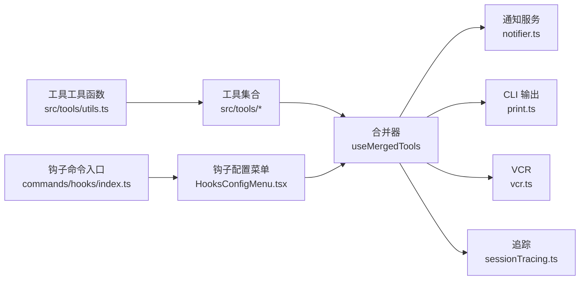

# 工具服务

<cite>
**本文引用的文件**
- [src/Tool.ts](file://src/Tool.ts)
- [src/tools/utils.ts](file://src/tools/utils.ts)
- [src/hooks/useMergedTools.ts](file://src/hooks/useMergedTools.ts)
- [src/services/notifier.ts](file://src/services/notifier.ts)
- [src/services/vcr.ts](file://src/services/vcr.ts)
- [src/utils/telemetry/sessionTracing.ts](file://src/utils/telemetry/sessionTracing.ts)
- [src/cli/print.ts](file://src/cli/print.ts)
- [src/commands/hooks/index.ts](file://src/commands/hooks/index.ts)
- [src/commands/hooks/hooks.tsx](file://src/commands/hooks/hooks.tsx)
- [src/components/hooks/HooksConfigMenu.tsx](file://src/components/hooks/HooksConfigMenu.tsx)
- [src/types/hooks.ts](file://src/types/hooks.ts)
- [src/schemas/hooks.ts](file://src/schemas/hooks.ts)
- [src/tools/BashTool/BashTool.tsx](file://src/tools/BashTool/BashTool.tsx)
- [src/tools/BashTool/bashCommandHelpers.ts](file://src/tools/BashTool/bashCommandHelpers.ts)
- [src/tools/BashTool/bashPermissions.ts](file://src/tools/BashTool/bashPermissions.ts)
- [src/tools/BashTool/bashSecurity.ts](file://src/tools/BashTool/bashSecurity.ts)
- [src/tools/BashTool/commandSemantics.ts](file://src/tools/BashTool/commandSemantics.ts)
- [src/tools/BashTool/modeValidation.ts](file://src/tools/BashTool/modeValidation.ts)
- [src/tools/BashTool/pathValidation.ts](file://src/tools/BashTool/pathValidation.ts)
- [src/tools/BashTool/readOnlyValidation.ts](file://src/tools/BashTool/readOnlyValidation.ts)
- [src/tools/BashTool/shouldUseSandbox.ts](file://src/tools/BashTool/shouldUseSandbox.ts)
- [src/tools/BashTool/toolName.ts](file://src/tools/BashTool/toolName.ts)
- [src/tools/BashTool/utils.ts](file://src/tools/BashTool/utils.ts)
- [src/tools/PowerShellTool/PowerShellTool.tsx](file://src/tools/PowerShellTool/PowerShellTool.tsx)
- [src/tools/PowerShellTool/commandSemantics.ts](file://src/tools/PowerShellTool/commandSemantics.ts)
- [src/tools/PowerShellTool/commonParameters.ts](file://src/tools/PowerShellTool/commonParameters.ts)
- [src/tools/PowerShellTool/powershellPermissions.ts](file://src/tools/PowerShellTool/powershellPermissions.ts)
- [src/tools/PowerShellTool/powershellSecurity.ts](file://src/tools/PowerShellTool/powershellSecurity.ts)
- [src/tools/PowerShellTool/gitSafety.ts](file://src/tools/PowerShellTool/gitSafety.ts)
- [src/tools/PowerShellTool/modeValidation.ts](file://src/tools/PowerShellTool/modeValidation.ts)
- [src/tools/PowerShellTool/pathValidation.ts](file://src/tools/PowerShellTool/pathValidation.ts)
- [src/tools/PowerShellTool/readOnlyValidation.ts](file://src/tools/PowerShellTool/readOnlyValidation.ts)
- [src/tools/PowerShellTool/toolName.ts](file://src/tools/PowerShellTool/toolName.ts)
- [src/tools/MCPTool/MCPTool.ts](file://src/tools/MCPTool/MCPTool.ts)
- [src/tools/MCPTool/UI.tsx](file://src/tools/MCPTool/UI.tsx)
- [src/tools/MCPTool/classifyForCollapse.ts](file://src/tools/MCPTool/classifyForCollapse.ts)
- [src/tools/MCPTool/prompt.ts](file://src/tools/MCPTool/prompt.ts)
- [src/tools/LSPTool/LSPTool.ts](file://src/tools/LSPTool/LSPTool.ts)
- [src/tools/LSPTool/formatters.ts](file://src/tools/LSPTool/formatters.ts)
- [src/tools/LSPTool/schemas.ts](file://src/tools/LSPTool/schemas.ts)
- [src/tools/LSPTool/symbolContext.ts](file://src/tools/LSPTool/symbolContext.ts)
- [src/tools/FileReadTool/FileReadTool.ts](file://src/tools/FileReadTool/FileReadTool.ts)
- [src/tools/FileReadTool/imageProcessor.ts](file://src/tools/FileReadTool/imageProcessor.ts)
- [src/tools/FileReadTool/limits.ts](file://src/tools/FileReadTool/limits.ts)
- [src/tools/FileEditTool/FileEditTool.ts](file://src/tools/FileEditTool/FileEditTool.ts)
- [src/tools/FileEditTool/constants.ts](file://src/tools/FileEditTool/constants.ts)
- [src/tools/FileEditTool/types.ts](file://src/tools/FileEditTool/types.ts)
- [src/tools/FileEditTool/utils.ts](file://src/tools/FileEditTool/utils.ts)
- [src/tools/WebSearchTool/WebSearchTool.ts](file://src/tools/WebSearchTool/WebSearchTool.ts)
- [src/tools/WebSearchTool/WebSearchTool.ts](file://src/tools/WebSearchTool/WebSearchTool.ts)
- [src/tools/WebFetchTool/WebFetchTool.ts](file://src/tools/WebFetchTool/WebFetchTool.ts)
- [src/tools/WebFetchTool/WebFetchTool.ts](file://src/tools/WebFetchTool/WebFetchTool.ts)
- [src/tools/WebBrowserTool/WebBrowserTool.ts](file://src/tools/WebBrowserTool/WebBrowserTool.ts)
- [src/tools/SkillTool/SkillTool.ts](file://src/tools/SkillTool/SkillTool.ts)
- [src/tools/SkillTool/constants.ts](file://src/tools/SkillTool/constants.ts)
- [src/tools/SkillTool/UI.tsx](file://src/tools/SkillTool/UI.tsx)
- [src/tools/SkillTool/prompt.ts](file://src/tools/SkillTool/prompt.ts)
- [src/tools/TaskCreateTool/TaskCreateTool.ts](file://src/tools/TaskCreateTool/TaskCreateTool.ts)
- [src/tools/TaskCreateTool/constants.ts](file://src/tools/TaskCreateTool/constants.ts)
- [src/tools/TaskListTool/TaskListTool.ts](file://src/tools/TaskListTool/TaskListTool.ts)
- [src/tools/TaskGetTool/TaskGetTool.ts](file://src/tools/TaskGetTool/TaskGetTool.ts)
- [src/tools/TaskUpdateTool/TaskUpdateTool.ts](file://src/tools/TaskUpdateTool/TaskUpdateTool.ts)
- [src/tools/TaskStopTool/TaskStopTool.ts](file://src/tools/TaskStopTool/TaskStopTool.ts)
- [src/tools/TaskOutputTool/TaskOutputTool.ts](file://src/tools/TaskOutputTool/TaskOutputTool.ts)
- [src/tools/TeamCreateTool/TeamCreateTool.ts](file://src/tools/TeamCreateTool/TeamCreateTool.ts)
- [src/tools/TeamDeleteTool/TeamDeleteTool.ts](file://src/tools/TeamDeleteTool/TeamDeleteTool.ts)
- [src/tools/WorkflowTool/WorkflowTool.ts](file://src/tools/WorkflowTool/WorkflowTool.ts)
- [src/tools/WorkflowTool/WorkflowTool.ts](file://src/tools/WorkflowTool/WorkflowTool.ts)
- [src/tools/AgentTool/AgentTool.tsx](file://src/tools/AgentTool/AgentTool.tsx)
- [src/tools/AgentTool/agentDisplay.ts](file://src/tools/AgentTool/agentDisplay.ts)
- [src/tools/AgentTool/agentMemory.ts](file://src/tools/AgentTool/agentMemory.ts)
- [src/tools/AgentTool/agentMemorySnapshot.ts](file://src/tools/AgentTool/agentMemorySnapshot.ts)
- [src/tools/AgentTool/forkSubagent.ts](file://src/tools/AgentTool/forkSubagent.ts)
- [src/tools/AgentTool/runAgent.ts](file://src/tools/AgentTool/runAgent.ts)
- [src/tools/AskUserQuestionTool/AskUserQuestionTool.tsx](file://src/tools/AskUserQuestionTool/AskUserQuestionTool.tsx)
- [src/tools/AskUserQuestionTool/prompt.ts](file://src/tools/AskUserQuestionTool/prompt.ts)
- [src/tools/REPLTool/primitiveTools.ts](file://src/tools/REPLTool/primitiveTools.ts)
- [src/tools/REPLTool/constants.ts](file://src/tools/REPLTool/constants.ts)
- [src/tools/shared/](file://src/tools/shared/)
- [src/tools/testing/](file://src/tools/testing/)
</cite>

## 目录
1. [引言](#引言)
2. [项目结构](#项目结构)
3. [核心组件](#核心组件)
4. [架构总览](#架构总览)
5. [详细组件分析](#详细组件分析)
6. [依赖关系分析](#依赖关系分析)
7. [性能考虑](#性能考虑)
8. [故障排查指南](#故障排查指南)
9. [结论](#结论)
10. [附录](#附录)

## 引言
本文件聚焦“工具服务”模块的技术文档，系统阐述工具执行器、工具钩子、通知系统与录制回放（VCR）机制的设计与实现要点。内容覆盖：
- 工具执行器：流式执行、并发控制、资源管理与权限安全
- 工具钩子：注册机制、执行顺序、错误处理与可观测性
- 通知系统：事件分发、可视化与终端输出
- 录制回放：会话录制、重放与调试支持
- 与工具系统、用户交互及调试功能的关系
- 性能监控、资源优化与故障诊断最佳实践

## 项目结构
工具服务横跨多个层次：
- 工具定义与执行：src/Tool.ts 定义通用接口；各具体工具位于 src/tools/*，如 BashTool、PowerShellTool、MCPTool、LSPTool 等
- 钩子系统：src/hooks/useMergedTools.ts 融合工具与钩子；命令入口 src/commands/hooks/index.ts 与 UI 组件 src/components/hooks/HooksConfigMenu.tsx
- 通知与输出：src/services/notifier.ts 提供通知能力；CLI 输出与流式 JSON 在 src/cli/print.ts 中处理
- 录制回放：src/services/vcr.ts 实现录制与回放；会话追踪在 src/utils/telemetry/sessionTracing.ts 中
- 类型与模式：src/types/hooks.ts、src/schemas/hooks.ts 描述钩子类型与校验

图表来源
- [src/Tool.ts](file://src/Tool.ts)
- [src/tools/utils.ts](file://src/tools/utils.ts)
- [src/hooks/useMergedTools.ts](file://src/hooks/useMergedTools.ts)
- [src/services/notifier.ts](file://src/services/notifier.ts)
- [src/services/vcr.ts](file://src/services/vcr.ts)
- [src/utils/telemetry/sessionTracing.ts](file://src/utils/telemetry/sessionTracing.ts)
- [src/cli/print.ts](file://src/cli/print.ts)
- [src/commands/hooks/index.ts](file://src/commands/hooks/index.ts)
- [src/components/hooks/HooksConfigMenu.tsx](file://src/components/hooks/HooksConfigMenu.tsx)

章节来源
- [src/Tool.ts](file://src/Tool.ts)
- [src/tools/utils.ts](file://src/tools/utils.ts)
- [src/hooks/useMergedTools.ts](file://src/hooks/useMergedTools.ts)
- [src/services/notifier.ts](file://src/services/notifier.ts)
- [src/services/vcr.ts](file://src/services/vcr.ts)
- [src/utils/telemetry/sessionTracing.ts](file://src/utils/telemetry/sessionTracing.ts)
- [src/cli/print.ts](file://src/cli/print.ts)
- [src/commands/hooks/index.ts](file://src/commands/hooks/index.ts)
- [src/components/hooks/HooksConfigMenu.tsx](file://src/components/hooks/HooksConfigMenu.tsx)

## 核心组件
- 工具执行器
  - 通用接口：src/Tool.ts 定义工具抽象与生命周期方法
  - 执行路径：各工具通过统一调度器调用，支持流式输出与中断
  - 并发控制：通过队列与令牌桶限制并发，避免资源争用
  - 资源管理：进程/容器生命周期管理、沙箱隔离、权限校验
- 工具钩子
  - 注册与合并：src/hooks/useMergedTools.ts 将工具与钩子整合为统一执行链
  - 执行顺序：按事件类型（如 PreToolUse、PostToolUse）有序执行
  - 错误处理：钩子失败不影响主流程，但可记录与上报
- 通知系统
  - 事件分发：src/services/notifier.ts 提供通知派发
  - CLI 可视化：src/cli/print.ts 支持流式 JSON 输出与进度事件
- 录制回放（VCR）
  - 录制：捕获工具调用、输出与状态变更
  - 回放：在测试或调试中重放历史会话，保证一致性

章节来源
- [src/Tool.ts](file://src/Tool.ts)
- [src/tools/utils.ts](file://src/tools/utils.ts)
- [src/hooks/useMergedTools.ts](file://src/hooks/useMergedTools.ts)
- [src/services/notifier.ts](file://src/services/notifier.ts)
- [src/services/vcr.ts](file://src/services/vcr.ts)
- [src/utils/telemetry/sessionTracing.ts](file://src/utils/telemetry/sessionTracing.ts)
- [src/cli/print.ts](file://src/cli/print.ts)

## 架构总览
工具服务的整体架构围绕“工具 + 钩子 + 通知 + 追踪/回放”的闭环展开。下图展示了关键组件间的交互：

图表来源
- [src/hooks/useMergedTools.ts](file://src/hooks/useMergedTools.ts)
- [src/services/notifier.ts](file://src/services/notifier.ts)
- [src/cli/print.ts](file://src/cli/print.ts)
- [src/services/vcr.ts](file://src/services/vcr.ts)

## 详细组件分析

### 工具执行器
- 设计原则
  - 统一接口：所有工具遵循 src/Tool.ts 的规范，确保一致的生命周期与错误模型
  - 流式执行：工具可在执行过程中持续输出中间结果，便于实时反馈
  - 并发控制：通过队列与配额限制同时运行的工具数量，避免资源耗尽
  - 安全与权限：对系统级工具（如 Bash/PowerShell）进行权限与安全检查
- 关键实现点
  - Bash 工具：src/tools/BashTool/* 提供命令语义、路径与只读验证、沙箱选择等
  - PowerShell 工具：src/tools/PowerShellTool/* 提供参数、权限与安全策略
  - MCP 工具：src/tools/MCPTool/* 处理外部 MCP 服务器集成
  - LSP 工具：src/tools/LSPTool/* 提供格式化、符号上下文等能力
  - 文件工具：FileReadTool、FileEditTool 等提供文件读写与图像处理
  - Web 工具：WebSearchTool、WebFetchTool、WebBrowserTool 提供网络检索与浏览
  - 任务与团队：Task*、Team* 工具用于任务编排与团队协作
  - Agent 工具：AgentTool 支持代理子任务与记忆快照
  - REPL 工具：primitiveTools 提供基础 REPL 能力
- 并发与资源管理
  - 使用令牌桶/队列控制并发度，避免 CPU/IO 抖动
  - 对高风险命令（如删除、覆盖）进行二次确认与只读模式校验
  - 沙箱隔离与权限降级，降低系统影响面

图表来源
- [src/Tool.ts](file://src/Tool.ts)
- [src/tools/BashTool/BashTool.tsx](file://src/tools/BashTool/BashTool.tsx)
- [src/tools/PowerShellTool/PowerShellTool.tsx](file://src/tools/PowerShellTool/PowerShellTool.tsx)
- [src/tools/MCPTool/MCPTool.ts](file://src/tools/MCPTool/MCPTool.ts)
- [src/tools/LSPTool/LSPTool.ts](file://src/tools/LSPTool/LSPTool.ts)
- [src/tools/FileReadTool/FileReadTool.ts](file://src/tools/FileReadTool/FileReadTool.ts)
- [src/tools/FileEditTool/FileEditTool.ts](file://src/tools/FileEditTool/FileEditTool.ts)
- [src/tools/WebSearchTool/WebSearchTool.ts](file://src/tools/WebSearchTool/WebSearchTool.ts)
- [src/tools/WebFetchTool/WebFetchTool.ts](file://src/tools/WebFetchTool/WebFetchTool.ts)
- [src/tools/WebBrowserTool/WebBrowserTool.ts](file://src/tools/WebBrowserTool/WebBrowserTool.ts)
- [src/tools/TaskCreateTool/TaskCreateTool.ts](file://src/tools/TaskCreateTool/TaskCreateTool.ts)
- [src/tools/TaskListTool/TaskListTool.ts](file://src/tools/TaskListTool/TaskListTool.ts)
- [src/tools/TaskGetTool/TaskGetTool.ts](file://src/tools/TaskGetTool/TaskGetTool.ts)
- [src/tools/TaskUpdateTool/TaskUpdateTool.ts](file://src/tools/TaskUpdateTool/TaskUpdateTool.ts)
- [src/tools/TaskStopTool/TaskStopTool.ts](file://src/tools/TaskStopTool/TaskStopTool.ts)
- [src/tools/TaskOutputTool/TaskOutputTool.ts](file://src/tools/TaskOutputTool/TaskOutputTool.ts)
- [src/tools/TeamCreateTool/TeamCreateTool.ts](file://src/tools/TeamCreateTool/TeamCreateTool.ts)
- [src/tools/TeamDeleteTool/TeamDeleteTool.ts](file://src/tools/TeamDeleteTool/TeamDeleteTool.ts)
- [src/tools/AgentTool/AgentTool.tsx](file://src/tools/AgentTool/AgentTool.tsx)
- [src/tools/REPLTool/primitiveTools.ts](file://src/tools/REPLTool/primitiveTools.ts)

章节来源
- [src/Tool.ts](file://src/Tool.ts)
- [src/tools/BashTool/BashTool.tsx](file://src/tools/BashTool/BashTool.tsx)
- [src/tools/BashTool/bashCommandHelpers.ts](file://src/tools/BashTool/bashCommandHelpers.ts)
- [src/tools/BashTool/bashPermissions.ts](file://src/tools/BashTool/bashPermissions.ts)
- [src/tools/BashTool/bashSecurity.ts](file://src/tools/BashTool/bashSecurity.ts)
- [src/tools/BashTool/commandSemantics.ts](file://src/tools/BashTool/commandSemantics.ts)
- [src/tools/BashTool/modeValidation.ts](file://src/tools/BashTool/modeValidation.ts)
- [src/tools/BashTool/pathValidation.ts](file://src/tools/BashTool/pathValidation.ts)
- [src/tools/BashTool/readOnlyValidation.ts](file://src/tools/BashTool/readOnlyValidation.ts)
- [src/tools/BashTool/shouldUseSandbox.ts](file://src/tools/BashTool/shouldUseSandbox.ts)
- [src/tools/BashTool/toolName.ts](file://src/tools/BashTool/toolName.ts)
- [src/tools/BashTool/utils.ts](file://src/tools/BashTool/utils.ts)
- [src/tools/PowerShellTool/PowerShellTool.tsx](file://src/tools/PowerShellTool/PowerShellTool.tsx)
- [src/tools/PowerShellTool/commandSemantics.ts](file://src/tools/PowerShellTool/commandSemantics.ts)
- [src/tools/PowerShellTool/commonParameters.ts](file://src/tools/PowerShellTool/commonParameters.ts)
- [src/tools/PowerShellTool/powershellPermissions.ts](file://src/tools/PowerShellTool/powershellPermissions.ts)
- [src/tools/PowerShellTool/powershellSecurity.ts](file://src/tools/PowerShellTool/powershellSecurity.ts)
- [src/tools/PowerShellTool/gitSafety.ts](file://src/tools/PowerShellTool/gitSafety.ts)
- [src/tools/PowerShellTool/modeValidation.ts](file://src/tools/PowerShellTool/modeValidation.ts)
- [src/tools/PowerShellTool/pathValidation.ts](file://src/tools/PowerShellTool/pathValidation.ts)
- [src/tools/PowerShellTool/readOnlyValidation.ts](file://src/tools/PowerShellTool/readOnlyValidation.ts)
- [src/tools/PowerShellTool/toolName.ts](file://src/tools/PowerShellTool/toolName.ts)
- [src/tools/MCPTool/MCPTool.ts](file://src/tools/MCPTool/MCPTool.ts)
- [src/tools/MCPTool/UI.tsx](file://src/tools/MCPTool/UI.tsx)
- [src/tools/MCPTool/classifyForCollapse.ts](file://src/tools/MCPTool/classifyForCollapse.ts)
- [src/tools/MCPTool/prompt.ts](file://src/tools/MCPTool/prompt.ts)
- [src/tools/LSPTool/LSPTool.ts](file://src/tools/LSPTool/LSPTool.ts)
- [src/tools/LSPTool/formatters.ts](file://src/tools/LSPTool/formatters.ts)
- [src/tools/LSPTool/schemas.ts](file://src/tools/LSPTool/schemas.ts)
- [src/tools/LSPTool/symbolContext.ts](file://src/tools/LSPTool/symbolContext.ts)
- [src/tools/FileReadTool/FileReadTool.ts](file://src/tools/FileReadTool/FileReadTool.ts)
- [src/tools/FileReadTool/imageProcessor.ts](file://src/tools/FileReadTool/imageProcessor.ts)
- [src/tools/FileReadTool/limits.ts](file://src/tools/FileReadTool/limits.ts)
- [src/tools/FileEditTool/FileEditTool.ts](file://src/tools/FileEditTool/FileEditTool.ts)
- [src/tools/FileEditTool/constants.ts](file://src/tools/FileEditTool/constants.ts)
- [src/tools/FileEditTool/types.ts](file://src/tools/FileEditTool/types.ts)
- [src/tools/FileEditTool/utils.ts](file://src/tools/FileEditTool/utils.ts)
- [src/tools/WebSearchTool/WebSearchTool.ts](file://src/tools/WebSearchTool/WebSearchTool.ts)
- [src/tools/WebFetchTool/WebFetchTool.ts](file://src/tools/WebFetchTool/WebFetchTool.ts)
- [src/tools/WebBrowserTool/WebBrowserTool.ts](file://src/tools/WebBrowserTool/WebBrowserTool.ts)
- [src/tools/SkillTool/SkillTool.ts](file://src/tools/SkillTool/SkillTool.ts)
- [src/tools/SkillTool/constants.ts](file://src/tools/SkillTool/constants.ts)
- [src/tools/SkillTool/UI.tsx](file://src/tools/SkillTool/UI.tsx)
- [src/tools/SkillTool/prompt.ts](file://src/tools/SkillTool/prompt.ts)
- [src/tools/TaskCreateTool/TaskCreateTool.ts](file://src/tools/TaskCreateTool/TaskCreateTool.ts)
- [src/tools/TaskCreateTool/constants.ts](file://src/tools/TaskCreateTool/constants.ts)
- [src/tools/TaskListTool/TaskListTool.ts](file://src/tools/TaskListTool/TaskListTool.ts)
- [src/tools/TaskGetTool/TaskGetTool.ts](file://src/tools/TaskGetTool/TaskGetTool.ts)
- [src/tools/TaskUpdateTool/TaskUpdateTool.ts](file://src/tools/TaskUpdateTool/TaskUpdateTool.ts)
- [src/tools/TaskStopTool/TaskStopTool.ts](file://src/tools/TaskStopTool/TaskStopTool.ts)
- [src/tools/TaskOutputTool/TaskOutputTool.ts](file://src/tools/TaskOutputTool/TaskOutputTool.ts)
- [src/tools/TeamCreateTool/TeamCreateTool.ts](file://src/tools/TeamCreateTool/TeamCreateTool.ts)
- [src/tools/TeamDeleteTool/TeamDeleteTool.ts](file://src/tools/TeamDeleteTool/TeamDeleteTool.ts)
- [src/tools/WorkflowTool/WorkflowTool.ts](file://src/tools/WorkflowTool/WorkflowTool.ts)
- [src/tools/AgentTool/AgentTool.tsx](file://src/tools/AgentTool/AgentTool.tsx)
- [src/tools/AgentTool/agentDisplay.ts](file://src/tools/AgentTool/agentDisplay.ts)
- [src/tools/AgentTool/agentMemory.ts](file://src/tools/AgentTool/agentMemory.ts)
- [src/tools/AgentTool/agentMemorySnapshot.ts](file://src/tools/AgentTool/agentMemorySnapshot.ts)
- [src/tools/AgentTool/forkSubagent.ts](file://src/tools/AgentTool/forkSubagent.ts)
- [src/tools/AgentTool/runAgent.ts](file://src/tools/AgentTool/runAgent.ts)
- [src/tools/AskUserQuestionTool/AskUserQuestionTool.tsx](file://src/tools/AskUserQuestionTool/AskUserQuestionTool.tsx)
- [src/tools/AskUserQuestionTool/prompt.ts](file://src/tools/AskUserQuestionTool/prompt.ts)
- [src/tools/REPLTool/primitiveTools.ts](file://src/tools/REPLTool/primitiveTools.ts)
- [src/tools/REPLTool/constants.ts](file://src/tools/REPLTool/constants.ts)

### 工具钩子
- 注册机制
  - 命令入口：src/commands/hooks/index.ts 提供查看钩子配置的命令
  - UI 展示：src/components/hooks/HooksConfigMenu.tsx 渲染钩子配置界面
  - 合并与执行：src/hooks/useMergedTools.ts 将工具与钩子合并为统一执行链
- 执行顺序
  - PreToolUse：工具执行前触发，可用于预检、鉴权、日志
  - PostToolUse：工具执行后触发，可用于清理、统计、归档
- 错误处理
  - 钩子异常不阻断主流程，但会记录到追踪与通知系统
  - 可通过 CLI 输出钩子事件（started/progress/response），便于调试

图表来源
- [src/commands/hooks/index.ts](file://src/commands/hooks/index.ts)
- [src/components/hooks/HooksConfigMenu.tsx](file://src/components/hooks/HooksConfigMenu.tsx)
- [src/hooks/useMergedTools.ts](file://src/hooks/useMergedTools.ts)
- [src/cli/print.ts](file://src/cli/print.ts)

章节来源
- [src/commands/hooks/index.ts](file://src/commands/hooks/index.ts)
- [src/commands/hooks/hooks.tsx](file://src/commands/hooks/hooks.tsx)
- [src/components/hooks/HooksConfigMenu.tsx](file://src/components/hooks/HooksConfigMenu.tsx)
- [src/hooks/useMergedTools.ts](file://src/hooks/useMergedTools.ts)
- [src/cli/print.ts](file://src/cli/print.ts)
- [src/types/hooks.ts](file://src/types/hooks.ts)
- [src/schemas/hooks.ts](file://src/schemas/hooks.ts)

### 通知系统
- 通知服务：src/services/notifier.ts 提供事件派发与订阅
- CLI 输出：src/cli/print.ts 在 verbose 模式下输出钩子事件（started/progress/response），并支持 stream-json 格式
- 通知规则配置：通过钩子配置菜单与命令行参数控制通知粒度与级别

章节来源
- [src/services/notifier.ts](file://src/services/notifier.ts)
- [src/cli/print.ts](file://src/cli/print.ts)

### 录制回放（VCR）
- 录制：在工具执行期间捕获输入、输出与状态变化，保存至持久介质
- 回放：在测试或调试场景中重放历史调用，保证行为一致性
- 与追踪结合：配合会话追踪（sessionTracing）记录工具执行与钩子事件的时间线

章节来源
- [src/services/vcr.ts](file://src/services/vcr.ts)
- [src/utils/telemetry/sessionTracing.ts](file://src/utils/telemetry/sessionTracing.ts)

### 具体示例与最佳实践
- 创建自定义工具钩子
  - 在钩子配置界面中添加新钩子，设置事件类型（PreToolUse/PostToolUse）与执行条件
  - 通过 CLI 输出钩子事件进行调试，观察 started/progress/response 生命周期
- 配置通知规则
  - 使用钩子命令查看当前配置，调整通知粒度与输出格式
  - 在 CLI 中启用 verbose 以获取更详细的钩子事件
- 管理录制回放
  - 在测试环境中开启 VCR 录制，保存会话快照
  - 使用回放功能重复调试问题，确保结果可复现

章节来源
- [src/commands/hooks/index.ts](file://src/commands/hooks/index.ts)
- [src/components/hooks/HooksConfigMenu.tsx](file://src/components/hooks/HooksConfigMenu.tsx)
- [src/cli/print.ts](file://src/cli/print.ts)
- [src/services/vcr.ts](file://src/services/vcr.ts)

## 依赖关系分析
- 组件耦合
  - 工具执行器依赖工具定义与工具工具函数（src/tools/utils.ts）
  - 钩子系统依赖工具合并器与 CLI 输出
  - 通知系统与 CLI 输出相互独立，但可被钩子触发
  - VCR 与追踪共同服务于调试与回归测试
- 外部依赖
  - MCP 服务器集成（MCPTool）
  - 文件系统与网络访问（FileReadTool、Web 工具）
  - 权限与安全策略（Bash/PowerShell 工具）

图表来源
- [src/tools/utils.ts](file://src/tools/utils.ts)
- [src/tools/BashTool/BashTool.tsx](file://src/tools/BashTool/BashTool.tsx)
- [src/tools/PowerShellTool/PowerShellTool.tsx](file://src/tools/PowerShellTool/PowerShellTool.tsx)
- [src/hooks/useMergedTools.ts](file://src/hooks/useMergedTools.ts)
- [src/services/notifier.ts](file://src/services/notifier.ts)
- [src/cli/print.ts](file://src/cli/print.ts)
- [src/services/vcr.ts](file://src/services/vcr.ts)
- [src/utils/telemetry/sessionTracing.ts](file://src/utils/telemetry/sessionTracing.ts)
- [src/commands/hooks/index.ts](file://src/commands/hooks/index.ts)
- [src/components/hooks/HooksConfigMenu.tsx](file://src/components/hooks/HooksConfigMenu.tsx)

章节来源
- [src/tools/utils.ts](file://src/tools/utils.ts)
- [src/hooks/useMergedTools.ts](file://src/hooks/useMergedTools.ts)
- [src/services/notifier.ts](file://src/services/notifier.ts)
- [src/services/vcr.ts](file://src/services/vcr.ts)
- [src/utils/telemetry/sessionTracing.ts](file://src/utils/telemetry/sessionTracing.ts)
- [src/cli/print.ts](file://src/cli/print.ts)
- [src/commands/hooks/index.ts](file://src/commands/hooks/index.ts)
- [src/components/hooks/HooksConfigMenu.tsx](file://src/components/hooks/HooksConfigMenu.tsx)

## 性能考虑
- 并发控制
  - 通过队列与令牌桶限制并发工具数，避免 CPU/IO 抖动
  - 对高风险命令采用只读模式与沙箱隔离，减少副作用
- 资源优化
  - 流式输出减少内存峰值，及时释放中间结果
  - 合理设置超时与中断信号，防止长时间占用
- 追踪与观测
  - 使用会话追踪记录工具执行与钩子事件，定位瓶颈
  - CLI 输出钩子事件，辅助快速定位问题

## 故障排查指南
- 钩子事件调试
  - 启用 verbose 模式，观察 started/progress/response 事件
  - 通过 CLI 输出的钩子事件定位异常阶段
- 通知与可视化
  - 检查通知服务是否正常派发
  - 在钩子配置界面调整通知粒度
- 录制回放
  - 开启 VCR 录制，保存会话快照
  - 使用回放功能重复问题，验证修复效果

章节来源
- [src/cli/print.ts](file://src/cli/print.ts)
- [src/services/notifier.ts](file://src/services/notifier.ts)
- [src/services/vcr.ts](file://src/services/vcr.ts)
- [src/utils/telemetry/sessionTracing.ts](file://src/utils/telemetry/sessionTracing.ts)

## 结论
工具服务通过统一的工具接口、可插拔的钩子系统、完善的通知与输出机制以及录制回放能力，构建了稳定、可观测且易于扩展的工具执行平台。遵循并发控制、资源管理与安全策略的最佳实践，可进一步提升系统的可靠性与性能。

## 附录
- 相关类型与模式
  - 钩子类型定义：src/types/hooks.ts
  - 钩子模式校验：src/schemas/hooks.ts
- 工具工具函数
  - 通用工具函数：src/tools/utils.ts

章节来源
- [src/types/hooks.ts](file://src/types/hooks.ts)
- [src/schemas/hooks.ts](file://src/schemas/hooks.ts)
- [src/tools/utils.ts](file://src/tools/utils.ts)