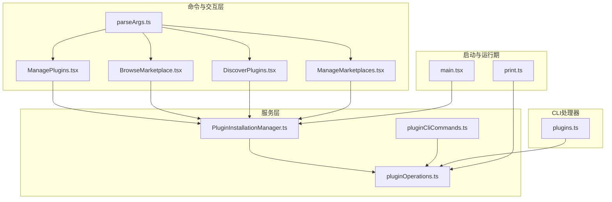
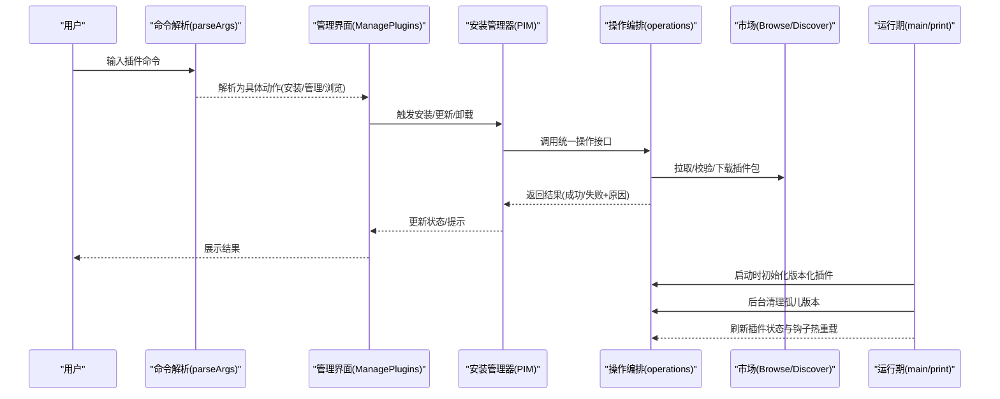
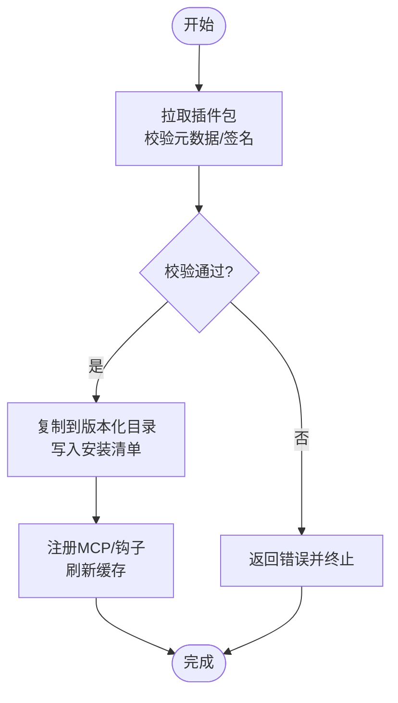
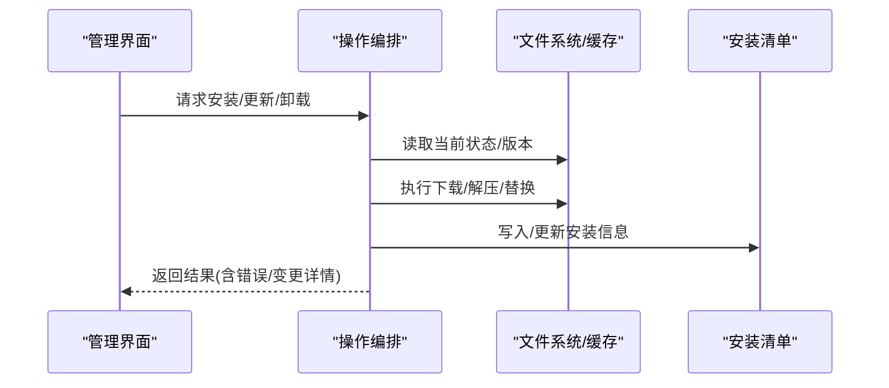
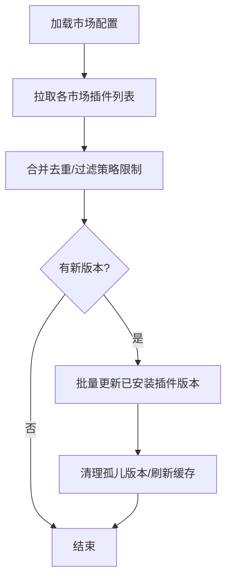
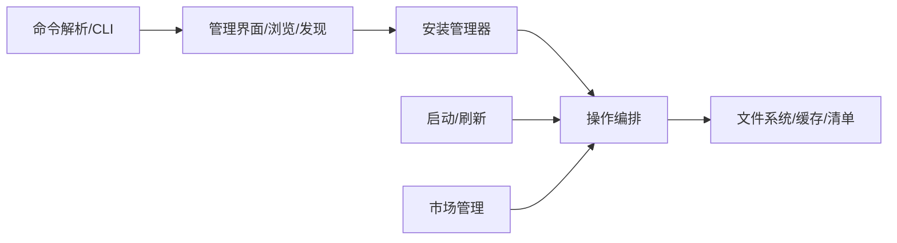

# 插件服务

<cite>
**本文引用的文件**
- [src/main.tsx](file://src/main.tsx)
- [src/cli/handlers/plugins.ts](file://src/cli/handlers/plugins.ts)
- [src/commands/plugin/ManagePlugins.tsx](file://src/commands/plugin/ManagePlugins.tsx)
- [src/commands/plugin/BrowseMarketplace.tsx](file://src/commands/plugin/BrowseMarketplace.tsx)
- [src/commands/plugin/DiscoverPlugins.tsx](file://src/commands/plugin/DiscoverPlugins.tsx)
- [src/commands/plugin/ManageMarketplaces.tsx](file://src/commands/plugin/ManageMarketplaces.tsx)
- [src/commands/plugin/parseArgs.ts](file://src/commands/plugin/parseArgs.ts)
- [src/services/plugins/PluginInstallationManager.ts](file://src/services/plugins/PluginInstallationManager.ts)
- [src/services/plugins/pluginOperations.ts](file://src/services/plugins/pluginOperations.ts)
- [src/services/plugins/pluginCliCommands.ts](file://src/services/plugins/pluginCliCommands.ts)
- [src/cli/print.ts](file://src/cli/print.ts)
</cite>

## 目录
1. [引言](#引言)
2. [项目结构](#项目结构)
3. [核心组件](#核心组件)
4. [架构总览](#架构总览)
5. [组件详解](#组件详解)
6. [依赖关系分析](#依赖关系分析)
7. [性能考量](#性能考量)
8. [故障排查指南](#故障排查指南)
9. [结论](#结论)
10. [附录](#附录)

## 引言
本文件系统化梳理插件服务模块的技术架构与实现细节，覆盖插件安装管理、操作协调与命令处理机制；深入解析插件安装管理器的下载、验证、部署与卸载流程；阐述插件操作的执行策略、状态跟踪与错误处理；给出生命周期管理、安装冲突处理与命令执行的实践路径；并说明插件服务与插件系统、市场集成及版本管理的关系，以及安全检查、依赖解析与兼容性验证的最佳实践。

## 项目结构
插件服务相关代码主要分布在以下区域：
- 命令入口与交互层：commands/plugin 下的 UI 组件与参数解析
- 服务层：services/plugins 下的安装管理与操作编排
- CLI 处理器：cli/handlers 下的插件命令行接口
- 启动与运行期初始化：main.tsx 中的版本化插件初始化与后台清理
- 运行期刷新与热重载：cli/print.ts 中的插件状态刷新与钩子热重载

图表来源
- [src/commands/plugin/ManagePlugins.tsx](file://src/commands/plugin/ManagePlugins.tsx)
- [src/commands/plugin/BrowseMarketplace.tsx](file://src/commands/plugin/BrowseMarketplace.tsx)
- [src/commands/plugin/DiscoverPlugins.tsx](file://src/commands/plugin/DiscoverPlugins.tsx)
- [src/commands/plugin/ManageMarketplaces.tsx](file://src/commands/plugin/ManageMarketplaces.tsx)
- [src/commands/plugin/parseArgs.ts](file://src/commands/plugin/parseArgs.ts)
- [src/services/plugins/PluginInstallationManager.ts](file://src/services/plugins/PluginInstallationManager.ts)
- [src/services/plugins/pluginOperations.ts](file://src/services/plugins/pluginOperations.ts)
- [src/services/plugins/pluginCliCommands.ts](file://src/services/plugins/pluginCliCommands.ts)
- [src/cli/handlers/plugins.ts](file://src/cli/handlers/plugins.ts)
- [src/main.tsx](file://src/main.tsx)
- [src/cli/print.ts](file://src/cli/print.ts)

章节来源
- [src/commands/plugin/ManagePlugins.tsx](file://src/commands/plugin/ManagePlugins.tsx)
- [src/commands/plugin/BrowseMarketplace.tsx](file://src/commands/plugin/BrowseMarketplace.tsx)
- [src/commands/plugin/DiscoverPlugins.tsx](file://src/commands/plugin/DiscoverPlugins.tsx)
- [src/commands/plugin/ManageMarketplaces.tsx](file://src/commands/plugin/ManageMarketplaces.tsx)
- [src/commands/plugin/parseArgs.ts](file://src/commands/plugin/parseArgs.ts)
- [src/services/plugins/PluginInstallationManager.ts](file://src/services/plugins/PluginInstallationManager.ts)
- [src/services/plugins/pluginOperations.ts](file://src/services/plugins/pluginOperations.ts)
- [src/services/plugins/pluginCliCommands.ts](file://src/services/plugins/pluginCliCommands.ts)
- [src/cli/handlers/plugins.ts](file://src/cli/handlers/plugins.ts)
- [src/main.tsx](file://src/main.tsx)
- [src/cli/print.ts](file://src/cli/print.ts)

## 核心组件
- 插件安装管理器（PluginInstallationManager）：封装下载、校验、部署、回滚与卸载等核心流程，协调磁盘与缓存、版本目录与已安装清单。
- 插件操作编排（pluginOperations）：定义安装、更新、卸载、启用/禁用、查询等操作的统一接口与错误语义，提供跨作用域与多版本一致性保障。
- 市场与商店管理（ManageMarketplaces/Marketplace 流程）：支持添加/移除/刷新市场源，批量更新已安装插件至新版本，并进行缓存与状态同步。
- 命令行与交互（CLI/TTY）：通过命令解析与 UI 组件驱动安装、管理、浏览与发现插件，处理用户输入与进度反馈。
- 启动与运行期（main.tsx/print.ts）：在应用启动时初始化版本化插件系统，清理孤儿版本目录，并在运行期刷新插件状态与钩子热重载。

章节来源
- [src/services/plugins/PluginInstallationManager.ts](file://src/services/plugins/PluginInstallationManager.ts)
- [src/services/plugins/pluginOperations.ts](file://src/services/plugins/pluginOperations.ts)
- [src/commands/plugin/ManageMarketplaces.tsx](file://src/commands/plugin/ManageMarketplaces.tsx)
- [src/commands/plugin/ManagePlugins.tsx](file://src/commands/plugin/ManagePlugins.tsx)
- [src/commands/plugin/BrowseMarketplace.tsx](file://src/commands/plugin/BrowseMarketplace.tsx)
- [src/commands/plugin/DiscoverPlugins.tsx](file://src/commands/plugin/DiscoverPlugins.tsx)
- [src/commands/plugin/parseArgs.ts](file://src/commands/plugin/parseArgs.ts)
- [src/cli/handlers/plugins.ts](file://src/cli/handlers/plugins.ts)
- [src/main.tsx](file://src/main.tsx)
- [src/cli/print.ts](file://src/cli/print.ts)

## 架构总览
插件服务采用“命令/交互层—服务层—运行期初始化”的分层设计：
- 命令/交互层负责用户输入与可视化反馈，调用服务层执行具体操作。
- 服务层提供幂等、可回滚的操作接口，确保安装/更新/卸载过程的一致性与安全性。
- 运行期初始化负责版本化插件的迁移、孤儿版本清理与缓存预热，保证后续加载性能与稳定性。

图表来源
- [src/commands/plugin/parseArgs.ts](file://src/commands/plugin/parseArgs.ts)
- [src/commands/plugin/ManagePlugins.tsx](file://src/commands/plugin/ManagePlugins.tsx)
- [src/services/plugins/PluginInstallationManager.ts](file://src/services/plugins/PluginInstallationManager.ts)
- [src/services/plugins/pluginOperations.ts](file://src/services/plugins/pluginOperations.ts)
- [src/commands/plugin/BrowseMarketplace.tsx](file://src/commands/plugin/BrowseMarketplace.tsx)
- [src/commands/plugin/DiscoverPlugins.tsx](file://src/commands/plugin/DiscoverPlugins.tsx)
- [src/main.tsx](file://src/main.tsx)
- [src/cli/print.ts](file://src/cli/print.ts)

## 组件详解

### 插件安装管理器（PluginInstallationManager）
职责与能力
- 下载与校验：从市场源获取插件包，执行完整性与签名校验，拒绝不合规包。
- 部署与版本化：将插件复制到版本化目录，写入/更新已安装清单，维护作用域与路径映射。
- 卸载与清理：删除安装目录、清理持久化数据、更新清单并触发缓存失效。
- 回滚与一致性：在失败场景下回滚到上一稳定版本或保留现场，确保系统可用性。

关键流程示意

图表来源
- [src/services/plugins/PluginInstallationManager.ts](file://src/services/plugins/PluginInstallationManager.ts)
- [src/services/plugins/pluginOperations.ts](file://src/services/plugins/pluginOperations.ts)

章节来源
- [src/services/plugins/PluginInstallationManager.ts](file://src/services/plugins/PluginInstallationManager.ts)
- [src/services/plugins/pluginOperations.ts](file://src/services/plugins/pluginOperations.ts)

### 插件操作编排（pluginOperations）
职责与能力
- 定义统一操作契约：安装、更新、卸载、启用/禁用、查询、校验清单等。
- 状态跟踪：记录每个插件的版本、作用域、安装路径、最后更新时间、启用状态与错误信息。
- 冲突与依赖：检测反向依赖、作用域冲突、组织策略限制，必要时阻断或提示用户确认。
- 错误处理：区分致命错误与可恢复错误，提供可读的错误消息与回退策略。

典型操作序列

图表来源
- [src/services/plugins/pluginOperations.ts](file://src/services/plugins/pluginOperations.ts)

章节来源
- [src/services/plugins/pluginOperations.ts](file://src/services/plugins/pluginOperations.ts)

### 市场与商店管理（ManageMarketplaces/Marketplace 流程）
职责与能力
- 市场源管理：添加/移除/刷新市场源，记录上次更新时间与自动更新策略。
- 批量更新：对已安装插件按市场最新版本进行升级，避免孤儿版本与缓存不一致。
- 可靠性：在部分市场不可达时进行降级处理，保证整体流程继续推进。

关键流程示意

图表来源
- [src/commands/plugin/ManageMarketplaces.tsx](file://src/commands/plugin/ManageMarketplaces.tsx)
- [src/commands/plugin/BrowseMarketplace.tsx](file://src/commands/plugin/BrowseMarketplace.tsx)
- [src/commands/plugin/DiscoverPlugins.tsx](file://src/commands/plugin/DiscoverPlugins.tsx)

章节来源
- [src/commands/plugin/ManageMarketplaces.tsx](file://src/commands/plugin/ManageMarketplaces.tsx)
- [src/commands/plugin/BrowseMarketplace.tsx](file://src/commands/plugin/BrowseMarketplace.tsx)
- [src/commands/plugin/DiscoverPlugins.tsx](file://src/commands/plugin/DiscoverPlugins.tsx)

### 命令行与交互（CLI/TTY）
职责与能力
- 命令解析：将用户输入解析为具体动作（安装、管理、浏览、市场管理、验证等）。
- UI 驱动：在 TUI 中展示插件列表、详情、安装进度与错误信息，支持批量选择与确认。
- CLI 输出：提供 JSON/人类可读输出，支持插件清单查询、验证结果打印与错误汇总。

章节来源
- [src/commands/plugin/parseArgs.ts](file://src/commands/plugin/parseArgs.ts)
- [src/commands/plugin/ManagePlugins.tsx](file://src/commands/plugin/ManagePlugins.tsx)
- [src/cli/handlers/plugins.ts](file://src/cli/handlers/plugins.ts)

### 启动与运行期（main.tsx/print.ts）
职责与能力
- 版本化插件初始化：在启动时执行 V1→V2 迁移、清理孤儿版本、预热缓存。
- 运行期刷新：在插件安装后刷新命令与 MCP 差异，加载钩子热重载，确保新插件即时生效。
- 性能优化：后台异步清理与缓存预热，避免阻塞主会话启动。

章节来源
- [src/main.tsx](file://src/main.tsx)
- [src/cli/print.ts](file://src/cli/print.ts)

## 依赖关系分析
- 命令层依赖服务层：UI 与 CLI 通过统一的服务接口触发安装/更新/卸载等操作。
- 服务层依赖文件系统与清单：所有操作均围绕版本化目录与安装清单展开，确保一致性。
- 运行期依赖服务层：启动与刷新阶段调用操作编排以完成版本同步与缓存预热。
- 市场层与服务层耦合：市场源的刷新与批量更新最终通过操作编排落地到磁盘与清单。

图表来源
- [src/commands/plugin/parseArgs.ts](file://src/commands/plugin/parseArgs.ts)
- [src/commands/plugin/ManagePlugins.tsx](file://src/commands/plugin/ManagePlugins.tsx)
- [src/commands/plugin/BrowseMarketplace.tsx](file://src/commands/plugin/BrowseMarketplace.tsx)
- [src/commands/plugin/DiscoverPlugins.tsx](file://src/commands/plugin/DiscoverPlugins.tsx)
- [src/commands/plugin/ManageMarketplaces.tsx](file://src/commands/plugin/ManageMarketplaces.tsx)
- [src/services/plugins/PluginInstallationManager.ts](file://src/services/plugins/PluginInstallationManager.ts)
- [src/services/plugins/pluginOperations.ts](file://src/services/plugins/pluginOperations.ts)
- [src/main.tsx](file://src/main.tsx)
- [src/cli/print.ts](file://src/cli/print.ts)

章节来源
- [src/commands/plugin/parseArgs.ts](file://src/commands/plugin/parseArgs.ts)
- [src/commands/plugin/ManagePlugins.tsx](file://src/commands/plugin/ManagePlugins.tsx)
- [src/commands/plugin/BrowseMarketplace.tsx](file://src/commands/plugin/BrowseMarketplace.tsx)
- [src/commands/plugin/DiscoverPlugins.tsx](file://src/commands/plugin/DiscoverPlugins.tsx)
- [src/commands/plugin/ManageMarketplaces.tsx](file://src/commands/plugin/ManageMarketplaces.tsx)
- [src/services/plugins/PluginInstallationManager.ts](file://src/services/plugins/PluginInstallationManager.ts)
- [src/services/plugins/pluginOperations.ts](file://src/services/plugins/pluginOperations.ts)
- [src/main.tsx](file://src/main.tsx)
- [src/cli/print.ts](file://src/cli/print.ts)

## 性能考量
- 启动阶段的版本化插件初始化与孤儿版本清理应尽量异步执行，避免阻塞主会话启动。
- 批量安装/更新时采用并发控制与进度反馈，减少用户等待时间。
- 缓存预热与磁盘扫描应在空闲时段进行，避免影响交互体验。
- 市场源刷新与插件版本对比应支持增量更新，降低网络与磁盘 IO。

## 故障排查指南
常见问题与定位建议
- 安装失败：检查市场源可达性、网络代理设置与权限；查看操作返回的错误码与堆栈信息。
- 卸载残留：确认是否为多作用域安装，检查持久化数据目录大小与是否需要清理；核对安装清单中该插件的记录。
- 更新未生效：确认是否处于非交互模式导致初始化被跳过；检查钩子热重载是否已启用。
- 市场源异常：对部分不可达的市场源进行降级处理，记录失败原因并提示用户手动刷新。

章节来源
- [src/commands/plugin/ManagePlugins.tsx](file://src/commands/plugin/ManagePlugins.tsx)
- [src/commands/plugin/ManageMarketplaces.tsx](file://src/commands/plugin/ManageMarketplaces.tsx)
- [src/cli/handlers/plugins.ts](file://src/cli/handlers/plugins.ts)

## 结论
插件服务模块通过清晰的分层设计与统一的操作编排，实现了从市场获取、安装部署、版本管理到运行期刷新的全链路闭环。其核心在于一致性与可靠性：以清单与版本化目录为依据，结合严格的校验与错误处理，确保插件生命周期的可控与可观测。配合市场管理与运行期优化，系统在功能扩展的同时保持了良好的性能与用户体验。

## 附录

### 插件生命周期管理最佳实践
- 安装前：校验清单、依赖与兼容性，避免与内置/组织策略冲突。
- 安装中：原子化写入，失败即回滚；记录安装路径与版本信息。
- 安装后：刷新命令/MCP/钩子，清理缓存，触发健康检查。
- 卸载前：检测反向依赖与持久化数据，提供二次确认。
- 卸载后：清理目录与清单，释放资源并通知相关组件。

### 安全检查与依赖解析
- 安全检查：校验签名、哈希与来源可信度；限制组织策略范围内的插件启用。
- 依赖解析：在安装前计算依赖闭包，避免循环依赖与版本冲突。
- 兼容性验证：基于目标平台与运行时版本进行兼容性判断，拒绝不兼容插件。

### 代码示例路径（用于参考）
- 插件安装管理器工作流：[src/services/plugins/PluginInstallationManager.ts](file://src/services/plugins/PluginInstallationManager.ts)
- 插件操作编排接口：[src/services/plugins/pluginOperations.ts](file://src/services/plugins/pluginOperations.ts)
- 市场批量更新流程：[src/commands/plugin/ManageMarketplaces.tsx](file://src/commands/plugin/ManageMarketplaces.tsx)
- 插件管理 UI 交互：[src/commands/plugin/ManagePlugins.tsx](file://src/commands/plugin/ManagePlugins.tsx)
- 浏览市场与安装：[src/commands/plugin/BrowseMarketplace.tsx](file://src/commands/plugin/BrowseMarketplace.tsx)
- 插件清单与验证 CLI：[src/cli/handlers/plugins.ts](file://src/cli/handlers/plugins.ts)
- 启动时版本化插件初始化：[src/main.tsx](file://src/main.tsx)
- 运行期刷新与钩子热重载：[src/cli/print.ts](file://src/cli/print.ts)