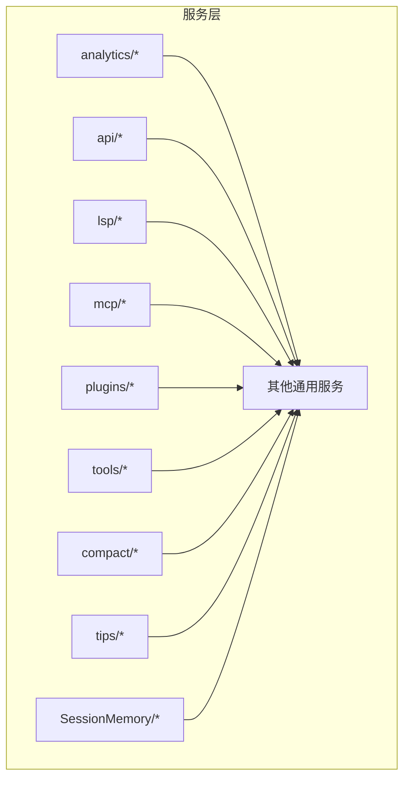
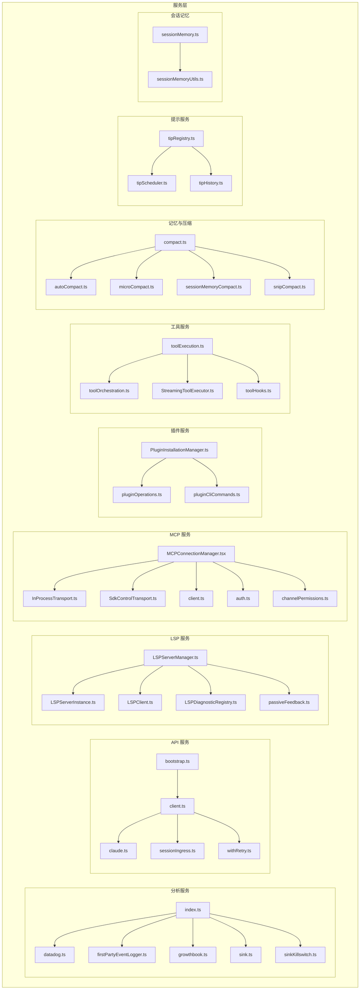
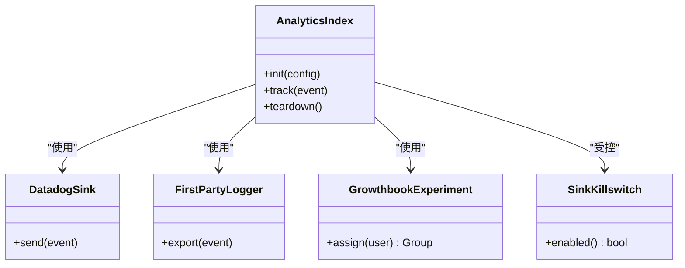
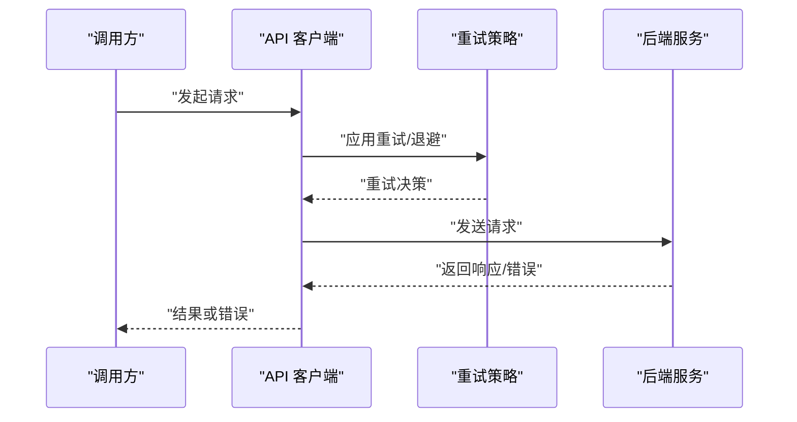
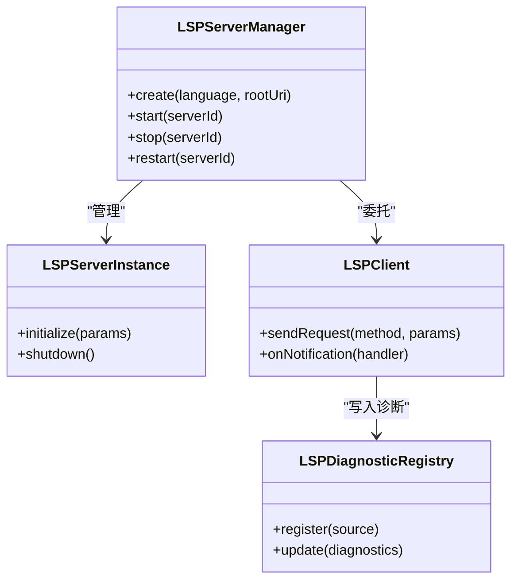
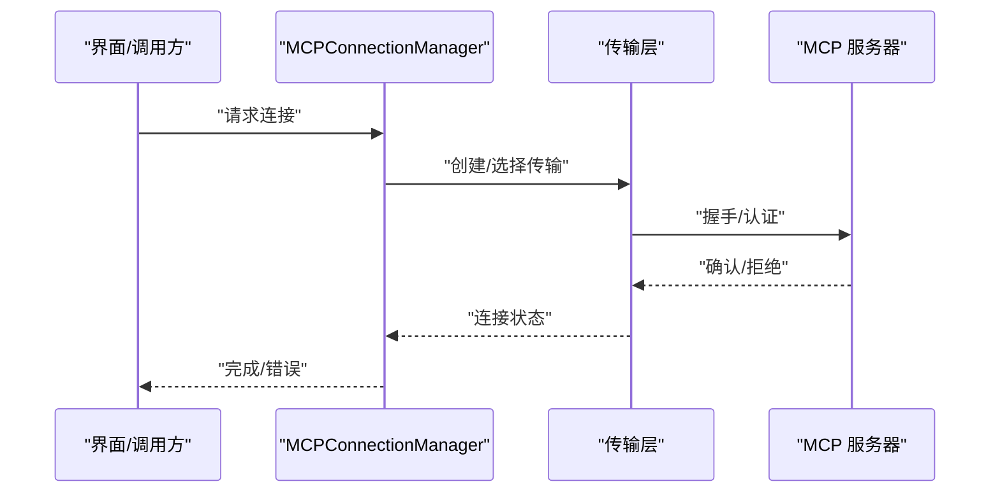
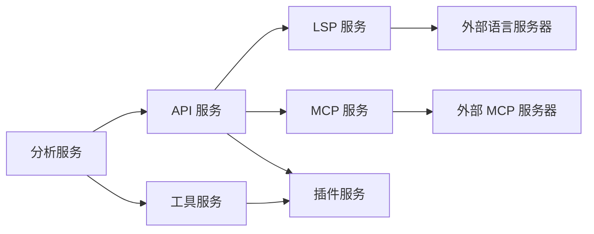

# 服务层

<cite>
**本文引用的文件**
- [src/services/analytics/index.ts](file://src/services/analytics/index.ts)
- [src/services/analytics/config.ts](file://src/services/analytics/config.ts)
- [src/services/analytics/datadog.ts](file://src/services/analytics/datadog.ts)
- [src/services/analytics/firstPartyEventLogger.ts](file://src/services/analytics/firstPartyEventLogger.ts)
- [src/services/analytics/firstPartyEventLoggingExporter.ts](file://src/services/analytics/firstPartyEventLoggingExporter.ts)
- [src/services/analytics/growthbook.ts](file://src/services/analytics/growthbook.ts)
- [src/services/analytics/metadata.ts](file://src/services/analytics/metadata.ts)
- [src/services/analytics/sink.ts](file://src/services/analytics/sink.ts)
- [src/services/analytics/sinkKillswitch.ts](file://src/services/analytics/sinkKillswitch.ts)
- [src/services/api/bootstrap.ts](file://src/services/api/bootstrap.ts)
- [src/services/api/client.ts](file://src/services/api/client.ts)
- [src/services/api/claude.ts](file://src/services/api/claude.ts)
- [src/services/api/dumpPrompts.ts](file://src/services/api/dumpPrompts.ts)
- [src/services/api/errorUtils.ts](file://src/services/api/errorUtils.ts)
- [src/services/api/errors.ts](file://src/services/api/errors.ts)
- [src/services/api/filesApi.ts](file://src/services/api/filesApi.ts)
- [src/services/api/logging.ts](file://src/services/api/logging.ts)
- [src/services/api/metricsOptOut.ts](file://src/services/api/metricsOptOut.ts)
- [src/services/api/sessionIngress.ts](file://src/services/api/sessionIngress.ts)
- [src/services/api/withRetry.ts](file://src/services/api/withRetry.ts)
- [src/services/lsp/LSPClient.ts](file://src/services/lsp/LSPClient.ts)
- [src/services/lsp/LSPDiagnosticRegistry.ts](file://src/services/lsp/LSPDiagnosticRegistry.ts)
- [src/services/lsp/LSPServerInstance.ts](file://src/services/lsp/LSPServerInstance.ts)
- [src/services/lsp/LSPServerManager.ts](file://src/services/lsp/LSPServerManager.ts)
- [src/services/lsp/config.ts](file://src/services/lsp/config.ts)
- [src/services/lsp/manager.ts](file://src/services/lsp/manager.ts)
- [src/services/lsp/passiveFeedback.ts](file://src/services/lsp/passiveFeedback.ts)
- [src/services/lsp/types.ts](file://src/services/lsp/types.ts)
- [src/services/mcp/MCPConnectionManager.tsx](file://src/services/mcp/MCPConnectionManager.tsx)
- [src/services/mcp/SdkControlTransport.ts](file://src/services/mcp/SdkControlTransport.ts)
- [src/services/mcp/InProcessTransport.ts](file://src/services/mcp/InProcessTransport.ts)
- [src/services/mcp/auth.ts](file://src/services/mcp/auth.ts)
- [src/services/mcp/channelAllowlist.ts](file://src/services/mcp/channelAllowlist.ts)
- [src/services/mcp/channelNotification.ts](file://src/services/mcp/channelNotification.ts)
- [src/services/mcp/channelPermissions.ts](file://src/services/mcp/channelPermissions.ts)
- [src/services/mcp/claudeai.ts](file://src/services/mcp/claudeai.ts)
- [src/services/mcp/client.ts](file://src/services/mcp/client.ts)
- [src/services/mcp/config.ts](file://src/services/mcp/config.ts)
- [src/services/mcp/elicitationHandler.ts](file://src/services/mcp/elicitationHandler.ts)
- [src/services/mcp/envExpansion.ts](file://src/services/mcp/envExpansion.ts)
- [src/services/mcp/headersHelper.ts](file://src/services/mcp/headersHelper.ts)
- [src/services/mcp/mcpStringUtils.ts](file://src/services/mcp/mcpStringUtils.ts)
- [src/services/mcp/normalization.ts](file://src/services/mcp/normalization.ts)
- [src/services/mcp/oauthPort.ts](file://src/services/mcp/oauthPort.ts)
- [src/services/mcp/officialRegistry.ts](file://src/services/mcp/officialRegistry.ts)
- [src/services/mcp/types.ts](file://src/services/mcp/types.ts)
- [src/services/mcp/utils.ts](file://src/services/mcp/utils.ts)
- [src/services/mcp/vscodeSdkMcp.ts](file://src/services/mcp/vscodeSdkMcp.ts)
- [src/services/mcp/xaa.ts](file://src/services/mcp/xaa.ts)
- [src/services/mcp/xaaIdpLogin.ts](file://src/services/mcp/xaaIdpLogin.ts)
- [src/services/plugins/PluginInstallationManager.ts](file://src/services/plugins/PluginInstallationManager.ts)
- [src/services/plugins/pluginCliCommands.ts](file://src/services/plugins/pluginCliCommands.ts)
- [src/services/plugins/pluginOperations.ts](file://src/services/plugins/pluginOperations.ts)
- [src/services/tools/StreamingToolExecutor.ts](file://src/services/tools/StreamingToolExecutor.ts)
- [src/services/tools/toolExecution.ts](file://src/services/tools/toolExecution.ts)
- [src/services/tools/toolHooks.ts](file://src/services/tools/toolHooks.ts)
- [src/services/tools/toolOrchestration.ts](file://src/services/tools/toolOrchestration.ts)
- [src/services/compact/compact.ts](file://src/services/compact/compact.ts)
- [src/services/compact/autoCompact.ts](file://src/services/compact/autoCompact.ts)
- [src/services/compact/cachedMCConfig.ts](file://src/services/compact/cachedMCConfig.ts)
- [src/services/compact/grouping.ts](file://src/services/compact/grouping.ts)
- [src/services/compact/microCompact.ts](file://src/services/compact/microCompact.ts)
- [src/services/compact/postCompactCleanup.ts](file://src/services/compact/postCompactCleanup.ts)
- [src/services/compact/prompt.ts](file://src/services/compact/prompt.ts)
- [src/services/compact/reactiveCompact.ts](file://src/services/compact/reactiveCompact.ts)
- [src/services/compact/sessionMemoryCompact.ts](file://src/services/compact/sessionMemoryCompact.ts)
- [src/services/compact/snipCompact.ts](file://src/services/compact/snipCompact.ts)
- [src/services/compact/snipProjection.ts](file://src/services/compact/snipProjection.ts)
- [src/services/compact/timeBasedMCConfig.ts](file://src/services/compact/timeBasedMCConfig.ts)
- [src/services/compact/apiMicrocompact.ts](file://src/services/compact/apiMicrocompact.ts)
- [src/services/compact/compactWarningHook.ts](file://src/services/compact/compactWarningHook.ts)
- [src/services/compact/compactWarningState.ts](file://src/services/compact/compactWarningState.ts)
- [src/services/SessionMemory/sessionMemory.ts](file://src/services/SessionMemory/sessionMemory.ts)
- [src/services/SessionMemory/sessionMemoryUtils.ts](file://src/services/SessionMemory/sessionMemoryUtils.ts)
- [src/services/SessionMemory/prompts.ts](file://src/services/SessionMemory/prompts.ts)
- [src/services/tips/tipHistory.ts](file://src/services/tips/tipHistory.ts)
- [src/services/tips/tipRegistry.ts](file://src/services/tips/tipRegistry.ts)
- [src/services/tips/tipScheduler.ts](file://src/services/tips/tipScheduler.ts)
- [src/services/tips/types.ts](file://src/services/tips/types.ts)
- [src/services/awaySummary.ts](file://src/services/awaySummary.ts)
- [src/services/claudeAiLimits.ts](file://src/services/claudeAiLimits.ts)
- [src/services/claudeAiLimitsHook.ts](file://src/services/claudeAiLimitsHook.ts)
- [src/services/diagnosticTracking.ts](file://src/services/diagnosticTracking.ts)
- [src/services/internalLogging.ts](file://src/services/internalLogging.ts)
- [src/services/mcpServerApproval.tsx](file://src/services/mcpServerApproval.tsx)
- [src/services/mockRateLimits.ts](file://src/services/mockRateLimits.ts)
- [src/services/notifier.ts](file://src/services/notifier.ts)
- [src/services/preventSleep.ts](file://src/services/preventSleep.ts)
- [src/services/rateLimitMessages.ts](file://src/services/rateLimitMessages.ts)
- [src/services/rateLimitMocking.ts](file://src/services/rateLimitMocking.ts)
- [src/services/tokenEstimation.ts](file://src/services/tokenEstimation.ts)
- [src/services/vcr.ts](file://src/services/vcr.ts)
- [src/services/voice.ts](file://src/services/voice.ts)
- [src/services/voiceKeyterms.ts](file://src/services/voiceKeyterms.ts)
- [src/services/voiceStreamSTT.ts](file://src/services/voiceStreamSTT.ts)
</cite>

## 目录
1. 引言
2. 项目结构
3. 核心组件
4. 架构总览
5. 组件详解
6. 依赖关系分析
7. 性能考量
8. 故障排查指南
9. 结论
10. 附录

## 引言
本文件面向服务层（Services）的技术文档，系统阐述服务层的整体架构设计、服务注册与依赖注入、生命周期管理与错误处理策略；并深入解析 API 服务、分析服务、LSP 服务、插件服务与 MCP 服务的实现原理与使用方法。同时给出服务扩展机制、服务间通信方式、配置管理实践，以及与组件系统、工具系统和外部系统的集成关系。最后提供服务监控、性能优化与故障诊断的实用建议。

## 项目结构
服务层位于 src/services 下，按功能域划分为多个子模块：analytics（分析）、api（API 客户端与会话）、lsp（语言服务器协议）、mcp（模型控制协议）、plugins（插件安装与操作）、tools（工具执行编排）、compact（对话压缩与记忆整理）、tips（提示调度）、SessionMemory（会话记忆）、以及若干通用服务（通知、限流、语音等）。各模块内部采用清晰的职责划分，通过统一的导出入口或类型定义对外暴露能力。

## 核心组件
- 分析服务（Analytics）
  - 职责：事件采集、指标导出、实验分组、元数据管理、数据源开关与降级。
  - 关键点：多数据源（Datadog、自研首方日志）、可插拔导出器、实验平台对接、事件元数据标准化。
- API 服务（API）
  - 职责：与后端交互的客户端封装、会话入站、文件上传、重试与错误处理、引导与度量上报。
- LSP 服务（LSP）
  - 职责：语言服务器生命周期管理、诊断注册、被动反馈、配置与类型定义。
- MCP 服务（MCP）
  - 职责：连接管理、传输抽象、认证与权限、环境变量展开、官方注册表、VS Code SDK 集成。
- 插件服务（Plugins）
  - 职责：插件安装、卸载、命令桥接与 CLI 操作。
- 工具服务（Tools）
  - 职责：工具执行编排、流式执行器、钩子与协调。
- 记忆与压缩（Compact/SessionMemory）
  - 职责：会话记忆持久化与压缩、自动/微压缩、分组与投影、清理与告警。
- 提示服务（Tips）
  - 职责：提示历史、注册表、调度器与类型定义。
- 其他通用服务（通知、限流、语音、诊断等）
  - 职责：跨领域支撑能力，如速率限制、睡眠抑制、语音转写、内部日志与诊断跟踪。

章节来源
- [src/services/analytics/index.ts](file://src/services/analytics/index.ts)
- [src/services/analytics/config.ts](file://src/services/analytics/config.ts)
- [src/services/analytics/datadog.ts](file://src/services/analytics/datadog.ts)
- [src/services/analytics/firstPartyEventLogger.ts](file://src/services/analytics/firstPartyEventLogger.ts)
- [src/services/analytics/firstPartyEventLoggingExporter.ts](file://src/services/analytics/firstPartyEventLoggingExporter.ts)
- [src/services/analytics/growthbook.ts](file://src/services/analytics/growthbook.ts)
- [src/services/analytics/metadata.ts](file://src/services/analytics/metadata.ts)
- [src/services/analytics/sink.ts](file://src/services/analytics/sink.ts)
- [src/services/analytics/sinkKillswitch.ts](file://src/services/analytics/sinkKillswitch.ts)
- [src/services/api/bootstrap.ts](file://src/services/api/bootstrap.ts)
- [src/services/api/client.ts](file://src/services/api/client.ts)
- [src/services/api/claude.ts](file://src/services/api/claude.ts)
- [src/services/api/dumpPrompts.ts](file://src/services/api/dumpPrompts.ts)
- [src/services/api/errorUtils.ts](file://src/services/api/errorUtils.ts)
- [src/services/api/errors.ts](file://src/services/api/errors.ts)
- [src/services/api/filesApi.ts](file://src/services/api/filesApi.ts)
- [src/services/api/logging.ts](file://src/services/api/logging.ts)
- [src/services/api/metricsOptOut.ts](file://src/services/api/metricsOptOut.ts)
- [src/services/api/sessionIngress.ts](file://src/services/api/sessionIngress.ts)
- [src/services/api/withRetry.ts](file://src/services/api/withRetry.ts)
- [src/services/lsp/LSPClient.ts](file://src/services/lsp/LSPClient.ts)
- [src/services/lsp/LSPDiagnosticRegistry.ts](file://src/services/lsp/LSPDiagnosticRegistry.ts)
- [src/services/lsp/LSPServerInstance.ts](file://src/services/lsp/LSPServerInstance.ts)
- [src/services/lsp/LSPServerManager.ts](file://src/services/lsp/LSPServerManager.ts)
- [src/services/lsp/config.ts](file://src/services/lsp/config.ts)
- [src/services/lsp/manager.ts](file://src/services/lsp/manager.ts)
- [src/services/lsp/passiveFeedback.ts](file://src/services/lsp/passiveFeedback.ts)
- [src/services/lsp/types.ts](file://src/services/lsp/types.ts)
- [src/services/mcp/MCPConnectionManager.tsx](file://src/services/mcp/MCPConnectionManager.tsx)
- [src/services/mcp/SdkControlTransport.ts](file://src/services/mcp/SdkControlTransport.ts)
- [src/services/mcp/InProcessTransport.ts](file://src/services/mcp/InProcessTransport.ts)
- [src/services/mcp/auth.ts](file://src/services/mcp/auth.ts)
- [src/services/mcp/channelAllowlist.ts](file://src/services/mcp/channelAllowlist.ts)
- [src/services/mcp/channelNotification.ts](file://src/services/mcp/channelNotification.ts)
- [src/services/mcp/channelPermissions.ts](file://src/services/mcp/channelPermissions.ts)
- [src/services/mcp/claudeai.ts](file://src/services/mcp/claudeai.ts)
- [src/services/mcp/client.ts](file://src/services/mcp/client.ts)
- [src/services/mcp/config.ts](file://src/services/mcp/config.ts)
- [src/services/mcp/elicitationHandler.ts](file://src/services/mcp/elicitationHandler.ts)
- [src/services/mcp/envExpansion.ts](file://src/services/mcp/envExpansion.ts)
- [src/services/mcp/headersHelper.ts](file://src/services/mcp/headersHelper.ts)
- [src/services/mcp/mcpStringUtils.ts](file://src/services/mcp/mcpStringUtils.ts)
- [src/services/mcp/normalization.ts](file://src/services/mcp/normalization.ts)
- [src/services/mcp/oauthPort.ts](file://src/services/mcp/oauthPort.ts)
- [src/services/mcp/officialRegistry.ts](file://src/services/mcp/officialRegistry.ts)
- [src/services/mcp/types.ts](file://src/services/mcp/types.ts)
- [src/services/mcp/utils.ts](file://src/services/mcp/utils.ts)
- [src/services/mcp/vscodeSdkMcp.ts](file://src/services/mcp/vscodeSdkMcp.ts)
- [src/services/mcp/xaa.ts](file://src/services/mcp/xaa.ts)
- [src/services/mcp/xaaIdpLogin.ts](file://src/services/mcp/xaaIdpLogin.ts)
- [src/services/plugins/PluginInstallationManager.ts](file://src/services/plugins/PluginInstallationManager.ts)
- [src/services/plugins/pluginCliCommands.ts](file://src/services/plugins/pluginCliCommands.ts)
- [src/services/plugins/pluginOperations.ts](file://src/services/plugins/pluginOperations.ts)
- [src/services/tools/StreamingToolExecutor.ts](file://src/services/tools/StreamingToolExecutor.ts)
- [src/services/tools/toolExecution.ts](file://src/services/tools/toolExecution.ts)
- [src/services/tools/toolHooks.ts](file://src/services/tools/toolHooks.ts)
- [src/services/tools/toolOrchestration.ts](file://src/services/tools/toolOrchestration.ts)
- [src/services/compact/compact.ts](file://src/services/compact/compact.ts)
- [src/services/compact/autoCompact.ts](file://src/services/compact/autoCompact.ts)
- [src/services/compact/cachedMCConfig.ts](file://src/services/compact/cachedMCConfig.ts)
- [src/services/compact/grouping.ts](file://src/services/compact/grouping.ts)
- [src/services/compact/microCompact.ts](file://src/services/compact/microCompact.ts)
- [src/services/compact/postCompactCleanup.ts](file://src/services/compact/postCompactCleanup.ts)
- [src/services/compact/prompt.ts](file://src/services/compact/prompt.ts)
- [src/services/compact/reactiveCompact.ts](file://src/services/compact/reactiveCompact.ts)
- [src/services/compact/sessionMemoryCompact.ts](file://src/services/compact/sessionMemoryCompact.ts)
- [src/services/compact/snipCompact.ts](file://src/services/compact/snipCompact.ts)
- [src/services/compact/snipProjection.ts](file://src/services/compact/snipProjection.ts)
- [src/services/compact/timeBasedMCConfig.ts](file://src/services/compact/timeBasedMCConfig.ts)
- [src/services/compact/apiMicrocompact.ts](file://src/services/compact/apiMicrocompact.ts)
- [src/services/compact/compactWarningHook.ts](file://src/services/compact/compactWarningHook.ts)
- [src/services/compact/compactWarningState.ts](file://src/services/compact/compactWarningState.ts)
- [src/services/SessionMemory/sessionMemory.ts](file://src/services/SessionMemory/sessionMemory.ts)
- [src/services/SessionMemory/sessionMemoryUtils.ts](file://src/services/SessionMemory/sessionMemoryUtils.ts)
- [src/services/SessionMemory/prompts.ts](file://src/services/SessionMemory/prompts.ts)
- [src/services/tips/tipHistory.ts](file://src/services/tips/tipHistory.ts)
- [src/services/tips/tipRegistry.ts](file://src/services/tips/tipRegistry.ts)
- [src/services/tips/tipScheduler.ts](file://src/services/tips/tipScheduler.ts)
- [src/services/tips/types.ts](file://src/services/tips/types.ts)
- [src/services/awaySummary.ts](file://src/services/awaySummary.ts)
- [src/services/claudeAiLimits.ts](file://src/services/claudeAiLimits.ts)
- [src/services/claudeAiLimitsHook.ts](file://src/services/claudeAiLimitsHook.ts)
- [src/services/diagnosticTracking.ts](file://src/services/diagnosticTracking.ts)
- [src/services/internalLogging.ts](file://src/services/internalLogging.ts)
- [src/services/mcpServerApproval.tsx](file://src/services/mcpServerApproval.tsx)
- [src/services/mockRateLimits.ts](file://src/services/mockRateLimits.ts)
- [src/services/notifier.ts](file://src/services/notifier.ts)
- [src/services/preventSleep.ts](file://src/services/preventSleep.ts)
- [src/services/rateLimitMessages.ts](file://src/services/rateLimitMessages.ts)
- [src/services/rateLimitMocking.ts](file://src/services/rateLimitMocking.ts)
- [src/services/tokenEstimation.ts](file://src/services/tokenEstimation.ts)
- [src/services/vcr.ts](file://src/services/vcr.ts)
- [src/services/voice.ts](file://src/services/voice.ts)
- [src/services/voiceKeyterms.ts](file://src/services/voiceKeyterms.ts)
- [src/services/voiceStreamSTT.ts](file://src/services/voiceStreamSTT.ts)

## 架构总览
服务层采用“功能域模块化 + 统一导出”的组织方式，核心设计原则如下：
- 解耦与内聚：每个服务域独立封装，仅通过明确接口对外暴露。
- 可插拔性：分析服务支持多数据源与导出器，便于替换与扩展。
- 生命周期与状态：LSP 与 MCP 等长生命周期服务通过管理器集中管控。
- 错误与重试：API 层提供统一的错误处理与重试策略。
- 配置与开关：分析服务提供数据源开关与降级策略，确保稳定性。

图表来源
- [src/services/analytics/index.ts](file://src/services/analytics/index.ts)
- [src/services/analytics/datadog.ts](file://src/services/analytics/datadog.ts)
- [src/services/analytics/firstPartyEventLogger.ts](file://src/services/analytics/firstPartyEventLogger.ts)
- [src/services/analytics/growthbook.ts](file://src/services/analytics/growthbook.ts)
- [src/services/analytics/sink.ts](file://src/services/analytics/sink.ts)
- [src/services/analytics/sinkKillswitch.ts](file://src/services/analytics/sinkKillswitch.ts)
- [src/services/api/bootstrap.ts](file://src/services/api/bootstrap.ts)
- [src/services/api/client.ts](file://src/services/api/client.ts)
- [src/services/api/claude.ts](file://src/services/api/claude.ts)
- [src/services/api/sessionIngress.ts](file://src/services/api/sessionIngress.ts)
- [src/services/api/withRetry.ts](file://src/services/api/withRetry.ts)
- [src/services/lsp/LSPServerManager.ts](file://src/services/lsp/LSPServerManager.ts)
- [src/services/lsp/LSPServerInstance.ts](file://src/services/lsp/LSPServerInstance.ts)
- [src/services/lsp/LSPClient.ts](file://src/services/lsp/LSPClient.ts)
- [src/services/lsp/LSPDiagnosticRegistry.ts](file://src/services/lsp/LSPDiagnosticRegistry.ts)
- [src/services/lsp/passiveFeedback.ts](file://src/services/lsp/passiveFeedback.ts)
- [src/services/mcp/MCPConnectionManager.tsx](file://src/services/mcp/MCPConnectionManager.tsx)
- [src/services/mcp/InProcessTransport.ts](file://src/services/mcp/InProcessTransport.ts)
- [src/services/mcp/SdkControlTransport.ts](file://src/services/mcp/SdkControlTransport.ts)
- [src/services/mcp/client.ts](file://src/services/mcp/client.ts)
- [src/services/mcp/auth.ts](file://src/services/mcp/auth.ts)
- [src/services/mcp/channelPermissions.ts](file://src/services/mcp/channelPermissions.ts)
- [src/services/plugins/PluginInstallationManager.ts](file://src/services/plugins/PluginInstallationManager.ts)
- [src/services/plugins/pluginOperations.ts](file://src/services/plugins/pluginOperations.ts)
- [src/services/plugins/pluginCliCommands.ts](file://src/services/plugins/pluginCliCommands.ts)
- [src/services/tools/toolExecution.ts](file://src/services/tools/toolExecution.ts)
- [src/services/tools/toolOrchestration.ts](file://src/services/tools/toolOrchestration.ts)
- [src/services/tools/StreamingToolExecutor.ts](file://src/services/tools/StreamingToolExecutor.ts)
- [src/services/tools/toolHooks.ts](file://src/services/tools/toolHooks.ts)
- [src/services/compact/compact.ts](file://src/services/compact/compact.ts)
- [src/services/compact/autoCompact.ts](file://src/services/compact/autoCompact.ts)
- [src/services/compact/microCompact.ts](file://src/services/compact/microCompact.ts)
- [src/services/compact/sessionMemoryCompact.ts](file://src/services/compact/sessionMemoryCompact.ts)
- [src/services/compact/snipCompact.ts](file://src/services/compact/snipCompact.ts)
- [src/services/tips/tipRegistry.ts](file://src/services/tips/tipRegistry.ts)
- [src/services/tips/tipScheduler.ts](file://src/services/tips/tipScheduler.ts)
- [src/services/tips/tipHistory.ts](file://src/services/tips/tipHistory.ts)
- [src/services/SessionMemory/sessionMemory.ts](file://src/services/SessionMemory/sessionMemory.ts)
- [src/services/SessionMemory/sessionMemoryUtils.ts](file://src/services/SessionMemory/sessionMemoryUtils.ts)

## 组件详解

### 分析服务（Analytics）
- 设计要点
  - 多数据源：Datadog 与自研首方日志记录器，支持导出器插件化。
  - 实验平台：GrowthBook 用于实验分组与 A/B 测试。
  - 数据源开关：通过 killswitch 控制数据源启停，保障稳定性。
  - 元数据：标准化事件元数据，便于跨系统对齐。
- 生命周期与配置
  - 初始化时加载配置与开关，按需启用导出器与实验平台。
  - 运行期根据开关动态切换数据源，必要时降级至本地存储。
- 错误处理
  - 导出失败不阻塞主流程，记录错误并进行退避重试或降级。
- 使用示例（路径）
  - [src/services/analytics/index.ts](file://src/services/analytics/index.ts)
  - [src/services/analytics/config.ts](file://src/services/analytics/config.ts)
  - [src/services/analytics/datadog.ts](file://src/services/analytics/datadog.ts)
  - [src/services/analytics/firstPartyEventLogger.ts](file://src/services/analytics/firstPartyEventLogger.ts)
  - [src/services/analytics/firstPartyEventLoggingExporter.ts](file://src/services/analytics/firstPartyEventLoggingExporter.ts)
  - [src/services/analytics/growthbook.ts](file://src/services/analytics/growthbook.ts)
  - [src/services/analytics/metadata.ts](file://src/services/analytics/metadata.ts)
  - [src/services/analytics/sink.ts](file://src/services/analytics/sink.ts)
  - [src/services/analytics/sinkKillswitch.ts](file://src/services/analytics/sinkKillswitch.ts)

图表来源
- [src/services/analytics/index.ts](file://src/services/analytics/index.ts)
- [src/services/analytics/datadog.ts](file://src/services/analytics/datadog.ts)
- [src/services/analytics/firstPartyEventLogger.ts](file://src/services/analytics/firstPartyEventLogger.ts)
- [src/services/analytics/growthbook.ts](file://src/services/analytics/growthbook.ts)
- [src/services/analytics/sink.ts](file://src/services/analytics/sink.ts)
- [src/services/analytics/sinkKillswitch.ts](file://src/services/analytics/sinkKillswitch.ts)

章节来源
- [src/services/analytics/index.ts](file://src/services/analytics/index.ts)
- [src/services/analytics/config.ts](file://src/services/analytics/config.ts)
- [src/services/analytics/datadog.ts](file://src/services/analytics/datadog.ts)
- [src/services/analytics/firstPartyEventLogger.ts](file://src/services/analytics/firstPartyEventLogger.ts)
- [src/services/analytics/firstPartyEventLoggingExporter.ts](file://src/services/analytics/firstPartyEventLoggingExporter.ts)
- [src/services/analytics/growthbook.ts](file://src/services/analytics/growthbook.ts)
- [src/services/analytics/metadata.ts](file://src/services/analytics/metadata.ts)
- [src/services/analytics/sink.ts](file://src/services/analytics/sink.ts)
- [src/services/analytics/sinkKillswitch.ts](file://src/services/analytics/sinkKillswitch.ts)

### API 服务（API）
- 设计要点
  - 客户端封装：统一请求构建、鉴权头注入、超时与重试策略。
  - 会话入站：接收外部消息并转换为内部格式，支持附件与上下文。
  - 文件上传：安全与合规的文件上传通道。
  - 引导与度量：启动阶段拉取配置，度量上报与退出清理。
- 生命周期与配置
  - 启动：加载引导配置与密钥，建立连接池与重试策略。
  - 运行：按需调用会话入站与文件上传接口。
  - 关闭：释放资源，清理缓存与连接。
- 错误处理
  - 区分网络、业务与鉴权错误，采用指数退避与熔断策略。
- 使用示例（路径）
  - [src/services/api/bootstrap.ts](file://src/services/api/bootstrap.ts)
  - [src/services/api/client.ts](file://src/services/api/client.ts)
  - [src/services/api/claude.ts](file://src/services/api/claude.ts)
  - [src/services/api/sessionIngress.ts](file://src/services/api/sessionIngress.ts)
  - [src/services/api/withRetry.ts](file://src/services/api/withRetry.ts)
  - [src/services/api/errorUtils.ts](file://src/services/api/errorUtils.ts)
  - [src/services/api/errors.ts](file://src/services/api/errors.ts)
  - [src/services/api/filesApi.ts](file://src/services/api/filesApi.ts)
  - [src/services/api/logging.ts](file://src/services/api/logging.ts)
  - [src/services/api/metricsOptOut.ts](file://src/services/api/metricsOptOut.ts)
  - [src/services/api/dumpPrompts.ts](file://src/services/api/dumpPrompts.ts)

图表来源
- [src/services/api/client.ts](file://src/services/api/client.ts)
- [src/services/api/withRetry.ts](file://src/services/api/withRetry.ts)

章节来源
- [src/services/api/bootstrap.ts](file://src/services/api/bootstrap.ts)
- [src/services/api/client.ts](file://src/services/api/client.ts)
- [src/services/api/claude.ts](file://src/services/api/claude.ts)
- [src/services/api/sessionIngress.ts](file://src/services/api/sessionIngress.ts)
- [src/services/api/withRetry.ts](file://src/services/api/withRetry.ts)
- [src/services/api/errorUtils.ts](file://src/services/api/errorUtils.ts)
- [src/services/api/errors.ts](file://src/services/api/errors.ts)
- [src/services/api/filesApi.ts](file://src/services/api/filesApi.ts)
- [src/services/api/logging.ts](file://src/services/api/logging.ts)
- [src/services/api/metricsOptOut.ts](file://src/services/api/metricsOptOut.ts)
- [src/services/api/dumpPrompts.ts](file://src/services/api/dumpPrompts.ts)

### LSP 服务（LSP）
- 设计要点
  - 管理器模式：统一创建、启动、停止与重启语言服务器实例。
  - 诊断注册：集中管理诊断源，支持增量更新与去重。
  - 被动反馈：基于用户行为与上下文生成反馈建议。
  - 类型与配置：强类型定义与可配置参数。
- 生命周期与配置
  - 启动：按工作区与语言选择合适的服务器，注入配置。
  - 运行：订阅通知、发布请求、处理诊断。
  - 关闭：优雅退出，释放内存与进程句柄。
- 错误处理
  - 服务器崩溃自动重启，诊断异常不影响主流程。
- 使用示例（路径）
  - [src/services/lsp/LSPServerManager.ts](file://src/services/lsp/LSPServerManager.ts)
  - [src/services/lsp/LSPServerInstance.ts](file://src/services/lsp/LSPServerInstance.ts)
  - [src/services/lsp/LSPClient.ts](file://src/services/lsp/LSPClient.ts)
  - [src/services/lsp/LSPDiagnosticRegistry.ts](file://src/services/lsp/LSPDiagnosticRegistry.ts)
  - [src/services/lsp/passiveFeedback.ts](file://src/services/lsp/passiveFeedback.ts)
  - [src/services/lsp/config.ts](file://src/services/lsp/config.ts)
  - [src/services/lsp/types.ts](file://src/services/lsp/types.ts)

图表来源
- [src/services/lsp/LSPServerManager.ts](file://src/services/lsp/LSPServerManager.ts)
- [src/services/lsp/LSPServerInstance.ts](file://src/services/lsp/LSPServerInstance.ts)
- [src/services/lsp/LSPClient.ts](file://src/services/lsp/LSPClient.ts)
- [src/services/lsp/LSPDiagnosticRegistry.ts](file://src/services/lsp/LSPDiagnosticRegistry.ts)

章节来源
- [src/services/lsp/LSPServerManager.ts](file://src/services/lsp/LSPServerManager.ts)
- [src/services/lsp/LSPServerInstance.ts](file://src/services/lsp/LSPServerInstance.ts)
- [src/services/lsp/LSPClient.ts](file://src/services/lsp/LSPClient.ts)
- [src/services/lsp/LSPDiagnosticRegistry.ts](file://src/services/lsp/LSPDiagnosticRegistry.ts)
- [src/services/lsp/passiveFeedback.ts](file://src/services/lsp/passiveFeedback.ts)
- [src/services/lsp/config.ts](file://src/services/lsp/config.ts)
- [src/services/lsp/types.ts](file://src/services/lsp/types.ts)

### MCP 服务（MCP）
- 设计要点
  - 连接管理：统一管理 MCP 服务器连接、传输与认证。
  - 传输抽象：支持进程内与 SDK 控制传输，便于测试与集成。
  - 权限与白名单：通道权限控制与允许列表，保障安全。
  - 官方注册表与 IDP 登录：官方资源发现与身份登录。
- 生命周期与配置
  - 启动：解析配置与环境变量，建立传输与认证。
  - 运行：订阅通道、处理请求与响应、维护心跳。
  - 关闭：断开连接、清理资源、触发回调。
- 错误处理
  - 连接异常自动重连，权限不足时回退到受限模式。
- 使用示例（路径）
  - [src/services/mcp/MCPConnectionManager.tsx](file://src/services/mcp/MCPConnectionManager.tsx)
  - [src/services/mcp/InProcessTransport.ts](file://src/services/mcp/InProcessTransport.ts)
  - [src/services/mcp/SdkControlTransport.ts](file://src/services/mcp/SdkControlTransport.ts)
  - [src/services/mcp/client.ts](file://src/services/mcp/client.ts)
  - [src/services/mcp/auth.ts](file://src/services/mcp/auth.ts)
  - [src/services/mcp/channelPermissions.ts](file://src/services/mcp/channelPermissions.ts)
  - [src/services/mcp/officialRegistry.ts](file://src/services/mcp/officialRegistry.ts)
  - [src/services/mcp/xaaIdpLogin.ts](file://src/services/mcp/xaaIdpLogin.ts)
  - [src/services/mcp/config.ts](file://src/services/mcp/config.ts)
  - [src/services/mcp/types.ts](file://src/services/mcp/types.ts)

图表来源
- [src/services/mcp/MCPConnectionManager.tsx](file://src/services/mcp/MCPConnectionManager.tsx)
- [src/services/mcp/InProcessTransport.ts](file://src/services/mcp/InProcessTransport.ts)
- [src/services/mcp/SdkControlTransport.ts](file://src/services/mcp/SdkControlTransport.ts)
- [src/services/mcp/client.ts](file://src/services/mcp/client.ts)
- [src/services/mcp/auth.ts](file://src/services/mcp/auth.ts)
- [src/services/mcp/channelPermissions.ts](file://src/services/mcp/channelPermissions.ts)

章节来源
- [src/services/mcp/MCPConnectionManager.tsx](file://src/services/mcp/MCPConnectionManager.tsx)
- [src/services/mcp/InProcessTransport.ts](file://src/services/mcp/InProcessTransport.ts)
- [src/services/mcp/SdkControlTransport.ts](file://src/services/mcp/SdkControlTransport.ts)
- [src/services/mcp/client.ts](file://src/services/mcp/client.ts)
- [src/services/mcp/auth.ts](file://src/services/mcp/auth.ts)
- [src/services/mcp/channelPermissions.ts](file://src/services/mcp/channelPermissions.ts)
- [src/services/mcp/officialRegistry.ts](file://src/services/mcp/officialRegistry.ts)
- [src/services/mcp/xaaIdpLogin.ts](file://src/services/mcp/xaaIdpLogin.ts)
- [src/services/mcp/config.ts](file://src/services/mcp/config.ts)
- [src/services/mcp/types.ts](file://src/services/mcp/types.ts)

### 插件服务（Plugins）
- 设计要点
  - 安装管理：插件安装、卸载、版本与依赖校验。
  - 操作编排：批量操作、CLI 命令桥接与状态同步。
- 生命周期与配置
  - 启动：扫描内置与已安装插件，加载运行时。
  - 运行：执行安装/卸载任务，更新状态与缓存。
  - 关闭：保存状态，清理临时文件。
- 错误处理
  - 安装失败回滚，依赖冲突提示用户解决。
- 使用示例（路径）
  - [src/services/plugins/PluginInstallationManager.ts](file://src/services/plugins/PluginInstallationManager.ts)
  - [src/services/plugins/pluginOperations.ts](file://src/services/plugins/pluginOperations.ts)
  - [src/services/plugins/pluginCliCommands.ts](file://src/services/plugins/pluginCliCommands.ts)

章节来源
- [src/services/plugins/PluginInstallationManager.ts](file://src/services/plugins/PluginInstallationManager.ts)
- [src/services/plugins/pluginOperations.ts](file://src/services/plugins/pluginOperations.ts)
- [src/services/plugins/pluginCliCommands.ts](file://src/services/plugins/pluginCliCommands.ts)

### 工具服务（Tools）
- 设计要点
  - 执行编排：统一工具执行入口，支持并发与串行组合。
  - 流式执行器：支持流式输出与中断。
  - 钩子与协调：在执行前后注入钩子，协调上下文与副作用。
- 生命周期与配置
  - 启动：注册工具清单与默认参数。
  - 运行：按策略执行工具，收集结果与指标。
  - 关闭：清理资源与临时状态。
- 错误处理
  - 工具失败不影响整体流程，记录错误并可重试。
- 使用示例（路径）
  - [src/services/tools/toolExecution.ts](file://src/services/tools/toolExecution.ts)
  - [src/services/tools/toolOrchestration.ts](file://src/services/tools/toolOrchestration.ts)
  - [src/services/tools/StreamingToolExecutor.ts](file://src/services/tools/StreamingToolExecutor.ts)
  - [src/services/tools/toolHooks.ts](file://src/services/tools/toolHooks.ts)

章节来源
- [src/services/tools/toolExecution.ts](file://src/services/tools/toolExecution.ts)
- [src/services/tools/toolOrchestration.ts](file://src/services/tools/toolOrchestration.ts)
- [src/services/tools/StreamingToolExecutor.ts](file://src/services/tools/StreamingToolExecutor.ts)
- [src/services/tools/toolHooks.ts](file://src/services/tools/toolHooks.ts)

### 记忆与压缩（Compact/SessionMemory）
- 设计要点
  - 会话记忆：持久化与检索最近对话片段，支持提示词模板。
  - 压缩策略：自动压缩、微压缩、分组与投影、清理与告警。
- 生命周期与配置
  - 启动：加载配置与缓存，初始化压缩策略。
  - 运行：根据策略定期压缩，更新提示词与元数据。
  - 关闭：落盘缓存，清理临时文件。
- 错误处理
  - 压缩失败不影响主流程，记录错误并回退。
- 使用示例（路径）
  - [src/services/compact/compact.ts](file://src/services/compact/compact.ts)
  - [src/services/compact/autoCompact.ts](file://src/services/compact/autoCompact.ts)
  - [src/services/compact/microCompact.ts](file://src/services/compact/microCompact.ts)
  - [src/services/compact/sessionMemoryCompact.ts](file://src/services/compact/sessionMemoryCompact.ts)
  - [src/services/compact/snipCompact.ts](file://src/services/compact/snipCompact.ts)
  - [src/services/compact/snipProjection.ts](file://src/services/compact/snipProjection.ts)
  - [src/services/compact/postCompactCleanup.ts](file://src/services/compact/postCompactCleanup.ts)
  - [src/services/compact/compactWarningHook.ts](file://src/services/compact/compactWarningHook.ts)
  - [src/services/compact/compactWarningState.ts](file://src/services/compact/compactWarningState.ts)
  - [src/services/SessionMemory/sessionMemory.ts](file://src/services/SessionMemory/sessionMemory.ts)
  - [src/services/SessionMemory/sessionMemoryUtils.ts](file://src/services/SessionMemory/sessionMemoryUtils.ts)
  - [src/services/SessionMemory/prompts.ts](file://src/services/SessionMemory/prompts.ts)

章节来源
- [src/services/compact/compact.ts](file://src/services/compact/compact.ts)
- [src/services/compact/autoCompact.ts](file://src/services/compact/autoCompact.ts)
- [src/services/compact/microCompact.ts](file://src/services/compact/microCompact.ts)
- [src/services/compact/sessionMemoryCompact.ts](file://src/services/compact/sessionMemoryCompact.ts)
- [src/services/compact/snipCompact.ts](file://src/services/compact/snipCompact.ts)
- [src/services/compact/snipProjection.ts](file://src/services/compact/snipProjection.ts)
- [src/services/compact/postCompactCleanup.ts](file://src/services/compact/postCompactCleanup.ts)
- [src/services/compact/compactWarningHook.ts](file://src/services/compact/compactWarningHook.ts)
- [src/services/compact/compactWarningState.ts](file://src/services/compact/compactWarningState.ts)
- [src/services/SessionMemory/sessionMemory.ts](file://src/services/SessionMemory/sessionMemory.ts)
- [src/services/SessionMemory/sessionMemoryUtils.ts](file://src/services/SessionMemory/sessionMemoryUtils.ts)
- [src/services/SessionMemory/prompts.ts](file://src/services/SessionMemory/prompts.ts)

### 提示服务（Tips）
- 设计要点
  - 注册表：集中管理提示条目与分类。
  - 调度器：按时间、频率与用户状态调度提示。
  - 历史：记录已显示提示，避免重复。
- 生命周期与配置
  - 启动：加载注册表与历史，初始化调度器。
  - 运行：按策略推送提示，更新历史。
  - 关闭：持久化历史。
- 错误处理
  - 调度失败不影响主流程，记录并延后。
- 使用示例（路径）
  - [src/services/tips/tipRegistry.ts](file://src/services/tips/tipRegistry.ts)
  - [src/services/tips/tipScheduler.ts](file://src/services/tips/tipScheduler.ts)
  - [src/services/tips/tipHistory.ts](file://src/services/tips/tipHistory.ts)
  - [src/services/tips/types.ts](file://src/services/tips/types.ts)

章节来源
- [src/services/tips/tipRegistry.ts](file://src/services/tips/tipRegistry.ts)
- [src/services/tips/tipScheduler.ts](file://src/services/tips/tipScheduler.ts)
- [src/services/tips/tipHistory.ts](file://src/services/tips/tipHistory.ts)
- [src/services/tips/types.ts](file://src/services/tips/types.ts)

### 其他通用服务
- 通知、限流、睡眠抑制、语音、内部日志与诊断跟踪等服务提供横切能力，贯穿各功能域。
- 使用示例（路径）
  - [src/services/notifier.ts](file://src/services/notifier.ts)
  - [src/services/claudeAiLimits.ts](file://src/services/claudeAiLimits.ts)
  - [src/services/claudeAiLimitsHook.ts](file://src/services/claudeAiLimitsHook.ts)
  - [src/services/preventSleep.ts](file://src/services/preventSleep.ts)
  - [src/services/rateLimitMessages.ts](file://src/services/rateLimitMessages.ts)
  - [src/services/rateLimitMocking.ts](file://src/services/rateLimitMocking.ts)
  - [src/services/tokenEstimation.ts](file://src/services/tokenEstimation.ts)
  - [src/services/internalLogging.ts](file://src/services/internalLogging.ts)
  - [src/services/diagnosticTracking.ts](file://src/services/diagnosticTracking.ts)
  - [src/services/voice.ts](file://src/services/voice.ts)
  - [src/services/voiceKeyterms.ts](file://src/services/voiceKeyterms.ts)
  - [src/services/voiceStreamSTT.ts](file://src/services/voiceStreamSTT.ts)
  - [src/services/vcr.ts](file://src/services/vcr.ts)
  - [src/services/awaySummary.ts](file://src/services/awaySummary.ts)
  - [src/services/mcpServerApproval.tsx](file://src/services/mcpServerApproval.tsx)
  - [src/services/mockRateLimits.ts](file://src/services/mockRateLimits.ts)

章节来源
- [src/services/notifier.ts](file://src/services/notifier.ts)
- [src/services/claudeAiLimits.ts](file://src/services/claudeAiLimits.ts)
- [src/services/claudeAiLimitsHook.ts](file://src/services/claudeAiLimitsHook.ts)
- [src/services/preventSleep.ts](file://src/services/preventSleep.ts)
- [src/services/rateLimitMessages.ts](file://src/services/rateLimitMessages.ts)
- [src/services/rateLimitMocking.ts](file://src/services/rateLimitMocking.ts)
- [src/services/tokenEstimation.ts](file://src/services/tokenEstimation.ts)
- [src/services/internalLogging.ts](file://src/services/internalLogging.ts)
- [src/services/diagnosticTracking.ts](file://src/services/diagnosticTracking.ts)
- [src/services/voice.ts](file://src/services/voice.ts)
- [src/services/voiceKeyterms.ts](file://src/services/voiceKeyterms.ts)
- [src/services/voiceStreamSTT.ts](file://src/services/voiceStreamSTT.ts)
- [src/services/vcr.ts](file://src/services/vcr.ts)
- [src/services/awaySummary.ts](file://src/services/awaySummary.ts)
- [src/services/mcpServerApproval.tsx](file://src/services/mcpServerApproval.tsx)
- [src/services/mockRateLimits.ts](file://src/services/mockRateLimits.ts)

## 依赖关系分析
- 内聚性：各服务域内部高内聚，仅通过明确接口交互。
- 耦合度：服务间低耦合，通过统一的客户端/管理器/传输层解耦。
- 外部依赖：分析服务依赖 Datadog 与自研日志；API 服务依赖后端；LSP 与 MCP 依赖外部进程/服务器；插件与工具服务依赖文件系统与进程。
- 循环依赖：未见循环依赖迹象，模块边界清晰。

图表来源
- [src/services/analytics/index.ts](file://src/services/analytics/index.ts)
- [src/services/api/client.ts](file://src/services/api/client.ts)
- [src/services/lsp/LSPServerManager.ts](file://src/services/lsp/LSPServerManager.ts)
- [src/services/mcp/MCPConnectionManager.tsx](file://src/services/mcp/MCPConnectionManager.tsx)
- [src/services/plugins/PluginInstallationManager.ts](file://src/services/plugins/PluginInstallationManager.ts)
- [src/services/tools/toolExecution.ts](file://src/services/tools/toolExecution.ts)

章节来源
- [src/services/analytics/index.ts](file://src/services/analytics/index.ts)
- [src/services/api/client.ts](file://src/services/api/client.ts)
- [src/services/lsp/LSPServerManager.ts](file://src/services/lsp/LSPServerManager.ts)
- [src/services/mcp/MCPConnectionManager.tsx](file://src/services/mcp/MCPConnectionManager.tsx)
- [src/services/plugins/PluginInstallationManager.ts](file://src/services/plugins/PluginInstallationManager.ts)
- [src/services/tools/toolExecution.ts](file://src/services/tools/toolExecution.ts)

## 性能考量
- 缓存与预热：分析服务与 API 服务应缓存配置与令牌，减少冷启动成本。
- 并发与背压：工具服务与 API 服务应限制并发数，避免资源争用。
- 增量更新：LSP 诊断与 MCP 通道应支持增量更新，降低全量刷新开销。
- 压缩策略：会话记忆压缩应按策略异步执行，避免阻塞主线程。
- 日志与采样：分析服务开启采样与批量化，降低带宽与存储压力。
- 重试与熔断：API 服务采用指数退避与熔断，防止雪崩效应。

## 故障排查指南
- 分析服务
  - 症状：事件丢失、导出失败。
  - 排查：检查开关状态、导出器可用性、网络连通性。
  - 参考路径：[src/services/analytics/sinkKillswitch.ts](file://src/services/analytics/sinkKillswitch.ts)
- API 服务
  - 症状：请求超时、鉴权失败、会话入站异常。
  - 排查：查看重试策略、鉴权头、后端可达性。
  - 参考路径：[src/services/api/withRetry.ts](file://src/services/api/withRetry.ts), [src/services/api/errors.ts](file://src/services/api/errors.ts)
- LSP 服务
  - 症状：服务器崩溃、诊断缺失、无响应。
  - 排查：检查服务器进程、配置参数、诊断注册状态。
  - 参考路径：[src/services/lsp/LSPServerManager.ts](file://src/services/lsp/LSPServerManager.ts), [src/services/lsp/LSPDiagnosticRegistry.ts](file://src/services/lsp/LSPDiagnosticRegistry.ts)
- MCP 服务
  - 症状：连接失败、权限不足、通道不可用。
  - 排查：验证传输层、认证凭据、通道权限与白名单。
  - 参考路径：[src/services/mcp/MCPConnectionManager.tsx](file://src/services/mcp/MCPConnectionManager.tsx), [src/services/mcp/channelPermissions.ts](file://src/services/mcp/channelPermissions.ts)
- 插件与工具
  - 症状：安装失败、执行中断、权限问题。
  - 排查：检查依赖、权限与文件系统状态。
  - 参考路径：[src/services/plugins/pluginOperations.ts](file://src/services/plugins/pluginOperations.ts), [src/services/tools/toolExecution.ts](file://src/services/tools/toolExecution.ts)

章节来源
- [src/services/analytics/sinkKillswitch.ts](file://src/services/analytics/sinkKillswitch.ts)
- [src/services/api/withRetry.ts](file://src/services/api/withRetry.ts)
- [src/services/api/errors.ts](file://src/services/api/errors.ts)
- [src/services/lsp/LSPServerManager.ts](file://src/services/lsp/LSPServerManager.ts)
- [src/services/lsp/LSPDiagnosticRegistry.ts](file://src/services/lsp/LSPDiagnosticRegistry.ts)
- [src/services/mcp/MCPConnectionManager.tsx](file://src/services/mcp/MCPConnectionManager.tsx)
- [src/services/mcp/channelPermissions.ts](file://src/services/mcp/channelPermissions.ts)
- [src/services/plugins/pluginOperations.ts](file://src/services/plugins/pluginOperations.ts)
- [src/services/tools/toolExecution.ts](file://src/services/tools/toolExecution.ts)

## 结论
服务层以“功能域模块化”为核心，结合“可插拔的数据源与导出器、统一的客户端与管理器、清晰的生命周期与错误处理”，实现了高内聚、低耦合且易于扩展的架构。通过 API、分析、LSP、MCP、插件与工具等服务的协同，满足了从外部系统集成到内部工具编排的广泛需求。建议在新增服务时遵循现有模式：明确职责边界、提供统一入口、内置错误与重试、支持配置与开关、并纳入监控与诊断体系。

## 附录
- 服务扩展最佳实践
  - 新增服务前先评估是否属于现有域，避免重复造轮子。
  - 提供最小可用接口，逐步完善生命周期与错误处理。
  - 支持配置与开关，便于灰度与回滚。
  - 加入监控与日志，确保可观测性。
- 服务间通信
  - 优先使用统一客户端/管理器，避免直接依赖外部进程。
  - 对于长连接场景，使用连接管理器与传输抽象。
- 配置管理
  - 将配置集中在一个位置，提供默认值与覆盖策略。
  - 对敏感配置使用加密存储与访问控制。