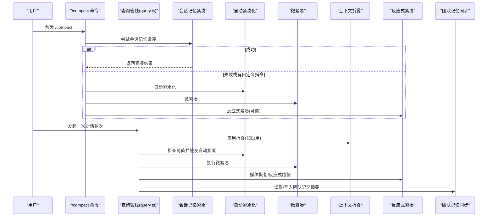
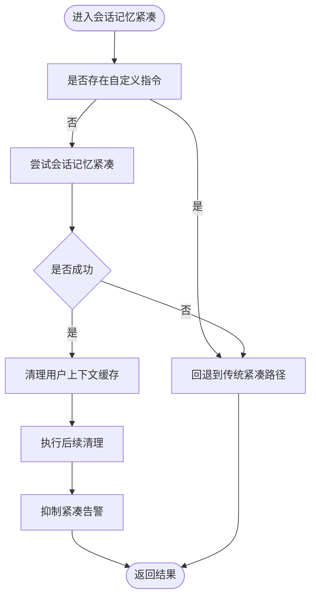
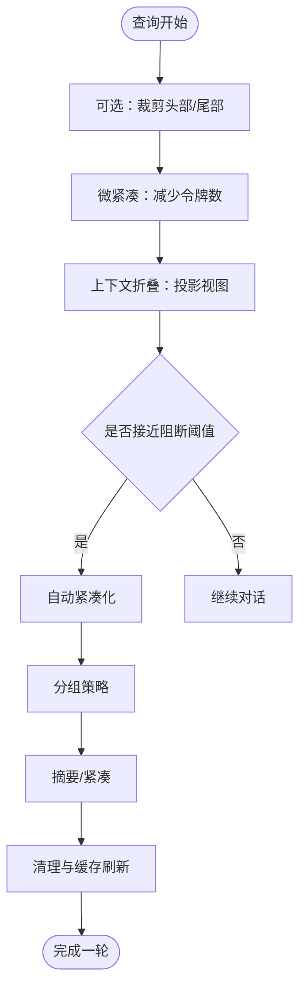
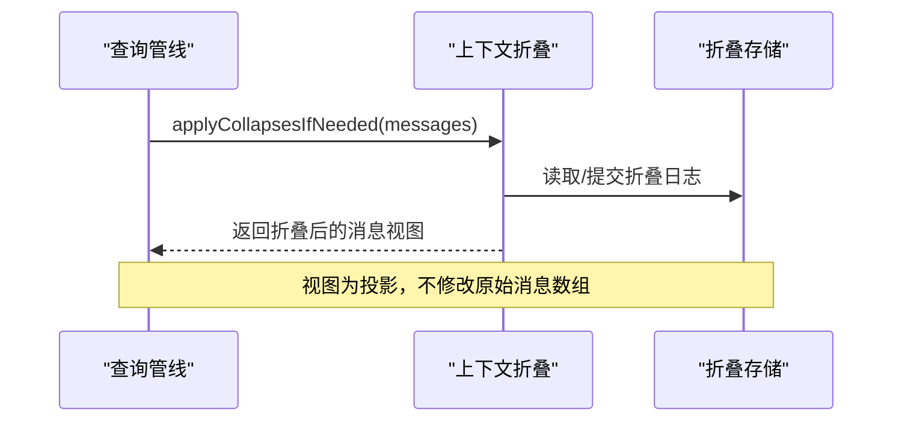
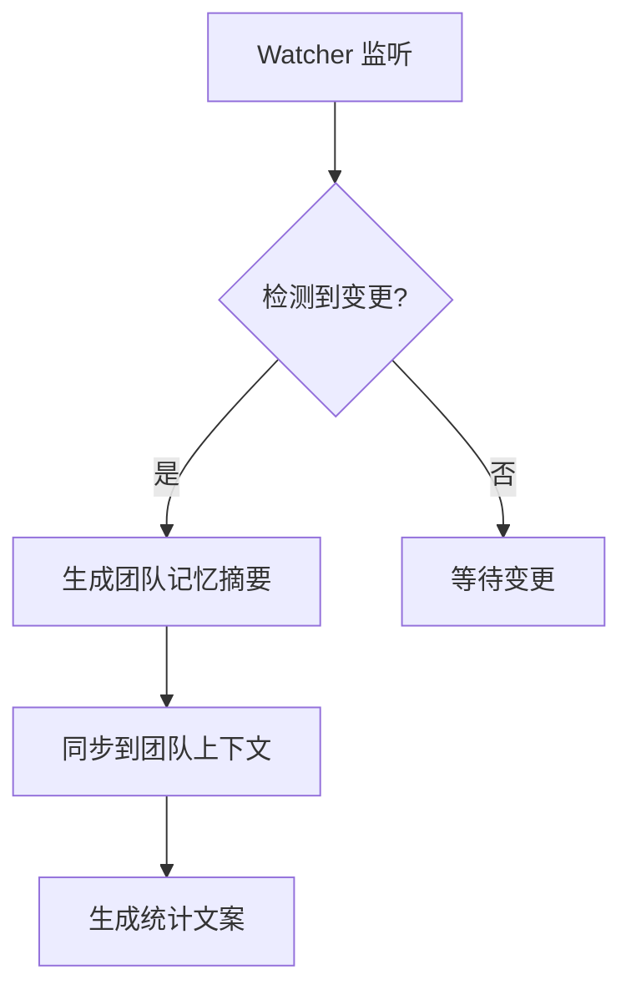
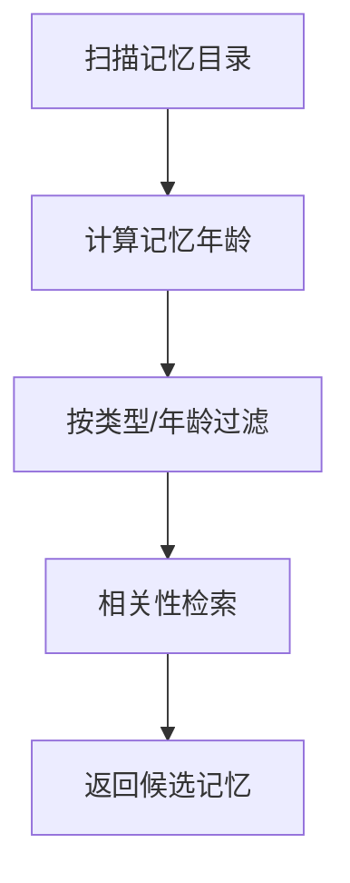
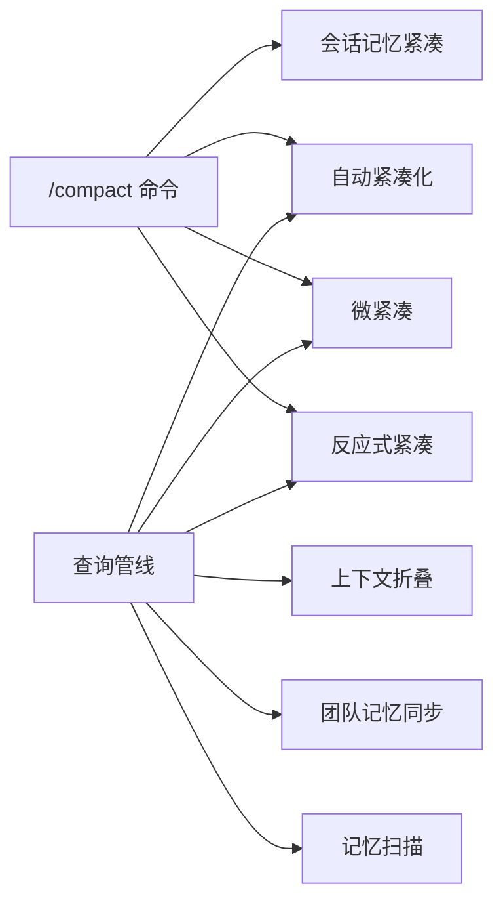

# 记忆服务

<cite>
**本文引用的文件**
- [src/services/SessionMemory/sessionMemory.ts](file://src/services/SessionMemory/sessionMemory.ts)
- [src/services/SessionMemory/sessionMemoryUtils.ts](file://src/services/SessionMemory/sessionMemoryUtils.ts)
- [src/services/SessionMemory/prompts.ts](file://src/services/SessionMemory/prompts.ts)
- [src/services/compact/autoCompact.ts](file://src/services/compact/autoCompact.ts)
- [src/services/compact/grouping.ts](file://src/services/compact/grouping.ts)
- [src/services/compact/microCompact.ts](file://src/services/compact/microCompact.ts)
- [src/services/compact/postCompactCleanup.ts](file://src/services/compact/postCompactCleanup.ts)
- [src/services/compact/reactiveCompact.ts](file://src/services/compact/reactiveCompact.ts)
- [src/services/compact/sessionMemoryCompact.ts](file://src/services/compact/sessionMemoryCompact.ts)
- [src/services/compact/snipping/snipCompact.ts](file://src/services/compact/snipping/snipCompact.ts)
- [src/services/compact/snipping/snipProjection.ts](file://src/services/compact/snipping/snipProjection.ts)
- [src/services/contextCollapse/index.ts](file://src/services/contextCollapse/index.ts)
- [src/services/contextCollapse/operations.ts](file://src/services/contextCollapse/operations.ts)
- [src/services/contextCollapse/persist.ts](file://src/services/contextCollapse/persist.ts)
- [src/services/teamMemorySync/index.ts](file://src/services/teamMemorySync/index.ts)
- [src/services/teamMemorySync/watcher.ts](file://src/services/teamMemorySync/watcher.ts)
- [src/services/teamMemorySync/types.ts](file://src/services/teamMemorySync/types.ts)
- [src/services/extractMemories/extractMemories.ts](file://src/services/extractMemories/extractMemories.ts)
- [src/services/extractMemories/prompts.ts](file://src/services/extractMemories/prompts.ts)
- [src/memdir/memoryScan.ts](file://src/memdir/memoryScan.ts)
- [src/memdir/memoryAge.ts](file://src/memdir/memoryAge.ts)
- [src/memdir/memoryTypes.ts](file://src/memdir/memoryTypes.ts)
- [src/memdir/teamMemPaths.ts](file://src/memdir/teamMemPaths.ts)
- [src/memdir/teamMemPrompts.ts](file://src/memdir/teamMemPrompts.ts)
- [src/memdir/findRelevantMemories.ts](file://src/memdir/findRelevantMemories.ts)
- [src/commands/compact/compact.ts](file://src/commands/compact/compact.ts)
- [src/query.ts](file://src/query.ts)
- [src/utils/teamMemoryOps.ts](file://src/utils/teamMemoryOps.ts)
- [src/cli/print.ts](file://src/cli/print.ts)
- [src/commands/context/context-noninteractive.ts](file://src/commands/context/context-noninteractive.ts)
</cite>

## 目录
1. [引言](#引言)
2. [项目结构](#项目结构)
3. [核心组件](#核心组件)
4. [架构总览](#架构总览)
5. [详细组件分析](#详细组件分析)
6. [依赖关系分析](#依赖关系分析)
7. [性能考量](#性能考量)
8. [故障排查指南](#故障排查指南)
9. [结论](#结论)
10. [附录](#附录)

## 引言
本文件系统性梳理记忆服务模块的设计与实现，覆盖会话记忆管理、紧凑化处理（含自动紧凑化、分组策略、清理流程）、上下文折叠、团队记忆同步与提取等能力。文档从架构、数据流、处理逻辑、集成点到性能优化与排错建议进行深入说明，并通过图示帮助读者快速把握各子系统的职责与交互。

## 项目结构
记忆服务相关代码主要分布在以下区域：
- 会话记忆：SessionMemory 服务与工具集
- 紧凑化：compact 子服务（自动紧凑化、微紧凑、分组、反应式紧凑、会话记忆紧凑、裁剪）
- 上下文折叠：contextCollapse 子服务（折叠应用、持久化）
- 团队记忆：teamMemorySync 子服务（同步、监控、类型）
- 记忆扫描与年龄：memdir 工具（扫描、年龄、类型、团队路径与提示）
- 命令入口：/compact 命令与查询管线中的触发点
- 提示词：SessionMemory 与 extractMemories 的提示词模块

```mermaid
graph TB
subgraph "会话记忆"
SM["sessionMemory.ts"]
SMU["sessionMemoryUtils.ts"]
SMP["prompts.ts"]
end
subgraph "紧凑化"
AC["autoCompact.ts"]
MG["grouping.ts"]
MC["microCompact.ts"]
PC["postCompactCleanup.ts"]
RC["reactiveCompact.ts"]
SMC["sessionMemoryCompact.ts"]
SC["snipCompact.ts"]
SP["snipProjection.ts"]
end
subgraph "上下文折叠"
CCIDX["index.ts"]
CCOPS["operations.ts"]
CCP["persist.ts"]
end
subgraph "团队记忆"
TMSI["index.ts"]
TMSW["watcher.ts"]
TMST["types.ts"]
end
subgraph "记忆目录"
MS["memoryScan.ts"]
MA["memoryAge.ts"]
MT["memoryTypes.ts"]
TMP["teamMemPaths.ts"]
TMPR["teamMemPrompts.ts"]
end
CMD["commands/compact/compact.ts"]
QRY["query.ts"]
CMD --> SMC
CMD --> AC
CMD --> MC
CMD --> SC
QRY --> CCIDX
QRY --> AC
QRY --> MC
QRY --> RC
QRY --> SMC
QRY --> SC
SM --> SMC
TMSI --> TMP
TMSI --> TMPR
MS --> MA
MS --> MT
```

图表来源
- [src/services/SessionMemory/sessionMemory.ts](file://src/services/SessionMemory/sessionMemory.ts)
- [src/services/SessionMemory/sessionMemoryUtils.ts](file://src/services/SessionMemory/sessionMemoryUtils.ts)
- [src/services/SessionMemory/prompts.ts](file://src/services/SessionMemory/prompts.ts)
- [src/services/compact/autoCompact.ts](file://src/services/compact/autoCompact.ts)
- [src/services/compact/grouping.ts](file://src/services/compact/grouping.ts)
- [src/services/compact/microCompact.ts](file://src/services/compact/microCompact.ts)
- [src/services/compact/postCompactCleanup.ts](file://src/services/compact/postCompactCleanup.ts)
- [src/services/compact/reactiveCompact.ts](file://src/services/compact/reactiveCompact.ts)
- [src/services/compact/sessionMemoryCompact.ts](file://src/services/compact/sessionMemoryCompact.ts)
- [src/services/compact/snipping/snipCompact.ts](file://src/services/compact/snipping/snipCompact.ts)
- [src/services/compact/snipping/snipProjection.ts](file://src/services/compact/snipping/snipProjection.ts)
- [src/services/contextCollapse/index.ts](file://src/services/contextCollapse/index.ts)
- [src/services/contextCollapse/operations.ts](file://src/services/contextCollapse/operations.ts)
- [src/services/contextCollapse/persist.ts](file://src/services/contextCollapse/persist.ts)
- [src/services/teamMemorySync/index.ts](file://src/services/teamMemorySync/index.ts)
- [src/services/teamMemorySync/watcher.ts](file://src/services/teamMemorySync/watcher.ts)
- [src/services/teamMemorySync/types.ts](file://src/services/teamMemorySync/types.ts)
- [src/memdir/memoryScan.ts](file://src/memdir/memoryScan.ts)
- [src/memdir/memoryAge.ts](file://src/memdir/memoryAge.ts)
- [src/memdir/memoryTypes.ts](file://src/memdir/memoryTypes.ts)
- [src/memdir/teamMemPaths.ts](file://src/memdir/teamMemPaths.ts)
- [src/memdir/teamMemPrompts.ts](file://src/memdir/teamMemPrompts.ts)
- [src/commands/compact/compact.ts](file://src/commands/compact/compact.ts)
- [src/query.ts](file://src/query.ts)

章节来源
- [src/commands/compact/compact.ts](file://src/commands/compact/compact.ts)
- [src/query.ts](file://src/query.ts)

## 核心组件
- 会话记忆服务：负责会话内记忆的组织、检索与持久化，支持与紧凑化路径协同工作。
- 紧凑化服务：提供自动紧凑化、微紧凑、分组策略、反应式紧凑、会话记忆紧凑与裁剪等能力，以降低上下文长度并维持信息密度。
- 上下文折叠：在查询阶段对历史进行投影式折叠，减少实际消息数量，同时保留摘要以跨轮次复用。
- 团队记忆同步：监控与同步团队范围内的记忆文件，保障多成员共享与一致性。
- 记忆扫描与年龄：提供扫描、年龄计算、类型识别与团队记忆路径/提示生成，支撑检索与筛选。
- 命令与查询集成：/compact 命令与查询管线在不同阶段触发紧凑化与折叠，确保上下文不越界。

章节来源
- [src/services/SessionMemory/sessionMemory.ts](file://src/services/SessionMemory/sessionMemory.ts)
- [src/services/compact/autoCompact.ts](file://src/services/compact/autoCompact.ts)
- [src/services/contextCollapse/index.ts](file://src/services/contextCollapse/index.ts)
- [src/services/teamMemorySync/index.ts](file://src/services/teamMemorySync/index.ts)
- [src/memdir/memoryScan.ts](file://src/memdir/memoryScan.ts)

## 架构总览
记忆服务围绕“会话记忆”“紧凑化”“上下文折叠”“团队记忆同步”四条主线构建，命令与查询管线在合适时机介入，形成闭环：

图表来源
- [src/commands/compact/compact.ts](file://src/commands/compact/compact.ts)
- [src/query.ts](file://src/query.ts)
- [src/services/compact/autoCompact.ts](file://src/services/compact/autoCompact.ts)
- [src/services/compact/microCompact.ts](file://src/services/compact/microCompact.ts)
- [src/services/contextCollapse/index.ts](file://src/services/contextCollapse/index.ts)
- [src/services/teamMemorySync/index.ts](file://src/services/teamMemorySync/index.ts)

## 详细组件分析

### 会话记忆管理
- 职责与边界
  - 组织与维护会话内的记忆片段，支持检索、更新与持久化。
  - 与紧凑化路径协作，优先尝试会话记忆紧凑，避免重复总结。
- 关键接口与流程
  - 会话记忆紧凑：在无自定义指令时优先走会话记忆路径，成功后刷新缓存与告警抑制。
  - 提示词与模板：通过 prompts.ts 提供统一的提示词与格式化策略。
- 数据结构与复杂度
  - 记忆片段通常按时间序列与主题分组；检索复杂度取决于索引策略与扫描范围。
- 错误处理
  - 当无消息可紧凑时抛出错误；成功后清除用户上下文缓存并执行后续清理。
- 性能要点
  - 会话记忆紧凑为“短路”路径，成本低且能避免重复摘要。

图表来源
- [src/commands/compact/compact.ts](file://src/commands/compact/compact.ts)
- [src/services/SessionMemory/sessionMemory.ts](file://src/services/SessionMemory/sessionMemory.ts)

章节来源
- [src/services/SessionMemory/sessionMemory.ts](file://src/services/SessionMemory/sessionMemory.ts)
- [src/services/SessionMemory/sessionMemoryUtils.ts](file://src/services/SessionMemory/sessionMemoryUtils.ts)
- [src/services/SessionMemory/prompts.ts](file://src/services/SessionMemory/prompts.ts)
- [src/commands/compact/compact.ts](file://src/commands/compact/compact.ts)

### 紧凑化服务
- 自动紧凑化
  - 基于阈值与模型预算动态触发，避免达到阻断阈值。
  - 与上下文折叠互斥保护：当折叠接管时，避免合成性抢先中断恢复路径。
- 分组策略
  - 对消息进行分组以提升摘要质量与稳定性，减少长尾噪声。
- 微紧凑
  - 在正式摘要前做轻量裁剪，显著降低输入规模。
- 反应式紧凑
  - 针对媒体与大输出场景的恢复路径，结合“媒体恢复开关”控制。
- 会话记忆紧凑
  - 与会话记忆协同，优先使用已有摘要，避免重复生成。
- 清理流程
  - 紧凑后清理缓存与临时状态，重置最近摘要标识，抑制告警。

图表来源
- [src/query.ts](file://src/query.ts)
- [src/services/compact/autoCompact.ts](file://src/services/compact/autoCompact.ts)
- [src/services/compact/grouping.ts](file://src/services/compact/grouping.ts)
- [src/services/compact/microCompact.ts](file://src/services/compact/microCompact.ts)
- [src/services/compact/snipping/snipCompact.ts](file://src/services/compact/snipping/snipCompact.ts)
- [src/services/compact/snipping/snipProjection.ts](file://src/services/compact/snipping/snipProjection.ts)
- [src/services/contextCollapse/index.ts](file://src/services/contextCollapse/index.ts)

章节来源
- [src/services/compact/autoCompact.ts](file://src/services/compact/autoCompact.ts)
- [src/services/compact/grouping.ts](file://src/services/compact/grouping.ts)
- [src/services/compact/microCompact.ts](file://src/services/compact/microCompact.ts)
- [src/services/compact/postCompactCleanup.ts](file://src/services/compact/postCompactCleanup.ts)
- [src/services/compact/reactiveCompact.ts](file://src/services/compact/reactiveCompact.ts)
- [src/services/compact/sessionMemoryCompact.ts](file://src/services/compact/sessionMemoryCompact.ts)
- [src/services/compact/snipping/snipCompact.ts](file://src/services/compact/snipping/snipCompact.ts)
- [src/services/compact/snipping/snipProjection.ts](file://src/services/compact/snipping/snipProjection.ts)
- [src/query.ts](file://src/query.ts)

### 上下文折叠
- 功能概述
  - 在查询阶段对历史进行投影式折叠，不改变 REPL 历史数组，而是通过折叠存储中的摘要消息实现跨轮次复用。
  - 折叠应用在自动紧凑之前，若折叠已使上下文低于阈值，则跳过完整摘要。
- 统计与健康状态
  - 查询上下文命令可显示折叠启用状态与统计信息，便于诊断当前策略。

图表来源
- [src/query.ts](file://src/query.ts)
- [src/services/contextCollapse/index.ts](file://src/services/contextCollapse/index.ts)
- [src/services/contextCollapse/operations.ts](file://src/services/contextCollapse/operations.ts)
- [src/services/contextCollapse/persist.ts](file://src/services/contextCollapse/persist.ts)
- [src/commands/context/context-noninteractive.ts](file://src/commands/context/context-noninteractive.ts)

章节来源
- [src/services/contextCollapse/index.ts](file://src/services/contextCollapse/index.ts)
- [src/services/contextCollapse/operations.ts](file://src/services/contextCollapse/operations.ts)
- [src/services/contextCollapse/persist.ts](file://src/services/contextCollapse/persist.ts)
- [src/commands/context/context-noninteractive.ts](file://src/commands/context/context-noninteractive.ts)

### 团队记忆同步
- 职责与边界
  - 监控团队记忆文件变化，生成摘要并同步至团队上下文，支持读/写/搜索统计文案拼接。
- 关键流程
  - Watcher 监听文件变更，触发同步与摘要生成。
  - 类型与路径由 teamMemPaths 与 teamMemPrompts 提供。
- 文案与交互
  - appendTeamMemorySummaryParts 用于生成“召回/搜索/写入”团队记忆的自然语言描述。

图表来源
- [src/services/teamMemorySync/index.ts](file://src/services/teamMemorySync/index.ts)
- [src/services/teamMemorySync/watcher.ts](file://src/services/teamMemorySync/watcher.ts)
- [src/services/teamMemorySync/types.ts](file://src/services/teamMemorySync/types.ts)
- [src/memdir/teamMemPaths.ts](file://src/memdir/teamMemPaths.ts)
- [src/memdir/teamMemPrompts.ts](file://src/memdir/teamMemPrompts.ts)
- [src/utils/teamMemoryOps.ts](file://src/utils/teamMemoryOps.ts)

章节来源
- [src/services/teamMemorySync/index.ts](file://src/services/teamMemorySync/index.ts)
- [src/services/teamMemorySync/watcher.ts](file://src/services/teamMemorySync/watcher.ts)
- [src/services/teamMemorySync/types.ts](file://src/services/teamMemorySync/types.ts)
- [src/memdir/teamMemPaths.ts](file://src/memdir/teamMemPaths.ts)
- [src/memdir/teamMemPrompts.ts](file://src/memdir/teamMemPrompts.ts)
- [src/utils/teamMemoryOps.ts](file://src/utils/teamMemoryOps.ts)

### 记忆扫描与检索
- 扫描与年龄
  - memoryScan 提供扫描能力；memoryAge 提供年龄计算，辅助筛选近期或陈旧记忆。
- 类型与路径
  - memoryTypes 定义记忆类型；teamMemPaths/teamMemPrompts 提供团队记忆路径与提示。
- 相关工具
  - findRelevantMemories 提供基于上下文的相关性检索。

图表来源
- [src/memdir/memoryScan.ts](file://src/memdir/memoryScan.ts)
- [src/memdir/memoryAge.ts](file://src/memdir/memoryAge.ts)
- [src/memdir/memoryTypes.ts](file://src/memdir/memoryTypes.ts)
- [src/memdir/teamMemPaths.ts](file://src/memdir/teamMemPaths.ts)
- [src/memdir/teamMemPrompts.ts](file://src/memdir/teamMemPrompts.ts)
- [src/memdir/findRelevantMemories.ts](file://src/memdir/findRelevantMemories.ts)

章节来源
- [src/memdir/memoryScan.ts](file://src/memdir/memoryScan.ts)
- [src/memdir/memoryAge.ts](file://src/memdir/memoryAge.ts)
- [src/memdir/memoryTypes.ts](file://src/memdir/memoryTypes.ts)
- [src/memdir/teamMemPaths.ts](file://src/memdir/teamMemPaths.ts)
- [src/memdir/teamMemPrompts.ts](file://src/memdir/teamMemPrompts.ts)
- [src/memdir/findRelevantMemories.ts](file://src/memdir/findRelevantMemories.ts)

### 提取记忆
- 功能概述
  - extractMemories 支持在非交互模式下提取记忆，CLI 在退出前可排空待提取任务，保证进程优雅退出。
- 集成点
  - CLI 打印模块在关闭前检查并排空提取队列，避免丢失中间结果。

章节来源
- [src/services/extractMemories/extractMemories.ts](file://src/services/extractMemories/extractMemories.ts)
- [src/services/extractMemories/prompts.ts](file://src/services/extractMemories/prompts.ts)
- [src/cli/print.ts](file://src/cli/print.ts)

## 依赖关系分析
- 命令与查询管线
  - /compact 命令优先尝试会话记忆紧凑，失败或存在自定义指令则走自动/微紧凑与反应式路径。
  - 查询管线在多个阶段插入裁剪、微紧凑、上下文折叠与自动紧凑，形成“多层保护”。
- 组件耦合
  - 紧凑化子服务之间通过消息数组与令牌预算传递耦合；上下文折叠与自动紧凑存在互斥保护。
  - 团队记忆同步与记忆扫描相互独立但共同服务于检索与共享。

图表来源
- [src/commands/compact/compact.ts](file://src/commands/compact/compact.ts)
- [src/query.ts](file://src/query.ts)
- [src/services/compact/autoCompact.ts](file://src/services/compact/autoCompact.ts)
- [src/services/compact/microCompact.ts](file://src/services/compact/microCompact.ts)
- [src/services/contextCollapse/index.ts](file://src/services/contextCollapse/index.ts)
- [src/services/teamMemorySync/index.ts](file://src/services/teamMemorySync/index.ts)
- [src/memdir/memoryScan.ts](file://src/memdir/memoryScan.ts)

章节来源
- [src/commands/compact/compact.ts](file://src/commands/compact/compact.ts)
- [src/query.ts](file://src/query.ts)

## 性能考量
- 内存优化
  - 使用投影式折叠减少消息数组大小，避免复制与深拷贝。
  - 微紧凑在摘要前大幅降低令牌数，显著减少大模型调用成本。
- 数据压缩与持久化
  - 会话记忆紧凑优先复用既有摘要，减少重复计算与 IO。
  - 团队记忆同步采用增量方式，仅在变更时触发摘要与同步。
- 缓存与告警抑制
  - 紧凑成功后清理用户上下文缓存并抑制告警，避免频繁提示。
- 阈值与分组
  - 自动紧凑化与分组策略根据预算与内容特征动态调整，平衡质量与性能。

## 故障排查指南
- 紧凑失败或未生效
  - 检查是否存在自定义指令导致回退到传统路径。
  - 确认自动紧凑化开关与阈值配置是否合理。
- 折叠未生效
  - 确认上下文折叠功能开关与启用状态。
  - 检查是否与自动紧凑路径发生互斥保护。
- 团队记忆不同步
  - 检查 watcher 是否正常监听，路径与提示配置是否正确。
  - 查看统计文案是否包含“读/写/搜索”记录。
- 退出前丢失中间结果
  - 确认 CLI 在退出前是否调用排空提取队列逻辑。

章节来源
- [src/commands/compact/compact.ts](file://src/commands/compact/compact.ts)
- [src/query.ts](file://src/query.ts)
- [src/cli/print.ts](file://src/cli/print.ts)

## 结论
记忆服务通过“会话记忆+紧凑化+上下文折叠+团队同步”的组合拳，在保证上下文有效性的同时，最大化地控制成本与延迟。其模块化设计使得各子系统职责清晰、耦合可控，并在查询与命令两条路径上形成互补的触发机制。配合内存优化、分组与阈值策略，整体具备良好的扩展性与鲁棒性。

## 附录
- 代码示例路径（不含具体代码内容）
  - 会话记忆紧凑入口：[src/commands/compact/compact.ts](file://src/commands/compact/compact.ts)
  - 自动紧凑化触发与阈值判断：[src/query.ts](file://src/query.ts)
  - 上下文折叠应用与统计：[src/services/contextCollapse/index.ts](file://src/services/contextCollapse/index.ts)
  - 团队记忆同步与文案拼接：[src/services/teamMemorySync/index.ts](file://src/services/teamMemorySync/index.ts)、[src/utils/teamMemoryOps.ts](file://src/utils/teamMemoryOps.ts)
  - 记忆扫描与相关性检索：[src/memdir/memoryScan.ts](file://src/memdir/memoryScan.ts)、[src/memdir/findRelevantMemories.ts](file://src/memdir/findRelevantMemories.ts)
  - 提取记忆与优雅退出：[src/services/extractMemories/extractMemories.ts](file://src/services/extractMemories/extractMemories.ts)、[src/cli/print.ts](file://src/cli/print.ts)