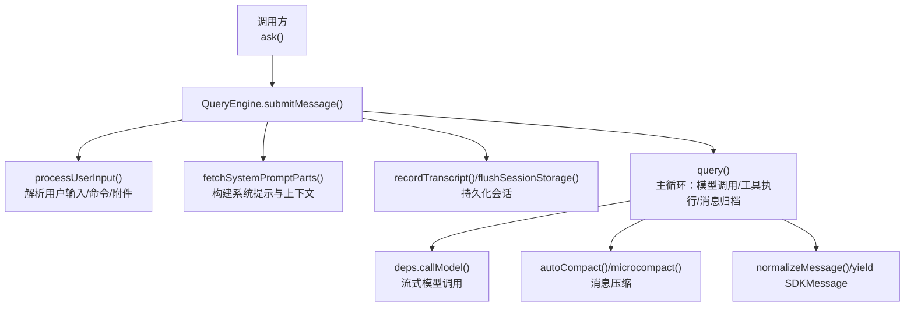
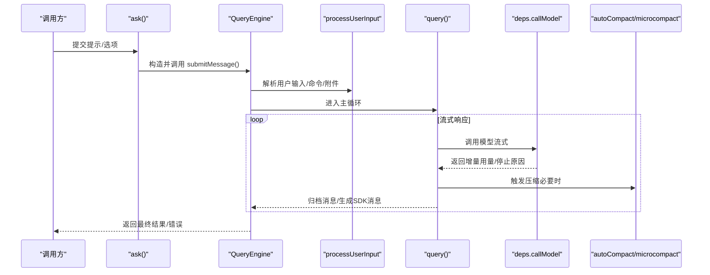
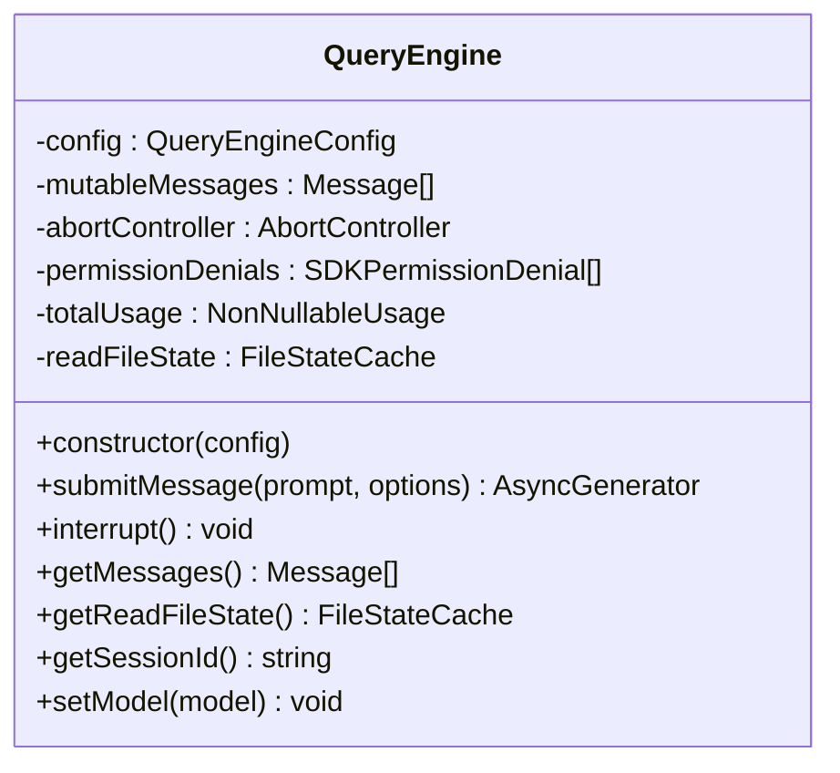
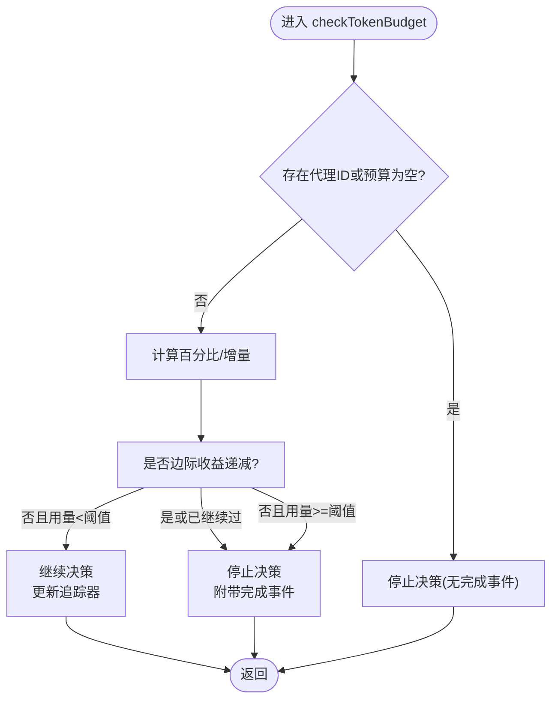
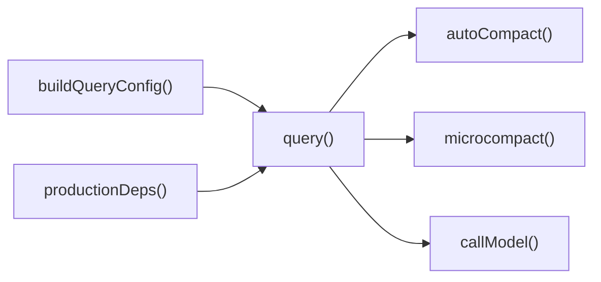

# 查询引擎

<cite>
**本文引用的文件**
- [QueryEngine.ts](file://src/QueryEngine.ts)
- [config.ts](file://src/query/config.ts)
- [deps.ts](file://src/query/deps.ts)
- [tokenBudget.ts](file://src/query/tokenBudget.ts)
- [processUserInput.ts](file://src/utils/processUserInput/processUserInput.ts)
- [messages.ts](file://src/utils/messages.ts)
- [sessionStorage.ts](file://src/utils/sessionStorage.ts)
- [model.ts](file://src/utils/model/model.ts)
- [fastMode.ts](file://src/utils/fastMode.ts)
- [systemPromptType.ts](file://src/utils/systemPromptType.ts)
- [queryContext.ts](file://src/utils/queryContext.ts)
- [systemInit.ts](file://src/utils/messages/systemInit.ts)
- [messages/mappers.ts](file://src/utils/messages/mappers.ts)
- [abortController.ts](file://src/utils/abortController.ts)
- [queryHelpers.ts](file://src/utils/queryHelpers.ts)
- [tokenBudget.ts（工具）](file://src/utils/tokenBudget.ts)
- [tokens.ts](file://src/utils/tokens.ts)
- [betaSessionTracing.ts](file://src/utils/telemetry/betaSessionTracing.ts)
- [teammateMailbox.ts](file://src/utils/telemetry/sessionTracing.ts)
- [telemetry/sessionTracing.ts](file://src/utils/telemetry/sessionTracing.ts)
- [warningHandler.ts](file://src/utils/warningHandler.ts)
- [ask.ts](file://src/ask.ts)
- [Tool.ts](file://src/Tool.ts)
- [commands.ts](file://src/commands.ts)
- [bootstrap/state.ts](file://src/bootstrap/state.ts)
- [services/api/claude.ts](file://src/services/api/claude.ts)
- [services/api/errors.ts](file://src/services/api/errors.ts)
- [services/compact/snipCompact.ts](file://src/services/compact/snipCompact.ts)
- [services/compact/snipProjection.ts](file://src/services/compact/snipProjection.ts)
- [services/compact/autoCompact.ts](file://src/services/compact/autoCompact.ts)
- [services/compact/microCompact.ts](file://src/services/compact/microCompact.ts)
- [utils/teammateMailbox.ts](file://src/utils/telemetry/betaSessionTracing.ts)
</cite>

## 目录
1. [简介](#简介)
2. [项目结构](#项目结构)
3. [核心组件](#核心组件)
4. [架构总览](#架构总览)
5. [详细组件分析](#详细组件分析)
6. [依赖分析](#依赖分析)
7. [性能考量](#性能考量)
8. [故障排查指南](#故障排查指南)
9. [结论](#结论)
10. [附录](#附录)

## 简介
本文件为查询引擎（QueryEngine）的深度技术文档，聚焦其在无头/SDK场景下的会话生命周期管理、上下文处理机制、令牌预算控制与查询依赖关系管理。文档解释查询引擎如何协调工具调用、处理用户输入、管理对话历史与状态转换，并给出初始化、会话创建与查询执行的具体流程图与参考路径。同时覆盖与工具系统、权限系统、消息系统及压缩/追踪等子系统的交互关系，以及性能优化策略、错误处理机制与调试技巧。

## 项目结构
查询引擎位于 src/QueryEngine.ts，围绕 ask() 包装器与 QueryEngine.submitMessage() 协同工作，通过 processUserInput 将用户输入解析为消息并注入系统提示与上下文；随后进入 query() 主循环，驱动模型调用、工具执行、消息记录与状态更新。关键配置与运行时门控由 src/query/ 下的模块提供，依赖注入通过 deps.ts 管理，预算控制由 tokenBudget.ts 提供。

图表来源
- [QueryEngine.ts:209-1296](file://src/QueryEngine.ts#L209-L1296)
- [config.ts:15-46](file://src/query/config.ts#L15-L46)
- [deps.ts:21-40](file://src/query/deps.ts#L21-L40)

章节来源
- [QueryEngine.ts:130-173](file://src/QueryEngine.ts#L130-L173)
- [config.ts:15-46](file://src/query/config.ts#L15-L46)
- [deps.ts:21-40](file://src/query/deps.ts#L21-L40)

## 核心组件
- QueryEngine：封装单次对话的完整生命周期，负责消息累积、权限跟踪、使用统计、预算检查、结果聚合与中断控制。
- ask()：面向 SDK 的一次性查询包装器，内部构造 QueryEngine 并委托提交消息。
- query()：主循环，驱动模型调用、工具执行、消息归档与压缩，产出 SDK 消息流。
- 配置与门控：buildQueryConfig() 提供运行时门控（如流式工具执行、摘要输出、快速模式等）。
- 依赖注入：productionDeps() 提供模型调用、微压缩与自动压缩的生产实现。
- 预算控制：checkTokenBudget() 基于全局令牌用量与阈值决定继续或停止。

章节来源
- [QueryEngine.ts:184-207](file://src/QueryEngine.ts#L184-L207)
- [QueryEngine.ts:1186-1296](file://src/QueryEngine.ts#L1186-L1296)
- [config.ts:29-46](file://src/query/config.ts#L29-L46)
- [deps.ts:33-40](file://src/query/deps.ts#L33-L40)
- [tokenBudget.ts:45-93](file://src/query/tokenBudget.ts#L45-L93)

## 架构总览
查询引擎以“无头/SDK”模式为核心，通过 QueryEngine.submitMessage() 统一入口，结合 processUserInput 与系统提示构建，进入 query() 循环。循环内按事件类型分派处理，维护当前消息用量、累计总用量、权限拒绝列表与结构化输出状态，并在必要时触发压缩与持久化。

图表来源
- [QueryEngine.ts:209-1296](file://src/QueryEngine.ts#L209-L1296)
- [deps.ts:33-40](file://src/query/deps.ts#L33-L40)
- [services/compact/autoCompact.ts](file://src/services/compact/autoCompact.ts)
- [services/compact/microCompact.ts](file://src/services/compact/microCompact.ts)

## 详细组件分析

### QueryEngine 类与生命周期
- 初始化与状态
  - 保存配置、可变消息数组、中止控制器、权限拒绝列表与只读文件缓存。
  - 支持设置/获取会话ID、模型切换与消息快照。
- submitMessage() 主流程
  - 包装 canUseTool 以收集权限拒绝信息。
  - 构建系统提示与用户上下文，注册结构化输出约束钩子。
  - 解析用户输入，写入转录并根据需要触发压缩边界重放。
  - 启动 query() 循环，逐条归档消息并产出 SDK 消息。
  - 结束时汇总用量、成本与停止原因，返回结果或错误。
- 中断与状态查询
  - interrupt() 通过 AbortController 触发中止。
  - 提供 getMessages()/getReadFileState()/getSessionId()/setModel() 辅助接口。

图表来源
- [QueryEngine.ts:184-207](file://src/QueryEngine.ts#L184-L207)
- [QueryEngine.ts:209-1296](file://src/QueryEngine.ts#L209-L1296)

章节来源
- [QueryEngine.ts:184-207](file://src/QueryEngine.ts#L184-L207)
- [QueryEngine.ts:209-1296](file://src/QueryEngine.ts#L209-L1296)

### 会话生命周期与消息持久化
- 用户消息写入转录：在进入 query() 前先持久化，避免请求未完成时进程被杀导致无法恢复。
- 会话快照：在开启文件历史时对可选用户消息进行快照。
- 压缩边界：在压缩边界前优先落盘至尾部水印，确保重启后仍可正确修剪历史。
- 最终刷新：在返回结果前强制刷新缓冲，保证桌面端在收到结果后不会丢失未刷写内容。

章节来源
- [QueryEngine.ts:436-463](file://src/QueryEngine.ts#L436-L463)
- [QueryEngine.ts:641-655](file://src/QueryEngine.ts#L641-L655)
- [QueryEngine.ts:701-732](file://src/QueryEngine.ts#L701-L732)
- [QueryEngine.ts:1070-1080](file://src/QueryEngine.ts#L1070-L1080)

### 上下文处理机制
- 系统提示与用户上下文
  - fetchSystemPromptParts() 动态拼接默认系统提示、自定义提示、内存机制提示与附加片段。
  - 用户上下文合并协调者环境变量与草稿目录等。
- 模型选择与思考配置
  - 支持用户指定模型与思考模式，若未指定则从全局状态与配置推断。
- 插件与技能加载
  - 头无阻塞地加载插件缓存与技能，避免网络阻塞启动。

章节来源
- [QueryEngine.ts:286-325](file://src/QueryEngine.ts#L286-L325)
- [QueryEngine.ts:302-308](file://src/QueryEngine.ts#L302-L308)
- [QueryEngine.ts:488-527](file://src/QueryEngine.ts#L488-L527)
- [QueryEngine.ts:529-538](file://src/QueryEngine.ts#L529-L538)
- [queryContext.ts](file://src/utils/queryContext.ts)
- [systemPromptType.ts](file://src/utils/systemPromptType.ts)
- [model.ts](file://src/utils/model/model.ts)

### 令牌预算控制与查询依赖关系
- 预算决策
  - checkTokenBudget() 基于全局令牌用量与预算阈值判断是否继续或停止，考虑边际收益递减。
  - 通过 createBudgetTracker() 记录连续次数、上次增量与起始时间。
- 依赖关系
  - deps.ts 定义模型调用、微压缩与自动压缩的依赖契约，便于测试替换。
  - tokenBudget.ts 与 utils/tokenBudget.ts 分别提供运行期预算判定与文本预算解析能力。

图表来源
- [tokenBudget.ts:45-93](file://src/query/tokenBudget.ts#L45-L93)
- [tokenBudget.ts（工具）:21-29](file://src/utils/tokenBudget.ts#L21-L29)

章节来源
- [tokenBudget.ts:6-20](file://src/query/tokenBudget.ts#L6-L20)
- [tokenBudget.ts:45-93](file://src/query/tokenBudget.ts#L45-L93)
- [tokenBudget.ts（工具）:21-29](file://src/utils/tokenBudget.ts#L21-L29)
- [deps.ts:21-40](file://src/query/deps.ts#L21-L40)

### 查询执行机制与消息归档
- 事件分派
  - assistant/user/progress/attachment/system/tool_use_summary 等类型分别处理，维护当前消息用量与累计用量。
  - 在 message_delta 时捕获真实 stop_reason，在 message_stop 时合并当前用量到总用量。
- 结果提取与诊断
  - 依据最后一条 assistant 或 user 消息提取文本结果，失败时返回错误诊断（包含结果类型、最后内容类型与停止原因）。
- 预算与重试限制
  - USD 预算超限、结构化输出重试上限均作为终止条件，返回对应错误结果。

章节来源
- [QueryEngine.ts:757-1048](file://src/QueryEngine.ts#L757-L1048)
- [QueryEngine.ts:1058-1155](file://src/QueryEngine.ts#L1058-L1155)

### 与工具系统、权限系统和消息系统的交互
- 工具系统
  - submitMessage() 包装 canUseTool 以收集权限拒绝；工具名称兼容映射与系统初始化消息由 systemInit 工具函数提供。
  - 结构化输出工具触发结构化输出状态记录，用于结果收敛与重试控制。
- 权限系统
  - 权限拒绝列表在提交阶段收集，最终随结果返回；查询期间对孤儿权限进行一次性处理。
- 消息系统
  - normalizeMessage() 对消息进行标准化与扩展；本地命令输出转换为助手消息以便移动端/会话入口解析。
  - 会话转录与压缩边界消息通过 recordTranscript 与 toSDKCompactMetadata 输出。

章节来源
- [QueryEngine.ts:244-271](file://src/QueryEngine.ts#L244-L271)
- [QueryEngine.ts:540-551](file://src/QueryEngine.ts#L540-L551)
- [QueryEngine.ts:838-840](file://src/QueryEngine.ts#L838-L840)
- [systemInit.ts](file://src/utils/messages/systemInit.ts)
- [messages/mappers.ts](file://src/utils/messages/mappers.ts)
- [queryHelpers.ts](file://src/utils/queryHelpers.ts)

### 会话创建流程与 ask() 包装器
- ask() 构造 QueryEngine，克隆只读文件缓存，注入 snipReplay（当启用 HISTORY_SNIP 时），然后委托 submitMessage。
- 生命周期结束时回写只读文件缓存，确保外部状态一致。

章节来源
- [QueryEngine.ts:1186-1296](file://src/QueryEngine.ts#L1186-L1296)

## 依赖分析
- 配置与门控
  - buildQueryConfig() 读取会话ID与运行时门控（流式工具执行、摘要输出、快速模式等），避免 feature() 树摇边界外移。
- 依赖注入
  - productionDeps() 提供 callModel、microcompact、autocompact 与 UUID 生成器，便于测试替换。
- 压缩与归档
  - autoCompact 与 microcompact 在 query() 内部按需触发，配合压缩边界消息修剪历史。

图表来源
- [config.ts:29-46](file://src/query/config.ts#L29-L46)
- [deps.ts:33-40](file://src/query/deps.ts#L33-L40)
- [services/compact/autoCompact.ts](file://src/services/compact/autoCompact.ts)
- [services/compact/microCompact.ts](file://src/services/compact/microCompact.ts)

章节来源
- [config.ts:29-46](file://src/query/config.ts#L29-L46)
- [deps.ts:33-40](file://src/query/deps.ts#L33-L40)

## 性能考量
- 写入策略
  - 会话转录采用“先写后消费”的异步策略，助手消息采用 fire-and-forget 以避免阻塞流式生成；必要时在压缩边界前落盘。
- 压缩与内存
  - 压缩边界后清空历史前缀，释放内存；在长会话中通过 HISTORY_SNIP 与投影边界减少历史长度。
- 快速模式
  - 通过 fastMode 门控与全局配置开关影响模型选择与行为，降低延迟。
- 资源回收
  - 使用 AbortController 中止长时间任务；在关键节点刷新存储，避免重启丢失数据。

章节来源
- [QueryEngine.ts:717-732](file://src/QueryEngine.ts#L717-L732)
- [QueryEngine.ts:905-915](file://src/QueryEngine.ts#L905-L915)
- [fastMode.ts](file://src/utils/fastMode.ts)

## 故障排查指南
- 错误诊断
  - isResultSuccessful() 判定失败时，返回包含结果类型、最后内容类型与停止原因的诊断信息，并附带自水印以来的内存错误日志。
- API 错误与重试
  - categorizeRetryableAPIError() 对可重试错误进行分类；系统消息 subtype 为 api_retry 时携带尝试次数、最大重试与延迟。
- 结构化输出重试
  - 当结构化输出工具调用达到重试上限时，返回错误结果并终止。
- 警告与遥测
  - initializeWarningHandler() 统一处理 Node 警告，避免污染标准输出；遥测 span 通过 sessionTracing 与 betaSessionTracing 提供钩子执行统计。

章节来源
- [QueryEngine.ts:1082-1118](file://src/QueryEngine.ts#L1082-L1118)
- [services/api/errors.ts](file://src/services/api/errors.ts)
- [telemetry/sessionTracing.ts:878-927](file://src/utils/telemetry/sessionTracing.ts#L878-L927)
- [betaSessionTracing.ts:338-375](file://src/utils/telemetry/betaSessionTracing.ts#L338-L375)
- [warningHandler.ts:60-121](file://src/utils/warningHandler.ts#L60-L121)

## 结论
查询引擎通过清晰的生命周期划分、严格的上下文与预算控制、稳健的消息归档与压缩策略，实现了在无头/SDK场景下的高可靠与高性能查询。其模块化设计与依赖注入便于测试与演进，配合权限与工具系统的协作，满足复杂任务编排与长期会话管理需求。

## 附录
- 代码示例参考路径
  - 初始化与会话创建：[ask():1186-1296](file://src/QueryEngine.ts#L1186-L1296)
  - 提交消息与主循环：[submitMessage():209-1296](file://src/QueryEngine.ts#L209-L1296)
  - 系统提示与上下文构建：[fetchSystemPromptParts()](file://src/utils/queryContext.ts)
  - 模型调用与依赖注入：[productionDeps():33-40](file://src/query/deps.ts#L33-L40)
  - 令牌预算决策：[checkTokenBudget():45-93](file://src/query/tokenBudget.ts#L45-L93)
  - 用户输入解析：[processUserInput()](file://src/utils/processUserInput/processUserInput.ts)
  - 会话转录与刷新：[recordTranscript()](file://src/utils/sessionStorage.ts)
  - 系统初始化消息：[buildSystemInitMessage()](file://src/utils/messages/systemInit.ts)
  - 权限拒绝处理：[handleOrphanedPermission()](file://src/utils/queryHelpers.ts)
  - 文本预算解析：[parseTokenBudget():21-29](file://src/utils/tokenBudget.ts#L21-L29)
  - 用量统计与最终窗口：[accumulateUsage/updateUsage](file://src/services/api/claude.ts)，[finalContextTokensFromLastResponse():79-100](file://src/utils/tokens.ts#L79-L100)
  - 历史压缩与边界：[snipCompact/snipProjection](file://src/services/compact/snipCompact.ts)，[snipProjection](file://src/services/compact/snipProjection.ts)
  - 会话追踪与诊断：[betaSessionTracing:338-375](file://src/utils/telemetry/betaSessionTracing.ts#L338-L375)，[sessionTracing:878-927](file://src/utils/telemetry/sessionTracing.ts#L878-L927)
  - 警告处理：[initializeWarningHandler():60-121](file://src/utils/warningHandler.ts#L60-L121)