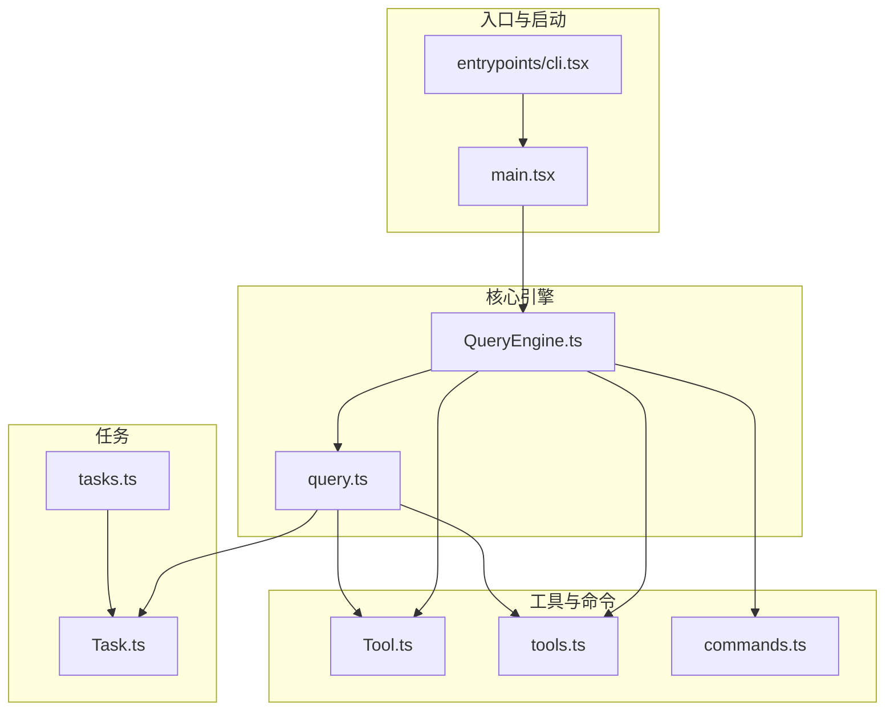
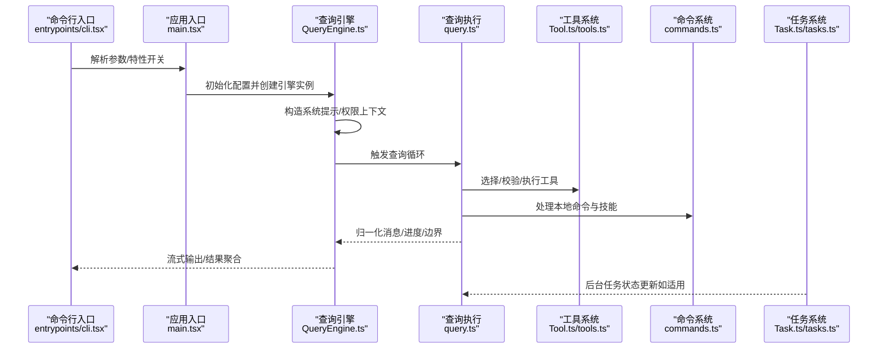
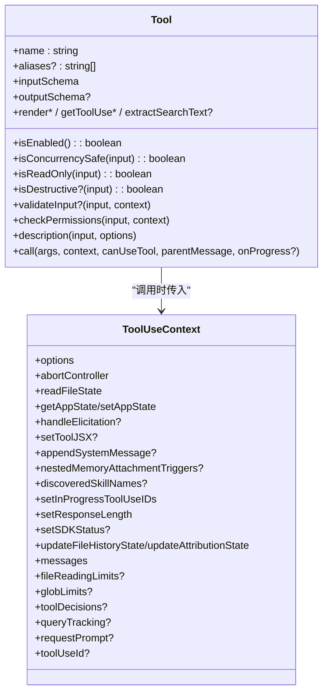
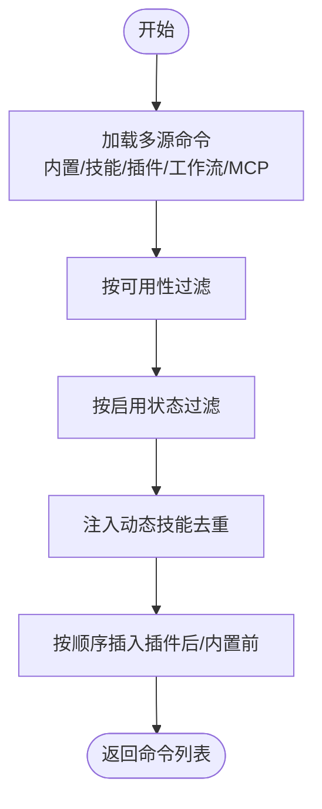
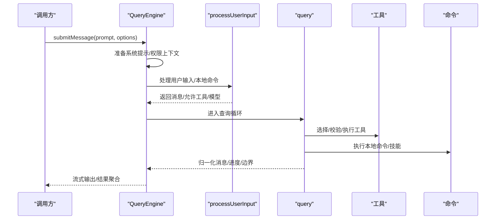
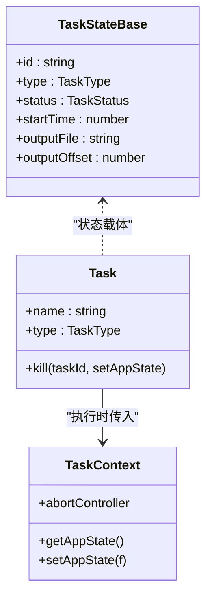
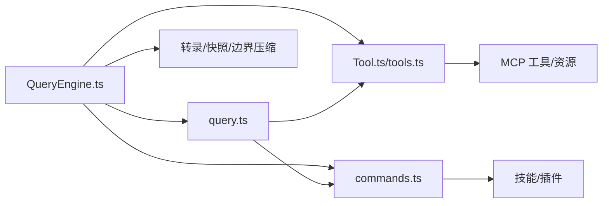

# 核心模块

<cite>
**本文引用的文件**
- [QueryEngine.ts](file://src/QueryEngine.ts)
- [Tool.ts](file://src/Tool.ts)
- [tools.ts](file://src/tools.ts)
- [commands.ts](file://src/commands.ts)
- [query.ts](file://src/query.ts)
- [Task.ts](file://src/Task.ts)
- [tasks.ts](file://src/tasks.ts)
- [main.tsx](file://src/main.tsx)
- [entrypoints/cli.tsx](file://src/entrypoints/cli.tsx)
</cite>

## 目录
1. [简介](#简介)
2. [项目结构](#项目结构)
3. [核心组件](#核心组件)
4. [架构总览](#架构总览)
5. [详细组件分析](#详细组件分析)
6. [依赖关系分析](#依赖关系分析)
7. [性能考量](#性能考量)
8. [故障排查指南](#故障排查指南)
9. [结论](#结论)

## 简介
本文件面向 Claude Code 的核心模块，系统性梳理以下能力域：工具系统（Tools）、命令系统（Commands）、查询引擎（QueryEngine）、任务系统（Tasks），以及组件与服务层的架构设计。文档以“可读性优先”的方式呈现，既覆盖代码级细节，也提供高层流程图与交互序列，帮助读者快速理解各模块的职责、实现原理与使用方法，并掌握模块间依赖与交互模式。

## 项目结构
围绕核心模块的关键目录与文件如下：
- 工具系统：src/Tool.ts 定义工具抽象与上下文；src/tools.ts 汇总内置工具与装配逻辑。
- 命令系统：src/commands.ts 聚合所有命令，按可用性与启用状态动态筛选。
- 查询引擎：src/QueryEngine.ts 将 ask() 的核心逻辑抽取为可复用类，统一管理对话生命周期与会话状态。
- 任务系统：src/Task.ts 定义任务抽象；src/tasks.ts 提供任务集合与按类型检索。
- 查询执行：src/query.ts 实现主循环、工具调用编排、消息规范化与流式输出。
- 入口与启动：src/main.tsx 与 src/entrypoints/cli.tsx 分别承载交互式 CLI 启动与命令入口。

图表来源
- [entrypoints/cli.tsx:33-200](file://src/entrypoints/cli.tsx#L33-L200)
- [main.tsx:585-800](file://src/main.tsx#L585-L800)
- [QueryEngine.ts:184-207](file://src/QueryEngine.ts#L184-L207)
- [query.ts:181-200](file://src/query.ts#L181-L200)
- [Tool.ts:362-473](file://src/Tool.ts#L362-L473)
- [tools.ts:193-251](file://src/tools.ts#L193-L251)
- [commands.ts:258-346](file://src/commands.ts#L258-L346)
- [Task.ts:72-76](file://src/Task.ts#L72-L76)
- [tasks.ts:22-32](file://src/tasks.ts#L22-L32)

章节来源
- [entrypoints/cli.tsx:33-200](file://src/entrypoints/cli.tsx#L33-L200)
- [main.tsx:585-800](file://src/main.tsx#L585-L800)

## 核心组件
- 工具系统（Tools）
  - 抽象：Tool.ts 定义工具契约（名称、输入/输出模式、权限校验、并发安全、描述生成、渲染等），并提供工具构建器 buildTool 与默认行为。
  - 装配：tools.ts 统一收集内置工具，结合权限规则与 REPL 模式进行过滤与去重，最终形成“内置工具池”或“合并工具池”。
- 命令系统（Commands）
  - 聚合：commands.ts 汇总所有命令源（内置、技能、插件、工作流、MCP），并按可用性与启用状态动态筛选。
  - 运行时：支持远程安全命令白名单、桥接安全命令判定、动态技能注入与去重。
- 查询引擎（QueryEngine）
  - 生命周期：QueryEngine.ts 将对话生命周期与会话状态封装为可复用类，负责系统提示构造、权限跟踪、消息持久化、转录记录、边界压缩与结果归一化。
  - 流程：submitMessage() 作为主入口，串联用户输入处理、系统提示生成、工具与命令装配、查询执行与消息归一化。
- 任务系统（Tasks）
  - 抽象：Task.ts 定义任务类型、状态、上下文与 ID 生成策略。
  - 集合：tasks.ts 提供任务注册与按类型检索，支持条件加载（特性开关）。

章节来源
- [Tool.ts:362-793](file://src/Tool.ts#L362-L793)
- [tools.ts:193-390](file://src/tools.ts#L193-L390)
- [commands.ts:258-517](file://src/commands.ts#L258-L517)
- [QueryEngine.ts:184-207](file://src/QueryEngine.ts#L184-L207)
- [query.ts:181-200](file://src/query.ts#L181-L200)
- [Task.ts:72-126](file://src/Task.ts#L72-L126)
- [tasks.ts:22-40](file://src/tasks.ts#L22-L40)

## 架构总览
下图展示从 CLI 到查询引擎再到工具与命令的端到端调用路径，以及任务在后台运行的模式。

图表来源
- [entrypoints/cli.tsx:33-200](file://src/entrypoints/cli.tsx#L33-L200)
- [main.tsx:585-800](file://src/main.tsx#L585-L800)
- [QueryEngine.ts:209-639](file://src/QueryEngine.ts#L209-L639)
- [query.ts:181-200](file://src/query.ts#L181-L200)
- [Tool.ts:362-473](file://src/Tool.ts#L362-L473)
- [tools.ts:193-251](file://src/tools.ts#L193-L251)
- [commands.ts:258-346](file://src/commands.ts#L258-L346)
- [Task.ts:72-76](file://src/Task.ts#L72-L76)
- [tasks.ts:22-32](file://src/tasks.ts#L22-L32)

## 详细组件分析

### 工具系统（Tools）
- 设计要点
  - 工具契约：统一的 Tool 接口包含名称、输入/输出模式、schema、并发安全、只读/破坏性标记、权限检查、描述生成、渲染钩子、摘要与活动描述等。
  - 上下文：ToolUseContext 提供工具调用所需的选项、状态读写、文件缓存、中止控制、MCP 资源、代理/子代理上下文、SDK 状态回调等。
  - 装配策略：tools.ts 支持简单模式（仅 Bash/Read/Edit/Agent/TaskStop）、REPL 模式隐藏原语、MCP 工具去重与排序、按权限规则过滤。
- 关键流程
  - 工具构建：buildTool 注入默认行为，确保最小实现也能稳定运行。
  - 权限与校验：工具在调用前通过 canUseTool 与 checkPermissions 双重校验，拒绝结果被追踪用于 SDK 报告。
  - 渲染与结果：工具可自定义结果消息、进度消息、拒绝/错误 UI，支持分组渲染与截断提示。

图表来源
- [Tool.ts:362-695](file://src/Tool.ts#L362-L695)

章节来源
- [Tool.ts:158-300](file://src/Tool.ts#L158-L300)
- [Tool.ts:362-793](file://src/Tool.ts#L362-L793)
- [tools.ts:193-390](file://src/tools.ts#L193-L390)

### 命令系统（Commands）
- 设计要点
  - 源聚合：commands.ts 聚合内置命令、技能目录命令、插件命令、工作流命令、MCP 技能命令，支持动态发现与去重。
  - 可用性与启用：按订阅/提供商要求过滤，再经 isEnabled() 决定是否可见。
  - 安全策略：REMOTE_SAFE_COMMANDS 与 BRIDGE_SAFE_COMMANDS 白名单保障远程/桥接环境安全。
- 关键流程
  - 加载：loadAllCommands 并行加载多源命令，memoize 缓存以降低磁盘与动态导入开销。
  - 过滤：meetAvailabilityRequirement 与 isCommandEnabled 逐条评估。
  - 动态技能：动态技能插入到插件技能之后、内置命令之前，避免重复。

图表来源
- [commands.ts:449-517](file://src/commands.ts#L449-L517)
- [commands.ts:586-608](file://src/commands.ts#L586-L608)

章节来源
- [commands.ts:258-517](file://src/commands.ts#L258-L517)
- [commands.ts:619-676](file://src/commands.ts#L619-L676)

### 查询引擎（QueryEngine）
- 设计要点
  - 生命周期：QueryEngine 将对话生命周期与会话状态封装为可复用类，支持 headless/SDK/REPL 场景。
  - 系统提示：按工具集、模型、MCP 客户端、主题、附加系统提示等生成系统提示，支持内存机制注入。
  - 权限跟踪：wrap canUseTool 记录拒绝项，用于 SDK 报告。
  - 消息持久化：记录转录、快照、边界压缩、增量写入，保证中断恢复与回放一致性。
- 关键流程
  - submitMessage：准备上下文、处理用户输入、推送消息、触发查询循环、归一化消息、产出结果与统计。

图表来源
- [QueryEngine.ts:209-639](file://src/QueryEngine.ts#L209-L639)
- [query.ts:181-200](file://src/query.ts#L181-L200)

章节来源
- [QueryEngine.ts:184-207](file://src/QueryEngine.ts#L184-L207)
- [QueryEngine.ts:209-639](file://src/QueryEngine.ts#L209-L639)

### 任务系统（Tasks）
- 设计要点
  - 抽象：Task.ts 定义任务类型、状态机、上下文与 ID 生成，提供 isTerminalTaskStatus 判断终止态。
  - 集合：tasks.ts 提供 getAllTasks/getTaskByType，支持条件加载（如 WORKFLOW_SCRIPTS、MONITOR_TOOL）。
- 使用场景
  - 后台任务：本地/远程代理、工作流、监控、梦境任务等，通过 setAppState 更新状态，支持 kill 终止。

图表来源
- [Task.ts:72-126](file://src/Task.ts#L72-L126)
- [tasks.ts:22-40](file://src/tasks.ts#L22-L40)

章节来源
- [Task.ts:72-126](file://src/Task.ts#L72-L126)
- [tasks.ts:22-40](file://src/tasks.ts#L22-L40)

### 组件系统与服务层
- 组件系统
  - 工具渲染：工具可提供结果消息、进度消息、拒绝/错误 UI，支持分组渲染与截断提示，便于在 REPL/SDK 中一致展示。
  - 命令渲染：commands.ts 提供格式化描述（含来源标注），用于类型提示、帮助界面等。
- 服务层
  - 查询执行：query.ts 负责工具编排、消息规范化、令牌预算、自动紧凑、停止钩子、流事件处理。
  - 工具执行：StreamingToolExecutor 与 runTools 协同，支持并发安全与预算控制。
  - 会话与存储：QueryEngine 负责转录记录、快照、边界压缩与恢复；Task 输出落盘并维护偏移量。

章节来源
- [Tool.ts:557-695](file://src/Tool.ts#L557-L695)
- [commands.ts:728-754](file://src/commands.ts#L728-L754)
- [query.ts:181-200](file://src/query.ts#L181-L200)

## 依赖关系分析
- 模块耦合
  - QueryEngine 依赖 Tool/ToolUseContext、commands、query、成本与日志、文件历史与快照、系统提示构建等。
  - query 依赖工具系统、命令系统、消息规范化、令牌预算、自动紧凑与停止钩子。
  - tools 与 commands 通过权限上下文与特性开关解耦，支持按需裁剪。
- 外部依赖与集成点
  - MCP：工具与命令均可来自 MCP 服务器，QueryEngine 在系统提示与工具装配阶段整合。
  - 插件与技能：commands.ts 与 tools.ts 均支持插件/技能注入，具备缓存与去重策略。
  - 特性开关：feature('...') 控制条件加载，避免非目标构建引入无关代码。

图表来源
- [QueryEngine.ts:130-173](file://src/QueryEngine.ts#L130-L173)
- [query.ts:181-200](file://src/query.ts#L181-L200)
- [tools.ts:345-390](file://src/tools.ts#L345-L390)
- [commands.ts:449-469](file://src/commands.ts#L449-L469)

章节来源
- [QueryEngine.ts:130-173](file://src/QueryEngine.ts#L130-L173)
- [query.ts:181-200](file://src/query.ts#L181-L200)
- [tools.ts:345-390](file://src/tools.ts#L345-L390)
- [commands.ts:449-469](file://src/commands.ts#L449-L469)

## 性能考量
- 模块加载与启动
  - CLI 采用“快速路径”策略（版本查询、系统提示导出、特定子命令）减少模块评估。
  - main.tsx 延迟预取与设置源，避免阻塞首帧渲染。
- 查询与工具执行
  - 工具装配与命令加载使用 memoize 缓存，降低磁盘与动态导入开销。
  - 自动紧凑与边界压缩（HISTORY_SNIP）在长会话中限制历史长度，降低内存占用。
- I/O 与持久化
  - 转录写入采用延迟队列与增量写入，避免阻塞流式响应。
  - 文件历史快照按需生成，减少不必要的磁盘操作。

章节来源
- [entrypoints/cli.tsx:33-200](file://src/entrypoints/cli.tsx#L33-L200)
- [main.tsx:388-431](file://src/main.tsx#L388-L431)
- [QueryEngine.ts:450-463](file://src/QueryEngine.ts#L450-L463)
- [query.ts:181-200](file://src/query.ts#L181-L200)

## 故障排查指南
- 权限与拒绝
  - QueryEngine 会记录 permission_denials，用于 SDK 报告；若出现频繁拒绝，检查 canUseTool 包装与权限规则。
- 工具执行失败
  - 工具应实现 validateInput 与 checkPermissions；若失败，确认输入合法性与权限上下文。
- 命令不可用
  - 使用 commands.ts 的 meetAvailabilityRequirement 与 isCommandEnabled 判定；动态技能注入失败不会抛错，但会返回空数组，注意日志与调试信息。
- 会话恢复
  - 若 --resume 失败，检查转录记录完整性；QueryEngine 在提交用户消息后即写入转录，即使未收到 API 响应也可恢复。

章节来源
- [QueryEngine.ts:262-268](file://src/QueryEngine.ts#L262-L268)
- [Tool.ts:489-503](file://src/Tool.ts#L489-L503)
- [commands.ts:417-443](file://src/commands.ts#L417-L443)
- [QueryEngine.ts:445-463](file://src/QueryEngine.ts#L445-L463)

## 结论
Claude Code 的核心模块以“工具—命令—查询—任务”为主线，通过 QueryEngine 统一管理对话生命周期与会话状态，借助工具系统与命令系统提供一致的外部接口，配合查询执行层完成工具编排与消息归一化，并通过任务系统支撑后台执行。模块间通过 ToolUseContext、命令过滤与特性开关实现松耦合与可裁剪，满足不同运行环境（交互式 CLI、headless/SDK、远程/桥接）的需求。建议在扩展新工具/命令时遵循现有契约与装配策略，确保权限、渲染与预算控制的一致性。