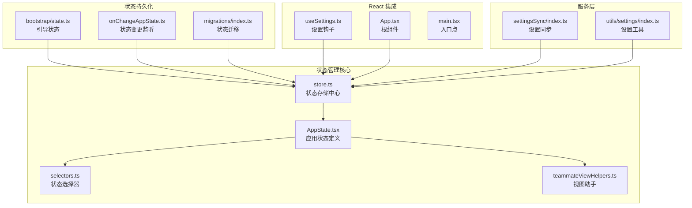
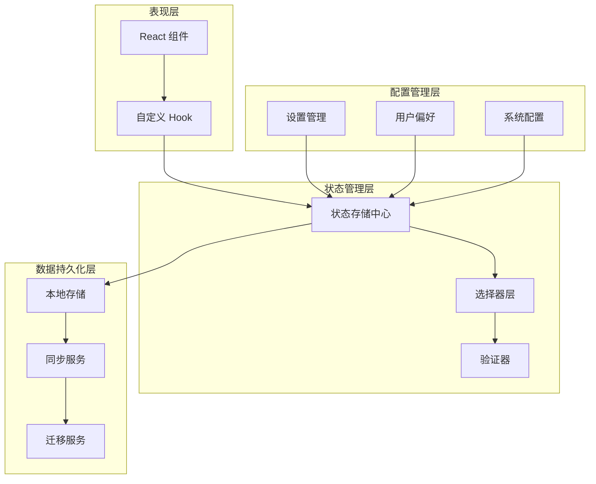
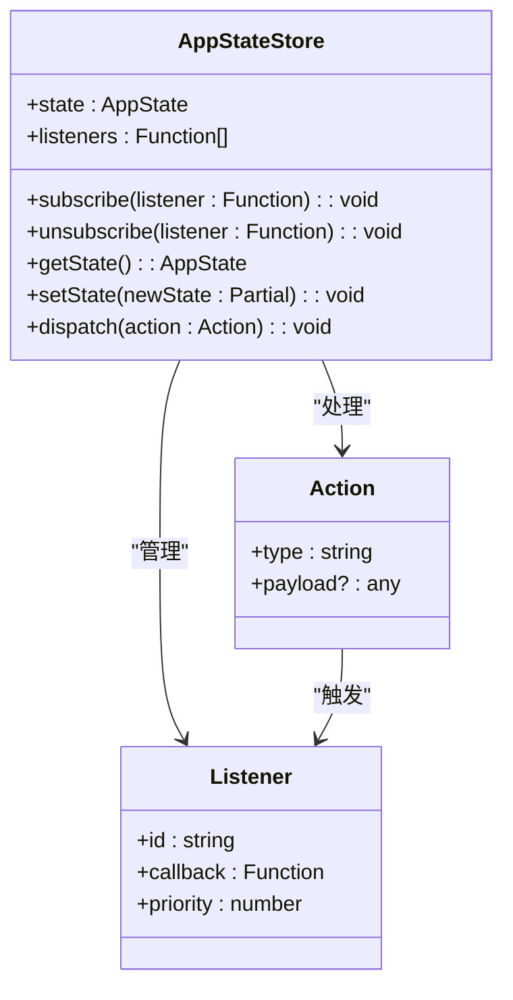
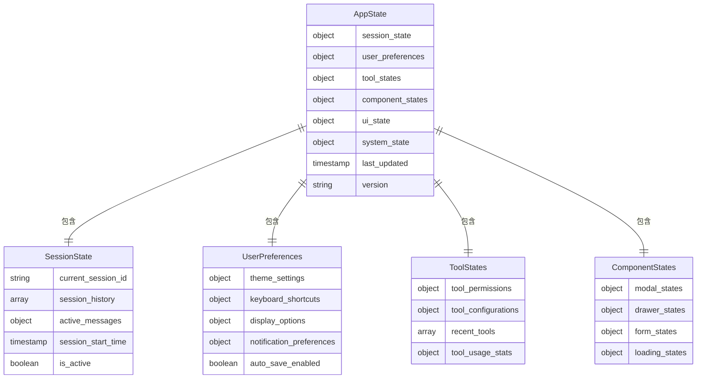
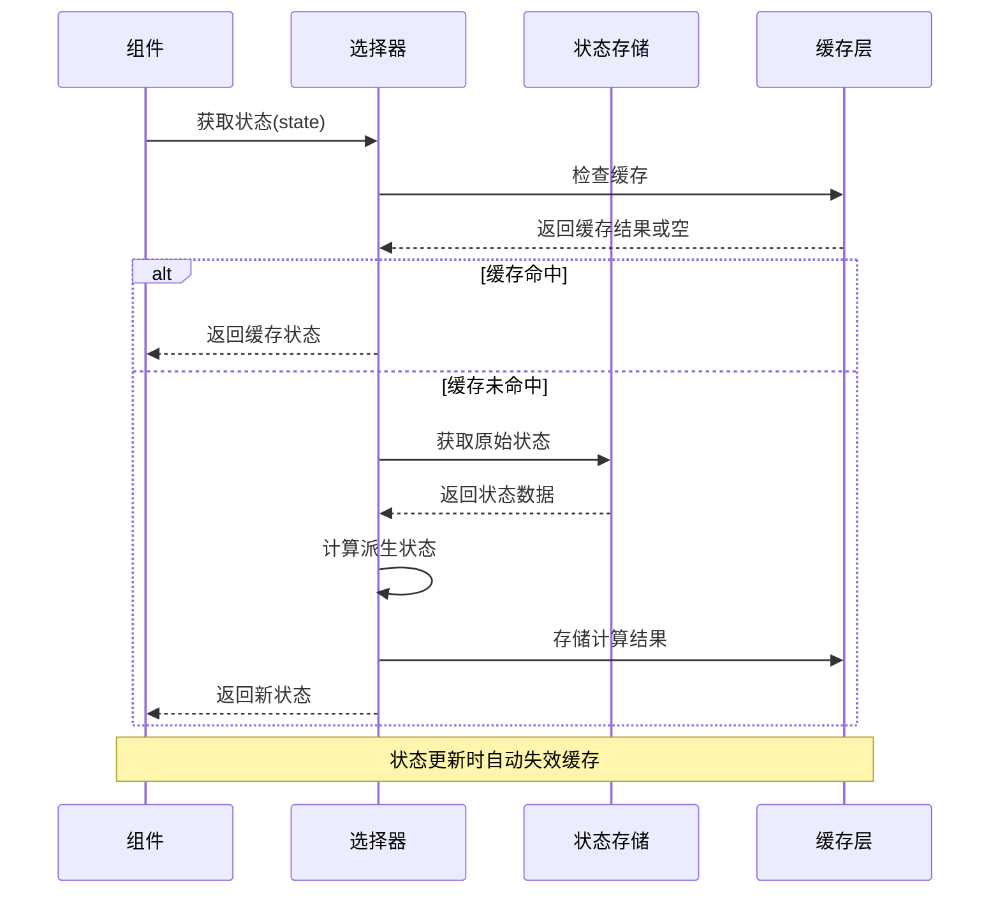
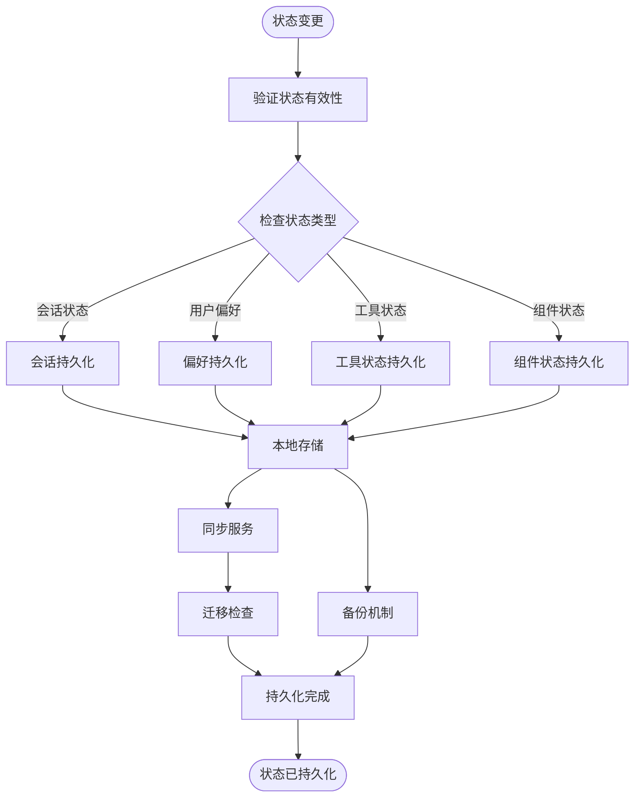
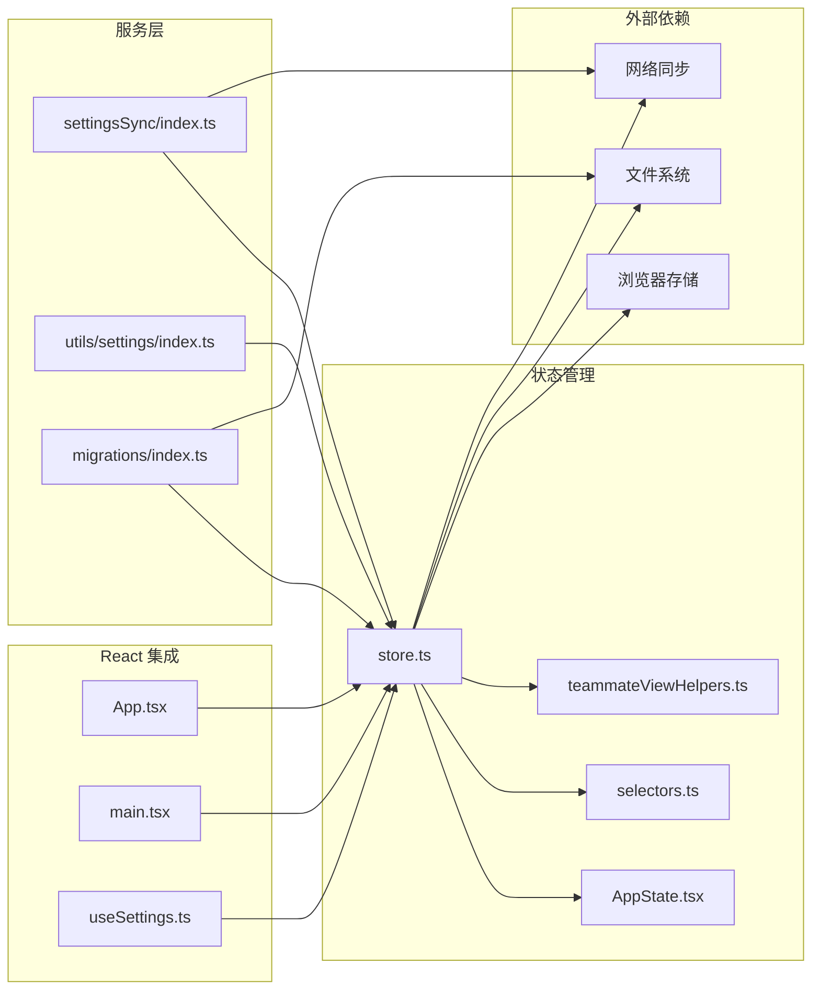
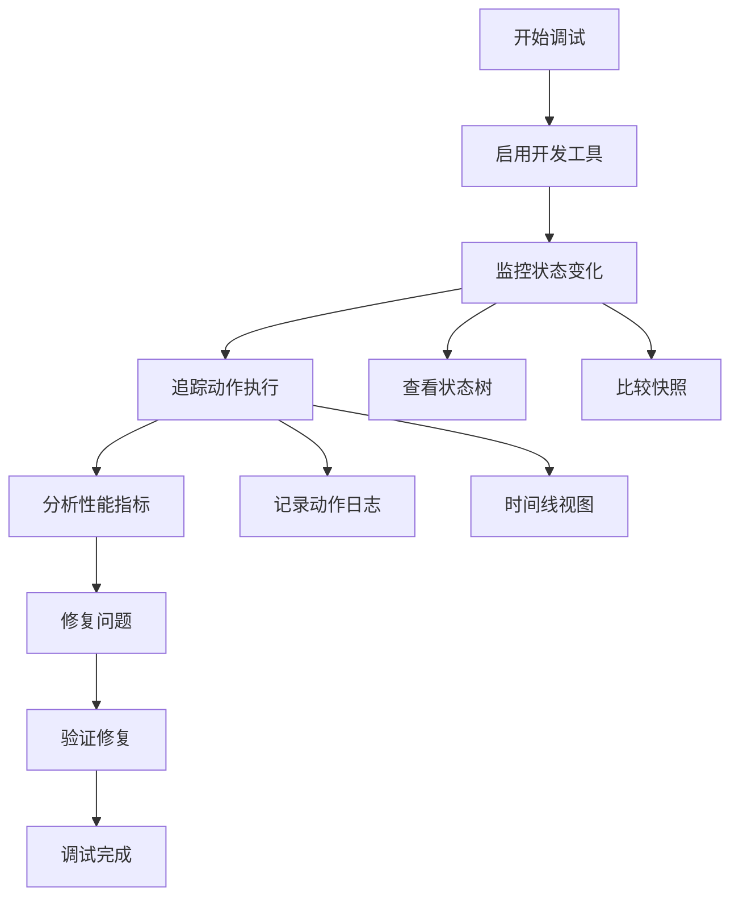

# 状态管理系统

<cite>
**本文档引用的文件**
- [src/state/AppState.tsx](file://src/state/AppState.tsx)
- [src/state/AppStateStore.ts](file://src/state/AppStateStore.ts)
- [src/state/onChangeAppState.ts](file://src/state/onChangeAppState.ts)
- [src/state/selectors.ts](file://src/state/selectors.ts)
- [src/state/store.ts](file://src/state/store.ts)
- [src/bootstrap/state.ts](file://src/bootstrap/state.ts)
- [src/state/teammateViewHelpers.ts](file://src/state/teammateViewHelpers.ts)
- [src/hooks/useSettings.ts](file://src/hooks/useSettings.ts)
- [src/services/settingsSync/index.ts](file://src/services/settingsSync/index.ts)
- [src/utils/settings/index.ts](file://src/utils/settings/index.ts)
- [src/migrations/index.ts](file://src/migrations/index.ts)
- [src/components/App.tsx](file://src/components/App.tsx)
- [src/main.tsx](file://src/main.tsx)
</cite>

## 目录
1. [简介](#简介)
2. [项目结构](#项目结构)
3. [核心组件](#核心组件)
4. [架构概览](#架构概览)
5. [详细组件分析](#详细组件分析)
6. [依赖关系分析](#依赖关系分析)
7. [性能考虑](#性能考虑)
8. [故障排除指南](#故障排除指南)
9. [结论](#结论)
10. [附录](#附录)

## 简介

本文件详细介绍了 Claude-Code 项目中的状态管理系统。该系统采用现代化的状态管理模式，实现了全局状态的集中管理、组件状态的局部隔离、状态选择器模式以及持久化存储机制。系统支持会话状态、用户偏好、工具状态和组件状态等多种状态类型，并提供了完整的状态调试和性能优化功能。

## 项目结构

状态管理系统主要由以下核心模块组成：

**图表来源**
- [src/state/store.ts:1-200](file://src/state/store.ts#L1-L200)
- [src/state/AppState.tsx:1-300](file://src/state/AppState.tsx#L1-L300)
- [src/state/selectors.ts:1-200](file://src/state/selectors.ts#L1-L200)

**章节来源**
- [src/state/store.ts:1-200](file://src/state/store.ts#L1-L200)
- [src/state/AppState.tsx:1-300](file://src/state/AppState.tsx#L1-L300)
- [src/state/selectors.ts:1-200](file://src/state/selectors.ts#L1-L200)

## 核心组件

### 全局状态存储中心

状态存储中心是整个状态管理系统的核心，负责协调所有状态操作和状态变更通知。

**章节来源**
- [src/state/store.ts:1-200](file://src/state/store.ts#L1-L200)
- [src/state/AppStateStore.ts:1-150](file://src/state/AppStateStore.ts#L1-L150)

### 应用状态定义

应用状态定义了所有可管理的状态结构，包括会话状态、用户偏好、工具状态等。

**章节来源**
- [src/state/AppState.tsx:1-300](file://src/state/AppState.tsx#L1-L300)

### 状态选择器模式

状态选择器模式提供了高效的状态访问和计算属性功能，避免不必要的重新渲染。

**章节来源**
- [src/state/selectors.ts:1-200](file://src/state/selectors.ts#L1-L200)

## 架构概览

状态管理系统采用分层架构设计，确保了良好的可维护性和扩展性：

**图表来源**
- [src/state/AppState.tsx:1-300](file://src/state/AppState.tsx#L1-L300)
- [src/state/store.ts:1-200](file://src/state/store.ts#L1-L200)
- [src/state/selectors.ts:1-200](file://src/state/selectors.ts#L1-L200)

## 详细组件分析

### 状态存储中心分析

状态存储中心实现了单点状态管理，提供了统一的状态更新和查询接口。

**图表来源**
- [src/state/AppStateStore.ts:1-150](file://src/state/AppStateStore.ts#L1-L150)
- [src/state/store.ts:1-200](file://src/state/store.ts#L1-L200)

**章节来源**
- [src/state/AppStateStore.ts:1-150](file://src/state/AppStateStore.ts#L1-L150)
- [src/state/store.ts:1-200](file://src/state/store.ts#L1-L200)

### 应用状态结构分析

应用状态采用了模块化的结构设计，将不同类型的状态分离管理：

**图表来源**
- [src/state/AppState.tsx:1-300](file://src/state/AppState.tsx#L1-L300)

**章节来源**
- [src/state/AppState.tsx:1-300](file://src/state/AppState.tsx#L1-L300)

### 状态选择器模式分析

状态选择器模式提供了高效的派生状态计算和缓存机制：

**图表来源**
- [src/state/selectors.ts:1-200](file://src/state/selectors.ts#L1-L200)

**章节来源**
- [src/state/selectors.ts:1-200](file://src/state/selectors.ts#L1-L200)

### 状态持久化机制分析

状态持久化机制确保了应用重启后状态的恢复和跨设备同步：

**图表来源**
- [src/state/onChangeAppState.ts:1-150](file://src/state/onChangeAppState.ts#L1-L150)
- [src/bootstrap/state.ts:1-100](file://src/bootstrap/state.ts#L1-L100)

**章节来源**
- [src/state/onChangeAppState.ts:1-150](file://src/state/onChangeAppState.ts#L1-L150)
- [src/bootstrap/state.ts:1-100](file://src/bootstrap/state.ts#L1-L100)

## 依赖关系分析

状态管理系统与其他模块的依赖关系如下：

**图表来源**
- [src/state/store.ts:1-200](file://src/state/store.ts#L1-L200)
- [src/components/App.tsx:1-200](file://src/components/App.tsx#L1-L200)
- [src/hooks/useSettings.ts:1-150](file://src/hooks/useSettings.ts#L1-L150)

**章节来源**
- [src/state/store.ts:1-200](file://src/state/store.ts#L1-L200)
- [src/components/App.tsx:1-200](file://src/components/App.tsx#L1-L200)
- [src/hooks/useSettings.ts:1-150](file://src/hooks/useSettings.ts#L1-L150)

## 性能考虑

### 内存优化策略

状态管理系统采用了多种内存优化技术：

1. **状态分片存储**：将大型状态对象分割为独立的小型状态块
2. **懒加载机制**：仅在需要时加载和初始化状态
3. **垃圾回收监控**：定期清理不再使用的状态引用
4. **内存泄漏防护**：自动清理事件监听器和定时器

### 渲染性能优化

1. **选择器缓存**：使用记忆化选择器避免重复计算
2. **批量更新**：合并多个状态变更以减少重渲染
3. **细粒度订阅**：组件仅订阅所需的子状态
4. **虚拟滚动**：对大型列表状态使用虚拟化技术

### 网络同步优化

1. **增量同步**：仅传输状态变更部分
2. **压缩算法**：对传输数据进行压缩
3. **背压控制**：防止网络拥塞时的数据堆积
4. **离线缓存**：在网络不可用时缓存状态变更

## 故障排除指南

### 常见问题诊断

**状态不更新问题**
- 检查状态变更是否通过正确的 action 触发
- 验证选择器是否正确缓存和失效
- 确认组件订阅是否正确设置

**内存泄漏问题**
- 检查组件卸载时是否正确清理订阅
- 验证事件监听器是否正确移除
- 确认定时器和异步任务是否清理

**性能问题**
- 分析选择器的计算复杂度
- 检查是否存在不必要的状态订阅
- 验证状态更新的频率和批量大小

### 调试工具使用

状态管理系统提供了完善的调试工具：

**章节来源**
- [src/state/AppState.tsx:1-300](file://src/state/AppState.tsx#L1-L300)
- [src/state/selectors.ts:1-200](file://src/state/selectors.ts#L1-L200)

## 结论

Claude-Code 的状态管理系统通过模块化设计、选择器模式和持久化机制，实现了高效、可维护的状态管理。系统支持多种状态类型，提供了完整的调试和性能优化工具，能够满足复杂应用场景的需求。通过合理的架构设计和最佳实践，该系统为开发者提供了可靠的状态管理解决方案。

## 附录

### 状态管理最佳实践

1. **状态设计原则**
   - 将状态按功能模块划分
   - 避免冗余状态
   - 使用不可变数据结构

2. **性能优化建议**
   - 合理使用选择器缓存
   - 批量处理状态更新
   - 优化组件订阅粒度

3. **调试技巧**
   - 使用开发工具监控状态变化
   - 实施适当的日志记录
   - 定期进行性能基准测试

4. **维护策略**
   - 定期审查状态结构
   - 及时清理过时状态
   - 实施状态迁移策略