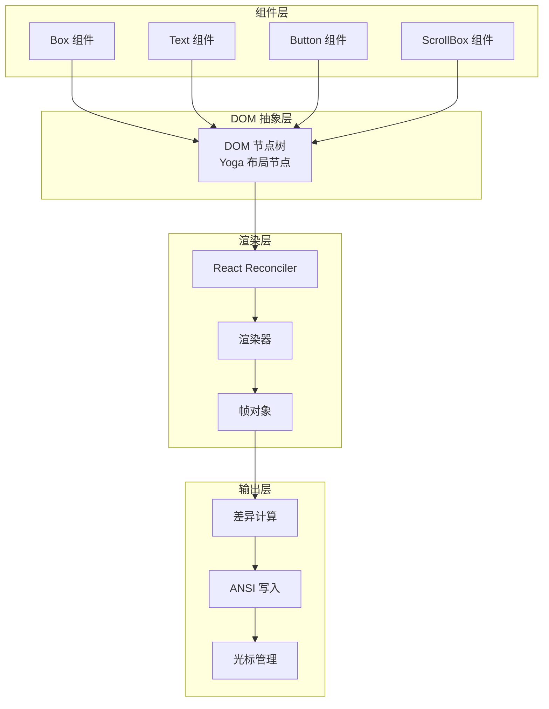
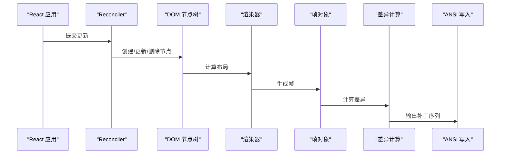
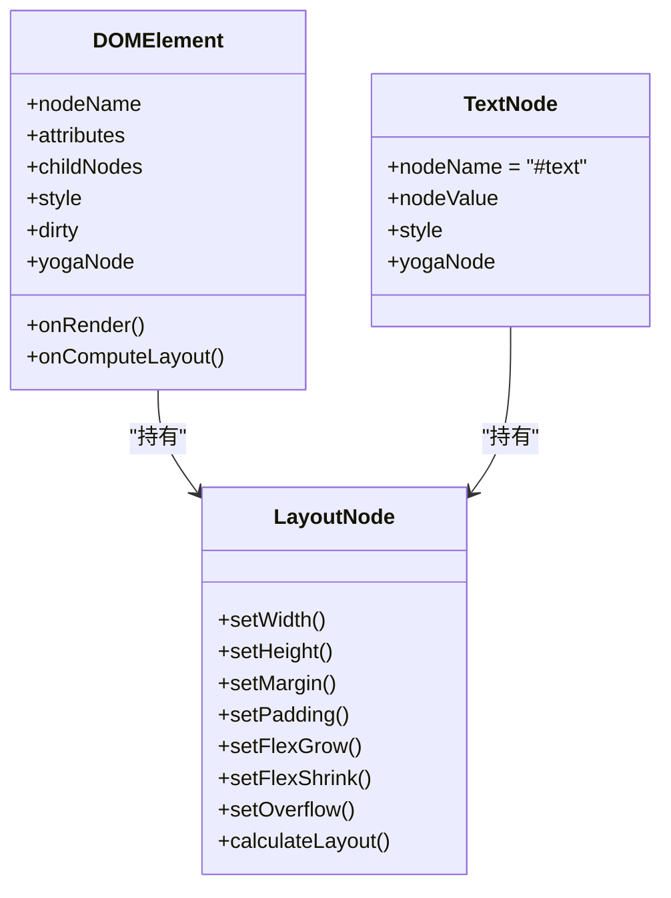
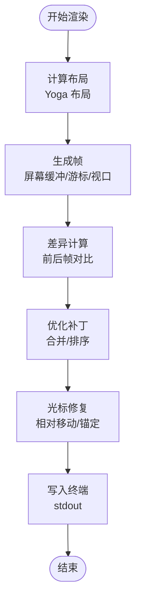
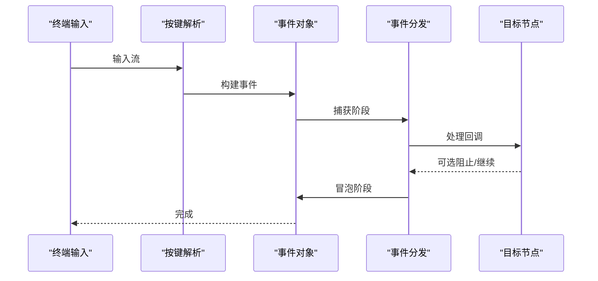
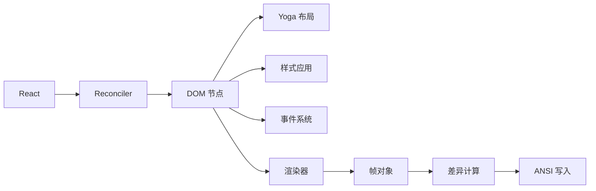

# Ink 终端 UI 框架

<cite>
**本文档引用的文件**
- [ink.tsx](file://src/ink/ink.tsx)
- [dom.ts](file://src/ink/dom.ts)
- [renderer.ts](file://src/ink/renderer.ts)
- [root.ts](file://src/ink/root.ts)
- [reconciler.ts](file://src/ink/reconciler.ts)
- [Box.tsx](file://src/ink/components/Box.tsx)
- [Text.tsx](file://src/ink/components/Text.tsx)
- [Button.tsx](file://src/ink/components/Button.tsx)
- [ScrollBox.tsx](file://src/ink/components/ScrollBox.tsx)
- [keyboard-event.ts](file://src/ink/events/keyboard-event.ts)
- [styles.ts](file://src/ink/styles.ts)
- [parser.ts](file://src/ink/termio/parser.ts)
</cite>

## 目录
1. [简介](#简介)
2. [项目结构](#项目结构)
3. [核心组件](#核心组件)
4. [架构总览](#架构总览)
5. [详细组件分析](#详细组件分析)
6. [依赖关系分析](#依赖关系分析)
7. [性能考量](#性能考量)
8. [故障排除指南](#故障排除指南)
9. [结论](#结论)

## 简介
Ink 是 Claude Code 中的终端 UI 框架，基于 React 和 Yoga 布局引擎构建，提供在终端中渲染富文本、交互式组件与高性能滚动的能力。它通过自定义的 React Reconciler 将 JSX 转换为终端屏幕缓冲区，并通过增量差异算法最小化写入开销。

## 项目结构
Ink 模块采用分层组织：组件层（React 组件）、DOM 抽象层（虚拟 DOM 节点与 Yoga 布局）、渲染层（帧生成与差异计算）、输出层（ANSI 写入与光标控制）。入口通过根实例管理渲染生命周期与事件处理。

**图表来源**
- [root.ts](file://src/ink/root.ts)
- [reconciler.ts](file://src/ink/reconciler.ts)
- [renderer.ts](file://src/ink/renderer.ts)
- [dom.ts](file://src/ink/dom.ts)
- [ink.tsx](file://src/ink/ink.tsx)

**章节来源**
- [root.ts](file://src/ink/root.ts)
- [reconciler.ts](file://src/ink/reconciler.ts)
- [renderer.ts](file://src/ink/renderer.ts)
- [dom.ts](file://src/ink/dom.ts)
- [ink.tsx](file://src/ink/ink.tsx)

## 核心组件
- Ink 根实例：负责渲染循环、事件处理、帧生成与输出写入。
- DOM 抽象：统一的虚拟 DOM 节点模型，支持 Yoga 布局与事件处理。
- 渲染器：将 DOM 树转换为帧对象，包含屏幕缓冲、游标位置与视口信息。
- 组件库：Box、Text、Button、ScrollBox 等终端友好组件。

**章节来源**
- [ink.tsx](file://src/ink/ink.tsx)
- [dom.ts](file://src/ink/dom.ts)
- [renderer.ts](file://src/ink/renderer.ts)

## 架构总览
Ink 的渲染管线由 React Reconciler 驱动，先进行布局计算，再生成帧，最后通过差异算法最小化输出写入。事件系统通过 DOM 节点与事件分发器协作，支持键盘、鼠标与焦点管理。

**图表来源**
- [reconciler.ts](file://src/ink/reconciler.ts)
- [dom.ts](file://src/ink/dom.ts)
- [renderer.ts](file://src/ink/renderer.ts)
- [ink.tsx](file://src/ink/ink.tsx)

## 详细组件分析

### 虚拟 DOM 与布局系统
- DOM 节点类型：元素节点与文本节点，支持属性、样式与事件处理器存储。
- Yoga 布局：每个元素维护 Yoga 节点，支持 flex、溢出、边距、内边距等布局属性。
- 布局测量：文本节点根据宽度约束进行测量与换行，原始 ANSI 文本节点按预设尺寸处理。
- 脏标记：属性或样式变更触发向上冒泡的脏标记，确保布局与渲染更新。

**图表来源**
- [dom.ts](file://src/ink/dom.ts)
- [styles.ts](file://src/ink/styles.ts)

**章节来源**
- [dom.ts](file://src/ink/dom.ts)
- [styles.ts](file://src/ink/styles.ts)

### 终端渲染机制
- 帧生成：渲染器根据根节点的 Yoga 布局结果生成帧，包含屏幕缓冲、游标位置与视口尺寸。
- 差异计算：基于前一帧与当前帧的差异生成最小输出补丁，支持全屏损坏回退。
- 光标管理：在 alt 屏幕模式下固定物理光标至左上角以避免相对移动漂移，在主屏幕模式下进行相对移动修复。
- 输出写入：将补丁序列写入 stdout，支持同步输出与原子写入以保证内容一致性。

**图表来源**
- [renderer.ts](file://src/ink/renderer.ts)
- [ink.tsx](file://src/ink/ink.tsx)

**章节来源**
- [renderer.ts](file://src/ink/renderer.ts)
- [ink.tsx](file://src/ink/ink.tsx)

### 事件处理系统
- 键盘事件：解析按键序列，生成符合浏览器语义的 KeyboardEvent，支持组合键与功能键。
- 鼠标事件：在启用鼠标跟踪时捕获点击、进入/离开等事件，通过命中测试定位目标节点。
- 焦点管理：通过 FocusManager 管理可聚焦节点与自动聚焦，支持 Tab/Shift+Tab 循环。
- 事件分发：使用自定义分发器在捕获/冒泡阶段分发事件，支持离散更新优先级。

**图表来源**
- [keyboard-event.ts](file://src/ink/events/keyboard-event.ts)
- [reconciler.ts](file://src/ink/reconciler.ts)

**章节来源**
- [keyboard-event.ts](file://src/ink/events/keyboard-event.ts)
- [reconciler.ts](file://src/ink/reconciler.ts)

### 组件库详解

#### Box 组件
- 功能：终端布局容器，支持 flex 布局、溢出、边距与内边距等样式属性。
- 交互：支持 tabIndex、autoFocus、点击与鼠标进入/离开事件。
- 约束：禁止在 Text 内部嵌套 Box，避免布局冲突。

**章节来源**
- [Box.tsx](file://src/ink/components/Box.tsx)

#### Text 组件
- 功能：终端文本渲染，支持颜色、背景色、粗体、斜体、下划线、删除线、反显等文本样式。
- 换行策略：支持 wrap、truncate 等多种换行与截断策略，内部使用 Yoga 测量与换行。

**章节来源**
- [Text.tsx](file://src/ink/components/Text.tsx)
- [styles.ts](file://src/ink/styles.ts)

#### Button 组件
- 功能：可交互按钮，提供按下、悬停、聚焦等状态反馈。
- 行为：支持 Enter/Space 触发与点击触发，内置短暂激活态动画。

**章节来源**
- [Button.tsx](file://src/ink/components/Button.tsx)

#### ScrollBox 组件
- 功能：带滚动条的容器，支持滚动到指定位置、滚动增量、粘性滚动与虚拟滚动范围钳制。
- API：提供 scrollTo、scrollBy、scrollToBottom、scrollToElement 等命令式接口，订阅滚动变化。

**章节来源**
- [ScrollBox.tsx](file://src/ink/components/ScrollBox.tsx)

### 样式系统与主题支持
- 样式类型：支持布局（flex、溢出、尺寸）、盒模型（边距、内边距、边框）、文本样式（颜色、粗细、装饰）与不透明覆盖等。
- 解析与应用：样式通过 applyStyles 应用于 Yoga 节点，支持增量更新与差异计算。
- 主题：颜色支持 rgb、hex、ansi256 与 ANSI 名称，文本样式在组件层解析主题键。

**章节来源**
- [styles.ts](file://src/ink/styles.ts)

### 终端输入解析与输出
- ANSI 解析：解析 CSI、OSC、ESC 等序列，生成语义化动作，维护当前文本样式与链接状态。
- 输出写入：将补丁序列写入 stdout，支持同步输出与原子写入，避免中间态显示。

**章节来源**
- [parser.ts](file://src/ink/termio/parser.ts)
- [ink.tsx](file://src/ink/ink.tsx)

## 依赖关系分析
Ink 的核心依赖链如下：
- React Reconciler 驱动 DOM 更新与事件调度。
- DOM 抽象层连接 Yoga 布局与样式应用。
- 渲染器将布局结果转换为帧对象。
- 差异计算与输出写入最小化终端写入成本。

**图表来源**
- [reconciler.ts](file://src/ink/reconciler.ts)
- [dom.ts](file://src/ink/dom.ts)
- [renderer.ts](file://src/ink/renderer.ts)
- [ink.tsx](file://src/ink/ink.tsx)

**章节来源**
- [reconciler.ts](file://src/ink/reconciler.ts)
- [dom.ts](file://src/ink/dom.ts)
- [renderer.ts](file://src/ink/renderer.ts)
- [ink.tsx](file://src/ink/ink.tsx)

## 性能考量
- 布局缓存：Yoga 节点与样式变更采用增量更新，减少重复计算。
- 帧差异：仅输出发生变化的区域，支持全屏损坏回退以保证正确性。
- 光标修复：在 alt 屏幕模式下锚定物理光标，避免相对移动漂移导致的闪烁。
- 滚动优化：虚拟滚动与滚动钳制避免空白占位，快速滚动手势通过累积增量平滑过渡。

## 故障排除指南
- 渲染闪烁：检查是否发生全屏重置，查看帧事件中的 flickers 字段；确认布局未频繁变动。
- 光标异常：在 alt 屏幕模式下确保物理光标被锚定；在主屏幕模式下检查相对移动修复逻辑。
- 滚动卡顿：确认滚动增量未过大；检查虚拟滚动范围钳制设置。
- 事件无响应：确认鼠标跟踪已启用且事件处理器正确绑定；检查焦点管理与 Tab 索引。

**章节来源**
- [ink.tsx](file://src/ink/ink.tsx)

## 结论
Ink 通过虚拟 DOM、Yoga 布局与增量差异输出，实现了高性能的终端 UI 渲染。其组件库覆盖了常用布局与交互需求，事件系统与样式系统提供了良好的扩展性。遵循本文档的架构与最佳实践，可在终端环境中构建复杂而流畅的用户界面。