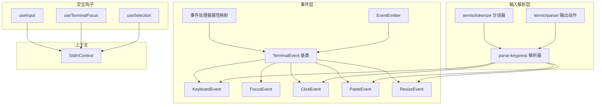
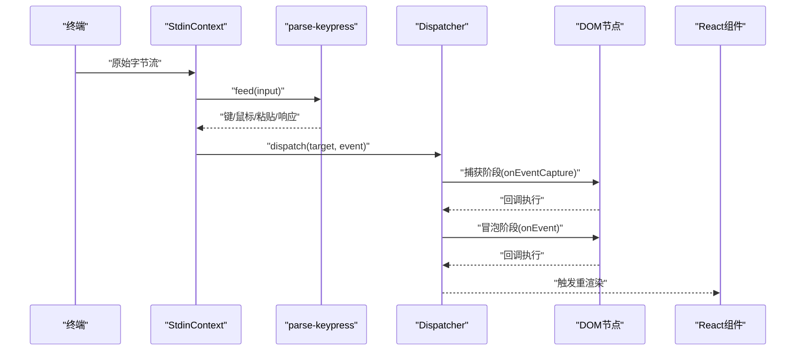
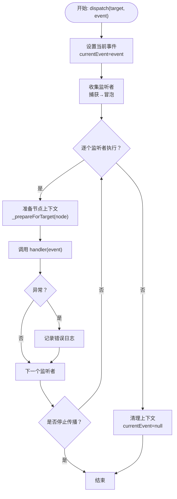
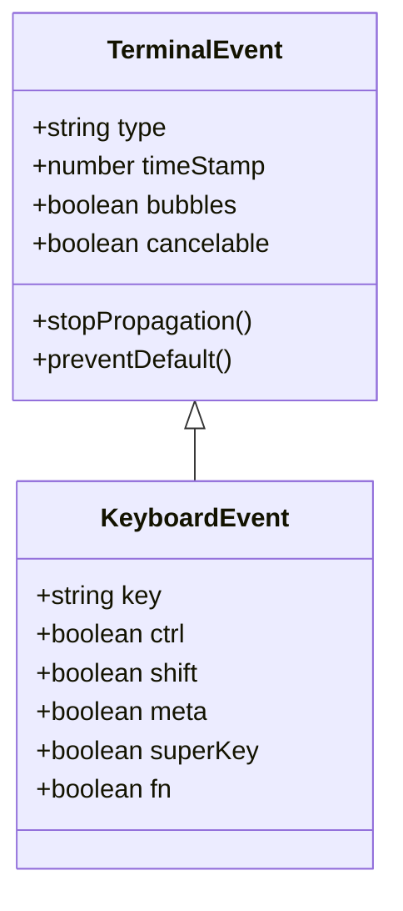
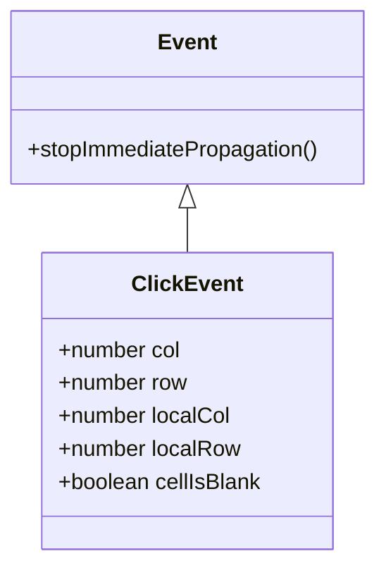
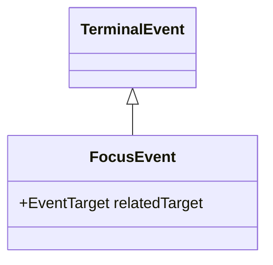
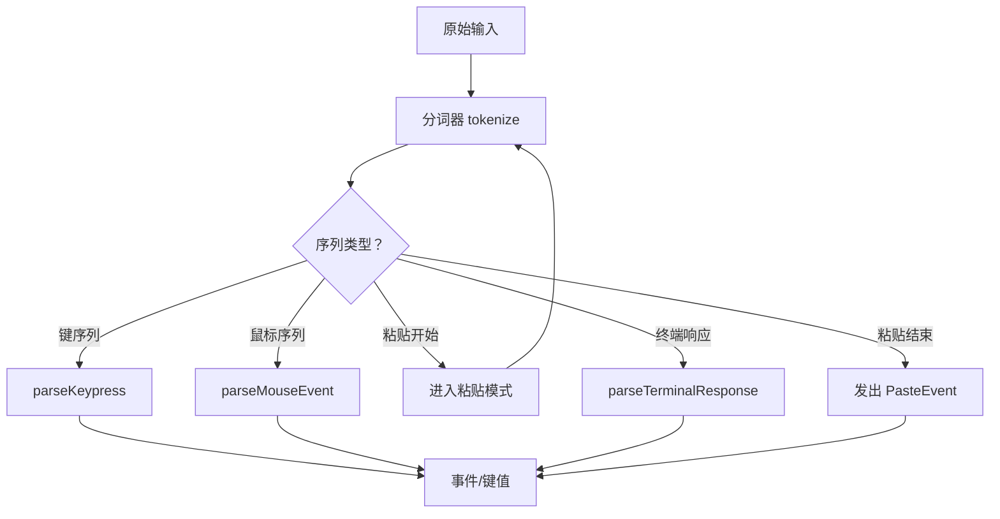
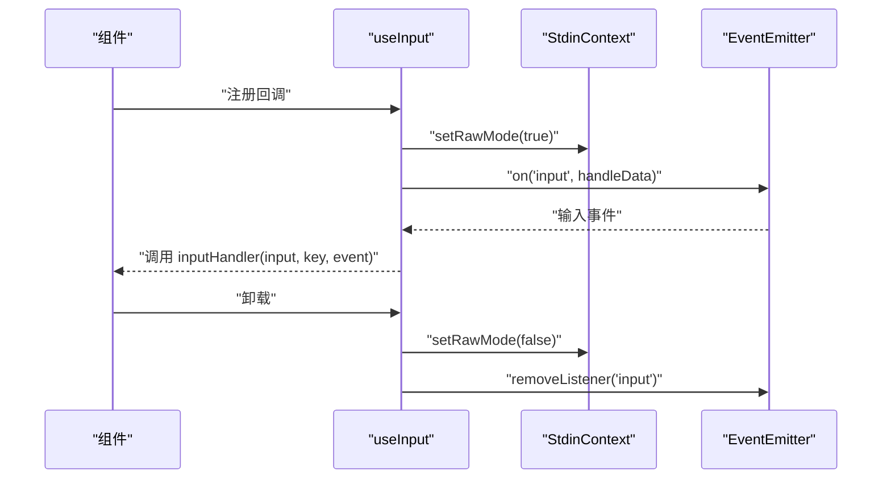
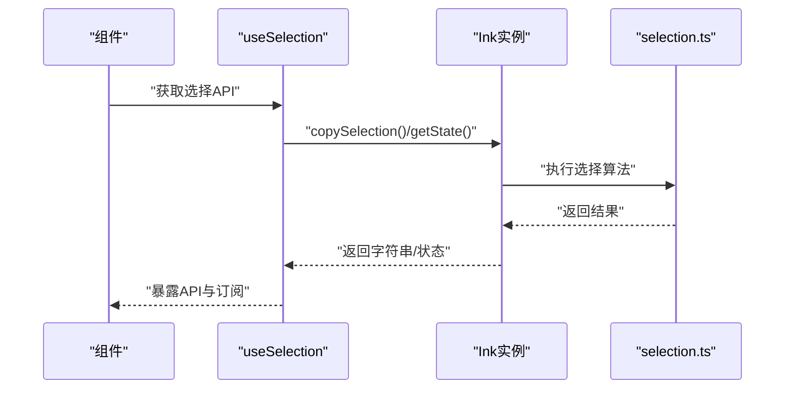
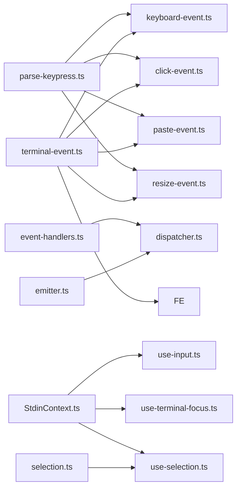

# 事件处理与交互

<cite>
**本文引用的文件**
- [dispatcher.ts](file://src/ink/events/dispatcher.ts)
- [emitter.ts](file://src/ink/events/emitter.ts)
- [event-handlers.ts](file://src/ink/events/event-handlers.ts)
- [event.ts](file://src/ink/events/event.ts)
- [terminal-event.ts](file://src/ink/events/terminal-event.ts)
- [keyboard-event.ts](file://src/ink/events/keyboard-event.ts)
- [focus-event.ts](file://src/ink/events/focus-event.ts)
- [paste-event.ts](file://src/ink/events/paste-event.ts)
- [click-event.ts](file://src/ink/events/click-event.ts)
- [resize-event.ts](file://src/ink/events/resize-event.ts)
- [parse-keypress.ts](file://src/ink/parse-keypress.ts)
- [parser.ts](file://src/ink/termio/parser.ts)
- [StdinContext.ts](file://src/ink/components/StdinContext.ts)
- [use-input.ts](file://src/ink/hooks/use-input.ts)
- [use-terminal-focus.ts](file://src/ink/hooks/use-terminal-focus.ts)
- [use-selection.ts](file://src/ink/hooks/use-selection.ts)
- [selection.ts](file://src/ink/selection.ts)
</cite>

## 目录
1. [引言](#引言)
2. [项目结构](#项目结构)
3. [核心组件](#核心组件)
4. [架构总览](#架构总览)
5. [详细组件分析](#详细组件分析)
6. [依赖关系分析](#依赖关系分析)
7. [性能考量](#性能考量)
8. [故障排查指南](#故障排查指南)
9. [结论](#结论)
10. [附录](#附录)

## 引言
本文件面向 Ink 终端 UI 框架的事件处理与交互系统，系统性阐述事件分发器、事件处理器与事件冒泡机制；详解终端特有事件类型（键盘、鼠标、焦点、粘贴、窗口大小变化）的解析与派发流程；解释焦点管理与选择系统的工作原理；并提供交互钩子函数 useInput、useTerminalFocus、useSelection 的使用指南与最佳实践。

## 项目结构
事件与交互相关代码主要集中在以下模块：
- 事件定义与基类：events/*.ts
- 事件分发与调度：events/dispatcher.ts
- 输入解析与键盘事件：parse-keypress.ts、events/keyboard-event.ts
- 鼠标点击事件：events/click-event.ts
- 焦点事件：events/focus-event.ts
- 粘贴事件：events/paste-event.ts
- 窗口大小事件：events/resize-event.ts
- 事件处理器属性映射：events/event-handlers.ts
- 事件发射器：events/emitter.ts
- 终端输入上下文：components/StdinContext.ts
- 交互钩子：hooks/use-input.ts、hooks/use-terminal-focus.ts、hooks/use-selection.ts
- 文本选择状态与算法：selection.ts
- 终端输出解析（ANSI/控制序列）：termio/parser.ts

**图表来源**
- [terminal-event.ts:19-102](file://src/ink/events/terminal-event.ts#L19-L102)
- [keyboard-event.ts:12-30](file://src/ink/events/keyboard-event.ts#L12-L30)
- [focus-event.ts:11-21](file://src/ink/events/focus-event.ts#L11-L21)
- [click-event.ts:10-38](file://src/ink/events/click-event.ts#L10-L38)
- [paste-event.ts:1-2](file://src/ink/events/paste-event.ts#L1-L2)
- [resize-event.ts:1-2](file://src/ink/events/resize-event.ts#L1-L2)
- [event-handlers.ts:44-54](file://src/ink/events/event-handlers.ts#L44-L54)
- [emitter.ts:6-39](file://src/ink/events/emitter.ts#L6-L39)
- [parse-keypress.ts:213-302](file://src/ink/parse-keypress.ts#L213-L302)
- [parser.ts:272-394](file://src/ink/termio/parser.ts#L272-L394)
- [StdinContext.ts:5-29](file://src/ink/components/StdinContext.ts#L5-L29)
- [use-input.ts:42-93](file://src/ink/hooks/use-input.ts#L42-L93)
- [use-terminal-focus.ts:13-16](file://src/ink/hooks/use-terminal-focus.ts#L13-L16)
- [use-selection.ts:46-105](file://src/ink/hooks/use-selection.ts#L46-L105)

**章节来源**
- [dispatcher.ts:161-234](file://src/ink/events/dispatcher.ts#L161-L234)
- [parse-keypress.ts:213-302](file://src/ink/parse-keypress.ts#L213-L302)
- [StdinContext.ts:5-29](file://src/ink/components/StdinContext.ts#L5-L29)

## 核心组件
- 事件基类与传播控制：TerminalEvent 提供 target/currentTarget/eventPhase/defaultPrevented 等标准属性，并支持 stopPropagation/stopImmediatePropagation/preventDefault。
- 事件分发器：Dispatcher 实现捕获/冒泡两阶段收集监听者，按树路径自顶向下（捕获）与自底向上（冒泡）执行，支持离散优先级与连续优先级调度。
- 事件处理器属性映射：EVENT_HANDLER_PROPS/HANDLER_FOR_EVENT 将 DOM 风格的 onEvent/onEventCapture 映射到节点的事件处理器存储，便于快速查找。
- 输入解析器：parse-keypress 将原始字节流解析为键值、鼠标、粘贴与终端响应，支持 Kitty 键盘协议、modifyOtherKeys、SGR/X10 鼠标编码等。
- 事件发射器：EventEmitter 在 Node EventEmitter 基础上增强对事件对象 stopImmediatePropagation 的感知，确保中断传播语义一致。
- 交互钩子：useInput/useTerminalFocus/useSelection 为应用层提供声明式交互能力，统一 raw 模式管理、焦点状态与文本选择操作。

**章节来源**
- [terminal-event.ts:19-102](file://src/ink/events/terminal-event.ts#L19-L102)
- [dispatcher.ts:161-234](file://src/ink/events/dispatcher.ts#L161-L234)
- [event-handlers.ts:44-74](file://src/ink/events/event-handlers.ts#L44-L74)
- [parse-keypress.ts:213-302](file://src/ink/parse-keypress.ts#L213-L302)
- [emitter.ts:6-39](file://src/ink/events/emitter.ts#L6-L39)
- [use-input.ts:42-93](file://src/ink/hooks/use-input.ts#L42-L93)
- [use-terminal-focus.ts:13-16](file://src/ink/hooks/use-terminal-focus.ts#L13-L16)
- [use-selection.ts:46-105](file://src/ink/hooks/use-selection.ts#L46-L105)

## 架构总览
下图展示从终端输入到事件派发与渲染更新的完整链路，涵盖键盘、鼠标、焦点、粘贴与窗口大小变化等事件类型。

**图表来源**
- [parse-keypress.ts:213-302](file://src/ink/parse-keypress.ts#L213-L302)
- [dispatcher.ts:185-201](file://src/ink/events/dispatcher.ts#L185-L201)
- [StdinContext.ts:24-28](file://src/ink/components/StdinContext.ts#L24-L28)

## 详细组件分析

### 事件系统架构与分发器
- 两阶段收集：从目标节点沿父链收集捕获阶段监听者（根到目标），再收集冒泡阶段监听者（目标到根），形成“根→…→父→目标→父→…→根”的顺序。
- 监听者匹配：通过 HANDLER_FOR_EVENT 将事件类型映射到节点上的 onEvent/onEventCapture 属性，O(1) 查找。
- 传播控制：支持 stopPropagation/stopImmediatePropagation/preventDefault，内部维护当前事件与优先级。
- 优先级策略：根据事件类型映射到离散/连续优先级，用于调度器合并更新与时间片分配。

**图表来源**
- [dispatcher.ts:46-114](file://src/ink/events/dispatcher.ts#L46-L114)

**章节来源**
- [dispatcher.ts:161-234](file://src/ink/events/dispatcher.ts#L161-L234)
- [event-handlers.ts:44-54](file://src/ink/events/event-handlers.ts#L44-L54)
- [terminal-event.ts:70-102](file://src/ink/events/terminal-event.ts#L70-L102)

### 终端事件类型与解析

#### 键盘事件 KeyboardEvent
- 语义对齐浏览器：key 表示可打印字符或特殊键名（如 ArrowDown、F1），修饰键 ctrl/shift/meta/super/fn 由解析器推断。
- 解析来源：parse-keypress 支持 Kitty 键盘协议、modifyOtherKeys、多平台功能键序列，以及自然文本编辑模式下的 Meta 移动键。

**图表来源**
- [terminal-event.ts:19-102](file://src/ink/events/terminal-event.ts#L19-L102)
- [keyboard-event.ts:12-30](file://src/ink/events/keyboard-event.ts#L12-L30)
- [parse-keypress.ts:630-785](file://src/ink/parse-keypress.ts#L630-L785)

**章节来源**
- [keyboard-event.ts:12-52](file://src/ink/events/keyboard-event.ts#L12-L52)
- [parse-keypress.ts:213-302](file://src/ink/parse-keypress.ts#L213-L302)

#### 鼠标事件 ClickEvent
- 仅在启用备用屏且启用鼠标追踪时产生（SGR 模式），左键释放无拖拽触发。
- 提供屏幕坐标与相对容器局部坐标，支持检测空白单元格以避免误触。

**图表来源**
- [event.ts:1-12](file://src/ink/events/event.ts#L1-L12)
- [click-event.ts:10-38](file://src/ink/events/click-event.ts#L10-L38)

**章节来源**
- [click-event.ts:10-39](file://src/ink/events/click-event.ts#L10-L39)

#### 焦点事件 FocusEvent
- 采用 focusin/focusout 语义：focus 在新元素上触发，blur 在旧元素上触发，均支持冒泡，便于父组件观察后代焦点变化。

**图表来源**
- [terminal-event.ts:19-102](file://src/ink/events/terminal-event.ts#L19-L102)
- [focus-event.ts:11-21](file://src/ink/events/focus-event.ts#L11-L21)

**章节来源**
- [focus-event.ts:11-22](file://src/ink/events/focus-event.ts#L11-L22)

#### 粘贴事件 PasteEvent
- 粘贴模式由终端 BRACKETED PASTE 模式开启/关闭，解析器在粘贴块内将所有内容作为单次 PasteEvent 抛出，保证一次性处理。

**章节来源**
- [paste-event.ts:1-2](file://src/ink/events/paste-event.ts#L1-L2)
- [parse-keypress.ts:233-245](file://src/ink/parse-keypress.ts#L233-L245)

#### 窗口大小事件 ResizeEvent
- 由终端窗口尺寸变化触发，通常用于布局自适应与滚动区域调整。

**章节来源**
- [resize-event.ts:1-2](file://src/ink/events/resize-event.ts#L1-L2)

### 输入解析与事件生成
- 流式解析：parse-keypress 使用 termio/tokenize 对输入进行分词，识别键序列、鼠标事件、粘贴块与终端响应。
- 粘贴处理：在粘贴开始/结束标记之间累积内容，结束后发出一次 PasteEvent，便于上层统一处理空粘贴等边界情况。
- 鼠标事件：SGR/X10 编码被解析为 ParsedMouse 或导航键，轮询事件保留给键绑定系统，点击/拖拽事件用于交互组件。

**图表来源**
- [parse-keypress.ts:213-302](file://src/ink/parse-keypress.ts#L213-L302)
- [parser.ts:272-394](file://src/ink/termio/parser.ts#L272-L394)

**章节来源**
- [parse-keypress.ts:213-302](file://src/ink/parse-keypress.ts#L213-L302)
- [parser.ts:272-394](file://src/ink/termio/parser.ts#L272-L394)

### 交互钩子函数

#### useInput
- 功能：简化用户输入监听，替代直接订阅 stdin data 事件。
- 行为：在挂载时启用 raw 模式，接收 InputEvent 并调用回调；支持 isActive 控制激活状态；自动处理 Ctrl+C 退出逻辑（若未禁用）。
- 性能：使用 useLayoutEffect 同步设置 raw 模式，避免闪烁；使用 useEventCallback 保持回调引用稳定。

**图表来源**
- [use-input.ts:42-93](file://src/ink/hooks/use-input.ts#L42-L93)
- [StdinContext.ts:24-28](file://src/ink/components/StdinContext.ts#L24-L28)

**章节来源**
- [use-input.ts:42-93](file://src/ink/hooks/use-input.ts#L42-L93)
- [StdinContext.ts:5-29](file://src/ink/components/StdinContext.ts#L5-L29)

#### useTerminalFocus
- 功能：查询终端是否获得焦点（基于 DECSET 1004 能力报告）。
- 适用：过滤掉焦点事件序列对 useInput 的干扰，确保输入回调专注于用户输入。

**章节来源**
- [use-terminal-focus.ts:13-16](file://src/ink/hooks/use-terminal-focus.ts#L13-L16)

#### useSelection
- 功能：提供文本选择操作（复制、清除、订阅变更、移动焦点、扩展选择、滚动跟随等），仅在备用屏（全屏）可用。
- 订阅：useHasSelection 提供选择存在状态的响应式订阅，适合条件渲染与快捷提示。

**图表来源**
- [use-selection.ts:46-105](file://src/ink/hooks/use-selection.ts#L46-L105)
- [selection.ts:676-795](file://src/ink/selection.ts#L676-L795)

**章节来源**
- [use-selection.ts:46-105](file://src/ink/hooks/use-selection.ts#L46-L105)
- [selection.ts:1-800](file://src/ink/selection.ts#L1-L800)

### 焦点管理与选择系统
- 焦点状态：通过 DECSET 1004 获取/失去焦点的转义序列，Ink 自动处理并过滤，避免干扰输入。
- 选择算法：selection.ts 实现行级选择、单词/行扩展、软换行拼接、滚动跟随与虚拟行跟踪，确保复制文本与视觉一致。
- 交互体验：支持键盘扩展（Shift+方向）、拖拽选择、滚动时锚点跟随，以及粘贴前缀/后缀的智能修剪。

**章节来源**
- [selection.ts:1-800](file://src/ink/selection.ts#L1-L800)

## 依赖关系分析

**图表来源**
- [parse-keypress.ts:213-302](file://src/ink/parse-keypress.ts#L213-L302)
- [keyboard-event.ts:12-30](file://src/ink/events/keyboard-event.ts#L12-L30)
- [click-event.ts:10-38](file://src/ink/events/click-event.ts#L10-L38)
- [paste-event.ts:1-2](file://src/ink/events/paste-event.ts#L1-L2)
- [resize-event.ts:1-2](file://src/ink/events/resize-event.ts#L1-L2)
- [event-handlers.ts:44-54](file://src/ink/events/event-handlers.ts#L44-L54)
- [dispatcher.ts:161-234](file://src/ink/events/dispatcher.ts#L161-L234)
- [terminal-event.ts:19-102](file://src/ink/events/terminal-event.ts#L19-L102)
- [emitter.ts:6-39](file://src/ink/events/emitter.ts#L6-L39)
- [StdinContext.ts:5-29](file://src/ink/components/StdinContext.ts#L5-L29)
- [use-input.ts:42-93](file://src/ink/hooks/use-input.ts#L42-L93)
- [use-terminal-focus.ts:13-16](file://src/ink/hooks/use-terminal-focus.ts#L13-L16)
- [use-selection.ts:46-105](file://src/ink/hooks/use-selection.ts#L46-L105)
- [selection.ts:1-800](file://src/ink/selection.ts#L1-L800)

**章节来源**
- [dispatcher.ts:161-234](file://src/ink/events/dispatcher.ts#L161-L234)
- [event-handlers.ts:44-74](file://src/ink/events/event-handlers.ts#L44-L74)
- [StdinContext.ts:5-29](file://src/ink/components/StdinContext.ts#L5-L29)

## 性能考量
- 事件优先级：键盘、点击、焦点、粘贴等用户主动事件使用离散优先级，确保即时响应；高频率事件（resize、scroll、mousemove）使用连续优先级，避免阻塞。
- 传播短路：stopPropagation/stopImmediatePropagation 及 preventDefault 可减少无效回调开销。
- 输入解析：流式分词与状态机避免重复解析，粘贴块一次性处理降低抖动。
- 渲染合并：React 协调器在离散更新中合并多次状态变更，减少重渲染次数。

[本节为通用指导，不直接分析具体文件]

## 故障排查指南
- 输入无响应
  - 检查是否正确启用 raw 模式（useInput 在挂载时设置）。
  - 确认 isActive 未被设为 false。
  - 若需要退出 Ctrl+C，请确认 internal_exitOnCtrlC 设置。
- 焦点状态异常
  - 确认终端支持 DECSET 1004；否则 useTerminalFocus 返回未知状态。
- 鼠标点击无效
  - 仅在备用屏且启用鼠标追踪时产生点击事件；检查 <AlternateScreen> 包裹与鼠标模式配置。
- 粘贴内容为空
  - 粘贴块结束会发出一次 PasteEvent，即使内容为空；请在回调中处理空串场景。
- 选择异常
  - 仅在备用屏可用；确认 useSelection 返回的实例存在。
  - 复制文本与视觉不一致时，检查软换行与滚动跟随逻辑。

**章节来源**
- [use-input.ts:42-93](file://src/ink/hooks/use-input.ts#L42-L93)
- [use-terminal-focus.ts:13-16](file://src/ink/hooks/use-terminal-focus.ts#L13-L16)
- [use-selection.ts:46-105](file://src/ink/hooks/use-selection.ts#L46-L105)
- [selection.ts:1-800](file://src/ink/selection.ts#L1-L800)

## 结论
Ink 的事件系统以 TerminalEvent 为基础，结合 Dispatcher 的两阶段分发与 React 优先级调度，实现了与浏览器 DOM 事件语义高度一致的终端交互模型。parse-keypress 与 termio/parser 提供了强大的输入解析能力，覆盖多平台键盘与鼠标编码。交互钩子与选择系统进一步降低了开发复杂度，使终端 UI 具备现代应用般的交互体验。

[本节为总结性内容，不直接分析具体文件]

## 附录
- 最佳实践
  - 优先使用 useInput/useSelection/useTerminalFocus 等钩子，避免直接操作 stdin/raw 模式。
  - 在高频事件（resize/scroll）中谨慎执行昂贵操作，必要时使用节流/防抖。
  - 利用 stopPropagation/stopImmediatePropagation 控制事件流向，避免重复处理。
  - 对粘贴内容进行空串与格式化处理，提升可访问性与一致性。

[本节为通用指导，不直接分析具体文件]