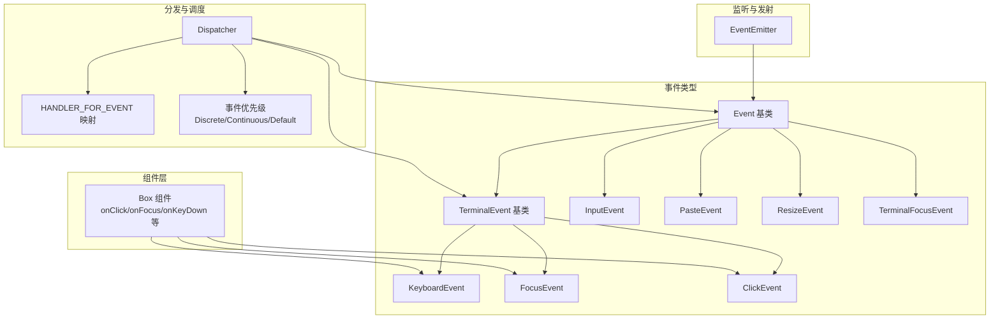
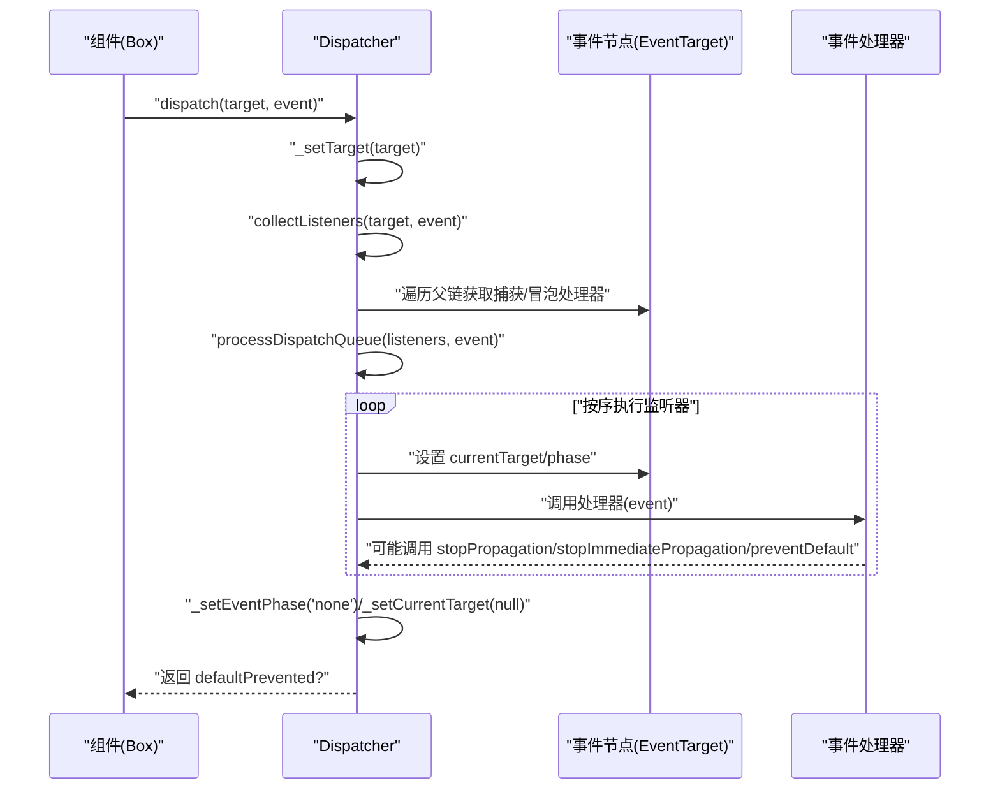
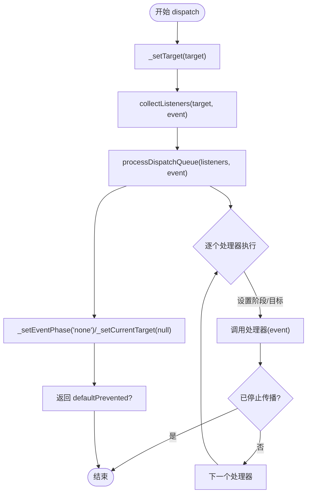
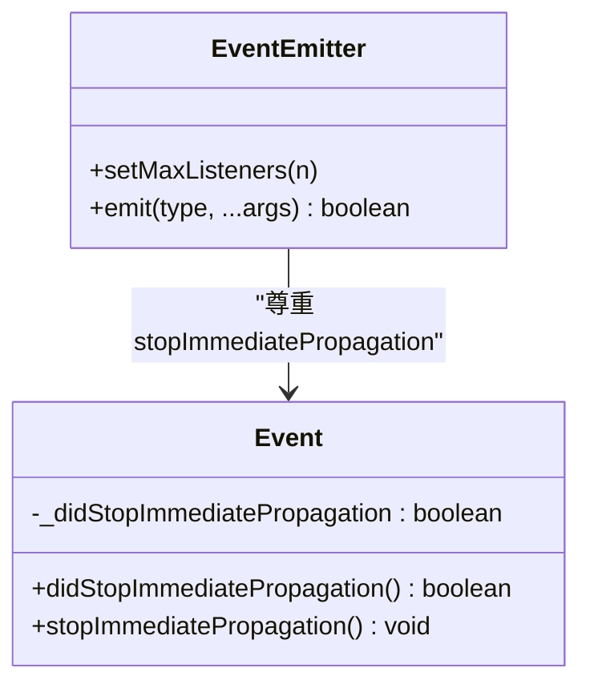
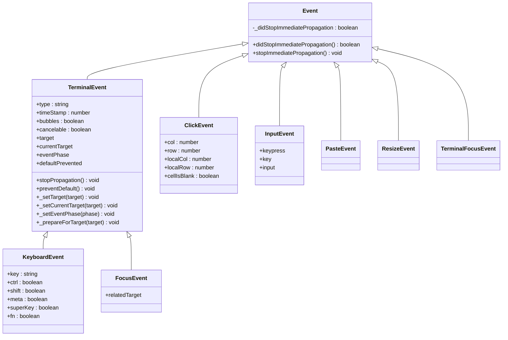
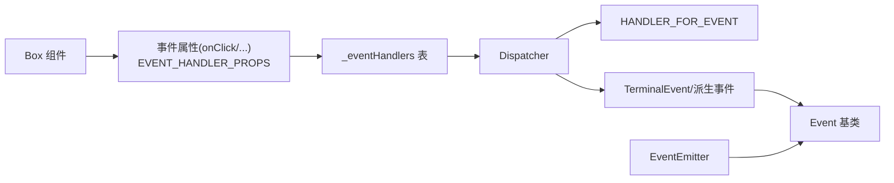

# 事件系统架构

<cite>
**本文引用的文件**
- [dispatcher.ts](file://src/ink/events/dispatcher.ts)
- [emitter.ts](file://src/ink/events/emitter.ts)
- [event.ts](file://src/ink/events/event.ts)
- [event-handlers.ts](file://src/ink/events/event-handlers.ts)
- [terminal-event.ts](file://src/ink/events/terminal-event.ts)
- [click-event.ts](file://src/ink/events/click-event.ts)
- [focus-event.ts](file://src/ink/events/focus-event.ts)
- [keyboard-event.ts](file://src/ink/events/keyboard-event.ts)
- [input-event.ts](file://src/ink/events/input-event.ts)
- [paste-event.ts](file://src/ink/events/paste-event.ts)
- [resize-event.ts](file://src/ink/events/resize-event.ts)
- [terminal-focus-event.ts](file://src/ink/events/terminal-focus-event.ts)
- [Box.tsx](file://src/ink/components/Box.tsx)
</cite>

## 目录
1. [简介](#简介)
2. [项目结构](#项目结构)
3. [核心组件](#核心组件)
4. [架构总览](#架构总览)
5. [详细组件分析](#详细组件分析)
6. [依赖关系分析](#依赖关系分析)
7. [性能考量](#性能考量)
8. [故障排查指南](#故障排查指南)
9. [结论](#结论)
10. [附录：接口与用法示例](#附录接口与用法示例)

## 简介
本文件系统性阐述 Ink 终端 UI 框架的事件系统架构，重点覆盖事件分发器（Dispatcher）的设计原理与实现机制、事件发射器（Emitter）的作用与监听器管理、事件处理器的注册与注销、事件冒泡与捕获流程，以及核心接口与使用示例。该事件体系在终端环境中模拟浏览器 DOM 的两阶段传播模型（捕获 → 到达目标 → 冒泡），并针对终端输入（键盘、鼠标、终端焦点）提供专用事件类型。

## 项目结构
事件系统位于 Ink 源码的事件子目录中，围绕“事件类型 + 分发器 + 处理器映射 + 发射器”组织，同时在组件层（如 Box）暴露事件属性供开发者使用。



图表来源
- [dispatcher.ts:161-234](file://src/ink/events/dispatcher.ts#L161-L234)
- [event-handlers.ts:44-74](file://src/ink/events/event-handlers.ts#L44-L74)
- [terminal-event.ts:19-102](file://src/ink/events/terminal-event.ts#L19-L102)
- [keyboard-event.ts:12-30](file://src/ink/events/keyboard-event.ts#L12-L30)
- [focus-event.ts:11-21](file://src/ink/events/focus-event.ts#L11-L21)
- [click-event.ts:10-38](file://src/ink/events/click-event.ts#L10-L38)
- [input-event.ts:192-205](file://src/ink/events/input-event.ts#L192-L205)
- [emitter.ts:6-39](file://src/ink/events/emitter.ts#L6-L39)
- [Box.tsx:25-46](file://src/ink/components/Box.tsx#L25-L46)

章节来源
- [dispatcher.ts:1-234](file://src/ink/events/dispatcher.ts#L1-L234)
- [event-handlers.ts:1-74](file://src/ink/events/event-handlers.ts#L1-L74)
- [terminal-event.ts:1-108](file://src/ink/events/terminal-event.ts#L1-L108)
- [Box.tsx:1-214](file://src/ink/components/Box.tsx#L1-L214)

## 核心组件
- 事件基类与终端事件基类
  - Event：统一的事件对象，提供阻止立即传播的能力标记。
  - TerminalEvent：继承 Event，提供标准 DOM 风格的事件属性（type、timeStamp、target/currentTarget、eventPhase、stopPropagation、preventDefault 等），并暴露内部 setter 供分发器使用。
- 事件类型
  - KeyboardEvent：键盘按下事件，遵循浏览器语义（key、ctrl、shift、meta/super/fn 等）。
  - FocusEvent：组件焦点变化事件，支持捕获/冒泡。
  - ClickEvent：鼠标点击事件，包含屏幕坐标与相对局部坐标信息。
  - InputEvent：文本输入事件，负责解析按键序列并生成可输入字符。
  - PasteEvent、ResizeEvent、TerminalFocusEvent：分别对应粘贴、窗口大小变化、终端窗口焦点变化等事件。
- 事件处理器映射
  - HANDLER_FOR_EVENT：将事件类型字符串映射到 React 风格的属性名（onEvent、onEventCapture），用于从节点属性中快速定位处理器。
  - EVENT_HANDLER_PROPS：所有事件处理器属性集合，便于渲染器识别并存储到节点的事件处理器表中。
- 分发器（Dispatcher）
  - 负责收集监听器、按捕获→到达目标→冒泡顺序执行、根据事件类型推断调度优先级、处理默认行为与传播控制。
- 发射器（EventEmitter）
  - Node EventEmitter 的增强版本，对 Ink 自有 Event 类型尊重 stopImmediatePropagation 行为，且禁用默认过多监听者警告以适配 React 场景。

章节来源
- [event.ts:1-12](file://src/ink/events/event.ts#L1-L12)
- [terminal-event.ts:19-102](file://src/ink/events/terminal-event.ts#L19-L102)
- [keyboard-event.ts:12-52](file://src/ink/events/keyboard-event.ts#L12-L52)
- [focus-event.ts:11-22](file://src/ink/events/focus-event.ts#L11-L22)
- [click-event.ts:10-39](file://src/ink/events/click-event.ts#L10-L39)
- [input-event.ts:192-206](file://src/ink/events/input-event.ts#L192-L206)
- [event-handlers.ts:44-74](file://src/ink/events/event-handlers.ts#L44-L74)
- [dispatcher.ts:161-234](file://src/ink/events/dispatcher.ts#L161-L234)
- [emitter.ts:6-39](file://src/ink/events/emitter.ts#L6-L39)

## 架构总览
事件系统采用“事件类型 + 属性驱动 + 两阶段分发”的架构模式：

- 事件类型
  - 通过继承 Event 或 TerminalEvent 提供统一能力，并扩展终端特有的输入与交互语义。
- 事件处理器注册
  - 组件通过属性（如 onClick、onFocus、onKeyDown、onKeyDownCapture 等）声明处理器；渲染器将其存入节点的事件处理器表。
- 事件分发
  - Dispatcher 依据事件类型与节点树向上收集监听器，形成捕获链（根到目标）与冒泡链（目标到根），逐个调用处理器。
- 传播控制
  - 支持 stopPropagation、stopImmediatePropagation、preventDefault，以及基于事件类型的优先级调度（离散/连续/默认）。



图表来源
- [dispatcher.ts:185-201](file://src/ink/events/dispatcher.ts#L185-L201)
- [dispatcher.ts:46-79](file://src/ink/events/dispatcher.ts#L46-L79)
- [dispatcher.ts:87-114](file://src/ink/events/dispatcher.ts#L87-L114)
- [terminal-event.ts:70-101](file://src/ink/events/terminal-event.ts#L70-L101)

章节来源
- [dispatcher.ts:1-234](file://src/ink/events/dispatcher.ts#L1-L234)
- [terminal-event.ts:1-108](file://src/ink/events/terminal-event.ts#L1-L108)

## 详细组件分析

### 分发器（Dispatcher）设计与实现
- 监听器收集（collectListeners）
  - 从目标节点沿父链向上收集，捕获阶段处理器使用 unshift（根到目标），冒泡阶段处理器使用 push（目标到根），最终得到完整分发顺序。
- 处理队列执行（processDispatchQueue）
  - 在每次调用前设置事件阶段与当前目标，调用处理器时捕获异常并记录日志；若调用 stopImmediatePropagation，则后续监听器不再执行；若调用 stopPropagation，则仅在同一节点上停止后续执行。
- 事件优先级（getEventPriority/discreteUpdates/continuousUpdates）
  - 根据事件类型映射到离散/连续/默认优先级；离散事件（键盘、点击、焦点、粘贴）走同步优先级；高频率事件（resize、scroll、mousemove）走连续优先级；可通过注入的 discreteUpdates 包裹以确保同步更新。
- 返回值
  - 返回是否未调用 preventDefault，供上层判断是否继续默认行为。



图表来源
- [dispatcher.ts:185-201](file://src/ink/events/dispatcher.ts#L185-L201)
- [dispatcher.ts:87-114](file://src/ink/events/dispatcher.ts#L87-L114)
- [dispatcher.ts:122-138](file://src/ink/events/dispatcher.ts#L122-L138)

章节来源
- [dispatcher.ts:1-234](file://src/ink/events/dispatcher.ts#L1-L234)

### 事件处理器映射与注册
- HANDLER_FOR_EVENT
  - 将事件类型字符串映射到 React 风格的属性名（捕获与冒泡），实现 O(1) 查找。
- EVENT_HANDLER_PROPS
  - 渲染器据此识别事件属性并写入节点的事件处理器表（_eventHandlers）。
- 组件侧注册
  - 组件通过属性声明处理器（如 onClick、onFocus、onKeyDown、onKeyDownCapture），渲染器在构建节点时将这些属性写入 _eventHandlers。

```mermaid
classDiagram
class EventHandlerProps {
+onKeyDown
+onKeyDownCapture
+onFocus
+onFocusCapture
+onBlur
+onBlurCapture
+onPaste
+onPasteCapture
+onResize
+onClick
+onMouseEnter
+onMouseLeave
}
class HANDLER_FOR_EVENT {
+映射 : "keydown" -> {bubble : "onKeyDown", capture : "onKeyDownCapture"}
+映射 : "focus" -> {bubble : "onFocus", capture : "onFocusCapture"}
+映射 : "blur" -> {bubble : "onBlur", capture : "onBlurCapture"}
+映射 : "paste" -> {bubble : "onPaste", capture : "onPasteCapture"}
+映射 : "resize" -> {bubble : "onResize"}
+映射 : "click" -> {bubble : "onClick"}
}
EventHandlerProps --> HANDLER_FOR_EVENT : "属性名与事件类型映射"
```

图表来源
- [event-handlers.ts:21-54](file://src/ink/events/event-handlers.ts#L21-L54)
- [event-handlers.ts:44-54](file://src/ink/events/event-handlers.ts#L44-L54)

章节来源
- [event-handlers.ts:1-74](file://src/ink/events/event-handlers.ts#L1-L74)
- [Box.tsx:25-46](file://src/ink/components/Box.tsx#L25-L46)

### 事件发射器（EventEmitter）
- 功能
  - Node EventEmitter 的子类，但对 Ink 的 Event 对象尊重 stopImmediatePropagation，确保一旦调用立即阻止后续监听器执行。
  - 默认禁用最大监听者数量警告，避免在 React 多组件监听同一事件时产生噪音。
- 使用场景
  - 适用于非 DOM 树内的事件发布/订阅，例如内部模块间通信或钩子触发。



图表来源
- [emitter.ts:6-39](file://src/ink/events/emitter.ts#L6-L39)
- [event.ts:1-12](file://src/ink/events/event.ts#L1-L12)

章节来源
- [emitter.ts:1-40](file://src/ink/events/emitter.ts#L1-L40)
- [event.ts:1-12](file://src/ink/events/event.ts#L1-L12)

### 事件类型与语义
- KeyboardEvent
  - 语义与浏览器一致：key 表示字符或特殊键名；修饰键（ctrl、shift、meta/super、fn）由解析结果决定。
- FocusEvent
  - 支持捕获/冒泡，focus 在新焦点元素触发，blur 在旧焦点元素触发。
- ClickEvent
  - 仅在启用鼠标跟踪时触发；包含绝对坐标与相对局部坐标，便于容器内事件处理。
- InputEvent
  - 负责解析复杂终端序列（CSI u、modifyOtherKeys、应用小键盘等），过滤不可见字符，生成可输入文本。
- PasteEvent、ResizeEvent、TerminalFocusEvent
  - 分别对应粘贴、窗口尺寸变化、终端焦点变化事件。



图表来源
- [terminal-event.ts:19-102](file://src/ink/events/terminal-event.ts#L19-L102)
- [keyboard-event.ts:12-30](file://src/ink/events/keyboard-event.ts#L12-L30)
- [focus-event.ts:11-21](file://src/ink/events/focus-event.ts#L11-L21)
- [click-event.ts:10-38](file://src/ink/events/click-event.ts#L10-L38)
- [input-event.ts:192-205](file://src/ink/events/input-event.ts#L192-L205)
- [paste-event.ts:1-2](file://src/ink/events/paste-event.ts#L1-L2)
- [resize-event.ts:1-2](file://src/ink/events/resize-event.ts#L1-L2)
- [terminal-focus-event.ts:12-19](file://src/ink/events/terminal-focus-event.ts#L12-L19)

章节来源
- [terminal-event.ts:1-108](file://src/ink/events/terminal-event.ts#L1-L108)
- [keyboard-event.ts:1-52](file://src/ink/events/keyboard-event.ts#L1-L52)
- [focus-event.ts:1-22](file://src/ink/events/focus-event.ts#L1-L22)
- [click-event.ts:1-39](file://src/ink/events/click-event.ts#L1-L39)
- [input-event.ts:1-206](file://src/ink/events/input-event.ts#L1-L206)
- [paste-event.ts:1-2](file://src/ink/events/paste-event.ts#L1-L2)
- [resize-event.ts:1-2](file://src/ink/events/resize-event.ts#L1-L2)
- [terminal-focus-event.ts:1-20](file://src/ink/events/terminal-focus-event.ts#L1-L20)

### 组件层事件绑定（以 Box 为例）
- Box 组件通过属性声明事件处理器（如 onClick、onFocus、onFocusCapture、onBlur、onBlurCapture、onKeyDown、onKeyDownCapture、onMouseEnter、onMouseLeave），这些属性最终被渲染器识别并写入节点的事件处理器表，从而参与分发器的两阶段传播。

章节来源
- [Box.tsx:25-46](file://src/ink/components/Box.tsx#L25-L46)

## 依赖关系分析
- 组件到事件
  - 组件通过属性声明事件处理器，渲染器将属性写入节点的事件处理器表，供分发器查询。
- 分发器到事件
  - 分发器依赖 HANDLER_FOR_EVENT 将事件类型映射到属性名，再从节点属性中读取处理器。
- 事件到基类
  - 所有事件共享 Event 基类提供的传播控制能力；TerminalEvent 进一步提供 DOM 风格的事件 API。
- 发射器到事件
  - EventEmitter 对 Ink 的 Event 类型进行兼容，确保 stopImmediatePropagation 生效。



图表来源
- [Box.tsx:25-46](file://src/ink/components/Box.tsx#L25-L46)
- [event-handlers.ts:60-74](file://src/ink/events/event-handlers.ts#L60-L74)
- [dispatcher.ts:19-34](file://src/ink/events/dispatcher.ts#L19-L34)
- [terminal-event.ts:19-102](file://src/ink/events/terminal-event.ts#L19-L102)
- [emitter.ts:6-39](file://src/ink/events/emitter.ts#L6-L39)

章节来源
- [Box.tsx:1-214](file://src/ink/components/Box.tsx#L1-L214)
- [event-handlers.ts:1-74](file://src/ink/events/event-handlers.ts#L1-L74)
- [dispatcher.ts:1-234](file://src/ink/events/dispatcher.ts#L1-L234)
- [terminal-event.ts:1-108](file://src/ink/events/terminal-event.ts#L1-L108)
- [emitter.ts:1-40](file://src/ink/events/emitter.ts#L1-L40)

## 性能考量
- 事件优先级
  - 离散事件（键盘、点击、焦点、粘贴）使用离散优先级，保证用户交互响应及时；高频事件（resize、scroll、mousemove）使用连续优先级，避免阻塞主线程。
- 同步更新包裹
  - 通过注入的 discreteUpdates，在需要时将事件处理包裹在同步更新中，确保状态变更与视图更新的一致性。
- 异常隔离
  - 分发过程中捕获处理器抛出的异常并记录日志，避免中断整个分发流程。

章节来源
- [dispatcher.ts:122-138](file://src/ink/events/dispatcher.ts#L122-L138)
- [dispatcher.ts:207-218](file://src/ink/events/dispatcher.ts#L207-L218)
- [dispatcher.ts:106-110](file://src/ink/events/dispatcher.ts#L106-L110)

## 故障排查指南
- 事件未触发
  - 检查事件属性是否正确声明（如 onClick、onKeyDown、onFocus 等），确认渲染器已将其写入节点的事件处理器表。
- 事件未冒泡/捕获
  - 确认事件类型是否支持冒泡（如 FocusEvent、ClickEvent 支持），并在处理器中未过早调用 stopPropagation/stopImmediatePropagation。
- 默认行为未生效
  - 检查事件是否可取消（cancelable），以及是否调用了 preventDefault。
- 高频事件卡顿
  - 对于 resize 等高频事件，确认使用连续优先级路径；必要时减少昂贵的副作用逻辑。
- 终端焦点事件
  - TerminalFocusEvent 由终端焦点报告协议触发，需确保终端配置支持焦点报告。

章节来源
- [terminal-event.ts:55-68](file://src/ink/events/terminal-event.ts#L55-L68)
- [focus-event.ts:11-21](file://src/ink/events/focus-event.ts#L11-L21)
- [click-event.ts:10-38](file://src/ink/events/click-event.ts#L10-L38)
- [terminal-focus-event.ts:12-19](file://src/ink/events/terminal-focus-event.ts#L12-L19)

## 结论
Ink 的事件系统在终端环境中实现了接近浏览器 DOM 的两阶段传播模型，结合事件优先级与传播控制，既满足交互响应的实时性，又兼顾高频事件的稳定性。通过属性驱动的处理器注册与集中式分发器，系统具备良好的可扩展性与可维护性。对于自定义事件类型，建议遵循现有事件基类与命名约定，以便无缝融入分发与优先级体系。

## 附录：接口与用法示例
- 事件处理器注册与注销
  - 注册：在组件属性中声明处理器（如 onClick、onFocus、onKeyDown、onKeyDownCapture）。
  - 注销：移除属性或在运行时切换条件渲染，使渲染器不再写入对应处理器。
- 事件传播控制
  - 在处理器中调用 stopPropagation（完全停止后续传播）、stopImmediatePropagation（仅阻止同节点后续处理器）、preventDefault（阻止默认行为，仅对可取消事件有效）。
- 事件优先级
  - 离散事件：dispatchDiscrete；连续事件：dispatchContinuous；默认：dispatch。
- 自定义事件类型
  - 若需新增事件类型，建议继承 Event（简单事件）或 TerminalEvent（需要 DOM 风格 API 的事件），并在 HANDLER_FOR_EVENT 中添加映射，确保渲染器能识别并写入处理器。

章节来源
- [Box.tsx:25-46](file://src/ink/components/Box.tsx#L25-L46)
- [event-handlers.ts:44-74](file://src/ink/events/event-handlers.ts#L44-L74)
- [terminal-event.ts:55-68](file://src/ink/events/terminal-event.ts#L55-L68)
- [dispatcher.ts:185-232](file://src/ink/events/dispatcher.ts#L185-L232)