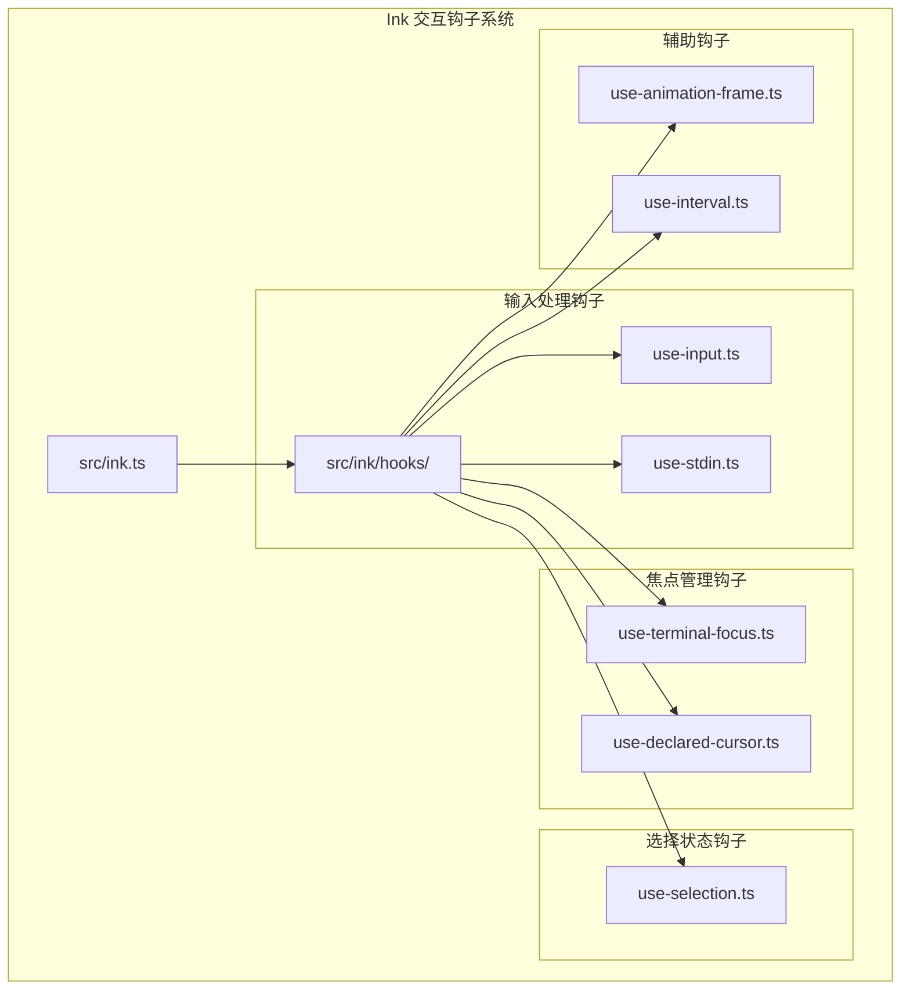
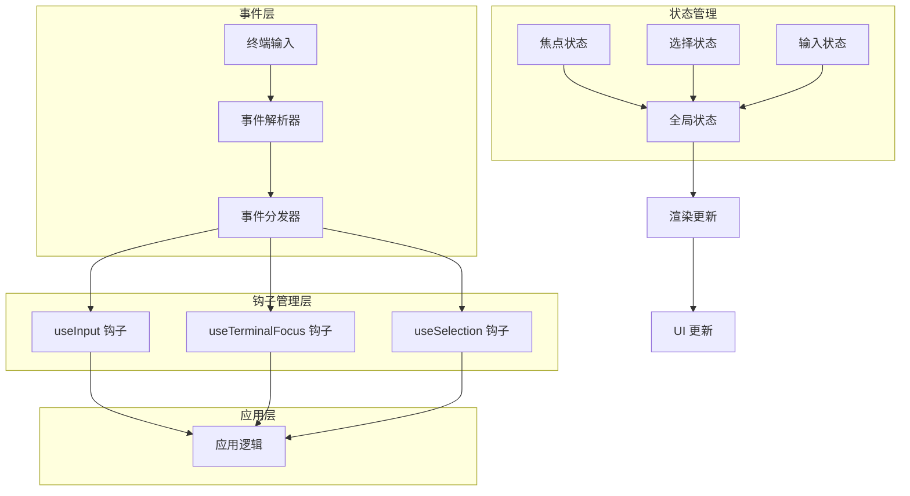
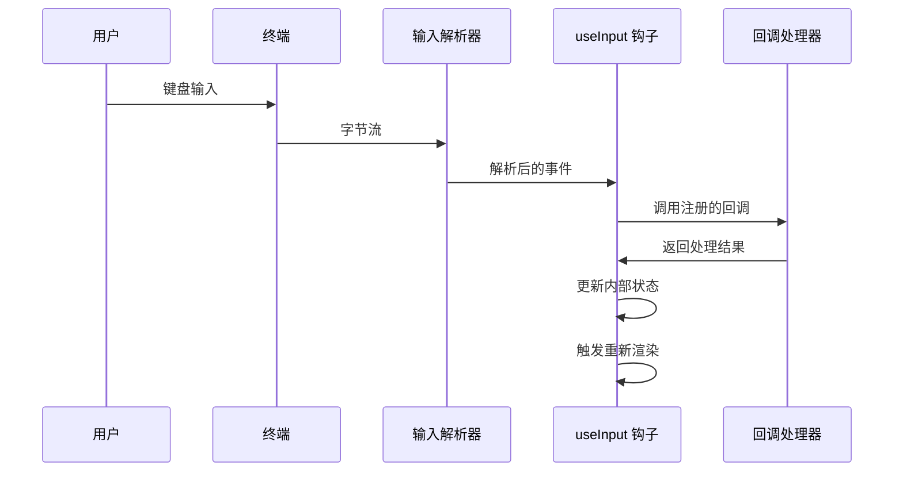
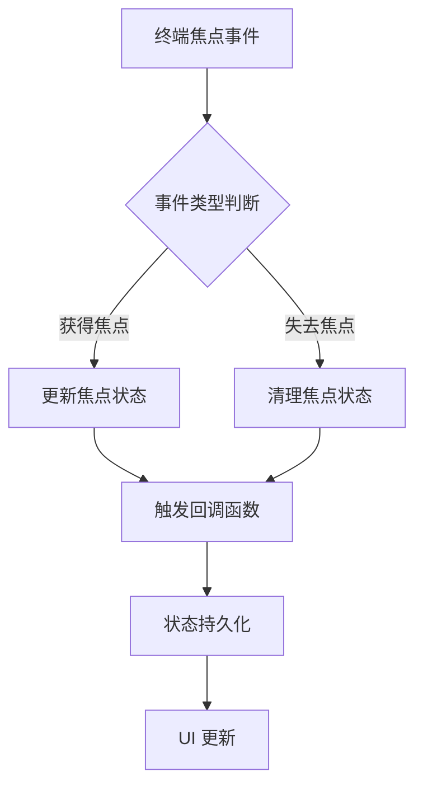
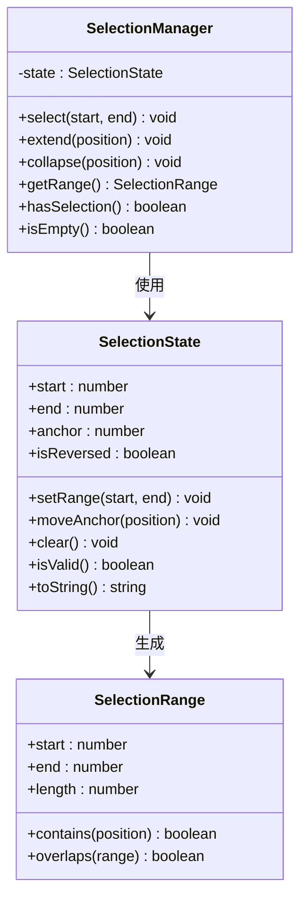
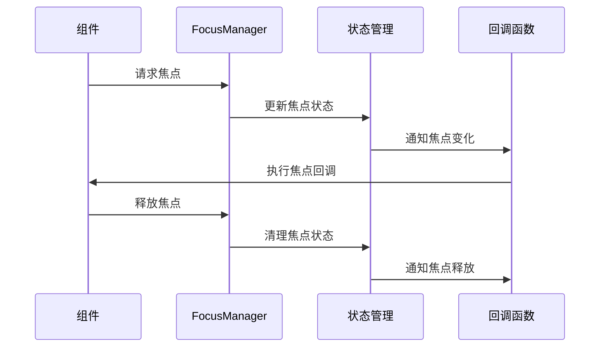
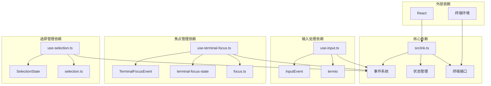

# 交互钩子系统

<cite>
**本文档引用的文件**
- [src/ink.ts](file://src/ink.ts)
- [src/ink/hooks/use-input.ts](file://src/ink/hooks/use-input.ts)
- [src/ink/hooks/use-selection.ts](file://src/ink/hooks/use-selection.ts)
- [src/ink/hooks/use-terminal-focus.ts](file://src/ink/hooks/use-terminal-focus.ts)
- [src/ink/focus.ts](file://src/ink/focus.ts)
- [src/ink/selection.ts](file://src/ink/selection.ts)
- [src/ink/events/input-event.ts](file://src/ink/events/input-event.ts)
- [src/ink/events/terminal-focus-event.ts](file://src/ink/events/terminal-focus-event.ts)
- [src/ink/termio.ts](file://src/ink/termio.ts)
- [src/ink/terminal-focus-state.ts](file://src/ink/terminal-focus-state.ts)
</cite>

## 目录
1. [简介](#简介)
2. [项目结构](#项目结构)
3. [核心组件](#核心组件)
4. [架构概览](#架构概览)
5. [详细组件分析](#详细组件分析)
6. [依赖关系分析](#依赖关系分析)
7. [性能考虑](#性能考虑)
8. [故障排除指南](#故障排除指南)
9. [结论](#结论)

## 简介

Ink 终端 UI 框架的交互钩子系统是构建响应式终端应用程序的核心机制。该系统提供了多种专用钩子来处理用户输入、焦点管理和选择状态等交互功能。

本系统的设计理念基于 React 的 Hooks 模式，通过自定义钩子提供声明式的交互能力。每个钩子都专注于特定的交互场景，同时保持与其他钩子的良好协作。

## 项目结构

Ink 交互钩子系统主要位于 `src/ink/hooks/` 目录下，包含以下核心文件：

**图表来源**
- [src/ink.ts:59-85](file://src/ink.ts#L59-L85)
- [src/ink/hooks/use-input.ts](file://src/ink/hooks/use-input.ts)
- [src/ink/hooks/use-terminal-focus.ts](file://src/ink/hooks/use-terminal-focus.ts)
- [src/ink/hooks/use-selection.ts](file://src/ink/hooks/use-selection.ts)

**章节来源**
- [src/ink.ts:59-85](file://src/ink.ts#L59-L85)

## 核心组件

Ink 交互钩子系统包含以下主要组件：

### 输入处理组件
- **useInput**: 处理键盘输入事件
- **useStdin**: 直接访问标准输入流

### 焦点管理组件  
- **useTerminalFocus**: 管理终端焦点状态
- **useDeclaredCursor**: 声明式光标控制

### 选择状态组件
- **useSelection**: 管理文本选择状态

### 辅助组件
- **useAnimationFrame**: 动画帧管理
- **useInterval**: 定时器管理

**章节来源**
- [src/ink.ts:73-82](file://src/ink.ts#L73-L82)

## 架构概览

Ink 交互钩子系统的整体架构采用分层设计，从底层事件处理到高层应用逻辑形成清晰的抽象层次：

**图表来源**
- [src/ink/events/input-event.ts](file://src/ink/events/input-event.ts)
- [src/ink/events/terminal-focus-event.ts](file://src/ink/events/terminal-focus-event.ts)
- [src/ink/focus.ts](file://src/ink/focus.ts)
- [src/ink/selection.ts](file://src/ink/selection.ts)

## 详细组件分析

### useInput 钩子分析

useInput 钩子是处理用户键盘输入的核心组件，负责监听和处理各种类型的输入事件。

#### 设计理念
- **声明式输入处理**: 通过回调函数提供声明式的输入处理方式
- **事件类型分离**: 区分不同类型和组合键的输入事件
- **状态管理**: 自动管理输入状态和副作用

#### 实现机制

**图表来源**
- [src/ink/hooks/use-input.ts](file://src/ink/hooks/use-input.ts)
- [src/ink/events/input-event.ts](file://src/ink/events/input-event.ts)

#### 关键特性
- **多事件支持**: 支持普通字符、功能键、组合键等多种输入类型
- **回调链**: 允许多个回调按顺序执行
- **自动去重**: 防止重复输入事件的处理
- **异步处理**: 支持异步回调函数

**章节来源**
- [src/ink/hooks/use-input.ts](file://src/ink/hooks/use-input.ts)

### useTerminalFocus 钩子分析

useTerminalFocus 钩子专门用于管理终端焦点状态，确保应用程序能够正确响应焦点变化。

#### 设计理念
- **焦点状态同步**: 保持应用程序内部状态与终端焦点状态一致
- **事件驱动**: 基于终端焦点事件进行状态更新
- **跨平台兼容**: 支持不同终端环境的焦点检测

#### 实现机制

**图表来源**
- [src/ink/hooks/use-terminal-focus.ts](file://src/ink/hooks/use-terminal-focus.ts)
- [src/ink/events/terminal-focus-event.ts](file://src/ink/events/terminal-focus-event.ts)
- [src/ink/terminal-focus-state.ts](file://src/ink/terminal-focus-state.ts)

#### 关键特性
- **实时监控**: 持续监控终端焦点状态变化
- **状态缓存**: 缓存当前焦点状态以提高性能
- **事件聚合**: 合并相似的焦点事件
- **错误恢复**: 处理焦点状态异常情况

**章节来源**
- [src/ink/hooks/use-terminal-focus.ts](file://src/ink/hooks/use-terminal-focus.ts)

### useSelection 钩子分析

useSelection 钩子负责管理文本选择状态，提供选择区域的创建、修改和查询功能。

#### 设计理念
- **选择状态抽象**: 将复杂的文本选择逻辑封装在简单接口后
- **范围计算**: 提供精确的选择范围计算和验证
- **增量更新**: 支持选择状态的增量更新和批量操作

#### 实现机制

**图表来源**
- [src/ink/hooks/use-selection.ts](file://src/ink/hooks/use-selection.ts)
- [src/ink/selection.ts](file://src/ink/selection.ts)

#### 关键特性
- **范围验证**: 确保选择范围的有效性和一致性
- **方向感知**: 支持正向和反向选择状态
- **边界处理**: 正确处理选择边界情况
- **性能优化**: 使用高效的数据结构存储选择状态

**章节来源**
- [src/ink/hooks/use-selection.ts](file://src/ink/hooks/use-selection.ts)

### useFocus 钩子分析

useFocus 钩子提供更高级的焦点管理功能，包括焦点监听和状态同步。

#### 设计理念
- **组件级焦点**: 针对单个组件的焦点管理
- **生命周期集成**: 与 React 组件生命周期深度集成
- **上下文传递**: 支持焦点状态在组件树中的传递

#### 实现机制

**图表来源**
- [src/ink/focus.ts](file://src/ink/focus.ts)

#### 关键特性
- **组件绑定**: 将焦点状态与特定组件绑定
- **自动清理**: 自动处理组件卸载时的焦点清理
- **优先级管理**: 支持多个组件的焦点优先级
- **事件传播**: 控制焦点事件在组件树中的传播

**章节来源**
- [src/ink/focus.ts](file://src/ink/focus.ts)

## 依赖关系分析

Ink 交互钩子系统各组件之间的依赖关系如下：

**图表来源**
- [src/ink.ts:59-85](file://src/ink.ts#L59-L85)
- [src/ink/hooks/use-input.ts](file://src/ink/hooks/use-input.ts)
- [src/ink/hooks/use-terminal-focus.ts](file://src/ink/hooks/use-terminal-focus.ts)
- [src/ink/hooks/use-selection.ts](file://src/ink/hooks/use-selection.ts)

**章节来源**
- [src/ink.ts:59-85](file://src/ink.ts#L59-L85)

## 性能考虑

### 状态更新优化
- **批量更新**: 合并多个状态变更以减少渲染次数
- **防抖处理**: 对频繁的输入事件进行防抖处理
- **内存管理**: 及时清理不再使用的事件监听器

### 渲染性能
- **最小化重渲染**: 仅在必要时触发组件重渲染
- **虚拟化支持**: 支持大型列表的选择和滚动优化
- **懒加载**: 延迟初始化不常用的钩子功能

### 内存使用
- **事件池**: 复用事件对象以减少内存分配
- **弱引用**: 使用弱引用来避免循环引用
- **清理策略**: 确保组件卸载时释放所有资源

## 故障排除指南

### 常见问题及解决方案

#### 输入事件丢失
**症状**: 用户按键无响应或响应延迟
**原因**: 事件监听器未正确设置或被其他组件覆盖
**解决方案**: 
- 检查事件监听器的注册顺序
- 确保在正确的生命周期阶段注册监听器
- 验证事件冒泡是否被意外阻止

#### 焦点状态异常
**症状**: 应用程序无法正确响应焦点变化
**原因**: 焦点状态不同步或事件处理错误
**解决方案**:
- 检查焦点事件的处理逻辑
- 验证焦点状态的持久化机制
- 确认跨组件的焦点状态同步

#### 选择状态错误
**症状**: 文本选择显示异常或选择范围不正确
**原因**: 选择状态计算错误或边界条件处理不当
**解决方案**:
- 验证选择范围的边界检查
- 检查选择方向的正确性
- 确认选择状态的原子性更新

**章节来源**
- [src/ink/hooks/use-input.ts](file://src/ink/hooks/use-input.ts)
- [src/ink/hooks/use-terminal-focus.ts](file://src/ink/hooks/use-terminal-focus.ts)
- [src/ink/hooks/use-selection.ts](file://src/ink/hooks/use-selection.ts)

## 结论

Ink 交互钩子系统通过精心设计的架构和实现，为终端应用程序提供了强大而灵活的交互能力。系统的主要优势包括：

1. **模块化设计**: 每个钩子专注于特定功能，便于理解和维护
2. **性能优化**: 采用多种优化技术确保流畅的用户体验
3. **错误处理**: 完善的错误处理和恢复机制
4. **扩展性**: 良好的架构支持新功能的添加和现有功能的改进

通过遵循本文档的最佳实践和性能建议，开发者可以充分利用 Ink 交互钩子系统的能力，构建高质量的终端应用程序。