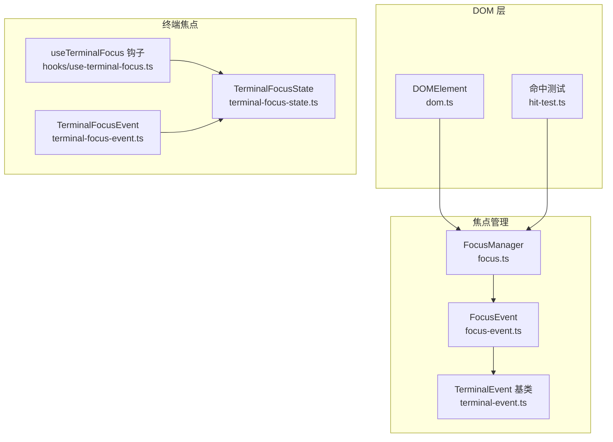
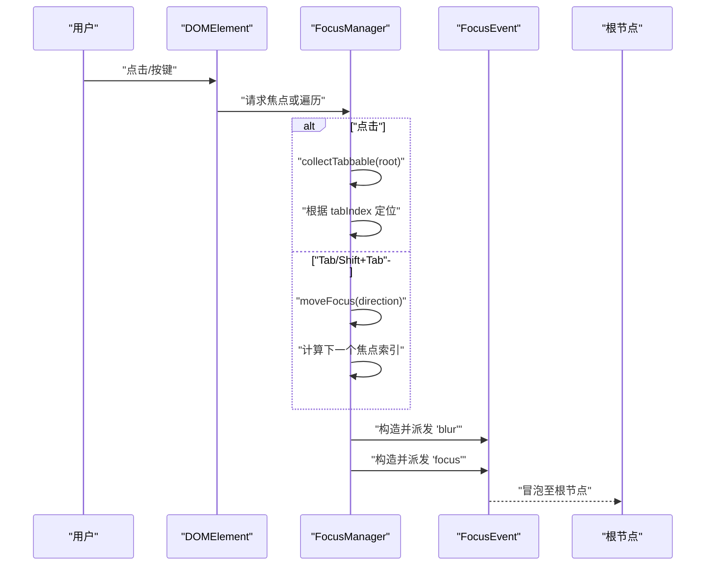
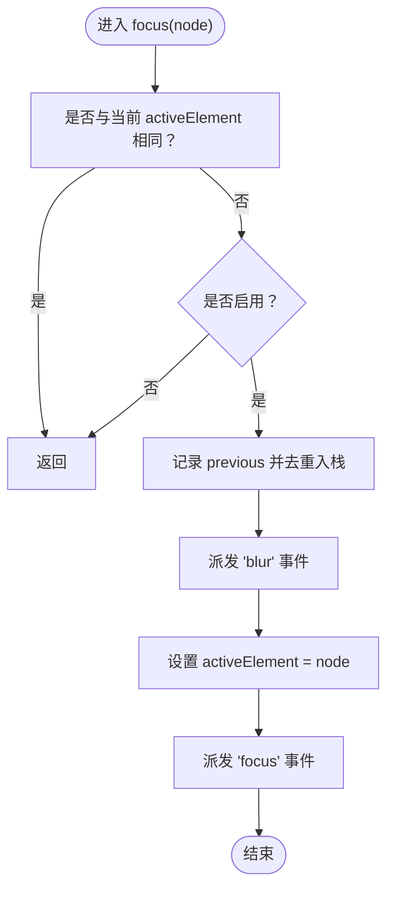
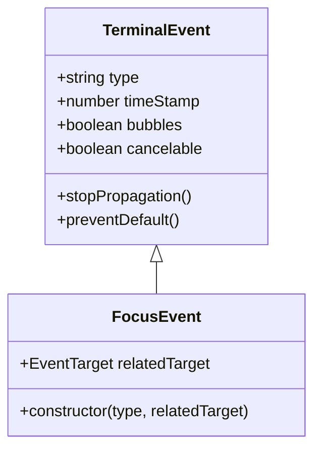
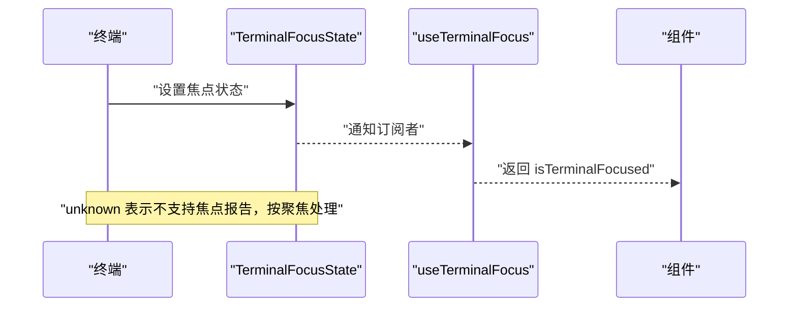
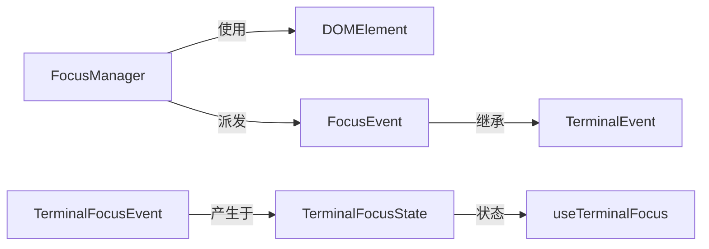

# 焦点管理系统

<cite>
**本文档引用的文件**
- [src/ink/focus.ts](file://src/ink/focus.ts)
- [src/ink/events/focus-event.ts](file://src/ink/events/focus-event.ts)
- [src/ink/events/terminal-focus-event.ts](file://src/ink/events/terminal-focus-event.ts)
- [src/ink/events/terminal-event.ts](file://src/ink/events/terminal-event.ts)
- [src/ink/terminal-focus-state.ts](file://src/ink/terminal-focus-state.ts)
- [src/ink/dom.ts](file://src/ink/dom.ts)
- [src/ink/hooks/use-terminal-focus.ts](file://src/ink/hooks/use-terminal-focus.ts)
- [src/ink/hit-test.ts](file://src/ink/hit-test.ts)
</cite>

## 目录
1. [简介](#简介)
2. [项目结构](#项目结构)
3. [核心组件](#核心组件)
4. [架构概览](#架构概览)
5. [详细组件分析](#详细组件分析)
6. [依赖关系分析](#依赖关系分析)
7. [性能考量](#性能考量)
8. [故障排除指南](#故障排除指南)
9. [结论](#结论)

## 简介
本文件系统化阐述 Ink 终端 UI 框架的焦点管理系统，覆盖以下主题：
- 焦点获取与失去的机制与生命周期
- 焦点遍历算法与可聚焦约束规则
- 焦点事件（FocusEvent）的触发条件与处理流程
- 终端焦点事件（TerminalFocusEvent）的特殊处理方式
- 焦点状态查询与焦点移动的实用方法
- 可访问性与用户体验最佳实践

## 项目结构
围绕焦点管理的核心代码位于 Ink 模块的以下文件中：
- 焦点管理器与遍历逻辑：src/ink/focus.ts
- 事件模型与焦点事件：src/ink/events/*.ts
- DOM 树节点与焦点归属：src/ink/dom.ts
- 终端焦点状态信号与钩子：src/ink/terminal-focus-state.ts、src/ink/hooks/use-terminal-focus.ts
- 点击命中测试与点击到焦点的桥接：src/ink/hit-test.ts

**图表来源**
- [src/ink/focus.ts:15-182](file://src/ink/focus.ts#L15-L182)
- [src/ink/events/focus-event.ts:11-22](file://src/ink/events/focus-event.ts#L11-L22)
- [src/ink/events/terminal-event.ts:19-108](file://src/ink/events/terminal-event.ts#L19-L108)
- [src/ink/dom.ts:31-91](file://src/ink/dom.ts#L31-L91)
- [src/ink/hit-test.ts:57-62](file://src/ink/hit-test.ts#L57-L62)
- [src/ink/terminal-focus-state.ts:1-48](file://src/ink/terminal-focus-state.ts#L1-L48)
- [src/ink/hooks/use-terminal-focus.ts:13-17](file://src/ink/hooks/use-terminal-focus.ts#L13-L17)
- [src/ink/events/terminal-focus-event.ts:12-20](file://src/ink/events/terminal-focus-event.ts#L12-L20)

**章节来源**
- [src/ink/focus.ts:15-182](file://src/ink/focus.ts#L15-L182)
- [src/ink/dom.ts:31-91](file://src/ink/dom.ts#L31-L91)

## 核心组件
- FocusManager：负责维护 activeElement、焦点栈、焦点遍历与节点移除时的焦点恢复。
- FocusEvent：组件级焦点变更事件，支持冒泡传播。
- TerminalEvent：所有终端事件的基类，提供 DOM 风格的事件属性与传播控制。
- DOMElement：承载 focusManager 的根节点，使任意子节点可通过父链访问焦点管理器。
- TerminalFocusState：非 React 环境下的终端窗口焦点状态信号，配合 useTerminalFocus 提供同步订阅能力。
- TerminalFocusEvent：由终端焦点报告（DECSET 1004）产生的事件类型。

**章节来源**
- [src/ink/focus.ts:15-182](file://src/ink/focus.ts#L15-L182)
- [src/ink/events/focus-event.ts:11-22](file://src/ink/events/focus-event.ts#L11-L22)
- [src/ink/events/terminal-event.ts:19-108](file://src/ink/events/terminal-event.ts#L19-L108)
- [src/ink/dom.ts:31-91](file://src/ink/dom.ts#L31-L91)
- [src/ink/terminal-focus-state.ts:1-48](file://src/ink/terminal-focus-state.ts#L1-L48)
- [src/ink/events/terminal-focus-event.ts:12-20](file://src/ink/events/terminal-focus-event.ts#L12-L20)

## 架构概览
焦点管理在 Ink 中采用“树内焦点”与“终端焦点”双层设计：
- 树内焦点：基于 DOMElement 的 tabIndex 约束，通过 FocusManager 实现循环遍历与事件分发。
- 终端焦点：基于 DECSET 1004 的终端焦点报告，通过 TerminalFocusState 与 useTerminalFocus 提供状态查询。

**图表来源**
- [src/ink/focus.ts:27-131](file://src/ink/focus.ts#L27-L131)
- [src/ink/events/focus-event.ts:11-22](file://src/ink/events/focus-event.ts#L11-L22)
- [src/ink/dom.ts:83-85](file://src/ink/dom.ts#L83-L85)

## 详细组件分析

### FocusManager：焦点获取、遍历与恢复
- 关键职责
  - 维护 activeElement 与有限长度（最大 32）的焦点栈，避免无界增长。
  - 处理 focus(node)、blur()、focusNext(root)、focusPrevious(root) 等操作。
  - 在节点从树中移除时，清理焦点栈并尝试从栈中恢复焦点。
  - 支持启用/禁用焦点管理，便于调试或批量操作。
- 焦点遍历算法
  - 使用 collectTabbable(root) 收集所有 tabIndex ≥ 0 的可聚焦元素，按深度优先遍历顺序排列。
  - 当前无活动元素时，方向为正则从头开始，方向为负则从尾开始；否则按方向取模循环。
- 节点移除处理
  - 过滤掉被移除节点及其后代；若当前活动元素被移除，则从焦点栈中弹出最近仍存在的元素作为新活动元素。
- 点击到焦点
  - handleClickFocus(node) 仅当节点 attributes['tabIndex'] 为非负数时才聚焦。

**图表来源**
- [src/ink/focus.ts:27-42](file://src/ink/focus.ts#L27-L42)

**章节来源**
- [src/ink/focus.ts:15-182](file://src/ink/focus.ts#L15-L182)

### FocusEvent：组件级焦点事件
- 继承自 TerminalEvent，具备 DOM 风格的 target/currentTarget/eventPhase/stopPropagation 等能力。
- 事件类型：'focus' 与 'blur'，均支持冒泡，便于父组件观察后代焦点变化。
- relatedTarget：表示与本次切换相关的另一个目标（例如从谁到谁）。

**图表来源**
- [src/ink/events/terminal-event.ts:19-108](file://src/ink/events/terminal-event.ts#L19-L108)
- [src/ink/events/focus-event.ts:11-22](file://src/ink/events/focus-event.ts#L11-L22)

**章节来源**
- [src/ink/events/focus-event.ts:11-22](file://src/ink/events/focus-event.ts#L11-L22)
- [src/ink/events/terminal-event.ts:19-108](file://src/ink/events/terminal-event.ts#L19-L108)

### TerminalFocusEvent：终端窗口焦点事件
- 类型：'terminalfocus' 与 'terminalblur'。
- 来源：终端焦点报告（DECSET 1004），由终端发送 CSI I（获得焦点）与 CSI O（失去焦点）序列。
- 状态信号：TerminalFocusState 提供 focused/blurred/unknown 三种状态，支持订阅与重置。

**图表来源**
- [src/ink/events/terminal-focus-event.ts:12-20](file://src/ink/events/terminal-focus-event.ts#L12-L20)
- [src/ink/terminal-focus-state.ts:1-48](file://src/ink/terminal-focus-state.ts#L1-L48)
- [src/ink/hooks/use-terminal-focus.ts:13-17](file://src/ink/hooks/use-terminal-focus.ts#L13-L17)

**章节来源**
- [src/ink/events/terminal-focus-event.ts:12-20](file://src/ink/events/terminal-focus-event.ts#L12-L20)
- [src/ink/terminal-focus-state.ts:1-48](file://src/ink/terminal-focus-state.ts#L1-L48)
- [src/ink/hooks/use-terminal-focus.ts:13-17](file://src/ink/hooks/use-terminal-focus.ts#L13-L17)

### DOMElement 与焦点归属
- 根节点持有 focusManager，任意子节点可通过父链访问根节点以获取焦点管理器。
- 这种设计模拟浏览器的文档模型，使得焦点管理与渲染树解耦。

**章节来源**
- [src/ink/dom.ts:83-85](file://src/ink/dom.ts#L83-L85)
- [src/ink/focus.ts:166-181](file://src/ink/focus.ts#L166-L181)

### 点击到焦点：命中测试与 tabIndex 约束
- 点击命中测试会向上查找最近的可聚焦祖先（attributes['tabIndex'] 为非负数），然后调用 FocusManager.handleClickFocus 进行聚焦。
- 这确保了点击行为与键盘遍历的一致性。

**章节来源**
- [src/ink/hit-test.ts:57-62](file://src/ink/hit-test.ts#L57-L62)
- [src/ink/focus.ts:88-92](file://src/ink/focus.ts#L88-L92)

## 依赖关系分析
- FocusManager 依赖：
  - DOMElement（用于遍历与定位）
  - FocusEvent（用于事件派发）
  - 内部工具函数：collectTabbable、walkTree、isInTree、getRootNode、getFocusManager
- FocusEvent 依赖：
  - TerminalEvent（事件基类）
- TerminalFocusState 与 useTerminalFocus：
  - 通过 useSyncExternalStore 订阅状态变化，避免轮询。

**图表来源**
- [src/ink/focus.ts:15-182](file://src/ink/focus.ts#L15-L182)
- [src/ink/events/focus-event.ts:11-22](file://src/ink/events/focus-event.ts#L11-L22)
- [src/ink/events/terminal-event.ts:19-108](file://src/ink/events/terminal-event.ts#L19-L108)
- [src/ink/terminal-focus-state.ts:1-48](file://src/ink/terminal-focus-state.ts#L1-L48)
- [src/ink/hooks/use-terminal-focus.ts:13-17](file://src/ink/hooks/use-terminal-focus.ts#L13-L17)
- [src/ink/events/terminal-focus-event.ts:12-20](file://src/ink/events/terminal-focus-event.ts#L12-L20)

**章节来源**
- [src/ink/focus.ts:15-182](file://src/ink/focus.ts#L15-L182)
- [src/ink/events/focus-event.ts:11-22](file://src/ink/events/focus-event.ts#L11-L22)
- [src/ink/events/terminal-event.ts:19-108](file://src/ink/events/terminal-event.ts#L19-L108)
- [src/ink/terminal-focus-state.ts:1-48](file://src/ink/terminal-focus-state.ts#L1-L48)
- [src/ink/hooks/use-terminal-focus.ts:13-17](file://src/ink/hooks/use-terminal-focus.ts#L13-L17)
- [src/ink/events/terminal-focus-event.ts:12-20](file://src/ink/events/terminal-focus-event.ts#L12-L20)

## 性能考量
- 焦点栈上限：MAX_FOCUS_STACK=32，防止无限增长导致内存与遍历开销上升。
- 去重入栈：在 push 前先删除已存在位置，保证最近使用的元素在栈顶。
- 遍历成本：collectTabbable 采用深度优先遍历，复杂度 O(N)，N 为节点数；建议合理使用 tabIndex，减少不必要的可聚焦元素。
- 事件冒泡：FocusEvent 支持冒泡，便于父组件统一处理，但应避免过深的事件链造成额外处理负担。

[本节为通用指导，无需特定文件来源]

## 故障排除指南
- 焦点未改变
  - 检查节点 attributes['tabIndex'] 是否为非负数；点击聚焦仅对 tabIndex≥0 的元素生效。
  - 确认 FocusManager 已启用（enable/disable）。
- Tab 循环异常
  - 确保 collectTabbable 能正确收集到目标元素；检查 tabIndex 值与节点可见性。
- 节点移除后焦点丢失
  - 确认 handleNodeRemoved 调用路径；检查焦点栈中是否存在仍挂载的候选元素。
- 终端焦点状态不更新
  - 确认终端支持 DECSET 1004；检查 TerminalFocusState 的订阅与 setTerminalFocused 调用。

**章节来源**
- [src/ink/focus.ts:88-92](file://src/ink/focus.ts#L88-L92)
- [src/ink/focus.ts:57-82](file://src/ink/focus.ts#L57-L82)
- [src/ink/terminal-focus-state.ts:12-24](file://src/ink/terminal-focus-state.ts#L12-L24)

## 结论
Ink 的焦点管理系统通过 FocusManager 将 DOM 树内的焦点行为标准化，结合 FocusEvent 的冒泡语义与 TerminalFocusEvent 的终端级反馈，实现了可控、可预测且可扩展的焦点体验。遵循本文档的约束与最佳实践，可在复杂终端界面中提供一致、可访问且高性能的焦点交互。