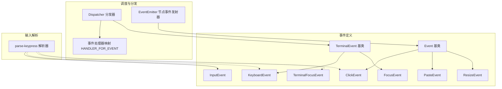
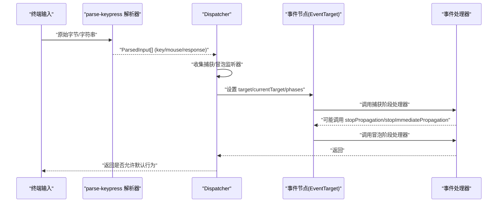
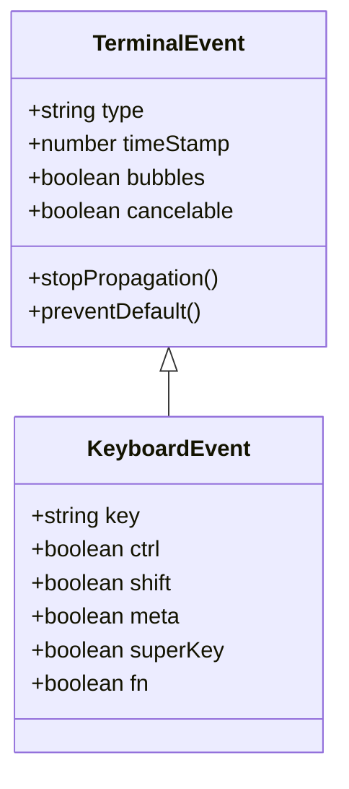
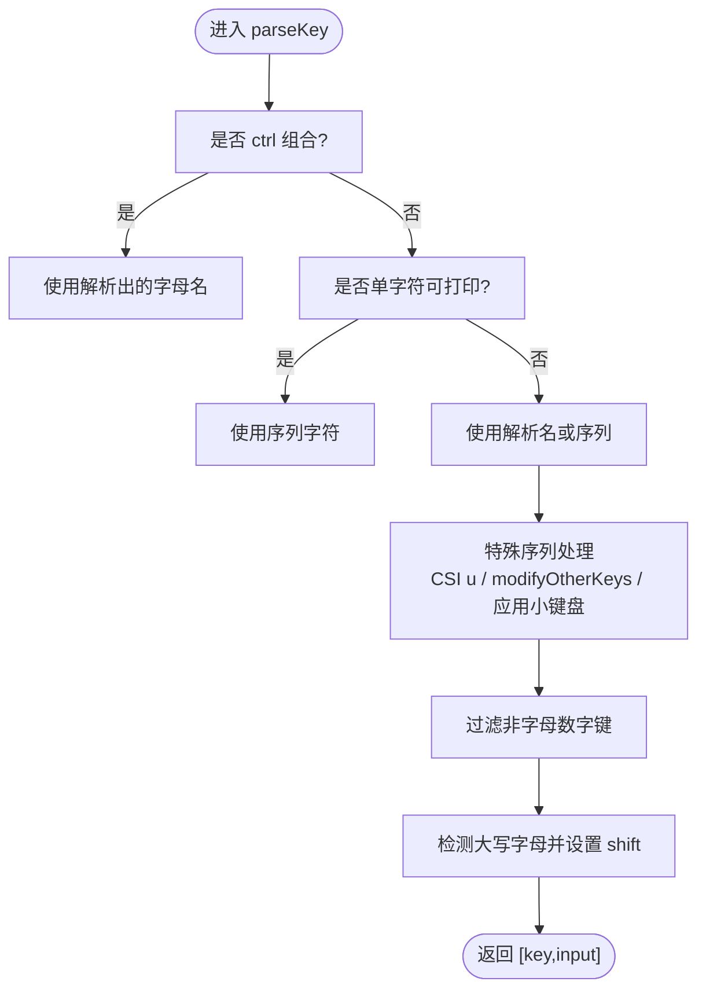
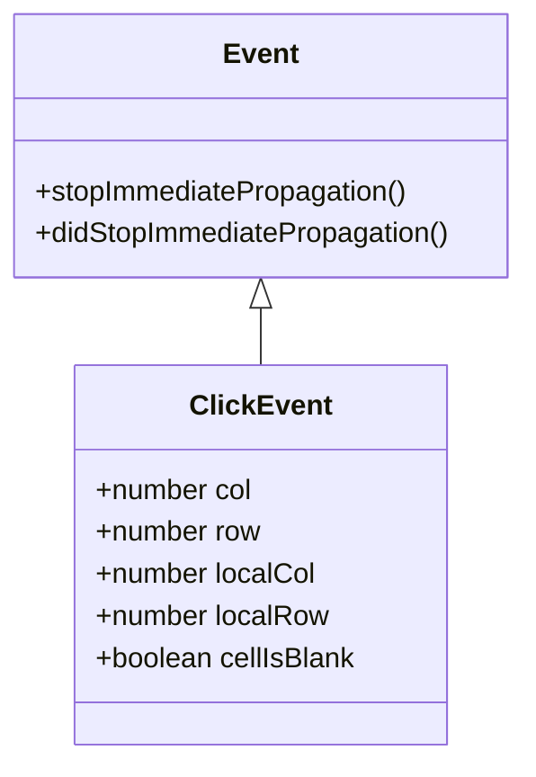
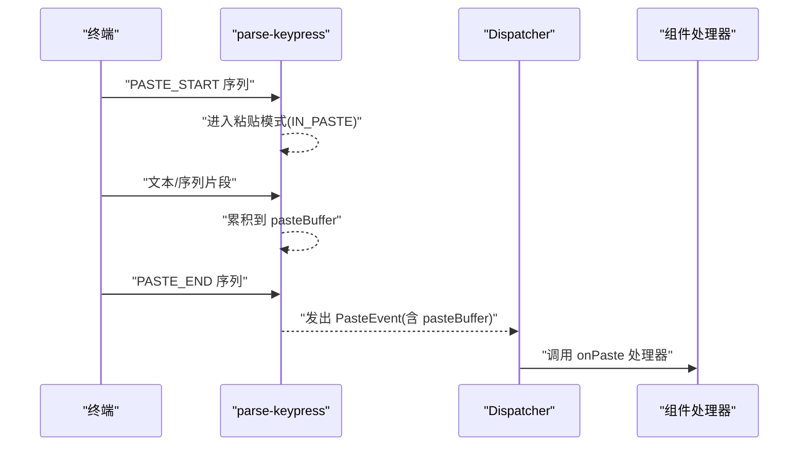
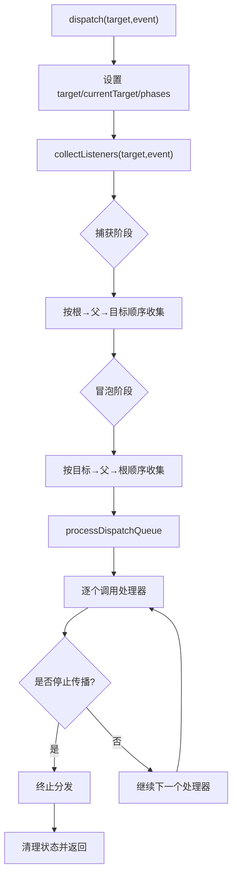
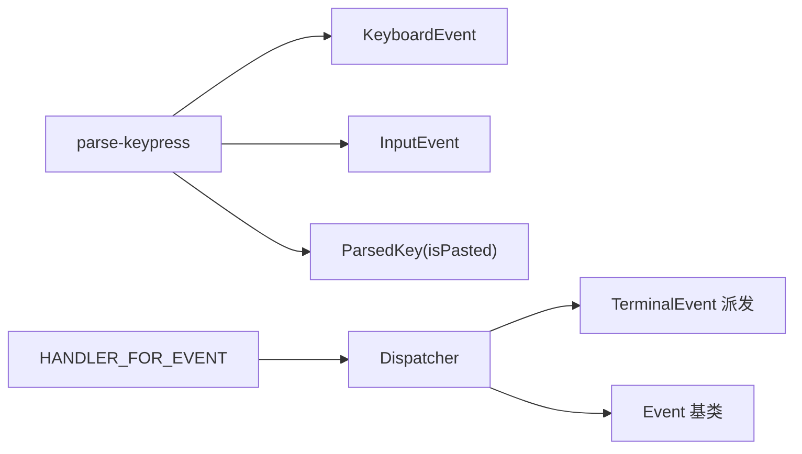

# 终端事件处理

<cite>
**本文档引用的文件**
- [src/ink/events/keyboard-event.ts](file://src/ink/events/keyboard-event.ts)
- [src/ink/events/click-event.ts](file://src/ink/events/click-event.ts)
- [src/ink/events/paste-event.ts](file://src/ink/events/paste-event.ts)
- [src/ink/events/resize-event.ts](file://src/ink/events/resize-event.ts)
- [src/ink/events/event.ts](file://src/ink/events/event.ts)
- [src/ink/events/terminal-event.ts](file://src/ink/events/terminal-event.ts)
- [src/ink/events/dispatcher.ts](file://src/ink/events/dispatcher.ts)
- [src/ink/events/emitter.ts](file://src/ink/events/emitter.ts)
- [src/ink/events/input-event.ts](file://src/ink/events/input-event.ts)
- [src/ink/events/focus-event.ts](file://src/ink/events/focus-event.ts)
- [src/ink/events/terminal-focus-event.ts](file://src/ink/events/terminal-focus-event.ts)
- [src/ink/events/event-handlers.ts](file://src/ink/events/event-handlers.ts)
- [src/ink/parse-keypress.ts](file://src/ink/parse-keypress.ts)
</cite>

## 目录
1. [简介](#简介)
2. [项目结构](#项目结构)
3. [核心组件](#核心组件)
4. [架构总览](#架构总览)
5. [详细组件分析](#详细组件分析)
6. [依赖关系分析](#依赖关系分析)
7. [性能考虑](#性能考虑)
8. [故障排除指南](#故障排除指南)
9. [结论](#结论)

## 简介
本文件面向 Ink 终端 UI 框架的事件处理子系统，系统性阐述键盘、鼠标点击、粘贴、终端尺寸调整等事件的实现与使用方式。重点覆盖：
- 键盘事件（KeyboardEvent）：按键编码、修饰键检测、特殊键处理
- 鼠标点击事件（ClickEvent）：坐标计算、按钮识别
- 粘贴事件（PasteEvent）：文本处理与格式转换
- 终端大小调整事件（ResizeEvent）：响应机制
- 事件分发器（Dispatcher）与事件传播模型
- 解析器（parse-keypress）对终端输入序列的解码

## 项目结构
事件处理相关代码集中在 src/ink/events 目录，配合解析器与调度器共同完成从原始输入到组件事件的转换与派发。

**图表来源**
- [src/ink/events/keyboard-event.ts:12-30](file://src/ink/events/keyboard-event.ts#L12-L30)
- [src/ink/events/input-event.ts:192-205](file://src/ink/events/input-event.ts#L192-L205)
- [src/ink/events/click-event.ts:10-38](file://src/ink/events/click-event.ts#L10-L38)
- [src/ink/events/paste-event.ts:1-2](file://src/ink/events/paste-event.ts#L1-L2)
- [src/ink/events/resize-event.ts:1-2](file://src/ink/events/resize-event.ts#L1-L2)
- [src/ink/events/focus-event.ts:11-21](file://src/ink/events/focus-event.ts#L11-L21)
- [src/ink/events/terminal-focus-event.ts:12-19](file://src/ink/events/terminal-focus-event.ts#L12-L19)
- [src/ink/events/dispatcher.ts:161-234](file://src/ink/events/dispatcher.ts#L161-L234)
- [src/ink/events/emitter.ts:6-39](file://src/ink/events/emitter.ts#L6-L39)
- [src/ink/events/event-handlers.ts:44-54](file://src/ink/events/event-handlers.ts#L44-L54)
- [src/ink/parse-keypress.ts:213-302](file://src/ink/parse-keypress.ts#L213-L302)

**章节来源**
- [src/ink/events/](file://src/ink/events/)
- [src/ink/parse-keypress.ts:1-802](file://src/ink/parse-keypress.ts#L1-L802)

## 核心组件
- 事件基类体系
  - Event：提供 stopImmediatePropagation、didStopImmediatePropagation 等通用能力
  - TerminalEvent：继承 Event，提供 DOM 风格的 target/currentTarget/eventPhase/stopPropagation 等
- 具体事件类型
  - KeyboardEvent：键盘按下事件，包含 key 与多类修饰键状态
  - InputEvent：输入事件，将按键解析为可直接用于文本输入的 key/input
  - ClickEvent：鼠标点击事件，包含屏幕坐标、相对坐标与空白单元格标记
  - PasteEvent/ResizeEvent：粘贴与尺寸调整事件占位类型
  - FocusEvent/TerminalFocusEvent：组件焦点与终端窗口焦点事件
- 调度与分发
  - Dispatcher：两阶段收集监听器（捕获/冒泡），按优先级执行，支持离散/连续更新
  - EventEmitter：Node EventEmitter 的增强版本，尊重 stopImmediatePropagation
  - HANDLER_FOR_EVENT：事件类型到组件事件处理器属性名的映射

**章节来源**
- [src/ink/events/event.ts:1-12](file://src/ink/events/event.ts#L1-L12)
- [src/ink/events/terminal-event.ts:19-108](file://src/ink/events/terminal-event.ts#L19-L108)
- [src/ink/events/keyboard-event.ts:12-30](file://src/ink/events/keyboard-event.ts#L12-L30)
- [src/ink/events/input-event.ts:192-205](file://src/ink/events/input-event.ts#L192-L205)
- [src/ink/events/click-event.ts:10-38](file://src/ink/events/click-event.ts#L10-L38)
- [src/ink/events/paste-event.ts:1-2](file://src/ink/events/paste-event.ts#L1-L2)
- [src/ink/events/resize-event.ts:1-2](file://src/ink/events/resize-event.ts#L1-L2)
- [src/ink/events/focus-event.ts:11-21](file://src/ink/events/focus-event.ts#L11-L21)
- [src/ink/events/terminal-focus-event.ts:12-19](file://src/ink/events/terminal-focus-event.ts#L12-L19)
- [src/ink/events/dispatcher.ts:161-234](file://src/ink/events/dispatcher.ts#L161-L234)
- [src/ink/events/emitter.ts:6-39](file://src/ink/events/emitter.ts#L6-L39)
- [src/ink/events/event-handlers.ts:44-54](file://src/ink/events/event-handlers.ts#L44-L54)

## 架构总览
事件从底层输入解析开始，经由 Dispatcher 完成 DOM 风格的捕获/冒泡传播，并根据事件类型选择合适的调度优先级。

**图表来源**
- [src/ink/parse-keypress.ts:213-302](file://src/ink/parse-keypress.ts#L213-L302)
- [src/ink/events/dispatcher.ts:185-201](file://src/ink/events/dispatcher.ts#L185-L201)
- [src/ink/events/terminal-event.ts:70-101](file://src/ink/events/terminal-event.ts#L70-L101)

## 详细组件分析

### 键盘事件（KeyboardEvent）
- 设计要点
  - 继承自 TerminalEvent，具备 DOM 风格的事件传播语义
  - 关键字段：key（浏览器语义的字符或名称）、ctrl/shift/meta/super/fn 修饰键
- key 值生成规则
  - Ctrl 组合：使用解析出的字母名，浏览器会同时报告 ctrlKey
  - 单字符可打印：使用序列中的单字节字符（0x20 至 0x7f 且非 DEL）
  - 特殊键：箭头、功能键、回车、制表、退格、ESC 等使用解析出的名称
- 修饰键检测
  - 来源于解析器的 ParsedKey，区分 meta/option、super、fn 等标志位
- 使用建议
  - 判断可打印字符：可通过 key.length === 1 进行快速判断
  - 处理组合键：结合 ctrl/shift/meta/super 字段进行绑定

**图表来源**
- [src/ink/events/terminal-event.ts:19-108](file://src/ink/events/terminal-event.ts#L19-L108)
- [src/ink/events/keyboard-event.ts:12-30](file://src/ink/events/keyboard-event.ts#L12-L30)

**章节来源**
- [src/ink/events/keyboard-event.ts:12-52](file://src/ink/events/keyboard-event.ts#L12-L52)
- [src/ink/parse-keypress.ts:611-785](file://src/ink/parse-keypress.ts#L611-L785)

### 输入事件（InputEvent）
- 设计要点
  - 将 ParsedKey 转换为可用于文本输入的结构：key 对象与 input 字符串
  - 处理多种协议与模式下的输入规范化（CSI u、modifyOtherKeys、应用小键盘等）
- 关键逻辑
  - 控制键时使用字母名；非字母键通过映射表与规则过滤
  - 特殊序列（CSI u、modifyOtherKeys、应用小键盘）转换为对应 key 名称或空字符
  - 上下文敏感处理：如大写字母自动标注 shift
- 实践建议
  - 在文本输入场景优先使用 InputEvent.input
  - 通过 key 对象进行组合键判定，避免直接依赖字符串

**图表来源**
- [src/ink/events/input-event.ts:27-190](file://src/ink/events/input-event.ts#L27-L190)

**章节来源**
- [src/ink/events/input-event.ts:192-205](file://src/ink/events/input-event.ts#L192-L205)
- [src/ink/parse-keypress.ts:408-541](file://src/ink/parse-keypress.ts#L408-L541)

### 鼠标点击事件（ClickEvent）
- 设计要点
  - 仅在启用鼠标追踪（如位于备用屏幕 AlternateScreen）时触发
  - 支持捕获/冒泡传播，事件对象包含绝对坐标与相对坐标
  - 提供 cellIsBlank 标记，便于忽略空白区域点击
- 坐标与按钮
  - col/row：屏幕 0 索引坐标
  - localCol/localRow：相对于当前容器盒模型的坐标（由分发器在每次处理器前重算）
  - 按钮识别：来源于底层鼠标序列解析（SGR/X10），Wheel 事件作为普通按键处理
- 使用建议
  - 结合 cellIsBlank 过滤空白点击
  - 在容器内使用 localCol/localRow 获取相对定位

**图表来源**
- [src/ink/events/event.ts:1-12](file://src/ink/events/event.ts#L1-L12)
- [src/ink/events/click-event.ts:10-38](file://src/ink/events/click-event.ts#L10-L38)

**章节来源**
- [src/ink/events/click-event.ts:10-38](file://src/ink/events/click-event.ts#L10-L38)
- [src/ink/parse-keypress.ts:594-609](file://src/ink/parse-keypress.ts#L594-L609)

### 粘贴事件（PasteEvent）
- 设计要点
  - 当前为占位类型，粘贴内容由解析器在 parseMultipleKeypresses 中产出为 ParsedKey（kind: 'key', isPasted: true）
  - 粘贴开始/结束由终端 CSI 序列标识，解析器维护 pasteBuffer 并在结束时发出粘贴事件
- 文本处理与格式转换
  - 粘贴期间的序列被视为纯文本累加
  - 空粘贴也会触发事件，便于上层处理空内容场景
- 使用建议
  - 监听粘贴事件并读取解析器状态中的粘贴缓冲
  - 注意跨平台与终端差异导致的粘贴序列变化

**图表来源**
- [src/ink/parse-keypress.ts:233-240](file://src/ink/parse-keypress.ts#L233-L240)
- [src/ink/parse-keypress.ts:247-257](file://src/ink/parse-keypress.ts#L247-L257)
- [src/ink/parse-keypress.ts:259-283](file://src/ink/parse-keypress.ts#L259-L283)
- [src/ink/events/dispatcher.ts:185-201](file://src/ink/events/dispatcher.ts#L185-L201)

**章节来源**
- [src/ink/events/paste-event.ts:1-2](file://src/ink/events/paste-event.ts#L1-L2)
- [src/ink/parse-keypress.ts:67-81](file://src/ink/parse-keypress.ts#L67-L81)
- [src/ink/parse-keypress.ts:233-240](file://src/ink/parse-keypress.ts#L233-L240)

### 终端大小调整事件（ResizeEvent）
- 设计要点
  - ResizeEvent 为占位类型，具体尺寸信息通常由渲染层或视口钩子提供
  - 事件类型在 HANDLER_FOR_EVENT 中注册为 onResize
- 响应机制
  - 由 Dispatcher 根据事件类型选择连续事件优先级，避免高频调整影响性能
  - 组件可通过相应处理器或钩子感知尺寸变化并重新布局

**章节来源**
- [src/ink/events/resize-event.ts:1-2](file://src/ink/events/resize-event.ts#L1-L2)
- [src/ink/events/event-handlers.ts:44-54](file://src/ink/events/event-handlers.ts#L44-L54)
- [src/ink/events/dispatcher.ts:122-138](file://src/ink/events/dispatcher.ts#L122-L138)

### 事件分发与传播（Dispatcher）
- 两阶段收集
  - 捕获阶段：从目标向上遍历至根，按“根→父→目标”顺序
  - 冒泡阶段：从目标向下遍历至根，按“目标→父→根”顺序
- 传播控制
  - stopPropagation：阻止后续同节点的进一步传播
  - stopImmediatePropagation：阻止该节点剩余处理器与后续节点
  - preventDefault：对可取消事件生效
- 优先级策略
  - 用户交互事件（keydown/keyup/click/focus/blur/paste）采用离散优先级
  - 高频事件（resize/scroll/mousemove）采用连续优先级
- 执行钩子
  - 每个处理器执行前调用事件对象的 _prepareForTarget 钩子，用于节点级准备

**图表来源**
- [src/ink/events/dispatcher.ts:46-79](file://src/ink/events/dispatcher.ts#L46-L79)
- [src/ink/events/dispatcher.ts:87-114](file://src/ink/events/dispatcher.ts#L87-L114)
- [src/ink/events/dispatcher.ts:185-201](file://src/ink/events/dispatcher.ts#L185-L201)

**章节来源**
- [src/ink/events/dispatcher.ts:161-234](file://src/ink/events/dispatcher.ts#L161-L234)
- [src/ink/events/terminal-event.ts:70-101](file://src/ink/events/terminal-event.ts#L70-L101)

### 事件处理器映射（HANDLER_FOR_EVENT）
- 作用
  - 将事件类型字符串映射到组件属性名（onEvent、onEventCapture）
  - 供 Dispatcher 快速查找节点上的事件处理器
- 支持的事件
  - 键盘：keydown（含捕获）
  - 焦点：focus、blur（含捕获）
  - 粘贴：paste（含捕获）
  - 尺寸：resize
  - 点击：click

**章节来源**
- [src/ink/events/event-handlers.ts:44-54](file://src/ink/events/event-handlers.ts#L44-L54)
- [src/ink/events/event-handlers.ts:60-73](file://src/ink/events/event-handlers.ts#L60-L73)

### 节点事件发射器（EventEmitter）
- 与标准 Node EventEmitter 的差异
  - 对于非 'error' 类型事件，尊重 Event.didStopImmediatePropagation
  - 默认禁用最大监听数警告，适配 React 场景下组件对同一事件的多监听需求

**章节来源**
- [src/ink/events/emitter.ts:6-39](file://src/ink/events/emitter.ts#L6-L39)

### 组件焦点与终端焦点（FocusEvent/TerminalFocusEvent）
- 组件焦点（FocusEvent）
  - 用于组件树内的焦点变更，'focus' 在新焦点元素触发，'blur' 在原焦点元素触发
  - 支持捕获/冒泡，便于父组件观察后代焦点变化
- 终端焦点（TerminalFocusEvent）
  - 由终端焦点报告协议触发（DECSET 1004），类型为 'terminalfocus' 或 'terminalblur'
  - 通过 CSI I/O 序列通知应用终端窗口获得/失去焦点

**章节来源**
- [src/ink/events/focus-event.ts:11-21](file://src/ink/events/focus-event.ts#L11-L21)
- [src/ink/events/terminal-focus-event.ts:12-19](file://src/ink/events/terminal-focus-event.ts#L12-L19)

## 依赖关系分析
- 事件类型与处理器映射
  - 事件类型 → 属性名映射由 HANDLER_FOR_EVENT 提供，Dispatcher 通过该映射在节点上查找处理器
- 解析器与事件
  - parse-keypress 输出 ParsedInput（key/mouse/response），其中粘贴序列被转换为带 isPasted 标志的 ParsedKey
  - KeyboardEvent/InputEvent 均依赖解析器提供的 ParsedKey 信息
- 调度器与优先级
  - Dispatcher 根据事件类型选择离散/连续优先级，确保高频事件不影响交互响应

**图表来源**
- [src/ink/parse-keypress.ts:213-302](file://src/ink/parse-keypress.ts#L213-L302)
- [src/ink/events/keyboard-event.ts:20-29](file://src/ink/events/keyboard-event.ts#L20-L29)
- [src/ink/events/input-event.ts:197-204](file://src/ink/events/input-event.ts#L197-L204)
- [src/ink/events/event-handlers.ts:44-54](file://src/ink/events/event-handlers.ts#L44-L54)
- [src/ink/events/dispatcher.ts:122-138](file://src/ink/events/dispatcher.ts#L122-L138)

**章节来源**
- [src/ink/events/event-handlers.ts:44-54](file://src/ink/events/event-handlers.ts#L44-L54)
- [src/ink/events/dispatcher.ts:122-138](file://src/ink/events/dispatcher.ts#L122-L138)
- [src/ink/parse-keypress.ts:213-302](file://src/ink/parse-keypress.ts#L213-L302)

## 性能考虑
- 事件优先级
  - 用户交互事件（键盘、点击、焦点、粘贴）采用离散优先级，保证即时响应
  - 高频事件（尺寸调整、滚动、鼠标移动）采用连续优先级，避免阻塞渲染
- 传播短路
  - stopPropagation/stopImmediatePropagation 可显著减少无效处理器调用
- 解析器状态复用
  - parse-keypress 维护 KeyParseState，避免重复创建 Tokenizer，提升吞吐

**章节来源**
- [src/ink/events/dispatcher.ts:122-138](file://src/ink/events/dispatcher.ts#L122-L138)
- [src/ink/parse-keypress.ts:182-194](file://src/ink/parse-keypress.ts#L182-L194)

## 故障排除指南
- 粘贴内容为空但需处理
  - 空粘贴仍会触发 PasteEvent，可在处理器中检查内容长度
  - 参考：粘贴开始/结束序列处理与事件发出
- 粘贴期间的异常字符泄漏
  - 解析器已对未知函数键与 SGR 鼠标片段进行抑制，避免泄漏到输入
  - 若仍出现异常，检查终端类型与粘贴序列兼容性
- 鼠标点击未触发
  - 确认鼠标追踪已启用（如处于备用屏幕）
  - 检查是否被上层处理器调用 stopImmediatePropagation 阻止
- 键盘组合键不生效
  - 使用 InputEvent.input 与 key 对象进行组合键判定
  - 注意不同终端协议（CSI u、modifyOtherKeys、应用小键盘）的差异
- 终端焦点事件缺失
  - 确保终端启用焦点报告协议（DECSET 1004）
  - 检查 CSI I/O 序列是否正确输出

**章节来源**
- [src/ink/parse-keypress.ts:233-240](file://src/ink/parse-keypress.ts#L233-L240)
- [src/ink/parse-keypress.ts:259-283](file://src/ink/parse-keypress.ts#L259-L283)
- [src/ink/parse-keypress.ts:78-92](file://src/ink/parse-keypress.ts#L78-L92)
- [src/ink/events/click-event.ts:4-9](file://src/ink/events/click-event.ts#L4-L9)
- [src/ink/events/input-event.ts:170-190](file://src/ink/events/input-event.ts#L170-L190)
- [src/ink/events/terminal-focus-event.ts:8-11](file://src/ink/events/terminal-focus-event.ts#L8-L11)

## 结论
Ink 的终端事件处理系统通过清晰的事件层次、严谨的输入解析与高效的分发机制，实现了对键盘、鼠标、粘贴与终端焦点等事件的统一建模与高效派发。开发者可依据本文档的规则与建议，准确地处理各类终端事件，构建流畅的交互体验。