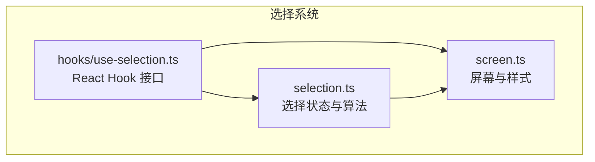
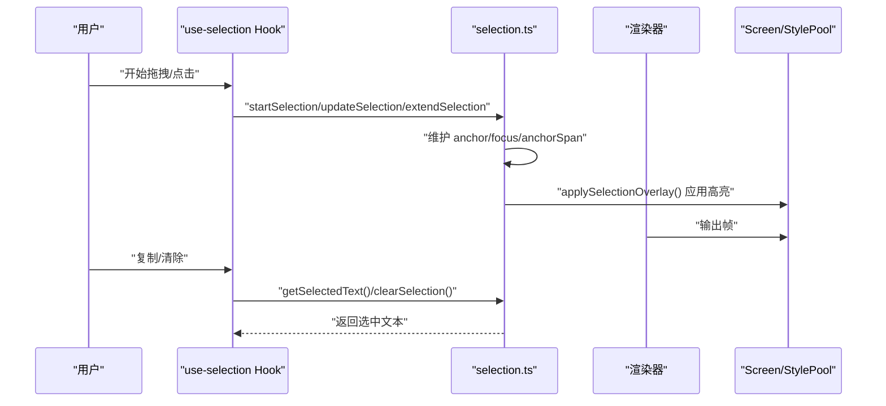
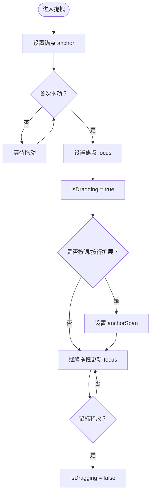
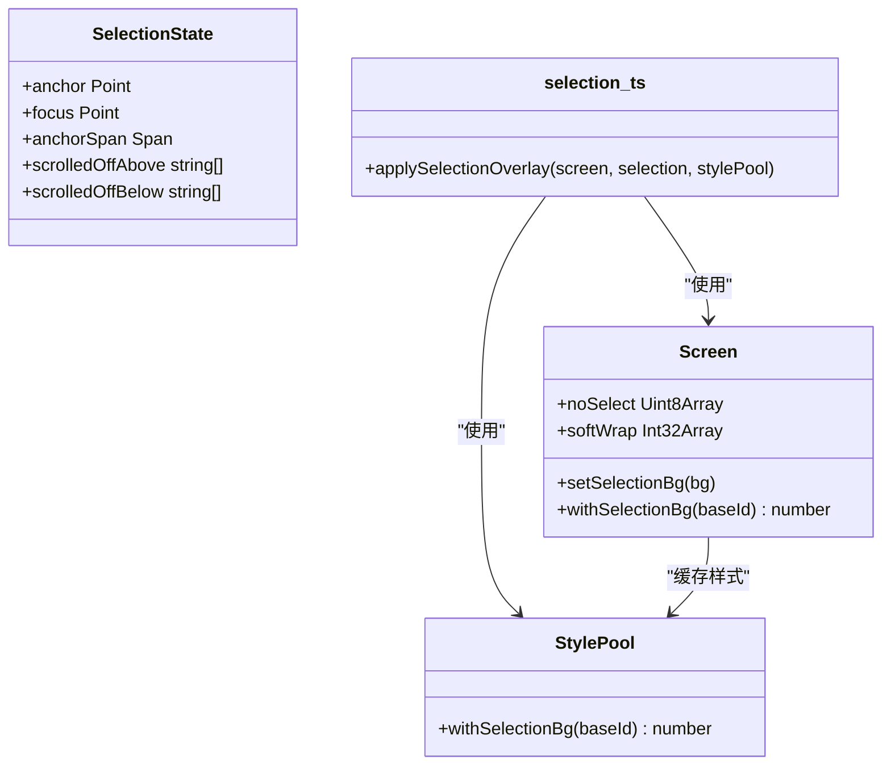
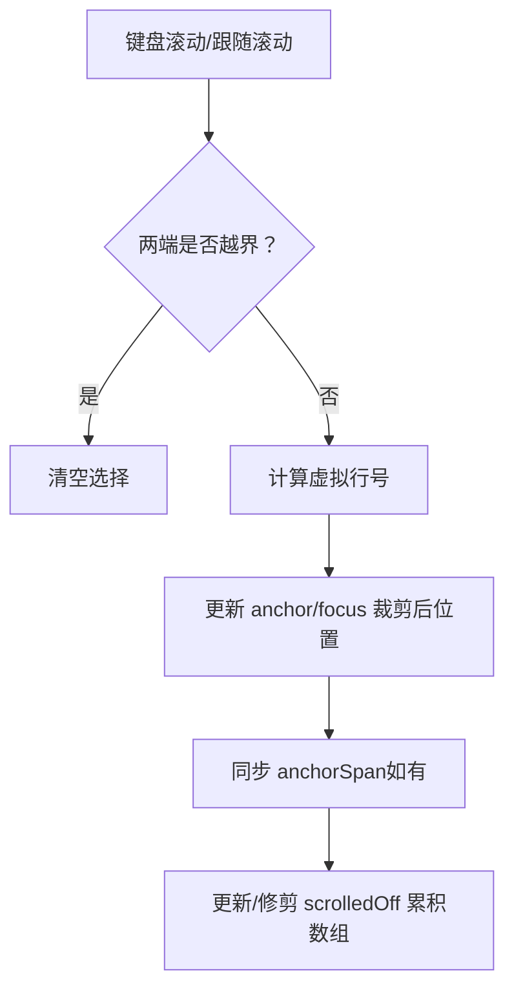
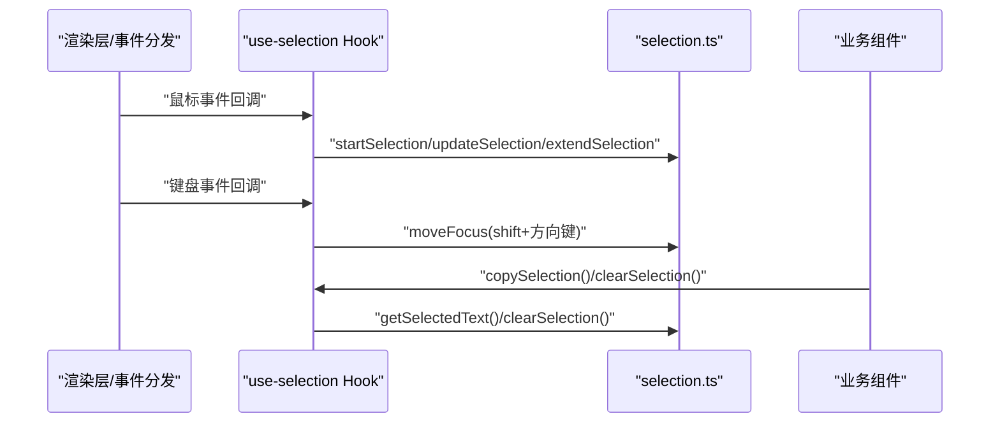
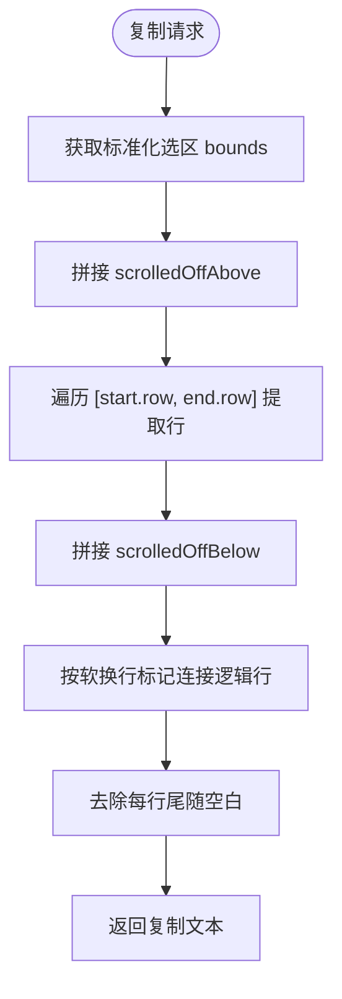
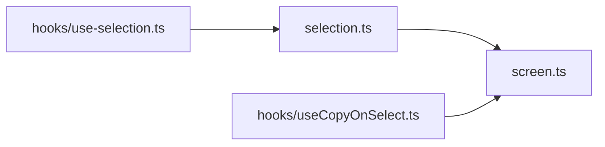

# 选择系统

<cite>
**本文引用的文件**
- [src/ink/selection.ts](file://src/ink/selection.ts)
- [src/ink/hooks/use-selection.ts](file://src/ink/hooks/use-selection.ts)
- [src/ink/screen.ts](file://src/ink/screen.ts)
- [src/hooks/useCopyOnSelect.ts](file://src/hooks/useCopyOnSelect.ts)
</cite>

## 目录
1. [简介](#简介)
2. [项目结构](#项目结构)
3. [核心组件](#核心组件)
4. [架构总览](#架构总览)
5. [详细组件分析](#详细组件分析)
6. [依赖关系分析](#依赖关系分析)
7. [性能考量](#性能考量)
8. [故障排查指南](#故障排查指南)
9. [结论](#结论)
10. [附录](#附录)

## 简介
本文件面向 Ink 终端 UI 框架中的“文本选择系统”，系统性阐述以下主题：
- 选择区域的计算与高亮渲染机制
- 选择状态的维护与更新（含拖拽、键盘扩展、滚动跟随）
- 多选与单选模式支持（按词、按行、字符级）
- 选择事件的触发与处理路径（鼠标/键盘）
- 选择内容的复制与剪切操作
- 配置选项与自定义方法（选择样式与行为）

该系统在全屏模式下工作，采用“锚点（anchor）+焦点（focus）”模型，结合软换行、宽字符、不可选择区域等复杂场景，确保复制结果与终端原生体验一致。

## 项目结构
选择系统主要由三部分构成：
- 选择状态与算法：位于 selection.ts，负责状态机、区域计算、复制拼接、滚动时的上下文捕获与恢复
- React Hook 接口：位于 use-selection.ts，向组件暴露复制、清除、订阅、移动焦点、滚动捕获、设置背景色等能力
- 屏幕与样式：位于 screen.ts，提供选择背景色缓存与应用、noSelect 标记、softWrap 软换行标记等底层数据结构

**图表来源**
- [src/ink/selection.ts:1-120](file://src/ink/selection.ts#L1-L120)
- [src/ink/hooks/use-selection.ts:14-87](file://src/ink/hooks/use-selection.ts#L14-L87)
- [src/ink/screen.ts:237-260](file://src/ink/screen.ts#L237-L260)

**章节来源**
- [src/ink/selection.ts:1-120](file://src/ink/selection.ts#L1-L120)
- [src/ink/hooks/use-selection.ts:14-87](file://src/ink/hooks/use-selection.ts#L14-L87)
- [src/ink/screen.ts:237-260](file://src/ink/screen.ts#L237-L260)

## 核心组件
- 选择状态 SelectionState
  - 锚点 anchor：鼠标按下位置
  - 焦点 focus：当前拖拽位置
  - isDragging：是否处于拖拽中
  - anchorSpan：按词/按行扩展时的初始边界，用于拖拽时保持原始单词/行不被移出
  - scrolledOffAbove/Below：拖拽滚动时，视窗外上/下方已截断行的文本与软换行标记
  - virtualAnchorRow/virtualFocusRow：虚拟行号，用于键盘滚动/跟随时正确恢复累积内容
  - lastPressHadAlt：记录上次按下是否带 Alt，用于提示信息
- 关键算法
  - 单词选择与扩展：基于字符类别匹配，支持宽字符与不可选择区域
  - 行选择：整行选中，扩展时按行边界
  - 区域标准化与包含判断：比较锚点与焦点，返回起止点；判断某单元格是否在区域内
  - 文本提取：按行拼接，处理 noSelect、宽字符、软换行，去除尾随空白
  - 滚动捕获：在滚动发生前从屏幕缓冲区抽取即将离开的内容，保证复制完整
  - 高亮叠加：以纯色背景替换每个单元格的背景色，保留前景色与强调样式

**章节来源**
- [src/ink/selection.ts:19-63](file://src/ink/selection.ts#L19-L63)
- [src/ink/selection.ts:240-254](file://src/ink/selection.ts#L240-L254)
- [src/ink/selection.ts:368-380](file://src/ink/selection.ts#L368-L380)
- [src/ink/selection.ts:698-710](file://src/ink/selection.ts#L698-L710)
- [src/ink/selection.ts:773-795](file://src/ink/selection.ts#L773-L795)
- [src/ink/selection.ts:813-875](file://src/ink/selection.ts#L813-L875)
- [src/ink/selection.ts:893-917](file://src/ink/selection.ts#L893-L917)

## 架构总览
选择系统在渲染管线中的位置如下：

**图表来源**
- [src/ink/hooks/use-selection.ts:70-86](file://src/ink/hooks/use-selection.ts#L70-L86)
- [src/ink/selection.ts:79-134](file://src/ink/selection.ts#L79-L134)
- [src/ink/selection.ts:893-917](file://src/ink/selection.ts#L893-L917)

## 详细组件分析

### 选择状态与区域计算
- 状态字段与初始化
  - 初始化时 anchor/focus 为空，isDragging 为 false，清空滚动累积数组
- 开始/更新/结束/清除
  - startSelection：设置锚点，首次拖动才设置焦点
  - updateSelection：仅在拖拽中生效，避免“无拖拽点击”误判为选择
  - finishSelection：停止拖拽但保留高亮，便于复制
  - clearSelection：重置所有状态
- 区域标准化与包含判断
  - selectionBounds：将锚点与焦点标准化为阅读顺序的起止
  - isCellSelected：判断给定坐标是否落入选区内
- 扩展策略
  - selectWordAt/selectLineAt：按词/按行初始化 anchorSpan
  - extendSelection：在 anchorSpan 基础上，根据当前位置扩展到对应词/行边界，保持 anchorSpan 内容不变

**图表来源**
- [src/ink/selection.ts:79-120](file://src/ink/selection.ts#L79-L120)
- [src/ink/selection.ts:240-254](file://src/ink/selection.ts#L240-L254)
- [src/ink/selection.ts:368-380](file://src/ink/selection.ts#L368-L380)
- [src/ink/selection.ts:389-421](file://src/ink/selection.ts#L389-L421)

**章节来源**
- [src/ink/selection.ts:79-134](file://src/ink/selection.ts#L79-L134)
- [src/ink/selection.ts:240-254](file://src/ink/selection.ts#L240-L254)
- [src/ink/selection.ts:368-380](file://src/ink/selection.ts#L368-L380)
- [src/ink/selection.ts:389-421](file://src/ink/selection.ts#L389-L421)

### 高亮显示与样式
- 选择叠加层
  - applySelectionOverlay：遍历选区，对每个可选择单元格应用纯色背景（通过 StylePool.withSelectionBg），保留前景色与强调样式
  - 屏幕侧 setSelectionBg/withSelectionBg：缓存并生成带选择背景的新样式 ID，避免重复计算
- noSelect 与软换行
  - noSelect 位图标记不可选择区域（如行号、差异符号），高亮时跳过这些区域
  - softWrap 标记软换行续行，确保复制时逻辑行拼接正确，不插入多余换行

**图表来源**
- [src/ink/selection.ts:893-917](file://src/ink/selection.ts#L893-L917)
- [src/ink/screen.ts:237-260](file://src/ink/screen.ts#L237-L260)

**章节来源**
- [src/ink/selection.ts:893-917](file://src/ink/selection.ts#L893-L917)
- [src/ink/screen.ts:237-260](file://src/ink/screen.ts#L237-L260)

### 选择状态维护与更新（拖拽、键盘、滚动）
- 拖拽滚动
  - shiftAnchor：仅移动锚点，用于拖拽滚动时锚点跟随内容
  - captureScrolledRows：在滚动发生前，从屏幕缓冲区抽取与选区相交的行，填充 scrolledOffAbove/Below 及其软换行标记
- 键盘扩展与滚动
  - moveFocus：固定锚点，移动焦点（支持左右跨越行、上下边界约束）
  - shiftSelection：整体移动锚点与焦点（键盘滚动场景），两端越界则清空
  - shiftSelectionForFollow：自动跟随滚动时的整体移动，与 shiftSelection 类似但更严格地处理两端越界
- 虚拟行号
  - virtualAnchorRow/virtualFocusRow：记录未被裁剪前的真实行号，用于反向滚动时正确弹出累积内容，避免“复制≠高亮”的问题

**图表来源**
- [src/ink/selection.ts:470-565](file://src/ink/selection.ts#L470-L565)
- [src/ink/selection.ts:625-674](file://src/ink/selection.ts#L625-L674)
- [src/ink/selection.ts:813-875](file://src/ink/selection.ts#L813-L875)

**章节来源**
- [src/ink/selection.ts:573-602](file://src/ink/selection.ts#L573-L602)
- [src/ink/selection.ts:813-875](file://src/ink/selection.ts#L813-L875)

### 选择事件的触发与处理
- 鼠标事件
  - startSelection/updateSelection/finishSelection：响应鼠标按下/移动/抬起，维护 isDragging 与 anchor/focus
  - extendSelection：在按词/按行模式下，拖拽时扩展到目标词/行边界
- 键盘事件
  - moveFocus：处理 shift+方向键扩展选择
  - 由渲染层在 Ink 主循环中调用（见 use-selection.ts 中的 moveSelectionFocus 调用）
- React Hook 接口
  - useSelection：提供 copySelection/copySelectionNoClear/clearSelection/hasSelection/getState/subscribe/shiftAnchor/shiftSelection/moveFocus/captureScrolledRows/setSelectionBgColor
  - useHasSelection：订阅选择存在状态变化

**图表来源**
- [src/ink/hooks/use-selection.ts:70-86](file://src/ink/hooks/use-selection.ts#L70-L86)
- [src/ink/selection.ts:79-134](file://src/ink/selection.ts#L79-L134)
- [src/ink/selection.ts:389-421](file://src/ink/selection.ts#L389-L421)

**章节来源**
- [src/ink/hooks/use-selection.ts:14-87](file://src/ink/hooks/use-selection.ts#L14-L87)

### 选择内容的复制与剪切
- 复制
  - getSelectedText：按标准化起止逐行提取，合并 scrolledOffAbove/Below 与当前屏幕行，处理 noSelect、宽字符、软换行，去除每条逻辑行尾随空白
  - copySelection/copySelectionNoClear：通过 use-selection Hook 调用 Ink 实例的复制接口
- 剪切
  - 选择系统本身不直接执行剪切；剪切通常由上层编辑器或命令处理器在复制后删除对应内容并刷新渲染

**图表来源**
- [src/ink/selection.ts:773-795](file://src/ink/selection.ts#L773-L795)
- [src/ink/selection.ts:716-744](file://src/ink/selection.ts#L716-L744)

**章节来源**
- [src/ink/selection.ts:773-795](file://src/ink/selection.ts#L773-L795)

### 配置选项与自定义方法
- 选择样式
  - setSelectionBgColor：设置选择背景色（主题驱动），通过 Screen 的 setSelectionBg/withSelectionBg 缓存新样式 ID
  - 使用示例：在主题变更或挂载时调用，确保高亮与语法着色兼容
- 行为定制
  - 自定义字符类别：按需调整 wordBoundsAt 的字符分类规则，影响双击选择范围
  - 自定义 URL 识别：findPlainTextUrlAt 支持在无 OSC 8 超链接时识别 URL
  - 自定义 noSelect 区域：通过渲染层在 Screen.noSelect 上标记不可选择区域（如行号、差异符号）
- 多选与单选
  - 单选：默认拖拽选择即为单次选择
  - 多选：可通过多次调用选择函数或在上层 UI 中组合多个 SelectionState（本仓库未提供多实例选择状态管理，建议在业务层自行维护）

**章节来源**
- [src/ink/hooks/use-selection.ts:44-85](file://src/ink/hooks/use-selection.ts#L44-L85)
- [src/ink/screen.ts:237-260](file://src/ink/screen.ts#L237-L260)
- [src/ink/selection.ts:136-155](file://src/ink/selection.ts#L136-L155)
- [src/ink/selection.ts:272-359](file://src/ink/selection.ts#L272-L359)

## 依赖关系分析
- 组件耦合
  - selection.ts 依赖 screen.ts 的 Screen、Cell、StylePool、noSelect、softWrap 等
  - use-selection.ts 依赖 selection.ts 的状态与算法，并桥接到 Ink 实例的复制/滚动/高亮接口
- 外部集成
  - 选择系统与渲染器解耦：applySelectionOverlay 在渲染后应用，不改变 diff 策略
  - 与主题系统解耦：通过 setSelectionBgColor 注入颜色，避免硬编码

**图表来源**
- [src/ink/hooks/use-selection.ts:70-86](file://src/ink/hooks/use-selection.ts#L70-L86)
- [src/ink/selection.ts:893-917](file://src/ink/selection.ts#L893-L917)
- [src/hooks/useCopyOnSelect.ts:95](file://src/hooks/useCopyOnSelect.ts#L95)

**章节来源**
- [src/ink/hooks/use-selection.ts:70-86](file://src/ink/hooks/use-selection.ts#L70-L86)
- [src/ink/selection.ts:893-917](file://src/ink/selection.ts#L893-L917)
- [src/hooks/useCopyOnSelect.ts:95](file://src/hooks/useCopyOnSelect.ts#L95)

## 性能考量
- 样式缓存
  - Screen.withSelectionBg 使用缓存避免重复构建样式 ID，降低渲染开销
- 低分配设计
  - Screen 使用打包数组存储单元格，减少对象分配；selection.ts 的高亮叠加仅做映射查找与写入
- 按需提取
  - getSelectedText 仅遍历选区范围内的行，且在滚动捕获阶段只处理与选区相交的行
- 软换行与宽字符
  - 通过 softWrap 与 noSelect 快速跳过不可选区域，避免解码与拼接成本

[本节为通用性能讨论，无需特定文件来源]

## 故障排查指南
- 复制内容与高亮不一致
  - 检查是否正确调用 applySelectionOverlay；确认 virtualAnchorRow/virtualFocusRow 是否被正确更新
  - 若出现“幽灵单元格”，检查 shiftSelection/shiftSelectionForFollow 的越界清理逻辑
- 拖拽时丢失顶部/底部内容
  - 确认在滚动前调用 captureScrolledRows，并在滚动后修剪 scrolledOff 累积数组
- 宽字符或软换行导致复制错行
  - 检查 softWrap 与 extractRowText 的列边界处理，确保内容结束列正确
- 不可选择区域仍被高亮
  - 确认 noSelect 标记正确传递至 applySelectionOverlay 与 getSelectedText

**章节来源**
- [src/ink/selection.ts:573-602](file://src/ink/selection.ts#L573-L602)
- [src/ink/selection.ts:625-674](file://src/ink/selection.ts#L625-L674)
- [src/ink/selection.ts:813-875](file://src/ink/selection.ts#L813-L875)
- [src/ink/selection.ts:716-744](file://src/ink/selection.ts#L716-L744)
- [src/ink/selection.ts:893-917](file://src/ink/selection.ts#L893-L917)

## 结论
该选择系统以“锚点+焦点”为核心，结合按词/按行扩展、滚动捕获与软换行处理，实现了与终端原生一致的交互与复制体验。通过样式缓存与低分配的数据结构，系统在性能上具备良好表现。配合 React Hook 接口，上层组件可便捷地接入复制、清除、订阅与样式定制能力。

[本节为总结，无需特定文件来源]

## 附录
- 相关文件路径
  - 选择状态与算法：[src/ink/selection.ts](file://src/ink/selection.ts)
  - React Hook 接口：[src/ink/hooks/use-selection.ts](file://src/ink/hooks/use-selection.ts)
  - 屏幕与样式：[src/ink/screen.ts](file://src/ink/screen.ts)
  - 主题与选择背景色：[src/hooks/useCopyOnSelect.ts](file://src/hooks/useCopyOnSelect.ts)

[本节为补充信息，无需特定文件来源]