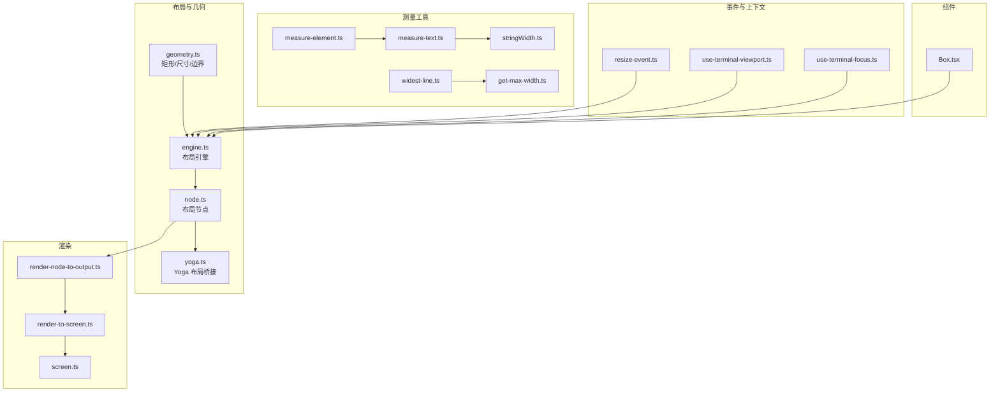
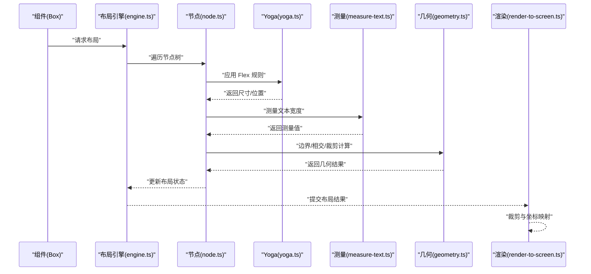
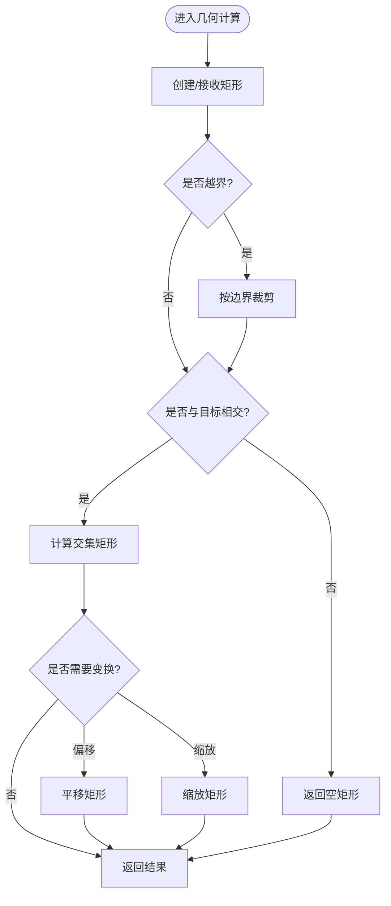
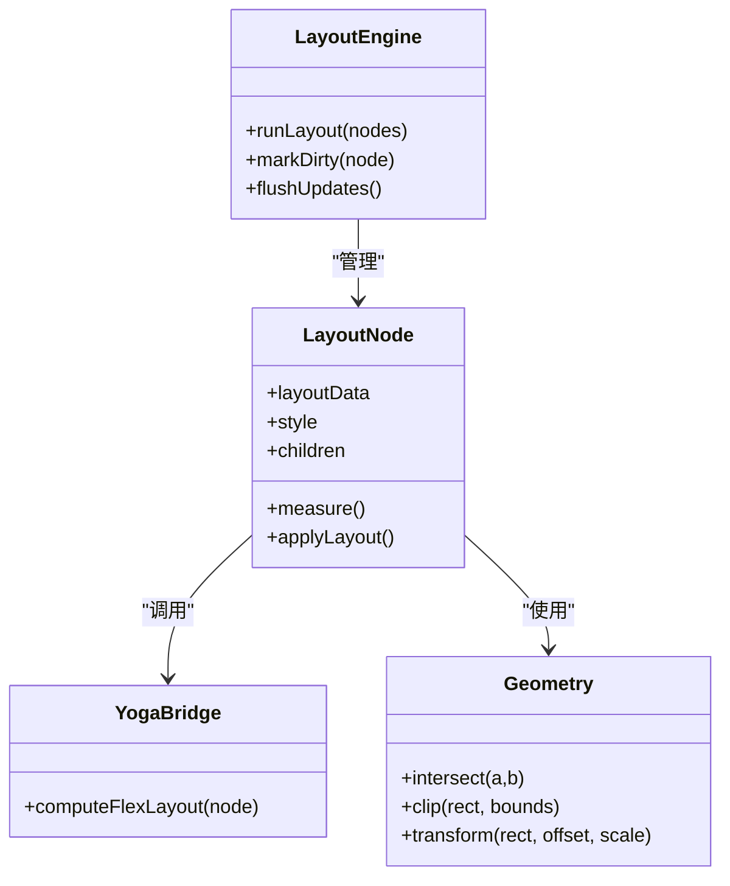
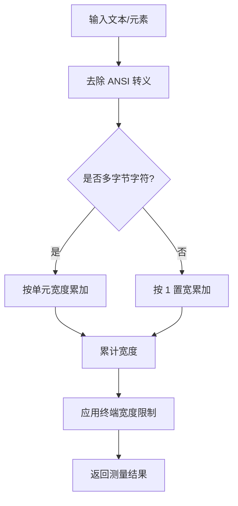
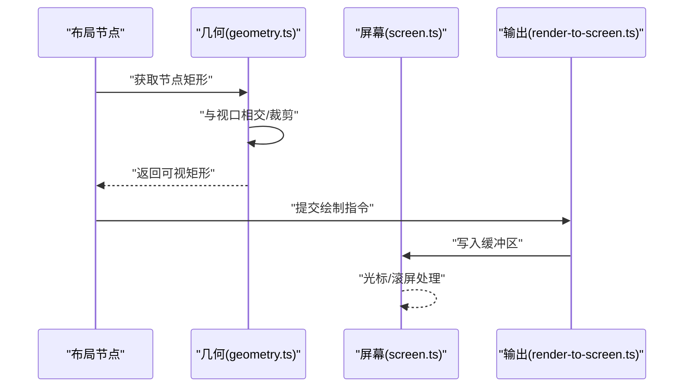
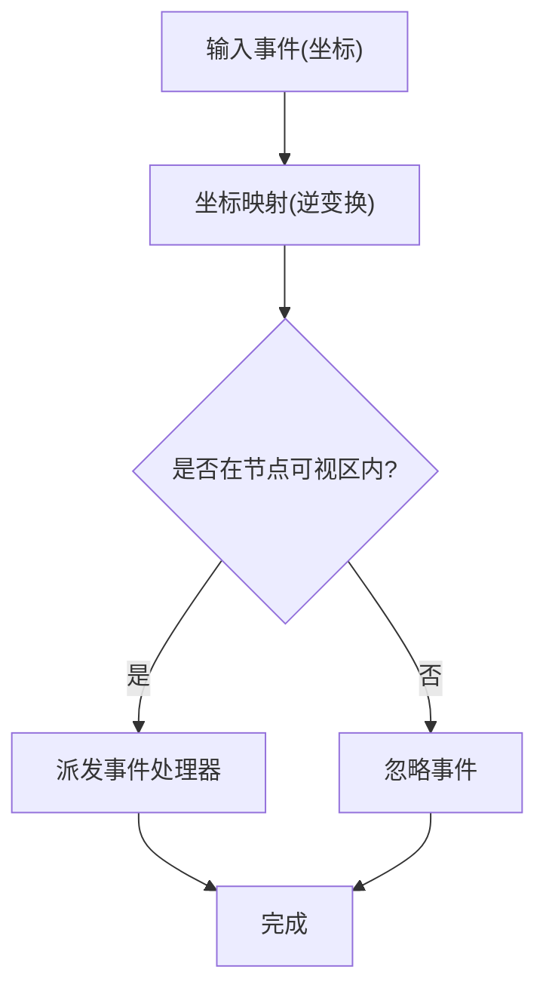
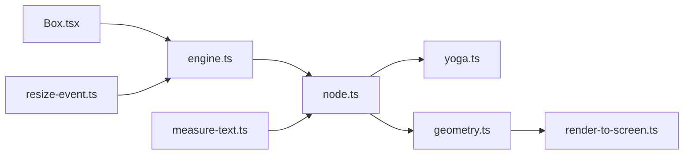

# 几何系统

<cite>
**本文档引用的文件**
- [src/ink/layout/geometry.ts](file://src/ink/layout/geometry.ts)
- [src/ink/layout/engine.ts](file://src/ink/layout/engine.ts)
- [src/ink/layout/node.ts](file://src/ink/layout/node.ts)
- [src/ink/layout/yoga.ts](file://src/ink/layout/yoga.ts)
- [src/ink/measure-element.ts](file://src/ink/measure-element.ts)
- [src/ink/measure-text.ts](file://src/ink/measure-text.ts)
- [src/ink/stringWidth.ts](file://src/ink/stringWidth.ts)
- [src/ink/widest-line.ts](file://src/ink/widest-line.ts)
- [src/ink/get-max-width.ts](file://src/ink/get-max-width.ts)
- [src/ink/hit-test.ts](file://src/ink/hit-test.ts)
- [src/ink/render-node-to-output.ts](file://src/ink/render-node-to-output.ts)
- [src/ink/render-to-screen.ts](file://src/ink/render-to-screen.ts)
- [src/ink/screen.ts](file://src/ink/screen.ts)
- [src/ink/terminal.ts](file://src/ink/terminal.ts)
- [src/ink/components/Box.tsx](file://src/ink/components/Box.tsx)
- [src/ink/hooks/use-terminal-viewport.ts](file://src/ink/hooks/use-terminal-viewport.ts)
- [src/ink/hooks/use-terminal-focus.ts](file://src/ink/hooks/use-terminal-focus.ts)
- [src/ink/events/resize-event.ts](file://src/ink/events/resize-event.ts)
- [src/ink/events/terminal-event.ts](file://src/ink/events/terminal-event.ts)
</cite>

## 目录
1. [简介](#简介)
2. [项目结构](#项目结构)
3. [核心组件](#核心组件)
4. [架构总览](#架构总览)
5. [详细组件分析](#详细组件分析)
6. [依赖关系分析](#依赖关系分析)
7. [性能考虑](#性能考虑)
8. [故障排除指南](#故障排除指南)
9. [结论](#结论)
10. [附录](#附录)

## 简介
本文件系统性阐述 Ink 终端 UI 框架的几何系统，涵盖终端坐标系、尺寸计算、位置定位、矩形区域管理、边界检测与碰撞检测、几何变换（缩放、偏移、裁剪）以及性能优化与内存管理策略。文档以源码为依据，结合可视化图示，帮助开发者在终端环境中实现精确且高效的几何计算。

## 项目结构
Ink 的几何系统主要由以下模块构成：
- 布局引擎与几何：负责节点布局、尺寸计算与区域管理
- 测量工具：文本宽度测量、元素尺寸测量、最大宽度获取
- 渲染管线：将布局结果转换为终端输出
- 事件与上下文：窗口大小变化、焦点状态、视口信息
- 组件层：Box 等布局组件对外暴露几何接口

**图表来源**
- [src/ink/layout/geometry.ts](file://src/ink/layout/geometry.ts)
- [src/ink/layout/engine.ts](file://src/ink/layout/engine.ts)
- [src/ink/layout/node.ts](file://src/ink/layout/node.ts)
- [src/ink/layout/yoga.ts](file://src/ink/layout/yoga.ts)
- [src/ink/measure-element.ts](file://src/ink/measure-element.ts)
- [src/ink/measure-text.ts](file://src/ink/measure-text.ts)
- [src/ink/stringWidth.ts](file://src/ink/stringWidth.ts)
- [src/ink/widest-line.ts](file://src/ink/widest-line.ts)
- [src/ink/get-max-width.ts](file://src/ink/get-max-width.ts)
- [src/ink/render-node-to-output.ts](file://src/ink/render-node-to-output.ts)
- [src/ink/render-to-screen.ts](file://src/ink/render-to-screen.ts)
- [src/ink/screen.ts](file://src/ink/screen.ts)
- [src/ink/events/resize-event.ts](file://src/ink/events/resize-event.ts)
- [src/ink/hooks/use-terminal-viewport.ts](file://src/ink/hooks/use-terminal-viewport.ts)
- [src/ink/hooks/use-terminal-focus.ts](file://src/ink/hooks/use-terminal-focus.ts)
- [src/ink/components/Box.tsx](file://src/ink/components/Box.tsx)

**章节来源**
- [src/ink/layout/geometry.ts](file://src/ink/layout/geometry.ts)
- [src/ink/layout/engine.ts](file://src/ink/layout/engine.ts)
- [src/ink/layout/node.ts](file://src/ink/layout/node.ts)
- [src/ink/layout/yoga.ts](file://src/ink/layout/yoga.ts)
- [src/ink/measure-element.ts](file://src/ink/measure-element.ts)
- [src/ink/measure-text.ts](file://src/ink/measure-text.ts)
- [src/ink/stringWidth.ts](file://src/ink/stringWidth.ts)
- [src/ink/widest-line.ts](file://src/ink/widest-line.ts)
- [src/ink/get-max-width.ts](file://src/ink/get-max-width.ts)
- [src/ink/render-node-to-output.ts](file://src/ink/render-node-to-output.ts)
- [src/ink/render-to-screen.ts](file://src/ink/render-to-screen.ts)
- [src/ink/screen.ts](file://src/ink/screen.ts)
- [src/ink/events/resize-event.ts](file://src/ink/events/resize-event.ts)
- [src/ink/hooks/use-terminal-viewport.ts](file://src/ink/hooks/use-terminal-viewport.ts)
- [src/ink/hooks/use-terminal-focus.ts](file://src/ink/hooks/use-terminal-focus.ts)
- [src/ink/components/Box.tsx](file://src/ink/components/Box.tsx)

## 核心组件
- 几何基础（geometry.ts）
  - 定义矩形、点、尺寸等几何实体，提供边界检测、相交判断、裁剪等基础运算
  - 支持相对/绝对坐标转换、偏移与缩放的组合变换
- 布局引擎（engine.ts）
  - 负责遍历布局树、计算每个节点的布局属性（位置、尺寸、边距、内边距、外边距）
  - 集成 Yoga 布局（yoga.ts），支持 Flexbox 风格的布局算法
- 节点系统（node.ts）
  - 表示布局树节点，维护几何状态与子节点关系
  - 提供布局更新、脏标记与批量刷新机制
- 测量工具链
  - 文本测量（measure-text.ts、stringWidth.ts）：计算字符宽度、ANSI 转义序列处理
  - 元素测量（measure-element.ts）：获取 DOM-like 元素的布局尺寸
  - 最大宽度（get-max-width.ts）：基于终端宽度限制进行宽度推导
- 渲染管线（render-node-to-output.ts、render-to-screen.ts、screen.ts）
  - 将布局结果映射到终端输出缓冲区，执行裁剪、坐标映射与绘制
- 事件与上下文（events/resize-event.ts、hooks/use-terminal-viewport.ts、hooks/use-terminal-focus.ts）
  - 监听终端尺寸变化并触发重新布局
  - 提供视口信息与焦点状态，影响命中测试与渲染范围

**章节来源**
- [src/ink/layout/geometry.ts](file://src/ink/layout/geometry.ts)
- [src/ink/layout/engine.ts](file://src/ink/layout/engine.ts)
- [src/ink/layout/node.ts](file://src/ink/layout/node.ts)
- [src/ink/layout/yoga.ts](file://src/ink/layout/yoga.ts)
- [src/ink/measure-element.ts](file://src/ink/measure-element.ts)
- [src/ink/measure-text.ts](file://src/ink/measure-text.ts)
- [src/ink/stringWidth.ts](file://src/ink/stringWidth.ts)
- [src/ink/get-max-width.ts](file://src/ink/get-max-width.ts)
- [src/ink/render-node-to-output.ts](file://src/ink/render-node-to-output.ts)
- [src/ink/render-to-screen.ts](file://src/ink/render-to-screen.ts)
- [src/ink/screen.ts](file://src/ink/screen.ts)
- [src/ink/events/resize-event.ts](file://src/ink/events/resize-event.ts)
- [src/ink/hooks/use-terminal-viewport.ts](file://src/ink/hooks/use-terminal-viewport.ts)
- [src/ink/hooks/use-terminal-focus.ts](file://src/ink/hooks/use-terminal-focus.ts)

## 架构总览
Ink 的几何系统采用“布局计算 + 测量 + 渲染”的分层架构：
- 输入：组件树（如 Box）、终端尺寸、用户交互事件
- 处理：布局引擎根据 Yoga 规则计算节点几何；测量工具提供文本/元素尺寸；几何模块进行边界与相交运算
- 输出：渲染器将几何结果写入屏幕缓冲，执行裁剪与坐标映射

**图表来源**
- [src/ink/layout/engine.ts](file://src/ink/layout/engine.ts)
- [src/ink/layout/node.ts](file://src/ink/layout/node.ts)
- [src/ink/layout/yoga.ts](file://src/ink/layout/yoga.ts)
- [src/ink/measure-text.ts](file://src/ink/measure-text.ts)
- [src/ink/layout/geometry.ts](file://src/ink/layout/geometry.ts)
- [src/ink/render-to-screen.ts](file://src/ink/render-to-screen.ts)

## 详细组件分析

### 几何基础（geometry.ts）
- 功能要点
  - 矩形/点/尺寸数据结构定义
  - 边界检测：判断点是否在矩形内、矩形是否越界
  - 相交检测：两矩形相交、求交集矩形
  - 裁剪：将矩形限制在给定边界内
  - 变换：偏移（translate）、缩放（scale）、组合变换
- 性能特性
  - O(1) 基础运算，适合高频调用
  - 裁剪与相交可提前短路，避免无效计算
- 使用场景
  - 渲染前的可视区域裁剪
  - 命中测试（hit-test）的预过滤

**图表来源**
- [src/ink/layout/geometry.ts](file://src/ink/layout/geometry.ts)

**章节来源**
- [src/ink/layout/geometry.ts](file://src/ink/layout/geometry.ts)

### 布局引擎与节点（engine.ts、node.ts、yoga.ts）
- 功能要点
  - 布局树遍历与脏节点刷新
  - Flex 布局规则应用（通过 yoga.ts 桥接）
  - 节点几何状态缓存与增量更新
- 关键流程
  - 初始化：收集节点约束（宽高、内外边距、flex 属性）
  - 计算：自上而下传递父容器尺寸，自下而上回传所需尺寸
  - 写回：更新节点最终位置与尺寸
- 与几何的关系
  - 节点最终尺寸来自布局引擎，几何模块用于后续裁剪与相交

**图表来源**
- [src/ink/layout/engine.ts](file://src/ink/layout/engine.ts)
- [src/ink/layout/node.ts](file://src/ink/layout/node.ts)
- [src/ink/layout/yoga.ts](file://src/ink/layout/yoga.ts)
- [src/ink/layout/geometry.ts](file://src/ink/layout/geometry.ts)

**章节来源**
- [src/ink/layout/engine.ts](file://src/ink/layout/engine.ts)
- [src/ink/layout/node.ts](file://src/ink/layout/node.ts)
- [src/ink/layout/yoga.ts](file://src/ink/layout/yoga.ts)

### 测量工具链（measure-text.ts、stringWidth.ts、widest-line.ts、get-max-width.ts、measure-element.ts）
- 文本测量
  - 处理 ANSI 转义序列，仅统计可见字符宽度
  - 支持多字节字符（如 emoji）的正确宽度计算
- 元素测量
  - 获取容器/文本节点的实际布局尺寸
  - 结合终端宽度限制，计算可容纳的最大宽度
- 最大宽度策略
  - 考虑边框、内边距、滚动条等占用空间
  - 优先保证内容可读性与不截断

**图表来源**
- [src/ink/measure-text.ts](file://src/ink/measure-text.ts)
- [src/ink/stringWidth.ts](file://src/ink/stringWidth.ts)
- [src/ink/widest-line.ts](file://src/ink/widest-line.ts)
- [src/ink/get-max-width.ts](file://src/ink/get-max-width.ts)
- [src/ink/measure-element.ts](file://src/ink/measure-element.ts)

**章节来源**
- [src/ink/measure-text.ts](file://src/ink/measure-text.ts)
- [src/ink/stringWidth.ts](file://src/ink/stringWidth.ts)
- [src/ink/widest-line.ts](file://src/ink/widest-line.ts)
- [src/ink/get-max-width.ts](file://src/ink/get-max-width.ts)
- [src/ink/measure-element.ts](file://src/ink/measure-element.ts)

### 渲染与裁剪（render-node-to-output.ts、render-to-screen.ts、screen.ts）
- 渲染流程
  - 将布局节点映射到屏幕坐标系
  - 执行几何裁剪：仅绘制在可视区域内的部分
  - 写入屏幕缓冲，处理重绘与增量更新
- 裁剪策略
  - 基于节点矩形与视口矩形的相交计算
  - 对子节点递归裁剪，避免越界绘制
- 终端适配
  - 坐标系原点位于左上角，向右向下为正方向
  - 考虑光标移动、行尾换行、滚屏等终端行为

**图表来源**
- [src/ink/layout/geometry.ts](file://src/ink/layout/geometry.ts)
- [src/ink/render-to-screen.ts](file://src/ink/render-to-screen.ts)
- [src/ink/screen.ts](file://src/ink/screen.ts)

**章节来源**
- [src/ink/render-node-to-output.ts](file://src/ink/render-node-to-output.ts)
- [src/ink/render-to-screen.ts](file://src/ink/render-to-screen.ts)
- [src/ink/screen.ts](file://src/ink/screen.ts)

### 命中测试与边界检测（hit-test.ts、events/resize-event.ts、hooks/use-terminal-focus.ts）
- 命中测试
  - 在渲染前对事件坐标进行逆变换，映射到节点坐标系
  - 使用几何模块判断事件坐标是否落在节点可视区域内
- 边界检测
  - 尺寸变化时触发重新布局与重绘
  - 焦点状态影响可交互区域的高亮与反馈
- 实践建议
  - 事件坐标需考虑滚动偏移与容器偏移
  - 对频繁触发的事件进行节流或批量处理

**图表来源**
- [src/ink/hit-test.ts](file://src/ink/hit-test.ts)
- [src/ink/events/resize-event.ts](file://src/ink/events/resize-event.ts)
- [src/ink/hooks/use-terminal-focus.ts](file://src/ink/hooks/use-terminal-focus.ts)

**章节来源**
- [src/ink/hit-test.ts](file://src/ink/hit-test.ts)
- [src/ink/events/resize-event.ts](file://src/ink/events/resize-event.ts)
- [src/ink/hooks/use-terminal-focus.ts](file://src/ink/hooks/use-terminal-focus.ts)

### 组件层（components/Box.tsx）
- Box 的几何职责
  - 接收样式属性（宽高、内外边距、边框、flex 等）
  - 将样式转换为布局约束，参与布局计算
  - 作为几何模块的输入源，驱动后续裁剪与渲染
- 与布局引擎协作
  - 通过 props 驱动节点创建与更新
  - 与 use-terminal-viewport 协同，响应视口变化

**章节来源**
- [src/ink/components/Box.tsx](file://src/ink/components/Box.tsx)
- [src/ink/hooks/use-terminal-viewport.ts](file://src/ink/hooks/use-terminal-viewport.ts)

## 依赖关系分析
- 模块耦合
  - geometry.ts 低耦合，被 engine.ts、node.ts、render-to-screen.ts 广泛使用
  - yoga.ts 作为外部布局引擎桥接，降低耦合度
  - measure-* 工具链独立，便于替换与扩展
- 关键依赖链
  - 组件 → 布局引擎 → 节点 → 几何 → 渲染
  - 事件 → 命中测试 → 几何 → 处理器
- 循环依赖风险
  - 通过清晰的接口与单向数据流避免循环依赖

**图表来源**
- [src/ink/components/Box.tsx](file://src/ink/components/Box.tsx)
- [src/ink/layout/engine.ts](file://src/ink/layout/engine.ts)
- [src/ink/layout/node.ts](file://src/ink/layout/node.ts)
- [src/ink/layout/yoga.ts](file://src/ink/layout/yoga.ts)
- [src/ink/layout/geometry.ts](file://src/ink/layout/geometry.ts)
- [src/ink/render-to-screen.ts](file://src/ink/render-to-screen.ts)
- [src/ink/measure-text.ts](file://src/ink/measure-text.ts)
- [src/ink/events/resize-event.ts](file://src/ink/events/resize-event.ts)

**章节来源**
- [src/ink/components/Box.tsx](file://src/ink/components/Box.tsx)
- [src/ink/layout/engine.ts](file://src/ink/layout/engine.ts)
- [src/ink/layout/node.ts](file://src/ink/layout/node.ts)
- [src/ink/layout/yoga.ts](file://src/ink/layout/yoga.ts)
- [src/ink/layout/geometry.ts](file://src/ink/layout/geometry.ts)
- [src/ink/render-to-screen.ts](file://src/ink/render-to-screen.ts)
- [src/ink/measure-text.ts](file://src/ink/measure-text.ts)
- [src/ink/events/resize-event.ts](file://src/ink/events/resize-event.ts)

## 性能考虑
- 时间复杂度
  - 布局计算：O(N) 遍历节点树，N 为节点数量
  - 几何运算：O(1)，适合高频调用
  - 文本测量：O(L)，L 为文本长度，建议缓存
- 空间复杂度
  - 布局状态与节点缓存：O(N)
  - 文本宽度缓存：O(U)，U 为唯一字符串集合
- 优化策略
  - 增量布局：仅对脏节点重新计算
  - 文本宽度缓存：复用 stringWidth 缓存
  - 命中测试预过滤：先做矩形相交再精细判定
  - 裁剪优先：尽早裁剪不可见区域
  - 批量更新：合并多次布局变更
- 内存管理
  - 合理释放不再使用的节点与缓存
  - 避免在渲染热路径创建临时对象
  - 控制缓存大小，设置过期策略

[本节为通用性能指导，无需特定文件引用]

## 故障排除指南
- 症状：内容被截断或显示异常
  - 检查最大宽度计算与边距设置
  - 确认文本测量未误判 ANSI 序列宽度
- 症状：点击无响应或响应错位
  - 核对事件坐标映射与节点偏移
  - 确保命中测试在裁剪后进行
- 症状：布局闪烁或卡顿
  - 启用增量布局与批量更新
  - 优化文本测量缓存命中率
- 症状：尺寸变化后布局不更新
  - 确认 resize 事件已监听并触发重新布局
  - 检查 use-terminal-viewport 是否正确传递视口信息

**章节来源**
- [src/ink/get-max-width.ts](file://src/ink/get-max-width.ts)
- [src/ink/measure-text.ts](file://src/ink/measure-text.ts)
- [src/ink/hit-test.ts](file://src/ink/hit-test.ts)
- [src/ink/events/resize-event.ts](file://src/ink/events/resize-event.ts)
- [src/ink/hooks/use-terminal-viewport.ts](file://src/ink/hooks/use-terminal-viewport.ts)

## 结论
Ink 的几何系统通过清晰的分层设计与高效的算法实现，在终端环境中提供了可靠的坐标系、尺寸计算与位置定位能力。借助布局引擎、测量工具链与渲染管线的协同，系统能够稳定地处理复杂的布局需求，并通过缓存与增量更新保障性能。遵循本文档的实践建议，可在终端 UI 中实现精确且高性能的几何计算。

## 附录
- 实际示例（路径指引）
  - 在 Box 组件中设置宽高与内边距，观察布局引擎如何计算最终尺寸
    - [src/ink/components/Box.tsx](file://src/ink/components/Box.tsx)
  - 修改终端宽度，验证 get-max-width 的宽度推导逻辑
    - [src/ink/get-max-width.ts](file://src/ink/get-max-width.ts)
  - 在渲染阶段添加调试日志，确认几何裁剪与坐标映射
    - [src/ink/render-to-screen.ts](file://src/ink/render-to-screen.ts)
  - 触发窗口大小变化，检查布局重算与命中测试
    - [src/ink/events/resize-event.ts](file://src/ink/events/resize-event.ts)
    - [src/ink/hit-test.ts](file://src/ink/hit-test.ts)