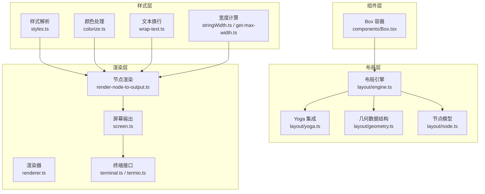
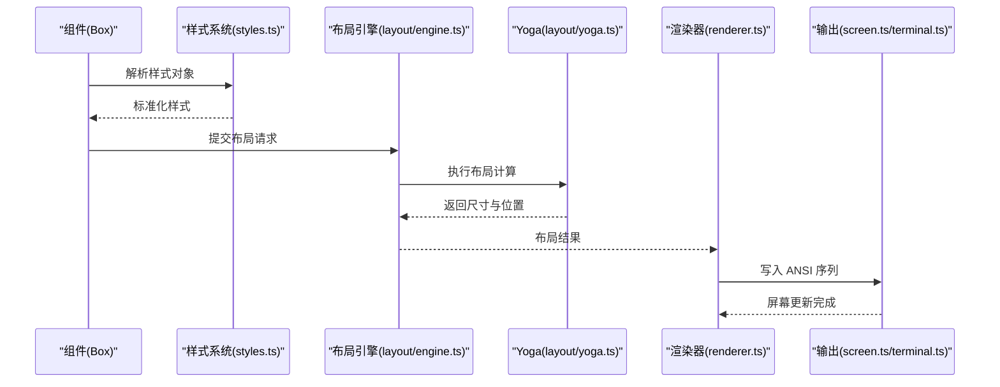
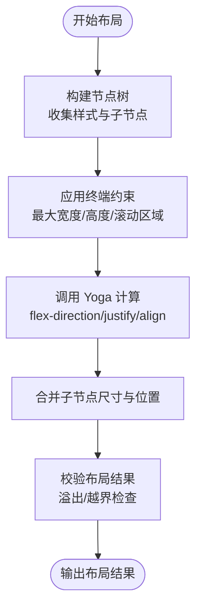
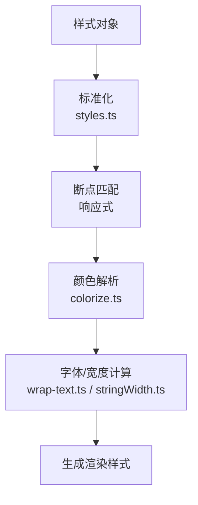
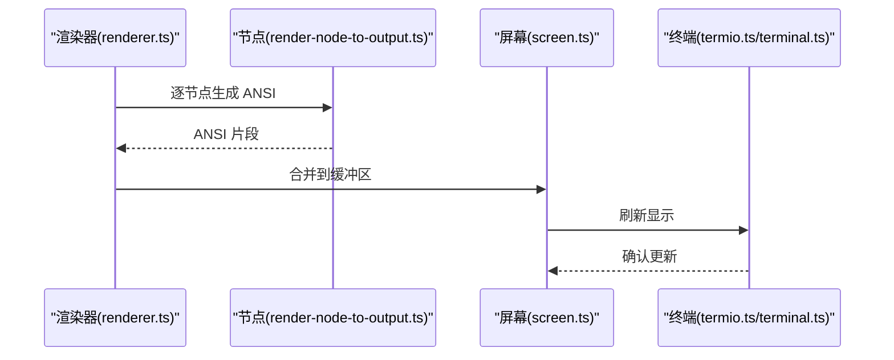
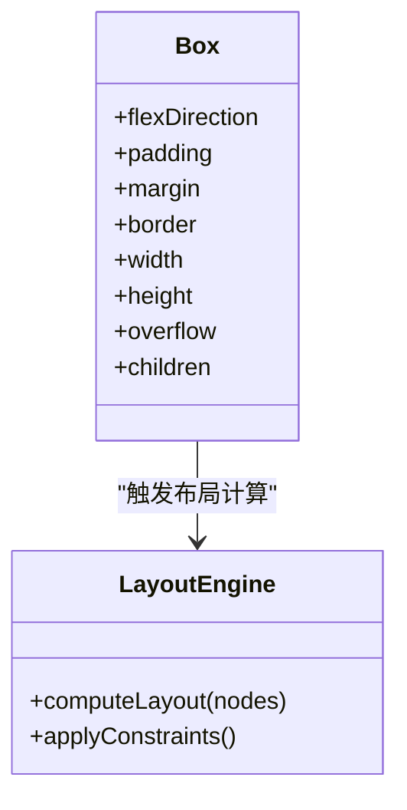
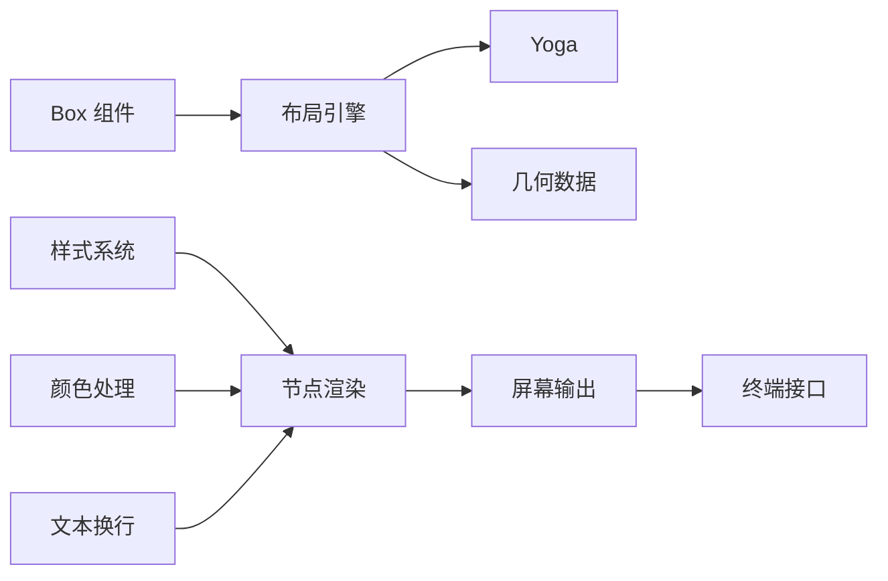

# 布局与样式系统

<cite>
**本文档引用的文件**
- [src/ink/layout/engine.ts](file://src/ink/layout/engine.ts)
- [src/ink/layout/yoga.ts](file://src/ink/layout/yoga.ts)
- [src/ink/styles.ts](file://src/ink/styles.ts)
- [src/ink/components/Box.tsx](file://src/ink/components/Box.tsx)
- [src/ink/renderer.ts](file://src/ink/renderer.ts)
- [src/ink/render-node-to-output.ts](file://src/ink/render-node-to-output.ts)
- [src/ink/measure-text.ts](file://src/ink/measure-text.ts)
- [src/ink/stringWidth.ts](file://src/ink/stringWidth.ts)
- [src/ink/colorize.ts](file://src/ink/colorize.ts)
- [src/ink/wrap-text.ts](file://src/ink/wrap-text.ts)
- [src/ink/get-max-width.ts](file://src/ink/get-max-width.ts)
- [src/ink/optimizer.ts](file://src/ink/optimizer.ts)
- [src/ink/screen.ts](file://src/ink/screen.ts)
- [src/ink/terminal.ts](file://src/ink/terminal.ts)
- [src/ink/termio.ts](file://src/ink/termio.ts)
</cite>

## 目录
1. [简介](#简介)
2. [项目结构](#项目结构)
3. [核心组件](#核心组件)
4. [架构总览](#架构总览)
5. [详细组件分析](#详细组件分析)
6. [依赖关系分析](#依赖关系分析)
7. [性能考虑](#性能考虑)
8. [故障排除指南](#故障排除指南)
9. [结论](#结论)

## 简介
本文件面向 Ink 终端 UI 框架的布局与样式系统，系统性阐述布局引擎工作原理（含 Yoga 布局算法集成与终端特有约束）、样式系统实现（CSS-in-JS、颜色处理、字体样式与响应式设计）、主题与样式继承机制，并提供布局调试工具与性能优化策略。目标是帮助开发者在终端环境中高效构建复杂 UI，同时理解底层渲染管线与性能权衡。

## 项目结构
Ink 的布局与样式系统主要分布在以下模块：
- 布局引擎：layout/engine.ts、layout/yoga.ts、layout/geometry.ts、layout/node.ts
- 样式系统：styles.ts、colorize.ts、wrap-text.ts、stringWidth.ts
- 渲染与输出：renderer.ts、render-node-to-output.ts、screen.ts、terminal.ts、termio.ts
- 组件层：components/Box.tsx（布局容器）
- 文本测量：measure-text.ts、stringWidth.ts、get-max-width.ts
- 性能优化：optimizer.ts
- 辅助工具：widest-line.ts、squash-text-nodes.ts、hit-test.ts

**图表来源**
- [src/ink/layout/engine.ts](file://src/ink/layout/engine.ts)
- [src/ink/layout/yoga.ts](file://src/ink/layout/yoga.ts)
- [src/ink/styles.ts](file://src/ink/styles.ts)
- [src/ink/render-node-to-output.ts](file://src/ink/render-node-to-output.ts)
- [src/ink/renderer.ts](file://src/ink/renderer.ts)
- [src/ink/components/Box.tsx](file://src/ink/components/Box.tsx)
- [src/ink/stringWidth.ts](file://src/ink/stringWidth.ts)
- [src/ink/get-max-width.ts](file://src/ink/get-max-width.ts)
- [src/ink/terminal.ts](file://src/ink/terminal.ts)
- [src/ink/termio.ts](file://src/ink/termio.ts)

**章节来源**
- [src/ink/layout/engine.ts](file://src/ink/layout/engine.ts)
- [src/ink/layout/yoga.ts](file://src/ink/layout/yoga.ts)
- [src/ink/styles.ts](file://src/ink/styles.ts)
- [src/ink/components/Box.tsx](file://src/ink/components/Box.tsx)
- [src/ink/renderer.ts](file://src/ink/renderer.ts)
- [src/ink/render-node-to-output.ts](file://src/ink/render-node-to-output.ts)
- [src/ink/stringWidth.ts](file://src/ink/stringWidth.ts)
- [src/ink/get-max-width.ts](file://src/ink/get-max-width.ts)
- [src/ink/terminal.ts](file://src/ink/terminal.ts)
- [src/ink/termio.ts](file://src/ink/termio.ts)

## 核心组件
- 布局引擎：负责树形节点的布局计算，结合 Yoga 引擎进行尺寸与位置推导，并处理终端特有的约束（如固定宽高、光标控制、滚动区域）。
- 样式系统：提供 CSS-in-JS 能力，解析样式对象，处理颜色、字体、边距内边距等属性，并支持响应式断点与主题继承。
- 渲染器：将布局结果转换为 ANSI 输出，管理屏幕缓冲区、光标移动、颜色应用与文本换行。
- 组件层：Box 作为通用布局容器，暴露 flexDirection、padding、margin、border 等属性，供上层 UI 构建使用。

**章节来源**
- [src/ink/layout/engine.ts](file://src/ink/layout/engine.ts)
- [src/ink/styles.ts](file://src/ink/styles.ts)
- [src/ink/renderer.ts](file://src/ink/renderer.ts)
- [src/ink/components/Box.tsx](file://src/ink/components/Box.tsx)

## 架构总览
Ink 的布局与样式系统遵循“声明式样式 + 命令式布局”的组合模式：
- 组件通过样式对象声明外观与布局意图。
- 布局引擎基于 Yoga 计算每个节点的最终尺寸与位置。
- 渲染器将布局结果映射到 ANSI 序列，写入终端屏幕。

**图表来源**
- [src/ink/components/Box.tsx](file://src/ink/components/Box.tsx)
- [src/ink/styles.ts](file://src/ink/styles.ts)
- [src/ink/layout/engine.ts](file://src/ink/layout/engine.ts)
- [src/ink/layout/yoga.ts](file://src/ink/layout/yoga.ts)
- [src/ink/renderer.ts](file://src/ink/renderer.ts)
- [src/ink/screen.ts](file://src/ink/screen.ts)
- [src/ink/terminal.ts](file://src/ink/terminal.ts)

## 详细组件分析

### 布局引擎与 Yoga 集成
- 节点模型：layout/node.ts 定义了节点的属性集合（尺寸、边距、内边距、方向等），并与 Yoga 的 Flexbox 概念对齐。
- 几何数据：layout/geometry.ts 提供矩形、尺寸、间距等几何类型，用于布局计算的输入与输出。
- 布局流程：layout/engine.ts 负责协调 Yoga 计算、应用终端约束（如最大宽度、行高限制）、合并子节点布局结果。
- 终端约束：在终端环境中，布局需考虑字符宽度（全角/半角）、ANSI 转义序列长度、光标移动指令开销等因素。

**图表来源**
- [src/ink/layout/engine.ts](file://src/ink/layout/engine.ts)
- [src/ink/layout/yoga.ts](file://src/ink/layout/yoga.ts)
- [src/ink/layout/geometry.ts](file://src/ink/layout/geometry.ts)
- [src/ink/layout/node.ts](file://src/ink/layout/node.ts)

**章节来源**
- [src/ink/layout/engine.ts](file://src/ink/layout/engine.ts)
- [src/ink/layout/yoga.ts](file://src/ink/layout/yoga.ts)
- [src/ink/layout/geometry.ts](file://src/ink/layout/geometry.ts)
- [src/ink/layout/node.ts](file://src/ink/layout/node.ts)

### 样式系统（CSS-in-JS）
- 样式解析：styles.ts 将传入的样式对象标准化，处理缩写属性（如 margin/padding/border）、单位转换（px/rem/ch 单位）、伪类与媒体查询断点。
- 颜色处理：colorize.ts 提供颜色解析与 ANSI 转换，支持 RGB/HSL/十六进制与终端色彩空间映射。
- 字体样式：wrap-text.ts 结合 stringWidth.ts 进行字符宽度计算，确保在终端中正确换行与截断。
- 主题与继承：样式系统支持主题上下文注入，子组件可继承父级样式并按规则覆盖；响应式设计通过断点匹配实现不同终端尺寸下的布局调整。

**图表来源**
- [src/ink/styles.ts](file://src/ink/styles.ts)
- [src/ink/colorize.ts](file://src/ink/colorize.ts)
- [src/ink/wrap-text.ts](file://src/ink/wrap-text.ts)
- [src/ink/stringWidth.ts](file://src/ink/stringWidth.ts)

**章节来源**
- [src/ink/styles.ts](file://src/ink/styles.ts)
- [src/ink/colorize.ts](file://src/ink/colorize.ts)
- [src/ink/wrap-text.ts](file://src/ink/wrap-text.ts)
- [src/ink/stringWidth.ts](file://src/ink/stringWidth.ts)

### 渲染管线与输出
- 渲染器：renderer.ts 负责遍历布局树，生成 ANSI 序列，处理背景色、前景色、加粗、下划线等样式。
- 节点渲染：render-node-to-output.ts 将单个节点的布局与样式映射为具体输出命令，包含光标定位、区域填充、边框绘制等。
- 屏幕与终端：screen.ts 管理屏幕缓冲与脏区域更新，terminal.ts/termio.ts 处理底层终端协议与输入事件。

**图表来源**
- [src/ink/renderer.ts](file://src/ink/renderer.ts)
- [src/ink/render-node-to-output.ts](file://src/ink/render-node-to-output.ts)
- [src/ink/screen.ts](file://src/ink/screen.ts)
- [src/ink/termio.ts](file://src/ink/termio.ts)
- [src/ink/terminal.ts](file://src/ink/terminal.ts)

**章节来源**
- [src/ink/renderer.ts](file://src/ink/renderer.ts)
- [src/ink/render-node-to-output.ts](file://src/ink/render-node-to-output.ts)
- [src/ink/screen.ts](file://src/ink/screen.ts)
- [src/ink/termio.ts](file://src/ink/termio.ts)
- [src/ink/terminal.ts](file://src/ink/terminal.ts)

### Box 组件与布局容器
- Box 作为通用布局容器，接收 flexDirection、padding、margin、border、width/height、overflow 等属性，内部通过布局引擎计算子元素排列与尺寸。
- 支持嵌套 Box 形成复杂的栅格或卡片布局，便于构建终端页面结构。

**图表来源**
- [src/ink/components/Box.tsx](file://src/ink/components/Box.tsx)
- [src/ink/layout/engine.ts](file://src/ink/layout/engine.ts)

**章节来源**
- [src/ink/components/Box.tsx](file://src/ink/components/Box.tsx)
- [src/ink/layout/engine.ts](file://src/ink/layout/engine.ts)

## 依赖关系分析
- 组件层依赖布局引擎与样式系统，Box 仅负责声明布局意图。
- 布局引擎依赖 Yoga 与几何数据结构，负责终端约束适配。
- 样式系统依赖颜色与文本宽度计算模块，保证渲染一致性。
- 渲染器依赖节点渲染与屏幕模块，负责输出到终端。

**图表来源**
- [src/ink/components/Box.tsx](file://src/ink/components/Box.tsx)
- [src/ink/layout/engine.ts](file://src/ink/layout/engine.ts)
- [src/ink/layout/yoga.ts](file://src/ink/layout/yoga.ts)
- [src/ink/styles.ts](file://src/ink/styles.ts)
- [src/ink/colorize.ts](file://src/ink/colorize.ts)
- [src/ink/wrap-text.ts](file://src/ink/wrap-text.ts)
- [src/ink/render-node-to-output.ts](file://src/ink/render-node-to-output.ts)
- [src/ink/screen.ts](file://src/ink/screen.ts)
- [src/ink/terminal.ts](file://src/ink/terminal.ts)

**章节来源**
- [src/ink/components/Box.tsx](file://src/ink/components/Box.tsx)
- [src/ink/layout/engine.ts](file://src/ink/layout/engine.ts)
- [src/ink/layout/yoga.ts](file://src/ink/layout/yoga.ts)
- [src/ink/styles.ts](file://src/ink/styles.ts)
- [src/ink/colorize.ts](file://src/ink/colorize.ts)
- [src/ink/wrap-text.ts](file://src/ink/wrap-text.ts)
- [src/ink/render-node-to-output.ts](file://src/ink/render-node-to-output.ts)
- [src/ink/screen.ts](file://src/ink/screen.ts)
- [src/ink/terminal.ts](file://src/ink/terminal.ts)

## 性能考虑
- 布局计算优化
  - 使用 optimizer.ts 对重复布局进行缓存，避免在无变更时重复计算。
  - 合理拆分布局树，减少大规模重排范围。
  - 在终端环境中优先使用固定尺寸容器，降低 Yoga 计算复杂度。
- 文本测量优化
  - stringWidth.ts 与 get-max-width.ts 缓存字符宽度，减少重复测量。
  - wrap-text.ts 采用惰性换行策略，仅在需要时计算换行点。
- 渲染性能
  - render-node-to-output.ts 合并相邻相同样式片段，减少 ANSI 序列长度。
  - screen.ts 使用脏区域更新，仅刷新变化部分。
- 输入与事件
  - termio.ts 与 terminal.ts 通过流式解析与批量写入，降低 I/O 开销。

**章节来源**
- [src/ink/optimizer.ts](file://src/ink/optimizer.ts)
- [src/ink/stringWidth.ts](file://src/ink/stringWidth.ts)
- [src/ink/get-max-width.ts](file://src/ink/get-max-width.ts)
- [src/ink/wrap-text.ts](file://src/ink/wrap-text.ts)
- [src/ink/render-node-to-output.ts](file://src/ink/render-node-to-output.ts)
- [src/ink/screen.ts](file://src/ink/screen.ts)
- [src/ink/termio.ts](file://src/ink/termio.ts)
- [src/ink/terminal.ts](file://src/ink/terminal.ts)

## 故障排除指南
- 布局异常
  - 检查 Box 的尺寸与 flex 属性是否冲突，确认终端最大宽度设置。
  - 使用布局调试工具（如在渲染前打印布局树）定位问题节点。
- 样式不生效
  - 确认样式对象未被主题覆盖或断点未命中。
  - 检查颜色值是否在当前终端色彩模式下可用。
- 文本截断与换行错误
  - 核对字符串宽度计算逻辑，确保全角/半角字符处理一致。
  - 调整 wrap-text 的断点策略以适配不同终端宽度。
- 渲染闪烁
  - 检查屏幕脏区域更新策略，避免频繁全屏刷新。
  - 优化 ANSI 序列生成，减少不必要的光标移动与颜色切换。

**章节来源**
- [src/ink/render-node-to-output.ts](file://src/ink/render-node-to-output.ts)
- [src/ink/screen.ts](file://src/ink/screen.ts)
- [src/ink/stringWidth.ts](file://src/ink/stringWidth.ts)
- [src/ink/wrap-text.ts](file://src/ink/wrap-text.ts)

## 结论
Ink 的布局与样式系统通过“声明式样式 + 命令式布局”的组合，在终端这一特殊平台上实现了灵活且高性能的 UI 构建能力。Yoga 布局算法提供了强大的弹性布局能力，而样式系统与渲染管线则确保了在 ANSI 环境中的表现一致性。通过合理的缓存、断点与增量更新策略，可以在保持开发体验的同时获得良好的运行性能。