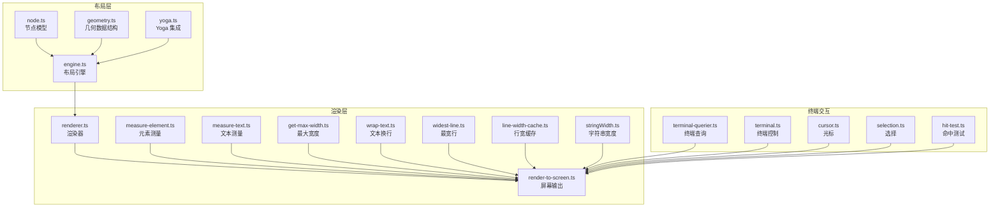
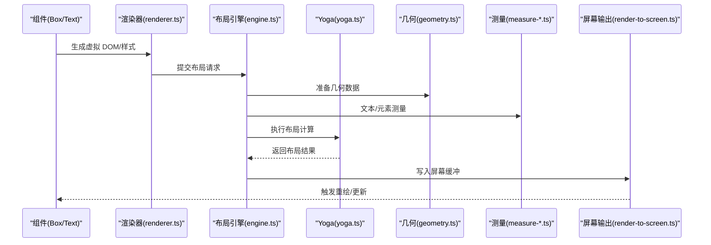
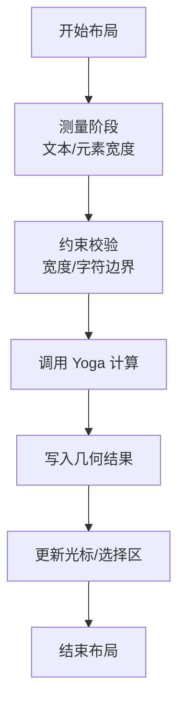
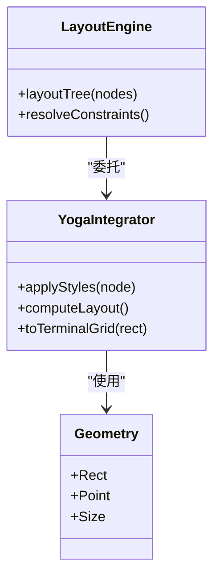
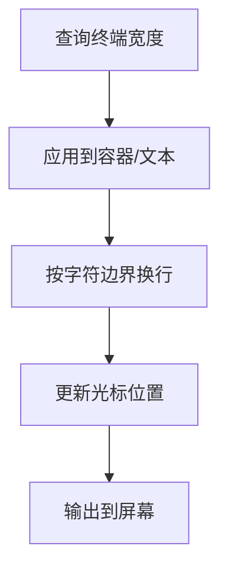
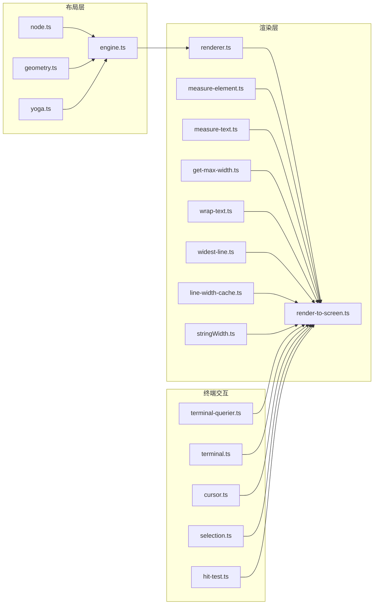

# 布局引擎

<cite>
**本文引用的文件**
- [engine.ts](file://src/ink/layout/engine.ts)
- [node.ts](file://src/ink/layout/node.ts)
- [yoga.ts](file://src/ink/layout/yoga.ts)
- [geometry.ts](file://src/ink/layout/geometry.ts)
- [renderer.ts](file://src/ink/renderer.ts)
- [render-to-screen.ts](file://src/ink/render-to-screen.ts)
- [measure-element.ts](file://src/ink/measure-element.ts)
- [measure-text.ts](file://src/ink/measure-text.ts)
- [get-max-width.ts](file://src/ink/get-max-width.ts)
- [wrap-text.ts](file://src/ink/wrap-text.ts)
- [widest-line.ts](file://src/ink/widest-line.ts)
- [line-width-cache.ts](file://src/ink/line-width-cache.ts)
- [stringWidth.ts](file://src/ink/stringWidth.ts)
- [terminal.ts](file://src/ink/terminal.ts)
- [terminal-querier.ts](file://src/ink/terminal-querier.ts)
- [Box.tsx](file://src/ink/components/Box.tsx)
- [Text.tsx](file://src/ink/components/Text.tsx)
- [ScrollBox.tsx](file://src/ink/components/ScrollBox.tsx)
- [cursor.ts](file://src/ink/cursor.ts)
- [selection.ts](file://src/ink/selection.ts)
- [hit-test.ts](file://src/ink/hit-test.ts)
- [optimizer.ts](file://src/ink/optimizer.ts)
- [reconciler.ts](file://src/ink/reconciler.ts)
</cite>

## 目录
1. [引言](#引言)
2. [项目结构](#项目结构)
3. [核心组件](#核心组件)
4. [架构总览](#架构总览)
5. [详细组件分析](#详细组件分析)
6. [依赖关系分析](#依赖关系分析)
7. [性能考量](#性能考量)
8. [故障排查指南](#故障排查指南)
9. [结论](#结论)
10. [附录](#附录)

## 引言
本文件系统性阐述 Ink 终端 UI 框架的布局引擎，覆盖节点树管理、布局计算流程以及与 Yoga 布局算法的集成方式；重点说明终端特有的约束（固定宽度、字符边界、光标位置）处理策略；并提供布局调试工具与性能优化建议，辅以可定位到源码的示例路径，帮助读者快速上手并构建复杂的终端界面。

## 项目结构
Ink 的布局相关实现集中在 src/ink/layout 目录，围绕“节点模型 + 几何计算 + Yoga 集成”的三层设计展开，同时在渲染层通过测量、换行、宽度计算等工具函数支撑终端布局的准确性与性能。

图示来源
- [engine.ts](file://src/ink/layout/engine.ts)
- [node.ts](file://src/ink/layout/node.ts)
- [geometry.ts](file://src/ink/layout/geometry.ts)
- [yoga.ts](file://src/ink/layout/yoga.ts)
- [renderer.ts](file://src/ink/renderer.ts)
- [render-to-screen.ts](file://src/ink/render-to-screen.ts)
- [measure-element.ts](file://src/ink/measure-element.ts)
- [measure-text.ts](file://src/ink/measure-text.ts)
- [get-max-width.ts](file://src/ink/get-max-width.ts)
- [wrap-text.ts](file://src/ink/wrap-text.ts)
- [widest-line.ts](file://src/ink/widest-line.ts)
- [line-width-cache.ts](file://src/ink/line-width-cache.ts)
- [stringWidth.ts](file://src/ink/stringWidth.ts)
- [terminal-querier.ts](file://src/ink/terminal-querier.ts)
- [terminal.ts](file://src/ink/terminal.ts)
- [cursor.ts](file://src/ink/cursor.ts)
- [selection.ts](file://src/ink/selection.ts)
- [hit-test.ts](file://src/ink/hit-test.ts)

章节来源
- [engine.ts](file://src/ink/layout/engine.ts)
- [node.ts](file://src/ink/layout/node.ts)
- [geometry.ts](file://src/ink/layout/geometry.ts)
- [yoga.ts](file://src/ink/layout/yoga.ts)
- [renderer.ts](file://src/ink/renderer.ts)
- [render-to-screen.ts](file://src/ink/render-to-screen.ts)

## 核心组件
- 节点模型：定义布局树节点的数据结构与属性，承载尺寸、边距、内边距、对齐等布局信息。
- 几何数据：封装矩形区域、偏移、尺寸等几何运算所需的基础类型与工具。
- Yoga 集成：桥接第三方 Yoga 布局库，将 React 风格的样式规则转换为终端可执行的布局指令。
- 布局引擎：协调节点树、几何计算与 Yoga，完成从声明式样式到终端像素级排布的最终映射。
- 渲染器与屏幕输出：将布局结果转化为 ANSI 输出，处理光标、选择区、滚动等终端特性。
- 测量与换行：提供文本测量、行宽缓存、换行策略，确保字符边界与终端宽度一致。
- 终端交互：查询终端尺寸、控制光标、处理命中测试与选择，保证布局与用户交互一致。

章节来源
- [node.ts](file://src/ink/layout/node.ts)
- [geometry.ts](file://src/ink/layout/geometry.ts)
- [yoga.ts](file://src/ink/layout/yoga.ts)
- [engine.ts](file://src/ink/layout/engine.ts)
- [renderer.ts](file://src/ink/renderer.ts)
- [render-to-screen.ts](file://src/ink/render-to-screen.ts)
- [measure-element.ts](file://src/ink/measure-element.ts)
- [measure-text.ts](file://src/ink/measure-text.ts)
- [get-max-width.ts](file://src/ink/get-max-width.ts)
- [wrap-text.ts](file://src/ink/wrap-text.ts)
- [widest-line.ts](file://src/ink/widest-line.ts)
- [line-width-cache.ts](file://src/ink/line-width-cache.ts)
- [stringWidth.ts](file://src/ink/stringWidth.ts)
- [terminal-querier.ts](file://src/ink/terminal-querier.ts)
- [terminal.ts](file://src/ink/terminal.ts)
- [cursor.ts](file://src/ink/cursor.ts)
- [selection.ts](file://src/ink/selection.ts)
- [hit-test.ts](file://src/ink/hit-test.ts)

## 架构总览
Ink 布局引擎采用“声明式样式 + 计算式布局 + 终端渲染”的分层架构。顶层组件（如 Box、Text、ScrollBox）通过样式声明布局意图；布局引擎负责解析样式、调用 Yoga 完成计算，并结合终端特性（宽度、光标、选择）生成最终输出。

图示来源
- [renderer.ts](file://src/ink/renderer.ts)
- [engine.ts](file://src/ink/layout/engine.ts)
- [yoga.ts](file://src/ink/layout/yoga.ts)
- [geometry.ts](file://src/ink/layout/geometry.ts)
- [measure-element.ts](file://src/ink/measure-element.ts)
- [measure-text.ts](file://src/ink/measure-text.ts)
- [render-to-screen.ts](file://src/ink/render-to-screen.ts)

## 详细组件分析

### 节点树与布局计算流程
- 节点模型：节点持有尺寸、边距、内边距、对齐、换行等属性，支持父子关系与兄弟遍历。
- 布局计算：引擎按深度优先遍历节点树，先进行测量（文本/元素），再调用 Yoga 计算绝对位置与尺寸，最后写入几何结果。
- 终端约束：严格遵循终端宽度限制，字符边界对齐，避免跨列截断；光标移动与选择区同步更新。

图示来源
- [engine.ts](file://src/ink/layout/engine.ts)
- [node.ts](file://src/ink/layout/node.ts)
- [geometry.ts](file://src/ink/layout/geometry.ts)
- [measure-text.ts](file://src/ink/measure-text.ts)
- [get-max-width.ts](file://src/ink/get-max-width.ts)
- [cursor.ts](file://src/ink/cursor.ts)
- [selection.ts](file://src/ink/selection.ts)

章节来源
- [engine.ts](file://src/ink/layout/engine.ts)
- [node.ts](file://src/ink/layout/node.ts)
- [geometry.ts](file://src/ink/layout/geometry.ts)

### Yoga 布局算法集成
- 样式到布局：将 React 风格的样式（如 flex、padding、margin、align）映射到 Yoga 的布局属性。
- 计算策略：优先确定主轴方向（水平/垂直），根据内容尺寸与容器剩余空间分配空间；处理 wrap、justify、align 等复杂组合。
- 终端适配：在 Yoga 结果基础上，将浮点坐标四舍五入到字符网格，确保像素对齐。

图示来源
- [yoga.ts](file://src/ink/layout/yoga.ts)
- [engine.ts](file://src/ink/layout/engine.ts)
- [geometry.ts](file://src/ink/layout/geometry.ts)

章节来源
- [yoga.ts](file://src/ink/layout/yoga.ts)
- [engine.ts](file://src/ink/layout/engine.ts)
- [geometry.ts](file://src/ink/layout/geometry.ts)

### 终端特有约束处理
- 固定宽度：通过终端查询器获取当前宽度，作为所有容器的上限；超过宽度的内容进行换行或溢出处理。
- 字符边界：按字符而非字节进行测量与截断，避免 UTF-8 多字节字符被截断。
- 光标位置：布局完成后，根据光标状态与选择区调整输出顺序，确保可见性与一致性。

图示来源
- [terminal-querier.ts](file://src/ink/terminal-querier.ts)
- [get-max-width.ts](file://src/ink/get-max-width.ts)
- [wrap-text.ts](file://src/ink/wrap-text.ts)
- [stringWidth.ts](file://src/ink/stringWidth.ts)
- [cursor.ts](file://src/ink/cursor.ts)

章节来源
- [terminal-querier.ts](file://src/ink/terminal-querier.ts)
- [get-max-width.ts](file://src/ink/get-max-width.ts)
- [wrap-text.ts](file://src/ink/wrap-text.ts)
- [stringWidth.ts](file://src/ink/stringWidth.ts)
- [cursor.ts](file://src/ink/cursor.ts)

### 布局调试工具与技巧
- 可视化：通过渲染器输出辅助标记（如边框、颜色块）快速定位布局问题。
- 性能分析：利用行宽缓存与测量缓存减少重复计算；在高频更新场景下启用增量更新与最小化重绘。
- 命令行调试：结合终端查询器与光标控制，逐步验证布局树与输出顺序的一致性。

章节来源
- [render-to-screen.ts](file://src/ink/render-to-screen.ts)
- [line-width-cache.ts](file://src/ink/line-width-cache.ts)
- [optimizer.ts](file://src/ink/optimizer.ts)
- [terminal-querier.ts](file://src/ink/terminal-querier.ts)
- [cursor.ts](file://src/ink/cursor.ts)

### 实际使用示例（路径指引）
以下示例均提供可定位到源码的路径，便于对照学习：

- 创建一个基础布局容器与文本节点
  - [Box 容器组件](file://src/ink/components/Box.tsx)
  - [Text 文本组件](file://src/ink/components/Text.tsx)
  - [布局引擎入口](file://src/ink/layout/engine.ts)

- 使用 ScrollBox 实现可滚动区域
  - [ScrollBox 组件](file://src/ink/components/ScrollBox.tsx)
  - [渲染与滚动逻辑](file://src/ink/render-to-screen.ts)

- 处理长文本换行与字符边界
  - [文本换行实现](file://src/ink/wrap-text.ts)
  - [最宽行计算](file://src/ink/widest-line.ts)
  - [行宽缓存](file://src/ink/line-width-cache.ts)
  - [字符串宽度计算](file://src/ink/stringWidth.ts)

- 获取终端宽度并应用到布局
  - [终端查询器](file://src/ink/terminal-querier.ts)
  - [最大宽度工具](file://src/ink/get-max-width.ts)

- 光标与选择交互
  - [光标控制](file://src/ink/cursor.ts)
  - [选择逻辑](file://src/ink/selection.ts)
  - [命中测试](file://src/ink/hit-test.ts)

## 依赖关系分析
- 布局层内部：节点模型依赖几何数据结构；布局引擎协调节点、几何与 Yoga；Yoga 作为外部布局计算后端。
- 渲染层：渲染器依赖布局结果与测量工具；屏幕输出依赖终端查询器与光标控制。
- 组件层：Box/Text/ScrollBox 等组件通过样式声明布局意图，最终由布局引擎与渲染器协同完成。

图示来源
- [engine.ts](file://src/ink/layout/engine.ts)
- [node.ts](file://src/ink/layout/node.ts)
- [geometry.ts](file://src/ink/layout/geometry.ts)
- [yoga.ts](file://src/ink/layout/yoga.ts)
- [renderer.ts](file://src/ink/renderer.ts)
- [render-to-screen.ts](file://src/ink/render-to-screen.ts)
- [measure-element.ts](file://src/ink/measure-element.ts)
- [measure-text.ts](file://src/ink/measure-text.ts)
- [get-max-width.ts](file://src/ink/get-max-width.ts)
- [wrap-text.ts](file://src/ink/wrap-text.ts)
- [widest-line.ts](file://src/ink/widest-line.ts)
- [line-width-cache.ts](file://src/ink/line-width-cache.ts)
- [stringWidth.ts](file://src/ink/stringWidth.ts)
- [terminal-querier.ts](file://src/ink/terminal-querier.ts)
- [terminal.ts](file://src/ink/terminal.ts)
- [cursor.ts](file://src/ink/cursor.ts)
- [selection.ts](file://src/ink/selection.ts)
- [hit-test.ts](file://src/ink/hit-test.ts)

章节来源
- [engine.ts](file://src/ink/layout/engine.ts)
- [renderer.ts](file://src/ink/renderer.ts)
- [render-to-screen.ts](file://src/ink/render-to-screen.ts)

## 性能考量
- 缓存策略：复用行宽与测量结果，避免重复计算；在文本未变化时跳过测量与布局。
- 增量更新：仅对变更节点及其祖先执行布局，减少全局重算。
- 终端优化：批量输出、最小化光标移动次数；在滚动区域使用差分更新。
- 复杂度估算：单次布局复杂度近似 O(N + M)，N 为节点数，M 为文本测量项数；Yoga 计算通常线性于布局约束数量。

## 故障排查指南
- 布局错位
  - 检查是否正确设置容器宽度与换行策略
  - 参考：[wrap-text.ts](file://src/ink/wrap-text.ts)、[get-max-width.ts](file://src/ink/get-max-width.ts)
- 文本截断异常
  - 确认字符边界测量与 UTF-8 处理
  - 参考：[stringWidth.ts](file://src/ink/stringWidth.ts)、[widest-line.ts](file://src/ink/widest-line.ts)
- 光标位置错误
  - 校验布局完成后的光标更新逻辑
  - 参考：[cursor.ts](file://src/ink/cursor.ts)、[render-to-screen.ts](file://src/ink/render-to-screen.ts)
- 选择区不准确
  - 检查命中测试与选择范围映射
  - 参考：[hit-test.ts](file://src/ink/hit-test.ts)、[selection.ts](file://src/ink/selection.ts)
- 性能瓶颈
  - 启用缓存与增量更新
  - 参考：[line-width-cache.ts](file://src/ink/line-width-cache.ts)、[optimizer.ts](file://src/ink/optimizer.ts)

章节来源
- [wrap-text.ts](file://src/ink/wrap-text.ts)
- [get-max-width.ts](file://src/ink/get-max-width.ts)
- [stringWidth.ts](file://src/ink/stringWidth.ts)
- [widest-line.ts](file://src/ink/widest-line.ts)
- [cursor.ts](file://src/ink/cursor.ts)
- [render-to-screen.ts](file://src/ink/render-to-screen.ts)
- [hit-test.ts](file://src/ink/hit-test.ts)
- [selection.ts](file://src/ink/selection.ts)
- [line-width-cache.ts](file://src/ink/line-width-cache.ts)
- [optimizer.ts](file://src/ink/optimizer.ts)

## 结论
Ink 的布局引擎通过清晰的分层设计与终端友好的约束处理，实现了从声明式样式到终端可视输出的高效映射。借助 Yoga 的成熟布局能力与一系列测量、换行、缓存工具，开发者可以稳定地构建复杂的终端界面。配合调试与性能优化手段，可在保证体验的同时提升开发效率。

## 附录
- 相关组件参考
  - [Box.tsx](file://src/ink/components/Box.tsx)
  - [Text.tsx](file://src/ink/components/Text.tsx)
  - [ScrollBox.tsx](file://src/ink/components/ScrollBox.tsx)
- 关键流程参考
  - [reconciler.ts](file://src/ink/reconciler.ts)
  - [renderer.ts](file://src/ink/renderer.ts)
  - [render-to-screen.ts](file://src/ink/render-to-screen.ts)