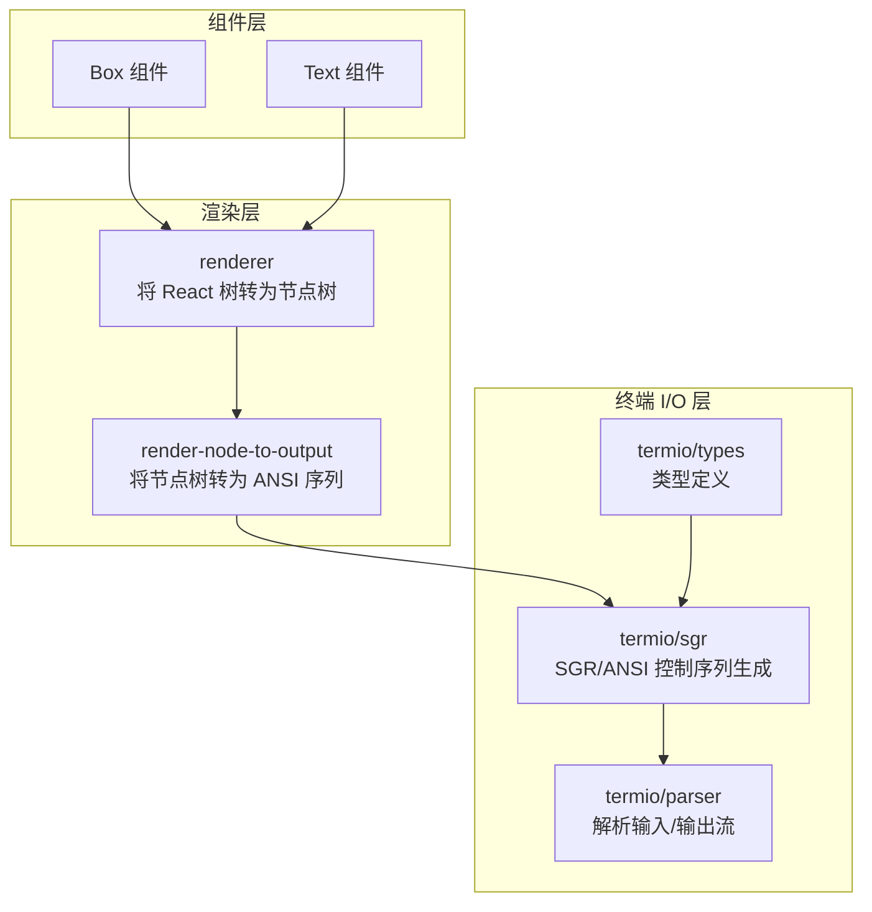
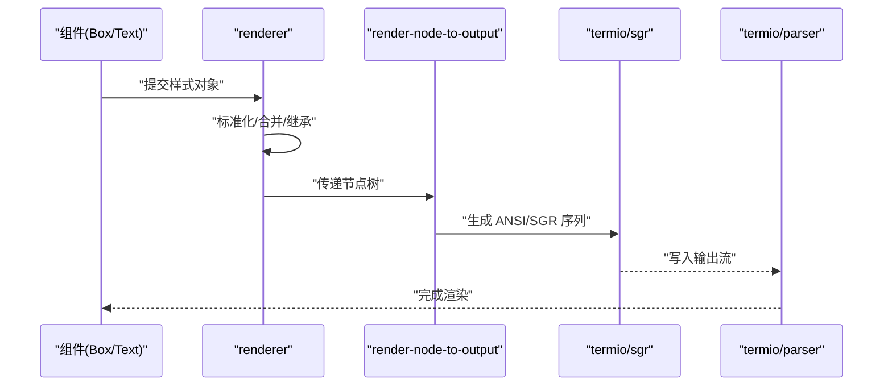
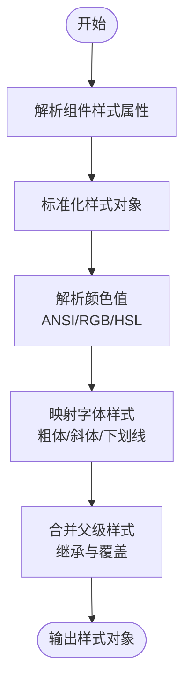
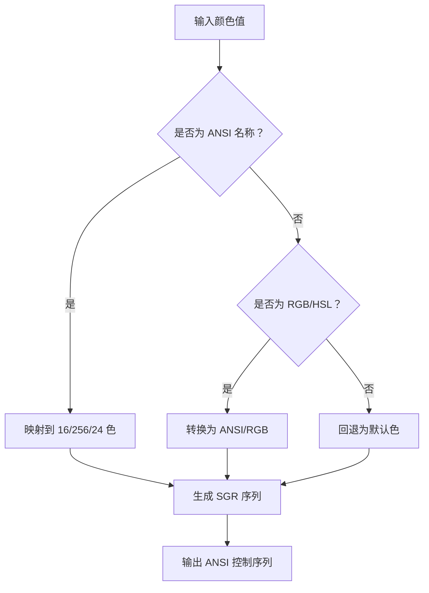
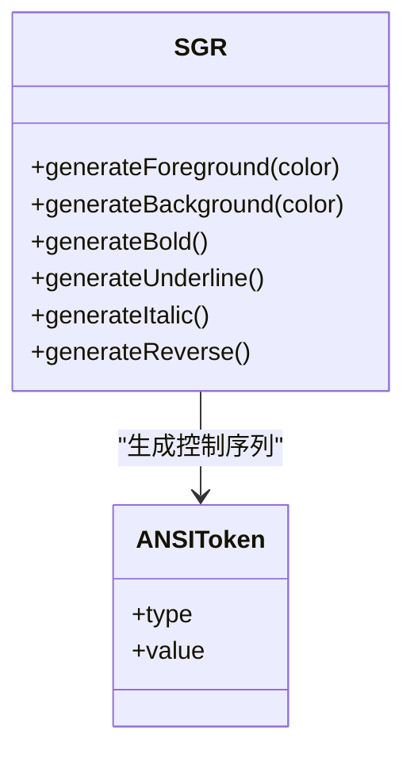
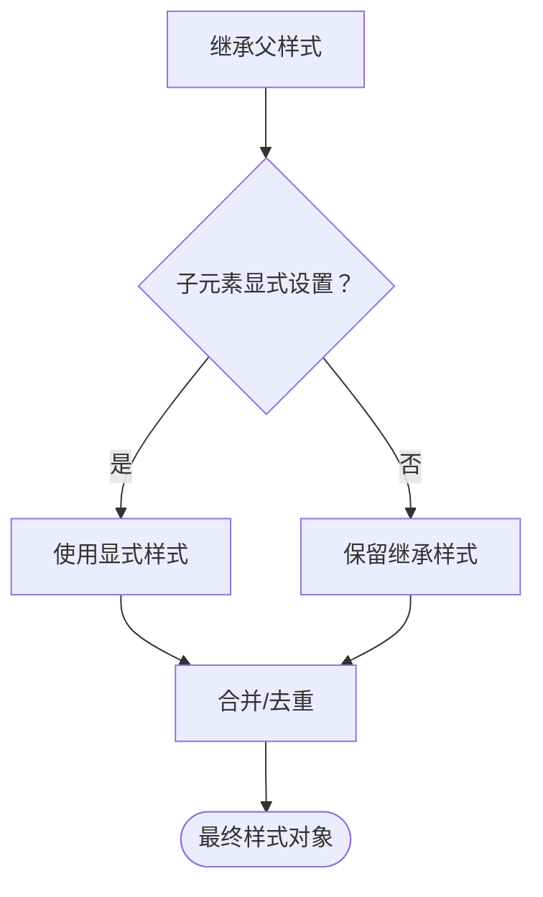
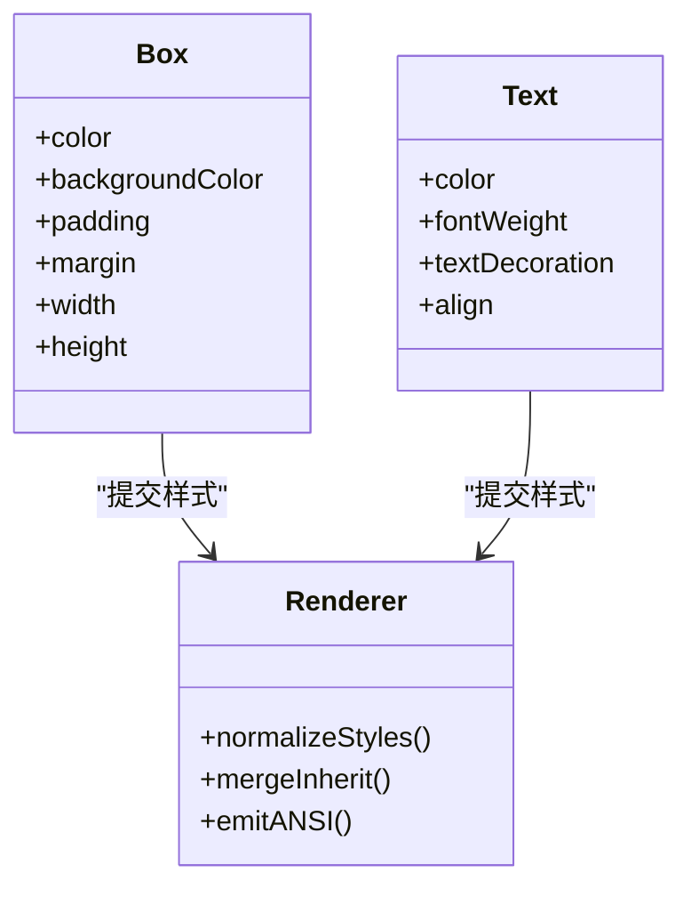
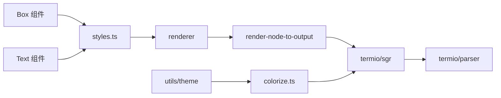

# 样式系统

<cite>
**本文引用的文件**
- [src/ink/styles.ts](file://src/ink/styles.ts)
- [src/ink/colorize.ts](file://src/ink/colorize.ts)
- [src/ink/termio/ansi.ts](file://src/ink/termio/ansi.ts)
- [src/ink/termio/sgr.ts](file://src/ink/termio/sgr.ts)
- [src/ink/render-node-to-output.ts](file://src/ink/render-node-to-output.ts)
- [src/ink/renderer.ts](file://src/ink/renderer.ts)
- [src/ink/components/Box.tsx](file://src/ink/components/Box.tsx)
- [src/ink/components/Text.tsx](file://src/ink/components/Text.tsx)
- [src/ink/termio/types.ts](file://src/ink/termio/types.ts)
- [src/utils/theme.ts](file://src/utils/theme.ts)
- [src/ink.ts](file://src/ink.ts)
- [src/ink/termio/parser.ts](file://src/ink/termio/parser.ts)
- [src/ink/termio/tokenize.ts](file://src/ink/termio/tokenize.ts)
</cite>

## 目录
1. [引言](#引言)
2. [项目结构](#项目结构)
3. [核心组件](#核心组件)
4. [架构总览](#架构总览)
5. [详细组件分析](#详细组件分析)
6. [依赖关系分析](#依赖关系分析)
7. [性能考量](#性能考量)
8. [故障排查指南](#故障排查指南)
9. [结论](#结论)
10. [附录](#附录)

## 引言
本文件面向 Ink 终端 UI 框架的样式系统，聚焦于 CSS-in-JS 实现方案、颜色处理体系（ANSI 编码、颜色空间转换、主题适配）、字体样式（粗体、斜体、下划线等）在终端中的渲染、样式继承与优先级规则，并提供样式调试工具、性能优化技巧及跨平台兼容策略。目标是帮助开发者在终端中以接近现代 Web 的方式编写与维护样式，同时确保在不同终端环境下的稳定表现。

## 项目结构
Ink 的样式系统围绕“React 组件 + 渲染器 + ANSI 码生成”的三层架构组织：
- 组件层：Box、Text 等 UI 组件负责声明样式属性（如 color、backgroundColor、fontWeight 等），并将其转化为内部样式对象。
- 渲染层：renderer 负责将 React 树转换为可输出的节点树；render-node-to-output 将节点树递归转为 ANSI 控制序列。
- 终端 I/O 层：termio 子模块解析与生成 ANSI/SGR 等控制序列，保证在不同终端上的兼容性。

图表来源
- [src/ink/components/Box.tsx](file://src/ink/components/Box.tsx)
- [src/ink/components/Text.tsx](file://src/ink/components/Text.tsx)
- [src/ink/renderer.ts](file://src/ink/renderer.ts)
- [src/ink/render-node-to-output.ts](file://src/ink/render-node-to-output.ts)
- [src/ink/termio/parser.ts](file://src/ink/termio/parser.ts)
- [src/ink/termio/sgr.ts](file://src/ink/termio/sgr.ts)
- [src/ink/termio/types.ts](file://src/ink/termio/types.ts)

章节来源
- [src/ink.ts](file://src/ink.ts)
- [src/ink/components/Box.tsx](file://src/ink/components/Box.tsx)
- [src/ink/components/Text.tsx](file://src/ink/components/Text.tsx)
- [src/ink/renderer.ts](file://src/ink/renderer.ts)
- [src/ink/render-node-to-output.ts](file://src/ink/render-node-to-output.ts)
- [src/ink/termio/parser.ts](file://src/ink/termio/parser.ts)
- [src/ink/termio/sgr.ts](file://src/ink/termio/sgr.ts)
- [src/ink/termio/types.ts](file://src/ink/termio/types.ts)

## 核心组件
- 样式对象构建与解析
  - 组件层通过 props 接收样式属性，内部统一转换为样式对象（包含颜色、字体、布局等字段）。
  - 渲染器对样式对象进行标准化与合并，形成最终的“样式上下文”。
- ANSI 颜色编码与颜色空间转换
  - 支持 ANSI/RGB/HSL 等多种颜色表示，自动根据终端能力选择 16/256/24 位色彩模式。
  - 主题系统提供明暗两套调色板，按需映射到 ANSI 颜色或 RGB。
- 字体样式与终端渲染
  - 粗体、斜体、下划线等效果通过 SGR 控制序列实现，支持在不同终端上回退与兼容。
- 样式继承与优先级
  - 子元素继承父元素未显式覆盖的样式；显式值优先于继承值；内联样式优先于组件默认样式。
- 调试与性能
  - 提供样式调试工具与最小化 ANSI 序列输出策略，减少不必要的闪烁与重绘。

章节来源
- [src/ink/styles.ts](file://src/ink/styles.ts)
- [src/ink/colorize.ts](file://src/ink/colorize.ts)
- [src/utils/theme.ts](file://src/utils/theme.ts)

## 架构总览
Ink 的样式系统采用“组件声明样式 → 渲染器标准化 → ANSI 序列生成 → 终端输出”的流水线式处理。组件层负责语义化声明，渲染层负责计算与优化，终端 I/O 层负责跨平台兼容。

图表来源
- [src/ink/renderer.ts](file://src/ink/renderer.ts)
- [src/ink/render-node-to-output.ts](file://src/ink/render-node-to-output.ts)
- [src/ink/termio/sgr.ts](file://src/ink/termio/sgr.ts)
- [src/ink/termio/parser.ts](file://src/ink/termio/parser.ts)

## 详细组件分析

### 样式对象构建与解析（styles.ts）
- 设计要点
  - 将组件传入的样式属性（如 color、backgroundColor、fontWeight、textDecoration 等）统一规范化为内部样式对象。
  - 处理颜色字符串（支持 ansi:、rgb()、hsl() 等），并在渲染前解析为具体 ANSI 或 RGB 值。
  - 合并父子样式，实现继承与覆盖。
- 关键流程
  - 输入校验与默认值填充
  - 颜色解析与终端能力检测
  - 字体样式映射（粗体/斜体/下划线等）
  - 输出标准化样式对象

图表来源
- [src/ink/styles.ts](file://src/ink/styles.ts)

章节来源
- [src/ink/styles.ts](file://src/ink/styles.ts)

### 颜色处理系统（colorize.ts 与 termio/sgr.ts）
- ANSI 颜色编码
  - 16 色（标准 ANSI）：黑白、红绿蓝黄品红青白及其亮色变体。
  - 256 色：基于 6×6×6 彩色立方与灰阶通道。
  - 24 位真彩：RGB 全范围，部分终端不完全支持。
- 颜色空间转换
  - RGB ↔ HSL 转换用于亮度/饱和度调整与主题一致性。
  - 主题映射：light-ansi 与 dark-ansi 两套调色板，自动选择适合当前主题的颜色。
- SGR 控制序列
  - 使用 termio/sgr 生成前景/背景色、加粗、下划线、反色等控制序列。
  - 在 Apple Terminal 等特殊终端上启用 256 色模式以提升显示质量。
- 主题适配
  - utils/theme.ts 定义了丰富的主题色表，支持按名称引用与动态切换。

图表来源
- [src/ink/colorize.ts](file://src/ink/colorize.ts)
- [src/ink/termio/sgr.ts](file://src/ink/termio/sgr.ts)
- [src/utils/theme.ts](file://src/utils/theme.ts)

章节来源
- [src/ink/colorize.ts](file://src/ink/colorize.ts)
- [src/ink/termio/sgr.ts](file://src/ink/termio/sgr.ts)
- [src/utils/theme.ts](file://src/utils/theme.ts)

### 字体样式与终端渲染（termio/sgr.ts 与 termio/ansi.ts）
- 字体样式实现
  - 粗体：通过 SGR 加粗控制序列实现。
  - 斜体：非所有终端支持，必要时降级为粗体或下划线。
  - 下划线：使用 SGR 下划线控制序列。
  - 反色/高亮：通过前景/背景色反转实现。
- 终端兼容性
  - 对不支持的样式进行安全降级，避免输出乱码。
  - 在 Apple Terminal 等环境下启用 256 色模式，提升色彩还原度。
- 文本装饰链路
  - 组件层声明样式 → 渲染器生成 ANSI 序列 → termio/sgr 输出控制码 → 终端显示。

图表来源
- [src/ink/termio/sgr.ts](file://src/ink/termio/sgr.ts)
- [src/ink/termio/ansi.ts](file://src/ink/termio/ansi.ts)

章节来源
- [src/ink/termio/sgr.ts](file://src/ink/termio/sgr.ts)
- [src/ink/termio/ansi.ts](file://src/ink/termio/ansi.ts)

### 样式继承与优先级（renderer 与 render-node-to-output）
- 继承规则
  - 子元素继承父元素未被显式覆盖的样式属性。
  - 显式设置的样式优先于继承值。
- 优先级顺序（从高到低）
  - 内联样式（组件 props） > 组件默认样式 > 继承样式 > 默认样式。
- 渲染阶段的合并
  - renderer 在节点遍历时进行样式合并与冲突解决，确保最终输出的 ANSI 序列最小化且正确。

图表来源
- [src/ink/renderer.ts](file://src/ink/renderer.ts)
- [src/ink/render-node-to-output.ts](file://src/ink/render-node-to-output.ts)

章节来源
- [src/ink/renderer.ts](file://src/ink/renderer.ts)
- [src/ink/render-node-to-output.ts](file://src/ink/render-node-to-output.ts)

### 组件层样式接口（Box 与 Text）
- Box
  - 负责容器布局与背景色、边框等视觉样式。
  - 支持 padding/margin/width/height 等布局属性。
- Text
  - 负责文本颜色、字体样式、对齐等文本样式。
  - 支持多行文本与换行处理。
- 与渲染器协作
  - 组件将 props 转换为样式对象，交由 renderer 处理，最终由 render-node-to-output 输出 ANSI。

图表来源
- [src/ink/components/Box.tsx](file://src/ink/components/Box.tsx)
- [src/ink/components/Text.tsx](file://src/ink/components/Text.tsx)
- [src/ink/renderer.ts](file://src/ink/renderer.ts)

章节来源
- [src/ink/components/Box.tsx](file://src/ink/components/Box.tsx)
- [src/ink/components/Text.tsx](file://src/ink/components/Text.tsx)
- [src/ink/renderer.ts](file://src/ink/renderer.ts)

## 依赖关系分析
- 组件层依赖渲染器与样式工具，负责声明样式。
- 渲染器依赖样式解析与 ANSI 生成模块，负责计算与优化。
- ANSI 生成模块依赖终端类型与能力探测，负责跨平台兼容。
- 主题系统为颜色解析提供数据源，支持明暗主题切换。

图表来源
- [src/ink/components/Box.tsx](file://src/ink/components/Box.tsx)
- [src/ink/components/Text.tsx](file://src/ink/components/Text.tsx)
- [src/ink/styles.ts](file://src/ink/styles.ts)
- [src/ink/renderer.ts](file://src/ink/renderer.ts)
- [src/ink/render-node-to-output.ts](file://src/ink/render-node-to-output.ts)
- [src/ink/termio/sgr.ts](file://src/ink/termio/sgr.ts)
- [src/ink/termio/parser.ts](file://src/ink/termio/parser.ts)
- [src/utils/theme.ts](file://src/utils/theme.ts)
- [src/ink/colorize.ts](file://src/ink/colorize.ts)

章节来源
- [src/ink/styles.ts](file://src/ink/styles.ts)
- [src/ink/colorize.ts](file://src/ink/colorize.ts)
- [src/ink/termio/sgr.ts](file://src/ink/termio/sgr.ts)
- [src/ink/termio/parser.ts](file://src/ink/termio/parser.ts)
- [src/utils/theme.ts](file://src/utils/theme.ts)

## 性能考量
- 最小化 ANSI 序列
  - 合并连续相同样式段，避免重复发送控制序列。
  - 在渲染前后对比样式差异，仅输出变化部分。
- 缓存与复用
  - 颜色解析结果缓存，避免重复计算。
  - 文本宽度与换行缓存，减少测量开销。
- 渲染优化
  - 批量更新：将多次小更新合并为一次完整重绘。
  - 懒渲染：对不可见区域延迟计算与输出。
- 终端能力探测
  - 根据终端支持能力选择最优颜色深度，避免过度渲染导致卡顿。

## 故障排查指南
- 样式无效或显示异常
  - 检查颜色值格式是否正确（ansi:/rgb()/hsl()）。
  - 确认终端是否支持相应颜色深度与字体样式。
- 文本乱码或控制符异常
  - 排查 ANSI 序列生成是否正确，是否存在未闭合的样式块。
  - 检查 termio/parser 是否正确解析输入/输出流。
- 性能问题
  - 使用最小化策略减少控制序列数量。
  - 启用缓存与批量更新，避免频繁重绘。

章节来源
- [src/ink/termio/parser.ts](file://src/ink/termio/parser.ts)
- [src/ink/termio/sgr.ts](file://src/ink/termio/sgr.ts)
- [src/ink/render-node-to-output.ts](file://src/ink/render-node-to-output.ts)

## 结论
Ink 的样式系统通过“组件声明 + 渲染器优化 + ANSI 生成 + 终端兼容”的架构，在终端环境中实现了接近现代 UI 的样式体验。其核心优势在于：
- 统一的样式对象模型与继承/优先级规则；
- 健壮的颜色处理与主题适配；
- 面向多终端的能力探测与降级策略；
- 面向性能的最小化输出与缓存机制。

建议在实际开发中遵循“显式优于隐式”的原则，合理使用主题与颜色映射，结合调试工具与性能优化手段，获得稳定且高效的终端 UI 体验。

## 附录
- 术语
  - ANSI：美国国家标准学会制定的控制字符标准，终端中广泛用于控制光标、颜色与文本格式。
  - SGR：Set Graphics Rendition，ANSI 控制序列的一种，用于设置前景/背景色与文本装饰。
  - 16/256/24 位色：指终端支持的颜色数量级别，影响色彩还原度与渲染性能。
- 参考文件
  - [src/ink/styles.ts](file://src/ink/styles.ts)
  - [src/ink/colorize.ts](file://src/ink/colorize.ts)
  - [src/ink/termio/sgr.ts](file://src/ink/termio/sgr.ts)
  - [src/ink/termio/parser.ts](file://src/ink/termio/parser.ts)
  - [src/utils/theme.ts](file://src/utils/theme.ts)
  - [src/ink/components/Box.tsx](file://src/ink/components/Box.tsx)
  - [src/ink/components/Text.tsx](file://src/ink/components/Text.tsx)
  - [src/ink.ts](file://src/ink.ts)