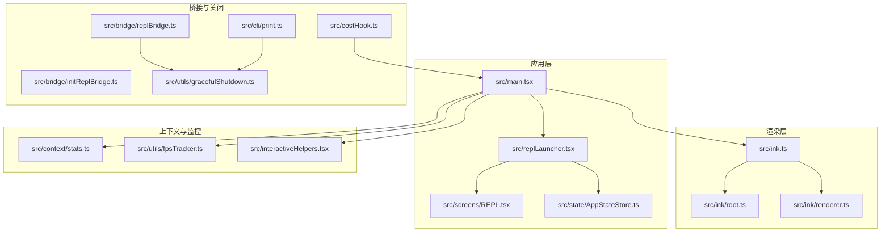
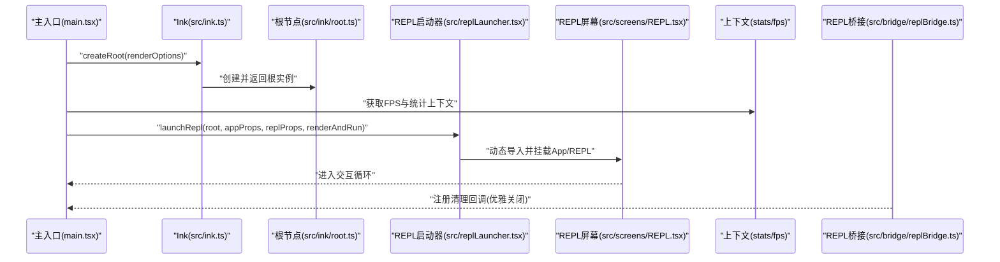
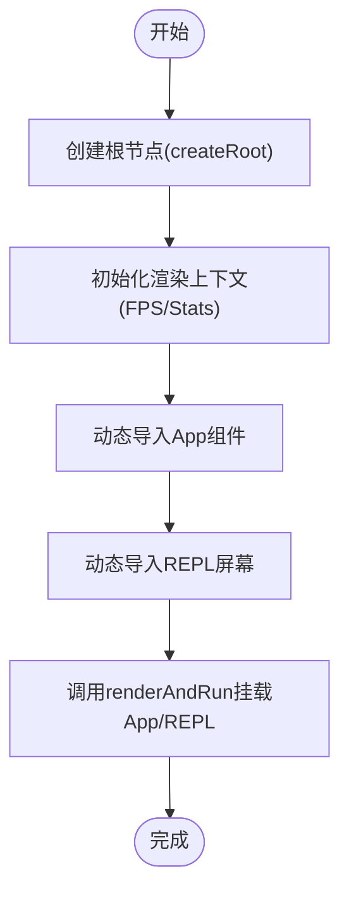
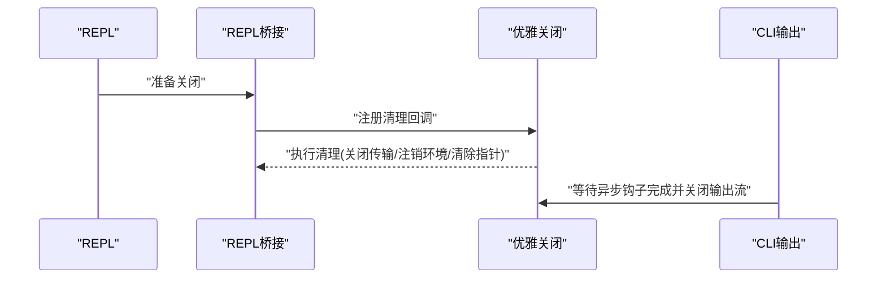
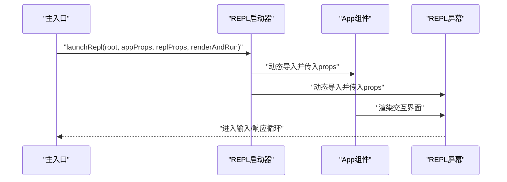
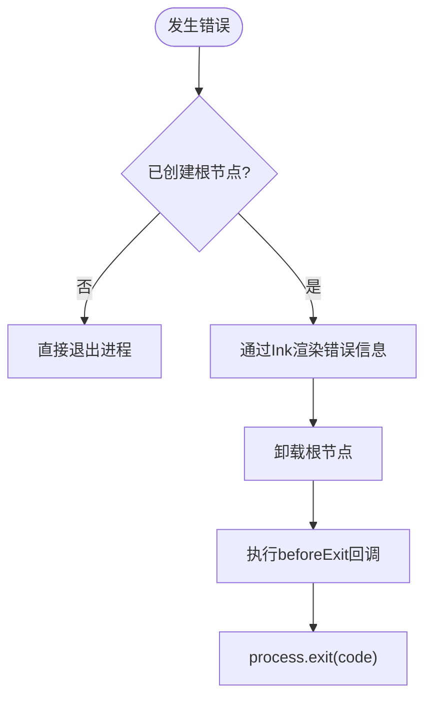
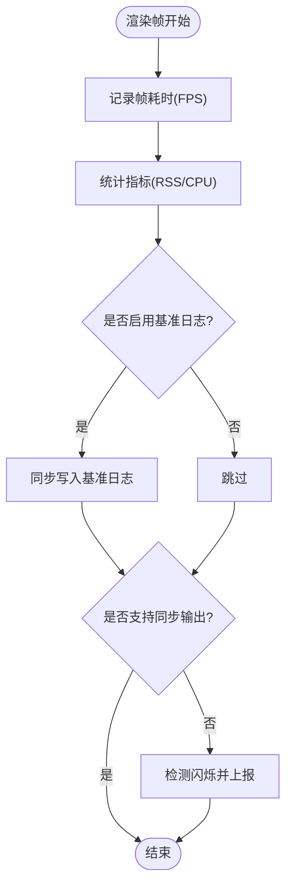
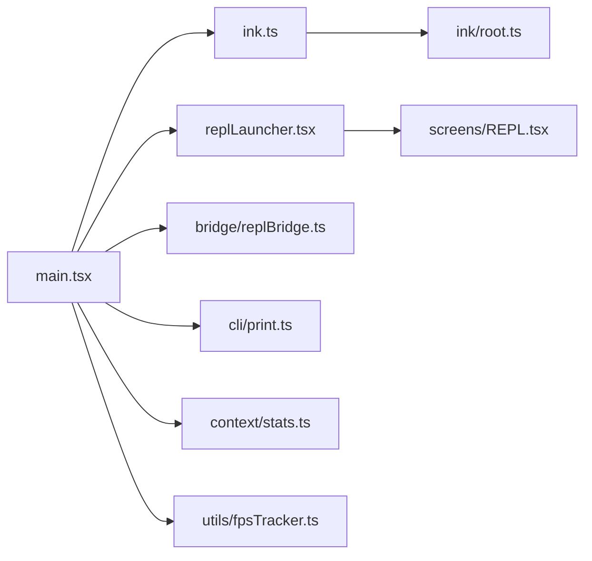

# 应用生命周期管理

<cite>
**本文引用的文件**
- [src/ink.ts](file://src/ink.ts)
- [src/ink/root.ts](file://src/ink/root.ts)
- [src/ink/renderer.ts](file://src/ink/renderer.ts)
- [src/replLauncher.tsx](file://src/replLauncher.tsx)
- [src/main.tsx](file://src/main.tsx)
- [src/interactiveHelpers.tsx](file://src/interactiveHelpers.tsx)
- [src/screens/REPL.tsx](file://src/screens/REPL.tsx)
- [src/state/AppStateStore.ts](file://src/state/AppStateStore.ts)
- [src/context/stats.ts](file://src/context/stats.ts)
- [src/utils/fpsTracker.ts](file://src/utils/fpsTracker.ts)
- [src/utils/gracefulShutdown.ts](file://src/utils/gracefulShutdown.ts)
- [src/bridge/replBridge.ts](file://src/bridge/replBridge.ts)
- [src/bridge/initReplBridge.ts](file://src/bridge/initReplBridge.ts)
- [src/cli/print.ts](file://src/cli/print.ts)
- [src/costHook.ts](file://src/costHook.ts)
</cite>

## 目录
1. [简介](#简介)
2. [项目结构](#项目结构)
3. [核心组件](#核心组件)
4. [架构总览](#架构总览)
5. [详细组件分析](#详细组件分析)
6. [依赖关系分析](#依赖关系分析)
7. [性能考虑](#性能考虑)
8. [故障排查指南](#故障排查指南)
9. [结论](#结论)
10. [附录](#附录)

## 简介
本文件系统性阐述 Ink 终端 UI 框架在本仓库中的应用生命周期管理，覆盖应用初始化（根节点创建、上下文初始化、组件挂载）、运行时管理（实例生命周期、内存与资源清理）、REPL 启动器工作机制与交互模式、应用状态管理、错误处理与优雅关闭，以及性能监控与调试工具的使用方法。目标是帮助开发者在不深入源码的前提下，也能高效理解并正确使用该生命周期体系。

## 项目结构
围绕应用生命周期的关键模块分布如下：
- Ink 渲染层：负责终端 UI 的渲染、实例管理与事件循环
- REPL 启动器：负责将 App 与 REPL 屏幕组合并启动交互会话
- 主入口与上下文：负责创建 Ink 根、注入统计与帧率指标、协调命令与会话
- 状态与统计：提供应用状态存储与运行时指标观测
- 优雅关闭与桥接：负责资源回收、进程退出与 REPL 桥接清理
- CLI 输出与成本钩子：负责非交互输出场景下的收尾与成本统计

图表来源
- [src/ink.ts:1-85](file://src/ink.ts#L1-L85)
- [src/ink/root.ts](file://src/ink/root.ts)
- [src/ink/renderer.ts](file://src/ink/renderer.ts)
- [src/replLauncher.tsx:1-22](file://src/replLauncher.tsx#L1-L22)
- [src/main.tsx:2217-2235](file://src/main.tsx#L2217-L2235)
- [src/screens/REPL.tsx](file://src/screens/REPL.tsx)
- [src/state/AppStateStore.ts](file://src/state/AppStateStore.ts)
- [src/context/stats.ts](file://src/context/stats.ts)
- [src/utils/fpsTracker.ts](file://src/utils/fpsTracker.ts)
- [src/interactiveHelpers.tsx:1-92](file://src/interactiveHelpers.tsx#L1-L92)
- [src/bridge/replBridge.ts:1651-1676](file://src/bridge/replBridge.ts#L1651-L1676)
- [src/bridge/initReplBridge.ts:1-14](file://src/bridge/initReplBridge.ts#L1-L14)
- [src/cli/print.ts:2646-2694](file://src/cli/print.ts#L2646-L2694)
- [src/costHook.ts:1-22](file://src/costHook.ts#L1-L22)

章节来源
- [src/ink.ts:1-85](file://src/ink.ts#L1-L85)
- [src/replLauncher.tsx:1-22](file://src/replLauncher.tsx#L1-L22)
- [src/main.tsx:2217-2235](file://src/main.tsx#L2217-L2235)

## 核心组件
- Ink 渲染与根节点
  - 渲染入口统一包装主题提供者，确保所有渲染调用具备一致的主题上下文
  - 根节点封装渲染能力，保证每次渲染都经过主题包装
- REPL 启动器
  - 动态导入 App 与 REPL 屏幕，将应用状态与统计信息注入后进行挂载
- 主入口与上下文
  - 非交互会话下避免吞掉控制台输出；交互会话下创建 Ink 根并注入帧率与统计上下文
- 应用状态与统计
  - 提供应用状态存储与运行时指标观测接口，支持帧耗时与内存等指标采集
- 优雅关闭与桥接
  - 注册清理回调，确保 REPL 桥接与环境资源被正确释放
- CLI 输出与成本钩子
  - 在非交互输出场景中完成最后的异步钩子收尾与成本统计

章节来源
- [src/ink.ts:18-31](file://src/ink.ts#L18-L31)
- [src/replLauncher.tsx:12-22](file://src/replLauncher.tsx#L12-L22)
- [src/main.tsx:2217-2235](file://src/main.tsx#L2217-L2235)
- [src/context/stats.ts](file://src/context/stats.ts)
- [src/utils/fpsTracker.ts](file://src/utils/fpsTracker.ts)
- [src/bridge/replBridge.ts:1670-1676](file://src/bridge/replBridge.ts#L1670-L1676)
- [src/cli/print.ts:2646-2694](file://src/cli/print.ts#L2646-L2694)
- [src/costHook.ts:6-22](file://src/costHook.ts#L6-L22)

## 架构总览
应用生命周期由“主入口 -> 根节点创建 -> 上下文初始化 -> 组件挂载 -> 运行时管理 -> 优雅关闭”构成的闭环。主入口根据运行模式选择是否创建交互式根节点；根节点通过 Ink 渲染层驱动 REPL 屏幕；运行时通过帧率与统计上下文进行性能观测与资源监控；在退出或异常时，通过优雅关闭与桥接清理确保资源回收。

图表来源
- [src/main.tsx:2217-2235](file://src/main.tsx#L2217-L2235)
- [src/ink.ts:25-31](file://src/ink.ts#L25-L31)
- [src/replLauncher.tsx:12-22](file://src/replLauncher.tsx#L12-L22)
- [src/screens/REPL.tsx](file://src/screens/REPL.tsx)
- [src/context/stats.ts](file://src/context/stats.ts)
- [src/utils/fpsTracker.ts](file://src/utils/fpsTracker.ts)
- [src/bridge/replBridge.ts:1670-1676](file://src/bridge/replBridge.ts#L1670-L1676)

## 详细组件分析

### 初始化流程：根节点创建、上下文初始化与组件挂载
- 根节点创建
  - 通过渲染入口创建根节点，内部对所有渲染调用进行主题包装，确保 UI 呈现一致性
- 上下文初始化
  - 主入口在交互模式下创建渲染上下文，注入帧率指标与统计存储，用于后续性能观测与日志记录
- 组件挂载
  - REPL 启动器动态导入 App 与 REPL 屏幕，将应用状态、统计与帧率指标作为 props 传入，随后通过渲染函数执行挂载

图表来源
- [src/ink.ts:25-31](file://src/ink.ts#L25-L31)
- [src/main.tsx:2217-2235](file://src/main.tsx#L2217-L2235)
- [src/replLauncher.tsx:12-22](file://src/replLauncher.tsx#L12-L22)

章节来源
- [src/ink.ts:18-31](file://src/ink.ts#L18-L31)
- [src/main.tsx:2217-2235](file://src/main.tsx#L2217-L2235)
- [src/replLauncher.tsx:12-22](file://src/replLauncher.tsx#L12-L22)

### 运行时管理：实例生命周期、内存与资源清理
- 实例生命周期
  - 根节点负责渲染实例的创建与卸载；在 REPL 场景中，实例贯穿整个交互周期
- 内存与资源清理
  - 通过注册清理回调，在 REPL 关闭或异常退出时统一释放桥接资源与环境指针
  - CLI 非交互输出场景中，等待推送建议完成、取消订阅与终止异步钩子后再结束输出流

图表来源
- [src/bridge/replBridge.ts:1651-1676](file://src/bridge/replBridge.ts#L1651-L1676)
- [src/utils/gracefulShutdown.ts](file://src/utils/gracefulShutdown.ts)
- [src/cli/print.ts:2646-2694](file://src/cli/print.ts#L2646-L2694)

章节来源
- [src/bridge/replBridge.ts:1651-1676](file://src/bridge/replBridge.ts#L1651-L1676)
- [src/cli/print.ts:2646-2694](file://src/cli/print.ts#L2646-L2694)

### REPL 启动器工作机制与交互模式
- 启动器职责
  - 动态导入 App 与 REPL 屏幕，将应用状态、统计与帧率指标作为 props 传入，再通过渲染函数执行挂载
- 交互模式
  - 在交互模式下，主入口创建根节点并注入上下文；在非交互模式下，避免吞掉控制台输出，直接进入 CLI 流程
- 会话恢复与远程模式
  - 支持从会话恢复数据或远程配置启动 REPL，动态拼装初始消息与代理定义

图表来源
- [src/replLauncher.tsx:12-22](file://src/replLauncher.tsx#L12-L22)
- [src/main.tsx:3490-3508](file://src/main.tsx#L3490-L3508)
- [src/main.tsx:3726-3751](file://src/main.tsx#L3726-L3751)

章节来源
- [src/replLauncher.tsx:12-22](file://src/replLauncher.tsx#L12-L22)
- [src/main.tsx:3490-3508](file://src/main.tsx#L3490-L3508)
- [src/main.tsx:3726-3751](file://src/main.tsx#L3726-L3751)

### 应用状态管理与错误处理
- 应用状态
  - 应用状态存储提供全局状态读写与变更通知，REPL 启动器将其作为初始状态注入到 App 中
- 错误处理
  - 在已创建根节点后，使用专用函数将错误信息通过 Ink 渲染树展示，随后卸载根节点并退出进程
  - 对于可恢复错误，可在卸载前执行自定义清理逻辑

图表来源
- [src/interactiveHelpers.tsx:52-80](file://src/interactiveHelpers.tsx#L52-L80)
- [src/state/AppStateStore.ts](file://src/state/AppStateStore.ts)

章节来源
- [src/interactiveHelpers.tsx:52-80](file://src/interactiveHelpers.tsx#L52-L80)
- [src/state/AppStateStore.ts](file://src/state/AppStateStore.ts)

### 性能监控与调试工具
- 帧率与内存观测
  - 通过帧率追踪器记录每帧耗时，并在同步输出不支持的终端上检测闪烁问题，同时将 RSS 与 CPU 使用情况写入基准日志
- 调试与基准
  - 可通过环境变量开启帧阶段计时日志，记录从布局到优化再到输出的完整路径耗时，便于离线分析
- 成本钩子
  - 在进程退出时输出当前会话总成本并持久化帧率指标，便于运营侧统计

图表来源
- [src/interactiveHelpers.tsx:315-365](file://src/interactiveHelpers.tsx#L315-L365)
- [src/utils/fpsTracker.ts](file://src/utils/fpsTracker.ts)
- [src/costHook.ts:6-22](file://src/costHook.ts#L6-L22)

章节来源
- [src/interactiveHelpers.tsx:315-365](file://src/interactiveHelpers.tsx#L315-L365)
- [src/costHook.ts:6-22](file://src/costHook.ts#L6-L22)

## 依赖关系分析
- 组件耦合
  - 主入口与渲染层解耦，通过 createRoot 与渲染选项隔离终端能力差异
  - REPL 启动器仅依赖动态导入，降低包体积与冷启动时间
- 外部依赖与集成点
  - 桥接模块负责 REPL 生命周期内的资源清理与环境注销，避免残留进程与文件句柄
  - CLI 输出模块在非交互模式下负责最终的异步钩子收尾与输出流关闭

图表来源
- [src/main.tsx:2217-2235](file://src/main.tsx#L2217-L2235)
- [src/ink.ts:1-85](file://src/ink.ts#L1-L85)
- [src/ink/root.ts](file://src/ink/root.ts)
- [src/replLauncher.tsx:12-22](file://src/replLauncher.tsx#L12-L22)
- [src/screens/REPL.tsx](file://src/screens/REPL.tsx)
- [src/bridge/replBridge.ts:1651-1676](file://src/bridge/replBridge.ts#L1651-L1676)
- [src/cli/print.ts:2646-2694](file://src/cli/print.ts#L2646-L2694)
- [src/context/stats.ts](file://src/context/stats.ts)
- [src/utils/fpsTracker.ts](file://src/utils/fpsTracker.ts)

章节来源
- [src/main.tsx:2217-2235](file://src/main.tsx#L2217-L2235)
- [src/bridge/replBridge.ts:1651-1676](file://src/bridge/replBridge.ts#L1651-L1676)
- [src/cli/print.ts:2646-2694](file://src/cli/print.ts#L2646-L2694)

## 性能考虑
- 渲染路径优化
  - 通过帧率追踪与阶段计时日志，定位布局、屏幕缓冲、差异计算与优化阶段的瓶颈
- 终端兼容性
  - 在不支持同步输出的终端上避免闪烁，减少不必要的重绘
- 资源回收
  - 在 REPL 关闭时及时释放桥接传输与环境资源，防止内存泄漏与句柄泄露

## 故障排查指南
- REPL 启动失败
  - 检查动态导入的 App 与 REPL 是否存在语法错误；确认根节点已创建且渲染选项正确
- 退出异常或卡死
  - 查看是否注册了清理回调；确认 CLI 输出场景下异步钩子已完成或超时被中断
- 性能抖动或闪烁
  - 开启帧阶段计时日志，分析布局与优化阶段耗时；检查终端是否支持同步输出
- 成本统计缺失
  - 确认进程退出钩子已触发；检查成本钩子是否在正确的上下文中注册

章节来源
- [src/interactiveHelpers.tsx:52-80](file://src/interactiveHelpers.tsx#L52-L80)
- [src/bridge/replBridge.ts:1651-1676](file://src/bridge/replBridge.ts#L1651-L1676)
- [src/cli/print.ts:2646-2694](file://src/cli/print.ts#L2646-L2694)
- [src/costHook.ts:6-22](file://src/costHook.ts#L6-L22)

## 结论
本仓库的 Ink 终端 UI 框架通过清晰的初始化流程、完善的运行时管理与优雅关闭机制，实现了 REPL 交互的稳定与高性能。结合帧率与统计监控、基准日志与成本钩子，开发者可以快速定位性能问题并优化用户体验。遵循本文档的实践建议，可在不同运行模式下安全地创建与销毁应用实例，确保资源得到正确回收。

## 附录
- 关键实现位置参考
  - 根节点创建与主题包装：[src/ink.ts:25-31](file://src/ink.ts#L25-L31)
  - REPL 启动器挂载流程：[src/replLauncher.tsx:12-22](file://src/replLauncher.tsx#L12-L22)
  - 主入口上下文注入与根创建：[src/main.tsx:2217-2235](file://src/main.tsx#L2217-L2235)
  - 优雅关闭与桥接清理：[src/bridge/replBridge.ts:1651-1676](file://src/bridge/replBridge.ts#L1651-L1676)
  - CLI 输出收尾与异步钩子：[src/cli/print.ts:2646-2694](file://src/cli/print.ts#L2646-L2694)
  - 帧率与基准日志：[src/interactiveHelpers.tsx:315-365](file://src/interactiveHelpers.tsx#L315-L365)
  - 成本钩子与退出统计：[src/costHook.ts:6-22](file://src/costHook.ts#L6-L22)