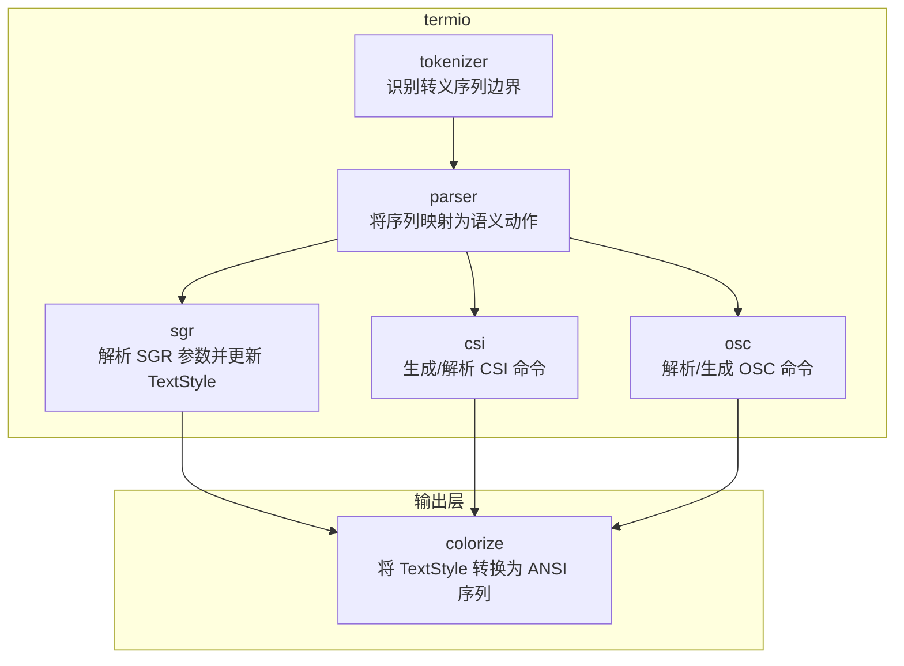
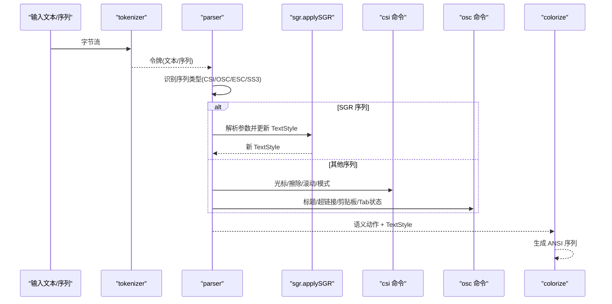
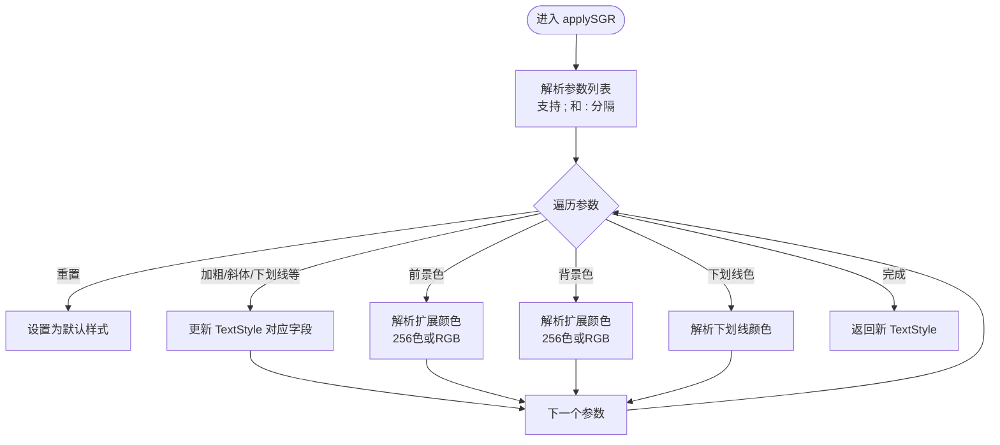
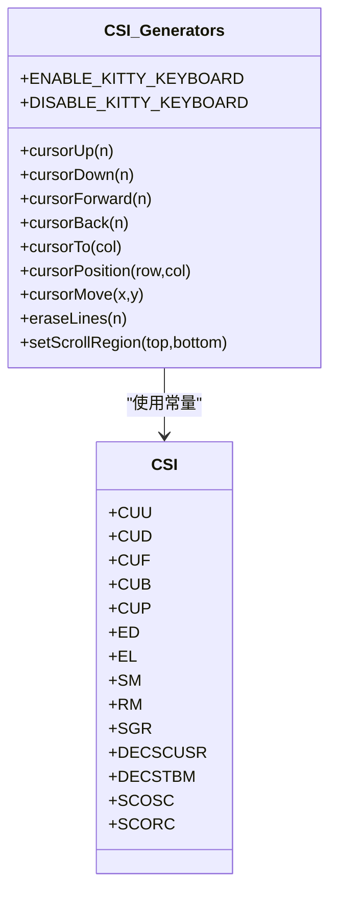
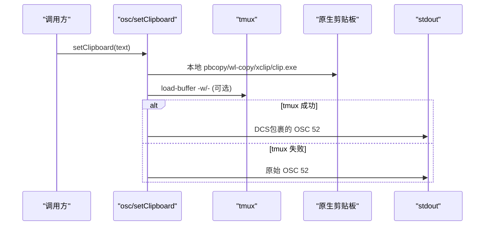
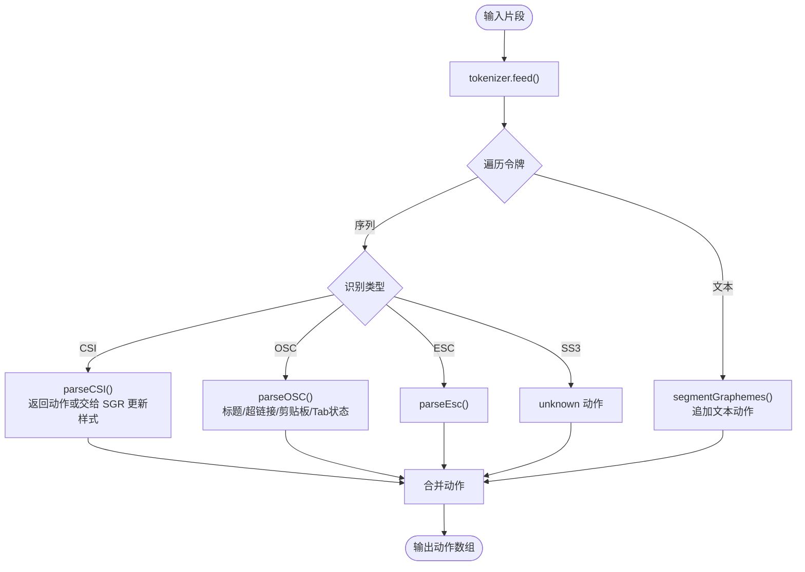
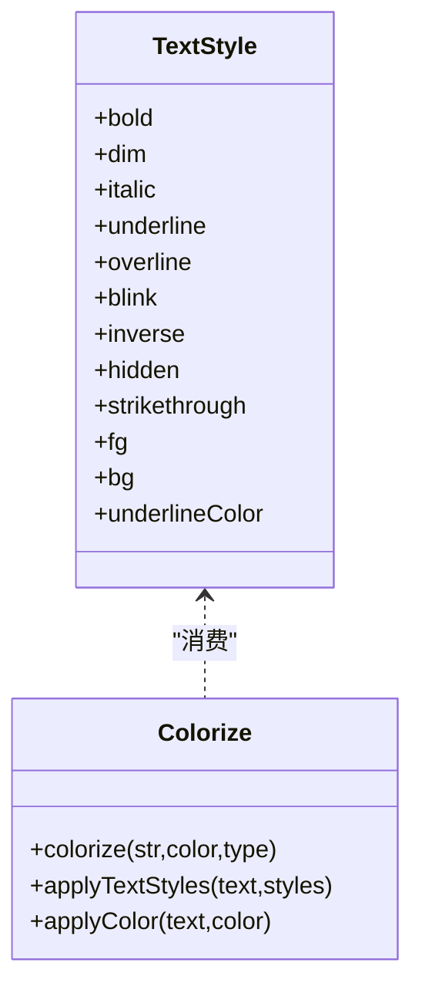
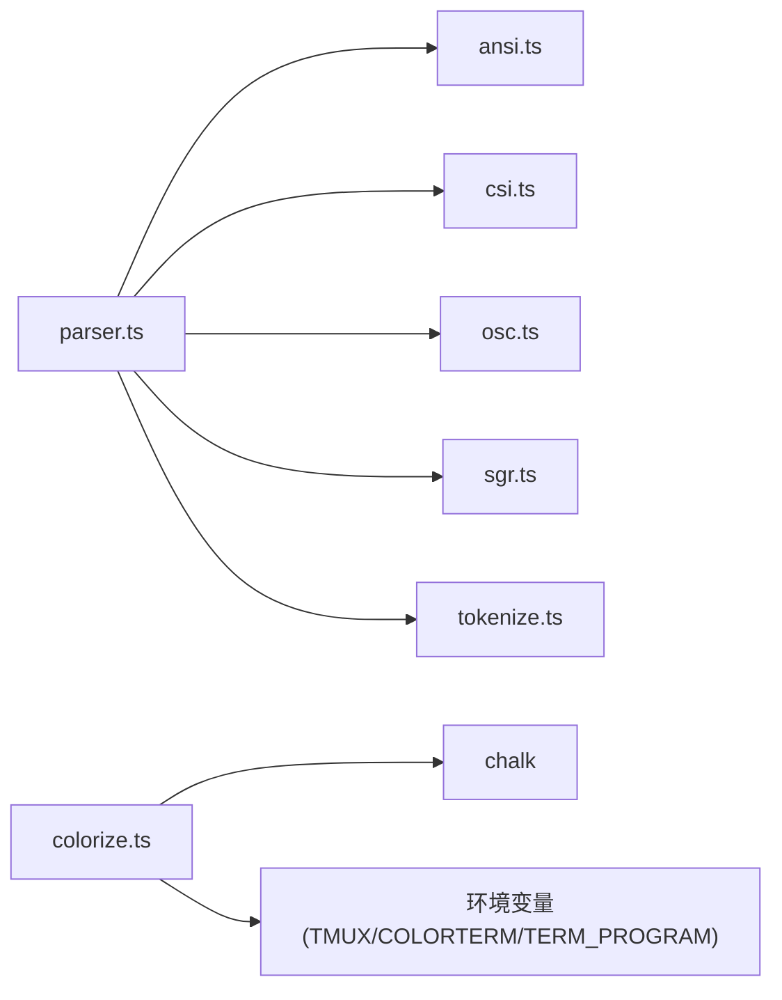

# ANSI 终端渲染

<cite>
**本文引用的文件**
- [src/ink/termio/ansi.ts](file://src/ink/termio/ansi.ts)
- [src/ink/termio/csi.ts](file://src/ink/termio/csi.ts)
- [src/ink/termio/sgr.ts](file://src/ink/termio/sgr.ts)
- [src/ink/termio/osc.ts](file://src/ink/termio/osc.ts)
- [src/ink/termio/parser.ts](file://src/ink/termio/parser.ts)
- [src/ink/colorize.ts](file://src/ink/colorize.ts)
- [src/utils/theme.ts](file://src/utils/theme.ts)
- [src/bridge/bridgeStatusUtil.ts](file://src/bridge/bridgeStatusUtil.ts)
</cite>

## 目录
1. [简介](#简介)
2. [项目结构](#项目结构)
3. [核心组件](#核心组件)
4. [架构总览](#架构总览)
5. [详细组件分析](#详细组件分析)
6. [依赖关系分析](#依赖关系分析)
7. [性能考量](#性能考量)
8. [故障排查指南](#故障排查指南)
9. [结论](#结论)
10. [附录](#附录)

## 简介
本文件面向 Ink 终端 UI 框架中的 ANSI 终端渲染子系统，系统性阐述 ANSI 转义序列的生成与处理机制，覆盖控制序列（CSI）、颜色指令（SGR）、光标控制、操作系统命令（OSC）等。文档同时解释终端颜色模型、字体样式与光标操作的实现方式，并提供自定义 ANSI 序列生成器与终端兼容性处理建议，以及渲染性能优化与兼容性测试方法。

## 项目结构
ANSI 渲染相关能力主要集中在 src/ink/termio 目录下，围绕“识别-解析-应用”的流水线组织：tokenizer 识别边界，parser 将序列映射为语义动作，随后由 SGR/CSI/OSC 模块分别处理样式、光标与系统命令；最终通过 colorize 将结构化样式转换为 ANSI 序列输出。

图示来源
- [src/ink/termio/parser.ts:272-394](file://src/ink/termio/parser.ts#L272-L394)
- [src/ink/termio/sgr.ts:127-308](file://src/ink/termio/sgr.ts#L127-L308)
- [src/ink/termio/csi.ts:45-99](file://src/ink/termio/csi.ts#L45-L99)
- [src/ink/termio/osc.ts:18-21](file://src/ink/termio/osc.ts#L18-L21)
- [src/ink/colorize.ts:69-231](file://src/ink/colorize.ts#L69-L231)

章节来源
- [src/ink/termio/parser.ts:1-395](file://src/ink/termio/parser.ts#L1-L395)
- [src/ink/termio/sgr.ts:1-309](file://src/ink/termio/sgr.ts#L1-L309)
- [src/ink/termio/csi.ts:1-320](file://src/ink/termio/csi.ts#L1-L320)
- [src/ink/termio/osc.ts:1-494](file://src/ink/termio/osc.ts#L1-L494)
- [src/ink/colorize.ts:1-232](file://src/ink/colorize.ts#L1-L232)

## 核心组件
- 控制字符与序列引出符常量：定义 C0 控制字符、ESC 类型（CSI/OSC/DCS/APC/PM/SOS/ST），并提供判断函数以识别序列类型与终止字节。
- CSI 命令集与生成器：提供光标移动、保存/恢复、清屏、滚动、模式设置等命令的生成与解析支持。
- SGR 解析器：解析 SGR 参数字符串，支持分号/冒号分隔、扩展颜色（256 色索引与 24 位 RGB），并维护 TextStyle 状态。
- OSC 处理器：解析/生成 OSC 命令，支持标题、超链接、剪贴板（OSC 52）、Tab 状态扩展等；并提供多终端环境下的兼容路径与 DCS 透传。
- 解析器（Parser）：流式解析器，结合 tokenizer 识别边界，产出语义动作（文本、光标、擦除、模式切换、未知等），并在遇到 SGR 时更新 TextStyle。
- 颜色与样式输出（colorize）：将结构化样式（TextStyle/TextStyles）转换为 ANSI 序列，内置对 VS Code、tmux 等环境的颜色等级适配。

章节来源
- [src/ink/termio/ansi.ts:1-76](file://src/ink/termio/ansi.ts#L1-L76)
- [src/ink/termio/csi.ts:1-320](file://src/ink/termio/csi.ts#L1-L320)
- [src/ink/termio/sgr.ts:1-309](file://src/ink/termio/sgr.ts#L1-L309)
- [src/ink/termio/osc.ts:1-494](file://src/ink/termio/osc.ts#L1-L494)
- [src/ink/termio/parser.ts:1-395](file://src/ink/termio/parser.ts#L1-L395)
- [src/ink/colorize.ts:1-232](file://src/ink/colorize.ts#L1-L232)

## 架构总览
ANSI 渲染管线采用“识别-解析-应用-输出”四步法：

图示来源
- [src/ink/termio/parser.ts:272-394](file://src/ink/termio/parser.ts#L272-L394)
- [src/ink/termio/sgr.ts:127-308](file://src/ink/termio/sgr.ts#L127-L308)
- [src/ink/termio/csi.ts:45-99](file://src/ink/termio/csi.ts#L45-L99)
- [src/ink/termio/osc.ts:18-21](file://src/ink/termio/osc.ts#L18-L21)
- [src/ink/colorize.ts:69-231](file://src/ink/colorize.ts#L69-L231)

## 详细组件分析

### ANSI 控制字符与序列引出符
- 定义 C0 控制字符与 ESC 类型（CSI/OSC/DCS/APC/PM/SOS/ST），并提供 isC0/isEscFinal 判断，用于快速识别转义序列边界与终止字节。
- 提供 ESC、BEL、SEP 常量，便于统一生成序列。

章节来源
- [src/ink/termio/ansi.ts:1-76](file://src/ink/termio/ansi.ts#L1-L76)

### SGR（选择图形重复）属性处理
- 支持参数分号/冒号分隔，解析基础样式（粗体、斜体、下划线、闪烁、反显、隐藏、删除线、上划线）与前景/背景色。
- 扩展颜色解析：支持 256 色索引（38;5;N 或 48:5:N）与 24 位 RGB（38:2::r:g:b 或 48:2::r:g:b）；下划线颜色亦可指定。
- 返回新的 TextStyle，保持累积状态。

图示来源
- [src/ink/termio/sgr.ts:41-125](file://src/ink/termio/sgr.ts#L41-L125)
- [src/ink/termio/sgr.ts:127-308](file://src/ink/termio/sgr.ts#L127-L308)

章节来源
- [src/ink/termio/sgr.ts:1-309](file://src/ink/termio/sgr.ts#L1-L309)

### CSI（控制序列引入符）参数解析与命令生成
- 定义 CSI 参数字节范围、中间字节与最终字节集合，提供 isCSIParam/isCSIIntermediate/isCSIFinal 判断。
- 提供 csi(...) 通用生成器，按参数与最终字节拼接序列。
- 定义常用命令：光标移动（CUU/CUD/...）、定位（CUP/HVP）、清屏/行（ED/EL/ECH）、插入/删除（IL/DL/ICH/DCH）、滚动（SU/SD）、模式（SM/RM）、设备状态报告（DSR）、光标样式（DECSCUSR）、滚动区域（DECSTBM）、保存/恢复（SCOSC/SCORC）等。
- 提供便捷生成器：如 cursorMove、eraseLines、setScrollRegion、enable/disable Kitty 键盘协议等。

图示来源
- [src/ink/termio/csi.ts:56-99](file://src/ink/termio/csi.ts#L56-L99)
- [src/ink/termio/csi.ts:129-184](file://src/ink/termio/csi.ts#L129-L184)
- [src/ink/termio/csi.ts:239-271](file://src/ink/termio/csi.ts#L239-L271)

章节来源
- [src/ink/termio/csi.ts:1-320](file://src/ink/termio/csi.ts#L1-L320)

### OSC（操作系统命令）处理
- 提供 osc(...) 生成器，自动根据终端类型选择 BEL 或 ST（ESC \）作为终止符。
- 支持多终端环境的 DCS 透传（wrapForMultiplexer），在 tmux/screen 中透明转发到外层终端。
- 剪贴板写入（OSC 52）：优先尝试本地原生工具（macOS pbcopy、Linux wl-copy/xclip/xsel、Windows clip.exe），其次 tmux load-buffer（带 -w 选项时可向外层终端传播），最后回退到 OSC 52；在 tmux 内部使用 DCS 包裹的 OSC 52。
- 超链接（OSC 8）：支持起止序列、参数拼接与自动 id 生成；提供 link(url, params?) 与 LINK_END 结束序列。
- 标题与图标（OSC 0/1/2）、颜色设置（OSC 4/10/11/12/104/110/111/112）、语义提示（OSC 133）、Tab 状态扩展（OSC 21337）等均有解析与生成支持。

图示来源
- [src/ink/termio/osc.ts:138-158](file://src/ink/termio/osc.ts#L138-L158)
- [src/ink/termio/osc.ts:35-44](file://src/ink/termio/osc.ts#L35-L44)

章节来源
- [src/ink/termio/osc.ts:1-494](file://src/ink/termio/osc.ts#L1-L494)

### 解析器（Parser）与语义动作
- 流式解析：结合 tokenizer 识别文本与序列，逐段处理。
- 识别类型：CSI/OSC/ESC/SS3/unknown。
- 语义动作：
  - 文本：按 Grapheme 分段，计算宽度，携带当前 TextStyle。
  - 光标：移动、定位、行列、保存/恢复、样式、可见性、滚动区域等。
  - 擦除：显示区/行区域、字符擦除。
  - 模式：备用屏、括号粘贴、鼠标跟踪、焦点事件等。
  - 标题/超链接：维护链接状态（inLink/linkUrl）。
  - 未知：保留原始序列以便调试。
- SGR 序列直接应用到 TextStyle，不产生额外动作。

图示来源
- [src/ink/termio/parser.ts:287-394](file://src/ink/termio/parser.ts#L287-L394)
- [src/ink/termio/parser.ts:87-240](file://src/ink/termio/parser.ts#L87-L240)

章节来源
- [src/ink/termio/parser.ts:1-395](file://src/ink/termio/parser.ts#L1-L395)

### 颜色模型、字体样式与输出
- 颜色模型：
  - ANSI 名称色：black/red/green/yellow/blue/magenta/cyan/white 及 bright*。
  - ANSI 256 色：ansi256(N)。
  - RGB：#RRGGBB 与 rgb(r,g,b)。
  - 主题色到 ANSI：theme.ts 提供将主题色转换为 ANSI 序列的工具（针对图表场景，考虑 Apple Terminal 的 256 色限制）。
- 字体样式：粗体、斜体、下划线、闪烁、反显、隐藏、删除线、上划线等。
- 输出策略：colorize 将结构化样式转换为 ANSI 序列，按“文本修饰 → 前景色 → 背景色”的顺序嵌套包装，确保视觉层级正确。

图示来源
- [src/ink/colorize.ts:69-231](file://src/ink/colorize.ts#L69-L231)
- [src/utils/theme.ts:626-639](file://src/utils/theme.ts#L626-L639)

章节来源
- [src/ink/colorize.ts:1-232](file://src/ink/colorize.ts#L1-L232)
- [src/utils/theme.ts:233-352](file://src/utils/theme.ts#L233-L352)
- [src/utils/theme.ts:615-639](file://src/utils/theme.ts#L615-L639)

### 自定义 ANSI 序列生成器与兼容性处理
- 自定义生成器建议：
  - 使用 csi(...) 与 osc(...) 作为统一入口，避免手拼 ESC/ST。
  - 对跨终端兼容性，优先使用 ST（ESC \）作为终止符，或在特定终端（如 Kitty）中使用 BEL。
  - 对 tmux/screen 环境，必要时使用 wrapForMultiplexer 进行 DCS 透传。
- 兼容性策略：
  - VS Code/Code-server：当检测到 COLORTERM=falsecolor 时，提升 chalk 等库的颜色等级，保证真彩输出。
  - tmux：若未配置终端特性（terminal-overrides），降低颜色等级至 256 色，确保外层终端正确接收。
  - Apple Terminal：针对 24 位真彩支持有限，使用 256 色模式生成 ANSI 序列。

章节来源
- [src/ink/colorize.ts:20-62](file://src/ink/colorize.ts#L20-L62)
- [src/ink/termio/osc.ts:35-44](file://src/ink/termio/osc.ts#L35-L44)
- [src/utils/theme.ts:615-639](file://src/utils/theme.ts#L615-L639)

### 超链接与终端交互
- 超链接（OSC 8）：通过 link(url, params?) 生成起始序列，结束使用 LINK_END；URL 为空表示关闭链接。
- 终端交互：支持标题设置、图标设置、工作目录设置、语义提示等；Tab 状态扩展（OSC 21337）用于在支持的终端显示状态指示与颜色。

章节来源
- [src/ink/termio/osc.ts:403-421](file://src/ink/termio/osc.ts#L403-L421)
- [src/ink/termio/osc.ts:476-493](file://src/ink/termio/osc.ts#L476-L493)
- [src/bridge/bridgeStatusUtil.ts:161-162](file://src/bridge/bridgeStatusUtil.ts#L161-L162)

## 依赖关系分析
- Parser 依赖：
  - ansi：识别 ESC 类型与终止字节。
  - csi：解析光标/擦除/滚动/模式等命令。
  - osc：解析标题/超链接/剪贴板/Tab 状态等。
  - sgr：解析 SGR 并更新 TextStyle。
  - tokenize：边界识别。
- colorize 依赖：
  - chalk：颜色与样式的 ANSI 序列生成。
  - colorize 依赖环境变量（如 TMUX、COLORTERM、TERM_PROGRAM）进行颜色等级适配。

图示来源
- [src/ink/termio/parser.ts:14-23](file://src/ink/termio/parser.ts#L14-L23)
- [src/ink/colorize.ts:1-26](file://src/ink/colorize.ts#L1-L26)

章节来源
- [src/ink/termio/parser.ts:1-395](file://src/ink/termio/parser.ts#L1-L395)
- [src/ink/colorize.ts:1-232](file://src/ink/colorize.ts#L1-L232)

## 性能考量
- 流式解析：Parser 以增量方式处理输入，避免一次性解析大块数据，降低内存峰值。
- Grapheme 分段：按 Unicode Grapheme 边界切分文本，兼顾 Emoji 与宽字符，减少布局错误带来的重绘成本。
- 样式累积：SGR 解析仅更新 TextStyle，不立即输出序列，减少中间态输出。
- 颜色等级适配：在 VS Code 与 tmux 环境中自动调整颜色等级，避免不必要的降级开销。
- 终端兼容：优先使用 ST 终止符与 DCS 透传，减少因 BEL 响铃导致的额外处理。

## 故障排查指南
- 问题：超链接无法点击或断行异常
  - 排查：确认使用 link(...) 生成起始序列，且 URL 非空；结束使用 LINK_END；必要时检查 strip-ansi 对链接序列的处理是否影响布局宽度。
  - 参考
    - [src/ink/termio/osc.ts:403-421](file://src/ink/termio/osc.ts#L403-L421)
    - [src/bridge/bridgeStatusUtil.ts:161-162](file://src/bridge/bridgeStatusUtil.ts#L161-L162)
- 问题：颜色在某些终端偏灰或不生效
  - 排查：检查 chalk 等库的颜色等级是否被提升/降级；在 tmux 中确认是否配置了 terminal-overrides；Apple Terminal 是否强制 256 色模式。
  - 参考
    - [src/ink/colorize.ts:20-62](file://src/ink/colorize.ts#L20-L62)
    - [src/utils/theme.ts:615-639](file://src/utils/theme.ts#L615-L639)
- 问题：剪贴板复制失败或延迟高
  - 排查：优先尝试原生工具（pbcopy/wl-copy/xclip/clip.exe）；tmux 环境优先 load-buffer -w；最后回退 OSC 52；确认 DCS 透传是否启用。
  - 参考
    - [src/ink/termio/osc.ts:138-158](file://src/ink/termio/osc.ts#L138-L158)
    - [src/ink/termio/osc.ts:35-44](file://src/ink/termio/osc.ts#L35-L44)
- 问题：光标移动/清屏行为异常
  - 排查：确认 CSI 参数与最终字节组合正确；在 tmux/screen 中使用 wrapForMultiplexer；检查私有模式（DEC）与中间字节。
  - 参考
    - [src/ink/termio/csi.ts:45-99](file://src/ink/termio/csi.ts#L45-L99)
    - [src/ink/termio/osc.ts:35-44](file://src/ink/termio/osc.ts#L35-L44)

章节来源
- [src/ink/termio/osc.ts:138-158](file://src/ink/termio/osc.ts#L138-L158)
- [src/ink/termio/csi.ts:45-99](file://src/ink/termio/csi.ts#L45-L99)
- [src/bridge/bridgeStatusUtil.ts:161-162](file://src/bridge/bridgeStatusUtil.ts#L161-L162)
- [src/utils/theme.ts:615-639](file://src/utils/theme.ts#L615-L639)

## 结论
Ink 的 ANSI 终端渲染子系统以清晰的模块划分与流式解析为核心，将 ANSI 序列的识别、解析与应用解耦，既保证了对标准（SGR/CSI/OSC）的完整支持，又提供了针对不同终端与环境的兼容性策略。通过 TextStyle 累积与 colorize 的统一输出，开发者可以以声明式的方式构建富文本终端 UI，并在复杂终端环境中获得一致的视觉与交互体验。

## 附录
- 常用命令速查
  - SGR：设置/清除样式与颜色
  - CSI 光标：CUU/CUD/...、CUP/HVP、SCOSC/SCORC、DECSCUSR
  - CSI 擦除：ED/EL/ECH、IL/DL/ICH/DCH
  - CSI 滚动：SU/SD、DECSTBM
  - OSC：标题/图标/颜色/剪贴板/超链接/Tab状态
- 最佳实践
  - 使用统一生成器（csi/osc）与 wrapForMultiplexer
  - 在 VS Code 与 tmux 环境中关注颜色等级适配
  - 超链接使用 link/LINK_END，避免手动拼接
  - 对未知序列保留原始内容，便于调试