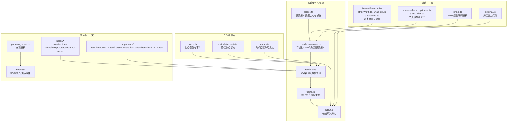
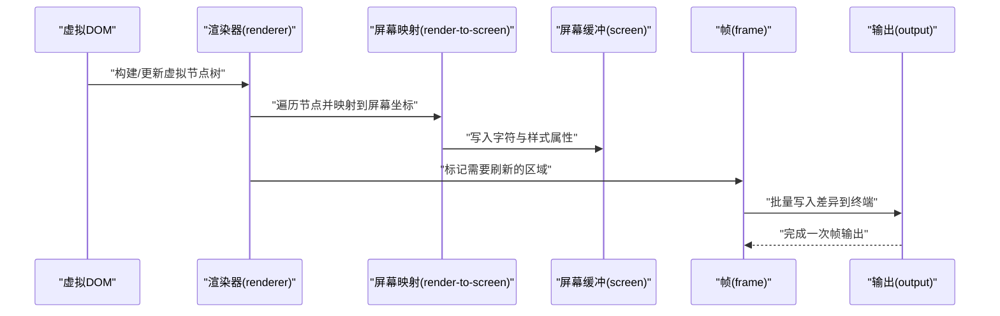
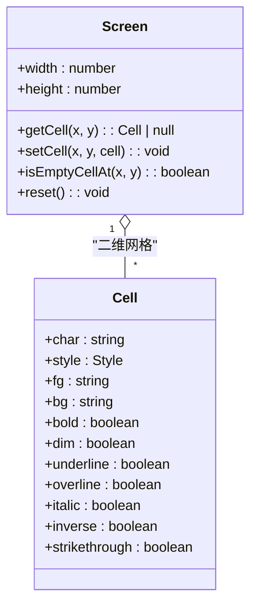
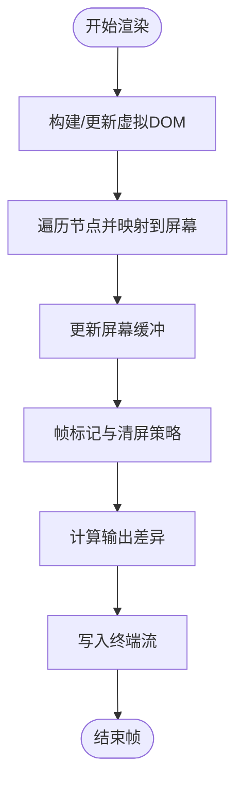
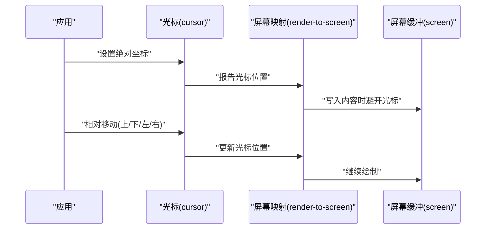
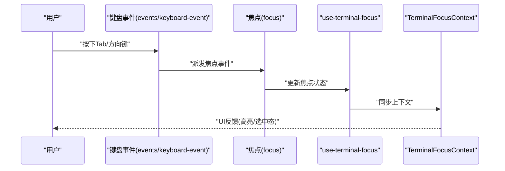
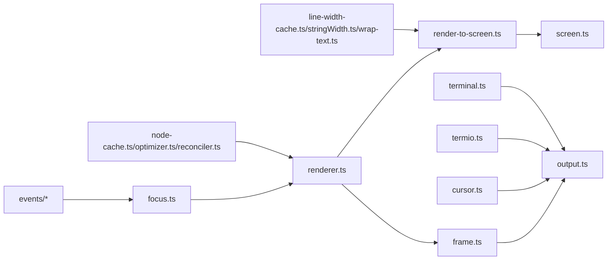

# 屏幕缓冲管理

<cite>
**本文引用的文件**
- [screen.ts](file://src/ink/screen.ts)
- [cursor.ts](file://src/ink/cursor.ts)
- [render-to-screen.ts](file://src/ink/render-to-screen.ts)
- [frame.ts](file://src/ink/frame.ts)
- [output.ts](file://src/ink/output.ts)
- [focus.ts](file://src/ink/focus.ts)
- [terminal-focus-state.ts](file://src/ink/terminal-focus-state.ts)
- [clearTerminal.ts](file://src/ink/clearTerminal.ts)
- [termio.ts](file://src/ink/termio.ts)
- [terminal.ts](file://src/ink/terminal.ts)
- [renderer.ts](file://src/ink/renderer.ts)
- [dom.ts](file://src/ink/dom.ts)
- [instances.ts](file://src/ink/instances.ts)
- [optimizer.ts](file://src/ink/optimizer.ts)
- [reconciler.ts](file://src/ink/reconciler.ts)
- [node-cache.ts](file://src/ink/node-cache.ts)
- [line-width-cache.ts](file://src/ink/line-width-cache.ts)
- [stringWidth.ts](file://src/ink/stringWidth.ts)
- [wrap-text.ts](file://src/ink/wrap-text.ts)
- [wrapAnsi.ts](file://src/ink/wrapAnsi.ts)
- [hit-test.ts](file://src/ink/hit-test.ts)
- [selection.ts](file://src/ink/selection.ts)
- [log-update.ts](file://src/ink/log-update.ts)
- [get-max-width.ts](file://src/ink/get-max-width.ts)
- [squash-text-nodes.ts](file://src/ink/squash-text-nodes.ts)
- [measure-text.ts](file://src/ink/measure-text.ts)
- [measure-element.ts](file://src/ink/measure-element.ts)
- [styles.ts](file://src/ink/styles.ts)
- [constants.ts](file://src/ink/constants.ts)
- [parse-keypress.ts](file://src/ink/parse-keypress.ts)
- [events/keyboard-event.ts](file://src/ink/events/keyboard-event.ts)
- [events/input-event.ts](file://src/ink/events/input-event.ts)
- [events/terminal-focus-event.ts](file://src/ink/events/terminal-focus-event.ts)
- [hooks/use-terminal-focus.ts](file://src/ink/hooks/use-terminal-focus.ts)
- [hooks/use-terminal-viewport.ts](file://src/ink/hooks/use-terminal-viewport.ts)
- [hooks/use-terminal-title.ts](file://src/ink/hooks/use-terminal-title.ts)
- [hooks/use-declared-cursor.ts](file://src/ink/hooks/use-declared-cursor.ts)
- [components/TerminalFocusContext.tsx](file://src/ink/components/TerminalFocusContext.tsx)
- [components/CursorDeclarationContext.ts](file://src/ink/components/CursorDeclarationContext.ts)
- [components/TerminalSizeContext.tsx](file://src/ink/components/TerminalSizeContext.tsx)
- [components/StdinContext.ts](file://src/ink/components/StdinContext.ts)
- [components/AlternateScreen.tsx](file://src/ink/components/AlternateScreen.tsx)
- [components/AppContext.ts](file://src/ink/components/AppContext.ts)
- [components/Box.tsx](file://src/ink/components/Box.tsx)
- [components/Text.tsx](file://src/ink/components/Text.tsx)
- [components/Button.tsx](file://src/ink/components/Button.tsx)
- [components/ScrollBox.tsx](file://src/ink/components/ScrollBox.tsx)
- [components/RawAnsi.tsx](file://src/ink/components/RawAnsi.tsx)
- [components/Newline.tsx](file://src/ink/components/Newline.tsx)
- [components/NoSelect.tsx](file://src/ink/components/NoSelect.tsx)
- [components/Link.tsx](file://src/ink/components/Link.tsx)
- [components/Spacer.tsx](file://src/ink/components/Spacer.tsx)
- [components/ClockContext.tsx](file://src/ink/components/ClockContext.tsx)
- [components/ErrorOverview.tsx](file://src/ink/components/ErrorOverview.tsx)
- [components/StdinContext.ts](file://src/ink/components/StdinContext.ts)
- [components/AlternateScreen.tsx](file://src/ink/components/AlternateScreen.tsx)
- [components/AppContext.ts](file://src/ink/components/AppContext.ts)
- [components/Box.tsx](file://src/ink/components/Box.tsx)
- [components/Text.tsx](file://src/ink/components/Text.tsx)
- [components/Button.tsx](file://src/ink/components/Button.tsx)
- [components/ScrollBox.tsx](file://src/ink/components/ScrollBox.tsx)
- [components/RawAnsi.tsx](file://src/ink/components/RawAnsi.tsx)
- [components/Newline.tsx](file://src/ink/components/Newline.tsx)
- [components/NoSelect.tsx](file://src/ink/components/NoSelect.tsx)
- [components/Link.tsx](file://src/ink/components/Link.tsx)
- [components/Spacer.tsx](file://src/ink/components/Spacer.tsx)
- [components/ClockContext.tsx](file://src/ink/components/ClockContext.tsx)
- [components/ErrorOverview.tsx](file://src/ink/components/ErrorOverview.tsx)
</cite>

## 目录
1. [简介](#简介)
2. [项目结构](#项目结构)
3. [核心组件](#核心组件)
4. [架构总览](#架构总览)
5. [详细组件分析](#详细组件分析)
6. [依赖关系分析](#依赖关系分析)
7. [性能考量](#性能考量)
8. [故障排查指南](#故障排查指南)
9. [结论](#结论)
10. [附录](#附录)

## 简介
本文件聚焦 Ink 终端 UI 框架的“屏幕缓冲管理”子系统，系统性阐述以下主题：
- 屏幕缓冲区的数据结构与内存管理：字符存储、属性跟踪、光标状态维护
- 终端输出管道：从缓冲区更新到屏幕刷新的完整流程
- 光标控制：绝对定位、相对移动与可见性管理
- 焦点管理：焦点转移、焦点状态同步与焦点事件处理
- 屏幕清理与重置：实现指南与最佳实践
- 内存优化策略与大屏幕应用的性能考虑

## 项目结构
Ink 的屏幕缓冲管理由一组协同模块组成，覆盖数据结构、渲染管线、输入事件、焦点与光标控制等关键领域。下图给出与屏幕缓冲管理相关的主要模块及其职责概览。

图表来源
- [screen.ts](file://src/ink/screen.ts)
- [render-to-screen.ts](file://src/ink/render-to-screen.ts)
- [renderer.ts](file://src/ink/renderer.ts)
- [frame.ts](file://src/ink/frame.ts)
- [output.ts](file://src/ink/output.ts)
- [cursor.ts](file://src/ink/cursor.ts)
- [focus.ts](file://src/ink/focus.ts)
- [terminal-focus-state.ts](file://src/ink/terminal-focus-state.ts)
- [parse-keypress.ts](file://src/ink/parse-keypress.ts)
- [events/keyboard-event.ts](file://src/ink/events/keyboard-event.ts)
- [hooks/use-terminal-focus.ts](file://src/ink/hooks/use-terminal-focus.ts)
- [hooks/use-terminal-viewport.ts](file://src/ink/hooks/use-terminal-viewport.ts)
- [hooks/use-terminal-title.ts](file://src/ink/hooks/use-terminal-title.ts)
- [hooks/use-declared-cursor.ts](file://src/ink/hooks/use-declared-cursor.ts)
- [components/TerminalFocusContext.tsx](file://src/ink/components/TerminalFocusContext.tsx)
- [components/CursorDeclarationContext.ts](file://src/ink/components/CursorDeclarationContext.ts)
- [components/TerminalSizeContext.tsx](file://src/ink/components/TerminalSizeContext.tsx)
- [termio.ts](file://src/ink/termio.ts)
- [terminal.ts](file://src/ink/terminal.ts)
- [line-width-cache.ts](file://src/ink/line-width-cache.ts)
- [stringWidth.ts](file://src/ink/stringWidth.ts)
- [wrap-text.ts](file://src/ink/wrap-text.ts)
- [wrapAnsi.ts](file://src/ink/wrapAnsi.ts)
- [node-cache.ts](file://src/ink/node-cache.ts)
- [optimizer.ts](file://src/ink/optimizer.ts)
- [reconciler.ts](file://src/ink/reconciler.ts)

章节来源
- [screen.ts](file://src/ink/screen.ts)
- [render-to-screen.ts](file://src/ink/render-to-screen.ts)
- [renderer.ts](file://src/ink/renderer.ts)
- [frame.ts](file://src/ink/frame.ts)
- [output.ts](file://src/ink/output.ts)
- [cursor.ts](file://src/ink/cursor.ts)
- [focus.ts](file://src/ink/focus.ts)
- [terminal-focus-state.ts](file://src/ink/terminal-focus-state.ts)
- [parse-keypress.ts](file://src/ink/parse-keypress.ts)
- [events/keyboard-event.ts](file://src/ink/events/keyboard-event.ts)
- [hooks/use-terminal-focus.ts](file://src/ink/hooks/use-terminal-focus.ts)
- [hooks/use-terminal-viewport.ts](file://src/ink/hooks/use-terminal-viewport.ts)
- [hooks/use-terminal-title.ts](file://src/ink/hooks/use-terminal-title.ts)
- [hooks/use-declared-cursor.ts](file://src/ink/hooks/use-declared-cursor.ts)
- [components/TerminalFocusContext.tsx](file://src/ink/components/TerminalFocusContext.tsx)
- [components/CursorDeclarationContext.ts](file://src/ink/components/CursorDeclarationContext.ts)
- [components/TerminalSizeContext.tsx](file://src/ink/components/TerminalSizeContext.tsx)
- [termio.ts](file://src/ink/termio.ts)
- [terminal.ts](file://src/ink/terminal.ts)
- [line-width-cache.ts](file://src/ink/line-width-cache.ts)
- [stringWidth.ts](file://src/ink/stringWidth.ts)
- [wrap-text.ts](file://src/ink/wrap-text.ts)
- [wrapAnsi.ts](file://src/ink/wrapAnsi.ts)
- [node-cache.ts](file://src/ink/node-cache.ts)
- [optimizer.ts](file://src/ink/optimizer.ts)
- [reconciler.ts](file://src/ink/reconciler.ts)

## 核心组件
- 屏幕缓冲区（Screen）：抽象为二维网格，每个单元格包含字符与样式属性；提供空单元检测、创建与重置等基础操作。
- 渲染器（Renderer）：负责将虚拟 DOM 节点映射到屏幕缓冲，并在帧边界进行批量输出。
- 输出层（Output）：将缓冲区差异写入终端，支持全量与增量输出。
- 光标控制（Cursor）：维护光标绝对坐标、相对移动与可见性状态。
- 焦点管理（Focus）：追踪当前焦点元素、焦点事件传播与同步。
- 输入事件（Events）：键盘、粘贴、终端大小变化等事件驱动渲染更新。
- 工具与度量：文本宽度计算、行宽缓存、换行与 ANSI 处理、节点缓存与优化。

章节来源
- [screen.ts](file://src/ink/screen.ts)
- [render-to-screen.ts](file://src/ink/render-to-screen.ts)
- [renderer.ts](file://src/ink/renderer.ts)
- [output.ts](file://src/ink/output.ts)
- [cursor.ts](file://src/ink/cursor.ts)
- [focus.ts](file://src/ink/focus.ts)
- [events/keyboard-event.ts](file://src/ink/events/keyboard-event.ts)
- [line-width-cache.ts](file://src/ink/line-width-cache.ts)
- [stringWidth.ts](file://src/ink/stringWidth.ts)
- [wrap-text.ts](file://src/ink/wrap-text.ts)
- [wrapAnsi.ts](file://src/ink/wrapAnsi.ts)
- [node-cache.ts](file://src/ink/node-cache.ts)
- [optimizer.ts](file://src/ink/optimizer.ts)
- [reconciler.ts](file://src/ink/reconciler.ts)

## 架构总览
下图展示从虚拟 DOM 到终端输出的完整链路，强调缓冲区更新与屏幕刷新的关键步骤。

图表来源
- [renderer.ts](file://src/ink/renderer.ts)
- [render-to-screen.ts](file://src/ink/render-to-screen.ts)
- [screen.ts](file://src/ink/screen.ts)
- [frame.ts](file://src/ink/frame.ts)
- [output.ts](file://src/ink/output.ts)

## 详细组件分析

### 屏幕缓冲区数据结构与内存管理
- 数据结构
  - 单元格（Cell）：包含字符与样式属性（颜色、粗体、下划线等），用于精确记录每个像素级显示信息。
  - 屏幕（Screen）：以行列索引访问的二维数组，提供空单元检测、创建与重置等方法。
- 内存管理
  - 按需创建：仅在首次写入时分配单元格，避免初始化大矩阵造成内存浪费。
  - 重置策略：提供整屏重置函数，释放旧缓冲并重建新缓冲，确保状态一致性。
  - 迁移池：支持屏幕对象池化，减少频繁分配带来的 GC 压力。
- 属性跟踪
  - 每个单元格独立保存样式，便于局部更新与差异输出。
  - 支持 ANSI 属性解析与合并，保证与终端语义一致。

图表来源
- [screen.ts](file://src/ink/screen.ts)

章节来源
- [screen.ts](file://src/ink/screen.ts)

### 终端输出管道：缓冲区到屏幕刷新
- 渲染阶段
  - 渲染器遍历虚拟节点，调用屏幕映射函数将节点内容写入屏幕缓冲。
  - 映射过程考虑布局、换行、ANSI 序列与文本宽度计算。
- 帧与清屏
  - 帧控制器决定何时进行输出，支持全屏清空策略与增量刷新。
  - 清屏策略根据配置与场景选择是否清空屏幕。
- 输出阶段
  - 输出层将缓冲区差异写入终端流，避免重复输出未变更区域。

图表来源
- [render-to-screen.ts](file://src/ink/render-to-screen.ts)
- [screen.ts](file://src/ink/screen.ts)
- [frame.ts](file://src/ink/frame.ts)
- [output.ts](file://src/ink/output.ts)

章节来源
- [render-to-screen.ts](file://src/ink/render-to-screen.ts)
- [screen.ts](file://src/ink/screen.ts)
- [frame.ts](file://src/ink/frame.ts)
- [output.ts](file://src/ink/output.ts)

### 光标控制：绝对定位、相对移动与可见性
- 绝对定位
  - 提供设置光标坐标的接口，确保后续绘制从正确位置开始。
- 相对移动
  - 支持行列相对偏移，结合换行与回车处理，适配多字宽字符。
- 可见性管理
  - 控制光标显示/隐藏，避免在非交互模式或后台窗口中闪烁。
- 与渲染协作
  - 光标状态与屏幕缓冲同步，确保光标所在单元格不会被错误覆盖。

图表来源
- [cursor.ts](file://src/ink/cursor.ts)
- [render-to-screen.ts](file://src/ink/render-to-screen.ts)
- [screen.ts](file://src/ink/screen.ts)

章节来源
- [cursor.ts](file://src/ink/cursor.ts)
- [render-to-screen.ts](file://src/ink/render-to-screen.ts)
- [screen.ts](file://src/ink/screen.ts)

### 焦点管理：转移、同步与事件处理
- 焦点模型
  - 维护当前焦点元素与焦点树，支持 Tab/Shift+Tab 导航与点击聚焦。
- 状态同步
  - 焦点状态通过上下文与钩子暴露给组件，确保 UI 与焦点一致。
- 事件处理
  - 键盘事件处理器响应方向键、Tab 等，触发焦点转移与渲染更新。
- 终端焦点
  - 终端焦点状态与应用内焦点解耦，但可通过钩子与上下文统一管理。

图表来源
- [events/keyboard-event.ts](file://src/ink/events/keyboard-event.ts)
- [focus.ts](file://src/ink/focus.ts)
- [hooks/use-terminal-focus.ts](file://src/ink/hooks/use-terminal-focus.ts)
- [components/TerminalFocusContext.tsx](file://src/ink/components/TerminalFocusContext.tsx)

章节来源
- [focus.ts](file://src/ink/focus.ts)
- [events/keyboard-event.ts](file://src/ink/events/keyboard-event.ts)
- [hooks/use-terminal-focus.ts](file://src/ink/hooks/use-terminal-focus.ts)
- [components/TerminalFocusContext.tsx](file://src/ink/components/TerminalFocusContext.tsx)
- [terminal-focus-state.ts](file://src/ink/terminal-focus-state.ts)

### 屏幕清理与重置
- 清屏策略
  - 全屏清空：在帧开始前执行，确保旧内容不残留。
  - 增量清屏：仅清理受影响区域，降低写入开销。
- 重置流程
  - 重置屏幕缓冲，释放旧资源，重建新缓冲。
  - 同步光标与焦点状态，避免脏状态导致的渲染异常。
- 配置开关
  - 提供可配置项控制清屏行为，满足不同终端与场景需求。

章节来源
- [frame.ts](file://src/ink/frame.ts)
- [screen.ts](file://src/ink/screen.ts)
- [clearTerminal.ts](file://src/ink/clearTerminal.ts)

### 文本度量与换行
- 行宽缓存
  - 缓存每行最大宽度，避免重复计算，提升长文本渲染性能。
- 宽度计算
  - 使用图形单元宽度算法，正确处理双字宽字符与零宽字符。
- 换行与 ANSI
  - 换行器与 ANSI 包装器配合，确保换行后样式与颜色正确延续。

章节来源
- [line-width-cache.ts](file://src/ink/line-width-cache.ts)
- [stringWidth.ts](file://src/ink/stringWidth.ts)
- [wrap-text.ts](file://src/ink/wrap-text.ts)
- [wrapAnsi.ts](file://src/ink/wrapAnsi.ts)

### 节点缓存与渲染优化
- 节点缓存
  - 对静态或低频更新的节点进行缓存，减少重复计算。
- 渲染器优化
  - 通过差异比较与最小化输出，降低终端写入次数。
- 协调器
  - 协调虚拟 DOM 与屏幕缓冲的差异，确保高效更新。

章节来源
- [node-cache.ts](file://src/ink/node-cache.ts)
- [optimizer.ts](file://src/ink/optimizer.ts)
- [reconciler.ts](file://src/ink/reconciler.ts)

## 依赖关系分析
- 模块耦合
  - 渲染器与屏幕映射紧密耦合，共同决定内容如何写入缓冲。
  - 帧控制器与输出层耦合，决定刷新节奏与写入策略。
  - 光标与焦点分别与渲染器和事件系统耦合，影响绘制顺序与可见性。
- 外部依赖
  - 终端能力探测与 ANSI 解析依赖底层 termio 与 terminal 模块。
  - 文本度量与换行依赖字符串宽度与包装工具。
- 循环依赖
  - 当前设计避免了循环导入，各模块职责清晰，通过导出接口解耦。

图表来源
- [renderer.ts](file://src/ink/renderer.ts)
- [render-to-screen.ts](file://src/ink/render-to-screen.ts)
- [screen.ts](file://src/ink/screen.ts)
- [frame.ts](file://src/ink/frame.ts)
- [output.ts](file://src/ink/output.ts)
- [cursor.ts](file://src/ink/cursor.ts)
- [focus.ts](file://src/ink/focus.ts)
- [events/keyboard-event.ts](file://src/ink/events/keyboard-event.ts)
- [termio.ts](file://src/ink/termio.ts)
- [terminal.ts](file://src/ink/terminal.ts)
- [line-width-cache.ts](file://src/ink/line-width-cache.ts)
- [stringWidth.ts](file://src/ink/stringWidth.ts)
- [wrap-text.ts](file://src/ink/wrap-text.ts)
- [node-cache.ts](file://src/ink/node-cache.ts)
- [optimizer.ts](file://src/ink/optimizer.ts)
- [reconciler.ts](file://src/ink/reconciler.ts)

章节来源
- [renderer.ts](file://src/ink/renderer.ts)
- [render-to-screen.ts](file://src/ink/render-to-screen.ts)
- [screen.ts](file://src/ink/screen.ts)
- [frame.ts](file://src/ink/frame.ts)
- [output.ts](file://src/ink/output.ts)
- [cursor.ts](file://src/ink/cursor.ts)
- [focus.ts](file://src/ink/focus.ts)
- [events/keyboard-event.ts](file://src/ink/events/keyboard-event.ts)
- [termio.ts](file://src/ink/termio.ts)
- [terminal.ts](file://src/ink/terminal.ts)
- [line-width-cache.ts](file://src/ink/line-width-cache.ts)
- [stringWidth.ts](file://src/ink/stringWidth.ts)
- [wrap-text.ts](file://src/ink/wrap-text.ts)
- [node-cache.ts](file://src/ink/node-cache.ts)
- [optimizer.ts](file://src/ink/optimizer.ts)
- [reconciler.ts](file://src/ink/reconciler.ts)

## 性能考量
- 内存优化
  - 按需创建单元格，避免初始化超大矩阵；使用屏幕对象池减少 GC 抖动。
  - 缓存行宽与节点结果，降低重复计算成本。
- 输出优化
  - 增量输出优先于全量输出，减少终端写入次数与带宽占用。
  - 合理使用清屏策略，在保证正确性的前提下尽量减少清屏频率。
- 大屏幕应用
  - 采用分块渲染与延迟更新策略，避免一次性绘制过多内容。
  - 结合节流与请求动画帧，平滑渲染节奏，降低 CPU 占用。
- 文本处理
  - 使用高效的字符串宽度计算与换行算法，避免在热路径中进行昂贵操作。

## 故障排查指南
- 屏幕残留或闪烁
  - 检查帧清屏策略与输出差异计算，确认是否遗漏区域清理。
  - 排查光标位置是否与绘制区域冲突。
- 光标错位
  - 核对光标绝对/相对移动逻辑，确保与文本宽度计算一致。
  - 检查 ANSI 序列是否正确影响了光标位置。
- 焦点异常
  - 确认键盘事件处理器是否正确派发焦点事件，上下文与钩子状态是否同步。
  - 检查焦点树结构与 Tab 导航顺序。
- 性能问题
  - 分析渲染器输出日志，识别高频更新的节点并进行缓存或降频。
  - 使用行宽缓存与节点缓存，减少重复计算。

章节来源
- [frame.ts](file://src/ink/frame.ts)
- [output.ts](file://src/ink/output.ts)
- [cursor.ts](file://src/ink/cursor.ts)
- [events/keyboard-event.ts](file://src/ink/events/keyboard-event.ts)
- [hooks/use-terminal-focus.ts](file://src/ink/hooks/use-terminal-focus.ts)
- [line-width-cache.ts](file://src/ink/line-width-cache.ts)
- [node-cache.ts](file://src/ink/node-cache.ts)

## 结论
Ink 的屏幕缓冲管理通过清晰的数据结构、稳健的渲染管线与完善的光标/焦点控制，实现了高性能、可维护的终端 UI。遵循本文的实现指南与优化建议，可在复杂与大屏幕场景下保持流畅体验与稳定输出。

## 附录
- 关键实现路径参考
  - 屏幕缓冲：[screen.ts](file://src/ink/screen.ts)
  - 屏幕映射：[render-to-screen.ts](file://src/ink/render-to-screen.ts)
  - 渲染器：[renderer.ts](file://src/ink/renderer.ts)
  - 帧控制：[frame.ts](file://src/ink/frame.ts)
  - 输出层：[output.ts](file://src/ink/output.ts)
  - 光标控制：[cursor.ts](file://src/ink/cursor.ts)
  - 焦点管理：[focus.ts](file://src/ink/focus.ts)
  - 终端焦点状态：[terminal-focus-state.ts](file://src/ink/terminal-focus-state.ts)
  - 文本度量与换行：[line-width-cache.ts](file://src/ink/line-width-cache.ts), [stringWidth.ts](file://src/ink/stringWidth.ts), [wrap-text.ts](file://src/ink/wrap-text.ts), [wrapAnsi.ts](file://src/ink/wrapAnsi.ts)
  - 节点缓存与优化：[node-cache.ts](file://src/ink/node-cache.ts), [optimizer.ts](file://src/ink/optimizer.ts), [reconciler.ts](file://src/ink/reconciler.ts)
  - 输入与事件：[parse-keypress.ts](file://src/ink/parse-keypress.ts), [events/keyboard-event.ts](file://src/ink/events/keyboard-event.ts)
  - 上下文与钩子：[hooks/use-terminal-focus.ts](file://src/ink/hooks/use-terminal-focus.ts), [hooks/use-terminal-viewport.ts](file://src/ink/hooks/use-terminal-viewport.ts), [hooks/use-terminal-title.ts](file://src/ink/hooks/use-terminal-title.ts), [hooks/use-declared-cursor.ts](file://src/ink/hooks/use-declared-cursor.ts), [components/TerminalFocusContext.tsx](file://src/ink/components/TerminalFocusContext.tsx), [components/CursorDeclarationContext.ts](file://src/ink/components/CursorDeclarationContext.ts), [components/TerminalSizeContext.tsx](file://src/ink/components/TerminalSizeContext.tsx)