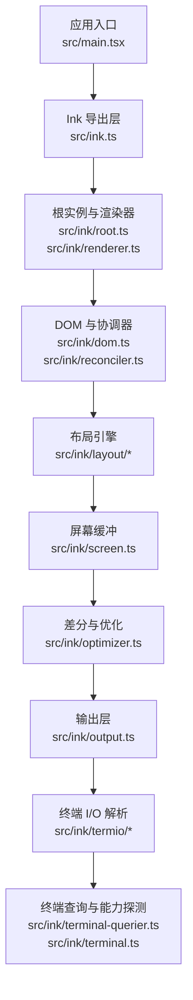
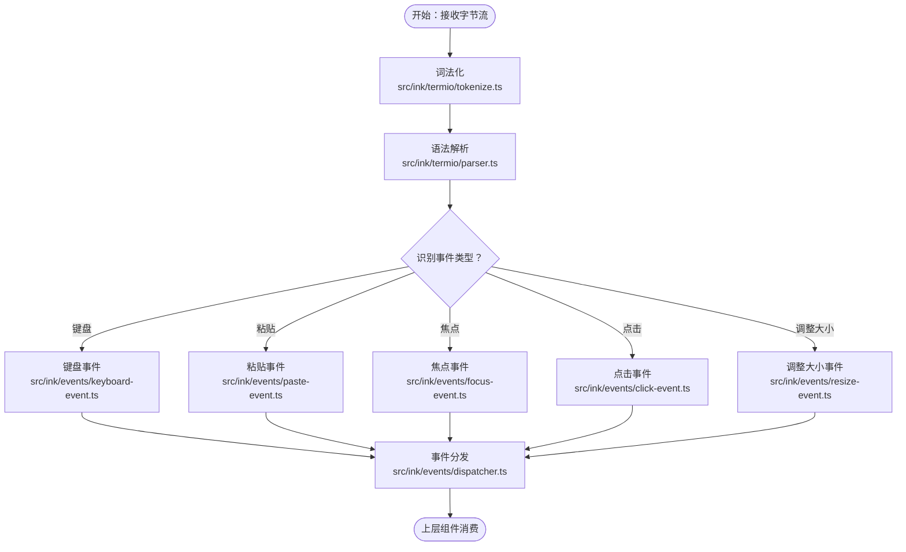
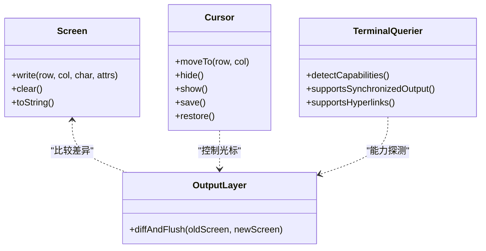
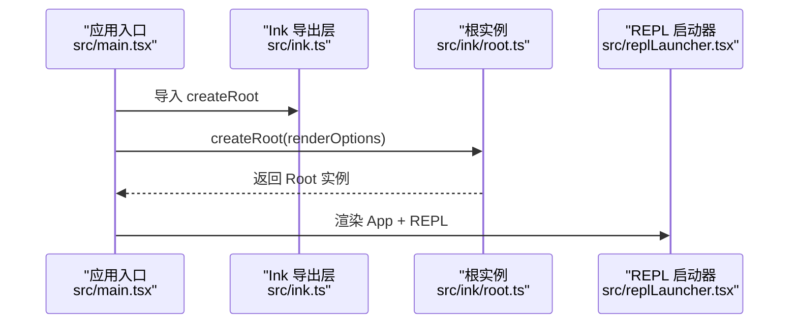
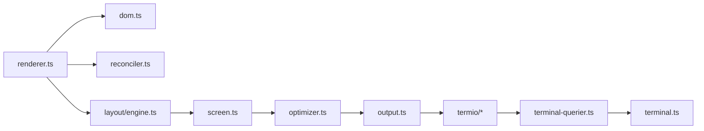

# 终端 I/O 与渲染

<cite>
**本文引用的文件**
- [src/ink.ts](file://src/ink.ts)
- [src/ink/root.ts](file://src/ink/root.ts)
- [src/ink/renderer.ts](file://src/ink/renderer.ts)
- [src/ink/render-to-screen.ts](file://src/ink/render-to-screen.ts)
- [src/ink/screen.ts](file://src/ink/screen.ts)
- [src/ink/output.ts](file://src/ink/output.ts)
- [src/ink/cursor.ts](file://src/ink/cursor.ts)
- [src/ink/termio.ts](file://src/ink/termio.ts)
- [src/ink/termio/parser.ts](file://src/ink/termio/parser.ts)
- [src/ink/termio/tokenize.ts](file://src/ink/termio/tokenize.ts)
- [src/ink/termio/types.ts](file://src/ink/termio/types.ts)
- [src/ink/termio/ansi.ts](file://src/ink/termio/ansi.ts)
- [src/ink/termio/csi.ts](file://src/ink/termio/csi.ts)
- [src/ink/termio/esc.ts](file://src/ink/termio/esc.ts)
- [src/ink/termio/osc.ts](file://src/ink/termio/osc.ts)
- [src/ink/termio/sgr.ts](file://src/ink/termio/sgr.ts)
- [src/ink/termio/dec.ts](file://src/ink/termio/dec.ts)
- [src/ink/dom.ts](file://src/ink/dom.ts)
- [src/ink/reconciler.ts](file://src/ink/reconciler.ts)
- [src/ink/node-cache.ts](file://src/ink/node-cache.ts)
- [src/ink/optimizer.ts](file://src/ink/optimizer.ts)
- [src/ink/frame.ts](file://src/ink/frame.ts)
- [src/ink/terminal.ts](file://src/ink/terminal.ts)
- [src/ink/terminal-querier.ts](file://src/ink/terminal-querier.ts)
- [src/interactiveHelpers.tsx](file://src/interactiveHelpers.tsx)
- [src/main.tsx](file://src/main.tsx)
- [src/replLauncher.tsx](file://src/replLauncher.tsx)
- [src/utils/theme.ts](file://src/utils/theme.ts)
</cite>

## 目录
1. [引言](#引言)
2. [项目结构](#项目结构)
3. [核心组件](#核心组件)
4. [架构总览](#架构总览)
5. [详细组件分析](#详细组件分析)
6. [依赖关系分析](#依赖关系分析)
7. [性能考虑](#性能考虑)
8. [故障排除指南](#故障排除指南)
9. [结论](#结论)
10. [附录](#附录)

## 引言
本文件面向 Ink 终端 UI 框架的终端 I/O 与渲染系统，系统性阐述以下主题：
- 终端输入输出处理机制：ANSI 转义序列解析、字符编码处理、终端兼容性策略
- 渲染引擎工作流：从虚拟 DOM 到终端输出的完整渲染管线
- 屏幕缓冲、光标控制与终端状态管理
- 性能优化策略：增量渲染、脏检查、渲染批处理
- 终端调试工具与故障排除方法

## 项目结构
Ink 的终端 UI 核心位于 src/ink 目录，围绕“虚拟 DOM → 布局计算 → 屏幕缓冲 → 差分优化 → 输出”这一主干流水线组织。入口与集成点主要在 src/ink.ts、src/ink/root.ts、src/ink/renderer.ts 等文件；终端 I/O 解析集中在 src/ink/termio/*；屏幕缓冲与输出在 src/ink/screen.ts、src/ink/output.ts、src/ink/cursor.ts 中实现。



图表来源
- [src/ink.ts:1-31](file://src/ink.ts#L1-L31)
- [src/ink/root.ts](file://src/ink/root.ts)
- [src/ink/renderer.ts](file://src/ink/renderer.ts)
- [src/ink/dom.ts](file://src/ink/dom.ts)
- [src/ink/reconciler.ts](file://src/ink/reconciler.ts)
- [src/ink/screen.ts](file://src/ink/screen.ts)
- [src/ink/optimizer.ts](file://src/ink/optimizer.ts)
- [src/ink/output.ts](file://src/ink/output.ts)
- [src/ink/termio.ts](file://src/ink/termio.ts)
- [src/ink/terminal-querier.ts](file://src/ink/terminal-querier.ts)
- [src/ink/terminal.ts](file://src/ink/terminal.ts)

章节来源
- [src/ink.ts:1-31](file://src/ink.ts#L1-L31)
- [src/ink/root.ts](file://src/ink/root.ts)
- [src/ink/renderer.ts](file://src/ink/renderer.ts)
- [src/ink/dom.ts](file://src/ink/dom.ts)
- [src/ink/reconciler.ts](file://src/ink/reconciler.ts)
- [src/ink/screen.ts](file://src/ink/screen.ts)
- [src/ink/optimizer.ts](file://src/ink/optimizer.ts)
- [src/ink/output.ts](file://src/ink/output.ts)
- [src/ink/termio.ts](file://src/ink/termio.ts)
- [src/ink/terminal-querier.ts](file://src/ink/terminal-querier.ts)
- [src/ink/terminal.ts](file://src/ink/terminal.ts)

## 核心组件
- 渲染导出与根实例
  - 入口导出 render/createRoot，统一注入主题包装，确保 UI 组件颜色体系一致。
  - 根实例负责挂载与生命周期管理，渲染器驱动虚拟 DOM 到屏幕缓冲的转换。
- 虚拟 DOM 与协调器
  - DOM 抽象与节点缓存，减少重复创建；协调器负责新旧树对比，计算最小变更集。
- 布局引擎
  - 基于 Yoga 的布局计算，支持尺寸测量、几何计算与换行策略。
- 屏幕缓冲与输出
  - 将布局结果写入屏幕缓冲，进行差分与优化，最终输出到标准输出流。
- 终端 I/O 解析
  - ANSI/CSI/OSC/SGR/ESC/DEC 等转义序列解析与词法化，支持键盘输入、粘贴、焦点等事件。
- 终端状态与能力
  - 终端查询器与能力探测，动态适配不同终端的特性（如同步输出、超链接支持）。

章节来源
- [src/ink.ts:18-31](file://src/ink.ts#L18-L31)
- [src/ink/root.ts](file://src/ink/root.ts)
- [src/ink/renderer.ts](file://src/ink/renderer.ts)
- [src/ink/dom.ts](file://src/ink/dom.ts)
- [src/ink/reconciler.ts](file://src/ink/reconciler.ts)
- [src/ink/screen.ts](file://src/ink/screen.ts)
- [src/ink/output.ts](file://src/ink/output.ts)
- [src/ink/termio.ts](file://src/ink/termio.ts)

## 架构总览
下图展示从 React 组件到终端输出的完整渲染链路，涵盖输入解析、布局、屏幕缓冲、差分优化与输出。

```mermaid
sequenceDiagram
participant App as "应用组件"
participant Ink as "Ink 根实例<br/>src/ink/root.ts"
participant Renderer as "渲染器<br/>src/ink/renderer.ts"
participant DOM as "虚拟 DOM<br/>src/ink/dom.ts"
participant Layout as "布局引擎<br/>src/ink/layout/*"
participant Screen as "屏幕缓冲<br/>src/ink/screen.ts"
participant Opt as "优化器<br/>src/ink/optimizer.ts"
participant Out as "输出层<br/>src/ink/output.ts"
participant TermIO as "终端 I/O 解析<br/>src/ink/termio/*"
App->>Ink : 创建根实例/渲染
Ink->>Renderer : 触发渲染
Renderer->>DOM : 协调与更新
DOM->>Layout : 计算布局与尺寸
Layout->>Screen : 写入屏幕缓冲
Screen->>Opt : 进行差分与优化
Opt->>Out : 生成最小输出指令
Out->>TermIO : 发送 ANSI 序列到终端
```

图表来源
- [src/ink/root.ts](file://src/ink/root.ts)
- [src/ink/renderer.ts](file://src/ink/renderer.ts)
- [src/ink/dom.ts](file://src/ink/dom.ts)
- [src/ink/layout/engine.ts](file://src/ink/layout/engine.ts)
- [src/ink/screen.ts](file://src/ink/screen.ts)
- [src/ink/optimizer.ts](file://src/ink/optimizer.ts)
- [src/ink/output.ts](file://src/ink/output.ts)
- [src/ink/termio.ts](file://src/ink/termio.ts)

## 详细组件分析

### 终端输入处理与 ANSI 解析
- 词法与语法
  - tokenize 将字节流切分为标记序列；parser 将标记解析为高层事件（键盘、粘贴、焦点、点击、调整大小等）。
  - 支持 ANSI/CSI/OSC/SGR/ESC/DEC 等协议族，覆盖颜色、光标、标题、选项卡状态等终端控制。
- 输入事件模型
  - 通过事件发射器与调度器，将原始输入映射为可消费的终端事件，供上层组件使用。
- 编码与兼容性
  - 默认以 UTF-8 处理输入；针对 Apple Terminal 的 24 位色支持问题，采用 256 色降级策略，保证颜色一致性。
- 同步输出与闪烁抑制
  - 针对支持同步输出的终端（如 DEC 2026），跳过闪烁检测；否则记录闪烁事件用于诊断。



图表来源
- [src/ink/termio/tokenize.ts](file://src/ink/termio/tokenize.ts)
- [src/ink/termio/parser.ts](file://src/ink/termio/parser.ts)
- [src/ink/events/dispatcher.ts](file://src/ink/events/dispatcher.ts)
- [src/ink/events/keyboard-event.ts](file://src/ink/events/keyboard-event.ts)
- [src/ink/events/paste-event.ts](file://src/ink/events/paste-event.ts)
- [src/ink/events/focus-event.ts](file://src/ink/events/focus-event.ts)
- [src/ink/events/click-event.ts](file://src/ink/events/click-event.ts)
- [src/ink/events/resize-event.ts](file://src/ink/events/resize-event.ts)

章节来源
- [src/ink/termio/tokenize.ts](file://src/ink/termio/tokenize.ts)
- [src/ink/termio/parser.ts](file://src/ink/termio/parser.ts)
- [src/ink/termio/ansi.ts](file://src/ink/termio/ansi.ts)
- [src/ink/termio/csi.ts](file://src/ink/termio/csi.ts)
- [src/ink/termio/esc.ts](file://src/ink/termio/esc.ts)
- [src/ink/termio/osc.ts](file://src/ink/termio/osc.ts)
- [src/ink/termio/sgr.ts](file://src/ink/termio/sgr.ts)
- [src/ink/termio/dec.ts](file://src/ink/termio/dec.ts)
- [src/utils/theme.ts:615-639](file://src/utils/theme.ts#L615-L639)
- [src/interactiveHelpers.tsx:341-365](file://src/interactiveHelpers.tsx#L341-L365)

### 屏幕缓冲、光标控制与终端状态管理
- 屏幕缓冲
  - screen.ts 维护二维字符缓冲与属性（颜色、样式、是否可见等），支持区域写入与清屏。
- 光标控制
  - cursor.ts 提供光标移动、隐藏/显示、保存/恢复等操作，配合 ANSI 光标序列实现精确控制。
- 终端状态
  - terminal-querier.ts 与 terminal.ts 提供终端能力探测（如同步输出、超链接、颜色等级），根据能力动态调整渲染策略。
- 输出层
  - output.ts 将缓冲区差异转化为最小化的 ANSI 序列，避免全量重绘带来的闪烁与带宽浪费。



图表来源
- [src/ink/screen.ts](file://src/ink/screen.ts)
- [src/ink/cursor.ts](file://src/ink/cursor.ts)
- [src/ink/terminal-querier.ts](file://src/ink/terminal-querier.ts)
- [src/ink/terminal.ts](file://src/ink/terminal.ts)
- [src/ink/output.ts](file://src/ink/output.ts)

章节来源
- [src/ink/screen.ts](file://src/ink/screen.ts)
- [src/ink/cursor.ts](file://src/ink/cursor.ts)
- [src/ink/terminal-querier.ts](file://src/ink/terminal-querier.ts)
- [src/ink/terminal.ts](file://src/ink/terminal.ts)
- [src/ink/output.ts](file://src/ink/output.ts)

### 渲染引擎工作流：从虚拟 DOM 到终端输出
- 虚拟 DOM 与协调
  - dom.ts 定义节点抽象与缓存；reconciler.ts 对比新旧树，计算最小变更集合。
- 布局与测量
  - layout/engine.ts 结合 yoga 布局，计算每个节点的几何信息与换行宽度。
- 屏幕缓冲写入
  - render-to-screen.ts 将布局结果写入屏幕缓冲，同时维护行宽缓存与最宽行计算。
- 差分与优化
  - optimizer.ts 基于屏幕缓冲差异，生成最小输出指令，避免不必要的 ANSI 序列发送。
- 输出与帧回调
  - renderer.ts 驱动渲染循环，frame.ts 提供帧度量；interactiveHelpers.tsx 提供帧阶段计时与性能日志。

```mermaid
sequenceDiagram
participant VDOM as "虚拟 DOM<br/>src/ink/dom.ts"
participant Reconcile as "协调器<br/>src/ink/reconciler.ts"
participant Layout as "布局引擎<br/>src/ink/layout/engine.ts"
participant Screen as "屏幕缓冲<br/>src/ink/screen.ts"
participant Opt as "优化器<br/>src/ink/optimizer.ts"
participant Out as "输出层<br/>src/ink/output.ts"
VDOM->>Reconcile : 新旧树对比
Reconcile-->>Layout : 变更后的节点树
Layout-->>Screen : 布局结果写入
Screen->>Opt : 获取差异
Opt-->>Out : 最小化输出指令
Out-->>Out : 发送到标准输出
```

图表来源
- [src/ink/dom.ts](file://src/ink/dom.ts)
- [src/ink/reconciler.ts](file://src/ink/reconciler.ts)
- [src/ink/layout/engine.ts](file://src/ink/layout/engine.ts)
- [src/ink/render-to-screen.ts](file://src/ink/render-to-screen.ts)
- [src/ink/screen.ts](file://src/ink/screen.ts)
- [src/ink/optimizer.ts](file://src/ink/optimizer.ts)
- [src/ink/output.ts](file://src/ink/output.ts)

章节来源
- [src/ink/dom.ts](file://src/ink/dom.ts)
- [src/ink/reconciler.ts](file://src/ink/reconciler.ts)
- [src/ink/layout/engine.ts](file://src/ink/layout/engine.ts)
- [src/ink/render-to-screen.ts](file://src/ink/render-to-screen.ts)
- [src/ink/screen.ts](file://src/ink/screen.ts)
- [src/ink/optimizer.ts](file://src/ink/optimizer.ts)
- [src/ink/output.ts](file://src/ink/output.ts)

### 集成与启动流程
- 应用入口
  - main.tsx 在交互式会话中创建 Ink 根实例，安装 asciicast 录制器（可选），随后渲染应用。
- REPL 启动
  - replLauncher.tsx 作为 REPL 场景的启动器，组合 App 与 REPL 屏幕并渲染。



图表来源
- [src/main.tsx:2217-2235](file://src/main.tsx#L2217-L2235)
- [src/ink.ts:18-31](file://src/ink.ts#L18-L31)
- [src/replLauncher.tsx:12-22](file://src/replLauncher.tsx#L12-L22)

章节来源
- [src/main.tsx:2217-2235](file://src/main.tsx#L2217-L2235)
- [src/ink.ts:18-31](file://src/ink.ts#L18-L31)
- [src/replLauncher.tsx:12-22](file://src/replLauncher.tsx#L12-L22)

## 依赖关系分析
- 模块耦合
  - 渲染器与 DOM/协调器紧密耦合，布局引擎独立但被渲染器依赖。
  - 屏幕缓冲与优化器之间存在直接依赖，输出层仅依赖优化器的指令。
  - 终端 I/O 解析模块与事件系统解耦，通过事件接口对接上层组件。
- 外部依赖与集成
  - 终端能力探测依赖环境变量与终端响应；颜色处理依赖 chalk 并按终端类型降级。
- 循环依赖
  - 当前设计避免了循环导入，各模块职责清晰。



图表来源
- [src/ink/renderer.ts](file://src/ink/renderer.ts)
- [src/ink/dom.ts](file://src/ink/dom.ts)
- [src/ink/reconciler.ts](file://src/ink/reconciler.ts)
- [src/ink/layout/engine.ts](file://src/ink/layout/engine.ts)
- [src/ink/screen.ts](file://src/ink/screen.ts)
- [src/ink/optimizer.ts](file://src/ink/optimizer.ts)
- [src/ink/output.ts](file://src/ink/output.ts)
- [src/ink/termio.ts](file://src/ink/termio.ts)
- [src/ink/terminal-querier.ts](file://src/ink/terminal-querier.ts)
- [src/ink/terminal.ts](file://src/ink/terminal.ts)

章节来源
- [src/ink/renderer.ts](file://src/ink/renderer.ts)
- [src/ink/dom.ts](file://src/ink/dom.ts)
- [src/ink/reconciler.ts](file://src/ink/reconciler.ts)
- [src/ink/layout/engine.ts](file://src/ink/layout/engine.ts)
- [src/ink/screen.ts](file://src/ink/screen.ts)
- [src/ink/optimizer.ts](file://src/ink/optimizer.ts)
- [src/ink/output.ts](file://src/ink/output.ts)
- [src/ink/termio.ts](file://src/ink/termio.ts)
- [src/ink/terminal-querier.ts](file://src/ink/terminal-querier.ts)
- [src/ink/terminal.ts](file://src/ink/terminal.ts)

## 性能考虑
- 增量渲染与脏检查
  - 通过协调器与节点缓存，仅对变更节点进行布局与绘制，避免全量重排。
- 渲染批处理
  - 帧回调与滚动节流（滚动活动期间延迟昂贵任务），降低 CPU 与内存抖动。
- 差分优化
  - 优化器基于屏幕缓冲差异生成最小输出指令，减少 ANSI 序列数量与带宽占用。
- 帧阶段计时
  - 交互辅助模块提供帧阶段计时日志（yoga → 屏幕缓冲 → 差分 → 优化 → stdout），便于离线分析瓶颈。
- 终端能力适配
  - 同步输出支持可避免 clear+redraw 闪烁；颜色降级保障跨终端一致性。

章节来源
- [src/ink/node-cache.ts](file://src/ink/node-cache.ts)
- [src/ink/optimizer.ts](file://src/ink/optimizer.ts)
- [src/interactiveHelpers.tsx:315-342](file://src/interactiveHelpers.tsx#L315-L342)
- [src/interactiveHelpers.tsx:341-365](file://src/interactiveHelpers.tsx#L341-L365)
- [src/utils/theme.ts:615-639](file://src/utils/theme.ts#L615-L639)

## 故障排除指南
- 闪烁问题
  - 若终端支持同步输出，系统会跳过闪烁检测；否则可通过帧阶段日志定位闪烁原因（如非 resize 导致的闪烁）。
- 颜色异常
  - Apple Terminal 对 24 位色支持不佳，框架自动降级至 256 色；若仍异常，检查主题颜色格式与 chalk 使用。
- 输入无响应
  - 检查终端 I/O 解析链路（tokenize → parser → dispatcher），确认事件是否正确分发。
- 性能退化
  - 使用帧阶段日志分析瓶颈阶段；关注滚动期间的延迟执行与布局重算频率。
- REPL 启动失败
  - 确认根实例已创建且渲染上下文配置正确；检查 App 与 REPL 组件的 props 传递。

章节来源
- [src/interactiveHelpers.tsx:315-342](file://src/interactiveHelpers.tsx#L315-L342)
- [src/interactiveHelpers.tsx:341-365](file://src/interactiveHelpers.tsx#L341-L365)
- [src/utils/theme.ts:615-639](file://src/utils/theme.ts#L615-L639)
- [src/ink/termio/tokenize.ts](file://src/ink/termio/tokenize.ts)
- [src/ink/termio/parser.ts](file://src/ink/termio/parser.ts)
- [src/ink/events/dispatcher.ts](file://src/ink/events/dispatcher.ts)
- [src/replLauncher.tsx:12-22](file://src/replLauncher.tsx#L12-L22)

## 结论
Ink 的终端 I/O 与渲染系统以“虚拟 DOM → 布局 → 屏幕缓冲 → 差分优化 → 输出”为核心路径，结合 ANSI 解析、终端能力探测与帧阶段计时，实现了高性能、低闪烁、跨终端一致性的终端 UI。通过增量渲染、脏检查与批处理策略，系统在复杂交互场景下仍能保持流畅体验。

## 附录
- 关键流程参考
  - 渲染导出与根实例：[src/ink.ts:18-31](file://src/ink.ts#L18-L31)
  - REPL 启动流程：[src/replLauncher.tsx:12-22](file://src/replLauncher.tsx#L12-L22)
  - 应用入口与根实例创建：[src/main.tsx:2217-2235](file://src/main.tsx#L2217-L2235)