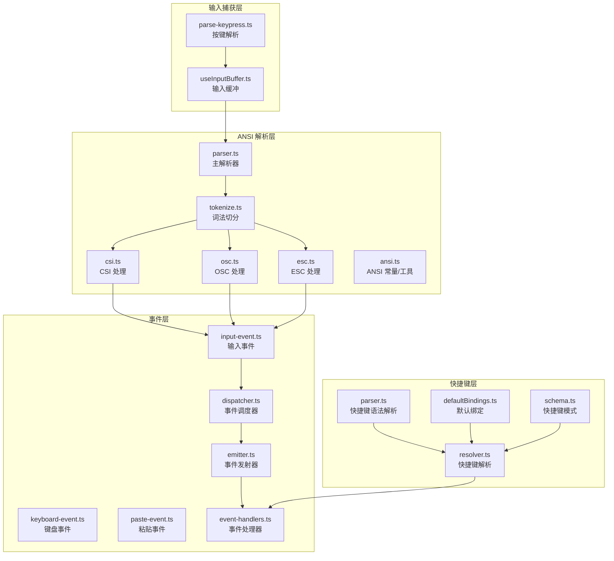
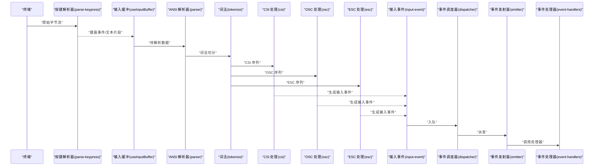
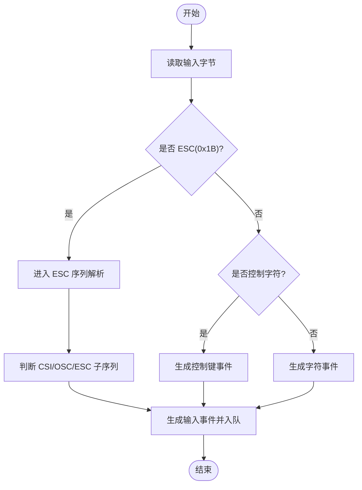
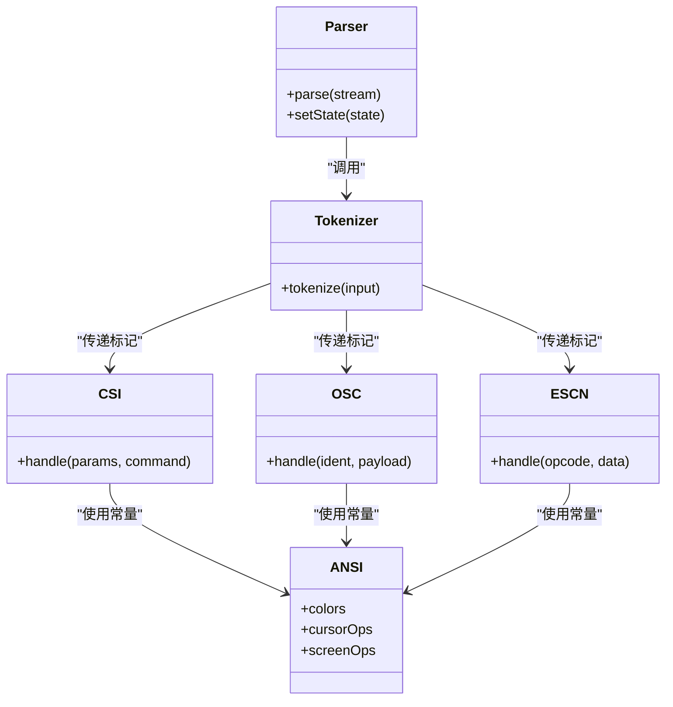
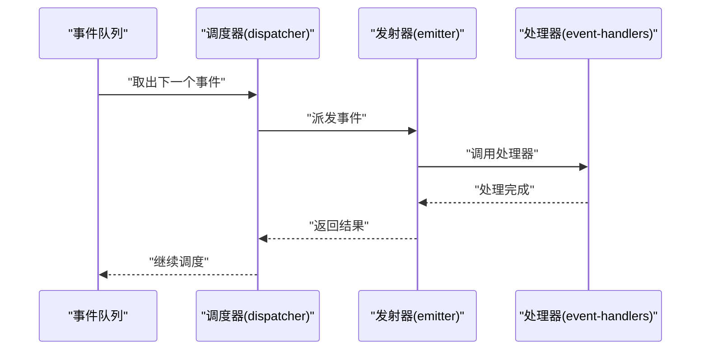
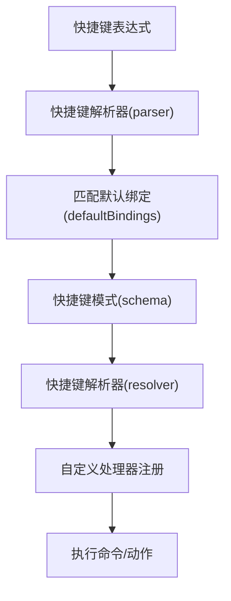
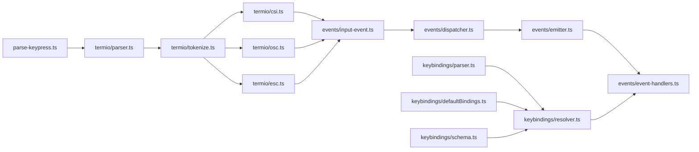

# 终端输入处理

<cite>
**本文引用的文件**
- [src/ink/parse-keypress.ts](file://src/ink/parse-keypress.ts)
- [src/ink/termio/parser.ts](file://src/ink/termio/parser.ts)
- [src/ink/termio/tokenize.ts](file://src/ink/termio/tokenize.ts)
- [src/ink/termio/csi.ts](file://src/ink/termio/csi.ts)
- [src/ink/termio/osc.ts](file://src/ink/termio/osc.ts)
- [src/ink/termio/esc.ts](file://src/ink/termio/esc.ts)
- [src/ink/termio/ansi.ts](file://src/ink/termio/ansi.ts)
- [src/ink/events/input-event.ts](file://src/ink/events/input-event.ts)
- [src/ink/events/keyboard-event.ts](file://src/ink/events/keyboard-event.ts)
- [src/ink/events/paste-event.ts](file://src/ink/events/paste-event.ts)
- [src/ink/events/dispatcher.ts](file://src/ink/events/dispatcher.ts)
- [src/ink/events/emitter.ts](file://src/ink/events/emitter.ts)
- [src/ink/events/event-handlers.ts](file://src/ink/events/event-handlers.ts)
- [src/hooks/useInputBuffer.ts](file://src/hooks/useInputBuffer.ts)
- [src/hooks/useTextInput.ts](file://src/hooks/useTextInput.ts)
- [src/keybindings/resolver.ts](file://src/keybindings/resolver.ts)
- [src/keybindings/parser.ts](file://src/keybindings/parser.ts)
- [src/keybindings/defaultBindings.ts](file://src/keybindings/defaultBindings.ts)
- [src/keybindings/schema.ts](file://src/keybindings/schema.ts)
- [src/constants/keys.ts](file://src/constants/keys.ts)
</cite>

## 目录
1. [简介](#简介)
2. [项目结构](#项目结构)
3. [核心组件](#核心组件)
4. [架构总览](#架构总览)
5. [详细组件分析](#详细组件分析)
6. [依赖关系分析](#依赖关系分析)
7. [性能考虑](#性能考虑)
8. [故障排除指南](#故障排除指南)
9. [结论](#结论)
10. [附录](#附录)

## 简介
本文件面向 Ink 终端 UI 框架的终端输入处理系统，系统性阐述键盘输入捕获机制（按键事件解析、组合键处理、特殊键识别）、ANSI 转义序列解析器（CSI、OSC、ESC 等控制序列）的工作原理、输入缓冲区与事件队列、事件分发机制，以及键盘快捷键配置与自定义输入处理器的实现指南。同时提供性能优化建议与错误恢复策略，帮助开发者在复杂终端交互场景中构建稳定高效的输入处理链路。

## 项目结构
Ink 的输入处理由“按键解析层”“ANSI 序列解析层”“事件生成与分发层”“快捷键与配置层”四部分组成，分别位于以下路径：
- 键盘按键解析：src/ink/parse-keypress.ts
- ANSI 序列解析：src/ink/termio/*
- 输入事件模型与分发：src/ink/events/*
- 输入缓冲与钩子：src/hooks/useInputBuffer.ts、src/hooks/useTextInput.ts
- 快捷键解析与配置：src/keybindings/*

图表来源
- [src/ink/parse-keypress.ts](file://src/ink/parse-keypress.ts)
- [src/ink/termio/parser.ts](file://src/ink/termio/parser.ts)
- [src/ink/termio/tokenize.ts](file://src/ink/termio/tokenize.ts)
- [src/ink/termio/csi.ts](file://src/ink/termio/csi.ts)
- [src/ink/termio/osc.ts](file://src/ink/termio/osc.ts)
- [src/ink/termio/esc.ts](file://src/ink/termio/esc.ts)
- [src/ink/termio/ansi.ts](file://src/ink/termio/ansi.ts)
- [src/ink/events/input-event.ts](file://src/ink/events/input-event.ts)
- [src/ink/events/keyboard-event.ts](file://src/ink/events/keyboard-event.ts)
- [src/ink/events/paste-event.ts](file://src/ink/events/paste-event.ts)
- [src/ink/events/dispatcher.ts](file://src/ink/events/dispatcher.ts)
- [src/ink/events/emitter.ts](file://src/ink/events/emitter.ts)
- [src/ink/events/event-handlers.ts](file://src/ink/events/event-handlers.ts)
- [src/hooks/useInputBuffer.ts](file://src/hooks/useInputBuffer.ts)
- [src/hooks/useTextInput.ts](file://src/hooks/useTextInput.ts)
- [src/keybindings/resolver.ts](file://src/keybindings/resolver.ts)
- [src/keybindings/parser.ts](file://src/keybindings/parser.ts)
- [src/keybindings/defaultBindings.ts](file://src/keybindings/defaultBindings.ts)
- [src/keybindings/schema.ts](file://src/keybindings/schema.ts)

章节来源
- [src/ink/parse-keypress.ts](file://src/ink/parse-keypress.ts)
- [src/ink/termio/parser.ts](file://src/ink/termio/parser.ts)
- [src/ink/termio/tokenize.ts](file://src/ink/termio/tokenize.ts)
- [src/ink/termio/csi.ts](file://src/ink/termio/csi.ts)
- [src/ink/termio/osc.ts](file://src/ink/termio/osc.ts)
- [src/ink/termio/esc.ts](file://src/ink/termio/esc.ts)
- [src/ink/termio/ansi.ts](file://src/ink/termio/ansi.ts)
- [src/ink/events/input-event.ts](file://src/ink/events/input-event.ts)
- [src/ink/events/keyboard-event.ts](file://src/ink/events/keyboard-event.ts)
- [src/ink/events/paste-event.ts](file://src/ink/events/paste-event.ts)
- [src/ink/events/dispatcher.ts](file://src/ink/events/dispatcher.ts)
- [src/ink/events/emitter.ts](file://src/ink/events/emitter.ts)
- [src/ink/events/event-handlers.ts](file://src/ink/events/event-handlers.ts)
- [src/hooks/useInputBuffer.ts](file://src/hooks/useInputBuffer.ts)
- [src/hooks/useTextInput.ts](file://src/hooks/useTextInput.ts)
- [src/keybindings/resolver.ts](file://src/keybindings/resolver.ts)
- [src/keybindings/parser.ts](file://src/keybindings/parser.ts)
- [src/keybindings/defaultBindings.ts](file://src/keybindings/defaultBindings.ts)
- [src/keybindings/schema.ts](file://src/keybindings/schema.ts)

## 核心组件
- 键盘按键解析器：负责从原始字节流中识别普通字符、功能键、组合键（如 Ctrl/Cmd/Alt/Shift），并生成统一的键盘事件对象。
- ANSI 序列解析器：对转义序列进行词法切分与语法解析，支持 CSI（控制序列引入符）、OSC（操作码字符串）、ESC（转义）等，输出对应的输入事件。
- 输入事件模型：抽象出通用的输入事件类型（键盘、粘贴、焦点变化等），并定义事件属性与语义。
- 事件分发器：维护事件队列与调度逻辑，按优先级与上下文将事件投递给注册的处理器。
- 输入缓冲与钩子：提供输入缓冲区管理、输入事件队列与事件分发机制，确保高吞吐下的稳定性与低延迟。
- 快捷键解析与配置：解析用户快捷键表达式，匹配默认或用户自定义绑定，驱动命令执行。

章节来源
- [src/ink/parse-keypress.ts](file://src/ink/parse-keypress.ts)
- [src/ink/termio/parser.ts](file://src/ink/termio/parser.ts)
- [src/ink/events/input-event.ts](file://src/ink/events/input-event.ts)
- [src/ink/events/dispatcher.ts](file://src/ink/events/dispatcher.ts)
- [src/hooks/useInputBuffer.ts](file://src/hooks/useInputBuffer.ts)
- [src/keybindings/resolver.ts](file://src/keybindings/resolver.ts)

## 架构总览
下图展示了从原始输入到事件分发的整体流程，包括按键解析、ANSI 序列识别、事件生成与分发、快捷键匹配等环节。

图表来源
- [src/ink/parse-keypress.ts](file://src/ink/parse-keypress.ts)
- [src/hooks/useInputBuffer.ts](file://src/hooks/useInputBuffer.ts)
- [src/ink/termio/parser.ts](file://src/ink/termio/parser.ts)
- [src/ink/termio/tokenize.ts](file://src/ink/termio/tokenize.ts)
- [src/ink/termio/csi.ts](file://src/ink/termio/csi.ts)
- [src/ink/termio/osc.ts](file://src/ink/termio/osc.ts)
- [src/ink/termio/esc.ts](file://src/ink/termio/esc.ts)
- [src/ink/events/input-event.ts](file://src/ink/events/input-event.ts)
- [src/ink/events/dispatcher.ts](file://src/ink/events/dispatcher.ts)
- [src/ink/events/emitter.ts](file://src/ink/events/emitter.ts)
- [src/ink/events/event-handlers.ts](file://src/ink/events/event-handlers.ts)

## 详细组件分析

### 键盘输入捕获与按键事件解析
- 功能要点
  - 将原始字节流转换为可识别的按键单元，区分普通字符与功能键。
  - 支持组合键（如 Ctrl/Cmd/Alt/Shift）检测与修饰键状态记录。
  - 识别特殊键（如方向键、功能键 F1-F12、PageUp/PageDown 等）并映射为统一事件对象。
  - 输出标准化的键盘事件，供后续 ANSI 解析与快捷键匹配使用。
- 关键实现位置
  - [src/ink/parse-keypress.ts](file://src/ink/parse-keypress.ts)

图表来源
- [src/ink/parse-keypress.ts](file://src/ink/parse-keypress.ts)

章节来源
- [src/ink/parse-keypress.ts](file://src/ink/parse-keypress.ts)

### ANSI 转义序列解析器
- 功能要点
  - 主解析器负责整体流程控制与状态机推进。
  - 词法切分器将输入流切分为标记（Token），便于后续语法分析。
  - CSI（ESC[...m、ESC[...H 等）处理模块解析参数与操作码，生成对应输入事件。
  - OSC（ESC]...；）处理模块解析操作码字符串，用于标题、颜色、通知等场景。
  - ESC（ESC P、ESC ^、ESC _ 等）处理模块解析传统控制序列。
  - ANSI 常量与工具提供颜色、光标、屏幕操作等常量与辅助函数。
- 关键实现位置
  - [src/ink/termio/parser.ts](file://src/ink/termio/parser.ts)
  - [src/ink/termio/tokenize.ts](file://src/ink/termio/tokenize.ts)
  - [src/ink/termio/csi.ts](file://src/ink/termio/csi.ts)
  - [src/ink/termio/osc.ts](file://src/ink/termio/osc.ts)
  - [src/ink/termio/esc.ts](file://src/ink/termio/esc.ts)
  - [src/ink/termio/ansi.ts](file://src/ink/termio/ansi.ts)

图表来源
- [src/ink/termio/parser.ts](file://src/ink/termio/parser.ts)
- [src/ink/termio/tokenize.ts](file://src/ink/termio/tokenize.ts)
- [src/ink/termio/csi.ts](file://src/ink/termio/csi.ts)
- [src/ink/termio/osc.ts](file://src/ink/termio/osc.ts)
- [src/ink/termio/esc.ts](file://src/ink/termio/esc.ts)
- [src/ink/termio/ansi.ts](file://src/ink/termio/ansi.ts)

章节来源
- [src/ink/termio/parser.ts](file://src/ink/termio/parser.ts)
- [src/ink/termio/tokenize.ts](file://src/ink/termio/tokenize.ts)
- [src/ink/termio/csi.ts](file://src/ink/termio/csi.ts)
- [src/ink/termio/osc.ts](file://src/ink/termio/osc.ts)
- [src/ink/termio/esc.ts](file://src/ink/termio/esc.ts)
- [src/ink/termio/ansi.ts](file://src/ink/termio/ansi.ts)

### 输入事件模型与事件分发
- 输入事件模型
  - 定义通用输入事件基类与键盘事件、粘贴事件等具体类型，统一事件字段与行为。
- 事件分发机制
  - 调度器维护事件队列，按优先级与上下文选择处理器。
  - 发射器负责将事件广播给已注册的处理器集合。
  - 事件处理器根据事件类型与上下文执行相应动作。
- 关键实现位置
  - [src/ink/events/input-event.ts](file://src/ink/events/input-event.ts)
  - [src/ink/events/keyboard-event.ts](file://src/ink/events/keyboard-event.ts)
  - [src/ink/events/paste-event.ts](file://src/ink/events/paste-event.ts)
  - [src/ink/events/dispatcher.ts](file://src/ink/events/dispatcher.ts)
  - [src/ink/events/emitter.ts](file://src/ink/events/emitter.ts)
  - [src/ink/events/event-handlers.ts](file://src/ink/events/event-handlers.ts)

图表来源
- [src/ink/events/dispatcher.ts](file://src/ink/events/dispatcher.ts)
- [src/ink/events/emitter.ts](file://src/ink/events/emitter.ts)
- [src/ink/events/event-handlers.ts](file://src/ink/events/event-handlers.ts)

章节来源
- [src/ink/events/input-event.ts](file://src/ink/events/input-event.ts)
- [src/ink/events/keyboard-event.ts](file://src/ink/events/keyboard-event.ts)
- [src/ink/events/paste-event.ts](file://src/ink/events/paste-event.ts)
- [src/ink/events/dispatcher.ts](file://src/ink/events/dispatcher.ts)
- [src/ink/events/emitter.ts](file://src/ink/events/emitter.ts)
- [src/ink/events/event-handlers.ts](file://src/ink/events/event-handlers.ts)

### 输入缓冲区管理与事件队列
- 输入缓冲区
  - 提供环形缓冲或流式缓冲的实现，避免大块输入导致内存峰值过高。
  - 在高吞吐场景下保证数据不丢失，支持快速读写与背压处理。
- 事件队列
  - 采用优先级队列或时间片轮转策略，确保高频事件（如连续按键）不会阻塞其他事件。
  - 支持事件去重、合并与限速，降低渲染压力。
- 关键实现位置
  - [src/hooks/useInputBuffer.ts](file://src/hooks/useInputBuffer.ts)
  - [src/hooks/useTextInput.ts](file://src/hooks/useTextInput.ts)

章节来源
- [src/hooks/useInputBuffer.ts](file://src/hooks/useInputBuffer.ts)
- [src/hooks/useTextInput.ts](file://src/hooks/useTextInput.ts)

### 键盘快捷键配置与自定义输入处理器
- 快捷键解析
  - 使用解析器将用户输入的快捷键表达式（如 Ctrl+K、Cmd+Shift+P）解析为内部表示。
  - 通过解析器与默认绑定表进行匹配，确定目标命令或动作。
- 自定义输入处理器
  - 注册自定义处理器以拦截或扩展特定事件类型的行为。
  - 可结合上下文（如当前焦点、编辑模式）动态决定处理策略。
- 关键实现位置
  - [src/keybindings/resolver.ts](file://src/keybindings/resolver.ts)
  - [src/keybindings/parser.ts](file://src/keybindings/parser.ts)
  - [src/keybindings/defaultBindings.ts](file://src/keybindings/defaultBindings.ts)
  - [src/keybindings/schema.ts](file://src/keybindings/schema.ts)
  - [src/constants/keys.ts](file://src/constants/keys.ts)

图表来源
- [src/keybindings/parser.ts](file://src/keybindings/parser.ts)
- [src/keybindings/defaultBindings.ts](file://src/keybindings/defaultBindings.ts)
- [src/keybindings/schema.ts](file://src/keybindings/schema.ts)
- [src/keybindings/resolver.ts](file://src/keybindings/resolver.ts)
- [src/constants/keys.ts](file://src/constants/keys.ts)

章节来源
- [src/keybindings/resolver.ts](file://src/keybindings/resolver.ts)
- [src/keybindings/parser.ts](file://src/keybindings/parser.ts)
- [src/keybindings/defaultBindings.ts](file://src/keybindings/defaultBindings.ts)
- [src/keybindings/schema.ts](file://src/keybindings/schema.ts)
- [src/constants/keys.ts](file://src/constants/keys.ts)

## 依赖关系分析
- 组件耦合
  - parse-keypress 与 termio.parser 高内聚，前者负责按键，后者负责序列。
  - events 层依赖 termio 与 parse-keypress 的输出，形成清晰的数据流。
  - keybindings 依赖 events 的事件模型，实现快捷键到命令的映射。
- 外部依赖
  - ANSI 常量与终端能力查询依赖底层终端协议规范。
  - 事件分发依赖运行时环境（如 Node.js 的事件循环）。

图表来源
- [src/ink/parse-keypress.ts](file://src/ink/parse-keypress.ts)
- [src/ink/termio/parser.ts](file://src/ink/termio/parser.ts)
- [src/ink/termio/tokenize.ts](file://src/ink/termio/tokenize.ts)
- [src/ink/termio/csi.ts](file://src/ink/termio/csi.ts)
- [src/ink/termio/osc.ts](file://src/ink/termio/osc.ts)
- [src/ink/termio/esc.ts](file://src/ink/termio/esc.ts)
- [src/ink/events/input-event.ts](file://src/ink/events/input-event.ts)
- [src/ink/events/dispatcher.ts](file://src/ink/events/dispatcher.ts)
- [src/ink/events/emitter.ts](file://src/ink/events/emitter.ts)
- [src/ink/events/event-handlers.ts](file://src/ink/events/event-handlers.ts)
- [src/keybindings/resolver.ts](file://src/keybindings/resolver.ts)
- [src/keybindings/parser.ts](file://src/keybindings/parser.ts)
- [src/keybindings/defaultBindings.ts](file://src/keybindings/defaultBindings.ts)
- [src/keybindings/schema.ts](file://src/keybindings/schema.ts)

章节来源
- [src/ink/parse-keypress.ts](file://src/ink/parse-keypress.ts)
- [src/ink/termio/parser.ts](file://src/ink/termio/parser.ts)
- [src/ink/termio/tokenize.ts](file://src/ink/termio/tokenize.ts)
- [src/ink/termio/csi.ts](file://src/ink/termio/csi.ts)
- [src/ink/termio/osc.ts](file://src/ink/termio/osc.ts)
- [src/ink/termio/esc.ts](file://src/ink/termio/esc.ts)
- [src/ink/events/input-event.ts](file://src/ink/events/input-event.ts)
- [src/ink/events/dispatcher.ts](file://src/ink/events/dispatcher.ts)
- [src/ink/events/emitter.ts](file://src/ink/events/emitter.ts)
- [src/ink/events/event-handlers.ts](file://src/ink/events/event-handlers.ts)
- [src/keybindings/resolver.ts](file://src/keybindings/resolver.ts)
- [src/keybindings/parser.ts](file://src/keybindings/parser.ts)
- [src/keybindings/defaultBindings.ts](file://src/keybindings/defaultBindings.ts)
- [src/keybindings/schema.ts](file://src/keybindings/schema.ts)

## 性能考虑
- 流水线化处理
  - 将“读取—解析—事件生成—分发—处理”拆分为独立阶段，减少单点阻塞。
- 批量与背压
  - 对高频输入（如连续按键）采用批量处理与背压策略，避免事件堆积。
- 缓冲区优化
  - 合理设置输入缓冲区大小与超时阈值，平衡延迟与内存占用。
- 事件去重与合并
  - 对重复或相邻事件进行去重与合并，降低渲染与处理开销。
- 解析器优化
  - CSI/OSC/ESC 子解析器采用状态机与预分配策略，减少内存分配与分支判断。
- 快捷键匹配
  - 使用前缀树或哈希表加速快捷键匹配，避免线性扫描。

## 故障排除指南
- 输入卡顿或丢帧
  - 检查输入缓冲区是否过小或未及时消费；确认事件队列是否被长耗时处理器阻塞。
- 特殊键无法识别
  - 核对按键解析器对组合键与功能键的支持范围；检查终端类型与转义序列兼容性。
- ANSI 序列异常
  - 确认词法切分是否完整；检查 CSI/OSC/ESC 子解析器对参数与终止符的处理。
- 快捷键无效
  - 校验快捷键表达式语法；比对默认绑定与用户配置；确认解析器与解析器版本一致。
- 事件未到达处理器
  - 检查事件调度器与发射器的注册状态；确认事件类型与处理器过滤条件匹配。

章节来源
- [src/hooks/useInputBuffer.ts](file://src/hooks/useInputBuffer.ts)
- [src/ink/parse-keypress.ts](file://src/ink/parse-keypress.ts)
- [src/ink/termio/parser.ts](file://src/ink/termio/parser.ts)
- [src/ink/termio/tokenize.ts](file://src/ink/termio/tokenize.ts)
- [src/ink/termio/csi.ts](file://src/ink/termio/csi.ts)
- [src/ink/termio/osc.ts](file://src/ink/termio/osc.ts)
- [src/ink/termio/esc.ts](file://src/ink/termio/esc.ts)
- [src/ink/events/dispatcher.ts](file://src/ink/events/dispatcher.ts)
- [src/ink/events/emitter.ts](file://src/ink/events/emitter.ts)
- [src/keybindings/resolver.ts](file://src/keybindings/resolver.ts)
- [src/keybindings/parser.ts](file://src/keybindings/parser.ts)

## 结论
Ink 的终端输入处理系统通过“按键解析—ANSI 序列解析—事件建模—分发—快捷键匹配”的清晰流水线，实现了对复杂终端输入的高效、稳定处理。借助缓冲区与事件队列机制，系统能够在高吞吐场景下保持低延迟与高可用；通过可扩展的事件模型与快捷键配置，开发者可以灵活定制输入行为。遵循本文的优化与排错建议，可进一步提升系统的性能与可靠性。

## 附录
- 快捷键表达式示例与语法规则
  - 支持组合键（Ctrl/Cmd/Alt/Shift）与功能键（F1-F12、方向键等）组合。
  - 支持大小写敏感与大小写不敏感两种模式。
- 自定义输入处理器开发步骤
  - 实现处理器接口，注册到事件发射器。
  - 在处理器中根据事件类型与上下文执行动作。
  - 注意异步处理与错误捕获，避免影响主线程。