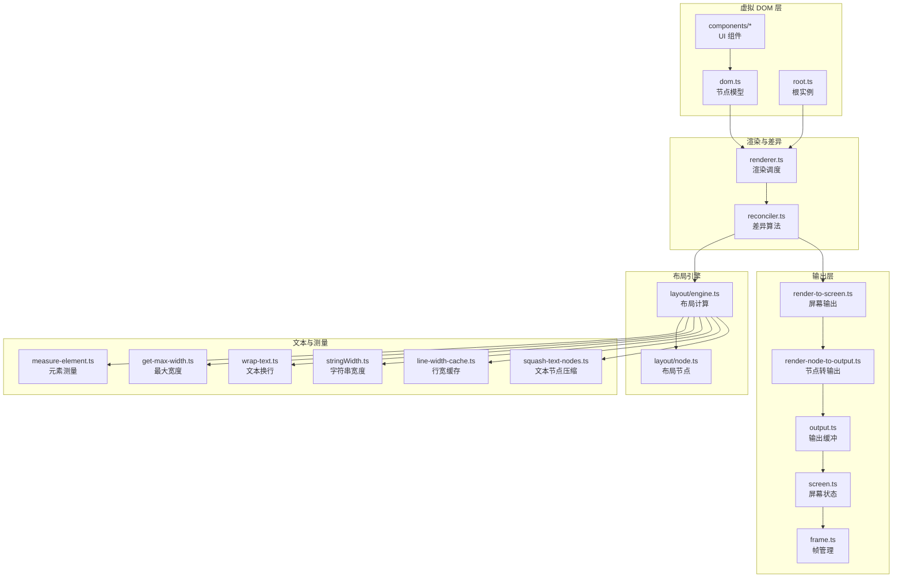
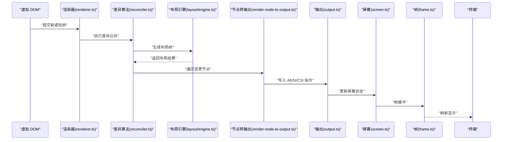
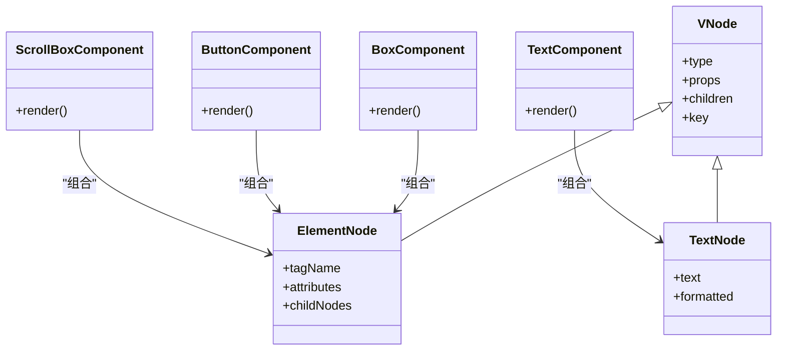
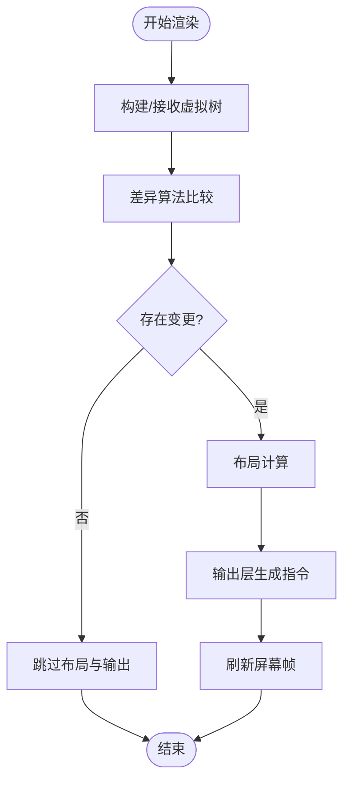
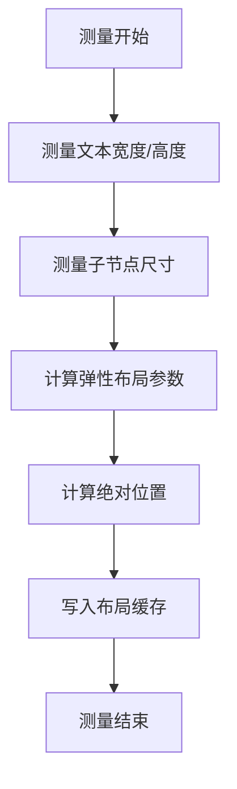
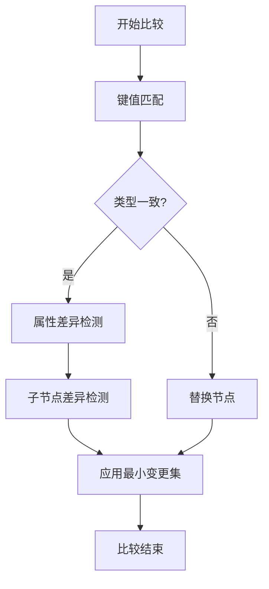
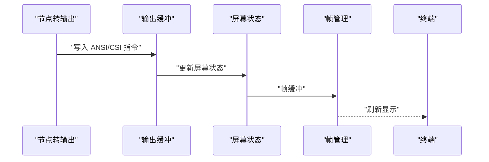
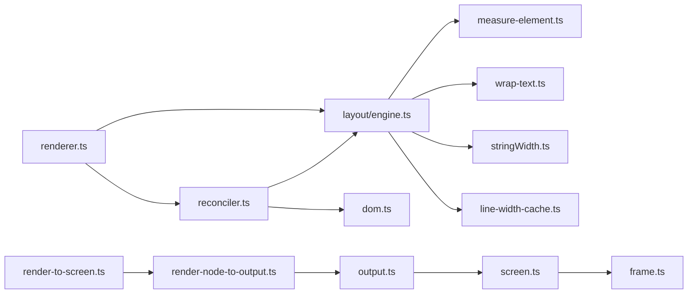

# 虚拟 DOM 渲染器

<cite>
**本文档引用的文件**
- [renderer.ts](file://src/ink/renderer.ts)
- [reconciler.ts](file://src/ink/reconciler.ts)
- [dom.ts](file://src/ink/dom.ts)
- [root.ts](file://src/ink/root.ts)
- [layout/engine.ts](file://src/ink/layout/engine.ts)
- [layout/node.ts](file://src/ink/layout/node.ts)
- [render-node-to-output.ts](file://src/ink/render-node-to-output.ts)
- [render-to-screen.ts](file://src/ink/render-to-screen.ts)
- [optimizer.ts](file://src/ink/optimizer.ts)
- [node-cache.ts](file://src/ink/node-cache.ts)
- [squash-text-nodes.ts](file://src/ink/squash-text-nodes.ts)
- [measure-element.ts](file://src/ink/measure-element.ts)
- [get-max-width.ts](file://src/ink/get-max-width.ts)
- [wrap-text.ts](file://src/ink/wrap-text.ts)
- [stringWidth.ts](file://src/ink/stringWidth.ts)
- [line-width-cache.ts](file://src/ink/line-width-cache.ts)
- [clearTerminal.ts](file://src/ink/clearTerminal.ts)
- [output.ts](file://src/ink/output.ts)
- [screen.ts](file://src/ink/screen.ts)
- [frame.ts](file://src/ink/frame.ts)
- [constants.ts](file://src/ink/constants.ts)
- [styles.ts](file://src/ink/styles.ts)
- [colorize.ts](file://src/ink/colorize.ts)
- [supports-hyperlinks.ts](file://src/ink/supports-hyperlinks.ts)
- [log-update.ts](file://src/ink/log-update.ts)
- [termio.ts](file://src/ink/termio.ts)
- [terminal.ts](file://src/ink/terminal.ts)
- [terminal-querier.ts](file://src/ink/terminal-querier.ts)
- [parse-keypress.ts](file://src/ink/parse-keypress.ts)
- [hit-test.ts](file://src/ink/hit-test.ts)
- [selection.ts](file://src/ink/selection.ts)
- [focus.ts](file://src/ink/focus.ts)
- [cursor.ts](file://src/ink/cursor.ts)
- [tabstops.ts](file://src/ink/tabstops.ts)
- [widest-line.ts](file://src/ink/widest-line.ts)
- [wrapAnsi.ts](file://src/ink/wrapAnsi.ts)
- [bidi.ts](file://src/ink/bidi.ts)
- [Ansi.tsx](file://src/ink/Ansi.tsx)
- [components/Box.tsx](file://src/ink/components/Box.tsx)
- [components/Text.tsx](file://src/ink/components/Text.tsx)
- [components/Button.tsx](file://src/ink/components/Button.tsx)
- [components/ScrollBox.tsx](file://src/ink/components/ScrollBox.tsx)
- [components/Newline.tsx](file://src/ink/components/Newline.tsx)
- [components/AlternateScreen.tsx](file://src/ink/components/AlternateScreen.tsx)
- [components/App.tsx](file://src/ink/components/App.tsx)
- [hooks/use-terminal-focus.ts](file://src/ink/hooks/use-terminal-focus.ts)
- [hooks/use-terminal-viewport.ts](file://src/ink/hooks/use-terminal-viewport.ts)
- [hooks/use-input.ts](file://src/ink/hooks/use-input.ts)
- [hooks/use-interval.ts](file://src/ink/hooks/use-interval.ts)
- [hooks/use-animation-frame.ts](file://src/ink/hooks/use-animation-frame.ts)
- [hooks/use-selection.ts](file://src/ink/hooks/use-selection.ts)
- [hooks/use-search-highlight.ts](file://src/ink/hooks/use-search-highlight.ts)
- [hooks/use-terminal-title.ts](file://src/ink/hooks/use-terminal-title.ts)
- [hooks/use-tab-status.ts](file://src/ink/hooks/use-tab-status.ts)
- [hooks/use-stdin.ts](file://src/ink/hooks/use-stdin.ts)
- [hooks/use-declared-cursor.ts](file://src/ink/hooks/use-declared-cursor.ts)
- [hooks/use-app.ts](file://src/ink/hooks/use-app.ts)
</cite>

## 目录
1. [引言](#引言)
2. [项目结构](#项目结构)
3. [核心组件](#核心组件)
4. [架构总览](#架构总览)
5. [详细组件分析](#详细组件分析)
6. [依赖关系分析](#依赖关系分析)
7. [性能考虑](#性能考虑)
8. [故障排查指南](#故障排查指南)
9. [结论](#结论)
10. [附录](#附录)

## 引言
本文件系统性阐述 Ink 终端 UI 框架的虚拟 DOM 渲染器设计与实现，覆盖虚拟 DOM 树构建、属性设置、子节点管理；渲染引擎从虚拟节点到终端输出的完整转换流程；布局计算引擎的尺寸测量、位置计算与优化；差异算法（reconciler）的节点比较、变更检测与最小化重绘策略；以及渲染性能优化技巧（脏检查、增量更新、渲染批处理）、调试工具与性能分析方法。目标是帮助开发者在终端环境中高效地构建与维护高性能的交互式 UI。

## 项目结构
Ink 的渲染体系围绕“虚拟 DOM + 布局引擎 + 差异算法 + 输出层”组织，关键模块如下：
- 虚拟 DOM 与根：dom.ts 定义节点模型，root.ts 提供挂载点与实例管理。
- 渲染器：renderer.ts 负责调度渲染任务，协调差异算法与输出层。
- 差异算法：reconciler.ts 实现节点比较与变更应用。
- 布局引擎：layout/engine.ts 与 layout/node.ts 负责尺寸测量、几何计算与布局树生成。
- 输出层：render-to-screen.ts、render-node-to-output.ts、output.ts、screen.ts、frame.ts 将布局结果转换为终端指令序列。
- 文本测量与缓存：measure-element.ts、get-max-width.ts、wrap-text.ts、stringWidth.ts、line-width-cache.ts、widest-line.ts。
- 性能优化：optimizer.ts、node-cache.ts、squash-text-nodes.ts。
- 事件与输入：parse-keypress.ts、hit-test.ts、selection.ts、focus.ts、cursor.ts、tabstops.ts。
- 主题与样式：styles.ts、colorize.ts、supports-hyperlinks.ts。
- 组件库：components/* 提供 Box、Text、Button、ScrollBox 等 UI 组成单元。
- 入口与钩子：ink.tsx、hooks/* 提供顶层入口与常用 UI 钩子。

图表来源
- [dom.ts:1-200](file://src/ink/dom.ts#L1-L200)
- [root.ts:1-200](file://src/ink/root.ts#L1-L200)
- [renderer.ts:1-200](file://src/ink/renderer.ts#L1-L200)
- [reconciler.ts:1-200](file://src/ink/reconciler.ts#L1-L200)
- [layout/engine.ts:1-200](file://src/ink/layout/engine.ts#L1-L200)
- [layout/node.ts:1-200](file://src/ink/layout/node.ts#L1-L200)
- [render-to-screen.ts:1-200](file://src/ink/render-to-screen.ts#L1-L200)
- [render-node-to-output.ts:1-200](file://src/ink/render-node-to-output.ts#L1-L200)
- [output.ts:1-200](file://src/ink/output.ts#L1-L200)
- [screen.ts:1-200](file://src/ink/screen.ts#L1-L200)
- [frame.ts:1-200](file://src/ink/frame.ts#L1-L200)
- [measure-element.ts:1-200](file://src/ink/measure-element.ts#L1-L200)
- [get-max-width.ts:1-200](file://src/ink/get-max-width.ts#L1-L200)
- [wrap-text.ts:1-200](file://src/ink/wrap-text.ts#L1-L200)
- [stringWidth.ts:1-200](file://src/ink/stringWidth.ts#L1-L200)
- [line-width-cache.ts:1-200](file://src/ink/line-width-cache.ts#L1-L200)
- [squash-text-nodes.ts:1-200](file://src/ink/squash-text-nodes.ts#L1-L200)

章节来源
- [dom.ts:1-200](file://src/ink/dom.ts#L1-L200)
- [root.ts:1-200](file://src/ink/root.ts#L1-L200)
- [renderer.ts:1-200](file://src/ink/renderer.ts#L1-L200)
- [reconciler.ts:1-200](file://src/ink/reconciler.ts#L1-L200)
- [layout/engine.ts:1-200](file://src/ink/layout/engine.ts#L1-L200)
- [layout/node.ts:1-200](file://src/ink/layout/node.ts#L1-L200)
- [render-to-screen.ts:1-200](file://src/ink/render-to-screen.ts#L1-L200)
- [render-node-to-output.ts:1-200](file://src/ink/render-node-to-output.ts#L1-L200)
- [output.ts:1-200](file://src/ink/output.ts#L1-L200)
- [screen.ts:1-200](file://src/ink/screen.ts#L1-L200)
- [frame.ts:1-200](file://src/ink/frame.ts#L1-L200)
- [measure-element.ts:1-200](file://src/ink/measure-element.ts#L1-L200)
- [get-max-width.ts:1-200](file://src/ink/get-max-width.ts#L1-L200)
- [wrap-text.ts:1-200](file://src/ink/wrap-text.ts#L1-L200)
- [stringWidth.ts:1-200](file://src/ink/stringWidth.ts#L1-L200)
- [line-width-cache.ts:1-200](file://src/ink/line-width-cache.ts#L1-L200)
- [squash-text-nodes.ts:1-200](file://src/ink/squash-text-nodes.ts#L1-L200)

## 核心组件
- 虚拟 DOM 节点模型：定义元素节点、文本节点、属性集合与子节点列表，支持键值标识与类型区分。
- 根实例：管理顶层虚拟节点与实例映射，负责首次渲染与后续更新的触发。
- 渲染器：接收新的虚拟树，调度差异算法与布局计算，并驱动输出层刷新。
- 差异算法：对比新旧虚拟树，识别插入、删除、移动与属性变更，生成最小变更集。
- 布局引擎：基于 Yoga 布局或自定义规则，计算每个节点的尺寸与位置，生成布局树。
- 输出层：将布局结果转换为 ANSI/CSI 指令，写入输出缓冲并提交到屏幕。
- 文本测量与换行：提供字符宽度计算、行宽缓存、文本换行与 ANSI 处理。
- 性能优化：节点缓存、文本节点压缩、布局优化器与增量更新策略。

章节来源
- [dom.ts:1-200](file://src/ink/dom.ts#L1-L200)
- [root.ts:1-200](file://src/ink/root.ts#L1-L200)
- [renderer.ts:1-200](file://src/ink/renderer.ts#L1-L200)
- [reconciler.ts:1-200](file://src/ink/reconciler.ts#L1-L200)
- [layout/engine.ts:1-200](file://src/ink/layout/engine.ts#L1-L200)
- [layout/node.ts:1-200](file://src/ink/layout/node.ts#L1-L200)
- [render-to-screen.ts:1-200](file://src/ink/render-to-screen.ts#L1-L200)
- [render-node-to-output.ts:1-200](file://src/ink/render-node-to-output.ts#L1-L200)
- [output.ts:1-200](file://src/ink/output.ts#L1-L200)
- [screen.ts:1-200](file://src/ink/screen.ts#L1-L200)
- [frame.ts:1-200](file://src/ink/frame.ts#L1-L200)
- [measure-element.ts:1-200](file://src/ink/measure-element.ts#L1-L200)
- [get-max-width.ts:1-200](file://src/ink/get-max-width.ts#L1-L200)
- [wrap-text.ts:1-200](file://src/ink/wrap-text.ts#L1-L200)
- [stringWidth.ts:1-200](file://src/ink/stringWidth.ts#L1-L200)
- [line-width-cache.ts:1-200](file://src/ink/line-width-cache.ts#L1-L200)
- [squash-text-nodes.ts:1-200](file://src/ink/squash-text-nodes.ts#L1-L200)
- [optimizer.ts:1-200](file://src/ink/optimizer.ts#L1-L200)
- [node-cache.ts:1-200](file://src/ink/node-cache.ts#L1-L200)

## 架构总览
下图展示从虚拟节点到终端输出的完整数据流：虚拟 DOM -> 渲染器 -> 差异算法 -> 布局引擎 -> 输出层 -> 屏幕帧 -> 终端。

图表来源
- [renderer.ts:1-200](file://src/ink/renderer.ts#L1-L200)
- [reconciler.ts:1-200](file://src/ink/reconciler.ts#L1-L200)
- [layout/engine.ts:1-200](file://src/ink/layout/engine.ts#L1-L200)
- [render-node-to-output.ts:1-200](file://src/ink/render-node-to-output.ts#L1-L200)
- [output.ts:1-200](file://src/ink/output.ts#L1-L200)
- [screen.ts:1-200](file://src/ink/screen.ts#L1-L200)
- [frame.ts:1-200](file://src/ink/frame.ts#L1-L200)
- [render-to-screen.ts:1-200](file://src/ink/render-to-screen.ts#L1-L200)

## 详细组件分析

### 虚拟 DOM 树构建与管理
- 节点类型与属性：元素节点包含标签名、属性对象、子节点数组与可选键值；文本节点包含文本内容与格式属性。
- 子节点管理：支持多级嵌套，通过键值进行稳定排序与匹配；提供兄弟节点索引与父节点引用以支持回溯。
- 属性设置：支持样式、布局、事件与选择等属性；属性变更在差异阶段被检测并最小化应用。
- 组件封装：UI 组件（如 Box、Text、Button、ScrollBox）通过组合基础节点实现复杂布局与行为。

图表来源
- [dom.ts:1-200](file://src/ink/dom.ts#L1-L200)
- [components/Box.tsx:1-200](file://src/ink/components/Box.tsx#L1-L200)
- [components/Text.tsx:1-200](file://src/ink/components/Text.tsx#L1-L200)
- [components/Button.tsx:1-200](file://src/ink/components/Button.tsx#L1-L200)
- [components/ScrollBox.tsx:1-200](file://src/ink/components/ScrollBox.tsx#L1-L200)

章节来源
- [dom.ts:1-200](file://src/ink/dom.ts#L1-L200)
- [components/Box.tsx:1-200](file://src/ink/components/Box.tsx#L1-L200)
- [components/Text.tsx:1-200](file://src/ink/components/Text.tsx#L1-L200)
- [components/Button.tsx:1-200](file://src/ink/components/Button.tsx#L1-L200)
- [components/ScrollBox.tsx:1-200](file://src/ink/components/ScrollBox.tsx#L1-L200)

### 渲染引擎工作流程
- 输入：顶层虚拟节点与根实例。
- 调度：渲染器根据帧率与事件触发渲染任务。
- 差异：差异算法对比当前树与上一帧树，生成最小变更集。
- 布局：布局引擎计算尺寸与位置，生成布局树。
- 输出：输出层将布局结果转换为 ANSI/CSI 指令，写入缓冲并刷新屏幕。

图表来源
- [renderer.ts:1-200](file://src/ink/renderer.ts#L1-L200)
- [reconciler.ts:1-200](file://src/ink/reconciler.ts#L1-L200)
- [layout/engine.ts:1-200](file://src/ink/layout/engine.ts#L1-L200)
- [render-to-screen.ts:1-200](file://src/ink/render-to-screen.ts#L1-L200)

章节来源
- [renderer.ts:1-200](file://src/ink/renderer.ts#L1-L200)
- [reconciler.ts:1-200](file://src/ink/reconciler.ts#L1-L200)
- [layout/engine.ts:1-200](file://src/ink/layout/engine.ts#L1-L200)
- [render-to-screen.ts:1-200](file://src/ink/render-to-screen.ts#L1-L200)

### 布局计算引擎
- 尺寸测量：结合文本宽度、字体度量与容器约束，计算节点所需空间。
- 位置计算：基于布局树的父子关系与相对定位，确定绝对坐标。
- 布局优化：缓存测量结果、避免重复计算；对静态节点采用快路径；按需布局减少全量重算。
- 换行与截断：文本换行、超长截断与 ANSI 序列处理，保证视觉一致性。

图表来源
- [layout/engine.ts:1-200](file://src/ink/layout/engine.ts#L1-L200)
- [layout/node.ts:1-200](file://src/ink/layout/node.ts#L1-L200)
- [measure-element.ts:1-200](file://src/ink/measure-element.ts#L1-L200)
- [get-max-width.ts:1-200](file://src/ink/get-max-width.ts#L1-L200)
- [wrap-text.ts:1-200](file://src/ink/wrap-text.ts#L1-L200)
- [stringWidth.ts:1-200](file://src/ink/stringWidth.ts#L1-L200)
- [line-width-cache.ts:1-200](file://src/ink/line-width-cache.ts#L1-L200)
- [widest-line.ts:1-200](file://src/ink/widest-line.ts#L1-L200)

章节来源
- [layout/engine.ts:1-200](file://src/ink/layout/engine.ts#L1-L200)
- [layout/node.ts:1-200](file://src/ink/layout/node.ts#L1-L200)
- [measure-element.ts:1-200](file://src/ink/measure-element.ts#L1-L200)
- [get-max-width.ts:1-200](file://src/ink/get-max-width.ts#L1-L200)
- [wrap-text.ts:1-200](file://src/ink/wrap-text.ts#L1-L200)
- [stringWidth.ts:1-200](file://src/ink/stringWidth.ts#L1-L200)
- [line-width-cache.ts:1-200](file://src/ink/line-width-cache.ts#L1-L200)
- [widest-line.ts:1-200](file://src/ink/widest-line.ts#L1-L200)

### 差异算法（reconciler）
- 节点比较：基于键值与类型进行同层比较，识别新增、删除、移动与更新。
- 变更检测：属性变更与子节点变更分别记录，合并为最小操作集。
- 最小化重绘：仅对受影响节点重建布局与输出，避免整树重绘。
- 键值策略：优先使用稳定键值，确保列表项在插入/删除时保持正确顺序。

图表来源
- [reconciler.ts:1-200](file://src/ink/reconciler.ts#L1-L200)

章节来源
- [reconciler.ts:1-200](file://src/ink/reconciler.ts#L1-L200)

### 输出层与终端适配
- 指令生成：将布局结果转换为 ANSI/CSI 指令，包括光标移动、颜色设置、区域擦除等。
- 缓冲与刷新：输出缓冲累积指令，帧管理器统一刷新，减少闪烁与过度绘制。
- 终端特性：支持超链接、颜色、光标控制与屏幕区域管理；兼容不同终端能力检测。

图表来源
- [render-node-to-output.ts:1-200](file://src/ink/render-node-to-output.ts#L1-L200)
- [output.ts:1-200](file://src/ink/output.ts#L1-L200)
- [screen.ts:1-200](file://src/ink/screen.ts#L1-L200)
- [frame.ts:1-200](file://src/ink/frame.ts#L1-L200)
- [render-to-screen.ts:1-200](file://src/ink/render-to-screen.ts#L1-L200)

章节来源
- [render-node-to-output.ts:1-200](file://src/ink/render-node-to-output.ts#L1-L200)
- [output.ts:1-200](file://src/ink/output.ts#L1-L200)
- [screen.ts:1-200](file://src/ink/screen.ts#L1-L200)
- [frame.ts:1-200](file://src/ink/frame.ts#L1-L200)
- [render-to-screen.ts:1-200](file://src/ink/render-to-screen.ts#L1-L200)

### 文本测量与换行
- 字符宽度：基于 Unicode 与终端字体度量计算字符宽度，处理全角、半角与组合字符。
- 行宽缓存：缓存已测量行宽，避免重复计算。
- 换行策略：按宽度阈值换行，保留单词边界；ANSI 序列不影响视觉宽度。
- 文本节点压缩：合并相邻纯文本节点，减少节点数量与渲染开销。

章节来源
- [stringWidth.ts:1-200](file://src/ink/stringWidth.ts#L1-L200)
- [line-width-cache.ts:1-200](file://src/ink/line-width-cache.ts#L1-L200)
- [wrap-text.ts:1-200](file://src/ink/wrap-text.ts#L1-L200)
- [widest-line.ts:1-200](file://src/ink/widest-line.ts#L1-L200)
- [squash-text-nodes.ts:1-200](file://src/ink/squash-text-nodes.ts#L1-L200)

### 组件与钩子
- 组件：Box 提供布局容器，Text 提供文本渲染，Button 支持交互，ScrollBox 实现滚动视窗。
- 钩子：use-terminal-focus、use-terminal-viewport、use-input、use-interval、use-animation-frame、use-selection、use-search-highlight、use-terminal-title、use-tab-status、use-stdin、use-declared-cursor、use-app 等提供终端交互与状态管理。

章节来源
- [components/Box.tsx:1-200](file://src/ink/components/Box.tsx#L1-L200)
- [components/Text.tsx:1-200](file://src/ink/components/Text.tsx#L1-L200)
- [components/Button.tsx:1-200](file://src/ink/components/Button.tsx#L1-L200)
- [components/ScrollBox.tsx:1-200](file://src/ink/components/ScrollBox.tsx#L1-L200)
- [hooks/use-terminal-focus.ts:1-200](file://src/ink/hooks/use-terminal-focus.ts#L1-L200)
- [hooks/use-terminal-viewport.ts:1-200](file://src/ink/hooks/use-terminal-viewport.ts#L1-L200)
- [hooks/use-input.ts:1-200](file://src/ink/hooks/use-input.ts#L1-L200)
- [hooks/use-interval.ts:1-200](file://src/ink/hooks/use-interval.ts#L1-L200)
- [hooks/use-animation-frame.ts:1-200](file://src/ink/hooks/use-animation-frame.ts#L1-L200)
- [hooks/use-selection.ts:1-200](file://src/ink/hooks/use-selection.ts#L1-L200)
- [hooks/use-search-highlight.ts:1-200](file://src/ink/hooks/use-search-highlight.ts#L1-L200)
- [hooks/use-terminal-title.ts:1-200](file://src/ink/hooks/use-terminal-title.ts#L1-L200)
- [hooks/use-tab-status.ts:1-200](file://src/ink/hooks/use-tab-status.ts#L1-L200)
- [hooks/use-stdin.ts:1-200](file://src/ink/hooks/use-stdin.ts#L1-L200)
- [hooks/use-declared-cursor.ts:1-200](file://src/ink/hooks/use-declared-cursor.ts#L1-L200)
- [hooks/use-app.ts:1-200](file://src/ink/hooks/use-app.ts#L1-L200)

## 依赖关系分析
- 渲染器依赖差异算法与布局引擎；差异算法依赖节点模型与布局结果；输出层依赖布局结果与屏幕状态。
- 文本测量与换行依赖字符串宽度与行宽缓存；布局引擎依赖测量与换行模块。
- 组件库依赖基础节点模型；钩子依赖渲染器与终端状态。

图表来源
- [renderer.ts:1-200](file://src/ink/renderer.ts#L1-L200)
- [reconciler.ts:1-200](file://src/ink/reconciler.ts#L1-L200)
- [dom.ts:1-200](file://src/ink/dom.ts#L1-L200)
- [layout/engine.ts:1-200](file://src/ink/layout/engine.ts#L1-L200)
- [measure-element.ts:1-200](file://src/ink/measure-element.ts#L1-L200)
- [wrap-text.ts:1-200](file://src/ink/wrap-text.ts#L1-L200)
- [stringWidth.ts:1-200](file://src/ink/stringWidth.ts#L1-L200)
- [line-width-cache.ts:1-200](file://src/ink/line-width-cache.ts#L1-L200)
- [render-to-screen.ts:1-200](file://src/ink/render-to-screen.ts#L1-L200)
- [render-node-to-output.ts:1-200](file://src/ink/render-node-to-output.ts#L1-L200)
- [output.ts:1-200](file://src/ink/output.ts#L1-L200)
- [screen.ts:1-200](file://src/ink/screen.ts#L1-L200)
- [frame.ts:1-200](file://src/ink/frame.ts#L1-L200)

章节来源
- [renderer.ts:1-200](file://src/ink/renderer.ts#L1-L200)
- [reconciler.ts:1-200](file://src/ink/reconciler.ts#L1-L200)
- [dom.ts:1-200](file://src/ink/dom.ts#L1-L200)
- [layout/engine.ts:1-200](file://src/ink/layout/engine.ts#L1-L200)
- [measure-element.ts:1-200](file://src/ink/measure-element.ts#L1-L200)
- [wrap-text.ts:1-200](file://src/ink/wrap-text.ts#L1-L200)
- [stringWidth.ts:1-200](file://src/ink/stringWidth.ts#L1-L200)
- [line-width-cache.ts:1-200](file://src/ink/line-width-cache.ts#L1-L200)
- [render-to-screen.ts:1-200](file://src/ink/render-to-screen.ts#L1-L200)
- [render-node-to-output.ts:1-200](file://src/ink/render-node-to-output.ts#L1-L200)
- [output.ts:1-200](file://src/ink/output.ts#L1-L200)
- [screen.ts:1-200](file://src/ink/screen.ts#L1-L200)
- [frame.ts:1-200](file://src/ink/frame.ts#L1-L200)

## 性能考虑
- 脏检查：通过变更标记与增量更新，避免整树重绘；仅对受影响节点重新布局与输出。
- 增量更新：差异算法生成最小变更集；布局引擎按需计算；输出层只写入变化区域。
- 渲染批处理：合并多次输入事件与状态更新，在下一帧统一渲染，减少抖动。
- 缓存策略：行宽缓存、节点布局缓存、文本节点压缩；测量结果复用降低 CPU 开销。
- 布局优化：静态节点快路径、弹性布局参数预计算、子树共享与复用。
- 终端刷新：帧缓冲与批量刷新，减少闪烁与过度绘制。

章节来源
- [optimizer.ts:1-200](file://src/ink/optimizer.ts#L1-L200)
- [node-cache.ts:1-200](file://src/ink/node-cache.ts#L1-L200)
- [squash-text-nodes.ts:1-200](file://src/ink/squash-text-nodes.ts#L1-L200)
- [line-width-cache.ts:1-200](file://src/ink/line-width-cache.ts#L1-L200)
- [layout/engine.ts:1-200](file://src/ink/layout/engine.ts#L1-L200)

## 故障排查指南
- 渲染不刷新：检查帧管理与输出缓冲是否正确刷新；确认渲染器调度是否正常。
- 布局异常：核对文本测量与换行逻辑；检查容器尺寸与约束条件。
- 性能问题：启用日志更新与性能指标，定位热点函数；检查缓存命中率与变更范围。
- 终端兼容：验证 ANSI/CSI 指令生成；检查终端能力检测与降级策略。
- 事件无响应：检查输入解析与事件分发链路；确认焦点与选择状态。

章节来源
- [log-update.ts:1-200](file://src/ink/log-update.ts#L1-L200)
- [parse-keypress.ts:1-200](file://src/ink/parse-keypress.ts#L1-L200)
- [hit-test.ts:1-200](file://src/ink/hit-test.ts#L1-L200)
- [selection.ts:1-200](file://src/ink/selection.ts#L1-L200)
- [focus.ts:1-200](file://src/ink/focus.ts#L1-L200)
- [cursor.ts:1-200](file://src/ink/cursor.ts#L1-L200)
- [supports-hyperlinks.ts:1-200](file://src/ink/supports-hyperlinks.ts#L1-L200)

## 结论
Ink 的虚拟 DOM 渲染器通过清晰的分层设计与高效的差异算法，实现了在终端环境中的高性能 UI 渲染。结合布局引擎、文本测量与输出层的协同，能够在保证视觉一致性的同时，最大化减少不必要的计算与绘制。配合缓存、增量更新与批处理等优化手段，可在复杂交互场景中维持流畅体验。

## 附录
- 调试工具：日志更新、帧计数与性能指标；事件解析与命中测试辅助定位问题。
- 最佳实践：合理使用键值、避免频繁重排、利用静态节点快路径、控制变更粒度。
- 扩展建议：自定义组件与钩子、终端能力探测与适配、跨平台兼容性增强。