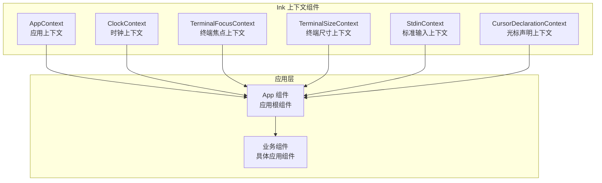
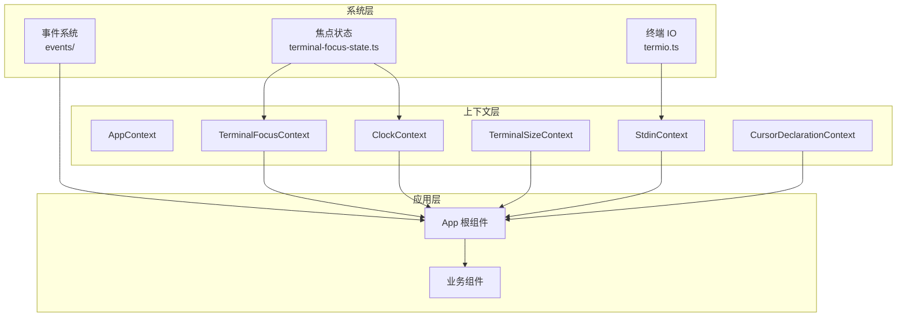
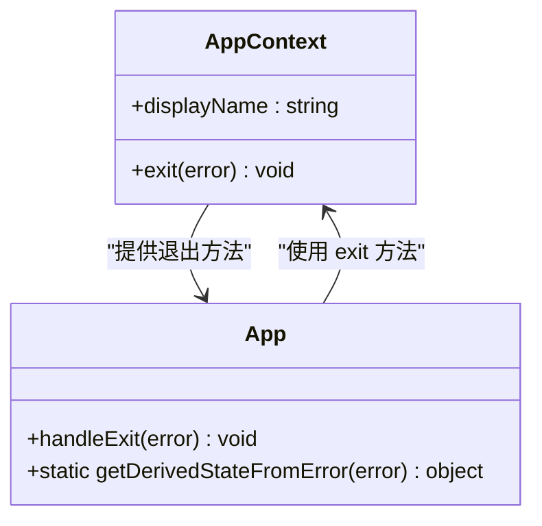
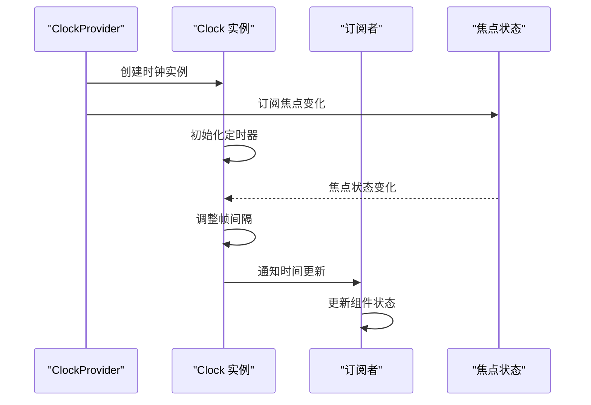
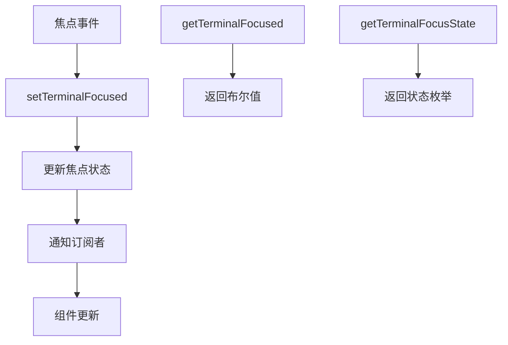
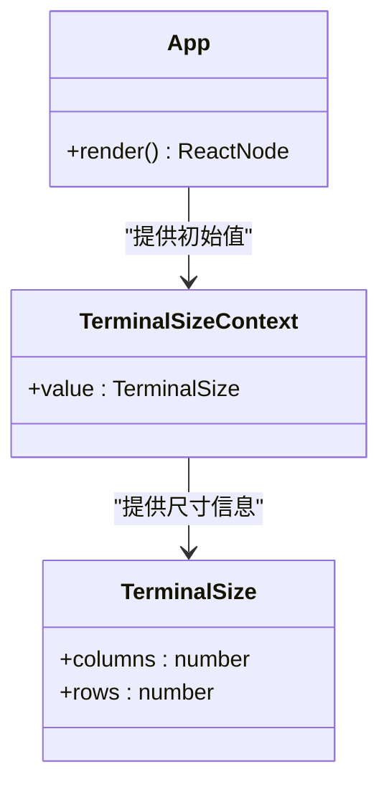
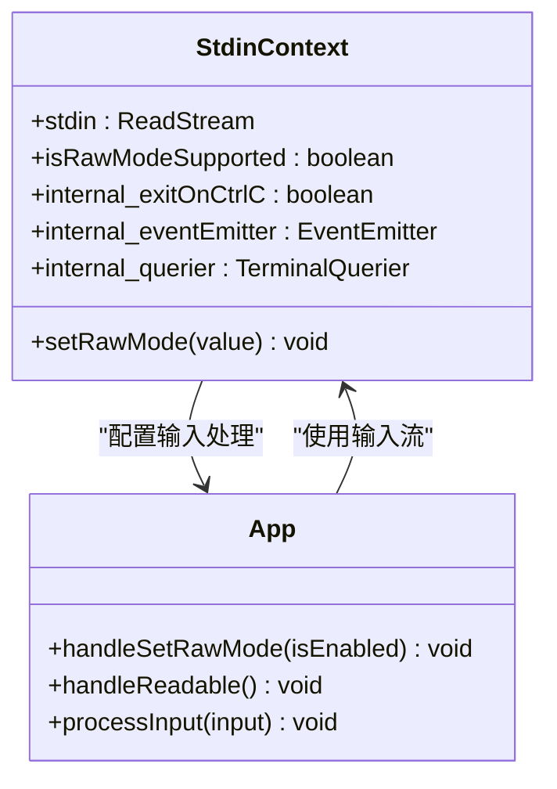
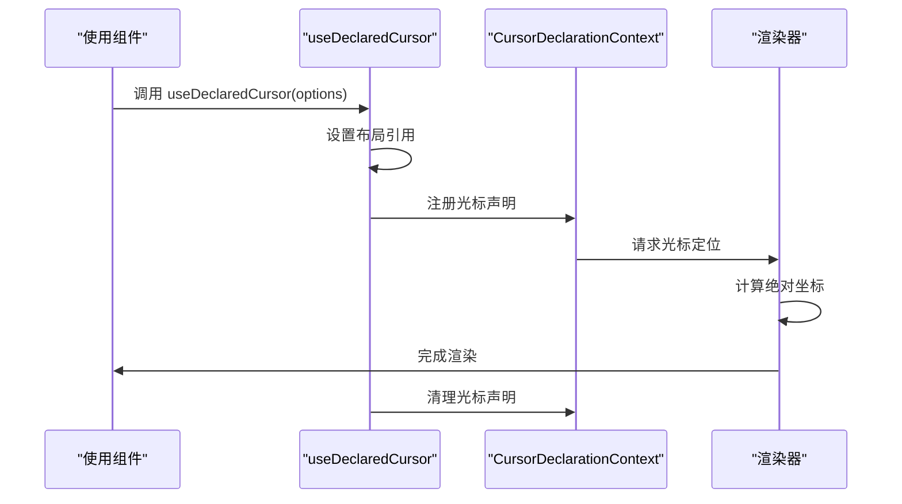
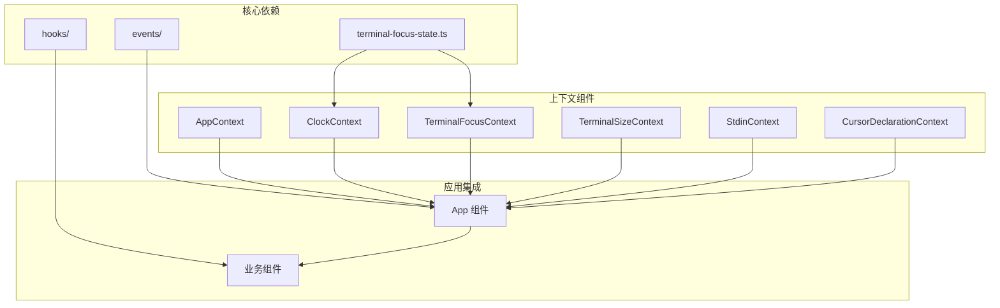

# 上下文组件

<cite>
**本文档引用的文件**
- [AppContext.ts](file://src/ink/components/AppContext.ts)
- [ClockContext.tsx](file://src/ink/components/ClockContext.tsx)
- [TerminalFocusContext.tsx](file://src/ink/components/TerminalFocusContext.tsx)
- [TerminalSizeContext.tsx](file://src/ink/components/TerminalSizeContext.tsx)
- [StdinContext.ts](file://src/ink/components/StdinContext.ts)
- [CursorDeclarationContext.ts](file://src/ink/components/CursorDeclarationContext.ts)
- [App.tsx](file://src/ink/components/App.tsx)
- [terminal-focus-state.ts](file://src/ink/terminal-focus-state.ts)
- [use-terminal-focus.ts](file://src/ink/hooks/use-terminal-focus.ts)
- [use-stdin.ts](file://src/ink/hooks/use-stdin.ts)
- [use-declared-cursor.ts](file://src/ink/hooks/use-declared-cursor.ts)
- [BaseTextInput.tsx](file://src/components/BaseTextInput.tsx)
</cite>

## 目录
1. [简介](#简介)
2. [项目结构](#项目结构)
3. [核心组件](#核心组件)
4. [架构概览](#架构概览)
5. [详细组件分析](#详细组件分析)
6. [依赖关系分析](#依赖关系分析)
7. [性能考虑](#性能考虑)
8. [故障排除指南](#故障排除指南)
9. [结论](#结论)

## 简介

Ink 上下文组件是 Ink 渲染引擎的核心基础设施，负责管理终端应用的各种状态和配置。本文档深入分析了六个关键上下文组件：AppContext 应用上下文、ClockContext 时钟上下文、TerminalFocusContext 终端焦点上下文、TerminalSizeContext 终端尺寸上下文、StdinContext 标准输入上下文，以及 CursorDeclarationContext 光标声明上下文。

这些上下文组件通过 React Context API 提供了一种高效的状态管理模式，使得终端应用能够实时响应用户输入、系统事件和环境变化。每个上下文都有其特定的职责范围，从应用生命周期管理到精确的光标控制。

## 项目结构

Ink 上下文组件位于 `src/ink/components/` 目录下，采用模块化设计，每个上下文都是独立的模块，可以单独使用或组合使用。

**图表来源**
- [AppContext.ts:1-22](file://src/ink/components/AppContext.ts#L1-L22)
- [ClockContext.tsx:1-112](file://src/ink/components/ClockContext.tsx#L1-L112)
- [TerminalFocusContext.tsx:1-52](file://src/ink/components/TerminalFocusContext.tsx#L1-L52)
- [TerminalSizeContext.tsx:1-7](file://src/ink/components/TerminalSizeContext.tsx#L1-L7)
- [StdinContext.ts:1-50](file://src/ink/components/StdinContext.ts#L1-L50)
- [CursorDeclarationContext.ts:1-33](file://src/ink/components/CursorDeclarationContext.ts#L1-L33)

**章节来源**
- [AppContext.ts:1-22](file://src/ink/components/AppContext.ts#L1-L22)
- [ClockContext.tsx:1-112](file://src/ink/components/ClockContext.tsx#L1-L112)
- [TerminalFocusContext.tsx:1-52](file://src/ink/components/TerminalFocusContext.tsx#L1-L52)
- [TerminalSizeContext.tsx:1-7](file://src/ink/components/TerminalSizeContext.tsx#L1-L7)
- [StdinContext.ts:1-50](file://src/ink/components/StdinContext.ts#L1-L50)
- [CursorDeclarationContext.ts:1-33](file://src/ink/components/CursorDeclarationContext.ts#L1-L33)

## 核心组件

Ink 的上下文组件系统由以下六个核心组件构成：

### AppContext - 应用上下文
提供应用级别的控制能力，主要负责应用退出（卸载）功能。这是一个简单的上下文，暴露了一个 `exit` 方法，允许子组件触发应用的优雅关闭。

### ClockContext - 时钟上下文  
实现了一个高性能的时钟系统，支持订阅者模式和帧间隔控制。时钟根据终端焦点状态动态调整更新频率，在焦点丢失时降低更新频率以节省资源。

### TerminalFocusContext - 终端焦点上下文
管理终端焦点状态，提供焦点变化的实时通知。使用 React 的 `useSyncExternalStore` 钩子实现，避免不必要的重渲染。

### TerminalSizeContext - 终端尺寸上下文
提供终端窗口大小信息，包括列数和行数。这对于响应式布局和自适应界面设计至关重要。

### StdinContext - 标准输入上下文
封装标准输入流和相关操作，包括原始模式设置、输入事件处理等。为应用提供统一的输入处理接口。

### CursorDeclarationContext - 光标声明上下文
实现精确的光标位置控制，支持相对坐标系和节点关联的光标定位。这是实现高质量终端用户体验的关键组件。

**章节来源**
- [AppContext.ts:3-16](file://src/ink/components/AppContext.ts#L3-L16)
- [ClockContext.tsx:5-69](file://src/ink/components/ClockContext.tsx#L5-L69)
- [TerminalFocusContext.tsx:5-12](file://src/ink/components/TerminalFocusContext.tsx#L5-L12)
- [TerminalSizeContext.tsx:2-6](file://src/ink/components/TerminalSizeContext.tsx#L2-L6)
- [StdinContext.ts:5-29](file://src/ink/components/StdinContext.ts#L5-L29)
- [CursorDeclarationContext.ts:4-26](file://src/ink/components/CursorDeclarationContext.ts#L4-L26)

## 架构概览

Ink 上下文组件采用分层架构设计，从底层的系统状态管理到上层的应用逻辑分离。

**图表来源**
- [App.tsx:19-25](file://src/ink/components/App.tsx#L19-L25)
- [terminal-focus-state.ts:1-48](file://src/ink/terminal-focus-state.ts#L1-L48)
- [ClockContext.tsx:75-108](file://src/ink/components/ClockContext.tsx#L75-L108)

**章节来源**
- [App.tsx:159-184](file://src/ink/components/App.tsx#L159-L184)
- [terminal-focus-state.ts:1-48](file://src/ink/terminal-focus-state.ts#L1-L48)

## 详细组件分析

### AppContext 分析

AppContext 是最简单的上下文组件，专注于应用生命周期管理。

**图表来源**
- [AppContext.ts:3-16](file://src/ink/components/AppContext.ts#L3-L16)
- [App.tsx:406-411](file://src/ink/components/App.tsx#L406-L411)

AppContext 的设计遵循最小化原则，只暴露必要的功能。`exit` 方法用于触发应用的优雅关闭过程，确保所有资源得到正确清理。

**章节来源**
- [AppContext.ts:1-22](file://src/ink/components/AppContext.ts#L1-L22)
- [App.tsx:406-411](file://src/ink/components/App.tsx#L406-L411)

### ClockContext 分析

ClockContext 实现了一个复杂的时钟系统，支持动态帧率调整和订阅者模式。

**图表来源**
- [ClockContext.tsx:10-67](file://src/ink/components/ClockContext.tsx#L10-L67)
- [ClockContext.tsx:75-108](file://src/ink/components/ClockContext.tsx#L75-L108)

ClockContext 的核心特性包括：
- **动态帧率调整**：根据焦点状态自动调整更新频率
- **订阅者模式**：支持多个组件同时订阅时间更新
- **内存优化**：当没有活跃订阅者时停止定时器

**章节来源**
- [ClockContext.tsx:1-112](file://src/ink/components/ClockContext.tsx#L1-L112)

### TerminalFocusContext 分析

TerminalFocusContext 使用现代 React 的 `useSyncExternalStore` API 实现，提供高效的焦点状态管理。

**图表来源**
- [terminal-focus-state.ts:12-32](file://src/ink/terminal-focus-state.ts#L12-L32)

这种设计避免了传统 `useState` + `useEffect` 模式的潜在问题，提供了更可靠的外部状态同步。

**章节来源**
- [TerminalFocusContext.tsx:1-52](file://src/ink/components/TerminalFocusContext.tsx#L1-L52)
- [terminal-focus-state.ts:1-48](file://src/ink/terminal-focus-state.ts#L1-L48)

### TerminalSizeContext 分析

TerminalSizeContext 提供静态的终端尺寸信息，适用于不需要实时响应的场景。

**图表来源**
- [TerminalSizeContext.tsx:2-6](file://src/ink/components/TerminalSizeContext.tsx#L2-L6)
- [App.tsx:160-163](file://src/ink/components/App.tsx#L160-L163)

**章节来源**
- [TerminalSizeContext.tsx:1-7](file://src/ink/components/TerminalSizeContext.tsx#L1-L7)
- [App.tsx:159-184](file://src/ink/components/App.tsx#L159-L184)

### StdinContext 分析

StdinContext 封装了复杂的终端输入处理逻辑，提供了安全的输入流访问接口。

**图表来源**
- [StdinContext.ts:5-44](file://src/ink/components/StdinContext.ts#L5-L44)
- [App.tsx:216-293](file://src/ink/components/App.tsx#L216-L293)

**章节来源**
- [StdinContext.ts:1-50](file://src/ink/components/StdinContext.ts#L1-L50)
- [App.tsx:216-293](file://src/ink/components/App.tsx#L216-L293)

### CursorDeclarationContext 分析

CursorDeclarationContext 实现了精确的光标控制，支持复杂的布局和定位需求。

**图表来源**
- [use-declared-cursor.ts:25-70](file://src/ink/hooks/use-declared-cursor.ts#L25-L70)

这个组件的关键特性是支持相对坐标系和节点关联，确保光标位置与实际布局保持同步。

**章节来源**
- [CursorDeclarationContext.ts:1-33](file://src/ink/components/CursorDeclarationContext.ts#L1-L33)
- [use-declared-cursor.ts:1-74](file://src/ink/hooks/use-declared-cursor.ts#L1-L74)

## 依赖关系分析

Ink 上下文组件之间存在复杂的相互依赖关系，形成了一个完整的生态系统。

**图表来源**
- [App.tsx:19-25](file://src/ink/components/App.tsx#L19-L25)
- [ClockContext.tsx:1-4](file://src/ink/components/ClockContext.tsx#L1-L4)
- [terminal-focus-state.ts:1-6](file://src/ink/terminal-focus-state.ts#L1-L6)

**章节来源**
- [App.tsx:19-25](file://src/ink/components/App.tsx#L19-L25)

## 性能考虑

Ink 上下文组件在设计时充分考虑了性能优化：

### 内存优化策略
- **惰性初始化**：ClockContext 使用惰性初始化避免不必要的计算
- **条件渲染**：各上下文组件只在必要时触发重新渲染
- **资源清理**：及时清理定时器和事件监听器

### 响应式优化
- **useSyncExternalStore**：TerminalFocusContext 使用现代 React API 减少重渲染
- **订阅者模式**：ClockContext 只向活跃订阅者发送更新
- **批量更新**：输入处理使用批处理机制减少状态更新次数

### 资源管理
- **帧率自适应**：ClockContext 根据焦点状态调整更新频率
- **内存池**：复用对象避免频繁分配
- **防抖处理**：输入事件处理包含防抖机制

## 故障排除指南

### 常见问题及解决方案

**问题：时钟不更新**
- 检查焦点状态是否正确传递
- 确认订阅者数量大于零
- 验证帧间隔设置是否合理

**问题：光标位置错误**
- 检查相对坐标的计算
- 确认节点引用是否正确
- 验证布局更新时机

**问题：输入无响应**
- 检查原始模式设置
- 确认事件监听器注册
- 验证输入流状态

**章节来源**
- [ClockContext.tsx:18-47](file://src/ink/components/ClockContext.tsx#L18-L47)
- [use-declared-cursor.ts:54-70](file://src/ink/hooks/use-declared-cursor.ts#L54-L70)
- [App.tsx:216-293](file://src/ink/components/App.tsx#L216-L293)

## 结论

Ink 上下文组件系统展现了优秀的软件工程实践，通过精心设计的架构实现了高度模块化和可维护性的代码结构。每个上下文组件都专注于特定的功能领域，同时通过清晰的接口与其他组件协作。

这些组件的设计体现了以下关键原则：
- **单一职责原则**：每个上下文只负责一个特定功能领域
- **开闭原则**：易于扩展但不易修改
- **依赖倒置**：高层模块不依赖低层模块
- **接口隔离**：小而专一的接口优于大而全的接口

通过合理的组合使用，开发者可以构建出高性能、可维护的终端应用程序。这些上下文组件不仅提供了强大的功能，还为未来的功能扩展奠定了坚实的基础。