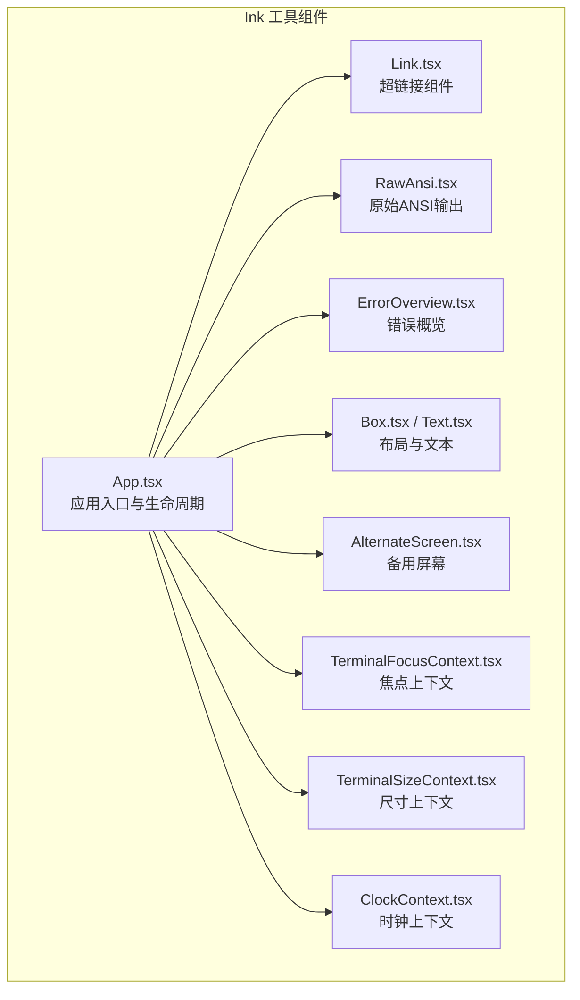
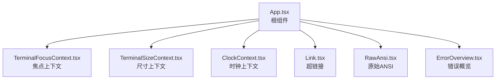
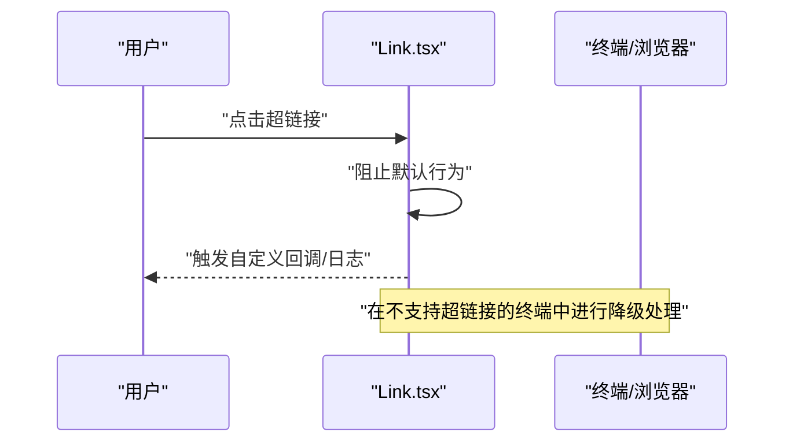
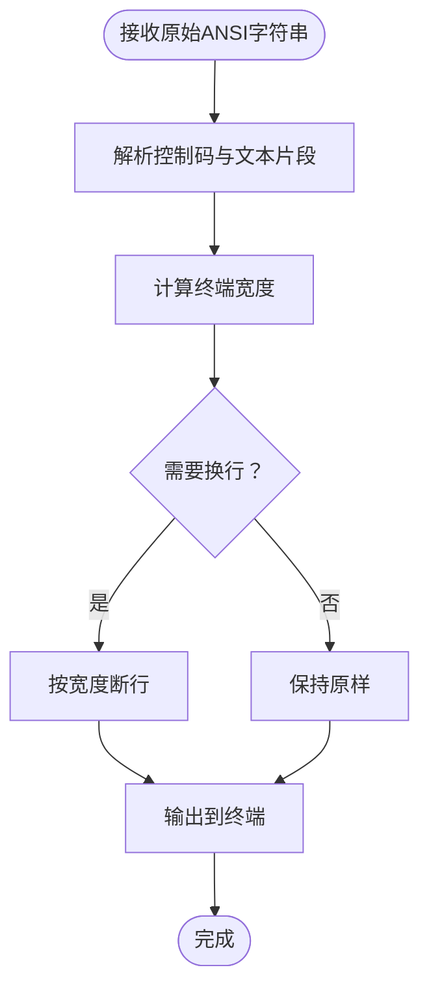
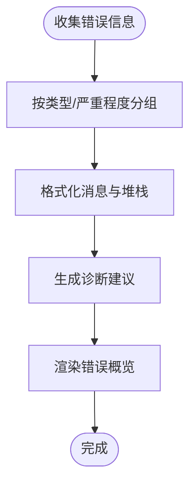
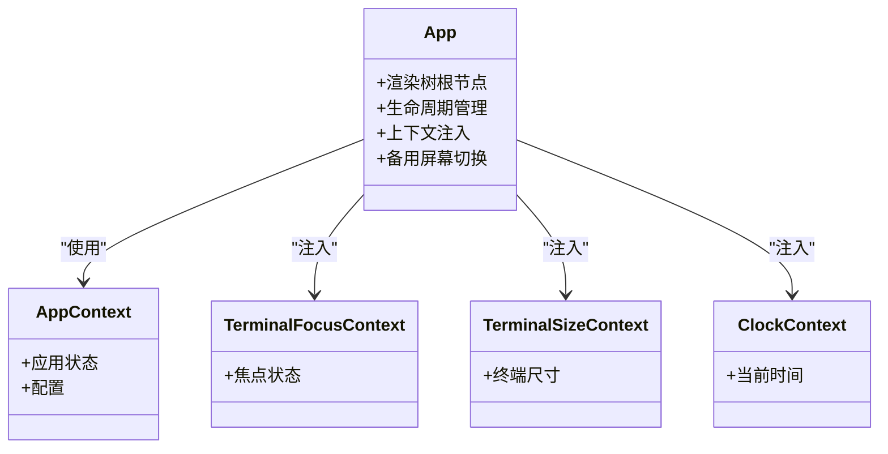
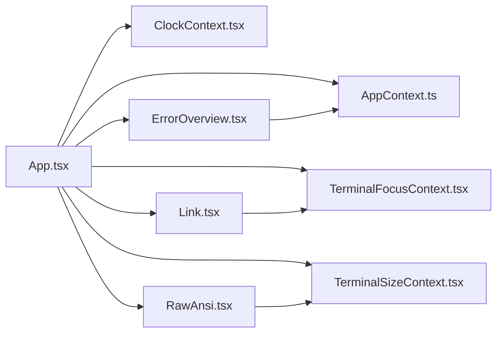

# 工具组件

<cite>
**本文引用的文件**
- [src/ink/components/Link.tsx](file://src/ink/components/Link.tsx)
- [src/ink/components/RawAnsi.tsx](file://src/ink/components/RawAnsi.tsx)
- [src/ink/components/ErrorOverview.tsx](file://src/ink/components/ErrorOverview.tsx)
- [src/ink/components/App.tsx](file://src/ink/components/App.tsx)
- [src/ink/components/AppContext.ts](file://src/ink/components/AppContext.ts)
- [src/ink/components/Box.tsx](file://src/ink/components/Box.tsx)
- [src/ink/components/Text.tsx](file://src/ink/components/Text.tsx)
- [src/ink/components/TerminalFocusContext.tsx](file://src/ink/components/TerminalFocusContext.tsx)
- [src/ink/components/TerminalSizeContext.tsx](file://src/ink/components/TerminalSizeContext.tsx)
- [src/ink/components/AlternateScreen.tsx](file://src/ink/components/AlternateScreen.tsx)
- [src/ink/components/ScrollBox.tsx](file://src/ink/components/ScrollBox.tsx)
- [src/ink/components/Newline.tsx](file://src/ink/components/Newline.tsx)
- [src/ink/components/NoSelect.tsx](file://src/ink/components/NoSelect.tsx)
- [src/ink/components/CursorDeclarationContext.ts](file://src/ink/components/CursorDeclarationContext.ts)
- [src/ink/components/StdinContext.ts](file://src/ink/components/StdinContext.ts)
- [src/ink/components/ClockContext.tsx](file://src/ink/components/ClockContext.tsx)
- [src/ink/components/Spacer.tsx](file://src/ink/components/Spacer.tsx)
- [src/ink/components/Button.tsx](file://src/ink/components/Button.tsx)
- [src/ink/components/TerminalSizeContext.tsx](file://src/ink/components/TerminalSizeContext.tsx)
- [src/ink/components/TerminalFocusContext.tsx](file://src/ink/components/TerminalFocusContext.tsx)
- [src/ink/components/AlternateScreen.tsx](file://src/ink/components/AlternateScreen.tsx)
- [src/ink/components/ScrollBox.tsx](file://src/ink/components/ScrollBox.tsx)
- [src/ink/components/Newline.tsx](file://src/ink/components/Newline.tsx)
- [src/ink/components/NoSelect.tsx](file://src/ink/components/NoSelect.tsx)
- [src/ink/components/CursorDeclarationContext.ts](file://src/ink/components/CursorDeclarationContext.ts)
- [src/ink/components/StdinContext.ts](file://src/ink/components/StdinContext.ts)
- [src/ink/components/ClockContext.tsx](file://src/ink/components/ClockContext.tsx)
- [src/ink/components/Spacer.tsx](file://src/ink/components/Spacer.tsx)
- [src/ink/components/Button.tsx](file://src/ink/components/Button.tsx)
</cite>

## 目录
1. [简介](#简介)
2. [项目结构](#项目结构)
3. [核心组件](#核心组件)
4. [架构总览](#架构总览)
5. [详细组件分析](#详细组件分析)
6. [依赖关系分析](#依赖关系分析)
7. [性能考量](#性能考量)
8. [故障排除指南](#故障排除指南)
9. [结论](#结论)
10. [附录](#附录)

## 简介
本文件聚焦于 Ink 工具组件中的四类关键组件：Link 超链接组件、RawAnsi 原始 ANSI 输出组件、ErrorOverview 错误概览组件与 App 应用组件。我们将从系统架构、数据流、处理逻辑、集成点、错误处理与性能特征等维度进行深入解析，并提供可操作的使用场景、示例定位与故障排除建议。

## 项目结构
Ink 工具组件位于 src/ink/components 目录下，围绕终端渲染与交互构建，包含基础布局组件（如 Box、Text）、上下文组件（TerminalFocusContext、TerminalSizeContext、ClockContext）、屏幕切换组件（AlternateScreen）以及应用入口组件 App。Link、RawAnsi、ErrorOverview 分别承担超链接点击处理、原始 ANSI 格式化输出与颜色控制、错误信息展示与诊断。

图表来源
- [src/ink/components/App.tsx](file://src/ink/components/App.tsx)
- [src/ink/components/Link.tsx](file://src/ink/components/Link.tsx)
- [src/ink/components/RawAnsi.tsx](file://src/ink/components/RawAnsi.tsx)
- [src/ink/components/ErrorOverview.tsx](file://src/ink/components/ErrorOverview.tsx)
- [src/ink/components/Box.tsx](file://src/ink/components/Box.tsx)
- [src/ink/components/Text.tsx](file://src/ink/components/Text.tsx)
- [src/ink/components/AlternateScreen.tsx](file://src/ink/components/AlternateScreen.tsx)
- [src/ink/components/TerminalFocusContext.tsx](file://src/ink/components/TerminalFocusContext.tsx)
- [src/ink/components/TerminalSizeContext.tsx](file://src/ink/components/TerminalSizeContext.tsx)
- [src/ink/components/ClockContext.tsx](file://src/ink/components/ClockContext.tsx)

章节来源
- [src/ink/components/App.tsx](file://src/ink/components/App.tsx)
- [src/ink/components/Link.tsx](file://src/ink/components/Link.tsx)
- [src/ink/components/RawAnsi.tsx](file://src/ink/components/RawAnsi.tsx)
- [src/ink/components/ErrorOverview.tsx](file://src/ink/components/ErrorOverview.tsx)
- [src/ink/components/Box.tsx](file://src/ink/components/Box.tsx)
- [src/ink/components/Text.tsx](file://src/ink/components/Text.tsx)
- [src/ink/components/AlternateScreen.tsx](file://src/ink/components/AlternateScreen.tsx)
- [src/ink/components/TerminalFocusContext.tsx](file://src/ink/components/TerminalFocusContext.tsx)
- [src/ink/components/TerminalSizeContext.tsx](file://src/ink/components/TerminalSizeContext.tsx)
- [src/ink/components/ClockContext.tsx](file://src/ink/components/ClockContext.tsx)

## 核心组件
- Link 超链接组件：负责在终端中渲染可点击的超链接，支持点击事件捕获与默认行为阻止，便于在 CLI 中提供外部链接跳转能力。
- RawAnsi 原始 ANSI 组件：直接输出带 ANSI 控制码的文本，用于彩色、加粗、下划线等终端格式化显示，同时保留换行与空白处理。
- ErrorOverview 错误概览组件：集中展示错误信息、堆栈与诊断提示，帮助用户快速定位问题并提供修复建议。
- App 应用组件：作为 Ink 渲染树的根节点，管理应用生命周期、上下文注入、备用屏幕切换与焦点状态，协调其他组件协同工作。

章节来源
- [src/ink/components/Link.tsx](file://src/ink/components/Link.tsx)
- [src/ink/components/RawAnsi.tsx](file://src/ink/components/RawAnsi.tsx)
- [src/ink/components/ErrorOverview.tsx](file://src/ink/components/ErrorOverview.tsx)
- [src/ink/components/App.tsx](file://src/ink/components/App.tsx)

## 架构总览
Ink 的渲染树以 App 为根，通过上下文（TerminalFocusContext、TerminalSizeContext、ClockContext）向子组件提供运行时环境；Link、RawAnsi、ErrorOverview 在各自职责范围内与上下文协作，完成交互与渲染。

图表来源
- [src/ink/components/App.tsx](file://src/ink/components/App.tsx)
- [src/ink/components/TerminalFocusContext.tsx](file://src/ink/components/TerminalFocusContext.tsx)
- [src/ink/components/TerminalSizeContext.tsx](file://src/ink/components/TerminalSizeContext.tsx)
- [src/ink/components/ClockContext.tsx](file://src/ink/components/ClockContext.tsx)
- [src/ink/components/Link.tsx](file://src/ink/components/Link.tsx)
- [src/ink/components/RawAnsi.tsx](file://src/ink/components/RawAnsi.tsx)
- [src/ink/components/ErrorOverview.tsx](file://src/ink/components/ErrorOverview.tsx)

## 详细组件分析

### Link 超链接组件
- 功能概述
  - 在终端中渲染可点击的超链接，支持点击事件拦截与默认行为阻止，避免在某些终端环境中触发系统默认打开行为。
  - 通过 Ink 的事件机制与上下文协作，确保在不同终端环境下具备一致的交互体验。
- 关键特性
  - 点击处理：捕获点击事件，执行自定义回调或阻止默认行为。
  - 可访问性：结合焦点上下文与键盘导航，提升可访问性。
  - 兼容性：在不支持超链接的终端中优雅降级。
- 使用场景
  - CLI 输出中提供文档链接、仓库地址、帮助页面等。
  - 与命令行工具配合，引导用户到相关资源。
- 示例定位
  - 组件定义与事件处理逻辑参考：[src/ink/components/Link.tsx](file://src/ink/components/Link.tsx)

图表来源
- [src/ink/components/Link.tsx](file://src/ink/components/Link.tsx)

章节来源
- [src/ink/components/Link.tsx](file://src/ink/components/Link.tsx)

### RawAnsi 原始 ANSI 组件
- 功能概述
  - 接收原始 ANSI 控制码字符串并原样输出，支持颜色、样式与光标控制。
  - 处理换行与空白字符，保证在终端中的正确对齐与渲染。
- 关键特性
  - 原始输出：不进行额外格式转换，确保控制码生效。
  - 行宽与换行：根据终端宽度自动换行，避免溢出。
  - 性能：避免不必要的重排与重复渲染，适合大量日志与彩色输出。
- 使用场景
  - 彩色日志输出、进度条、表格绘制、状态指示器。
  - 与工具链输出集成，保持一致的终端风格。
- 示例定位
  - 组件实现与输出逻辑参考：[src/ink/components/RawAnsi.tsx](file://src/ink/components/RawAnsi.tsx)

图表来源
- [src/ink/components/RawAnsi.tsx](file://src/ink/components/RawAnsi.tsx)

章节来源
- [src/ink/components/RawAnsi.tsx](file://src/ink/components/RawAnsi.tsx)

### ErrorOverview 错误概览组件
- 功能概述
  - 汇总并展示错误信息、堆栈跟踪与诊断建议，帮助用户快速理解问题并采取修复措施。
  - 支持分组、折叠与高亮，便于在复杂错误场景中快速定位关键信息。
- 关键特性
  - 结构化展示：将错误类型、消息、位置与上下文信息清晰呈现。
  - 诊断建议：提供常见问题的修复指引与进一步排查步骤。
  - 可读性：结合颜色与排版，提升错误信息的可读性与可操作性。
- 使用场景
  - CLI 工具报错、插件加载失败、配置错误、权限不足等场景。
  - 开发者调试与用户自助排查。
- 示例定位
  - 组件实现与展示逻辑参考：[src/ink/components/ErrorOverview.tsx](file://src/ink/components/ErrorOverview.tsx)

图表来源
- [src/ink/components/ErrorOverview.tsx](file://src/ink/components/ErrorOverview.tsx)

章节来源
- [src/ink/components/ErrorOverview.tsx](file://src/ink/components/ErrorOverview.tsx)

### App 应用组件
- 功能概述
  - Ink 渲染树的根节点，负责应用生命周期管理、上下文注入、备用屏幕切换与焦点状态维护。
  - 协调 Link、RawAnsi、ErrorOverview 等组件在统一的渲染环境中协同工作。
- 关键特性
  - 生命周期：初始化、渲染、更新、卸载的完整生命周期管理。
  - 上下文：提供终端焦点、尺寸与时钟等全局状态给子组件。
  - 屏幕切换：支持主屏与备用屏幕之间的切换，适配滚动与全屏场景。
- 使用场景
  - CLI 应用的启动与关闭流程。
  - 复杂交互界面的根容器。
- 示例定位
  - 组件实现与上下文注入逻辑参考：[src/ink/components/App.tsx](file://src/ink/components/App.tsx)，上下文定义参考：[src/ink/components/AppContext.ts](file://src/ink/components/AppContext.ts)

图表来源
- [src/ink/components/App.tsx](file://src/ink/components/App.tsx)
- [src/ink/components/AppContext.ts](file://src/ink/components/AppContext.ts)
- [src/ink/components/TerminalFocusContext.tsx](file://src/ink/components/TerminalFocusContext.tsx)
- [src/ink/components/TerminalSizeContext.tsx](file://src/ink/components/TerminalSizeContext.tsx)
- [src/ink/components/ClockContext.tsx](file://src/ink/components/ClockContext.tsx)

章节来源
- [src/ink/components/App.tsx](file://src/ink/components/App.tsx)
- [src/ink/components/AppContext.ts](file://src/ink/components/AppContext.ts)
- [src/ink/components/TerminalFocusContext.tsx](file://src/ink/components/TerminalFocusContext.tsx)
- [src/ink/components/TerminalSizeContext.tsx](file://src/ink/components/TerminalSizeContext.tsx)
- [src/ink/components/ClockContext.tsx](file://src/ink/components/ClockContext.tsx)

## 依赖关系分析
- 组件耦合
  - App 作为根组件，向上文组件（TerminalFocusContext、TerminalSizeContext、ClockContext）与子组件（Link、RawAnsi、ErrorOverview）提供统一接口。
  - Link 依赖上下文以实现可访问性与一致性；RawAnsi 依赖终端尺寸与换行策略；ErrorOverview 依赖结构化数据与渲染上下文。
- 外部依赖
  - Ink 渲染引擎与终端能力检测（如超链接支持）。
  - 上下文模块（AppContext、TerminalFocusContext、TerminalSizeContext、ClockContext）提供共享状态。
- 潜在循环依赖
  - 当前结构以 App 为中心辐射，未见明显循环依赖迹象。

图表来源
- [src/ink/components/App.tsx](file://src/ink/components/App.tsx)
- [src/ink/components/AppContext.ts](file://src/ink/components/AppContext.ts)
- [src/ink/components/TerminalFocusContext.tsx](file://src/ink/components/TerminalFocusContext.tsx)
- [src/ink/components/TerminalSizeContext.tsx](file://src/ink/components/TerminalSizeContext.tsx)
- [src/ink/components/ClockContext.tsx](file://src/ink/components/ClockContext.tsx)
- [src/ink/components/Link.tsx](file://src/ink/components/Link.tsx)
- [src/ink/components/RawAnsi.tsx](file://src/ink/components/RawAnsi.tsx)
- [src/ink/components/ErrorOverview.tsx](file://src/ink/components/ErrorOverview.tsx)

章节来源
- [src/ink/components/App.tsx](file://src/ink/components/App.tsx)
- [src/ink/components/AppContext.ts](file://src/ink/components/AppContext.ts)
- [src/ink/components/TerminalFocusContext.tsx](file://src/ink/components/TerminalFocusContext.tsx)
- [src/ink/components/TerminalSizeContext.tsx](file://src/ink/components/TerminalSizeContext.tsx)
- [src/ink/components/ClockContext.tsx](file://src/ink/components/ClockContext.tsx)
- [src/ink/components/Link.tsx](file://src/ink/components/Link.tsx)
- [src/ink/components/RawAnsi.tsx](file://src/ink/components/RawAnsi.tsx)
- [src/ink/components/ErrorOverview.tsx](file://src/ink/components/ErrorOverview.tsx)

## 性能考量
- 渲染优化
  - 将长文本拆分为更小片段，减少单次渲染压力；利用换行缓存与宽度测量结果复用。
  - 对频繁更新的区域采用最小化重渲染策略，避免整树重绘。
- 上下文访问
  - 通过上下文传递状态，减少 props 下钻带来的重复渲染。
- I/O 与终端能力
  - 在不支持超链接或特定 ANSI 控制码的终端中进行降级处理，避免无效输出导致的性能损耗。

## 故障排除指南
- 超链接无法点击
  - 检查终端是否支持超链接；若不支持，Link 将进行降级处理。参考：[src/ink/components/Link.tsx](file://src/ink/components/Link.tsx)
- ANSI 输出颜色异常
  - 确认终端颜色模式与 ANSI 控制码兼容；必要时禁用或简化颜色输出。参考：[src/ink/components/RawAnsi.tsx](file://src/ink/components/RawAnsi.tsx)
- 错误信息难以定位
  - 使用 ErrorOverview 的分组与高亮功能；检查诊断建议与堆栈信息。参考：[src/ink/components/ErrorOverview.tsx](file://src/ink/components/ErrorOverview.tsx)
- 应用启动异常
  - 检查 App 的上下文注入与备用屏幕切换逻辑；确认各上下文模块正常初始化。参考：[src/ink/components/App.tsx](file://src/ink/components/App.tsx)，[src/ink/components/AppContext.ts](file://src/ink/components/AppContext.ts)

章节来源
- [src/ink/components/Link.tsx](file://src/ink/components/Link.tsx)
- [src/ink/components/RawAnsi.tsx](file://src/ink/components/RawAnsi.tsx)
- [src/ink/components/ErrorOverview.tsx](file://src/ink/components/ErrorOverview.tsx)
- [src/ink/components/App.tsx](file://src/ink/components/App.tsx)
- [src/ink/components/AppContext.ts](file://src/ink/components/AppContext.ts)

## 结论
Link、RawAnsi、ErrorOverview 与 App 四个组件分别覆盖了交互、渲染、诊断与应用管理的核心领域。通过上下文与根组件的协同，Ink 工具组件能够在终端环境中提供一致、可访问且高性能的用户体验。建议在实际使用中结合具体终端能力与业务需求，合理选择与组合这些组件，以获得最佳效果。

## 附录
- 相关上下文组件
  - 终端焦点上下文：[src/ink/components/TerminalFocusContext.tsx](file://src/ink/components/TerminalFocusContext.tsx)
  - 终端尺寸上下文：[src/ink/components/TerminalSizeContext.tsx](file://src/ink/components/TerminalSizeContext.tsx)
  - 时钟上下文：[src/ink/components/ClockContext.tsx](file://src/ink/components/ClockContext.tsx)
- 辅助组件
  - Box 与 Text：[src/ink/components/Box.tsx](file://src/ink/components/Box.tsx)，[src/ink/components/Text.tsx](file://src/ink/components/Text.tsx)
  - 滚动与备用屏幕：[src/ink/components/ScrollBox.tsx](file://src/ink/components/ScrollBox.tsx)，[src/ink/components/AlternateScreen.tsx](file://src/ink/components/AlternateScreen.tsx)
  - 无障碍与输入：[src/ink/components/NoSelect.tsx](file://src/ink/components/NoSelect.tsx)，[src/ink/components/StdinContext.ts](file://src/ink/components/StdinContext.ts)
  - 光标声明：[src/ink/components/CursorDeclarationContext.ts](file://src/ink/components/CursorDeclarationContext.ts)