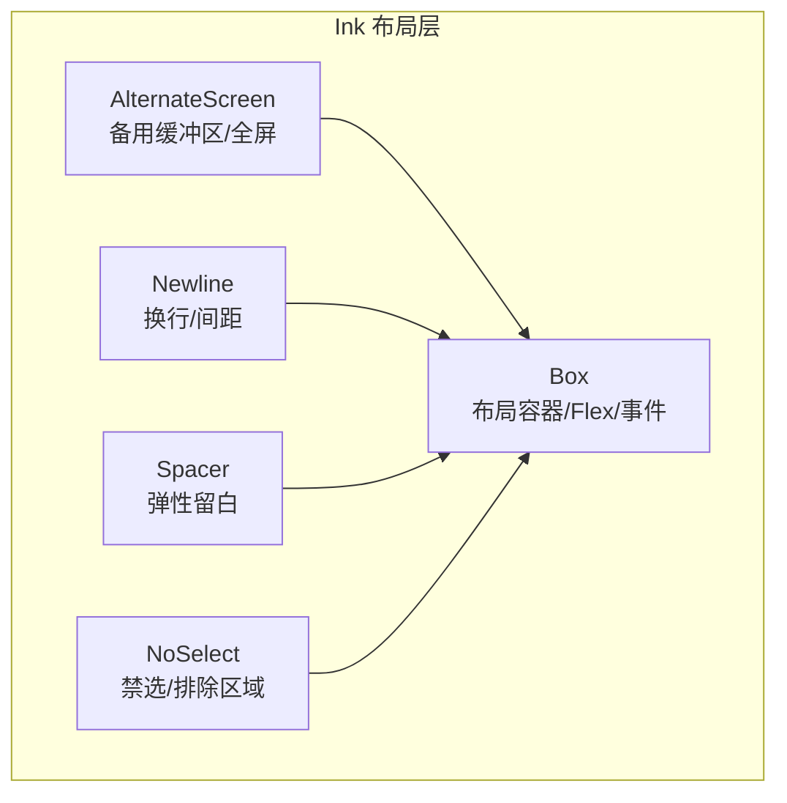
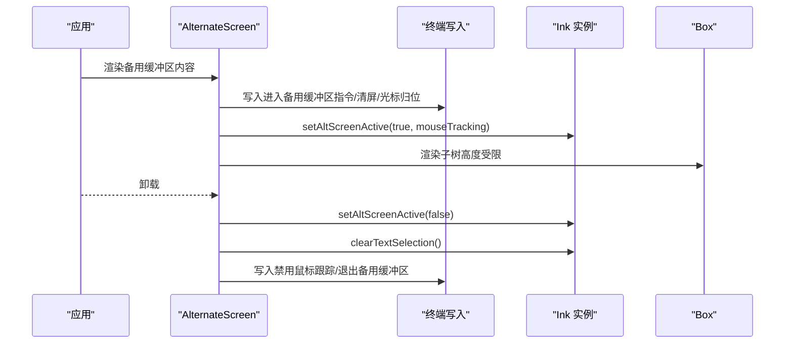
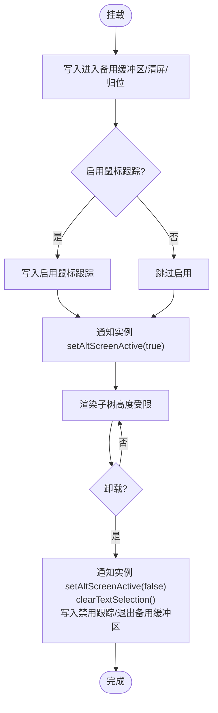
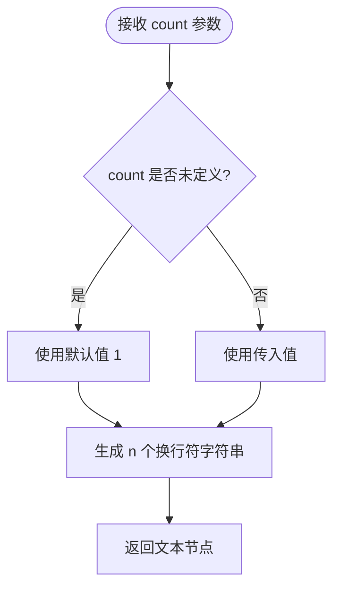
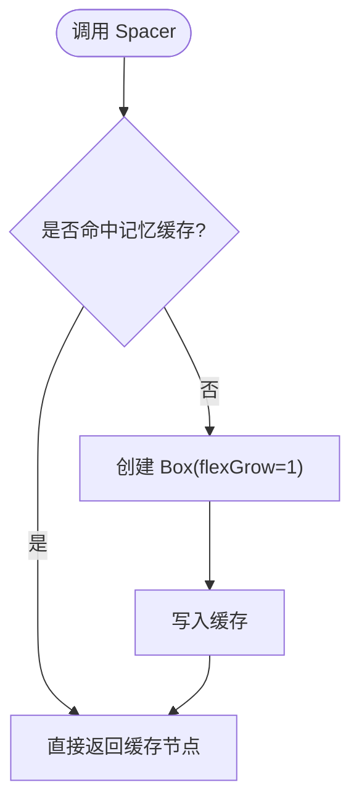
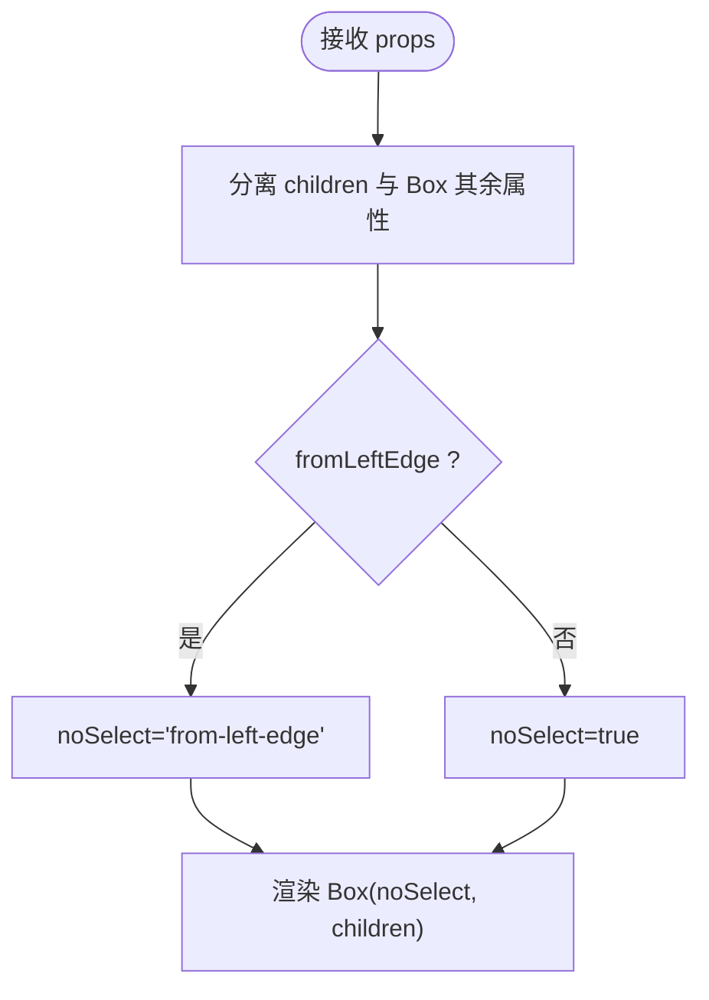
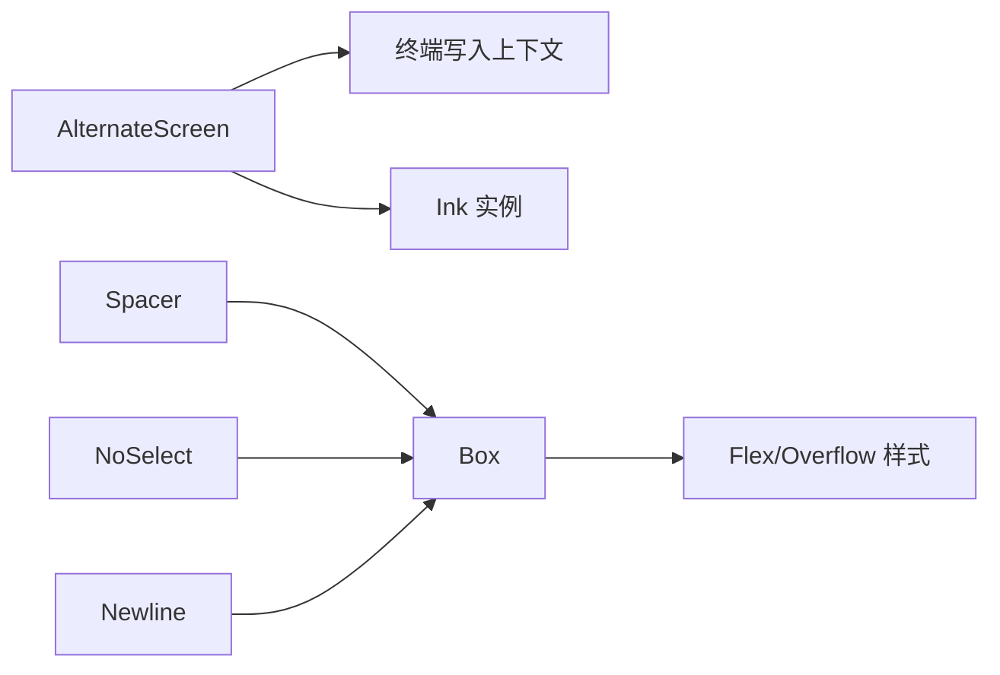

# 布局组件

<cite>
**本文档引用的文件**
- [AlternateScreen.tsx](file://src/ink/components/AlternateScreen.tsx)
- [Newline.tsx](file://src/ink/components/Newline.tsx)
- [Spacer.tsx](file://src/ink/components/Spacer.tsx)
- [NoSelect.tsx](file://src/ink/components/NoSelect.tsx)
- [Box.tsx](file://src/ink/components/Box.tsx)
- [FullscreenLayout.tsx](file://src/components/FullscreenLayout.tsx)
- [StructuredDiff.tsx](file://src/components/StructuredDiff.tsx)
</cite>

## 目录
1. [简介](#简介)
2. [项目结构](#项目结构)
3. [核心组件](#核心组件)
4. [架构总览](#架构总览)
5. [详细组件分析](#详细组件分析)
6. [依赖关系分析](#依赖关系分析)
7. [性能考量](#性能考量)
8. [故障排查指南](#故障排查指南)
9. [结论](#结论)
10. [附录](#附录)

## 简介
本文件聚焦 Ink 布局体系中的四个关键组件：AlternateScreen（交替屏幕）、Newline（换行）、Spacer（间隔）与 NoSelect（禁选）。它们分别负责全屏显示与窗口切换、文本换行与间距控制、空间留白与布局调整、以及选择禁用与焦点管理。文档将从代码实现、数据流、处理逻辑、集成点与错误处理等方面进行深入解析，并提供可复用的布局组合案例与设计模式。

## 项目结构
- 布局组件位于 Ink 子系统中，围绕终端渲染与交互展开：
  - AlternateScreen：进入/退出备用缓冲区，约束高度，启用/禁用鼠标跟踪，配合实例状态管理光标与选择。
  - Newline：在文本节点内插入指定数量的换行符，用于排版与间距控制。
  - Spacer：沿主轴扩展的弹性空白，常用于填充容器内可用空间。
  - NoSelect：标记区域为不可选择，避免在全屏选择时被包含，支持从左边缘扩展的排除区域。
  - Box：基础布局容器，提供 Flex 布局能力、焦点管理、键盘与鼠标事件钩子等。

图表来源
- [AlternateScreen.tsx:13-32](file://src/ink/components/AlternateScreen.tsx#L13-L32)
- [Newline.tsx:12-14](file://src/ink/components/Newline.tsx#L12-L14)
- [Spacer.tsx:5-8](file://src/ink/components/Spacer.tsx#L5-L8)
- [NoSelect.tsx:17-24](file://src/ink/components/NoSelect.tsx#L17-L24)
- [Box.tsx:48-50](file://src/ink/components/Box.tsx#L48-L50)

章节来源
- [AlternateScreen.tsx:1-80](file://src/ink/components/AlternateScreen.tsx#L1-L80)
- [Newline.tsx:1-39](file://src/ink/components/Newline.tsx#L1-L39)
- [Spacer.tsx:1-20](file://src/ink/components/Spacer.tsx#L1-L20)
- [NoSelect.tsx:1-68](file://src/ink/components/NoSelect.tsx#L1-L68)
- [Box.tsx:1-214](file://src/ink/components/Box.tsx#L1-L214)

## 核心组件
- AlternateScreen：在备用缓冲区内渲染子树，约束高度为终端行数，可选启用 SGR 鼠标跟踪；挂载时进入 alt 屏并通知渲染器保持光标在视口内，卸载时退出并清理选择与跟踪。
- Newline：在文本节点中插入 n 个换行符，需置于文本组件内部使用，用于段落分隔与行距控制。
- Spacer：通过 flexGrow: 1 快速填充主轴方向的剩余空间，是“占位留白”的轻量方案。
- NoSelect：将内容标记为不可选择，支持从左边缘扩展的排除区域，仅影响备用缓冲区内的选择行为。

章节来源
- [AlternateScreen.tsx:13-32](file://src/ink/components/AlternateScreen.tsx#L13-L32)
- [Newline.tsx:12-14](file://src/ink/components/Newline.tsx#L12-L14)
- [Spacer.tsx:5-8](file://src/ink/components/Spacer.tsx#L5-L8)
- [NoSelect.tsx:17-24](file://src/ink/components/NoSelect.tsx#L17-L24)

## 架构总览
AlternateScreen 将整个应用的渲染限定在备用缓冲区，确保全屏体验与稳定的高度约束；Box 提供 Flex 布局与事件能力；Newline 与 Spacer 负责文本与空间的细粒度控制；NoSelect 在全屏选择场景下屏蔽特定区域，提升复制粘贴的准确性。

图表来源
- [AlternateScreen.tsx:45-56](file://src/ink/components/AlternateScreen.tsx#L45-L56)

章节来源
- [AlternateScreen.tsx:33-79](file://src/ink/components/AlternateScreen.tsx#L33-L79)

## 详细组件分析

### AlternateScreen 组件
- 功能要点
  - 进入备用缓冲区：写入进入 alt 屏、清屏、光标归位。
  - 高度约束：根据终端行数限制自身高度，溢出需通过滚动或 Flex 布局处理。
  - 鼠标跟踪：可选启用 SGR 鼠标跟踪，事件映射为解析后的按键与选择状态更新。
  - 生命周期：挂载时设置实例状态，卸载时恢复主屏并清理选择与跟踪。
- 关键实现路径
  - 使用插入副作用在渲染阶段写入控制序列并注册清理函数。
  - 通过上下文获取终端尺寸，动态计算高度。
  - 通过实例状态通知渲染器维持光标位置与选择状态。

图表来源
- [AlternateScreen.tsx:45-56](file://src/ink/components/AlternateScreen.tsx#L45-L56)

章节来源
- [AlternateScreen.tsx:13-32](file://src/ink/components/AlternateScreen.tsx#L13-L32)
- [AlternateScreen.tsx:33-79](file://src/ink/components/AlternateScreen.tsx#L33-L79)

### Newline 组件
- 功能要点
  - 在文本节点中插入指定数量的换行符，默认为 1。
  - 必须嵌套在文本组件内部使用，适合段落分隔与行距控制。
- 关键实现路径
  - 计算重复次数并生成文本节点，缓存以减少重渲染。

图表来源
- [Newline.tsx:15-38](file://src/ink/components/Newline.tsx#L15-L38)

章节来源
- [Newline.tsx:1-39](file://src/ink/components/Newline.tsx#L1-L39)

### Spacer 组件
- 功能要点
  - 作为弹性空白，沿主轴自动填充剩余空间。
  - 是“占位留白”的轻量快捷方式，常用于两端对齐或底部吸附场景。
- 关键实现路径
  - 包装 Box 并设置 flexGrow: 1，利用记忆化缓存节点。

图表来源
- [Spacer.tsx:9-19](file://src/ink/components/Spacer.tsx#L9-L19)

章节来源
- [Spacer.tsx:1-20](file://src/ink/components/Spacer.tsx#L1-L20)

### NoSelect 组件
- 功能要点
  - 标记内容为不可选择，避免在全屏选择时被包含。
  - 支持 fromLeftEdge 扩展排除区域至右侧边缘，解决多行拖拽时前缀误选问题。
  - 仅影响备用缓冲区内的选择行为，主屏滚动回放使用终端原生选择。
- 关键实现路径
  - 透传除 noSelect 外的 Box 属性，内部设置 noSelect 标记。
  - 当 fromLeftEdge 为真时，使用特殊标记扩展排除范围。

图表来源
- [NoSelect.tsx:35-67](file://src/ink/components/NoSelect.tsx#L35-L67)

章节来源
- [NoSelect.tsx:1-68](file://src/ink/components/NoSelect.tsx#L1-L68)

### Box 基础容器
- 功能要点
  - 提供 Flex 布局能力（方向、伸缩、换行）与样式校验。
  - 支持焦点管理（tabIndex、autoFocus）与键盘/鼠标事件钩子。
  - 仅在备用缓冲区内启用鼠标事件（如点击、悬停），主屏滚动回放不生效。
- 关键实现路径
  - 对 margin/padding/gap 等整数性进行警告校验，防止小数导致布局漂移。
  - 合并 overflowX/Y 与 Flex 样式，统一输出到自定义标签。

章节来源
- [Box.tsx:11-46](file://src/ink/components/Box.tsx#L11-L46)
- [Box.tsx:106-127](file://src/ink/components/Box.tsx#L106-L127)
- [Box.tsx:166-189](file://src/ink/components/Box.tsx#L166-L189)
- [Box.tsx:190-212](file://src/ink/components/Box.tsx#L190-L212)

## 依赖关系分析
- AlternateScreen 依赖终端写入上下文与实例状态，确保进入/退出流程正确执行。
- Spacer 依赖 Box，通过 flexGrow: 1 实现弹性留白。
- NoSelect 依赖 Box 的 noSelect 能力，用于选择区域排除。
- Box 为通用布局容器，被上述组件广泛复用。

图表来源
- [AlternateScreen.tsx:40-41](file://src/ink/components/AlternateScreen.tsx#L40-L41)
- [Spacer.tsx](file://src/ink/components/Spacer.tsx#L3)
- [NoSelect.tsx](file://src/ink/components/NoSelect.tsx#L3)
- [Box.tsx:11-46](file://src/ink/components/Box.tsx#L11-L46)

章节来源
- [AlternateScreen.tsx:1-80](file://src/ink/components/AlternateScreen.tsx#L1-L80)
- [Spacer.tsx:1-20](file://src/ink/components/Spacer.tsx#L1-L20)
- [NoSelect.tsx:1-68](file://src/ink/components/NoSelect.tsx#L1-L68)
- [Box.tsx:1-214](file://src/ink/components/Box.tsx#L1-L214)

## 性能考量
- 缓存策略
  - AlternateScreen 使用插入副作用与清理函数，避免在卸载后残留状态。
  - Spacer 采用记忆化缓存节点，减少重复创建。
  - Newline 与 NoSelect 对重复计算结果进行缓存，降低渲染成本。
- 样式校验
  - Box 对 margin/padding/gap 进行整数性校验，避免浮点导致的布局抖动与重排。
- 高度约束
  - AlternateScreen 将自身高度约束为终端行数，避免不必要的滚动回溯与重绘。

章节来源
- [AlternateScreen.tsx:67-78](file://src/ink/components/AlternateScreen.tsx#L67-L78)
- [Spacer.tsx:10-18](file://src/ink/components/Spacer.tsx#L10-L18)
- [Newline.tsx:16-38](file://src/ink/components/Newline.tsx#L16-L38)
- [NoSelect.tsx:35-67](file://src/ink/components/NoSelect.tsx#L35-L67)
- [Box.tsx:110-127](file://src/ink/components/Box.tsx#L110-L127)

## 故障排查指南
- 全屏无响应或无法退出
  - 检查是否在备用缓冲区内渲染，确认 AlternateScreen 已挂载且未提前卸载。
  - 确认实例状态已设置为活动，并在卸载时清理了选择与跟踪。
- 鼠标事件无效
  - 确认已在备用缓冲区内启用鼠标跟踪，且事件监听仅在该环境下生效。
- 选择异常或误选前缀
  - 使用 NoSelect 包裹需要排除的区域，并在多行场景下开启 fromLeftEdge。
- 行距与换行错位
  - 确保 Newline 在文本组件内部使用，必要时结合 Box 的 gap 控制整体间距。

章节来源
- [AlternateScreen.tsx:20-31](file://src/ink/components/AlternateScreen.tsx#L20-L31)
- [Box.tsx:25-41](file://src/ink/components/Box.tsx#L25-L41)
- [NoSelect.tsx:31-33](file://src/ink/components/NoSelect.tsx#L31-L33)
- [Newline.tsx:12-14](file://src/ink/components/Newline.tsx#L12-L14)

## 结论
AlternateScreen、Newline、Spacer 与 NoSelect 四个组件共同构成了 Ink 终端布局的核心能力：全屏与窗口切换、文本换行与间距控制、空间留白与布局调整、以及选择禁用与焦点管理。通过合理的组合与配置，可以在终端界面中实现稳定、可控且易用的布局效果。建议在全屏场景优先使用 AlternateScreen，配合 Box 的 Flex 能力与 NoSelect 的选择排除，获得最佳的交互体验。

## 附录

### 布局组合与设计模式
- 全屏对话框布局
  - 使用 AlternateScreen 包裹根节点，内部以 Column 主轴布局，顶部使用 Spacer 填充上部空白，中部内容区使用 ScrollBox 或 Flex 容器承载，底部使用固定高度 Box。
  - 参考路径：[FullscreenLayout.tsx:338-446](file://src/components/FullscreenLayout.tsx#L338-L446)
- 代码差异展示
  - 使用 NoSelect 包裹左侧行号/符号列，右侧内容区为可选择文本，形成双栏布局。
  - 参考路径：[StructuredDiff.tsx:148-177](file://src/components/StructuredDiff.tsx#L148-L177)
- 文本段落与间距
  - 在文本段落之间插入多个 Newline，或在需要时使用 Box 的 gap 控制行距。
  - 参考路径：[Newline.tsx:12-14](file://src/ink/components/Newline.tsx#L12-L14)