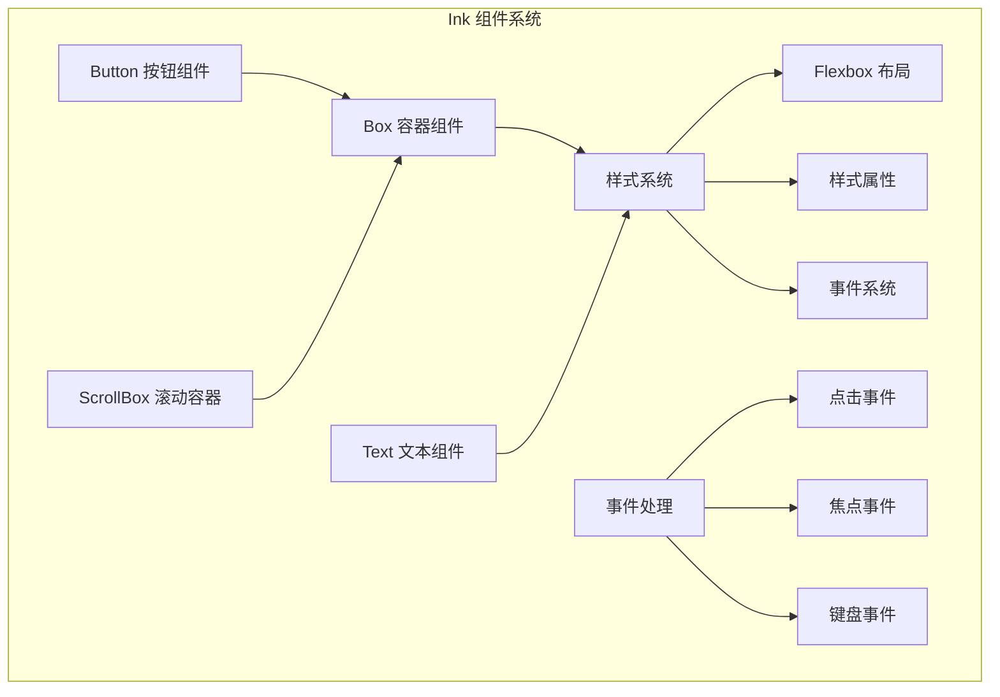
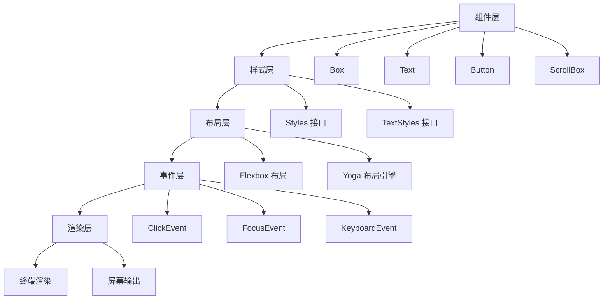
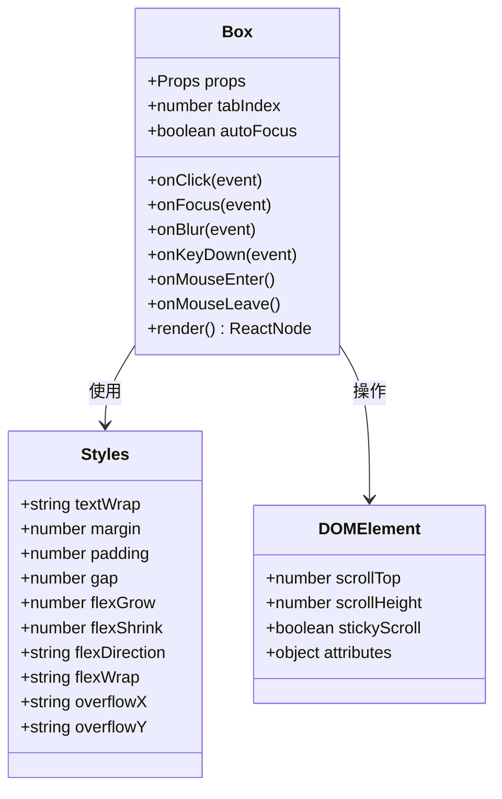
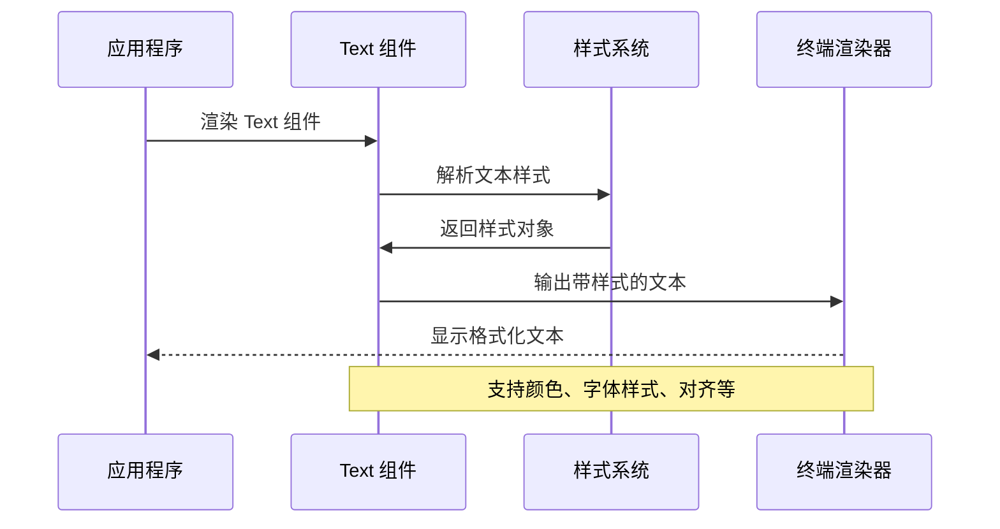
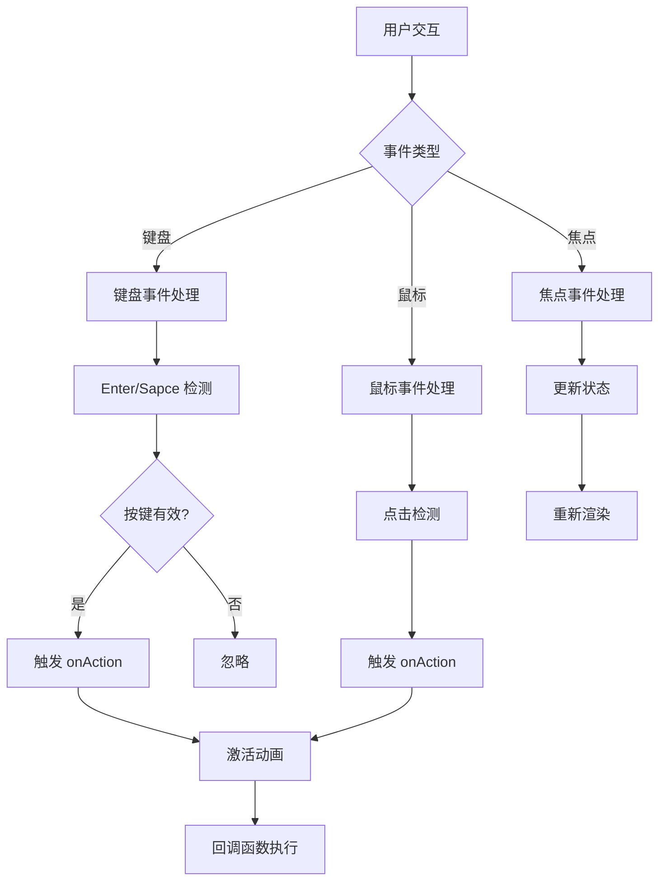
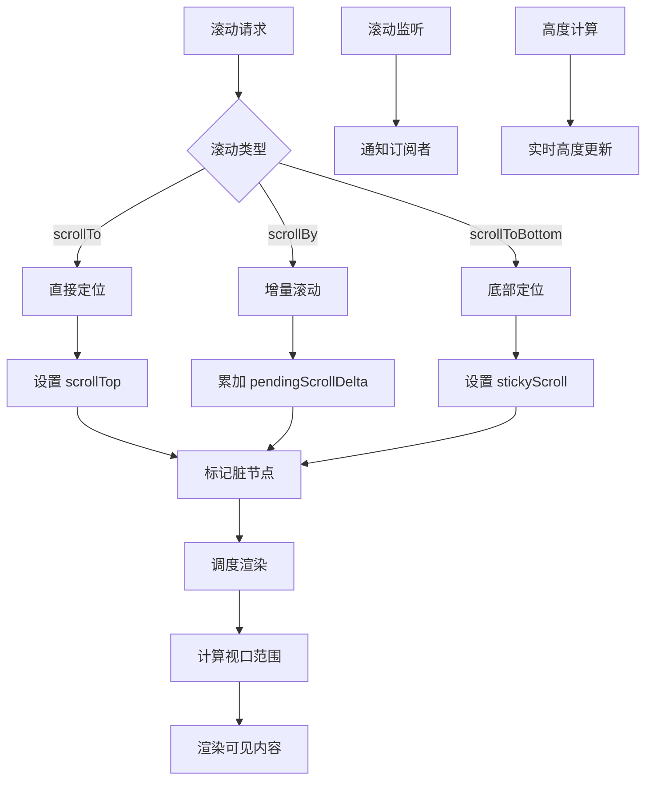
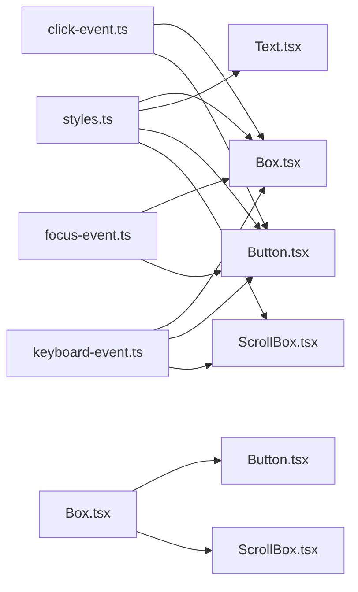

# 核心组件

<cite>
**本文档引用的文件**
- [Box.tsx](file://src/ink/components/Box.tsx)
- [Text.tsx](file://src/ink/components/Text.tsx)
- [Button.tsx](file://src/ink/components/Button.tsx)
- [ScrollBox.tsx](file://src/ink/components/ScrollBox.tsx)
- [styles.ts](file://src/ink/styles.ts)
- [click-event.ts](file://src/ink/events/click-event.ts)
- [focus-event.ts](file://src/ink/events/focus-event.ts)
- [keyboard-event.ts](file://src/ink/events/keyboard-event.ts)
</cite>

## 目录
1. [简介](#简介)
2. [项目结构](#项目结构)
3. [核心组件](#核心组件)
4. [架构概览](#架构概览)
5. [详细组件分析](#详细组件分析)
6. [依赖关系分析](#依赖关系分析)
7. [性能考虑](#性能考虑)
8. [故障排除指南](#故障排除指南)
9. [结论](#结论)

## 简介

Ink 是一个专为终端环境设计的 React 渲染引擎，提供了丰富的 UI 组件来构建命令行界面。本文档深入解析 Ink 的四个核心组件：Box 容器组件、Text 文本组件、Button 按钮组件和 ScrollBox 滚动容器组件。

这些组件基于 Flexbox 布局系统，支持完整的样式系统和事件处理机制，能够在终端环境中实现复杂的用户界面交互。每个组件都经过精心设计，既保持了 React 的开发体验，又充分利用了终端环境的特性。

## 项目结构

Ink 核心组件位于 `src/ink/components/` 目录下，采用模块化设计，每个组件都是独立的功能单元：

**图表来源**
- [Box.tsx:1-214](file://src/ink/components/Box.tsx#L1-L214)
- [Text.tsx:1-254](file://src/ink/components/Text.tsx#L1-L254)
- [Button.tsx:1-192](file://src/ink/components/Button.tsx#L1-L192)
- [ScrollBox.tsx:1-237](file://src/ink/components/ScrollBox.tsx#L1-L237)

**章节来源**
- [Box.tsx:1-214](file://src/ink/components/Box.tsx#L1-L214)
- [Text.tsx:1-254](file://src/ink/components/Text.tsx#L1-L254)
- [Button.tsx:1-192](file://src/ink/components/Button.tsx#L1-L192)
- [ScrollBox.tsx:1-237](file://src/ink/components/ScrollBox.tsx#L1-L237)

## 核心组件

### Box 容器组件

Box 是 Ink 的基础布局容器，类似于浏览器中的 `
` 元素。它提供了完整的 Flexbox 布局功能，支持所有常见的布局属性和样式设置。

**主要特性：**
- Flexbox 布局支持（flexDirection、flexGrow、flexShrink、flexWrap）
- 完整的边距和内边距系统
- 边框和背景色支持
- 事件处理能力（点击、焦点、键盘事件）
- 自动聚焦功能

**章节来源**
- [Box.tsx:48-50](file://src/ink/components/Box.tsx#L48-L50)
- [Box.tsx:11-46](file://src/ink/components/Box.tsx#L11-L46)

### Text 文本组件

Text 组件专门用于在终端中显示文本内容，支持丰富的文本样式和格式化选项。

**样式选项：**
- 颜色和背景色（支持 RGB、十六进制、ANSI 256 色彩）
- 字体样式（粗体、斜体、下划线、删除线）
- 文本对齐和换行控制
- 文本截断策略（开始、中间、结尾截断）

**章节来源**
- [Text.tsx:45-59](file://src/ink/components/Text.tsx#L45-L59)
- [Text.tsx:60-109](file://src/ink/components/Text.tsx#L60-L109)

### Button 按钮组件

Button 组件是一个高度可定制的交互式按钮，提供了完整的状态管理和事件处理机制。

**交互状态：**
- 焦点状态（focused）
- 悬停状态（hovered）  
- 激活状态（active）

**事件处理：**
- Enter 键激活
- Space 键激活
- 鼠标点击
- 焦点变化

**章节来源**
- [Button.tsx:10-14](file://src/ink/components/Button.tsx#L10-L14)
- [Button.tsx:39-186](file://src/ink/components/Button.tsx#L39-L186)

### ScrollBox 滚动容器

ScrollBox 是一个功能强大的滚动容器，专门为终端环境优化，支持虚拟滚动和高性能滚动操作。

**核心功能：**
- 虚拟滚动（仅渲染可见区域）
- 滚动位置控制（scrollTo、scrollBy、scrollToBottom）
- 滚动监听和回调机制
- 滚动粘性（stickyScroll）功能
- 实时滚动高度计算

**章节来源**
- [ScrollBox.tsx:72-81](file://src/ink/components/ScrollBox.tsx#L72-L81)
- [ScrollBox.tsx:10-62](file://src/ink/components/ScrollBox.tsx#L10-L62)

## 架构概览

Ink 组件系统采用分层架构设计，从底层的样式系统到顶层的组件接口：

**图表来源**
- [styles.ts:55-404](file://src/ink/styles.ts#L55-L404)
- [click-event.ts:10-38](file://src/ink/events/click-event.ts#L10-L38)
- [focus-event.ts:11-21](file://src/ink/events/focus-event.ts#L11-L21)
- [keyboard-event.ts:12-29](file://src/ink/events/keyboard-event.ts#L12-L29)

## 详细组件分析

### Box 组件深度分析

Box 组件是 Ink 的核心布局基础，实现了完整的 Flexbox 功能：

**图表来源**
- [Box.tsx:11-46](file://src/ink/components/Box.tsx#L11-L46)
- [styles.ts:55-404](file://src/ink/styles.ts#L55-L404)

**章节来源**
- [Box.tsx:51-212](file://src/ink/components/Box.tsx#L51-L212)

### Text 组件渲染机制

Text 组件采用了高效的渲染策略，支持多种文本格式化选项：

**图表来源**
- [Text.tsx:114-253](file://src/ink/components/Text.tsx#L114-L253)
- [styles.ts:44-53](file://src/ink/styles.ts#L44-L53)

**章节来源**
- [Text.tsx:114-253](file://src/ink/components/Text.tsx#L114-L253)

### Button 组件交互流程

Button 组件实现了完整的用户交互生命周期：

**图表来源**
- [Button.tsx:94-121](file://src/ink/components/Button.tsx#L94-L121)
- [Button.tsx:123-153](file://src/ink/components/Button.tsx#L123-L153)

**章节来源**
- [Button.tsx:39-186](file://src/ink/components/Button.tsx#L39-L186)

### ScrollBox 滚动控制算法

ScrollBox 实现了高效的虚拟滚动算法：

**图表来源**
- [ScrollBox.tsx:118-204](file://src/ink/components/ScrollBox.tsx#L118-L204)
- [ScrollBox.tsx:217-235](file://src/ink/components/ScrollBox.tsx#L217-L235)

**章节来源**
- [ScrollBox.tsx:82-236](file://src/ink/components/ScrollBox.tsx#L82-L236)

## 依赖关系分析

Ink 组件之间的依赖关系体现了清晰的分层架构：

**图表来源**
- [styles.ts:1-772](file://src/ink/styles.ts#L1-L772)
- [click-event.ts:1-39](file://src/ink/events/click-event.ts#L1-L39)
- [focus-event.ts:1-22](file://src/ink/events/focus-event.ts#L1-L22)
- [keyboard-event.ts:1-52](file://src/ink/events/keyboard-event.ts#L1-L52)

**章节来源**
- [Box.tsx:1-11](file://src/ink/components/Box.tsx#L1-L11)
- [Button.tsx:1-9](file://src/ink/components/Button.tsx#L1-L9)
- [ScrollBox.tsx:1-9](file://src/ink/components/ScrollBox.tsx#L1-L9)

## 性能考虑

Ink 组件在设计时充分考虑了性能优化：

### 渲染优化
- **虚拟滚动**：ScrollBox 仅渲染可见内容，大幅减少 DOM 操作
- **样式缓存**：Box 和 Text 组件使用记忆化避免重复计算
- **增量更新**：事件处理只更新必要的状态

### 内存管理
- **垃圾回收友好**：组件设计避免内存泄漏
- **事件清理**：自动清理不再使用的事件监听器

### 性能监控
- **滚动活动检测**：自动调整后台任务优先级
- **渲染节流**：防止过度频繁的重渲染

## 故障排除指南

### 常见问题及解决方案

**问题 1：组件不响应事件**
- 检查是否在 `<AlternateScreen>` 中使用鼠标事件
- 确认元素具有有效的 `tabIndex`
- 验证事件处理器正确绑定

**问题 2：滚动功能异常**
- 确保 ScrollBox 包含在全屏布局中
- 检查内容高度是否正确计算
- 验证滚动属性设置

**问题 3：样式不生效**
- 确认样式值为整数（终端环境限制）
- 检查样式优先级和继承关系
- 验证颜色值格式正确

**章节来源**
- [Box.tsx:110-127](file://src/ink/components/Box.tsx#L110-L127)
- [ScrollBox.tsx:103-117](file://src/ink/components/ScrollBox.tsx#L103-L117)

## 结论

Ink 的核心组件系统展现了现代前端框架在终端环境中的创新应用。通过精心设计的组件架构、高效的渲染机制和完善的事件处理系统，Ink 为开发者提供了构建复杂命令行界面的强大工具。

四个核心组件各司其职：Box 提供基础布局能力，Text 实现丰富的文本渲染，Button 支持完整的交互状态，ScrollBox 则解决了终端环境下的滚动难题。它们共同构成了 Ink 强大而灵活的组件生态系统。

随着终端应用需求的不断增长，Ink 的设计理念和技术实现为未来的命令行界面开发奠定了坚实的基础。开发者可以基于这些组件快速构建专业级的终端应用程序，享受 React 开发体验的同时，充分利用终端环境的独特优势。