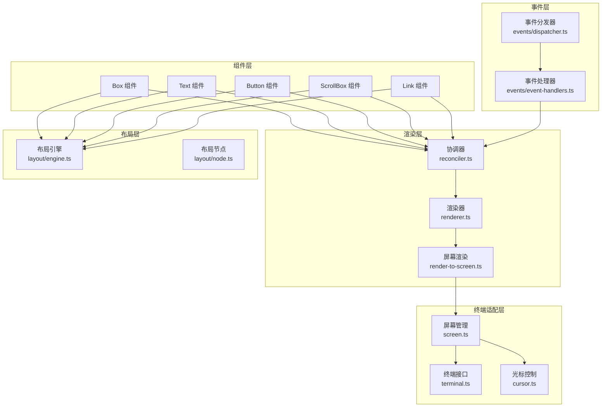
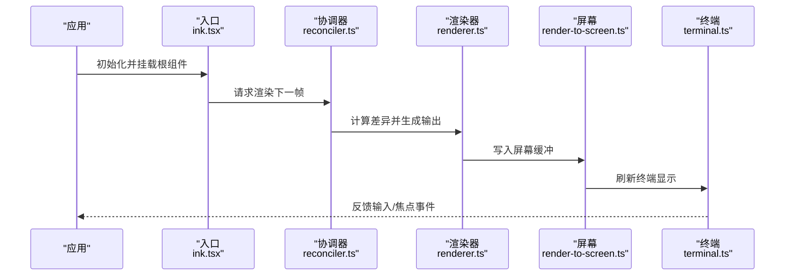
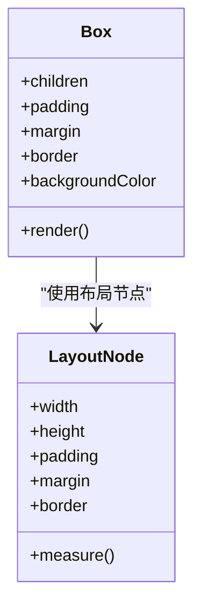
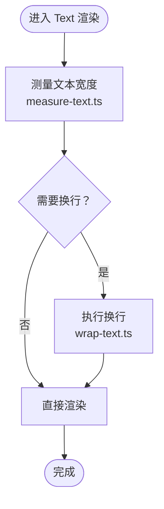
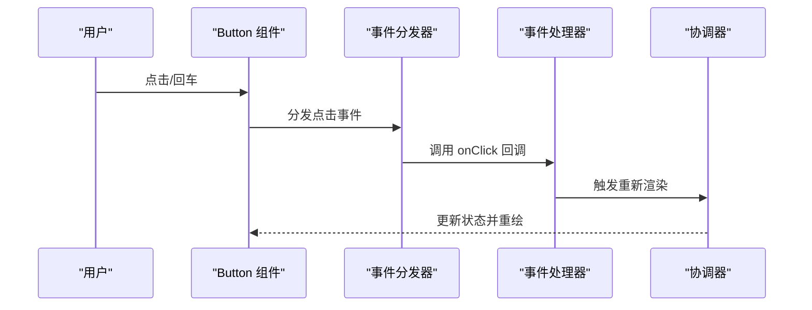
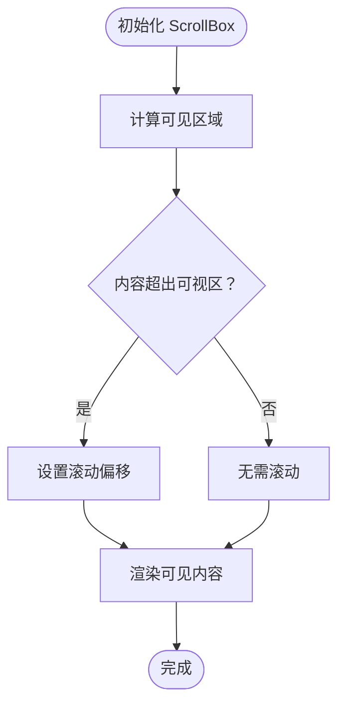
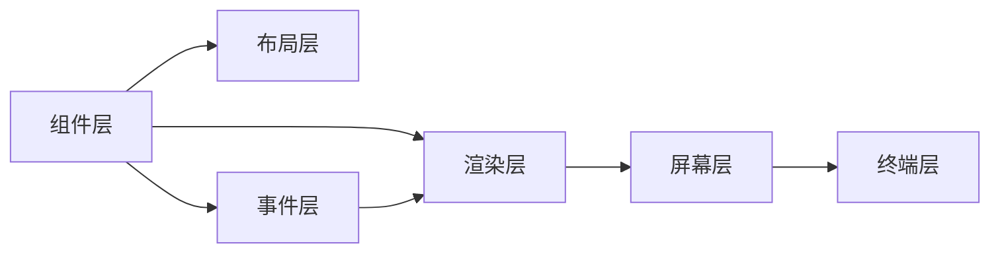

# 终端组件系统

<cite>
**本文档引用的文件**
- [src/ink/ink.tsx](file://src/ink/ink.tsx)
- [src/ink/components/Box.tsx](file://src/ink/components/Box.tsx)
- [src/ink/components/Text.tsx](file://src/ink/components/Text.tsx)
- [src/ink/components/Button.tsx](file://src/ink/components/Button.tsx)
- [src/ink/components/ScrollBox.tsx](file://src/ink/components/ScrollBox.tsx)
- [src/ink/components/Link.tsx](file://src/ink/components/Link.tsx)
- [src/ink/renderer.ts](file://src/ink/renderer.ts)
- [src/ink/reconciler.ts](file://src/ink/reconciler.ts)
- [src/ink/render-to-screen.ts](file://src/ink/render-to-screen.ts)
- [src/ink/layout/engine.ts](file://src/ink/layout/engine.ts)
- [src/ink/layout/node.ts](file://src/ink/layout/node.ts)
- [src/ink/events/dispatcher.ts](file://src/ink/events/dispatcher.ts)
- [src/ink/events/event-handlers.ts](file://src/ink/events/event-handlers.ts)
- [src/ink/hooks/use-app.ts](file://src/ink/hooks/use-app.ts)
- [src/ink/hooks/use-input.ts](file://src/ink/hooks/use-input.ts)
- [src/ink/hooks/use-terminal-focus.ts](file://src/ink/hooks/use-terminal-focus.ts)
- [src/ink/hooks/use-terminal-viewport.ts](file://src/ink/hooks/use-terminal-viewport.ts)
- [src/ink/terminal-focus-state.ts](file://src/ink/terminal-focus-state.ts)
- [src/ink/parse-keypress.ts](file://src/ink/parse-keypress.ts)
- [src/ink/screen.ts](file://src/ink/screen.ts)
- [src/ink/cursor.ts](file://src/ink/cursor.ts)
- [src/ink/styles.ts](file://src/ink/styles.ts)
- [src/ink/dom.ts](file://src/ink/dom.ts)
</cite>

## 目录
1. [简介](#简介)
2. [项目结构](#项目结构)
3. [核心组件](#核心组件)
4. [架构总览](#架构总览)
5. [详细组件分析](#详细组件分析)
6. [依赖关系分析](#依赖关系分析)
7. [性能考虑](#性能考虑)
8. [故障排除指南](#故障排除指南)
9. [结论](#结论)

## 简介
本文件面向 Ink 终端 UI 框架的组件系统，系统性阐述终端组件的基本概念与架构设计，涵盖组件树结构、属性传递、生命周期管理、渲染机制、事件处理与状态管理，并深入解析核心组件（Box 容器、Text 文本、Button 按钮、ScrollBox 滚动容器、Link 链接）的使用方法、属性配置与样式定制。同时提供组件组合模式与最佳实践，帮助开发者构建复杂而高效的终端界面布局。

## 项目结构
Ink 的组件系统围绕 React 风格的组件模型在终端环境中实现，通过自定义渲染器将虚拟节点树转换为 ANSI 输出。关键模块包括：
- 组件层：核心 UI 组件（Box、Text、Button、ScrollBox、Link 等）
- 渲染层：协调器（reconciler）与渲染器（renderer），负责组件树对比与输出生成
- 布局层：基于 Yoga 的布局引擎，计算节点几何信息
- 事件层：键盘、鼠标、焦点等事件分发与处理器
- 终端适配层：光标控制、屏幕刷新、ANSI 转义序列处理



图表来源
- [src/ink/components/Box.tsx](file://src/ink/components/Box.tsx)
- [src/ink/components/Text.tsx](file://src/ink/components/Text.tsx)
- [src/ink/components/Button.tsx](file://src/ink/components/Button.tsx)
- [src/ink/components/ScrollBox.tsx](file://src/ink/components/ScrollBox.tsx)
- [src/ink/components/Link.tsx](file://src/ink/components/Link.tsx)
- [src/ink/reconciler.ts](file://src/ink/reconciler.ts)
- [src/ink/renderer.ts](file://src/ink/renderer.ts)
- [src/ink/render-to-screen.ts](file://src/ink/render-to-screen.ts)
- [src/ink/layout/engine.ts](file://src/ink/layout/engine.ts)
- [src/ink/layout/node.ts](file://src/ink/layout/node.ts)
- [src/ink/events/dispatcher.ts](file://src/ink/events/dispatcher.ts)
- [src/ink/events/event-handlers.ts](file://src/ink/events/event-handlers.ts)
- [src/ink/screen.ts](file://src/ink/screen.ts)
- [src/ink/terminal.ts](file://src/ink/terminal.ts)
- [src/ink/cursor.ts](file://src/ink/cursor.ts)

章节来源
- [src/ink/ink.tsx](file://src/ink/ink.tsx)
- [src/ink/components/Box.tsx](file://src/ink/components/Box.tsx)
- [src/ink/components/Text.tsx](file://src/ink/components/Text.tsx)
- [src/ink/components/Button.tsx](file://src/ink/components/Button.tsx)
- [src/ink/components/ScrollBox.tsx](file://src/ink/components/ScrollBox.tsx)
- [src/ink/components/Link.tsx](file://src/ink/components/Link.tsx)

## 核心组件
本节概述核心组件及其职责：
- Box：容器组件，用于布局与样式包装，支持边框、内边距、外边距、背景色等
- Text：文本组件，负责渲染纯文本或带样式的文本片段
- Button：交互组件，提供点击回调与可选的禁用状态
- ScrollBox：滚动容器，支持垂直滚动与内容裁剪
- Link：超链接组件，支持终端内跳转与点击行为

章节来源
- [src/ink/components/Box.tsx](file://src/ink/components/Box.tsx)
- [src/ink/components/Text.tsx](file://src/ink/components/Text.tsx)
- [src/ink/components/Button.tsx](file://src/ink/components/Button.tsx)
- [src/ink/components/ScrollBox.tsx](file://src/ink/components/ScrollBox.tsx)
- [src/ink/components/Link.tsx](file://src/ink/components/Link.tsx)

## 架构总览
Ink 的运行时由入口模块启动，协调器对组件树进行差异计算，渲染器生成输出，最终写入屏幕并控制光标。事件系统监听输入并驱动状态更新，布局引擎确保组件几何正确。



图表来源
- [src/ink/ink.tsx](file://src/ink/ink.tsx)
- [src/ink/reconciler.ts](file://src/ink/reconciler.ts)
- [src/ink/renderer.ts](file://src/ink/renderer.ts)
- [src/ink/render-to-screen.ts](file://src/ink/render-to-screen.ts)
- [src/ink/terminal.ts](file://src/ink/terminal.ts)

## 详细组件分析

### Box 容器组件
Box 是布局与样式的基础容器，常用于组织子元素、设置间距与边框。其典型职责包括：
- 接收子节点并进行布局计算
- 应用内边距、外边距、边框样式
- 控制内容溢出与尺寸约束



图表来源
- [src/ink/components/Box.tsx](file://src/ink/components/Box.tsx)
- [src/ink/layout/node.ts](file://src/ink/layout/node.ts)

章节来源
- [src/ink/components/Box.tsx](file://src/ink/components/Box.tsx)
- [src/ink/layout/engine.ts](file://src/ink/layout/engine.ts)
- [src/ink/layout/node.ts](file://src/ink/layout/node.ts)

### Text 文本组件
Text 组件负责渲染文本内容，支持样式与换行处理：
- 文本测量与宽度计算
- 自动换行与 ANSI 序列处理
- 与布局引擎协作确定尺寸



图表来源
- [src/ink/components/Text.tsx](file://src/ink/components/Text.tsx)
- [src/ink/measure-text.ts](file://src/ink/measure-text.ts)
- [src/ink/wrap-text.ts](file://src/ink/wrap-text.ts)

章节来源
- [src/ink/components/Text.tsx](file://src/ink/components/Text.tsx)
- [src/ink/measure-text.ts](file://src/ink/measure-text.ts)
- [src/ink/wrap-text.ts](file://src/ink/wrap-text.ts)

### Button 按钮组件
Button 提供交互能力，包含事件处理与状态反馈：
- 注册点击事件处理器
- 处理焦点状态与高亮
- 触发回调并更新组件状态



图表来源
- [src/ink/components/Button.tsx](file://src/ink/components/Button.tsx)
- [src/ink/events/dispatcher.ts](file://src/ink/events/dispatcher.ts)
- [src/ink/events/event-handlers.ts](file://src/ink/events/event-handlers.ts)
- [src/ink/reconciler.ts](file://src/ink/reconciler.ts)

章节来源
- [src/ink/components/Button.tsx](file://src/ink/components/Button.tsx)
- [src/ink/events/dispatcher.ts](file://src/ink/events/dispatcher.ts)
- [src/ink/events/event-handlers.ts](file://src/ink/events/event-handlers.ts)
- [src/ink/reconciler.ts](file://src/ink/reconciler.ts)

### ScrollBox 滚动容器
ScrollBox 提供滚动视图，适合长列表或日志输出：
- 计算可见区域与滚动偏移
- 裁剪不可见内容
- 支持键盘/鼠标滚动事件



图表来源
- [src/ink/components/ScrollBox.tsx](file://src/ink/components/ScrollBox.tsx)
- [src/ink/layout/engine.ts](file://src/ink/layout/engine.ts)

章节来源
- [src/ink/components/ScrollBox.tsx](file://src/ink/components/ScrollBox.tsx)
- [src/ink/layout/engine.ts](file://src/ink/layout/engine.ts)

### Link 链接组件
Link 组件支持在终端中创建可点击的超链接：
- 解析链接目标与样式
- 处理点击事件与打开行为
- 与终端超链接协议集成

```mermaid
sequenceDiagram
participant User as "用户"
participant Link as "Link 组件"
participant Parser as "按键解析<br/>parse-keypress.ts"
participant Screen as "屏幕<br/>screen.ts"
User->>Link : 点击/激活
Link->>Parser : 解析按键动作
Parser-->>Link : 返回操作类型
Link->>Screen : 执行打开/导航
Screen-->>User : 打开外部资源
```

图表来源
- [src/ink/components/Link.tsx](file://src/ink/components/Link.tsx)
- [src/ink/parse-keypress.ts](file://src/ink/parse-keypress.ts)
- [src/ink/screen.ts](file://src/ink/screen.ts)

章节来源
- [src/ink/components/Link.tsx](file://src/ink/components/Link.tsx)
- [src/ink/parse-keypress.ts](file://src/ink/parse-keypress.ts)
- [src/ink/screen.ts](file://src/ink/screen.ts)

## 依赖关系分析
组件系统内部依赖清晰，层次分明：
- 组件依赖布局引擎进行尺寸与位置计算
- 渲染器依赖协调器提供的差异结果
- 屏幕层依赖终端接口与光标控制
- 事件系统贯穿输入到渲染的全链路



图表来源
- [src/ink/layout/engine.ts](file://src/ink/layout/engine.ts)
- [src/ink/events/dispatcher.ts](file://src/ink/events/dispatcher.ts)
- [src/ink/renderer.ts](file://src/ink/renderer.ts)
- [src/ink/render-to-screen.ts](file://src/ink/render-to-screen.ts)
- [src/ink/terminal.ts](file://src/ink/terminal.ts)

章节来源
- [src/ink/layout/engine.ts](file://src/ink/layout/engine.ts)
- [src/ink/events/dispatcher.ts](file://src/ink/events/dispatcher.ts)
- [src/ink/renderer.ts](file://src/ink/renderer.ts)
- [src/ink/render-to-screen.ts](file://src/ink/render-to-screen.ts)
- [src/ink/terminal.ts](file://src/ink/terminal.ts)

## 性能考虑
- 布局缓存：利用节点缓存与行宽缓存减少重复计算
- 差异最小化：协调器仅重绘变更部分，避免整屏重绘
- 屏幕刷新优化：批量写入与增量更新，降低终端闪烁
- 文本测量：按需测量与缓存，避免频繁 ANSI 序列计算
- 事件节流：输入事件合并与去抖，提升响应流畅度

## 故障排除指南
- 渲染异常：检查组件树是否包含非法属性或循环依赖；确认布局参数（如固定宽高）是否合理
- 事件无响应：验证事件分发器是否正确注册；确认事件处理器绑定与回调签名一致
- 光标错位：核对光标声明与屏幕坐标；确保在渲染前后正确恢复光标状态
- 滚动异常：检查 ScrollBox 的高度与内容高度；确认滚动偏移未越界
- 超链接失效：确认终端支持超链接协议；检查链接目标格式与权限

章节来源
- [src/ink/terminal-focus-state.ts](file://src/ink/terminal-focus-state.ts)
- [src/ink/cursor.ts](file://src/ink/cursor.ts)
- [src/ink/events/dispatcher.ts](file://src/ink/events/dispatcher.ts)
- [src/ink/events/event-handlers.ts](file://src/ink/events/event-handlers.ts)

## 结论
Ink 终端 UI 框架通过清晰的组件层、布局层与渲染层分离，实现了在终端环境中的高效 UI 构建。核心组件（Box、Text、Button、ScrollBox、Link）覆盖了常见的布局与交互需求，配合事件系统与终端适配层，能够构建从简单工具到复杂交互式界面的多种场景。遵循本文档的组件使用方法、属性配置与最佳实践，可显著提升开发效率与用户体验。