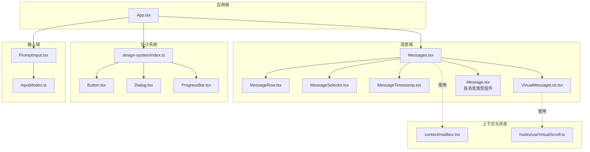
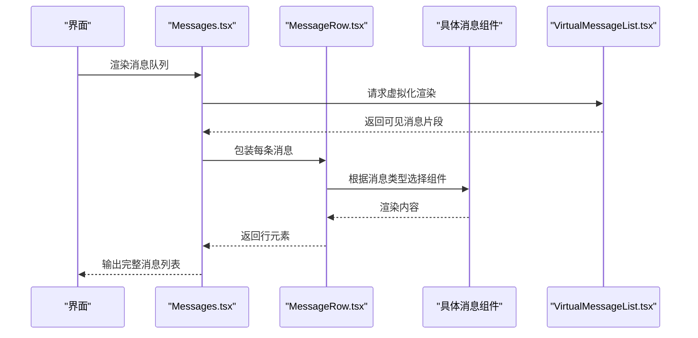
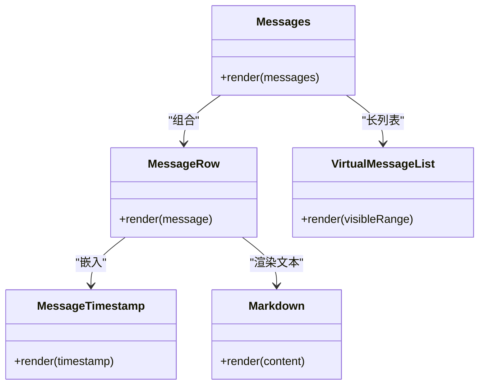
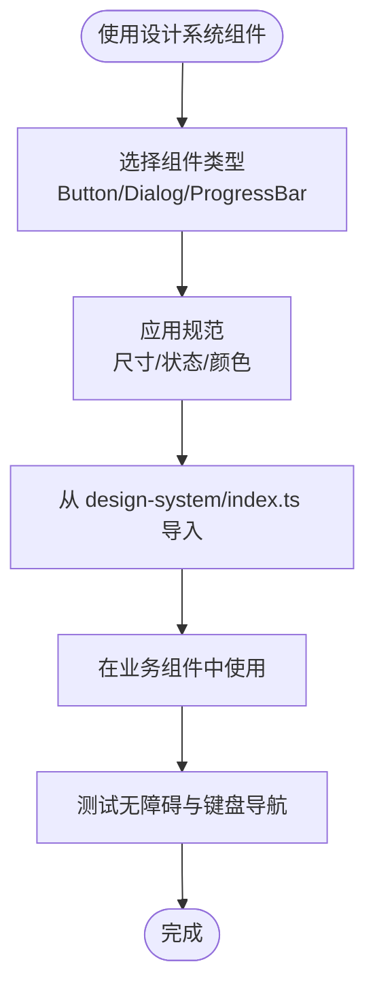
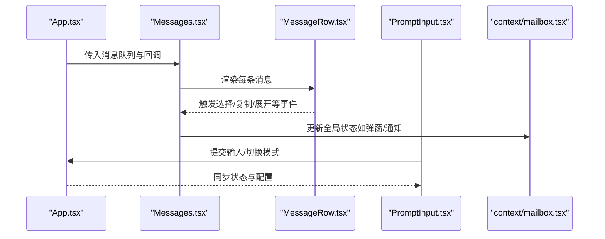
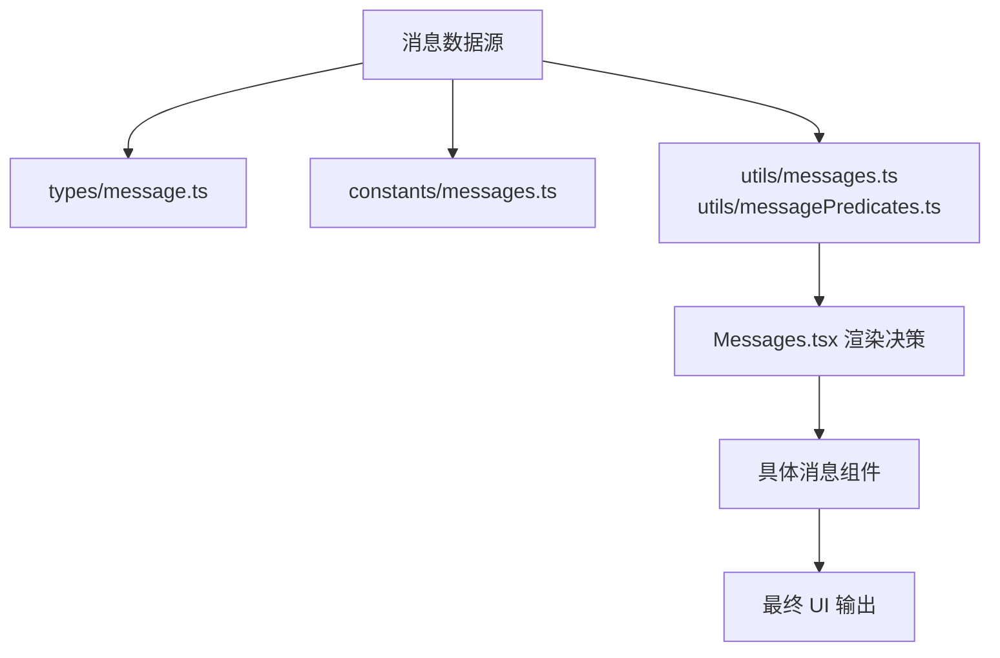
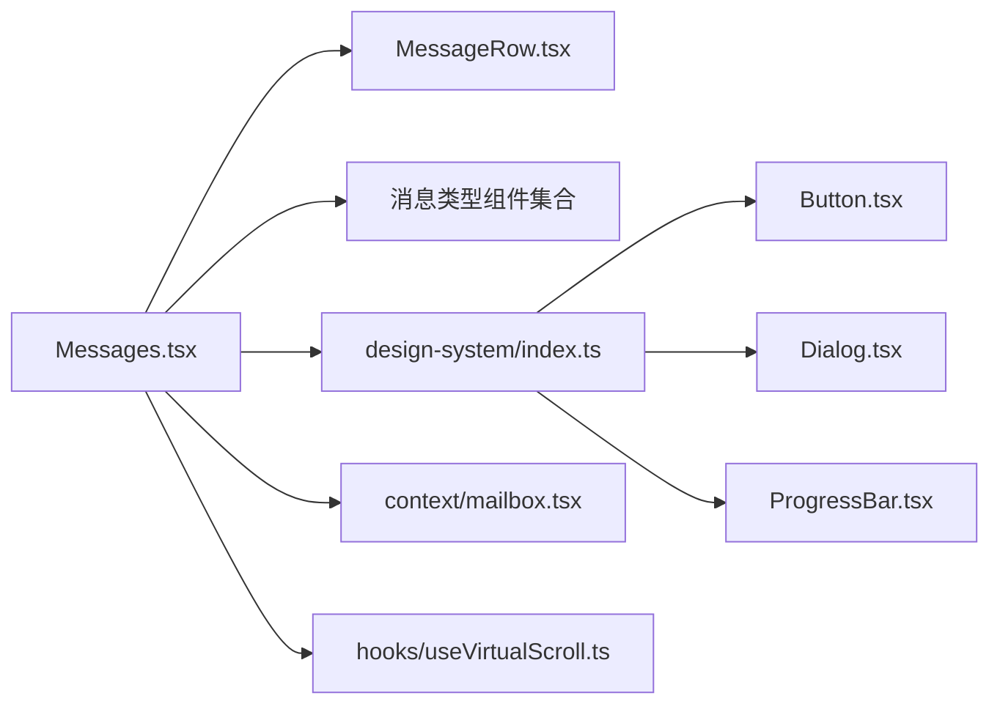

# React 组件架构

<cite>
**本文引用的文件**
- [App.tsx](file://src/components/App.tsx)
- [Messages.tsx](file://src/components/Messages.tsx)
- [Message.tsx](file://src/components/Message.tsx)
- [MessageRow.tsx](file://src/components/MessageRow.tsx)
- [MessageSelector.tsx](file://src/components/MessageSelector.tsx)
- [MessageTimestamp.tsx](file://src/components/MessageTimestamp.tsx)
- [VirtualMessageList.tsx](file://src/components/VirtualMessageList.tsx)
- [Markdown.tsx](file://src/components/Markdown.tsx)
- [design-system/Button.tsx](file://src/components/design-system/Button.tsx)
- [design-system/Dialog.tsx](file://src/components/design-system/Dialog.tsx)
- [design-system/ProgressBar.tsx](file://src/components/design-system/ProgressBar.tsx)
- [design-system/index.ts](file://src/components/design-system/index.ts)
- [PromptInput/PromptInput.tsx](file://src/components/PromptInput/PromptInput.tsx)
- [PromptInput/inputModes.ts](file://src/components/PromptInput/inputModes.ts)
- [hooks/useVirtualScroll.ts](file://src/hooks/useVirtualScroll.ts)
- [context/mailbox.tsx](file://src/context/mailbox.tsx)
- [types/message.ts](file://src/types/message.ts)
- [constants/messages.ts](file://src/constants/messages.ts)
- [utils/messages.ts](file://src/utils/messages.ts)
- [utils/messagePredicates.ts](file://src/utils/messagePredicates.ts)
- [components/migrations/migrateLegacyOpusToCurrent.ts](file://src/migrations/migrateLegacyOpusToCurrent.ts)
</cite>

## 目录
1. [引言](#引言)
2. [项目结构](#项目结构)
3. [核心组件](#核心组件)
4. [架构总览](#架构总览)
5. [组件详细分析](#组件详细分析)
6. [依赖关系分析](#依赖关系分析)
7. [性能考量](#性能考量)
8. [故障排查指南](#故障排查指南)
9. [结论](#结论)
10. [附录](#附录)

## 引言
本文件系统性梳理 Claude Code 的 React 组件架构与设计原则，重点覆盖以下方面：
- 组件层次结构与职责边界
- 状态管理与数据流设计（上下文、选择器、全局状态）
- 消息组件体系：用户消息、助手消息、工具使用消息等的渲染与交互
- 设计系统组件：按钮、对话框、进度条等基础 UI 的规范与用法
- 组件间通信机制、props 传递模式与事件处理
- 复用策略、性能优化技巧与最佳实践
- 无障碍访问与响应式设计考虑

## 项目结构
项目采用“按功能域分层 + 组件模块化”的组织方式：
- 根组件与入口：App.tsx 作为应用根节点，承载顶层布局与路由/视图切换
- 消息域：messages 子目录下包含多种消息类型组件，统一由 Messages.tsx 聚合渲染
- 设计系统：design-system 提供通用 UI 基础组件与导出索引
- 输入域：PromptInput 提供输入框、历史搜索、语音指示等能力
- 上下文与状态：context 提供通知、弹窗、邮箱等上下文；state/store 提供全局状态与选择器
- 工具与常量：utils 与 constants 提供消息处理、类型定义与行为常量

图表来源
- [App.tsx](file://src/components/App.tsx)
- [Messages.tsx](file://src/components/Messages.tsx)
- [MessageRow.tsx](file://src/components/MessageRow.tsx)
- [MessageSelector.tsx](file://src/components/MessageSelector.tsx)
- [MessageTimestamp.tsx](file://src/components/MessageTimestamp.tsx)
- [VirtualMessageList.tsx](file://src/components/VirtualMessageList.tsx)
- [design-system/index.ts](file://src/components/design-system/index.ts)
- [design-system/Button.tsx](file://src/components/design-system/Button.tsx)
- [design-system/Dialog.tsx](file://src/components/design-system/Dialog.tsx)
- [design-system/ProgressBar.tsx](file://src/components/design-system/ProgressBar.tsx)
- [PromptInput/PromptInput.tsx](file://src/components/PromptInput/PromptInput.tsx)
- [context/mailbox.tsx](file://src/context/mailbox.tsx)
- [hooks/useVirtualScroll.ts](file://src/hooks/useVirtualScroll.ts)

章节来源
- [App.tsx](file://src/components/App.tsx)
- [Messages.tsx](file://src/components/Messages.tsx)
- [design-system/index.ts](file://src/components/design-system/index.ts)

## 核心组件
- 应用根组件 App.tsx：负责整体布局、主题、路由与顶层容器
- 消息聚合器 Messages.tsx：根据消息队列与类型选择对应子组件进行渲染
- 消息行组件 MessageRow.tsx：单条消息的外层容器与样式包装
- 消息选择器 MessageSelector.tsx：用于消息范围选择与多选交互
- 时间戳 MessageTimestamp.tsx：消息时间显示与格式化
- 虚拟列表 VirtualMessageList.tsx：基于 useVirtualScroll 的高性能滚动渲染
- 设计系统组件：Button、Dialog、ProgressBar 等通过 index.ts 导出统一使用
- 输入组件 PromptInput.tsx：结合 inputModes.ts 定义不同输入模式与行为

章节来源
- [App.tsx](file://src/components/App.tsx)
- [Messages.tsx](file://src/components/Messages.tsx)
- [MessageRow.tsx](file://src/components/MessageRow.tsx)
- [MessageSelector.tsx](file://src/components/MessageSelector.tsx)
- [MessageTimestamp.tsx](file://src/components/MessageTimestamp.tsx)
- [VirtualMessageList.tsx](file://src/components/VirtualMessageList.tsx)
- [design-system/index.ts](file://src/components/design-system/index.ts)
- [PromptInput/PromptInput.tsx](file://src/components/PromptInput/PromptInput.tsx)
- [PromptInput/inputModes.ts](file://src/components/PromptInput/inputModes.ts)
- [hooks/useVirtualScroll.ts](file://src/hooks/useVirtualScroll.ts)

## 架构总览
消息系统采用“类型驱动 + 聚合渲染”的架构模式：
- 类型驱动：通过消息类型枚举与谓词判断，决定具体渲染组件
- 聚合渲染：Messages.tsx 作为中枢，按序遍历消息队列，调用对应消息组件
- 行级封装：MessageRow.tsx 提供统一的边距、对齐与交互包装
- 性能优先：VirtualMessageList.tsx 结合 useVirtualScroll 实现长列表虚拟化
- 可扩展：新增消息类型只需在消息目录添加组件并在聚合器中注册映射

图表来源
- [Messages.tsx](file://src/components/Messages.tsx)
- [MessageRow.tsx](file://src/components/MessageRow.tsx)
- [VirtualMessageList.tsx](file://src/components/VirtualMessageList.tsx)

## 组件详细分析

### 消息组件系统
消息组件体系以“类型即契约”为核心设计原则，确保渲染与交互的一致性。

- 用户消息族
  - 用户文本消息、用户计划消息、用户跨会话消息、用户图像消息等
  - 共同点：左侧对齐、强调用户视角、可选附件与操作区
- 助手消息族
  - 助手文本消息、助手思考消息、助手工具使用消息、系统文本消息等
  - 共同点：右侧对齐、强调模型输出、支持 Markdown 渲染与工具调用展示
- 工具使用消息族
  - 工具调用开始、执行中、成功、失败、被拒绝等状态
  - 共同点：工具图标、名称、参数摘要、结果展示或错误提示
- 特殊消息族
  - 关闭/重启提示、速率限制提示、内存占用提示、思维折叠边界等
  - 共同点：语义化标签、上下文提示与引导操作

图表来源
- [Messages.tsx](file://src/components/Messages.tsx)
- [MessageRow.tsx](file://src/components/MessageRow.tsx)
- [MessageTimestamp.tsx](file://src/components/MessageTimestamp.tsx)
- [VirtualMessageList.tsx](file://src/components/VirtualMessageList.tsx)
- [Markdown.tsx](file://src/components/Markdown.tsx)

章节来源
- [Messages.tsx](file://src/components/Messages.tsx)
- [MessageRow.tsx](file://src/components/MessageRow.tsx)
- [MessageTimestamp.tsx](file://src/components/MessageTimestamp.tsx)
- [VirtualMessageList.tsx](file://src/components/VirtualMessageList.tsx)
- [Markdown.tsx](file://src/components/Markdown.tsx)

### 设计系统组件
设计系统提供统一的视觉与交互规范，确保跨页面一致性。

- Button（按钮）
  - 规范：主次按钮、尺寸、禁用态、加载态、图标按钮
  - 用法：通过 design-system/index.ts 导出统一引入，避免重复样式
- Dialog（对话框）
  - 规范：标题、内容、操作区、遮罩层、键盘交互、焦点管理
  - 用法：配合 context/modalContext 或 overlayContext 控制显隐
- ProgressBar（进度条）
  - 规范：进度值、状态色、动画、文案
  - 用法：在长时间任务或加载场景中提供反馈

图表来源
- [design-system/index.ts](file://src/components/design-system/index.ts)
- [design-system/Button.tsx](file://src/components/design-system/Button.tsx)
- [design-system/Dialog.tsx](file://src/components/design-system/Dialog.tsx)
- [design-system/ProgressBar.tsx](file://src/components/design-system/ProgressBar.tsx)

章节来源
- [design-system/index.ts](file://src/components/design-system/index.ts)
- [design-system/Button.tsx](file://src/components/design-system/Button.tsx)
- [design-system/Dialog.tsx](file://src/components/design-system/Dialog.tsx)
- [design-system/ProgressBar.tsx](file://src/components/design-system/ProgressBar.tsx)

### 组件间通信与事件处理
- Props 传递模式
  - 自顶向下：App.tsx 将全局状态与回调传入 Messages.tsx
  - 单向数据流：消息类型与内容通过 props 逐层传递至具体消息组件
- 事件处理
  - 输入域：PromptInput.tsx 在 inputModes.ts 中定义不同模式下的事件与快捷键
  - 选择与交互：MessageSelector.tsx 支持多选与批量操作
- 上下文共享
  - context/mailbox.tsx 提供通知、弹窗、覆盖层等跨组件共享状态

图表来源
- [App.tsx](file://src/components/App.tsx)
- [Messages.tsx](file://src/components/Messages.tsx)
- [MessageRow.tsx](file://src/components/MessageRow.tsx)
- [PromptInput/PromptInput.tsx](file://src/components/PromptInput/PromptInput.tsx)
- [context/mailbox.tsx](file://src/context/mailbox.tsx)

章节来源
- [PromptInput/PromptInput.tsx](file://src/components/PromptInput/PromptInput.tsx)
- [PromptInput/inputModes.ts](file://src/components/PromptInput/inputModes.ts)
- [context/mailbox.tsx](file://src/context/mailbox.tsx)

### 数据流与状态管理
- 类型与常量
  - types/message.ts 定义消息类型与字段约束
  - constants/messages.ts 提供消息相关行为常量
- 工具函数
  - utils/messagePredicates.ts 提供消息类型判断与过滤逻辑
  - utils/messages.ts 提供消息格式化、归并与转换工具
- 迁移与兼容
  - migrations/migrateLegacyOpusToCurrent.ts 处理历史模型迁移与兼容

图表来源
- [types/message.ts](file://src/types/message.ts)
- [constants/messages.ts](file://src/constants/messages.ts)
- [utils/messages.ts](file://src/utils/messages.ts)
- [utils/messagePredicates.ts](file://src/utils/messagePredicates.ts)
- [Messages.tsx](file://src/components/Messages.tsx)

章节来源
- [types/message.ts](file://src/types/message.ts)
- [constants/messages.ts](file://src/constants/messages.ts)
- [utils/messages.ts](file://src/utils/messages.ts)
- [utils/messagePredicates.ts](file://src/utils/messagePredicates.ts)
- [components/migrations/migrateLegacyOpusToCurrent.ts](file://src/migrations/migrateLegacyOpusToCurrent.ts)

## 依赖关系分析
- 组件耦合
  - Messages.tsx 与 MessageRow.tsx 高内聚，低耦合其他消息组件
  - 设计系统通过 index.ts 解耦上层组件对具体实现的依赖
- 外部依赖
  - 上下文与状态：context/mailbox.tsx 为跨组件共享提供统一入口
  - 工具与常量：types、constants、utils 为渲染与交互提供稳定契约
- 循环依赖
  - 未发现直接循环导入；若新增组件需避免双向依赖

图表来源
- [Messages.tsx](file://src/components/Messages.tsx)
- [MessageRow.tsx](file://src/components/MessageRow.tsx)
- [design-system/index.ts](file://src/components/design-system/index.ts)
- [design-system/Button.tsx](file://src/components/design-system/Button.tsx)
- [design-system/Dialog.tsx](file://src/components/design-system/Dialog.tsx)
- [design-system/ProgressBar.tsx](file://src/components/design-system/ProgressBar.tsx)
- [context/mailbox.tsx](file://src/context/mailbox.tsx)
- [hooks/useVirtualScroll.ts](file://src/hooks/useVirtualScroll.ts)

章节来源
- [Messages.tsx](file://src/components/Messages.tsx)
- [design-system/index.ts](file://src/components/design-system/index.ts)
- [context/mailbox.tsx](file://src/context/mailbox.tsx)
- [hooks/useVirtualScroll.ts](file://src/hooks/useVirtualScroll.ts)

## 性能考量
- 虚拟滚动
  - VirtualMessageList.tsx + useVirtualScroll 实现长列表高效渲染，仅渲染可视区域
- 渲染优化
  - 消息组件按类型懒加载或条件渲染，减少不必要的重绘
- 事件节流与防抖
  - 输入与滚动事件结合节流/防抖，降低高频更新开销
- 缓存与记忆化
  - 对复杂计算（如 Markdown 渲染、消息格式化）使用 memoization
- 图片与附件
  - 对图片与大附件采用懒加载与缩略图策略

## 故障排查指南
- 消息不显示
  - 检查消息类型是否在聚合器中注册映射
  - 核对 types/message.ts 与 constants/messages.ts 是否一致
- 列表卡顿
  - 确认 VirtualMessageList.tsx 正常启用与可见区间计算正确
  - 检查 MessageRow.tsx 内是否有重型副作用
- 对话框无法关闭
  - 检查 context/mailbox.tsx 的状态同步与事件绑定
- 键盘导航异常
  - 确认设计系统组件的焦点管理与无障碍属性设置

章节来源
- [VirtualMessageList.tsx](file://src/components/VirtualMessageList.tsx)
- [hooks/useVirtualScroll.ts](file://src/hooks/useVirtualScroll.ts)
- [context/mailbox.tsx](file://src/context/mailbox.tsx)

## 结论
本架构以“类型驱动 + 聚合渲染 + 虚拟滚动 + 设计系统”为核心，实现了高可维护性与高性能的消息交互体验。通过明确的职责划分、稳定的契约与统一的规范，团队可在保证一致性的同时快速迭代新功能。

## 附录
- 最佳实践清单
  - 新增消息类型时，先完善类型定义与常量，再实现组件并在聚合器中注册
  - 使用设计系统组件替代自定义样式，保持视觉与交互一致
  - 长列表必须使用虚拟滚动，避免全量渲染
  - 为所有交互元素提供键盘可达与屏幕阅读器支持
  - 对高频更新的逻辑进行节流/防抖与缓存优化