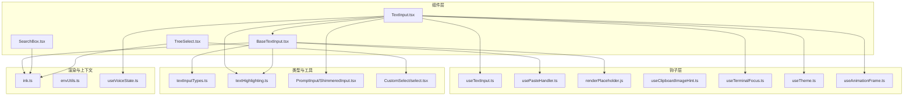
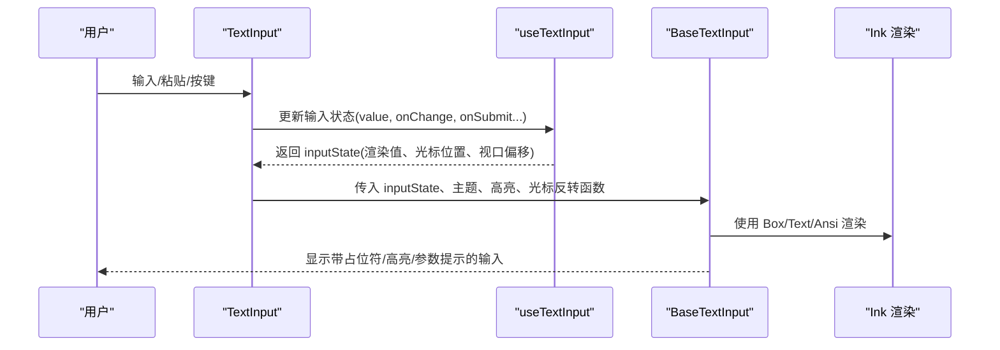
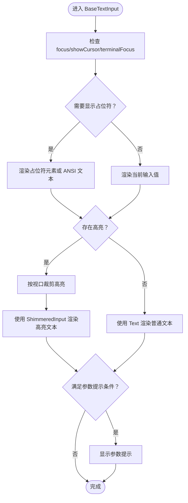
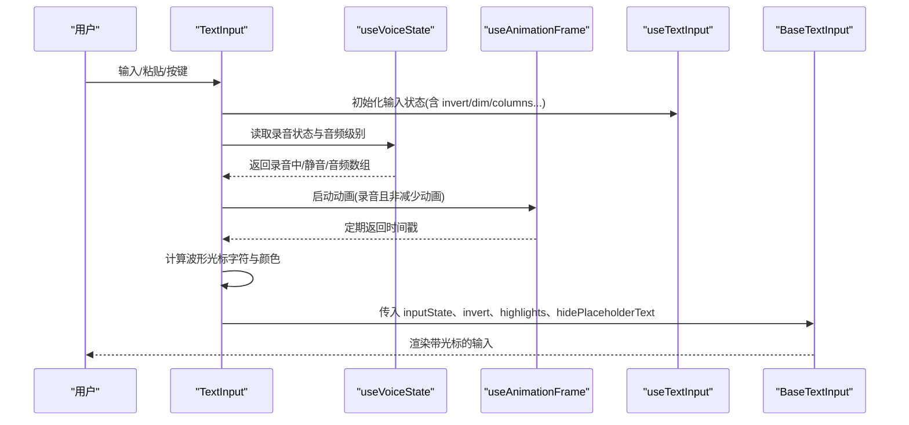
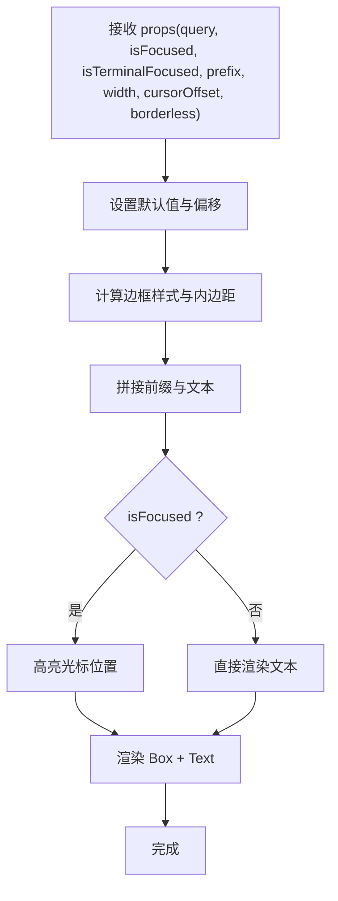
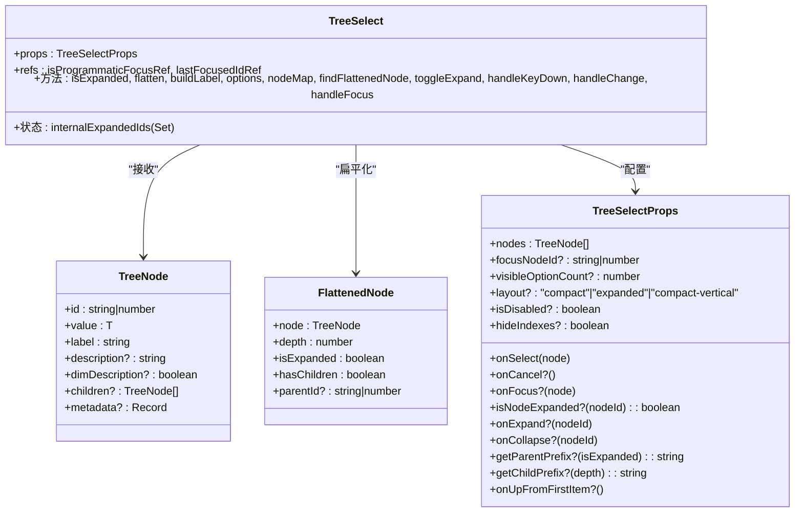
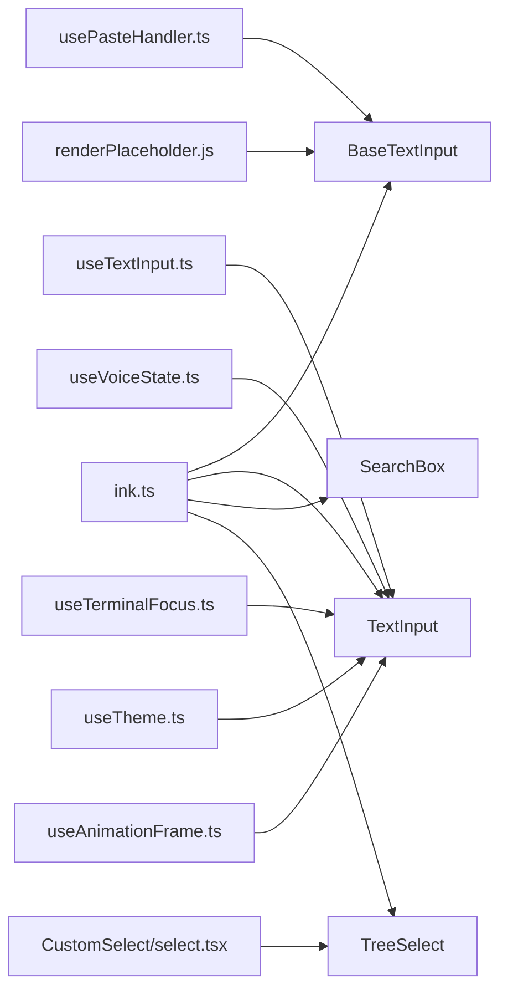

# UI 基础组件

<cite>
**本文档引用的文件**
- [BaseTextInput.tsx](file://src/components/BaseTextInput.tsx)
- [TextInput.tsx](file://src/components/TextInput.tsx)
- [SearchBox.tsx](file://src/components/SearchBox.tsx)
- [TreeSelect.tsx](file://src/components/ui/TreeSelect.tsx)
- [useTextInput.ts](file://src/hooks/useTextInput.ts)
- [textInputTypes.ts](file://src/types/textInputTypes.ts)
- [textHighlighting.ts](file://src/utils/textHighlighting.ts)
- [PromptInput/ShimmeredInput.tsx](file://src/components/PromptInput/ShimmeredInput.tsx)
- [CustomSelect/select.tsx](file://src/components/CustomSelect/select.tsx)
- [ink.js](file://src/ink.ts)
- [envUtils.ts](file://src/utils/envUtils.ts)
- [useSettings.ts](file://src/hooks/useSettings.ts)
- [useVoiceState.ts](file://src/context/voice.ts)
- [useClipboardImageHint.ts](file://src/hooks/useClipboardImageHint.ts)
- [useTerminalFocus.ts](file://src/hooks/useTerminalFocus.ts)
- [useTheme.ts](file://src/hooks/useTheme.ts)
- [useAnimationFrame.ts](file://src/hooks/useAnimationFrame.ts)
- [usePlaceholder.ts](file://src/hooks/renderPlaceholder.js)
- [usePasteHandler.ts](file://src/hooks/usePasteHandler.js)
- [useDeclaredCursor.ts](file://src/ink/hooks/use-declared-cursor.js)
</cite>

## 目录
1. [简介](#简介)
2. [项目结构](#项目结构)
3. [核心组件](#核心组件)
4. [架构总览](#架构总览)
5. [详细组件分析](#详细组件分析)
6. [依赖关系分析](#依赖关系分析)
7. [性能考虑](#性能考虑)
8. [故障排除指南](#故障排除指南)
9. [结论](#结论)

## 简介
本文件系统化梳理 Claude Code 的 UI 基础组件，重点覆盖以下内容：
- 文本输入体系：BaseTextInput、TextInput 及其与钩子、渲染、粘贴处理、占位符逻辑的协作
- 搜索框：SearchBox 的焦点状态、光标偏移、前缀与边框控制
- 树形选择器：TreeSelect 的层级展开/折叠、键盘导航、选项映射与回调
- 表单与验证：组件与表单系统的集成方式、错误处理与可访问性
- 可定制性与样式覆盖：主题、颜色、光标样式、语音模式下的动态光标
- 性能优化与无障碍：渲染缓存、动画节流、键盘导航与屏幕阅读器支持

## 项目结构
UI 基础组件主要位于 src/components 下，围绕文本输入、选择器与搜索框构建；通过 hooks 提供输入状态管理、粘贴处理、占位符渲染、剪贴板图像提示、终端焦点与主题等能力；底层 Ink 渲染系统负责终端 UI 布局与交互。

**图表来源**
- [BaseTextInput.tsx:1-136](file://src/components/BaseTextInput.tsx#L1-L136)
- [TextInput.tsx:1-124](file://src/components/TextInput.tsx#L1-L124)
- [SearchBox.tsx:1-72](file://src/components/SearchBox.tsx#L1-L72)
- [TreeSelect.tsx:1-397](file://src/components/ui/TreeSelect.tsx#L1-L397)
- [useTextInput.ts](file://src/hooks/useTextInput.ts)
- [usePasteHandler.ts](file://src/hooks/usePasteHandler.ts)
- [renderPlaceholder.js](file://src/hooks/renderPlaceholder.js)
- [useClipboardImageHint.ts](file://src/hooks/useClipboardImageHint.ts)
- [useTerminalFocus.ts](file://src/hooks/useTerminalFocus.ts)
- [useTheme.ts](file://src/hooks/useTheme.ts)
- [useAnimationFrame.ts](file://src/hooks/useAnimationFrame.ts)
- [textInputTypes.ts](file://src/types/textInputTypes.ts)
- [textHighlighting.ts](file://src/utils/textHighlighting.ts)
- [PromptInput/ShimmeredInput.tsx](file://src/components/PromptInput/ShimmeredInput.tsx)
- [CustomSelect/select.tsx](file://src/components/CustomSelect/select.tsx)
- [ink.ts](file://src/ink.ts)
- [envUtils.ts](file://src/utils/envUtils.ts)
- [useVoiceState.ts](file://src/context/voice.ts)

**章节来源**
- [BaseTextInput.tsx:1-136](file://src/components/BaseTextInput.tsx#L1-L136)
- [TextInput.tsx:1-124](file://src/components/TextInput.tsx#L1-L124)
- [SearchBox.tsx:1-72](file://src/components/SearchBox.tsx#L1-L72)
- [TreeSelect.tsx:1-397](file://src/components/ui/TreeSelect.tsx#L1-L397)

## 核心组件
- BaseTextInput：终端文本输入的基础渲染与输入处理，负责占位符显示、高亮、粘贴处理、光标声明与参数提示
- TextInput：在 BaseTextInput 基础上整合输入状态、主题、语音模式、剪贴板图像提示与可访问性开关
- SearchBox：搜索输入框的轻量渲染，支持前缀、边框、光标偏移与焦点态
- TreeSelect：树形结构的选择器，支持展开/折叠、键盘导航、布局与回调

**章节来源**
- [BaseTextInput.tsx:19-136](file://src/components/BaseTextInput.tsx#L19-L136)
- [TextInput.tsx:34-124](file://src/components/TextInput.tsx#L34-L124)
- [SearchBox.tsx:14-72](file://src/components/SearchBox.tsx#L14-L72)
- [TreeSelect.tsx:105-397](file://src/components/ui/TreeSelect.tsx#L105-L397)

## 架构总览
组件间的数据流与控制流如下：

**图表来源**
- [TextInput.tsx:92-119](file://src/components/TextInput.tsx#L92-L119)
- [useTextInput.ts](file://src/hooks/useTextInput.ts)
- [BaseTextInput.tsx:22-136](file://src/components/BaseTextInput.tsx#L22-L136)
- [ink.ts](file://src/ink.ts)

## 详细组件分析

### BaseTextInput 组件
- 职责：封装终端文本输入的渲染与基础输入处理，支持占位符、高亮、粘贴检测、光标声明与参数提示
- 关键点：
  - 占位符渲染：根据 focus、showCursor、terminalFocus、invert 等条件决定是否显示占位符及其元素
  - 高亮过滤：按视口范围裁剪高亮区间，避免越界渲染
  - 参数提示：当输入以“/”开头且无空格时显示参数提示
  - 粘贴处理：拦截粘贴过程中的回车触发，避免重复提交
  - 光标声明：通过 useDeclaredCursor 将原生终端光标定位到输入区域
- 可定制性：通过 invert 函数自定义光标样式（如语音模式下的波形光标），通过 hidePlaceholderText 控制占位符显示

**图表来源**
- [BaseTextInput.tsx:78-106](file://src/components/BaseTextInput.tsx#L78-L106)

**章节来源**
- [BaseTextInput.tsx:22-136](file://src/components/BaseTextInput.tsx#L22-L136)
- [PromptInput/ShimmeredInput.tsx](file://src/components/PromptInput/ShimmeredInput.tsx)
- [textHighlighting.ts](file://src/utils/textHighlighting.ts)
- [usePlaceholder.ts](file://src/hooks/renderPlaceholder.js)
- [usePasteHandler.ts](file://src/hooks/usePasteHandler.ts)
- [useDeclaredCursor.ts](file://src/ink/hooks/use-declared-cursor.js)

### TextInput 组件
- 职责：在 BaseTextInput 上叠加输入状态管理、主题、语音模式、剪贴板图像提示与可访问性
- 关键点：
  - 输入状态：useTextInput 提供 value、onChange、onSubmit、history、mask、multiline、cursorChar 等
  - 主题与颜色：useTheme 获取主题，color('text', theme) 注入文本颜色
  - 语音模式：feature('VOICE_MODE') 开启时，使用 useVoiceState 获取音频级别与状态，生成波形光标
  - 可访问性：通过 CLAUDE_CODE_ACCESSIBILITY 环境变量控制是否隐藏光标
  - 动画：useAnimationFrame 在录音期间以固定频率更新波形光标
  - 剪贴板图像提示：useClipboardImageHint 在终端获得焦点时提示可粘贴图片
- 样式覆盖：invert 函数可替换默认光标样式；dim 用于弱化文本；columns/maxVisibleLines 控制布局

**图表来源**
- [TextInput.tsx:34-124](file://src/components/TextInput.tsx#L34-L124)
- [useTextInput.ts](file://src/hooks/useTextInput.ts)
- [useVoiceState.ts](file://src/context/voice.ts)
- [useAnimationFrame.ts](file://src/hooks/useAnimationFrame.ts)
- [useSettings.ts](file://src/hooks/useSettings.ts)
- [envUtils.ts](file://src/utils/envUtils.ts)

**章节来源**
- [TextInput.tsx:34-124](file://src/components/TextInput.tsx#L34-L124)
- [textInputTypes.ts](file://src/types/textInputTypes.ts)

### SearchBox 组件
- 职责：轻量搜索输入框，支持前缀、边框、宽度、光标偏移与焦点态
- 关键点：
  - 默认前缀为“⎕”，默认占位符为“Search…”，可通过 props 覆盖
  - 边框样式：borderless=false 时使用圆角边框，否则无边框
  - 光标：在 isFocused 且 isTerminalFocused 时，将光标高亮显示
  - 文本：根据 isFocused 与 query/cursorOffset 切换不同渲染路径

**图表来源**
- [SearchBox.tsx:14-72](file://src/components/SearchBox.tsx#L14-L72)

**章节来源**
- [SearchBox.tsx:14-72](file://src/components/SearchBox.tsx#L14-L72)

### TreeSelect 组件
- 职责：树形结构选择器，支持展开/折叠、键盘导航、布局与回调
- 关键点：
  - 数据结构：TreeNode<T> 支持 id/value/label/description/metadata/children
  - 展开/折叠：内部维护 expandedIds 或外部回调 onExpand/onCollapse；支持 getParentPrefix/getChildPrefix 自定义前缀
  - 键盘导航：左右箭头控制展开/折叠与父节点聚焦；支持 onUpFromFirstItem 阻止循环
  - 选项映射：将树扁平化为选项列表，构建 label（含父子前缀），并建立 nodeMap 快速查找
  - 布局：支持 compact、expanded、compact-vertical 三种布局
- 事件与回调：onSelect/onCancel/onFocus/onExpand/onCollapse/onUpFromFirstItem

**图表来源**
- [TreeSelect.tsx:6-103](file://src/components/ui/TreeSelect.tsx#L6-L103)
- [TreeSelect.tsx:110-397](file://src/components/ui/TreeSelect.tsx#L110-L397)
- [CustomSelect/select.tsx](file://src/components/CustomSelect/select.tsx)

**章节来源**
- [TreeSelect.tsx:105-397](file://src/components/ui/TreeSelect.tsx#L105-L397)

## 依赖关系分析
- 组件依赖 Ink 渲染系统（Box、Text、Ansi、useInput、useTheme、useTerminalFocus 等）
- TextInput 依赖 useTextInput 提供的输入状态与历史管理，并结合 useVoiceState 实现语音模式
- BaseTextInput 依赖 renderPlaceholder 与 usePasteHandler 处理占位符与粘贴场景
- TreeSelect 依赖 CustomSelect 的 Select 组件进行选项渲染与交互

**图表来源**
- [ink.ts](file://src/ink.ts)
- [TextInput.tsx:8-12](file://src/components/TextInput.tsx#L8-L12)
- [BaseTextInput.tsx:6-9](file://src/components/BaseTextInput.tsx#L6-L9)
- [TreeSelect.tsx:4-5](file://src/components/ui/TreeSelect.tsx#L4-L5)
- [useTextInput.ts](file://src/hooks/useTextInput.ts)
- [usePasteHandler.ts](file://src/hooks/usePasteHandler.ts)
- [renderPlaceholder.js](file://src/hooks/renderPlaceholder.js)
- [useVoiceState.ts](file://src/context/voice.ts)
- [useTerminalFocus.ts](file://src/hooks/useTerminalFocus.ts)
- [useTheme.ts](file://src/hooks/useTheme.ts)
- [useAnimationFrame.ts](file://src/hooks/useAnimationFrame.ts)
- [CustomSelect/select.tsx](file://src/components/CustomSelect/select.tsx)

**章节来源**
- [TextInput.tsx:1-124](file://src/components/TextInput.tsx#L1-L124)
- [BaseTextInput.tsx:1-136](file://src/components/BaseTextInput.tsx#L1-L136)
- [SearchBox.tsx:1-72](file://src/components/SearchBox.tsx#L1-L72)
- [TreeSelect.tsx:1-397](file://src/components/ui/TreeSelect.tsx#L1-L397)

## 性能考虑
- 渲染缓存：BaseTextInput、SearchBox、TreeSelect 内部广泛使用 useMemo/useMemo 缓存计算结果，避免不必要的重渲染
- 动画节流：TextInput 在语音模式下通过 useAnimationFrame 以固定频率更新波形光标，减少高频重渲染
- 视口裁剪：BaseTextInput 对高亮区间按视口进行裁剪，降低渲染负担
- 输入处理：usePasteHandler 在粘贴过程中拦截回车，避免重复提交导致的无效渲染
- 可访问性：通过环境变量 CLAUDE_CODE_ACCESSIBILITY 控制是否显示光标，减少不必要的视觉闪烁

[本节为通用指导，无需列出具体文件来源]

## 故障排除指南
- 输入无响应
  - 检查 focus 与 terminalFocus 是否正确传递至 BaseTextInput/TextInput
  - 确认 useInput 已在 isActive=true 时启用
- 占位符不显示
  - 确认 value 为空且 showCursor/focus/terminalFocus 条件满足
  - 检查 invert 与 hidePlaceholderText 的组合逻辑
- 粘贴触发重复提交
  - 确保 usePasteHandler 正确拦截粘贴后的回车事件
- 树形选择器无法展开/折叠
  - 检查 isNodeExpanded 回调或 internalExpandedIds 状态
  - 确认 handleKeyDown 中左右箭头事件未被其他监听覆盖
- 语音模式光标异常
  - 确认 feature('VOICE_MODE') 生效，useVoiceState 返回音频级别
  - 检查 SMOOT、LEVEL_BOOST、SILENCE_THRESHOLD 参数设置

**章节来源**
- [BaseTextInput.tsx:78-93](file://src/components/BaseTextInput.tsx#L78-L93)
- [usePasteHandler.ts](file://src/hooks/usePasteHandler.ts)
- [TreeSelect.tsx:277-321](file://src/components/ui/TreeSelect.tsx#L277-L321)
- [TextInput.tsx:44-55](file://src/components/TextInput.tsx#L44-L55)

## 结论
上述组件共同构成了 Claude Code 的终端 UI 基础层：BaseTextInput 提供稳定的输入渲染与处理，TextInput 在此基础上整合主题、语音与可访问性，SearchBox 提供简洁的搜索体验，TreeSelect 则满足复杂层级选择需求。通过 hooks 与 Ink 渲染系统的配合，组件实现了良好的可定制性、可访问性与性能表现。