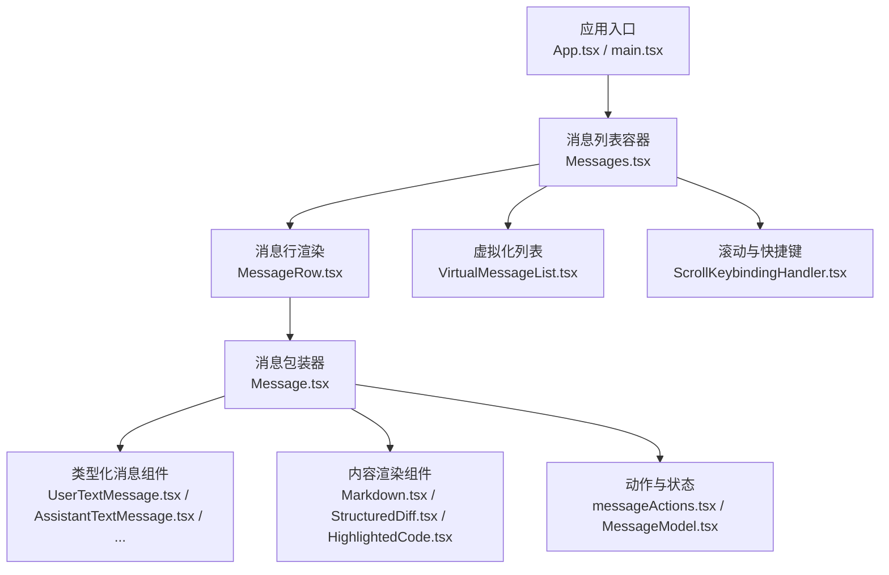
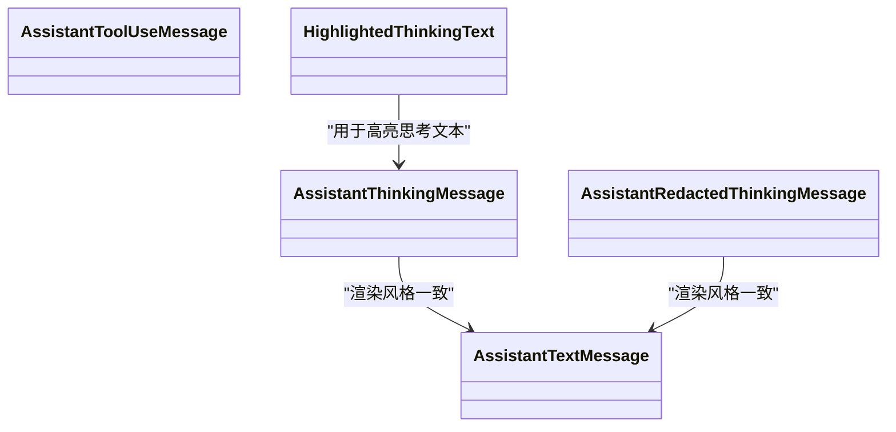
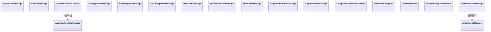
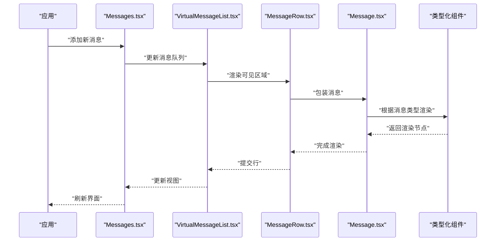
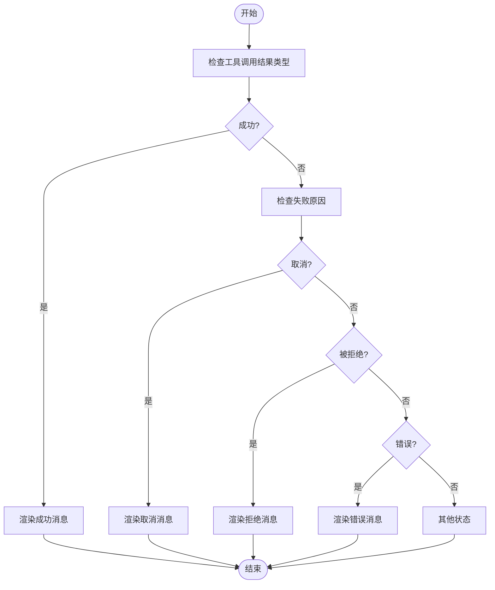
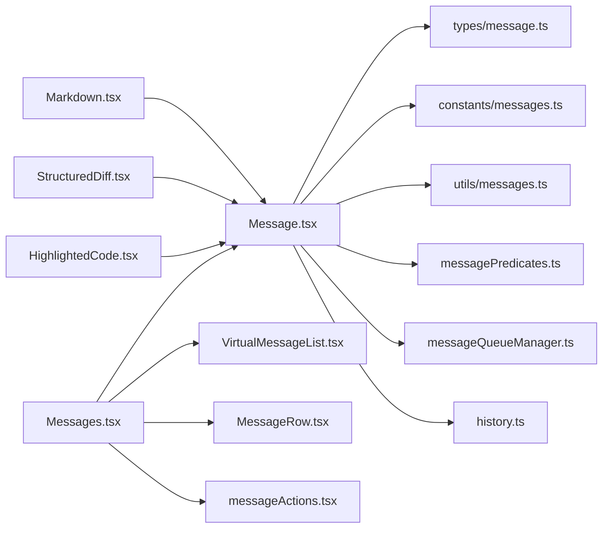

# 消息组件系统

<cite>
**本文档引用的文件**
- [UserTextMessage.tsx](file://src/components/messages/UserTextMessage.tsx)
- [AssistantTextMessage.tsx](file://src/components/messages/AssistantTextMessage.tsx)
- [AssistantToolUseMessage.tsx](file://src/components/messages/AssistantToolUseMessage.tsx)
- [SystemTextMessage.tsx](file://src/components/messages/SystemTextMessage.tsx)
- [AdvisorMessage.tsx](file://src/components/messages/AdvisorMessage.tsx)
- [AssistantThinkingMessage.tsx](file://src/components/messages/AssistantThinkingMessage.tsx)
- [AssistantRedactedThinkingMessage.tsx](file://src/components/messages/AssistantRedactedThinkingMessage.tsx)
- [HighlightedThinkingText.tsx](file://src/components/messages/HighlightedThinkingText.tsx)
- [AttachmentMessage.tsx](file://src/components/messages/AttachmentMessage.tsx)
- [UserBashInputMessage.tsx](file://src/components/messages/UserBashInputMessage.tsx)
- [UserBashOutputMessage.tsx](file://src/components/messages/UserBashOutputMessage.tsx)
- [UserImageMessage.tsx](file://src/components/messages/UserImageMessage.tsx)
- [UserCommandMessage.tsx](file://src/components/messages/UserCommandMessage.tsx)
- [UserPlanMessage.tsx](file://src/components/messages/UserPlanMessage.tsx)
- [UserTeammateMessage.tsx](file://src/components/messages/UserTeammateMessage.tsx)
- [UserCrossSessionMessage.tsx](file://src/components/messages/UserCrossSessionMessage.tsx)
- [UserGitHubWebhookMessage.tsx](file://src/components/messages/UserGitHubWebhookMessage.tsx)
- [UserAgentNotificationMessage.tsx](file://src/components/messages/UserAgentNotificationMessage.tsx)
- [UserMemoryInputMessage.tsx](file://src/components/messages/UserMemoryInputMessage.tsx)
- [UserLocalCommandOutputMessage.tsx](file://src/components/messages/UserLocalCommandOutputMessage.tsx)
- [UserResourceUpdateMessage.tsx](file://src/components/messages/UserResourceUpdateMessage.tsx)
- [UserForkBoilerplateMessage.tsx](file://src/components/messages/UserForkBoilerplateMessage.tsx)
- [UserChannelMessage.tsx](file://src/components/messages/UserChannelMessage.tsx)
- [UserPromptMessage.tsx](file://src/components/messages/UserPromptMessage.tsx)
- [UserToolResultMessage/UserToolResultMessage.tsx](file://src/components/messages/UserToolResultMessage/UserToolResultMessage.tsx)
- [UserToolResultMessage/RejectedToolUseMessage.tsx](file://src/components/messages/UserToolResultMessage/RejectedToolUseMessage.tsx)
- [UserToolResultMessage/RejectedPlanMessage.tsx](file://src/components/messages/UserToolResultMessage/RejectedPlanMessage.tsx)
- [UserToolResultMessage/UserToolCanceledMessage.tsx](file://src/components/messages/UserToolResultMessage/UserToolCanceledMessage.tsx)
- [UserToolResultMessage/UserToolErrorMessage.tsx](file://src/components/messages/UserToolResultMessage/UserToolErrorMessage.tsx)
- [UserToolResultMessage/UserToolRejectMessage.tsx](file://src/components/messages/UserToolResultMessage/UserToolRejectMessage.tsx)
- [UserToolResultMessage/UserToolSuccessMessage.tsx](file://src/components/messages/UserToolResultMessage/UserToolSuccessMessage.tsx)
- [UserToolResultMessage/utils.tsx](file://src/components/messages/UserToolResultMessage/utils.tsx)
- [GroupedToolUseContent.tsx](file://src/components/messages/GroupedToolUseContent.tsx)
- [PlanApprovalMessage.tsx](file://src/components/messages/PlanApprovalMessage.tsx)
- [HookProgressMessage.tsx](file://src/components/messages/HookProgressMessage.tsx)
- [TaskAssignmentMessage.tsx](file://src/components/messages/TaskAssignmentMessage.tsx)
- [RateLimitMessage.tsx](file://src/components/messages/RateLimitMessage.tsx)
- [SystemAPIErrorMessage.tsx](file://src/components/messages/SystemAPIErrorMessage.tsx)
- [ShutdownMessage.tsx](file://src/components/messages/ShutdownMessage.tsx)
- [CompactBoundaryMessage.tsx](file://src/components/messages/CompactBoundaryMessage.tsx)
- [SnipBoundaryMessage.tsx](file://src/components/messages/SnipBoundaryMessage.tsx)
- [CollapsedReadSearchContent.tsx](file://src/components/messages/CollapsedReadSearchContent.tsx)
- [teamMemCollapsed.tsx](file://src/components/messages/teamMemCollapsed.tsx)
- [teamMemSaved.ts](file://src/components/messages/teamMemSaved.ts)
- [nullRenderingAttachments.ts](file://src/components/messages/nullRenderingAttachments.ts)
- [Message.tsx](file://src/components/Message.tsx)
- [MessageModel.tsx](file://src/components/MessageModel.tsx)
- [Messages.tsx](file://src/components/Messages.tsx)
- [MessageRow.tsx](file://src/components/MessageRow.tsx)
- [MessageTimestamp.tsx](file://src/components/MessageTimestamp.tsx)
- [VirtualMessageList.tsx](file://src/components/VirtualMessageList.tsx)
- [messageActions.tsx](file://src/components/messageActions.tsx)
- [messages.ts](file://src/constants/messages.ts)
- [message.ts](file://src/types/message.ts)
- [messages.ts](file://src/utils/messages.ts)
- [messagePredicates.ts](file://src/utils/messagePredicates.ts)
- [messageQueueManager.ts](file://src/utils/messageQueueManager.ts)
- [history.ts](file://src/history.ts)
- [ScrollKeybindingHandler.tsx](file://src/components/ScrollKeybindingHandler.tsx)
- [Markdown.tsx](file://src/components/Markdown.tsx)
- [MarkdownTable.tsx](file://src/components/MarkdownTable.tsx)
- [StructuredDiff.tsx](file://src/components/StructuredDiff.tsx)
- [StructuredDiffList.tsx](file://src/components/StructuredDiffList.tsx)
- [HighlightedCode.tsx](file://src/components/HighlightedCode.tsx)
- [Spinner.tsx](file://src/components/Spinner.tsx)
- [ToolUseLoader.tsx](file://src/components/ToolUseLoader.tsx)
- [ThinkingToggle.tsx](file://src/components/ThinkingToggle.tsx)
- [TokenWarning.tsx](file://src/components/TokenWarning.tsx)
- [Feedback.tsx](file://src/components/Feedback.tsx)
- [StatusLine.tsx](file://src/components/StatusLine.tsx)
- [StatusNotices.tsx](file://src/components/StatusNotices.tsx)
- [App.tsx](file://src/components/App.tsx)
- [main.tsx](file://src/main.tsx)
</cite>

## 目录
1. [简介](#简介)
2. [项目结构](#项目结构)
3. [核心组件](#核心组件)
4. [架构总览](#架构总览)
5. [详细组件分析](#详细组件分析)
6. [依赖关系分析](#依赖关系分析)
7. [性能考虑](#性能考虑)
8. [故障排除指南](#故障排除指南)
9. [结论](#结论)
10. [附录](#附录)

## 简介
本文件系统性梳理 Claude Code 的消息组件体系，覆盖消息类型分类、渲染机制、交互模式与状态管理，并对关键组件如 UserTextMessage、AssistantTextMessage、AssistantToolUseMessage、SystemTextMessage 等进行深入解析。文档同时提供可扩展方案、样式定制建议、性能优化策略以及消息历史管理、滚动行为与无障碍支持要点。

## 项目结构
消息相关代码主要集中在 src/components/messages 目录下，按消息类型分层组织，辅以通用消息容器与虚拟化列表组件，形成“类型化组件 + 容器 + 工具”的分层架构。

```mermaid
graph TB
subgraph "消息类型组件"
UTM["UserTextMessage.tsx"]
ATM["AssistantTextMessage.tsx"]
ATUM["AssistantToolUseMessage.tsx"]
STM["SystemTextMessage.tsx"]
AIM["AdvisorMessage.tsx"]
THKM["AssistantThinkingMessage.tsx"]
RTHKM["AssistantRedactedThinkingMessage.tsx"]
HTT["HighlightedThinkingText.tsx"]
ATT["AttachmentMessage.tsx"]
UBIM["UserBashInputMessage.tsx"]
UBTM["UserBashOutputMessage.tsx"]
UIMG["UserImageMessage.tsx"]
UCMD["UserCommandMessage.tsx"]
UPLAN["UserPlanMessage.tsx"]
UTC["UserTeammateMessage.tsx"]
UCS["UserCrossSessionMessage.tsx"]
UGH["UserGitHubWebhookMessage.tsx"]
UAN["UserAgentNotificationMessage.tsx"]
UMIN["UserMemoryInputMessage.tsx"]
ULCO["UserLocalCommandOutputMessage.tsx"]
URUM["UserResourceUpdateMessage.tsx"]
UFB["UserForkBoilerplateMessage.tsx"]
UCH["UserChannelMessage.tsx"]
UPR["UserPromptMessage.tsx"]
UTRM["UserToolResultMessage/*"]
end
subgraph "通用容器与工具"
MSG["Message.tsx"]
MSGLIST["Messages.tsx"]
MROW["MessageRow.tsx"]
VTML["VirtualMessageList.tsx"]
MTIMESTAMP["MessageTimestamp.tsx"]
MACT["messageActions.tsx"]
MD["Markdown.tsx"]
MDT["MarkdownTable.tsx"]
SD["StructuredDiff.tsx"]
SDL["StructuredDiffList.tsx"]
HC["HighlightedCode.tsx"]
SP["Spinner.tsx"]
TUL["ToolUseLoader.tsx"]
TT["ThinkingToggle.tsx"]
TW["TokenWarning.tsx"]
end
UTRM --> MSG
MSG --> MSGLIST
MSGLIST --> VTML
MSGLIST --> MROW
MROW --> MTIMESTAMP
MSGLIST --> MACT
MSGLIST --> MD
MSGLIST --> MDT
MSGLIST --> SD
MSGLIST --> SDL
MSGLIST --> HC
MSGLIST --> SP
MSGLIST --> TUL
MSGLIST --> TT
MSGLIST --> TW
```

图表来源
- [UserTextMessage.tsx](file://src/components/messages/UserTextMessage.tsx)
- [AssistantTextMessage.tsx](file://src/components/messages/AssistantTextMessage.tsx)
- [AssistantToolUseMessage.tsx](file://src/components/messages/AssistantToolUseMessage.tsx)
- [SystemTextMessage.tsx](file://src/components/messages/SystemTextMessage.tsx)
- [Message.tsx](file://src/components/Message.tsx)
- [Messages.tsx](file://src/components/Messages.tsx)
- [MessageRow.tsx](file://src/components/MessageRow.tsx)
- [VirtualMessageList.tsx](file://src/components/VirtualMessageList.tsx)
- [Markdown.tsx](file://src/components/Markdown.tsx)
- [MarkdownTable.tsx](file://src/components/MarkdownTable.tsx)
- [StructuredDiff.tsx](file://src/components/StructuredDiff.tsx)
- [StructuredDiffList.tsx](file://src/components/StructuredDiffList.tsx)
- [HighlightedCode.tsx](file://src/components/HighlightedCode.tsx)
- [Spinner.tsx](file://src/components/Spinner.tsx)
- [ToolUseLoader.tsx](file://src/components/ToolUseLoader.tsx)
- [ThinkingToggle.tsx](file://src/components/ThinkingToggle.tsx)
- [TokenWarning.tsx](file://src/components/TokenWarning.tsx)

章节来源
- [UserTextMessage.tsx](file://src/components/messages/UserTextMessage.tsx)
- [AssistantTextMessage.tsx](file://src/components/messages/AssistantTextMessage.tsx)
- [AssistantToolUseMessage.tsx](file://src/components/messages/AssistantToolUseMessage.tsx)
- [SystemTextMessage.tsx](file://src/components/messages/SystemTextMessage.tsx)
- [Message.tsx](file://src/components/Message.tsx)
- [Messages.tsx](file://src/components/Messages.tsx)
- [MessageRow.tsx](file://src/components/MessageRow.tsx)
- [VirtualMessageList.tsx](file://src/components/VirtualMessageList.tsx)

## 核心组件
- 消息容器与模型
  - Message.tsx：统一的消息包装器，负责渲染与交互控制。
  - MessageModel.tsx：消息数据模型与状态管理抽象。
  - Messages.tsx：消息列表容器，聚合消息并提供滚动、选择、操作入口。
  - MessageRow.tsx：单条消息行渲染单元，承载具体消息类型的可视化。
  - VirtualMessageList.tsx：虚拟化列表，提升大量消息时的渲染性能。
  - MessageTimestamp.tsx：时间戳显示组件。
  - messageActions.tsx：消息级动作集合（复制、删除、展开等）。
- 渲染与内容组件
  - Markdown.tsx、MarkdownTable.tsx：Markdown 文本与表格渲染。
  - StructuredDiff.tsx、StructuredDiffList.tsx：结构化差异展示。
  - HighlightedCode.tsx：代码高亮。
  - Spinner.tsx、ToolUseLoader.tsx：加载态指示。
  - ThinkingToggle.tsx、TokenWarning.tsx：思考过程与令牌告警。
- 特殊消息类型
  - UserToolResultMessage/*：工具调用结果系列组件。
  - GroupedToolUseContent.tsx：工具调用内容分组展示。
  - PlanApprovalMessage.tsx、HookProgressMessage.tsx、TaskAssignmentMessage.tsx：计划、钩子与任务相关消息。
  - RateLimitMessage.tsx、SystemAPIErrorMessage.tsx、ShutdownMessage.tsx：系统与限制相关消息。
  - CompactBoundaryMessage.tsx、SnipBoundaryMessage.tsx、CollapsedReadSearchContent.tsx：边界与折叠内容。
  - teamMemCollapsed.tsx、teamMemSaved.ts：团队记忆相关消息。

章节来源
- [Message.tsx](file://src/components/Message.tsx)
- [MessageModel.tsx](file://src/components/MessageModel.tsx)
- [Messages.tsx](file://src/components/Messages.tsx)
- [MessageRow.tsx](file://src/components/MessageRow.tsx)
- [VirtualMessageList.tsx](file://src/components/VirtualMessageList.tsx)
- [MessageTimestamp.tsx](file://src/components/MessageTimestamp.tsx)
- [messageActions.tsx](file://src/components/messageActions.tsx)
- [Markdown.tsx](file://src/components/Markdown.tsx)
- [MarkdownTable.tsx](file://src/components/MarkdownTable.tsx)
- [StructuredDiff.tsx](file://src/components/StructuredDiff.tsx)
- [StructuredDiffList.tsx](file://src/components/StructuredDiffList.tsx)
- [HighlightedCode.tsx](file://src/components/HighlightedCode.tsx)
- [Spinner.tsx](file://src/components/Spinner.tsx)
- [ToolUseLoader.tsx](file://src/components/ToolUseLoader.tsx)
- [ThinkingToggle.tsx](file://src/components/ThinkingToggle.tsx)
- [TokenWarning.tsx](file://src/components/TokenWarning.tsx)

## 架构总览
消息系统采用“类型化组件 + 容器 + 工具”三层架构：
- 类型化组件：针对不同角色与用途的消息，提供专用 UI 与交互。
- 容器层：Messages 负责列表管理、滚动与批量操作；MessageRow 提供行级渲染；VirtualMessageList 提供虚拟化优化。
- 工具层：Markdown、Diff、Code 高亮等复用组件；messageActions 提供统一动作；辅助组件如 Spinner、ThinkingToggle 等增强体验。

图表来源
- [App.tsx](file://src/components/App.tsx)
- [main.tsx](file://src/main.tsx)
- [Messages.tsx](file://src/components/Messages.tsx)
- [MessageRow.tsx](file://src/components/MessageRow.tsx)
- [Message.tsx](file://src/components/Message.tsx)
- [UserTextMessage.tsx](file://src/components/messages/UserTextMessage.tsx)
- [AssistantTextMessage.tsx](file://src/components/messages/AssistantTextMessage.tsx)
- [Markdown.tsx](file://src/components/Markdown.tsx)
- [StructuredDiff.tsx](file://src/components/StructuredDiff.tsx)
- [HighlightedCode.tsx](file://src/components/HighlightedCode.tsx)
- [messageActions.tsx](file://src/components/messageActions.tsx)
- [MessageModel.tsx](file://src/components/MessageModel.tsx)
- [VirtualMessageList.tsx](file://src/components/VirtualMessageList.tsx)
- [ScrollKeybindingHandler.tsx](file://src/components/ScrollKeybindingHandler.tsx)

## 详细组件分析

### 用户消息组件族
- UserTextMessage.tsx：用户文本输入消息，负责渲染用户原始文本与附件。
- UserBashInputMessage.tsx：终端命令输入消息，强调命令与上下文。
- UserBashOutputMessage.tsx：终端输出消息，强调结果与错误信息。
- UserImageMessage.tsx：图片消息，支持预览与下载。
- UserCommandMessage.tsx：命令执行消息，展示命令与参数。
- UserPlanMessage.tsx：计划消息，用于展示计划内容。
- UserTeammateMessage.tsx：队友消息，标识消息来源。
- UserCrossSessionMessage.tsx：跨会话消息，连接历史会话。
- UserGitHubWebhookMessage.tsx：GitHub Webhook 消息，展示触发事件。
- UserAgentNotificationMessage.tsx：代理通知消息，提示系统事件。
- UserMemoryInputMessage.tsx：内存输入消息，关联记忆片段。
- UserLocalCommandOutputMessage.tsx：本地命令输出消息，区分本地执行结果。
- UserResourceUpdateMessage.tsx：资源更新消息，展示资源变更。
- UserForkBoilerplateMessage.tsx：Fork 模板消息，用于模板引导。
- UserChannelMessage.tsx：频道消息，标识消息通道。
- UserPromptMessage.tsx：提示词消息，展示系统提示或模板。

```mermaid
classDiagram
class UserTextMessage
class UserBashInputMessage
class UserBashOutputMessage
class UserImageMessage
class UserCommandMessage
class UserPlanMessage
class UserTeammateMessage
class UserCrossSessionMessage
class UserGitHubWebhookMessage
class UserAgentNotificationMessage
class UserMemoryInputMessage
class UserLocalCommandOutputMessage
class UserResourceUpdateMessage
class UserForkBoilerplateMessage
class UserChannelMessage
class UserPromptMessage
UserBashInputMessage --> UserTextMessage : "继承/复用"
UserBashOutputMessage --> UserTextMessage : "继承/复用"
UserImageMessage --> UserTextMessage : "继承/复用"
UserCommandMessage --> UserTextMessage : "继承/复用"
UserPlanMessage --> UserTextMessage : "继承/复用"
UserTeammateMessage --> UserTextMessage : "继承/复用"
UserCrossSessionMessage --> UserTextMessage : "继承/复用"
UserGitHubWebhookMessage --> UserTextMessage : "继承/复用"
UserAgentNotificationMessage --> UserTextMessage : "继承/复用"
UserMemoryInputMessage --> UserTextMessage : "继承/复用"
UserLocalCommandOutputMessage --> UserTextMessage : "继承/复用"
UserResourceUpdateMessage --> UserTextMessage : "继承/复用"
UserForkBoilerplateMessage --> UserTextMessage : "继承/复用"
UserChannelMessage --> UserTextMessage : "继承/复用"
UserPromptMessage --> UserTextMessage : "继承/复用"
```

图表来源
- [UserTextMessage.tsx](file://src/components/messages/UserTextMessage.tsx)
- [UserBashInputMessage.tsx](file://src/components/messages/UserBashInputMessage.tsx)
- [UserBashOutputMessage.tsx](file://src/components/messages/UserBashOutputMessage.tsx)
- [UserImageMessage.tsx](file://src/components/messages/UserImageMessage.tsx)
- [UserCommandMessage.tsx](file://src/components/messages/UserCommandMessage.tsx)
- [UserPlanMessage.tsx](file://src/components/messages/UserPlanMessage.tsx)
- [UserTeammateMessage.tsx](file://src/components/messages/UserTeammateMessage.tsx)
- [UserCrossSessionMessage.tsx](file://src/components/messages/UserCrossSessionMessage.tsx)
- [UserGitHubWebhookMessage.tsx](file://src/components/messages/UserGitHubWebhookMessage.tsx)
- [UserAgentNotificationMessage.tsx](file://src/components/messages/UserAgentNotificationMessage.tsx)
- [UserMemoryInputMessage.tsx](file://src/components/messages/UserMemoryInputMessage.tsx)
- [UserLocalCommandOutputMessage.tsx](file://src/components/messages/UserLocalCommandOutputMessage.tsx)
- [UserResourceUpdateMessage.tsx](file://src/components/messages/UserResourceUpdateMessage.tsx)
- [UserForkBoilerplateMessage.tsx](file://src/components/messages/UserForkBoilerplateMessage.tsx)
- [UserChannelMessage.tsx](file://src/components/messages/UserChannelMessage.tsx)
- [UserPromptMessage.tsx](file://src/components/messages/UserPromptMessage.tsx)

章节来源
- [UserTextMessage.tsx](file://src/components/messages/UserTextMessage.tsx)
- [UserBashInputMessage.tsx](file://src/components/messages/UserBashInputMessage.tsx)
- [UserBashOutputMessage.tsx](file://src/components/messages/UserBashOutputMessage.tsx)
- [UserImageMessage.tsx](file://src/components/messages/UserImageMessage.tsx)
- [UserCommandMessage.tsx](file://src/components/messages/UserCommandMessage.tsx)
- [UserPlanMessage.tsx](file://src/components/messages/UserPlanMessage.tsx)
- [UserTeammateMessage.tsx](file://src/components/messages/UserTeammateMessage.tsx)
- [UserCrossSessionMessage.tsx](file://src/components/messages/UserCrossSessionMessage.tsx)
- [UserGitHubWebhookMessage.tsx](file://src/components/messages/UserGitHubWebhookMessage.tsx)
- [UserAgentNotificationMessage.tsx](file://src/components/messages/UserAgentNotificationMessage.tsx)
- [UserMemoryInputMessage.tsx](file://src/components/messages/UserMemoryInputMessage.tsx)
- [UserLocalCommandOutputMessage.tsx](file://src/components/messages/UserLocalCommandOutputMessage.tsx)
- [UserResourceUpdateMessage.tsx](file://src/components/messages/UserResourceUpdateMessage.tsx)
- [UserForkBoilerplateMessage.tsx](file://src/components/messages/UserForkBoilerplateMessage.tsx)
- [UserChannelMessage.tsx](file://src/components/messages/UserChannelMessage.tsx)
- [UserPromptMessage.tsx](file://src/components/messages/UserPromptMessage.tsx)

### 助手消息组件族
- AssistantTextMessage.tsx：助手文本回复消息，支持 Markdown 渲染与代码块高亮。
- AssistantToolUseMessage.tsx：助手工具调用消息，展示工具名称、参数与调用状态。
- AssistantThinkingMessage.tsx：助手思考消息，展示中间思考过程（可折叠）。
- AssistantRedactedThinkingMessage.tsx：助手脱敏思考消息，保护敏感信息。
- HighlightedThinkingText.tsx：思考文本高亮组件，突出关键语句。

图表来源
- [AssistantTextMessage.tsx](file://src/components/messages/AssistantTextMessage.tsx)
- [AssistantToolUseMessage.tsx](file://src/components/messages/AssistantToolUseMessage.tsx)
- [AssistantThinkingMessage.tsx](file://src/components/messages/AssistantThinkingMessage.tsx)
- [AssistantRedactedThinkingMessage.tsx](file://src/components/messages/AssistantRedactedThinkingMessage.tsx)
- [HighlightedThinkingText.tsx](file://src/components/messages/HighlightedThinkingText.tsx)

章节来源
- [AssistantTextMessage.tsx](file://src/components/messages/AssistantTextMessage.tsx)
- [AssistantToolUseMessage.tsx](file://src/components/messages/AssistantToolUseMessage.tsx)
- [AssistantThinkingMessage.tsx](file://src/components/messages/AssistantThinkingMessage.tsx)
- [AssistantRedactedThinkingMessage.tsx](file://src/components/messages/AssistantRedactedThinkingMessage.tsx)
- [HighlightedThinkingText.tsx](file://src/components/messages/HighlightedThinkingText.tsx)

### 系统与特殊消息组件
- SystemTextMessage.tsx：系统提示消息，用于显示系统级别信息。
- AdvisorMessage.tsx：顾问消息，提供专家建议与提示。
- AttachmentMessage.tsx：附件消息，展示文件与链接。
- UserToolResultMessage/*：工具调用结果系列，包含成功、失败、取消、拒绝、错误等细分类型。
- GroupedToolUseContent.tsx：工具调用内容分组，合并同类项。
- PlanApprovalMessage.tsx、HookProgressMessage.tsx、TaskAssignmentMessage.tsx：计划审批、钩子进度与任务分配消息。
- RateLimitMessage.tsx、SystemAPIErrorMessage.tsx、ShutdownMessage.tsx：速率限制、系统 API 错误与关闭消息。
- CompactBoundaryMessage.tsx、SnipBoundaryMessage.tsx、CollapsedReadSearchContent.tsx：边界与折叠内容。
- teamMemCollapsed.tsx、teamMemSaved.ts：团队记忆相关消息。
- nullRenderingAttachments.ts：空渲染附件占位。

图表来源
- [SystemTextMessage.tsx](file://src/components/messages/SystemTextMessage.tsx)
- [AdvisorMessage.tsx](file://src/components/messages/AdvisorMessage.tsx)
- [AttachmentMessage.tsx](file://src/components/messages/AttachmentMessage.tsx)
- [GroupedToolUseContent.tsx](file://src/components/messages/GroupedToolUseContent.tsx)
- [PlanApprovalMessage.tsx](file://src/components/messages/PlanApprovalMessage.tsx)
- [HookProgressMessage.tsx](file://src/components/messages/HookProgressMessage.tsx)
- [TaskAssignmentMessage.tsx](file://src/components/messages/TaskAssignmentMessage.tsx)
- [RateLimitMessage.tsx](file://src/components/messages/RateLimitMessage.tsx)
- [SystemAPIErrorMessage.tsx](file://src/components/messages/SystemAPIErrorMessage.tsx)
- [ShutdownMessage.tsx](file://src/components/messages/ShutdownMessage.tsx)
- [CompactBoundaryMessage.tsx](file://src/components/messages/CompactBoundaryMessage.tsx)
- [SnipBoundaryMessage.tsx](file://src/components/messages/SnipBoundaryMessage.tsx)
- [CollapsedReadSearchContent.tsx](file://src/components/messages/CollapsedReadSearchContent.tsx)
- [teamMemCollapsed.tsx](file://src/components/messages/teamMemCollapsed.tsx)
- [teamMemSaved.ts](file://src/components/messages/teamMemSaved.ts)
- [nullRenderingAttachments.ts](file://src/components/messages/nullRenderingAttachments.ts)
- [UserToolResultMessage/UserToolResultMessage.tsx](file://src/components/messages/UserToolResultMessage/UserToolResultMessage.tsx)

章节来源
- [SystemTextMessage.tsx](file://src/components/messages/SystemTextMessage.tsx)
- [AdvisorMessage.tsx](file://src/components/messages/AdvisorMessage.tsx)
- [AttachmentMessage.tsx](file://src/components/messages/AttachmentMessage.tsx)
- [GroupedToolUseContent.tsx](file://src/components/messages/GroupedToolUseContent.tsx)
- [PlanApprovalMessage.tsx](file://src/components/messages/PlanApprovalMessage.tsx)
- [HookProgressMessage.tsx](file://src/components/messages/HookProgressMessage.tsx)
- [TaskAssignmentMessage.tsx](file://src/components/messages/TaskAssignmentMessage.tsx)
- [RateLimitMessage.tsx](file://src/components/messages/RateLimitMessage.tsx)
- [SystemAPIErrorMessage.tsx](file://src/components/messages/SystemAPIErrorMessage.tsx)
- [ShutdownMessage.tsx](file://src/components/messages/ShutdownMessage.tsx)
- [CompactBoundaryMessage.tsx](file://src/components/messages/CompactBoundaryMessage.tsx)
- [SnipBoundaryMessage.tsx](file://src/components/messages/SnipBoundaryMessage.tsx)
- [CollapsedReadSearchContent.tsx](file://src/components/messages/CollapsedReadSearchContent.tsx)
- [teamMemCollapsed.tsx](file://src/components/messages/teamMemCollapsed.tsx)
- [teamMemSaved.ts](file://src/components/messages/teamMemSaved.ts)
- [nullRenderingAttachments.ts](file://src/components/messages/nullRenderingAttachments.ts)
- [UserToolResultMessage/UserToolResultMessage.tsx](file://src/components/messages/UserToolResultMessage/UserToolResultMessage.tsx)

### 消息渲染流程（序列图）
以下序列图展示了从消息进入列表到最终渲染的关键步骤。

图表来源
- [Messages.tsx](file://src/components/Messages.tsx)
- [VirtualMessageList.tsx](file://src/components/VirtualMessageList.tsx)
- [MessageRow.tsx](file://src/components/MessageRow.tsx)
- [Message.tsx](file://src/components/Message.tsx)
- [AssistantTextMessage.tsx](file://src/components/messages/AssistantTextMessage.tsx)
- [UserTextMessage.tsx](file://src/components/messages/UserTextMessage.tsx)

### 工具调用结果消息处理流程（流程图）
工具调用结果消息包含多种状态，通过统一的工具函数进行处理与渲染。

图表来源
- [UserToolResultMessage/UserToolResultMessage.tsx](file://src/components/messages/UserToolResultMessage/UserToolResultMessage.tsx)
- [UserToolResultMessage/UserToolCanceledMessage.tsx](file://src/components/messages/UserToolResultMessage/UserToolCanceledMessage.tsx)
- [UserToolResultMessage/UserToolErrorMessage.tsx](file://src/components/messages/UserToolResultMessage/UserToolErrorMessage.tsx)
- [UserToolResultMessage/UserToolRejectMessage.tsx](file://src/components/messages/UserToolResultMessage/UserToolRejectMessage.tsx)
- [UserToolResultMessage/UserToolSuccessMessage.tsx](file://src/components/messages/UserToolResultMessage/UserToolSuccessMessage.tsx)
- [UserToolResultMessage/utils.tsx](file://src/components/messages/UserToolResultMessage/utils.tsx)

## 依赖关系分析
- 组件耦合
  - 类型化组件依赖 Message.tsx 进行统一包装，确保一致的交互与样式。
  - Messages.tsx 作为容器，向上提供统一接口，向下协调 VirtualMessageList.tsx 与 MessageRow.tsx。
  - 内容渲染组件（Markdown、Diff、Code 高亮）被多个消息类型复用，降低重复实现。
- 外部依赖
  - 常量与类型：constants/messages.ts、types/message.ts 提供消息常量与类型定义。
  - 工具函数：utils/messages.ts、messagePredicates.ts、messageQueueManager.ts 提供消息过滤、队列管理与处理逻辑。
  - 历史管理：history.ts 提供会话历史与恢复能力。
- 可能的循环依赖
  - 消息组件之间避免直接相互导入，通过容器与工具层解耦，降低循环依赖风险。

图表来源
- [Message.tsx](file://src/components/Message.tsx)
- [Messages.tsx](file://src/components/Messages.tsx)
- [VirtualMessageList.tsx](file://src/components/VirtualMessageList.tsx)
- [MessageRow.tsx](file://src/components/MessageRow.tsx)
- [messageActions.tsx](file://src/components/messageActions.tsx)
- [Markdown.tsx](file://src/components/Markdown.tsx)
- [StructuredDiff.tsx](file://src/components/StructuredDiff.tsx)
- [HighlightedCode.tsx](file://src/components/HighlightedCode.tsx)
- [message.ts](file://src/types/message.ts)
- [messages.ts](file://src/constants/messages.ts)
- [messages.ts](file://src/utils/messages.ts)
- [messagePredicates.ts](file://src/utils/messagePredicates.ts)
- [messageQueueManager.ts](file://src/utils/messageQueueManager.ts)
- [history.ts](file://src/history.ts)

章节来源
- [Message.tsx](file://src/components/Message.tsx)
- [Messages.tsx](file://src/components/Messages.tsx)
- [VirtualMessageList.tsx](file://src/components/VirtualMessageList.tsx)
- [MessageRow.tsx](file://src/components/MessageRow.tsx)
- [messageActions.tsx](file://src/components/messageActions.tsx)
- [Markdown.tsx](file://src/components/Markdown.tsx)
- [StructuredDiff.tsx](file://src/components/StructuredDiff.tsx)
- [HighlightedCode.tsx](file://src/components/HighlightedCode.tsx)
- [message.ts](file://src/types/message.ts)
- [messages.ts](file://src/constants/messages.ts)
- [messages.ts](file://src/utils/messages.ts)
- [messagePredicates.ts](file://src/utils/messagePredicates.ts)
- [messageQueueManager.ts](file://src/utils/messageQueueManager.ts)
- [history.ts](file://src/history.ts)

## 性能考虑
- 虚拟化渲染
  - 使用 VirtualMessageList.tsx 对长消息列表进行虚拟化，仅渲染可视区域内的消息行，显著降低 DOM 数量与重排成本。
- 渲染优化
  - 将复杂内容（如 Markdown、Diff、代码高亮）拆分为独立组件，按需渲染，减少不必要的重绘。
  - 合理使用 React.memo 或浅比较，避免因 props 微小变化导致的全量重渲染。
- 数据流优化
  - 利用 messageQueueManager.ts 与 messagePredicates.ts 对消息进行批处理与过滤，减少无效渲染。
  - 使用 MessageModel.tsx 抽象状态管理，避免在组件内部维护复杂状态。
- 滚动与焦点
  - 结合 ScrollKeybindingHandler.tsx 实现平滑滚动与键盘导航，减少频繁滚动带来的性能损耗。
- 图片与附件
  - AttachmentMessage.tsx 与 nullRenderingAttachments.ts 提供懒加载与空渲染占位，避免大文件阻塞渲染。

章节来源
- [VirtualMessageList.tsx](file://src/components/VirtualMessageList.tsx)
- [Message.tsx](file://src/components/Message.tsx)
- [Markdown.tsx](file://src/components/Markdown.tsx)
- [StructuredDiff.tsx](file://src/components/StructuredDiff.tsx)
- [HighlightedCode.tsx](file://src/components/HighlightedCode.tsx)
- [messageQueueManager.ts](file://src/utils/messageQueueManager.ts)
- [messagePredicates.ts](file://src/utils/messagePredicates.ts)
- [MessageModel.tsx](file://src/components/MessageModel.tsx)
- [ScrollKeybindingHandler.tsx](file://src/components/ScrollKeybindingHandler.tsx)
- [AttachmentMessage.tsx](file://src/components/messages/AttachmentMessage.tsx)
- [nullRenderingAttachments.ts](file://src/components/messages/nullRenderingAttachments.ts)

## 故障排除指南
- 渲染异常
  - 检查消息类型是否正确映射至对应组件，避免类型不匹配导致的渲染错误。
  - 确认 Markdown、Diff、代码高亮组件的输入格式正确，防止解析失败。
- 性能问题
  - 若消息数量较多，确认已启用 VirtualMessageList.tsx 并合理设置 itemHeight。
  - 检查是否存在未必要的深层嵌套与重复计算，必要时引入 useMemo/useCallback。
- 交互问题
  - messageActions.tsx 提供复制、删除、展开等动作，若交互失效，检查事件绑定与权限控制。
  - ScrollKeybindingHandler.tsx 影响滚动行为，若滚动异常，检查键盘事件与容器高度。
- 无障碍支持
  - 确保文本内容具备可读性与对比度，为图片与附件提供替代文本。
  - 为可交互元素提供明确的焦点顺序与 ARIA 属性，便于屏幕阅读器识别。

章节来源
- [messageActions.tsx](file://src/components/messageActions.tsx)
- [ScrollKeybindingHandler.tsx](file://src/components/ScrollKeybindingHandler.tsx)
- [Markdown.tsx](file://src/components/Markdown.tsx)
- [StructuredDiff.tsx](file://src/components/StructuredDiff.tsx)
- [HighlightedCode.tsx](file://src/components/HighlightedCode.tsx)

## 结论
Claude Code 的消息组件系统通过类型化组件与容器层的清晰分离，实现了高内聚、低耦合的消息渲染架构。借助虚拟化列表与内容组件复用，系统在功能丰富的同时保持了良好的性能与可维护性。通过对状态管理、事件处理与数据绑定的规范化设计，开发者可以便捷地扩展新的消息类型并定制样式与交互。

## 附录
- 自定义扩展方法
  - 新增消息类型：在 src/components/messages 下新增类型化组件，并在消息映射中注册。
  - 扩展容器行为：在 Messages.tsx 中增加新的布局或交互模式。
  - 增强内容组件：在 Markdown、Diff、Code 高亮等组件中扩展语法支持。
- 样式定制
  - 使用主题变量与 CSS 类名统一风格，避免内联样式的分散。
  - 为不同类型消息设置独立的样式类，便于差异化定制。
- 性能优化策略
  - 优先采用虚拟化与懒加载，减少一次性渲染的数据量。
  - 对高频更新的内容使用防抖与节流，降低重渲染频率。
- 消息历史管理
  - 使用 history.ts 保存与恢复会话，结合 messageQueueManager.ts 控制消息入队与出队。
- 滚动行为
  - 通过 ScrollKeybindingHandler.tsx 提供键盘与自动滚动，结合 VirtualMessageList.tsx 的滚动回调优化用户体验。
- 无障碍访问支持
  - 为所有交互元素提供可访问的标签与提示，确保屏幕阅读器可用性。