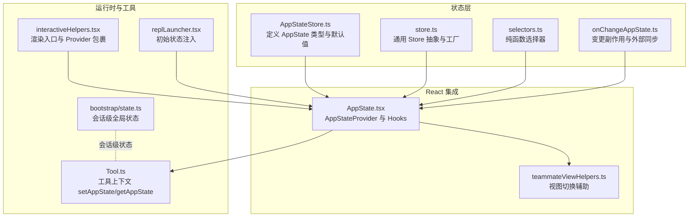
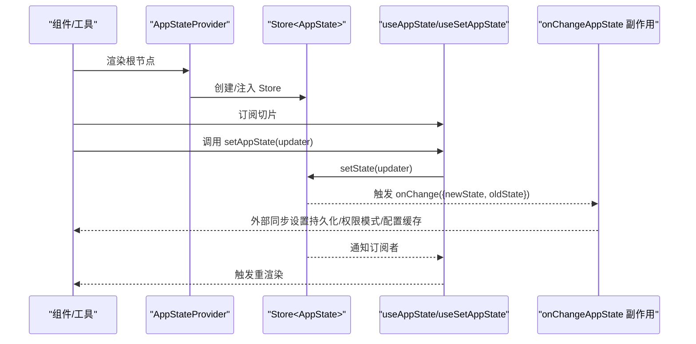
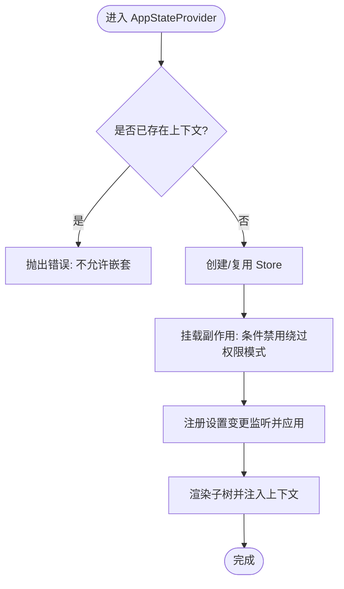
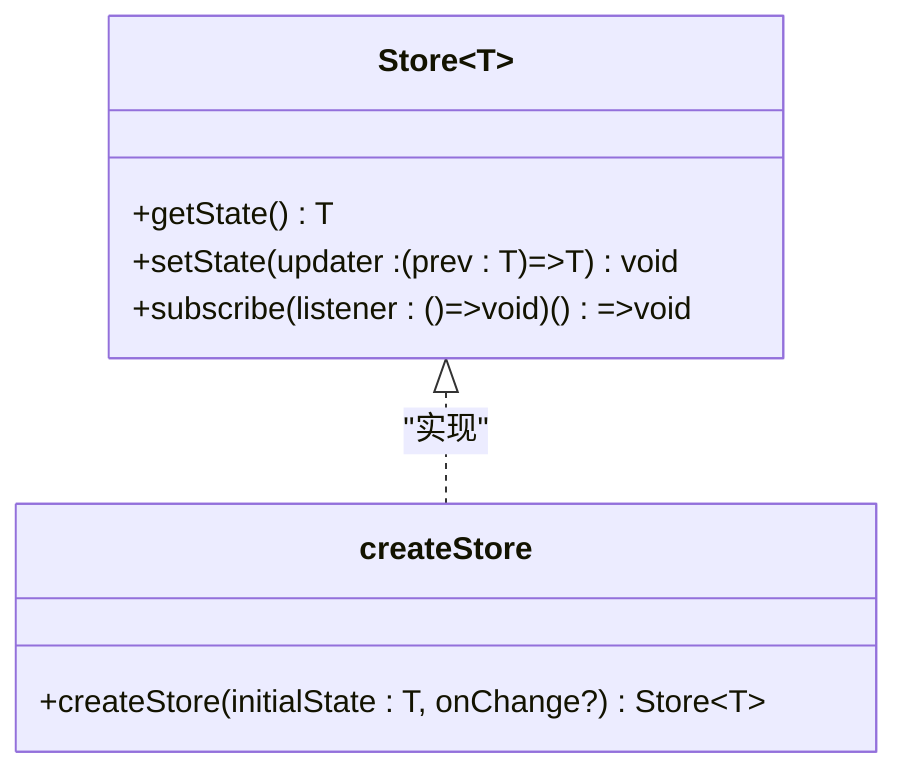
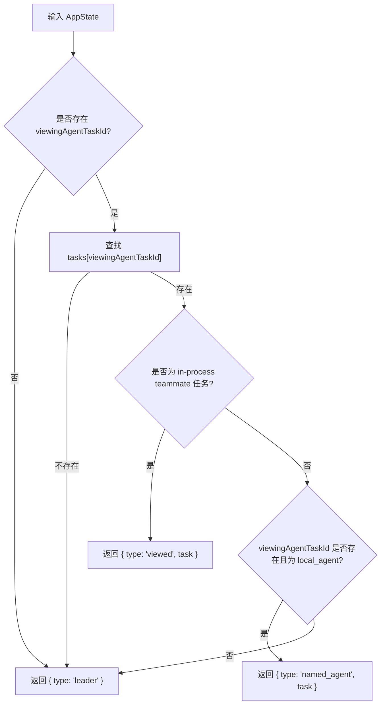
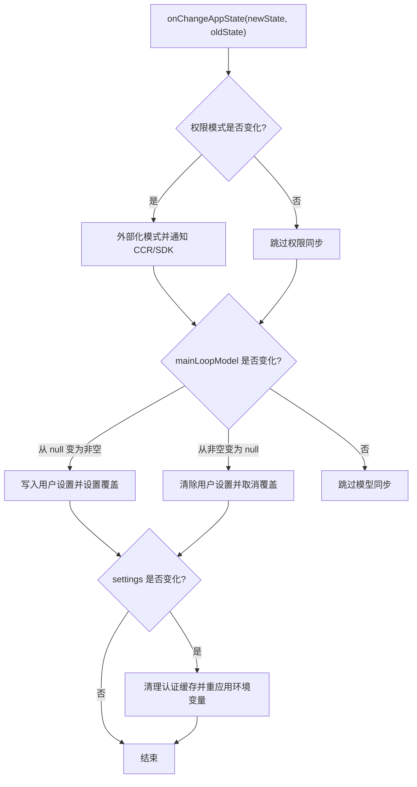
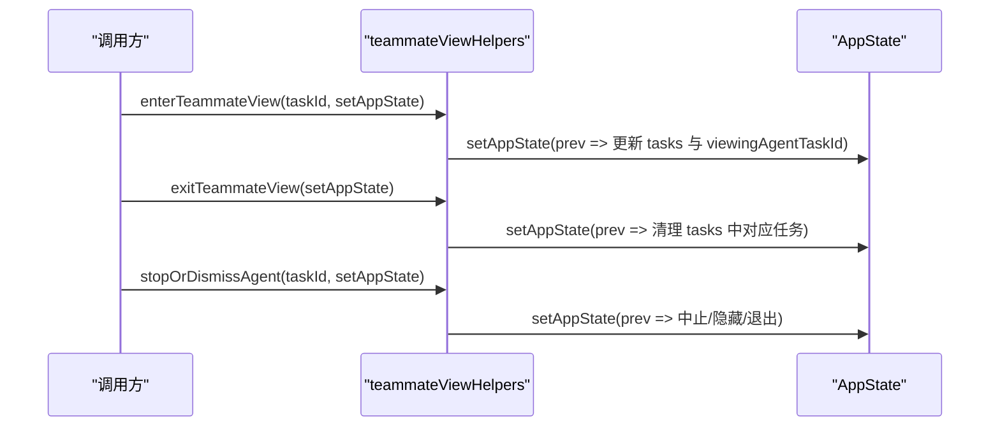
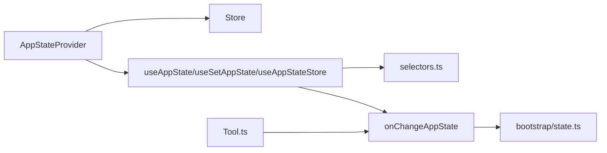

# 状态管理与数据流

<cite>
**本文引用的文件**
- [src/state/AppState.tsx](file://src/state/AppState.tsx)
- [src/state/AppStateStore.ts](file://src/state/AppStateStore.ts)
- [src/state/store.ts](file://src/state/store.ts)
- [src/state/selectors.ts](file://src/state/selectors.ts)
- [src/state/onChangeAppState.ts](file://src/state/onChangeAppState.ts)
- [src/state/teammateViewHelpers.ts](file://src/state/teammateViewHelpers.ts)
- [src/bootstrap/state.ts](file://src/bootstrap/state.ts)
- [src/interactiveHelpers.tsx](file://src/interactiveHelpers.tsx)
- [src/replLauncher.tsx](file://src/replLauncher.tsx)
- [src/Tool.ts](file://src/Tool.ts)
</cite>

## 目录
1. [引言](#引言)
2. [项目结构](#项目结构)
3. [核心组件](#核心组件)
4. [架构总览](#架构总览)
5. [详细组件分析](#详细组件分析)
6. [依赖关系分析](#依赖关系分析)
7. [性能考量](#性能考量)
8. [故障排查指南](#故障排查指南)
9. [结论](#结论)
10. [附录](#附录)

## 引言
本文件系统性梳理 Claude Code 的状态管理与数据流，重点覆盖以下方面：
- AppState 架构设计：状态模型、默认值、类型约束与不可变性策略
- 状态存储机制：自研 Store 实现、订阅与通知、变更传播
- 状态选择器（selectors）：纯函数式派生、输入裁剪与组合
- 全局状态与组件状态的协调：Provider 模式、useAppState/useSetAppState/useAppStateStore 的职责边界
- 数据流模式：订阅、派发与同步（含 onChange 回调）
- 最佳实践、性能优化与调试方法
- 状态持久化、重置与迁移方案

## 项目结构
状态管理相关代码集中在 src/state 目录，并与启动态（bootstrap/state.ts）及工具上下文（Tool.ts）紧密协作：
- 状态定义与默认值：AppStateStore.ts
- Provider 与 Hooks：AppState.tsx
- Store 抽象与工厂：store.ts
- 选择器：selectors.ts
- 全局状态变更副作用：onChangeAppState.ts
- 视图切换辅助：teammateViewHelpers.ts
- 启动期会话态：bootstrap/state.ts
- 使用入口：interactiveHelpers.tsx、replLauncher.tsx、Tool.ts

图表来源
- [src/state/AppState.tsx:1-200](file://src/state/AppState.tsx#L1-L200)
- [src/state/AppStateStore.ts:89-454](file://src/state/AppStateStore.ts#L89-L454)
- [src/state/store.ts:1-35](file://src/state/store.ts#L1-L35)
- [src/state/selectors.ts:1-77](file://src/state/selectors.ts#L1-L77)
- [src/state/onChangeAppState.ts:43-171](file://src/state/onChangeAppState.ts#L43-L171)
- [src/state/teammateViewHelpers.ts:46-141](file://src/state/teammateViewHelpers.ts#L46-L141)
- [src/bootstrap/state.ts:45-257](file://src/bootstrap/state.ts#L45-L257)
- [src/interactiveHelpers.tsx:18-123](file://src/interactiveHelpers.tsx#L18-L123)
- [src/replLauncher.tsx:12-22](file://src/replLauncher.tsx#L12-L22)
- [src/Tool.ts:158-191](file://src/Tool.ts#L158-L191)

章节来源
- [src/state/AppState.tsx:1-200](file://src/state/AppState.tsx#L1-L200)
- [src/state/AppStateStore.ts:89-454](file://src/state/AppStateStore.ts#L89-L454)
- [src/state/store.ts:1-35](file://src/state/store.ts#L1-L35)
- [src/state/selectors.ts:1-77](file://src/state/selectors.ts#L1-L77)
- [src/state/onChangeAppState.ts:43-171](file://src/state/onChangeAppState.ts#L43-L171)
- [src/state/teammateViewHelpers.ts:46-141](file://src/state/teammateViewHelpers.ts#L46-L141)
- [src/bootstrap/state.ts:45-257](file://src/bootstrap/state.ts#L45-L257)
- [src/interactiveHelpers.tsx:18-123](file://src/interactiveHelpers.tsx#L18-L123)
- [src/replLauncher.tsx:12-22](file://src/replLauncher.tsx#L12-L22)
- [src/Tool.ts:158-191](file://src/Tool.ts#L158-L191)

## 核心组件
- AppStateProvider 与 Hooks
  - 提供全局状态上下文，确保不嵌套；在挂载时处理“绕过权限模式”等条件性禁用逻辑；通过 useSettingsChange 将设置变更同步到 AppState
  - 提供 useAppState、useSetAppState、useAppStateStore 三类 Hook，分别用于订阅切片、获取更新器、直接访问 Store
- Store 抽象
  - 提供 getState、setState、subscribe 三件套；支持 onChange 回调；基于 Object.is 做浅比较去重
- AppState 与默认值
  - 定义了丰富的领域状态（任务、插件、通知、MCP、代理团队、桥接状态、提示建议、推测等），并提供 getDefaultAppState
- 选择器
  - 纯函数派生：如 getViewedTeammateTask、getActiveAgentForInput，避免在组件中重复计算
- 变更副作用
  - onChangeAppState 统一处理权限模式同步、设置持久化、配置缓存清理与环境变量重应用、UI 状态持久化等

章节来源
- [src/state/AppState.tsx:37-110](file://src/state/AppState.tsx#L37-L110)
- [src/state/AppState.tsx:117-200](file://src/state/AppState.tsx#L117-L200)
- [src/state/store.ts:10-34](file://src/state/store.ts#L10-L34)
- [src/state/AppStateStore.ts:456-570](file://src/state/AppStateStore.ts#L456-L570)
- [src/state/selectors.ts:18-77](file://src/state/selectors.ts#L18-L77)
- [src/state/onChangeAppState.ts:43-171](file://src/state/onChangeAppState.ts#L43-L171)

## 架构总览
下图展示从渲染入口到状态变更再到外部同步的整体流程。

图表来源
- [src/state/AppState.tsx:37-110](file://src/state/AppState.tsx#L37-L110)
- [src/state/store.ts:20-27](file://src/state/store.ts#L20-L27)
- [src/state/onChangeAppState.ts:43-92](file://src/state/onChangeAppState.ts#L43-L92)

## 详细组件分析

### AppStateProvider 与 Hooks
- 设计要点
  - 单一 Store 上下文，禁止嵌套；挂载时检查并按需禁用“绕过权限模式”
  - 通过 useSettingsChange 将设置变更应用到 AppState，保证文件监听等外部变更可传播
  - useAppState 基于 useSyncExternalStore 订阅切片；严格禁止返回原状态对象，避免误触发重渲染
  - useSetAppState 返回稳定引用，仅用于派发，不订阅任何状态
  - useAppStateStore 直接暴露 Store，便于非 React 场景使用
  - useAppStateMaybeOutsideOfProvider 在 Provider 外安全降级返回 undefined
- 关键行为
  - setState 前后进行 Object.is 比较，相等则短路
  - onChange 回调在每次有效变更时触发，用于跨进程/外部通道同步

图表来源
- [src/state/AppState.tsx:37-110](file://src/state/AppState.tsx#L37-L110)

章节来源
- [src/state/AppState.tsx:37-110](file://src/state/AppState.tsx#L37-L110)
- [src/state/AppState.tsx:117-200](file://src/state/AppState.tsx#L117-L200)

### Store 抽象与工厂
- 设计要点
  - Store<T> 暴露 getState、setState、subscribe
  - setState 内部对 updater 结果做 Object.is 比较，相同则不更新
  - 订阅者集合采用 Set，支持添加/移除
  - onChange 回调在每次有效更新后触发
- 性能特性
  - 去重更新避免无意义重渲染
  - 订阅粒度细，组件仅订阅所需切片

图表来源
- [src/state/store.ts:4-8](file://src/state/store.ts#L4-L8)
- [src/state/store.ts:10-34](file://src/state/store.ts#L10-L34)

章节来源
- [src/state/store.ts:10-34](file://src/state/store.ts#L10-L34)

### AppState 与默认值
- 设计要点
  - AppState 采用 DeepImmutable 包裹，但任务状态等包含函数类型，故排除在外
  - 默认值由 getDefaultAppState 生成，统一初始化权限模式、桥接状态、通知、提示建议、推测等
  - 大量字段覆盖任务、插件、MCP、团队、桥接、浏览器工具、Tungsten 面板、Fast/Ultraplan 模式等
- 与会话态的关系
  - bootstrap/state.ts 提供会话级全局状态（如成本、令牌用量、交互时间、计划缓存等），与 AppState 并行存在，互不干扰

```mermaid
erDiagram
APP_STATE {
json settings
boolean verbose
string mainLoopModel
string mainLoopModelForSession
string statusLineText
enum expandedView
boolean isBriefOnly
number selectedIPAgentIndex
number coordinatorTaskIndex
enum viewSelectionMode
enum footerSelection
object toolPermissionContext
string agent
boolean kairosEnabled
string remoteSessionUrl
enum remoteConnectionStatus
number remoteBackgroundTaskCount
boolean replBridgeEnabled
boolean replBridgeExplicit
boolean replBridgeOutboundOnly
boolean replBridgeConnected
boolean replBridgeSessionActive
boolean replBridgeReconnecting
string replBridgeConnectUrl
string replBridgeSessionUrl
string replBridgeEnvironmentId
string replBridgeSessionId
string replBridgeError
string replBridgeInitialName
boolean showRemoteCallout
map agentNameRegistry
string foregroundedTaskId
string viewingAgentTaskId
string companionReaction
number companionPetAt
object mcp
object plugins
object agentDefinitions
object fileHistory
object attribution
map todos
array remoteAgentTaskSuggestions
object notifications
object elicitation
boolean thinkingEnabled
boolean promptSuggestionEnabled
object sessionHooks
object tungstenPanel
boolean bagelActive
string bagelUrl
boolean bagelPanelVisible
object computerUseMcpState
object replContext
object teamContext
object standaloneAgentContext
object inbox
object workerSandboxPermissions
object pendingWorkerRequest
object pendingSandboxRequest
object promptSuggestion
object speculation
number speculationSessionTimeSavedMs
object skillImprovement
number authVersion
object initialMessage
object pendingPlanVerification
object denialTracking
set activeOverlays
boolean fastMode
string advisorModel
object effortValue
boolean ultraplanLaunching
string ultraplanSessionUrl
object ultraplanPendingChoice
object ultraplanLaunchPending
boolean isUltraplanMode
object replBridgePermissionCallbacks
object channelPermissionCallbacks
}
```

图表来源
- [src/state/AppStateStore.ts:89-452](file://src/state/AppStateStore.ts#L89-L452)

章节来源
- [src/state/AppStateStore.ts:89-452](file://src/state/AppStateStore.ts#L89-L452)
- [src/state/AppStateStore.ts:456-570](file://src/state/AppStateStore.ts#L456-L570)
- [src/bootstrap/state.ts:45-257](file://src/bootstrap/state.ts#L45-L257)

### 选择器（Selectors）
- 设计原则
  - 纯函数、无副作用、只做数据提取与简单组合
  - 输入尽量裁剪，避免不必要的对象新建
- 示例
  - getViewedTeammateTask：从 viewingAgentTaskId 与 tasks 中安全提取当前视图中的同伴任务
  - getActiveAgentForInput：根据当前视图与任务类型决定输入路由目标（leader/viewed/named_agent）

图表来源
- [src/state/selectors.ts:18-77](file://src/state/selectors.ts#L18-L77)

章节来源
- [src/state/selectors.ts:18-77](file://src/state/selectors.ts#L18-L77)

### 全局状态变更与同步（onChangeAppState）
- 设计要点
  - 权限模式变更的单点同步：对外部元数据（CCR/SDK）与 SDK 状态流进行通知
  - 设置变更的持久化与缓存清理：当 settings 变更时，清理认证缓存并重新应用环境变量
  - UI 状态持久化：expandedView 映射到全局配置项；verbose、tungstenPanelVisible 等同步
  - 主循环模型变更：当 mainLoopModel 从 null 变为非空或反之，同步到用户设置与覆盖
- 适用场景
  - 任意 setAppState 路径上的变更都会触发该回调，确保外部一致性

图表来源
- [src/state/onChangeAppState.ts:43-171](file://src/state/onChangeAppState.ts#L43-L171)

章节来源
- [src/state/onChangeAppState.ts:43-171](file://src/state/onChangeAppState.ts#L43-L171)

### 视图切换与状态迁移（teammateViewHelpers）
- 设计要点
  - enterTeammateView：进入同伴视图时保留任务、清空消息、阻断回收；支持在不同本地代理任务间切换
  - exitTeammateView：退出时释放回桩状态（retain=false、消息清空、按终端状态调度回收）
  - stopOrDismissAgent：根据任务状态执行中止或立即隐藏；若正在查看该代理则自动退出
- 与 AppState 的交互
  - 通过 setAppState 执行不可变更新，避免重复渲染

图表来源
- [src/state/teammateViewHelpers.ts:46-141](file://src/state/teammateViewHelpers.ts#L46-L141)

章节来源
- [src/state/teammateViewHelpers.ts:46-141](file://src/state/teammateViewHelpers.ts#L46-L141)

### 与工具上下文的集成（Tool.ts）
- 设计要点
  - 工具上下文提供 getAppState/setAppState 接口，贯穿所有工具执行链
  - 子代理上下文提供“始终可达”的 setAppState，确保深层异步任务仍可影响根状态
- 使用建议
  - 在工具内部优先使用 setAppState 的不可变更新；必要时通过 onChangeAppState 进行跨进程同步

章节来源
- [src/Tool.ts:158-191](file://src/Tool.ts#L158-L191)

### 渲染入口与初始状态注入
- interactiveHelpers.tsx
  - 通过 AppStateProvider 包裹主 UI，注入 onChangeAppState，确保渲染期即建立状态同步通道
- replLauncher.tsx
  - 将初始 AppState 注入 App 组件，作为 Provider 的 initialState 参数

章节来源
- [src/interactiveHelpers.tsx:18-123](file://src/interactiveHelpers.tsx#L18-L123)
- [src/replLauncher.tsx:12-22](file://src/replLauncher.tsx#L12-L22)

## 依赖关系分析
- Provider 与 Store
  - AppStateProvider 依赖 createStore 与 getDefaultAppState；通过 useSyncExternalStore 订阅 Store
- 选择器与 Provider
  - 选择器在组件内被 useAppState 调用，仅依赖 AppState 切片
- 副作用与外部系统
  - onChangeAppState 与 bootstrap/state.ts 解耦：前者专注 AppState 变更后的副作用，后者专注会话级全局状态
- 工具与状态
  - Tool.ts 的 setAppState 与 onChangeAppState 形成闭环，确保工具执行链与 UI 同步

图表来源
- [src/state/AppState.tsx:37-110](file://src/state/AppState.tsx#L37-L110)
- [src/state/store.ts:10-34](file://src/state/store.ts#L10-L34)
- [src/state/selectors.ts:18-77](file://src/state/selectors.ts#L18-L77)
- [src/state/onChangeAppState.ts:43-171](file://src/state/onChangeAppState.ts#L43-L171)
- [src/bootstrap/state.ts:45-257](file://src/bootstrap/state.ts#L45-L257)
- [src/Tool.ts:158-191](file://src/Tool.ts#L158-L191)

章节来源
- [src/state/AppState.tsx:37-110](file://src/state/AppState.tsx#L37-L110)
- [src/state/store.ts:10-34](file://src/state/store.ts#L10-L34)
- [src/state/selectors.ts:18-77](file://src/state/selectors.ts#L18-L77)
- [src/state/onChangeAppState.ts:43-171](file://src/state/onChangeAppState.ts#L43-L171)
- [src/bootstrap/state.ts:45-257](file://src/bootstrap/state.ts#L45-L257)
- [src/Tool.ts:158-191](file://src/Tool.ts#L158-L191)

## 性能考量
- 订阅粒度与去重
  - 使用 useSyncExternalStore 与 Object.is 去重，避免无效重渲染
  - 选择器应返回现有对象引用而非新建对象，防止误判变化
- setState 优化
  - updater 应返回新对象；若结果与旧值相同，Store 将短路，不触发订阅者回调
- 外部同步成本
  - onChangeAppState 中的设置持久化、缓存清理与环境变量重应用应保持幂等与最小化 IO
- 会话级状态隔离
  - bootstrap/state.ts 与 AppState 并行存在，避免将会话统计等状态混入 UI 状态树

## 故障排查指南
- Provider 嵌套报错
  - 症状：在已有 AppStateProvider 下再次包裹
  - 处理：确保仅有一层 Provider；检查渲染入口与对话框包装
- 未在 Provider 内使用 Hooks
  - 症状：useAppState/useSetAppState 抛出引用错误
  - 处理：确认组件树最外层包裹了 AppStateProvider
- 选择器返回原状态
  - 症状：useAppState 抛出错误，提示返回原状态
  - 处理：确保选择器返回 AppState 的某个子引用，而非直接返回原状态对象
- 设置变更未生效
  - 症状：修改设置后未触发持久化或缓存清理
  - 处理：确认 onChangeAppState 正常触发；检查 settings 字段是否真正变化
- 权限模式不同步
  - 症状：CLI 与网页 UI/SDK 状态不一致
  - 处理：确认 onChangeAppState 中权限模式外部化逻辑是否执行；检查 isUltraplanMode 的切换时机

章节来源
- [src/state/AppState.tsx:117-200](file://src/state/AppState.tsx#L117-L200)
- [src/state/onChangeAppState.ts:43-171](file://src/state/onChangeAppState.ts#L43-L171)

## 结论
本状态管理体系以轻量 Store 抽象为核心，结合 React Hooks 与纯函数选择器，实现了高内聚、低耦合的状态管理：
- Provider 层负责上下文注入与副作用触发
- Store 层负责状态存储与订阅分发
- 选择器层负责数据派生与渲染优化
- onChangeAppState 保障了与外部系统的同步一致性
配合严格的去重与最小化渲染策略，整体具备良好的性能与可维护性。

## 附录
- 状态持久化
  - 通过 onChangeAppState 将关键状态映射到全局配置（如 expandedView、verbose、tungstenPanelVisible）并持久化
- 状态重置
  - getDefaultAppState 提供完整默认值；可通过 setAppState 一次性重置
- 状态迁移
  - 通过 onChangeAppState 的 externalMetadataToAppState 将外部元数据反向注入 AppState，实现跨进程状态迁移

章节来源
- [src/state/onChangeAppState.ts:24-41](file://src/state/onChangeAppState.ts#L24-L41)
- [src/state/AppStateStore.ts:456-570](file://src/state/AppStateStore.ts#L456-L570)