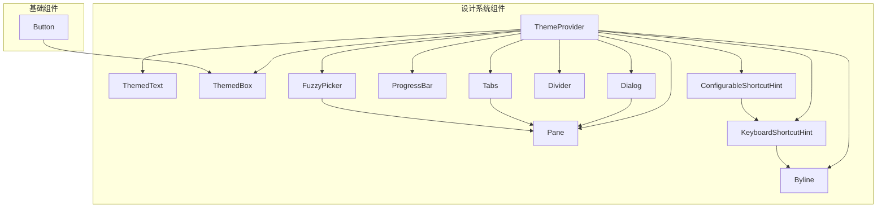
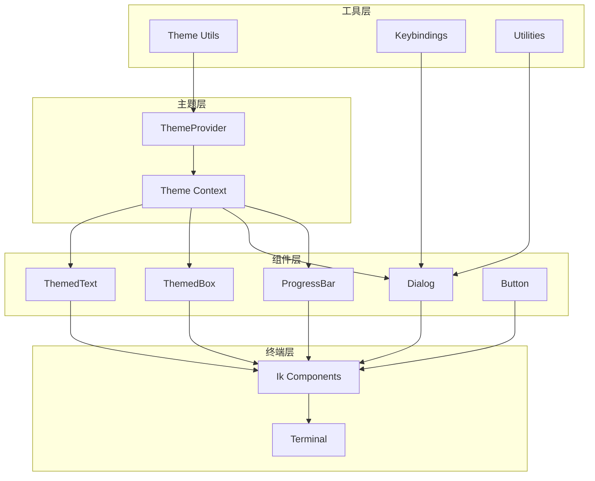
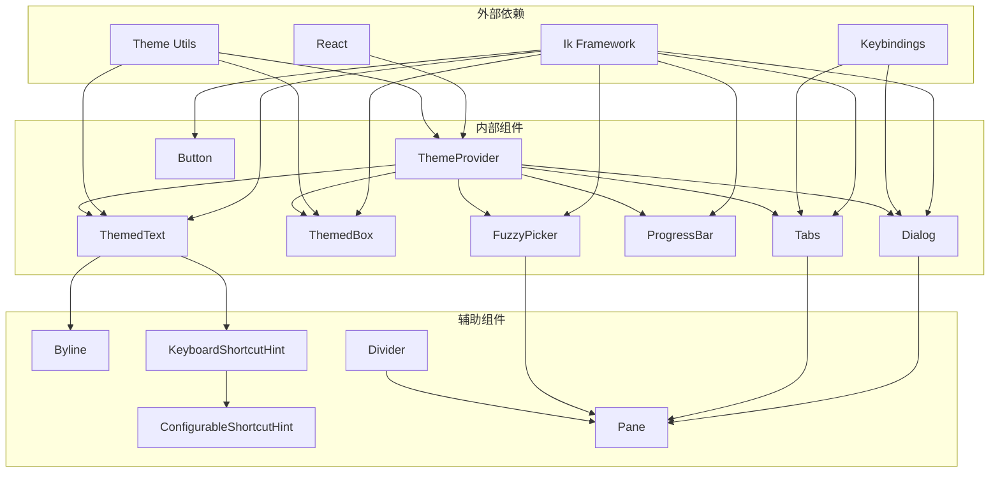

# 设计系统组件

<cite>
**本文档引用的文件**
- [ThemeProvider.tsx](file://src/components/design-system/ThemeProvider.tsx)
- [ThemedText.tsx](file://src/components/design-system/ThemedText.tsx)
- [ThemedBox.tsx](file://src/components/design-system/ThemedBox.tsx)
- [Dialog.tsx](file://src/components/design-system/Dialog.tsx)
- [Button.tsx](file://src/ink/components/Button.tsx)
- [ProgressBar.tsx](file://src/components/design-system/ProgressBar.tsx)
- [Pane.tsx](file://src/components/design-system/Pane.tsx)
- [Byline.tsx](file://src/components/design-system/Byline.tsx)
- [KeyboardShortcutHint.tsx](file://src/components/design-system/KeyboardShortcutHint.tsx)
- [ConfigurableShortcutHint.tsx](file://src/components/ConfigurableShortcutHint.tsx)
- [Divider.tsx](file://src/components/design-system/Divider.tsx)
- [Tabs.tsx](file://src/components/design-system/Tabs.tsx)
- [FuzzyPicker.tsx](file://src/components/design-system/FuzzyPicker.tsx)
</cite>

## 目录
1. [简介](#简介)
2. [项目结构](#项目结构)
3. [核心组件](#核心组件)
4. [架构概览](#架构概览)
5. [组件详细分析](#组件详细分析)
6. [依赖关系分析](#依赖关系分析)
7. [性能考虑](#性能考虑)
8. [故障排除指南](#故障排除指南)
9. [结论](#结论)
10. [附录](#附录)

## 简介

Claude Code 的设计系统组件是一套专为终端界面设计的 UI 组件库，基于 React 和 Ink 构建。该系统提供了从基础文本和容器组件到复杂交互组件的完整解决方案，支持主题化、可访问性和响应式设计。

设计系统的核心目标是：
- 提供一致的视觉语言和交互体验
- 支持深色/浅色主题自动切换
- 实现键盘导航和无障碍访问
- 确保在不同终端环境中的兼容性
- 提供高度可定制的主题系统

## 项目结构

设计系统组件主要位于 `src/components/design-system/` 目录下，采用模块化组织方式：

**图表来源**
- [ThemeProvider.tsx:1-170](file://src/components/design-system/ThemeProvider.tsx#L1-L170)
- [Button.tsx:1-192](file://src/ink/components/Button.tsx#L1-L192)

**章节来源**
- [ThemeProvider.tsx:1-170](file://src/components/design-system/ThemeProvider.tsx#L1-L170)
- [ThemedText.tsx:1-124](file://src/components/design-system/ThemedText.tsx#L1-L124)
- [ThemedBox.tsx:1-156](file://src/components/design-system/ThemedBox.tsx#L1-L156)

## 核心组件

### 主题提供器（ThemeProvider）

ThemeProvider 是整个设计系统的核心，负责管理主题状态和提供主题上下文。

**关键特性：**
- 支持手动选择和自动检测主题
- 实时监听终端主题变化
- 预览功能用于临时主题切换
- 持久化用户偏好设置

**主题状态管理：**
- `themeSetting`: 用户当前选择的主题设置
- `currentTheme`: 实际应用的主题（解析后的具体主题）
- `previewTheme`: 预览状态的主题

**章节来源**
- [ThemeProvider.tsx:8-28](file://src/components/design-system/ThemeProvider.tsx#L8-L28)
- [ThemeProvider.tsx:43-116](file://src/components/design-system/ThemeProvider.tsx#L43-L116)

### 文本组件（ThemedText）

ThemedText 是主题感知的文本组件，支持多种样式属性和颜色解析。

**属性接口：**
- `color`: 文本颜色（支持主题键或原始颜色值）
- `backgroundColor`: 背景色（仅支持主题键）
- `dimColor`: 是否使用弱化颜色
- `bold`: 粗体显示
- `italic`: 斜体显示
- `underline`: 下划线
- `strikethrough`: 删除线
- `inverse`: 反转颜色
- `wrap`: 文本换行控制

**颜色解析机制：**
组件能够智能识别和解析不同类型的颜色值：
- 原始颜色值：`rgb()`, `#`, `ansi256()`, `ansi:`
- 主题键：通过 `getTheme()` 函数解析

**章节来源**
- [ThemedText.tsx:12-61](file://src/components/design-system/ThemedText.tsx#L12-L61)
- [ThemedText.tsx:66-74](file://src/components/design-system/ThemedText.tsx#L66-L74)

### 容器组件（ThemedBox）

ThemedBox 是主题感知的容器组件，提供边框和背景色的主题化支持。

**扩展属性：**
- `borderColor`: 边框颜色
- `borderTopColor`: 顶部边框颜色
- `borderBottomColor`: 底部边框颜色
- `borderLeftColor`: 左侧边框颜色
- `borderRightColor`: 右侧边框颜色
- `backgroundColor`: 背景颜色

**设计特点：**
- 自动处理边框颜色的主题解析
- 支持所有标准的 Ink Box 属性
- 保持与 Ink 组件的完全兼容性

**章节来源**
- [ThemedBox.tsx:12-20](file://src/components/design-system/ThemedBox.tsx#L12-L20)
- [ThemedBox.tsx:42-50](file://src/components/design-system/ThemedBox.tsx#L42-L50)

## 架构概览

设计系统的整体架构采用分层设计，确保组件间的松耦合和高内聚：

**图表来源**
- [ThemeProvider.tsx:1-170](file://src/components/design-system/ThemeProvider.tsx#L1-L170)
- [ThemedText.tsx:1-124](file://src/components/design-system/ThemedText.tsx#L1-L124)
- [ThemedBox.tsx:1-156](file://src/components/design-system/ThemedBox.tsx#L1-L156)

## 组件详细分析

### 对话框组件（Dialog）

Dialog 组件提供了完整的对话框解决方案，支持键盘导航和自定义输入提示。

**核心功能：**
- 自动注册确认/取消快捷键
- 动态输入提示生成
- 可选的边框装饰
- 支持自定义颜色主题

**键盘交互：**
- `Esc`: 取消操作
- `Enter`: 确认操作  
- `Ctrl+C/D`: 强制退出
- `Tab`: 在嵌入式输入字段中传递焦点

**章节来源**
- [Dialog.tsx:11-29](file://src/components/design-system/Dialog.tsx#L11-L29)
- [Dialog.tsx:30-137](file://src/components/design-system/Dialog.tsx#L30-L137)

### 按钮组件（Button）

Button 组件实现了无障碍的按钮交互，提供完整的状态管理和键盘支持。

**状态管理：**
- `focused`: 是否获得焦点
- `hovered`: 是否悬停
- `active`: 是否激活

**事件处理：**
- 键盘事件：`Enter`, `Space`, `Tab`
- 鼠标事件：点击、悬停、焦点变化
- 自动防抖处理

**章节来源**
- [Button.tsx:10-14](file://src/ink/components/Button.tsx#L10-L14)
- [Button.tsx:39-191](file://src/ink/components/Button.tsx#L39-L191)

### 进度条组件（ProgressBar）

ProgressBar 组件提供了精确的进度可视化，支持自定义颜色和宽度。

**渲染算法：**
1. 计算可见字符数量
2. 生成填充块（使用 Unicode 字符块）
3. 处理部分填充字符
4. 应用前景色和背景色

**字符集支持：**
- ` `, `▏`, `▎`, `▍`, `▌`, `▋`, `▊`, `▉`, `█`

**章节来源**
- [ProgressBar.tsx:5-25](file://src/components/design-system/ProgressBar.tsx#L5-L25)
- [ProgressBar.tsx:26-85](file://src/components/design-system/ProgressBar.tsx#L26-L85)

### 标签页组件（Tabs）

Tabs 组件提供了复杂的标签页管理功能，支持双向导航和内容预览。

**高级特性：**
- 双向滚动支持（向上/向下）
- 内容预览区域
- 键盘导航优化
- 响应式布局调整

**上下文管理：**
- `selectedTab`: 当前选中的标签
- `width`: 标签页宽度
- `headerFocused`: 头部焦点状态
- `registerOptIn`: 选项注册机制

**章节来源**
- [Tabs.tsx:48-65](file://src/components/design-system/Tabs.tsx#L48-L65)
- [Tabs.tsx:66-242](file://src/components/design-system/Tabs.tsx#L66-L242)

### 模糊搜索选择器（FuzzyPicker）

FuzzyPicker 提供了强大的搜索和选择功能，支持模糊匹配和实时过滤。

**核心功能：**
- 模糊搜索算法
- 实时结果过滤
- 键盘导航（上下箭头）
- Tab 键支持（自定义动作）
- 预览功能

**性能优化：**
- 可见项窗口化
- 动态高度计算
- 条件渲染优化

**章节来源**
- [FuzzyPicker.tsx:68-89](file://src/components/design-system/FuzzyPicker.tsx#L68-L89)
- [FuzzyPicker.tsx:225-307](file://src/components/design-system/FuzzyPicker.tsx#L225-L307)

## 依赖关系分析

设计系统的组件间存在清晰的依赖层次：

**图表来源**
- [ThemeProvider.tsx:1-8](file://src/components/design-system/ThemeProvider.tsx#L1-L8)
- [Dialog.tsx:1-11](file://src/components/design-system/Dialog.tsx#L1-L11)
- [Tabs.tsx:1-10](file://src/components/design-system/Tabs.tsx#L1-L10)

**章节来源**
- [ThemeProvider.tsx:1-10](file://src/components/design-system/ThemeProvider.tsx#L1-L10)
- [Dialog.tsx:1-11](file://src/components/design-system/Dialog.tsx#L1-L11)
- [Tabs.tsx:1-10](file://src/components/design-system/Tabs.tsx#L1-L10)

## 性能考虑

设计系统在性能方面采用了多项优化策略：

### 渲染优化
- 使用 React.memo 缓存机制减少不必要的重渲染
- 条件渲染避免空状态的组件创建
- 动态计算和缓存复杂计算结果

### 内存管理
- 及时清理事件监听器和定时器
- 合理使用 ref 和回调避免内存泄漏
- 组件卸载时的资源回收

### 主题切换优化
- 预览模式下的快速主题切换
- 自动检测时的最小化重新渲染
- 主题配置的持久化存储

## 故障排除指南

### 常见问题及解决方案

**主题不生效**
- 检查 ThemeProvider 包装层级
- 验证主题键的有效性
- 确认主题配置文件的正确性

**键盘事件冲突**
- 检查嵌套组件的事件处理
- 验证 keybinding 的优先级设置
- 确认焦点状态的正确传递

**渲染性能问题**
- 检查组件的 memo 化使用
- 优化大型列表的虚拟化
- 减少不必要的状态更新

**章节来源**
- [ThemeProvider.tsx:64-80](file://src/components/design-system/ThemeProvider.tsx#L64-L80)
- [Dialog.tsx:45-57](file://src/components/design-system/Dialog.tsx#L45-L57)

## 结论

Claude Code 的设计系统组件提供了一套完整、灵活且高性能的终端 UI 解决方案。通过主题提供器、主题化组件和交互组件的有机结合，实现了：

- **一致性**: 统一的设计语言和交互模式
- **可访问性**: 完善的键盘导航和无障碍支持
- **可定制性**: 灵活的主题系统和样式选项
- **性能**: 优化的渲染和内存管理
- **兼容性**: 跨平台的终端环境支持

这套设计系统为构建复杂的终端应用程序奠定了坚实的基础，支持从简单工具到复杂 IDE 的各种应用场景。

## 附录

### 组件组合模式

**基础组合模式：**
1. 使用 ThemeProvider 包装应用根组件
2. 在对话框中组合 Dialog、Pane 和其他组件
3. 利用 Byline 和 KeyboardShortcutHint 创建一致的提示系统
4. 通过 Tabs 管理多页面内容

**样式继承规则：**
- 子组件自动继承父级主题设置
- 显式属性优先于继承属性
- 颜色解析遵循从具体到通用的顺序

### 最佳实践指南

**主题使用：**
- 在应用入口处统一配置 ThemeProvider
- 使用语义化的主题键名
- 避免硬编码颜色值

**组件使用：**
- 优先使用主题化组件而非原生 Ink 组件
- 正确处理组件的生命周期和资源清理
- 提供适当的错误边界和降级方案

**可访问性：**
- 确保所有交互都有键盘替代方案
- 提供足够的对比度和可读性
- 实现适当的焦点管理和屏幕阅读器支持