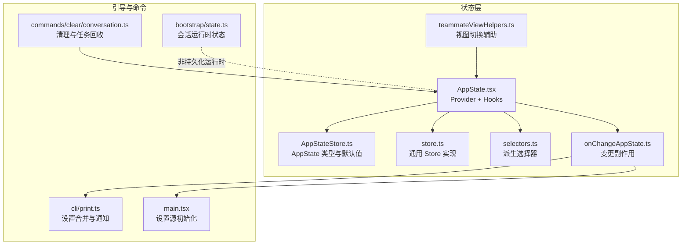
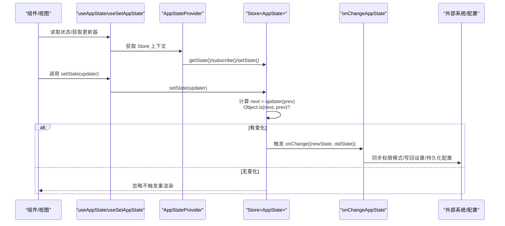
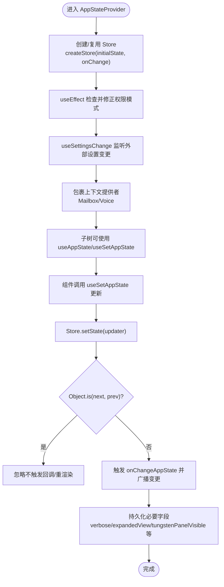
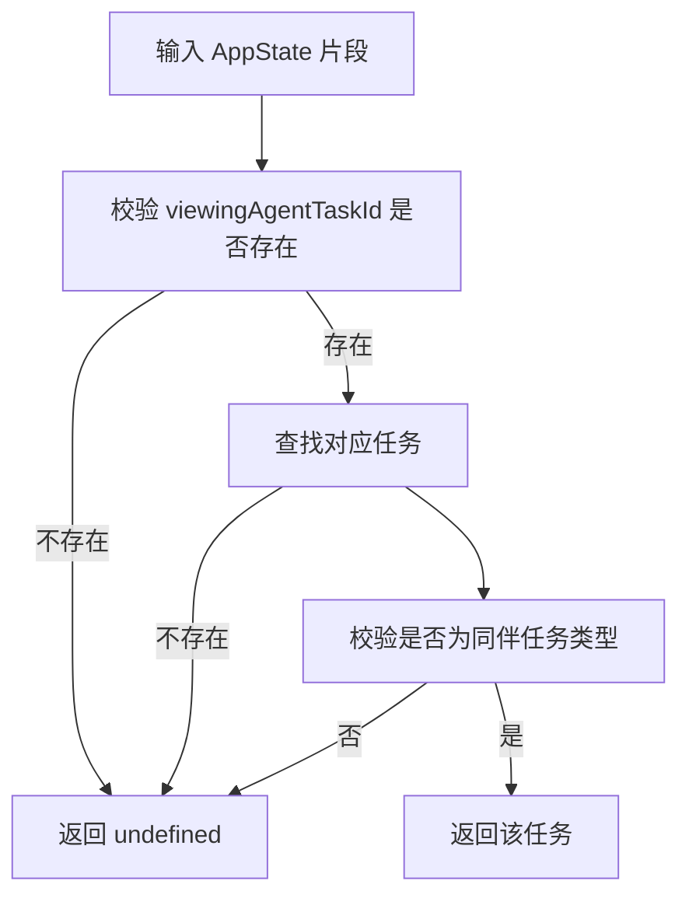
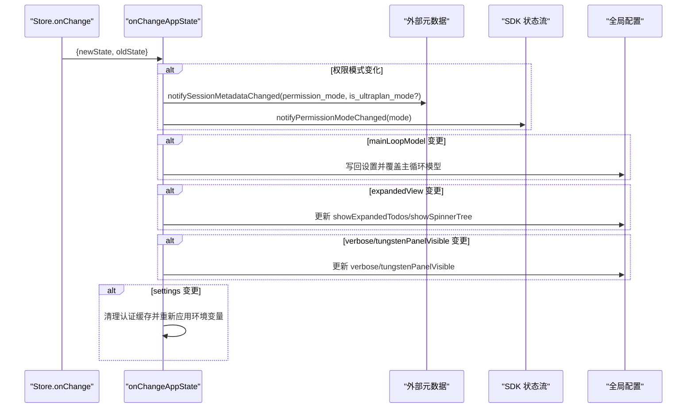
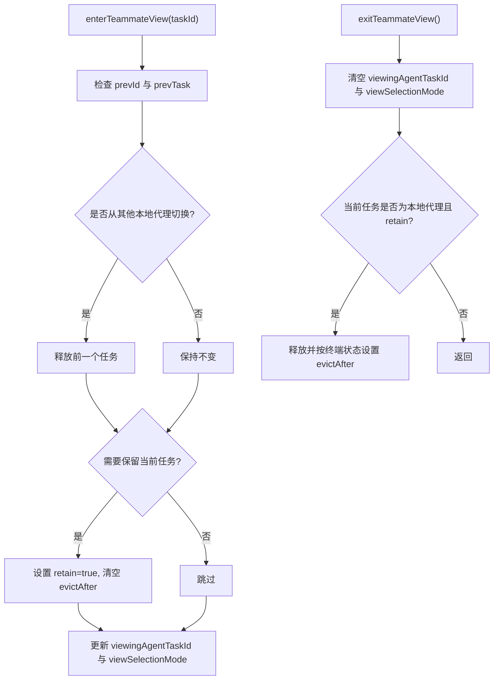
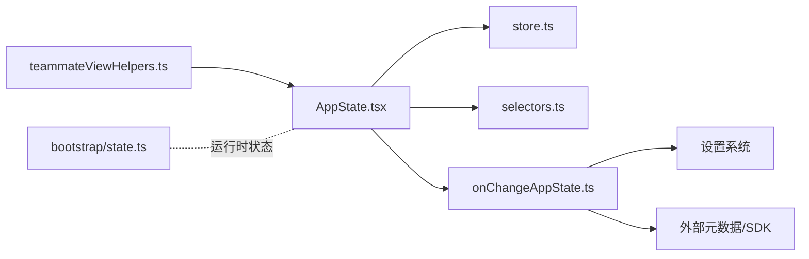
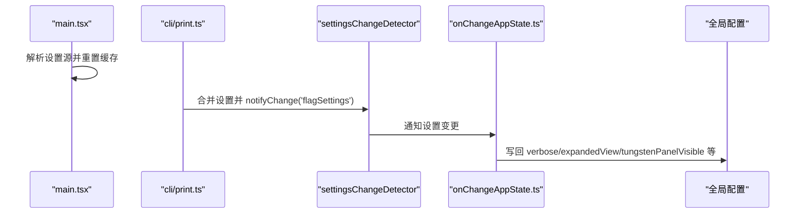

# 全局状态管理

<cite>
**本文引用的文件**
- [src/state/AppState.tsx](file://src/state/AppState.tsx)
- [src/state/AppStateStore.ts](file://src/state/AppStateStore.ts)
- [src/state/store.ts](file://src/state/store.ts)
- [src/state/selectors.ts](file://src/state/selectors.ts)
- [src/state/onChangeAppState.ts](file://src/state/onChangeAppState.ts)
- [src/state/teammateViewHelpers.ts](file://src/state/teammateViewHelpers.ts)
- [src/bootstrap/state.ts](file://src/bootstrap/state.ts)
- [src/commands/clear/conversation.ts](file://src/commands/clear/conversation.ts)
- [src/cli/print.ts](file://src/cli/print.ts)
- [src/main.tsx](file://src/main.tsx)
</cite>

## 目录
1. [简介](#简介)
2. [项目结构](#项目结构)
3. [核心组件](#核心组件)
4. [架构总览](#架构总览)
5. [详细组件分析](#详细组件分析)
6. [依赖关系分析](#依赖关系分析)
7. [性能考量](#性能考量)
8. [故障排查指南](#故障排查指南)
9. [结论](#结论)
10. [附录](#附录)

## 简介
本文件系统性阐述 Claude Code 的全局状态管理体系，重点覆盖以下方面：
- 状态树结构与职责边界：AppState 的字段组织、会话状态、用户偏好与系统配置的分层设计
- 状态更新机制：基于轻量 Store 的不可变更新、订阅通知与变更回调
- 订阅模式：useAppState/useSetAppState/useAppStateStore 的组合式订阅与稳定引用
- 状态选择器：纯函数派生逻辑、类型安全与性能优化建议
- 状态持久化：全局配置持久化、外部元数据同步、设置变更传播
- 最佳实践：更新模式、副作用处理、调试技巧
- 迁移与版本兼容：设置迁移脚本、版本演进策略

## 项目结构
状态管理相关代码集中在 src/state 目录，并与引导态（bootstrap）及命令系统协同工作：
- 状态容器与订阅：AppState.tsx 提供 Provider 与 hooks；store.ts 定义最小 Store 接口
- 应用状态模型：AppStateStore.ts 描述完整的 AppState 结构与默认值
- 变更监听与副作用：onChangeAppState.ts 将 AppState 变更映射到外部系统
- 选择器：selectors.ts 提供派生逻辑，避免在组件中重复计算
- 辅助工具：teammateViewHelpers.ts 展示如何以不可变方式更新复杂子树
- 引导态：bootstrap/state.ts 管理会话级运行时状态（非持久化）
- 命令集成：clear/conversation.ts、cli/print.ts、main.tsx 展示设置加载、变更与持久化的端到端流程

图表来源
- [src/state/AppState.tsx:37-110](file://src/state/AppState.tsx#L37-L110)
- [src/state/AppStateStore.ts:89-454](file://src/state/AppStateStore.ts#L89-L454)
- [src/state/store.ts:10-34](file://src/state/store.ts#L10-L34)
- [src/state/selectors.ts:1-77](file://src/state/selectors.ts#L1-L77)
- [src/state/onChangeAppState.ts:43-171](file://src/state/onChangeAppState.ts#L43-L171)
- [src/state/teammateViewHelpers.ts:46-109](file://src/state/teammateViewHelpers.ts#L46-L109)
- [src/bootstrap/state.ts:45-257](file://src/bootstrap/state.ts#L45-L257)
- [src/commands/clear/conversation.ts:135-166](file://src/commands/clear/conversation.ts#L135-L166)
- [src/cli/print.ts:3704-3729](file://src/cli/print.ts#L3704-L3729)
- [src/main.tsx:469-496](file://src/main.tsx#L469-L496)

章节来源
- [src/state/AppState.tsx:37-110](file://src/state/AppState.tsx#L37-L110)
- [src/state/AppStateStore.ts:89-454](file://src/state/AppStateStore.ts#L89-L454)
- [src/state/store.ts:10-34](file://src/state/store.ts#L10-L34)
- [src/state/selectors.ts:1-77](file://src/state/selectors.ts#L1-L77)
- [src/state/onChangeAppState.ts:43-171](file://src/state/onChangeAppState.ts#L43-L171)
- [src/state/teammateViewHelpers.ts:46-109](file://src/state/teammateViewHelpers.ts#L46-L109)
- [src/bootstrap/state.ts:45-257](file://src/bootstrap/state.ts#L45-L257)
- [src/commands/clear/conversation.ts:135-166](file://src/commands/clear/conversation.ts#L135-L166)
- [src/cli/print.ts:3704-3729](file://src/cli/print.ts#L3704-L3729)
- [src/main.tsx:469-496](file://src/main.tsx#L469-L496)

## 核心组件
- AppStateProvider 与 hooks
  - AppStateProvider 创建并注入 Store，负责：
    - 初始化 Store（支持传入 initialState 与 onChange 回调）
    - 在挂载时根据远程设置修正“绕过权限”模式
    - 统一监听外部设置变更并通过 applySettingsChange 同步到 AppState
    - 包裹 MailboxProvider/VoiceProvider，确保上下文链路完整
  - 提供 useAppState/useSetAppState/useAppStateStore/useAppStateMaybeOutsideOfProvider 等 hooks
- Store 与订阅
  - Store<T> 暴露 getState/setState/subscribe，内部以 Set 存储监听者
  - setState 使用 Object.is 判等去重，避免无意义渲染
  - onChange 回调在每次有效状态变更时触发
- AppState 模型与默认值
  - AppStateStore.ts 定义了完整的状态树，涵盖：
    - 用户偏好与界面控制：verbose、expandedView、footerSelection、spinnerTip、agent、thinkingEnabled、promptSuggestionEnabled 等
    - 会话与任务：tasks、foregroundedTaskId、viewingAgentTaskId、agentNameRegistry、remote* 相关字段
    - MCP 与插件：mcp、plugins、computerUseMcpState 等
    - 通知与提示：notifications、elicitation、todos、inbox 等
    - 思维与推测：speculation、speculationSessionTimeSavedMs、skillImprovement
    - 权限与桥接：toolPermissionContext、replBridge*、channelPermissionCallbacks
    - 认证与追踪：authVersion、initialMessage、denialTracking、activeOverlays、advisorModel、effortValue、ultraplan* 等
    - 默认值由 getDefaultAppState 提供，确保首次渲染一致性
- 选择器
  - selectors.ts 提供纯函数选择器，如 getViewedTeammateTask、getActiveAgentForInput，用于从 AppState 中派生视图所需的数据片段
- 变更监听与副作用
  - onChangeAppState 负责：
    - 将 toolPermissionContext.mode 同步到外部元数据（CCR/SDK），并处理 isUltraplanMode 的一次性标记
    - 将 mainLoopModel 的变更写回设置并覆盖主循环模型
    - 将 expandedView 映射到全局配置项（showExpandedTodos/showSpinnerTree）
    - 将 verbose、tungstenPanelVisible 等持久化到全局配置
    - settings 变更时清理认证缓存并重新应用环境变量
- 视图切换辅助
  - teammateViewHelpers.ts 展示如何以不可变方式更新 tasks、viewingAgentTaskId、viewSelectionMode，并对本地代理任务进行保留/释放控制

章节来源
- [src/state/AppState.tsx:37-110](file://src/state/AppState.tsx#L37-L110)
- [src/state/store.ts:10-34](file://src/state/store.ts#L10-L34)
- [src/state/AppStateStore.ts:89-454](file://src/state/AppStateStore.ts#L89-L454)
- [src/state/selectors.ts:1-77](file://src/state/selectors.ts#L1-L77)
- [src/state/onChangeAppState.ts:43-171](file://src/state/onChangeAppState.ts#L43-L171)
- [src/state/teammateViewHelpers.ts:46-109](file://src/state/teammateViewHelpers.ts#L46-L109)

## 架构总览
下图展示状态管理的端到端流程：组件通过 hooks 订阅 AppState，更新通过 setState 触发 onChange 回调，再将必要变更同步到外部系统或持久化层。

图表来源
- [src/state/AppState.tsx:142-163](file://src/state/AppState.tsx#L142-L163)
- [src/state/store.ts:20-27](file://src/state/store.ts#L20-L27)
- [src/state/onChangeAppState.ts:43-171](file://src/state/onChangeAppState.ts#L43-L171)

## 详细组件分析

### 组件 A：AppStateProvider 与订阅体系
- 设计要点
  - 单一 Store 注入，避免 Provider 嵌套
  - 在 mount 时检查并修正“绕过权限”模式，防止远程设置滞后导致状态不一致
  - 通过 useSettingsChange 监听外部设置变更，统一走 applySettingsChange 同步
  - useAppState 内部使用 useSyncExternalStore，确保与 React 严格模式兼容
- 订阅与渲染优化
  - useAppState 仅在选择器返回值变化时重渲染（Object.is）
  - 不要在选择器中返回新对象，应返回现有引用以避免误判
  - useSetAppState 返回稳定引用，避免因更新器变化导致的额外渲染
- 外部上下文
  - 包裹 MailboxProvider/VoiceProvider，保证消息与语音上下文可用

图表来源
- [src/state/AppState.tsx:37-110](file://src/state/AppState.tsx#L37-L110)
- [src/state/store.ts:20-27](file://src/state/store.ts#L20-L27)
- [src/state/onChangeAppState.ts:114-171](file://src/state/onChangeAppState.ts#L114-L171)

章节来源
- [src/state/AppState.tsx:37-110](file://src/state/AppState.tsx#L37-L110)
- [src/state/store.ts:10-34](file://src/state/store.ts#L10-L34)
- [src/state/onChangeAppState.ts:114-171](file://src/state/onChangeAppState.ts#L114-L171)

### 组件 B：AppState 模型与默认值
- 字段组织
  - 用户偏好与界面：verbose、expandedView、footerSelection、agent、thinkingEnabled、promptSuggestionEnabled 等
  - 会话与任务：tasks、foregroundedTaskId、viewingAgentTaskId、agentNameRegistry、remote* 系列
  - MCP/插件：mcp、plugins、computerUseMcpState
  - 通知与提示：notifications、elicitation、todos、inbox
  - 思维与推测：speculation、speculationSessionTimeSavedMs、skillImprovement
  - 权限与桥接：toolPermissionContext、replBridge*、channelPermissionCallbacks
  - 认证与追踪：authVersion、initialMessage、denialTracking、activeOverlays、advisorModel、effortValue、ultraplan*
- 默认值
  - getDefaultAppState 提供初始状态，确保首次渲染一致性与功能可用性

```mermaid
classDiagram
class AppState {
+settings
+verbose
+mainLoopModel
+mainLoopModelForSession
+statusLineText
+expandedView
+isBriefOnly
+selectedIPAgentIndex
+coordinatorTaskIndex
+viewSelectionMode
+footerSelection
+toolPermissionContext
+spinnerTip
+agent
+kairosEnabled
+remoteSessionUrl
+remoteConnectionStatus
+remoteBackgroundTaskCount
+replBridgeEnabled
+replBridgeExplicit
+replBridgeOutboundOnly
+replBridgeConnected
+replBridgeSessionActive
+replBridgeReconnecting
+replBridgeConnectUrl
+replBridgeSessionUrl
+replBridgeEnvironmentId
+replBridgeSessionId
+replBridgeError
+replBridgeInitialName
+showRemoteCallout
+tasks
+agentNameRegistry
+foregroundedTaskId
+viewingAgentTaskId
+companionReaction
+companionPetAt
+mcp
+plugins
+agentDefinitions
+fileHistory
+attribution
+todos
+remoteAgentTaskSuggestions
+notifications
+elicitation
+thinkingEnabled
+promptSuggestionEnabled
+sessionHooks
+tungstenActiveSession
+tungstenLastCapturedTime
+tungstenLastCommand
+tungstenPanelVisible
+tungstenPanelAutoHidden
+bagelActive
+bagelUrl
+bagelPanelVisible
+computerUseMcpState
+replContext
+teamContext
+standaloneAgentContext
+inbox
+workerSandboxPermissions
+pendingWorkerRequest
+pendingSandboxRequest
+promptSuggestion
+speculation
+speculationSessionTimeSavedMs
+skillImprovement
+authVersion
+initialMessage
+pendingPlanVerification
+denialTracking
+activeOverlays
+fastMode
+advisorModel
+effortValue
+ultraplanLaunching
+ultraplanSessionUrl
+ultraplanPendingChoice
+ultraplanLaunchPending
+isUltraplanMode
+replBridgePermissionCallbacks
+channelPermissionCallbacks
}
```

图表来源
- [src/state/AppStateStore.ts:89-454](file://src/state/AppStateStore.ts#L89-L454)

章节来源
- [src/state/AppStateStore.ts:89-454](file://src/state/AppStateStore.ts#L89-L454)

### 组件 C：选择器与派生逻辑
- 设计原则
  - 纯函数、无副作用、只做数据提取与简单转换
  - 输入尽量小（Pick<AppState, ...>），减少不必要的重算
- 示例
  - getViewedTeammateTask：从 viewingAgentTaskId 与 tasks 中安全提取当前查看的同伴任务
  - getActiveAgentForInput：根据当前视图与任务类型决定输入路由目标

图表来源
- [src/state/selectors.ts:18-40](file://src/state/selectors.ts#L18-L40)

章节来源
- [src/state/selectors.ts:1-77](file://src/state/selectors.ts#L1-L77)

### 组件 D：变更监听与外部同步
- 权限模式同步
  - 当 toolPermissionContext.mode 变化时，转换为外部模式并通知 CCR/SDK，同时处理 isUltraplanMode 的一次性标记
- 设置与模型同步
  - mainLoopModel 变更时写回设置并覆盖主循环模型
- 界面偏好持久化
  - expandedView 映射到全局配置项（showExpandedTodos/showSpinnerTree）
  - verbose、tungstenPanelVisible（ant 专用）写回全局配置
- 设置变更副作用
  - settings 变更时清理认证缓存并重新应用环境变量

图表来源
- [src/state/onChangeAppState.ts:43-171](file://src/state/onChangeAppState.ts#L43-L171)

章节来源
- [src/state/onChangeAppState.ts:43-171](file://src/state/onChangeAppState.ts#L43-L171)

### 组件 E：视图切换与任务生命周期
- 场景：进入/退出同伴视图、停止或移除代理任务
- 不可变更新：复制 tasks 并按需修改 retain/messages/evictAfter
- 事件埋点：进入/退出时记录日志事件
- 切换策略：若从另一个本地代理切换，先释放前一个任务

图表来源
- [src/state/teammateViewHelpers.ts:46-109](file://src/state/teammateViewHelpers.ts#L46-L109)

章节来源
- [src/state/teammateViewHelpers.ts:46-109](file://src/state/teammateViewHelpers.ts#L46-L109)

### 组件 F：会话运行时状态（非持久化）
- bootstrap/state.ts 管理会话期间的运行时状态，如：
  - 交互时间、成本统计、令牌用量、转轮钩子/分类器耗时
  - 会话标识、父会话标识、频道允许列表、提示缓存开关
  - tmux/面板可见性、慢操作跟踪、SDK beta 列表等
- 与 AppState 的关系
  - 两者职责分离：AppState 关注 UI/会话/任务等状态；bootstrap/state.ts 关注运行时指标与会话元信息
  - 通过 onChangeAppState 将部分状态（如权限模式）同步至外部系统

章节来源
- [src/bootstrap/state.ts:45-257](file://src/bootstrap/state.ts#L45-L257)
- [src/state/onChangeAppState.ts:43-92](file://src/state/onChangeAppState.ts#L43-L92)

## 依赖关系分析
- 组件耦合
  - AppStateProvider 依赖 Store、上下文提供者与设置变更监听
  - onChangeAppState 依赖设置系统、权限模式转换、外部元数据通知
  - selectors 依赖 AppState 与任务类型定义，保持纯函数特性
- 外部依赖
  - 设置系统：通过 settingsChangeDetector 与 applySettingsChange 实现集中式设置变更
  - 外部元数据：通过 notifySessionMetadataChanged/notifyPermissionModeChanged 与 CCR/SDK 同步
- 潜在风险
  - 选择器返回新对象会导致重渲染，应返回现有引用
  - onChangeAppState 中的副作用需谨慎，避免循环触发

图表来源
- [src/state/AppState.tsx:37-110](file://src/state/AppState.tsx#L37-L110)
- [src/state/store.ts:10-34](file://src/state/store.ts#L10-L34)
- [src/state/selectors.ts:1-77](file://src/state/selectors.ts#L1-L77)
- [src/state/onChangeAppState.ts:43-171](file://src/state/onChangeAppState.ts#L43-L171)
- [src/state/teammateViewHelpers.ts:46-109](file://src/state/teammateViewHelpers.ts#L46-L109)
- [src/bootstrap/state.ts:45-257](file://src/bootstrap/state.ts#L45-L257)

章节来源
- [src/state/AppState.tsx:37-110](file://src/state/AppState.tsx#L37-L110)
- [src/state/store.ts:10-34](file://src/state/store.ts#L10-L34)
- [src/state/selectors.ts:1-77](file://src/state/selectors.ts#L1-L77)
- [src/state/onChangeAppState.ts:43-171](file://src/state/onChangeAppState.ts#L43-L171)
- [src/state/teammateViewHelpers.ts:46-109](file://src/state/teammateViewHelpers.ts#L46-L109)
- [src/bootstrap/state.ts:45-257](file://src/bootstrap/state.ts#L45-L257)

## 性能考量
- 渲染优化
  - 使用 useAppState 的选择器返回现有引用，避免 Object.is 总是判定为不同
  - 对于多个字段，多次调用 useAppState，而非在单个选择器中返回复合对象
- 计算优化
  - 选择器保持纯函数，避免在其中执行昂贵计算；必要时结合 useMemo/useCallback
- 更新去抖
  - setState 已通过 Object.is 去重，避免无效渲染；仍建议合并多次更新
- 订阅粒度
  - 仅订阅必要的状态片段，减少订阅者数量与重渲染范围

## 故障排查指南
- “越界”错误：useAppState 选择器不应返回原始状态对象，否则会抛出错误
- 权限模式不同步：确认 onChangeAppState 是否被触发，以及外部元数据通知是否成功
- 设置未生效：检查 settingsChangeDetector.notifyChange 是否被调用，applySettingsChange 是否正确执行
- 清理会失效：清理会话时需正确处理前台任务的终止与输出回收

章节来源
- [src/state/AppState.tsx:126-153](file://src/state/AppState.tsx#L126-L153)
- [src/state/onChangeAppState.ts:43-92](file://src/state/onChangeAppState.ts#L43-L92)
- [src/commands/clear/conversation.ts:135-166](file://src/commands/clear/conversation.ts#L135-L166)

## 结论
本状态管理体系以轻量 Store 为核心，结合 Provider/Hook 模式与纯函数选择器，实现了高内聚、低耦合的状态管理方案。通过 onChangeAppState 将关键状态同步到外部系统与持久化层，既保证了功能一致性，又维持了良好的可维护性。遵循本文的最佳实践与注意事项，可在复杂场景中保持稳定的性能与可预测的行为。

## 附录

### 端到端设置加载与持久化流程
- main.tsx 初始化设置源并重置缓存
- cli/print.ts 合并远程设置并通过 settingsChangeDetector 通知变更
- onChangeAppState 将必要字段写回全局配置与外部系统

图表来源
- [src/main.tsx:469-496](file://src/main.tsx#L469-L496)
- [src/cli/print.ts:3704-3729](file://src/cli/print.ts#L3704-L3729)
- [src/state/onChangeAppState.ts:114-171](file://src/state/onChangeAppState.ts#L114-L171)