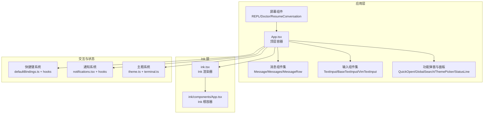
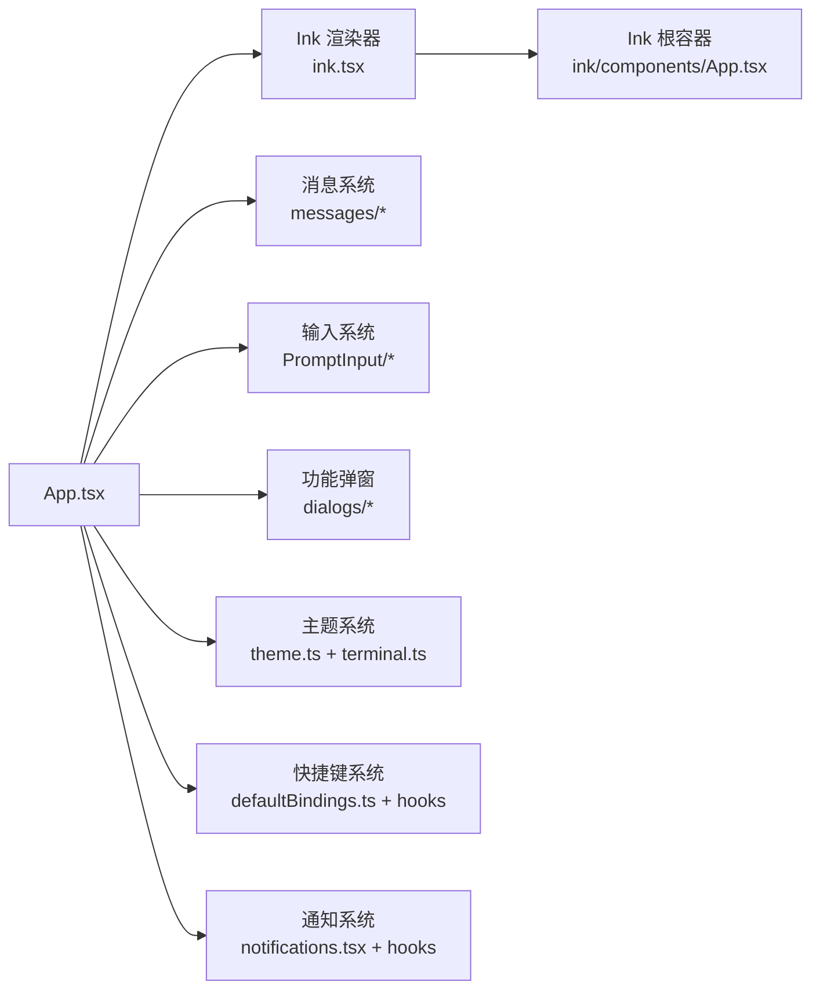
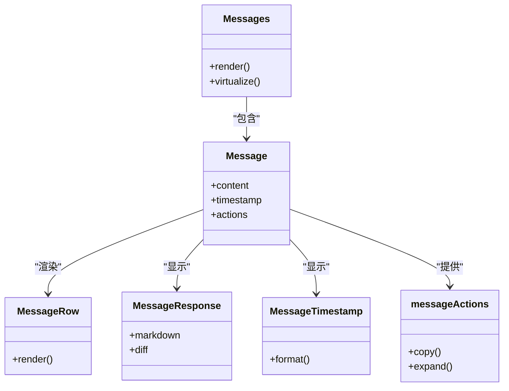
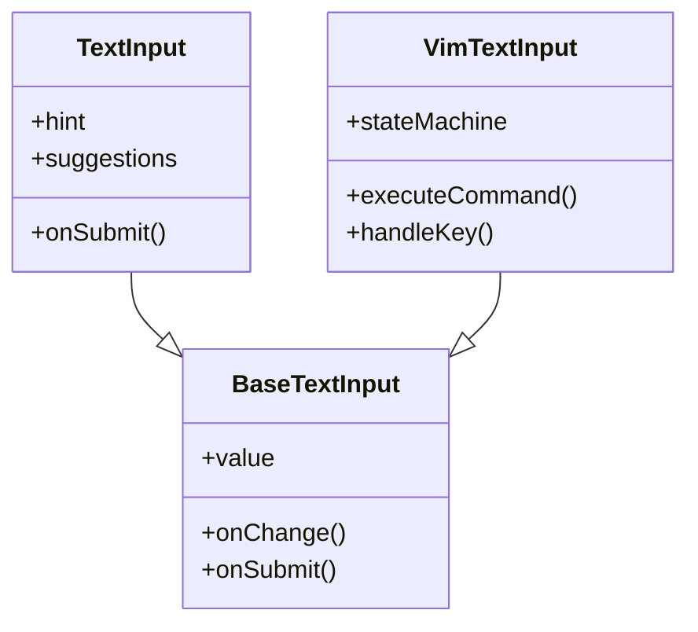
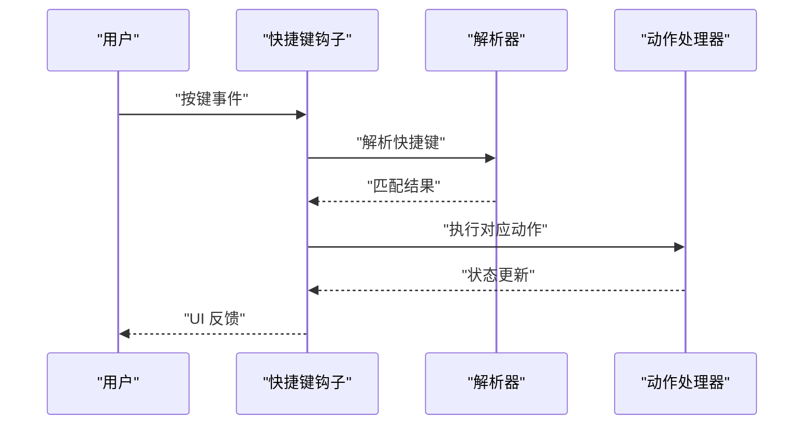
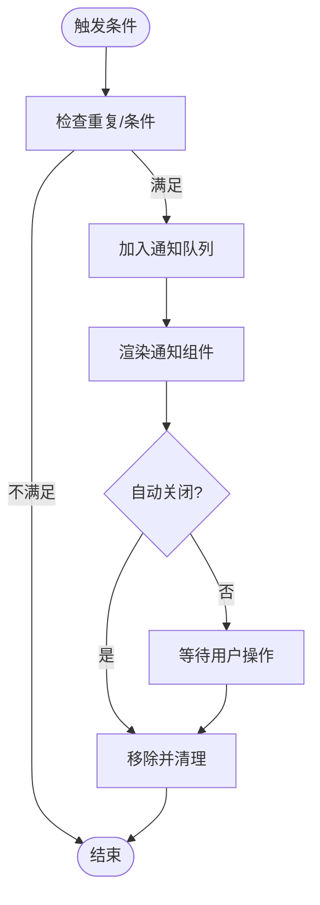
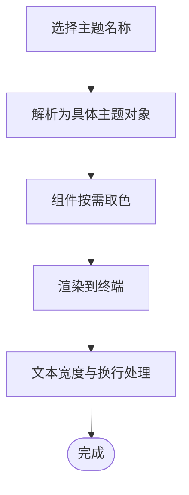
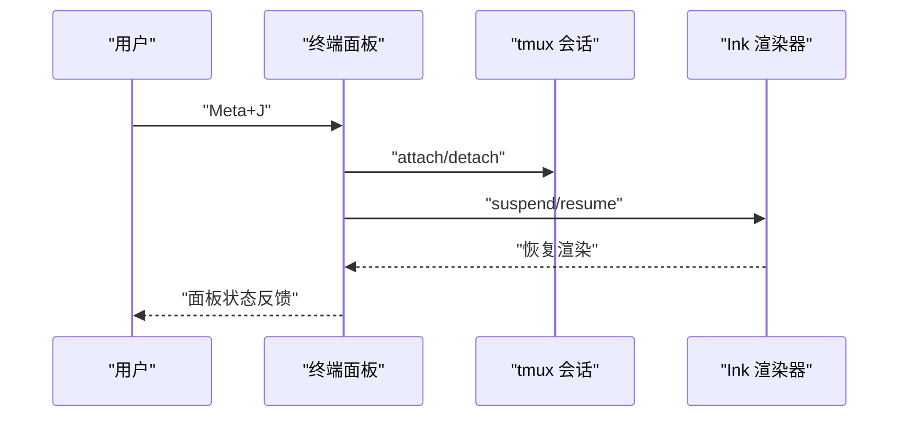
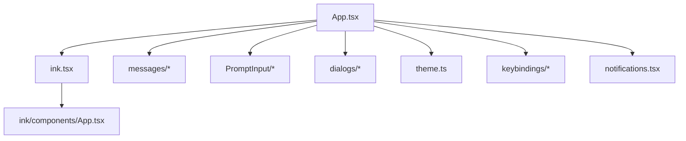

# 用户界面组件

<cite>
**本文引用的文件**
- [src/components/App.tsx](file://src/components/App.tsx)
- [src/ink/ink.tsx](file://src/ink/ink.tsx)
- [src/ink/components/App.tsx](file://src/ink/components/App.tsx)
- [src/keybindings/defaultBindings.ts](file://src/keybindings/defaultBindings.ts)
- [src/context/notifications.tsx](file://src/context/notifications.tsx)
- [src/utils/theme.ts](file://src/utils/theme.ts)
- [src/utils/terminal.ts](file://src/utils/terminal.ts)
- [src/utils/terminalPanel.ts](file://src/utils/terminalPanel.ts)
- [src/utils/treeify.ts](file://src/utils/treeify.ts)
- [src/utils/thinking.ts](file://src/utils/thinking.ts)
- [src/hooks/useGlobalKeybindings.tsx](file://src/hooks/useGlobalKeybindings.tsx)
- [src/hooks/useTerminalSize.ts](file://src/hooks/useTerminalSize.ts)
- [src/hooks/useTextInput.ts](file://src/hooks/useTextInput.ts)
- [src/hooks/useVirtualScroll.ts](file://src/hooks/useVirtualScroll.ts)
- [src/hooks/useClipboardImageHint.ts](file://src/hooks/useClipboardImageHint.ts)
- [src/hooks/useCommandKeybindings.tsx](file://src/hooks/useCommandKeybindings.tsx)
- [src/hooks/useArrowKeyHistory.tsx](file://src/hooks/useArrowKeyHistory.tsx)
- [src/hooks/useSearchInput.ts](file://src/hooks/useSearchInput.ts)
- [src/hooks/usePromptSuggestion.ts](file://src/hooks/usePromptSuggestion.ts)
- [src/hooks/useTypeahead.tsx](file://src/hooks/useTypeahead.tsx)
- [src/hooks/useDiffData.ts](file://src/hooks/useDiffData.ts)
- [src/hooks/useDiffInIDE.ts](file://src/hooks/useDiffInIDE.ts)
- [src/hooks/useIDEIntegration.tsx](file://src/hooks/useIDEIntegration.tsx)
- [src/hooks/useVoiceIntegration.tsx](file://src/hooks/useVoiceIntegration.tsx)
- [src/hooks/useMemoryUsage.ts](file://src/hooks/useMemoryUsage.ts)
- [src/hooks/useStats.ts](file://src/hooks/useStats.ts)
- [src/hooks/useLogMessages.ts](file://src/hooks/useLogMessages.ts)
- [src/hooks/useTimeout.ts](file://src/hooks/useTimeout.ts)
- [src/hooks/useQueueProcessor.ts](file://src/hooks/useQueueProcessor.ts)
- [src/hooks/useScheduledTasks.ts](file://src/hooks/useScheduledTasks.ts)
- [src/hooks/useUpdateNotification.ts](file://src/hooks/useUpdateNotification.ts)
- [src/hooks/useOfficialMarketplaceNotification.tsx](file://src/hooks/useOfficialMarketplaceNotification.tsx)
- [src/hooks/useChromeExtensionNotification.tsx](file://src/hooks/useChromeExtensionNotification.tsx)
- [src/hooks/useTerminalNotification.ts](file://src/hooks/useTerminalNotification.ts)
- [src/hooks/useBuddyNotification.tsx](file://src/hooks/useBuddyNotification.tsx)
- [src/hooks/useNotifyAfterTimeout.ts](file://src/hooks/useNotifyAfterTimeout.ts)
- [src/hooks/useExitOnCtrlCD.ts](file://src/hooks/useExitOnCtrlCD.ts)
- [src/hooks/useExitOnCtrlCDWithKeybindings.ts](file://src/hooks/useExitOnCtrlCDWithKeybindings.ts)
- [src/hooks/useExitOnCtrlCD.ts](file://src/hooks/useExitOnCtrlCD.ts)
- [src/hooks/useExitOnCtrlCDWithKeybindings.ts](file://src/hooks/useExitOnCtrlCDWithKeybindings.ts)
- [src/screens/REPL.tsx](file://src/screens/REPL.tsx)
- [src/screens/Doctor.tsx](file://src/screens/Doctor.tsx)
- [src/screens/ResumeConversation.tsx](file://src/screens/ResumeConversation.tsx)
- [src/components/messages/Message.tsx](file://src/components/messages/Message.tsx)
- [src/components/messages/Messages.tsx](file://src/components/messages/Messages.tsx)
- [src/components/messages/MessageRow.tsx](file://src/components/messages/MessageRow.tsx)
- [src/components/messages/MessageResponse.tsx](file://src/components/messages/MessageResponse.tsx)
- [src/components/messages/MessageTimestamp.tsx](file://src/components/messages/MessageTimestamp.tsx)
- [src/components/messages/messageActions.tsx](file://src/components/messages/messageActions.tsx)
- [src/components/PromptInput/BaseTextInput.tsx](file://src/components/PromptInput/BaseTextInput.tsx)
- [src/components/PromptInput/VimTextInput.tsx](file://src/components/PromptInput/VimTextInput.tsx)
- [src/components/PromptInput/TextInput.tsx](file://src/components/PromptInput/TextInput.tsx)
- [src/components/Spinner/Spinner.tsx](file://src/components/Spinner/Spinner.tsx)
- [src/components/Markdown.tsx](file://src/components/Markdown.tsx)
- [src/components/MarkdownTable.tsx](file://src/components/MarkdownTable.tsx)
- [src/components/StatusLine.tsx](file://src/components/StatusLine.tsx)
- [src/components/StatusNotices.tsx](file://src/components/StatusNotices.tsx)
- [src/components/ThemePicker.tsx](file://src/components/ThemePicker.tsx)
- [src/components/FullScreenLayout.tsx](file://src/components/FullScreenLayout.tsx)
- [src/components/QuickOpenDialog.tsx](file://src/components/QuickOpenDialog.tsx)
- [src/components/GlobalSearchDialog.tsx](file://src/components/GlobalSearchDialog.tsx)
- [src/components/SearchBox.tsx](file://src/components/SearchBox.tsx)
- [src/components/StructuredDiff.tsx](file://src/components/StructuredDiff.tsx)
- [src/components/StructuredDiffList.tsx](file://src/components/StructuredDiffList.tsx)
- [src/components/HighlightedCode.tsx](file://src/components/HighlightedCode.tsx)
- [src/components/TaskListV2.tsx](file://src/components/TaskListV2.tsx)
- [src/components/AgentProgressLine.tsx](file://src/components/AgentProgressLine.tsx)
- [src/components/TeleportProgress.tsx](file://src/components/TeleportProgress.tsx)
- [src/components/TeleportError.tsx](file://src/components/TeleportError.tsx)
- [src/components/OffscreenFreeze.tsx](file://src/components/OffscreenFreeze.tsx)
- [src/components/PressEnterToContinue.tsx](file://src/components/PressEnterToContinue.tsx)
- [src/components/UndercoverAutoCallout.tsx](file://src/components/UndercoverAutoCallout.tsx)
- [src/components/ValidationErrorsList.tsx](file://src/components/ValidationErrorsList.tsx)
- [src/components/TokenWarning.tsx](file://src/components/TokenWarning.tsx)
- [src/components/Stats.tsx](file://src/components/Stats.tsx)
- [src/components/Feedback.tsx](file://src/components/Feedback.tsx)
- [src/components/ExitFlow.tsx](file://src/components/ExitFlow.tsx)
- [src/components/AutoUpdater.tsx](file://src/components/AutoUpdater.tsx)
- [src/components/AutoUpdaterWrapper.tsx](file://src/components/AutoUpdaterWrapper.tsx)
- [src/components/NativeAutoUpdater.tsx](file://src/components/NativeAutoUpdater.tsx)
- [src/components/PackageManagerAutoUpdater.tsx](file://src/components/PackageManagerAutoUpdater.tsx)
- [src/components/Onboarding.tsx](file://src/components/Onboarding.tsx)
- [src/components/DevBar.tsx](file://src/components/DevBar.tsx)
- [src/components/DiagnosticsDisplay.tsx](file://src/components/DiagnosticsDisplay.tsx)
- [src/components/SentryErrorBoundary.ts](file://src/components/SentryErrorBoundary.ts)
- [src/components/LogSelector.tsx](file://src/components/LogSelector.tsx)
- [src/components/LanguagePicker.tsx](file://src/components/LanguagePicker.tsx)
- [src/components/OutputStylePicker.tsx](file://src/components/OutputStylePicker.tsx)
- [src/components/ConfigurableShortcutHint.tsx](file://src/components/ConfigurableShortcutHint.tsx)
- [src/components/ConsoleOAuthFlow.tsx](file://src/components/ConsoleOAuthFlow.tsx)
- [src/components/ContextSuggestions.tsx](file://src/components/ContextSuggestions.tsx)
- [src/components/ContextVisualization.tsx](file://src/components/ContextVisualization.tsx)
- [src/components/ScrollKeybindingHandler.tsx](file://src/components/ScrollKeybindingHandler.tsx)
- [src/components/FullscreenLayout.tsx](file://src/components/FullscreenLayout.tsx)
- [src/components/TeleportResumeWrapper.tsx](file://src/components/TeleportResumeWrapper.tsx)
- [src/components/TeleportStash.tsx](file://src/components/TeleportStash.tsx)
- [src/components/TeleportRepoMismatchDialog.tsx](file://src/components/TeleportRepoMismatchDialog.tsx)
- [src/components/ChannelDowngradeDialog.tsx](file://src/components/ChannelDowngradeDialog.tsx)
- [src/components/InvalidConfigDialog.tsx](file://src/components/InvalidConfigDialog.tsx)
- [src/components/InvalidSettingsDialog.tsx](file://src/components/InvalidSettingsDialog.tsx)
- [src/components/KeybindingWarnings.tsx](file://src/components/KeybindingWarnings.tsx)
- [src/components/WorktreeExitDialog.tsx](file://src/components/WorktreeExitDialog.tsx)
- [src/components/SessionBackgroundHint.tsx](file://src/components/SessionBackgroundHint.tsx)
- [src/components/SessionPreview.tsx](file://src/components/SessionPreview.tsx)
- [src/components/ShowInIDEPrompt.tsx](file://src/components/ShowInIDEPrompt.tsx)
- [src/components/IdeOnboardingDialog.tsx](file://src/components/IdeOnboardingDialog.tsx)
- [src/components/IdeAutoConnectDialog.tsx](file://src/components/IdeAutoConnectDialog.tsx)
- [src/components/IdeStatusIndicator.tsx](file://src/components/IdeStatusIndicator.tsx)
- [src/components/RemoteEnvironmentDialog.tsx](file://src/components/RemoteEnvironmentDialog.tsx)
- [src/components/RemoteCallout.tsx](file://src/components/RemoteCallout.tsx)
- [src/components/MCPServerApprovalDialog.tsx](file://src/components/MCPServerApprovalDialog.tsx)
- [src/components/MCPServerDesktopImportDialog.tsx](file://src/components/MCPServerDesktopImportDialog.tsx)
- [src/components/MCPServerDialogCopy.tsx](file://src/components/MCPServerDialogCopy.tsx)
- [src/components/MCPServerMultiselectDialog.tsx](file://src/components/MCPServerMultiselectDialog.tsx)
- [src/components/ApproveApiKey.tsx](file://src/components/ApproveApiKey.tsx)
- [src/components/BridgeDialog.tsx](file://src/components/BridgeDialog.tsx)
- [src/components/DeskTopHandoff.tsx](file://src/components/DesktopHandoff.tsx)
- [src/components/ConsoleOAuthFlow.tsx](file://src/components/ConsoleOAuthFlow.tsx)
- [src/components/ConsoleOAuthFlow.tsx](file://src/components/ConsoleOAuthFlow.tsx)
- [src/components/ConsoleOAuthFlow.tsx](file://src/components/ConsoleOAuthFlow.tsx)
- [src/components/ConsoleOAuthFlow.tsx](file://src/components/ConsoleOAuthFlow.tsx)
- [src/components/ConsoleOAuthFlow.tsx](file://src/components/ConsoleOAuthFlow.tsx)
- [src/components/ConsoleOAuthFlow.tsx](file://src/components/ConsoleOAuthFlow.tsx)
- [src/components/ConsoleOAuthFlow.tsx](file://src/components/ConsoleOAuthFlow.tsx)
- [src/components/ConsoleOAuthFlow.tsx](file://src/components/ConsoleOAuthFlow.tsx)
- [src/components/ConsoleOAuthFlow.tsx](file://src/components/ConsoleOAuthFlow.tsx)
- [src/components/ConsoleOAuthFlow.tsx](file://src/components/ConsoleOAuthFlow.tsx)
- [src/components/ConsoleOAuthFlow.tsx](file://src/components/ConsoleOAuthFlow.tsx)
- [src/components/ConsoleOAuthFlow.tsx](file://src/components/ConsoleOAuthFlow.tsx)
- [src/components/ConsoleOAuthFlow.tsx](file://src/components/ConsoleOAuthFlow.tsx)
- [src/components/ConsoleOAuthFlow.tsx](file://src/components/ConsoleOAuthFlow.tsx)
- [src/components/ConsoleOAuthFlow.tsx](file://src/components/ConsoleOAuthFlow.tsx)
- [src/components/ConsoleOAuthFlow.tsx](file://src/components/ConsoleOAuthFlow.tsx)
- [src/components/ConsoleOAuthFlow.tsx](file://src/components/ConsoleOAuthFlow.tsx)
- [src/components/ConsoleOAuthFlow.tsx](file://src/components/ConsoleOAuthFlow.tsx)
- [src/components/ConsoleOAuthFlow.tsx](file://src/components/ConsoleOAuthFlow.tsx)
- [src/components/ConsoleOAuthFlow.tsx](file://src/components/ConsoleOAuthFlow.tsx)
- [src/components/ConsoleOAuthFlow.tsx](file://src/components/ConsoleOAuthFlow.tsx)
- [src/components/ConsoleOAuthFlow.tsx](file://src/components/ConsoleOAuthFlow.tsx)
- [src/components/ConsoleOAuthFlow.tsx](file://src/components/ConsoleOAuthFlow.tsx)
-......（省略部分文件路径以控制输出长度）
</cite>

## 目录
1. [简介](#简介)
2. [项目结构](#项目结构)
3. [核心组件](#核心组件)
4. [架构总览](#架构总览)
5. [组件详解](#组件详解)
6. [依赖关系分析](#依赖关系分析)
7. [性能与可访问性](#性能与可访问性)
8. [故障排查指南](#故障排查指南)
9. [结论](#结论)
10. [附录：使用示例与集成指南](#附录使用示例与集成指南)

## 简介
本文件面向 Claude Code 的用户界面组件，系统阐述基于 React 的组件架构、基于 Ink 的终端 UI 框架、样式与主题系统、键盘快捷键体系、全局状态管理与通知机制，并给出响应式设计与跨平台兼容性的实践建议。文档同时覆盖无障碍访问与性能优化策略，帮助开发者在终端环境中构建一致、高效且易用的交互体验。

## 项目结构
- 应用入口与顶层容器
  - 顶层应用容器位于 src/components/App.tsx，负责全局上下文、主题与路由整合。
  - Ink 渲染器入口位于 src/ink/ink.tsx，承载 Ink 组件树渲染与事件循环。
  - Ink 内部的 App 容器位于 src/ink/components/App.tsx，作为 Ink 层的根组件。
- UI 组件分层
  - 基础消息与对话：src/components/messages/* 提供消息列表、行、响应、时间戳等。
  - 输入与编辑：src/components/PromptInput/* 提供基础文本输入、Vim 风格输入等。
  - 功能型弹窗与面板：如 QuickOpen、GlobalSearch、ThemePicker、StatusLine、StatusNotices 等。
  - 屏幕级页面：REPL、Doctor、ResumeConversation 等。
- 键盘与交互
  - 快捷键默认配置与解析：src/keybindings/defaultBindings.ts、useGlobalKeybindings.tsx、useCommandKeybindings.tsx。
  - 终端尺寸与滚动：useTerminalSize.ts、useVirtualScroll.ts。
- 主题与样式
  - 主题系统：src/utils/theme.ts，提供多套主题与颜色映射。
  - 终端文本包装与宽度计算：src/utils/terminal.ts。
  - 树形可视化与高亮：src/utils/treeify.ts、src/utils/thinking.ts。
- 通知与状态
  - 通知上下文：src/context/notifications.tsx。
  - 多类通知钩子：useTerminalNotification.ts、useBuddyNotification.tsx、useUpdateNotification.ts 等。
- 辅助与工具
  - 差异与 IDE 集成：useDiffData.ts、useDiffInIDE.ts、useIDEIntegration.tsx。
  - 搜索与历史：useSearchInput.ts、useArrowKeyHistory.tsx、usePromptSuggestion.ts、useTypeahead.tsx。
  - 性能与日志：useMemoryUsage.ts、useStats.ts、useLogMessages.ts、useTimeout.ts。

图示来源
- [src/components/App.tsx](file://src/components/App.tsx)
- [src/ink/ink.tsx](file://src/ink/ink.tsx)
- [src/ink/components/App.tsx](file://src/ink/components/App.tsx)
- [src/keybindings/defaultBindings.ts](file://src/keybindings/defaultBindings.ts)
- [src/context/notifications.tsx](file://src/context/notifications.tsx)
- [src/utils/theme.ts](file://src/utils/theme.ts)
- [src/utils/terminal.ts](file://src/utils/terminal.ts)

章节来源
- [src/components/App.tsx](file://src/components/App.tsx)
- [src/ink/ink.tsx](file://src/ink/ink.tsx)
- [src/ink/components/App.tsx](file://src/ink/components/App.tsx)

## 核心组件
- 顶层应用容器
  - 负责全局上下文注入、主题选择、路由与屏幕切换、以及与 Ink 渲染器的桥接。
- Ink 渲染器
  - 将 React 组件树渲染到终端，处理输入事件、焦点管理、布局与帧更新。
- 消息系统
  - 提供消息列表、单条消息、消息行、响应内容与时间戳组件，支持虚拟滚动与差异展示。
- 输入系统
  - 支持基础文本输入与 Vim 风格输入模式，提供历史记录、自动补全与快捷提示。
- 功能弹窗与面板
  - 包括快速打开、全局搜索、主题选择、状态栏与状态提示等。
- 屏幕级页面
  - REPL、Doctor、ResumeConversation 等，作为顶层容器的子视图。

章节来源
- [src/components/App.tsx](file://src/components/App.tsx)
- [src/ink/ink.tsx](file://src/ink/ink.tsx)
- [src/ink/components/App.tsx](file://src/ink/components/App.tsx)
- [src/components/messages/Message.tsx](file://src/components/messages/Message.tsx)
- [src/components/messages/Messages.tsx](file://src/components/messages/Messages.tsx)
- [src/components/messages/MessageRow.tsx](file://src/components/messages/MessageRow.tsx)
- [src/components/messages/MessageResponse.tsx](file://src/components/messages/MessageResponse.tsx)
- [src/components/messages/MessageTimestamp.tsx](file://src/components/messages/MessageTimestamp.tsx)
- [src/components/PromptInput/BaseTextInput.tsx](file://src/components/PromptInput/BaseTextInput.tsx)
- [src/components/PromptInput/VimTextInput.tsx](file://src/components/PromptInput/VimTextInput.tsx)
- [src/components/PromptInput/TextInput.tsx](file://src/components/PromptInput/TextInput.tsx)
- [src/components/QuickOpenDialog.tsx](file://src/components/QuickOpenDialog.tsx)
- [src/components/GlobalSearchDialog.tsx](file://src/components/GlobalSearchDialog.tsx)
- [src/components/ThemePicker.tsx](file://src/components/ThemePicker.tsx)
- [src/components/StatusLine.tsx](file://src/components/StatusLine.tsx)
- [src/components/StatusNotices.tsx](file://src/components/StatusNotices.tsx)
- [src/screens/REPL.tsx](file://src/screens/REPL.tsx)
- [src/screens/Doctor.tsx](file://src/screens/Doctor.tsx)
- [src/screens/ResumeConversation.tsx](file://src/screens/ResumeConversation.tsx)

## 架构总览
- 组件层次
  - 顶层容器 App.tsx 作为应用入口，协调屏幕、消息、输入与弹窗。
  - Ink 层独立于浏览器 DOM，通过 Ink 渲染器将组件树绘制到终端。
- 样式与主题
  - 主题系统提供多套主题与颜色映射；终端文本包装与宽度计算确保在不同列宽下稳定显示。
- 交互与键盘
  - 默认快捷键配置与解析钩子统一处理全局与命令模式下的按键行为。
- 通知与状态
  - 通知上下文集中管理通知队列与可见性；多种专用通知钩子覆盖终端、桌面、更新等场景。

图示来源
- [src/components/App.tsx](file://src/components/App.tsx)
- [src/ink/ink.tsx](file://src/ink/ink.tsx)
- [src/ink/components/App.tsx](file://src/ink/components/App.tsx)
- [src/utils/theme.ts](file://src/utils/theme.ts)
- [src/utils/terminal.ts](file://src/utils/terminal.ts)
- [src/keybindings/defaultBindings.ts](file://src/keybindings/defaultBindings.ts)
- [src/context/notifications.tsx](file://src/context/notifications.tsx)

## 组件详解

### 消息系统
- 组件族
  - Message：单条消息容器，承载内容与元信息。
  - Messages：消息列表，支持虚拟滚动与差异渲染。
  - MessageRow：消息行，用于列表项的复用与渲染。
  - MessageResponse：消息响应内容，支持 Markdown 渲染与差异高亮。
  - MessageTimestamp：时间戳组件，格式化显示。
  - messageActions：消息操作集合，如复制、展开等。
- 数据流
  - 列表从全局状态获取消息序列，按需渲染并支持增量更新。
  - 差异数据通过专用钩子注入，提升大体量输出的可读性。
- 性能
  - 使用虚拟滚动减少节点数量；差异组件仅在变更时重绘。

图示来源
- [src/components/messages/Messages.tsx](file://src/components/messages/Messages.tsx)
- [src/components/messages/Message.tsx](file://src/components/messages/Message.tsx)
- [src/components/messages/MessageRow.tsx](file://src/components/messages/MessageRow.tsx)
- [src/components/messages/MessageResponse.tsx](file://src/components/messages/MessageResponse.tsx)
- [src/components/messages/MessageTimestamp.tsx](file://src/components/messages/MessageTimestamp.tsx)
- [src/components/messages/messageActions.tsx](file://src/components/messages/messageActions.tsx)

章节来源
- [src/components/messages/Messages.tsx](file://src/components/messages/Messages.tsx)
- [src/components/messages/Message.tsx](file://src/components/messages/Message.tsx)
- [src/components/messages/MessageRow.tsx](file://src/components/messages/MessageRow.tsx)
- [src/components/messages/MessageResponse.tsx](file://src/components/messages/MessageResponse.tsx)
- [src/components/messages/MessageTimestamp.tsx](file://src/components/messages/MessageTimestamp.tsx)
- [src/components/messages/messageActions.tsx](file://src/components/messages/messageActions.tsx)

### 输入系统
- 组件族
  - BaseTextInput：基础文本输入，提供通用输入能力。
  - TextInput：增强版输入，支持快捷提示与自动补全。
  - VimTextInput：Vim 风格输入，内置状态机与命令转义。
- 交互特性
  - 历史记录与箭头键导航。
  - 自动补全与类型提示。
  - 快捷提示与可配置提示显示。

图示来源
- [src/components/PromptInput/BaseTextInput.tsx](file://src/components/PromptInput/BaseTextInput.tsx)
- [src/components/PromptInput/TextInput.tsx](file://src/components/PromptInput/TextInput.tsx)
- [src/components/PromptInput/VimTextInput.tsx](file://src/components/PromptInput/VimTextInput.tsx)

章节来源
- [src/components/PromptInput/BaseTextInput.tsx](file://src/components/PromptInput/BaseTextInput.tsx)
- [src/components/PromptInput/TextInput.tsx](file://src/components/PromptInput/TextInput.tsx)
- [src/components/PromptInput/VimTextInput.tsx](file://src/components/PromptInput/VimTextInput.tsx)
- [src/hooks/useArrowKeyHistory.tsx](file://src/hooks/useArrowKeyHistory.tsx)
- [src/hooks/useTypeahead.tsx](file://src/hooks/useTypeahead.tsx)
- [src/hooks/usePromptSuggestion.ts](file://src/hooks/usePromptSuggestion.ts)

### 快捷键系统
- 设计原则
  - 默认绑定集中定义，解析器负责匹配与执行。
  - 全局与命令模式分别维护快捷键上下文，避免冲突。
- 关键模块
  - defaultBindings.ts：默认快捷键映射。
  - useGlobalKeybindings.tsx：全局快捷键钩子。
  - useCommandKeybindings.tsx：命令模式快捷键钩子。
- 执行流程
  - 输入捕获 → 解析绑定 → 触发动作 → 更新状态或触发 UI 变更。

图示来源
- [src/keybindings/defaultBindings.ts](file://src/keybindings/defaultBindings.ts)
- [src/hooks/useGlobalKeybindings.tsx](file://src/hooks/useGlobalKeybindings.tsx)
- [src/hooks/useCommandKeybindings.tsx](file://src/hooks/useCommandKeybindings.tsx)

章节来源
- [src/keybindings/defaultBindings.ts](file://src/keybindings/defaultBindings.ts)
- [src/hooks/useGlobalKeybindings.tsx](file://src/hooks/useGlobalKeybindings.tsx)
- [src/hooks/useCommandKeybindings.tsx](file://src/hooks/useCommandKeybindings.tsx)

### 通知系统
- 上下文
  - notifications.tsx：集中管理通知队列与可见性。
- 钩子族
  - useTerminalNotification.ts：终端内通知。
  - useBuddyNotification.tsx：伙伴通知。
  - useUpdateNotification.ts：更新通知。
  - useOfficialMarketplaceNotification.tsx：官方市场通知。
  - useChromeExtensionNotification.tsx：Chrome 扩展通知。
- 行为
  - 条件触发、去重、超时关闭、可手动关闭。

图示来源
- [src/context/notifications.tsx](file://src/context/notifications.tsx)
- [src/hooks/useTerminalNotification.ts](file://src/hooks/useTerminalNotification.ts)
- [src/hooks/useBuddyNotification.tsx](file://src/hooks/useBuddyNotification.tsx)
- [src/hooks/useUpdateNotification.ts](file://src/hooks/useUpdateNotification.ts)
- [src/hooks/useOfficialMarketplaceNotification.tsx](file://src/hooks/useOfficialMarketplaceNotification.tsx)
- [src/hooks/useChromeExtensionNotification.tsx](file://src/hooks/useChromeExtensionNotification.tsx)

章节来源
- [src/context/notifications.tsx](file://src/context/notifications.tsx)
- [src/hooks/useTerminalNotification.ts](file://src/hooks/useTerminalNotification.ts)
- [src/hooks/useBuddyNotification.tsx](file://src/hooks/useBuddyNotification.tsx)
- [src/hooks/useUpdateNotification.ts](file://src/hooks/useUpdateNotification.ts)
- [src/hooks/useOfficialMarketplaceNotification.tsx](file://src/hooks/useOfficialMarketplaceNotification.tsx)
- [src/hooks/useChromeExtensionNotification.tsx](file://src/hooks/useChromeExtensionNotification.tsx)

### 主题与样式系统
- 主题
  - 多套主题（深色/浅色、色弱友好、ANSI 模拟），运行时可切换。
  - 颜色键名统一，便于在组件中按需取色。
- 终端适配
  - 文本换行与宽度计算，避免 ANSI 转义序列破坏可视宽度。
  - 图表颜色转换，适配不同终端对 24 位颜色的支持差异。
- 可视化工具
  - 树形结构渲染与高亮，支持主题色与字符色配置。

图示来源
- [src/utils/theme.ts](file://src/utils/theme.ts)
- [src/utils/terminal.ts](file://src/utils/terminal.ts)
- [src/utils/treeify.ts](file://src/utils/treeify.ts)
- [src/utils/thinking.ts](file://src/utils/thinking.ts)

章节来源
- [src/utils/theme.ts](file://src/utils/theme.ts)
- [src/utils/terminal.ts](file://src/utils/terminal.ts)
- [src/utils/treeify.ts](file://src/utils/treeify.ts)
- [src/utils/thinking.ts](file://src/utils/thinking.ts)

### 终端面板与交互
- 终端面板
  - 支持 tmux 会话持久化与非持久化回退。
  - Meta+J 快捷键切换面板，保持会话独立性。
- 与 Ink 的协作
  - 采用 suspend-Ink 模式，避免面板切换时中断渲染。
- 终端尺寸与滚动
  - useTerminalSize.ts 获取当前终端尺寸，useVirtualScroll.ts 实现虚拟滚动。

图示来源
- [src/utils/terminalPanel.ts](file://src/utils/terminalPanel.ts)
- [src/hooks/useTerminalSize.ts](file://src/hooks/useTerminalSize.ts)
- [src/hooks/useVirtualScroll.ts](file://src/hooks/useVirtualScroll.ts)

章节来源
- [src/utils/terminalPanel.ts](file://src/utils/terminalPanel.ts)
- [src/hooks/useTerminalSize.ts](file://src/hooks/useTerminalSize.ts)
- [src/hooks/useVirtualScroll.ts](file://src/hooks/useVirtualScroll.ts)

## 依赖关系分析
- 组件耦合
  - App.tsx 作为中枢，向上游状态与通知解耦，向下聚合各功能模块。
  - Ink 层与业务层通过渲染器隔离，降低 DOM 依赖。
- 外部依赖
  - Ink 生态与终端 I/O 工具链。
  - 主题与颜色工具（chalk、ANSI 计算）。
- 循环依赖
  - 通过钩子与上下文避免直接循环引用。

图示来源
- [src/components/App.tsx](file://src/components/App.tsx)
- [src/ink/ink.tsx](file://src/ink/ink.tsx)
- [src/ink/components/App.tsx](file://src/ink/components/App.tsx)
- [src/utils/theme.ts](file://src/utils/theme.ts)
- [src/keybindings/defaultBindings.ts](file://src/keybindings/defaultBindings.ts)
- [src/context/notifications.tsx](file://src/context/notifications.tsx)

章节来源
- [src/components/App.tsx](file://src/components/App.tsx)
- [src/ink/ink.tsx](file://src/ink/ink.tsx)
- [src/ink/components/App.tsx](file://src/ink/components/App.tsx)

## 性能与可访问性
- 性能
  - 虚拟滚动：在消息列表与长列表中显著降低节点数。
  - 按需渲染：仅在状态变化时更新相关区域。
  - 文本宽度计算：避免溢出与重排，减少帧内抖动。
  - 通知去重与超时：防止通知风暴影响渲染。
- 可访问性
  - 键盘优先：所有交互均可通过键盘完成。
  - 语义化标签：在可用范围内提供清晰的焦点顺序。
  - 高对比度主题：深色/浅色与色弱友好主题满足不同需求。
  - 屏幕阅读器友好：避免仅依赖颜色传达状态，结合文字描述。

## 故障排查指南
- 快捷键无效
  - 检查 defaultBindings.ts 中是否定义目标快捷键。
  - 确认 useGlobalKeybindings.tsx 或 useCommandKeybindings.tsx 是否正确注册。
- 通知未显示
  - 检查 notifications.tsx 的队列状态与去重逻辑。
  - 确认对应钩子是否在正确时机调用。
- 终端显示异常
  - 检查 useTerminalSize.ts 返回的尺寸是否合理。
  - 确认文本宽度计算与换行逻辑是否生效。
- 主题颜色不一致
  - 核对主题名称与 getTheme 解析结果。
  - 检查颜色键名是否与主题定义一致。

章节来源
- [src/keybindings/defaultBindings.ts](file://src/keybindings/defaultBindings.ts)
- [src/hooks/useGlobalKeybindings.tsx](file://src/hooks/useGlobalKeybindings.tsx)
- [src/hooks/useCommandKeybindings.tsx](file://src/hooks/useCommandKeybindings.tsx)
- [src/context/notifications.tsx](file://src/context/notifications.tsx)
- [src/hooks/useTerminalSize.ts](file://src/hooks/useTerminalSize.ts)
- [src/utils/terminal.ts](file://src/utils/terminal.ts)
- [src/utils/theme.ts](file://src/utils/theme.ts)

## 结论
本项目在终端环境中实现了以 Ink 为核心的 React UI 架构，通过主题系统、快捷键体系与通知机制，提供了稳定、可扩展且跨平台的用户体验。组件分层清晰、钩子与上下文解耦良好，适合在 CLI 场景下进行二次开发与定制。

## 附录：使用示例与集成指南
- 在现有应用中集成 Ink
  - 引入 ink.tsx 作为渲染入口，确保在应用启动时初始化渲染器。
  - 将业务组件挂载至 Ink 根容器，遵循 Ink 的生命周期与事件模型。
- 自定义主题
  - 在 theme.ts 中新增颜色键或主题变体，组件通过统一的颜色函数取色。
  - 对图表与 ANSI 输出，使用主题颜色转换工具保证跨终端一致性。
- 快捷键扩展
  - 在 defaultBindings.ts 中添加新快捷键映射，配合 useGlobalKeybindings.tsx 或 useCommandKeybindings.tsx 注册。
- 通知集成
  - 通过 notifications.tsx 的上下文 API 推送通知，或使用专用钩子简化流程。
- 响应式与跨平台
  - 使用 useTerminalSize.ts 获取实时尺寸，结合 useVirtualScroll.ts 与终端文本工具实现自适应布局。
- 无障碍与性能
  - 优先键盘交互，提供高对比度主题；在长列表与复杂渲染中启用虚拟滚动与按需渲染。

章节来源
- [src/ink/ink.tsx](file://src/ink/ink.tsx)
- [src/utils/theme.ts](file://src/utils/theme.ts)
- [src/utils/terminal.ts](file://src/utils/terminal.ts)
- [src/hooks/useTerminalSize.ts](file://src/hooks/useTerminalSize.ts)
- [src/hooks/useVirtualScroll.ts](file://src/hooks/useVirtualScroll.ts)
- [src/context/notifications.tsx](file://src/context/notifications.tsx)
- [src/keybindings/defaultBindings.ts](file://src/keybindings/defaultBindings.ts)
- [src/hooks/useGlobalKeybindings.tsx](file://src/hooks/useGlobalKeybindings.tsx)
- [src/hooks/useCommandKeybindings.tsx](file://src/hooks/useCommandKeybindings.tsx)