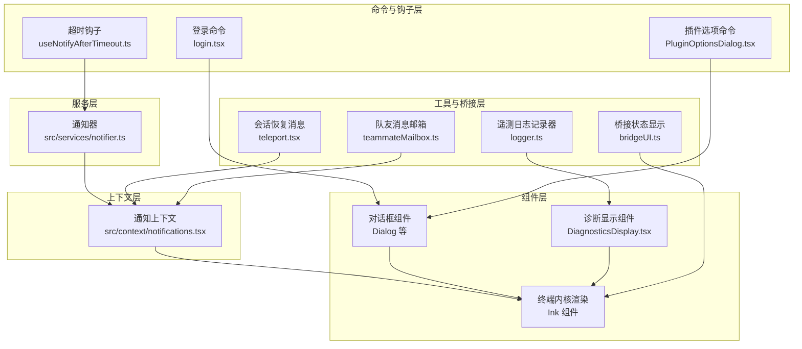
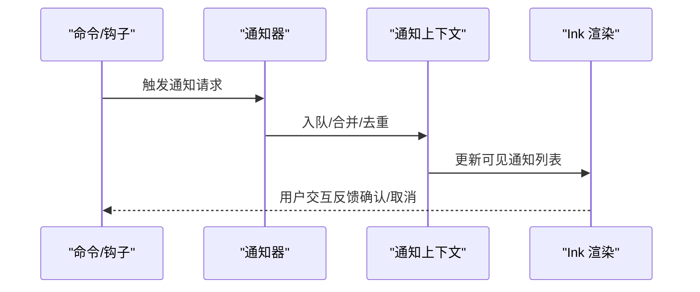
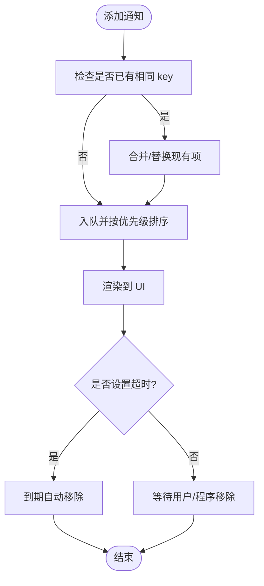
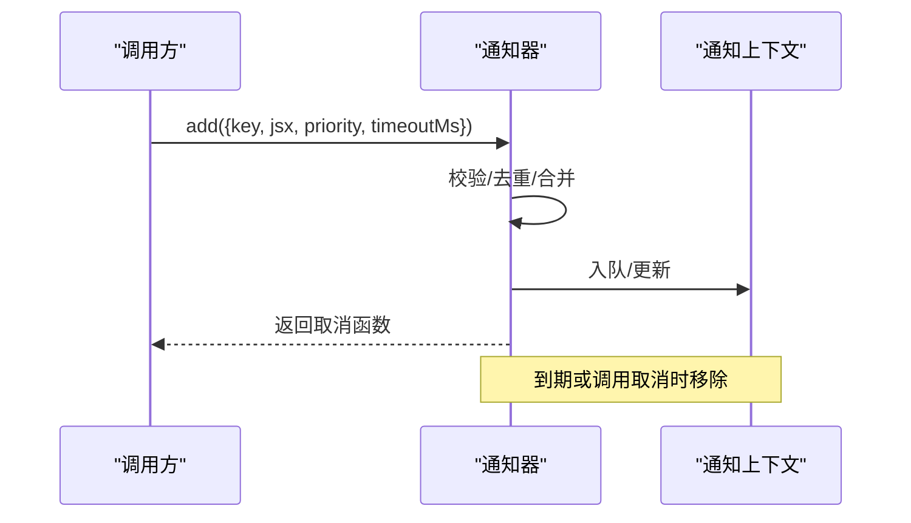
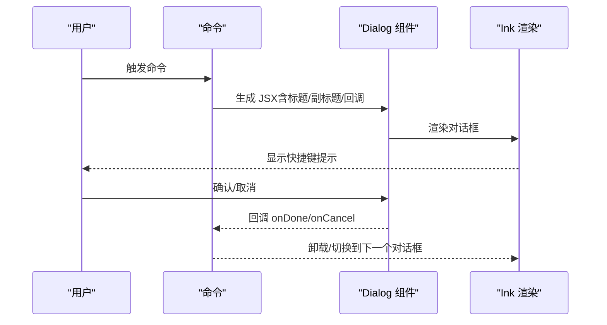
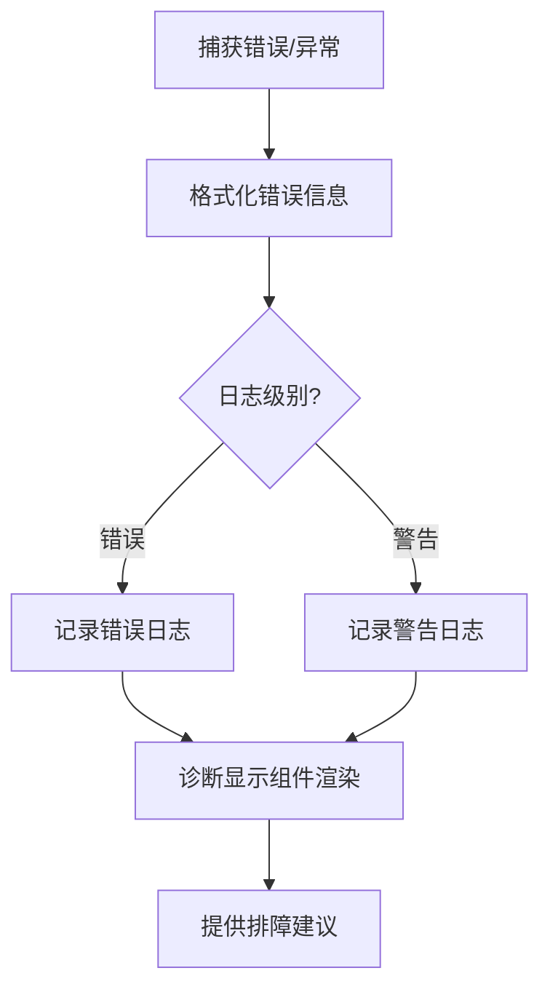
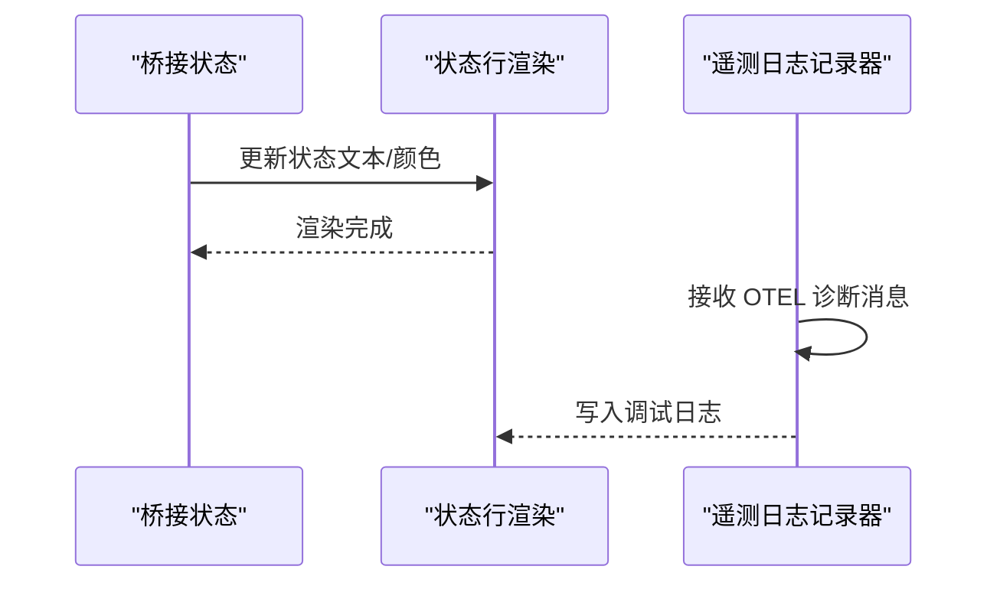
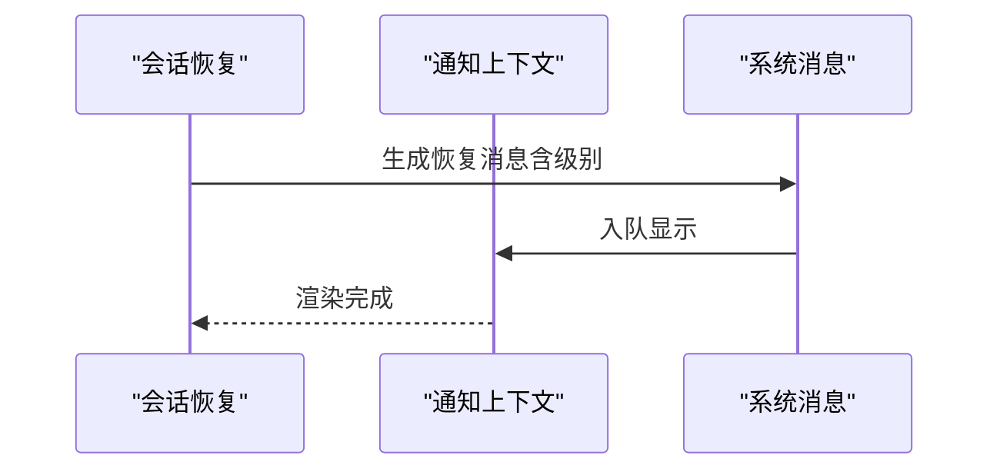
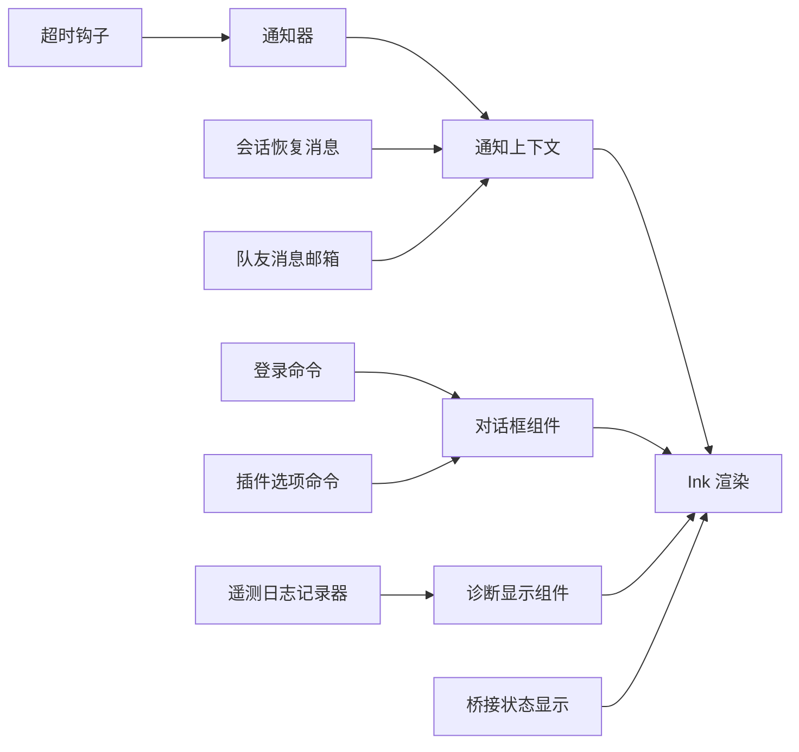

# 通知与消息系统

<cite>
**本文引用的文件**
- [src/context/notifications.tsx](file://src/context/notifications.tsx)
- [src/buddy/useBuddyNotification.tsx](file://src/buddy/useBuddyNotification.tsx)
- [src/services/notifier.ts](file://src/services/notifier.ts)
- [src/hooks/notifs/useNotifyAfterTimeout.ts](file://src/hooks/notifs/useNotifyAfterTimeout.ts)
- [src/hooks/notifs/useTimeout.ts](file://src/hooks/notifs/useTimeout.ts)
- [src/components/DiagnosticsDisplay.tsx](file://src/components/DiagnosticsDisplay.tsx)
- [src/utils/telemetry/logger.ts](file://src/utils/telemetry/logger.ts)
- [src/commands/login/login.tsx](file://src/commands/login/login.tsx)
- [src/commands/plugin/PluginOptionsDialog.tsx](file://src/commands/plugin/PluginOptionsDialog.tsx)
- [src/dialogLaunchers.tsx](file://src/dialogLaunchers.tsx)
- [src/bridge/bridgeUI.ts](file://src/bridge/bridgeUI.ts)
- [src/utils/teleport.tsx](file://src/utils/teleport.tsx)
- [src/utils/teammateMailbox.ts](file://src/utils/teammateMailbox.ts)
- [src/cli/print.ts](file://src/cli/print.ts)
- [src/bootstrap/state.ts](file://src/bootstrap/state.ts)
</cite>

## 目录
1. [引言](#引言)
2. [项目结构](#项目结构)
3. [核心组件](#核心组件)
4. [架构总览](#架构总览)
5. [组件详解](#组件详解)
6. [依赖关系分析](#依赖关系分析)
7. [性能考量](#性能考量)
8. [故障排查指南](#故障排查指南)
9. [结论](#结论)
10. [附录：通知开发指南](#附录通知开发指南)

## 引言
本文件系统性梳理 Claude Code 的通知与消息体系，覆盖通知队列管理、显示策略、用户交互、模态对话框生命周期与堆叠管理、以及诊断显示与排障支持。文档同时提供新增通知类型、样式定制与用户体验优化的最佳实践，并讨论性能与可访问性要点。

## 项目结构
通知与消息系统主要由以下层次构成：
- 上下文层：集中管理通知队列与可见性状态（通知上下文）。
- 服务层：统一的消息分发与策略控制（通知器）。
- 组件层：终端内核渲染（Ink）、对话框与诊断显示组件。
- 命令与钩子层：命令入口触发对话框，钩子在特定时机触发通知。
- 工具与桥接层：遥测日志、桥接状态、跨进程消息等辅助能力。

图表来源
- [src/context/notifications.tsx](file://src/context/notifications.tsx)
- [src/services/notifier.ts](file://src/services/notifier.ts)
- [src/components/DiagnosticsDisplay.tsx](file://src/components/DiagnosticsDisplay.tsx)
- [src/utils/telemetry/logger.ts](file://src/utils/telemetry/logger.ts)
- [src/commands/login/login.tsx](file://src/commands/login/login.tsx)
- [src/commands/plugin/PluginOptionsDialog.tsx](file://src/commands/plugin/PluginOptionsDialog.tsx)
- [src/hooks/notifs/useNotifyAfterTimeout.ts](file://src/hooks/notifs/useNotifyAfterTimeout.ts)
- [src/bridge/bridgeUI.ts](file://src/bridge/bridgeUI.ts)
- [src/utils/teleport.tsx](file://src/utils/teleport.tsx)
- [src/utils/teammateMailbox.ts](file://src/utils/teammateMailbox.ts)

章节来源
- [src/context/notifications.tsx](file://src/context/notifications.tsx)
- [src/services/notifier.ts](file://src/services/notifier.ts)
- [src/components/DiagnosticsDisplay.tsx](file://src/components/DiagnosticsDisplay.tsx)
- [src/utils/telemetry/logger.ts](file://src/utils/telemetry/logger.ts)
- [src/commands/login/login.tsx](file://src/commands/login/login.tsx)
- [src/commands/plugin/PluginOptionsDialog.tsx](file://src/commands/plugin/PluginOptionsDialog.tsx)
- [src/hooks/notifs/useNotifyAfterTimeout.ts](file://src/hooks/notifs/useNotifyAfterTimeout.ts)
- [src/bridge/bridgeUI.ts](file://src/bridge/bridgeUI.ts)
- [src/utils/teleport.tsx](file://src/utils/teleport.tsx)
- [src/utils/teammateMailbox.ts](file://src/utils/teammateMailbox.ts)

## 核心组件
- 通知上下文（队列与可见性）
  - 负责维护通知队列、优先级与去重策略；暴露添加/移除通知的方法；驱动 Ink 渲染。
- 通知器（服务）
  - 提供统一的通知 API，封装延迟、去重、优先级合并与超时处理。
- 对话框系统
  - 基于命令入口弹出的模态对话框，支持标题、副标题、取消回调与输入引导；通过 Dialog 组件实现。
- 诊断显示组件
  - 集中展示错误、警告与调试信息，支持格式化与排障建议。
- 遥测日志记录器
  - 将第三方遥测诊断信息转化为内部日志与调试输出。
- 桥接状态显示
  - 在连接过程中以状态行形式呈现连接进度与状态文本。
- 会话恢复消息
  - 将“会话恢复”或“无分支恢复”的系统消息注入通知上下文。
- 队友消息邮箱
  - 解析与识别计划审批、关机请求等特殊消息，作为系统通知来源之一。

章节来源
- [src/context/notifications.tsx](file://src/context/notifications.tsx)
- [src/services/notifier.ts](file://src/services/notifier.ts)
- [src/components/DiagnosticsDisplay.tsx](file://src/components/DiagnosticsDisplay.tsx)
- [src/utils/telemetry/logger.ts](file://src/utils/telemetry/logger.ts)
- [src/bridge/bridgeUI.ts](file://src/bridge/bridgeUI.ts)
- [src/utils/teleport.tsx](file://src/utils/teleport.tsx)
- [src/utils/teammateMailbox.ts](file://src/utils/teammateMailbox.ts)

## 架构总览
通知系统采用“上下文-服务-组件”三层协作模式：
- 上下文层负责队列与渲染调度；
- 服务层负责策略与去重；
- 组件层负责 UI 展示与交互；
- 命令与钩子作为触发源；
- 工具与桥接层提供数据与状态支撑。

图表来源
- [src/services/notifier.ts](file://src/services/notifier.ts)
- [src/context/notifications.tsx](file://src/context/notifications.tsx)

## 组件详解

### 通知上下文与队列管理
- 队列模型
  - 使用数组维护通知项，支持按优先级排序与去重键匹配。
  - 支持立即显示（immediate）与普通优先级，避免低优先级阻塞关键提示。
- 可见性与渲染
  - 通过 Ink 组件根据当前队列渲染通知，支持定时自动关闭与手动关闭。
- 去重与合并
  - 同一 key 的通知会被替换或合并，避免重复刷屏。
- 生命周期
  - 添加时生成唯一 key，支持带超时的自动移除与手动移除回调。

图表来源
- [src/context/notifications.tsx](file://src/context/notifications.tsx)

章节来源
- [src/context/notifications.tsx](file://src/context/notifications.tsx)

### 通知器（服务）
- 功能职责
  - 统一封装通知请求，处理延迟、超时、去重与优先级合并。
  - 提供统一 API 供各模块调用，降低耦合。
- 关键流程
  - 接收请求后进行参数校验与去重判断；
  - 根据优先级决定入队位置；
  - 注册超时回调，到期自动移除；
  - 返回可取消句柄，便于上层清理。

图表来源
- [src/services/notifier.ts](file://src/services/notifier.ts)
- [src/context/notifications.tsx](file://src/context/notifications.tsx)

章节来源
- [src/services/notifier.ts](file://src/services/notifier.ts)

### 模态对话框系统
- 生命周期
  - 创建：命令入口返回 JSX，内部包裹 Dialog 组件，传入标题、副标题、取消回调与输入引导。
  - 显示：Ink 渲染层接管显示与键盘交互。
  - 关闭：支持 ESC 取消、确认按钮、或外部回调触发。
- 堆叠管理
  - 通过命令层逐个创建 JSX，形成“栈式”堆叠；取消或确认后逐层出栈。
- 键盘导航
  - 输入引导组件提供快捷键提示，确保可访问性与一致性。

图表来源
- [src/commands/login/login.tsx](file://src/commands/login/login.tsx)
- [src/commands/plugin/PluginOptionsDialog.tsx](file://src/commands/plugin/PluginOptionsDialog.tsx)

章节来源
- [src/commands/login/login.tsx](file://src/commands/login/login.tsx)
- [src/commands/plugin/PluginOptionsDialog.tsx](file://src/commands/plugin/PluginOptionsDialog.tsx)

### 诊断显示组件
- 错误信息格式化
  - 将错误对象转换为可读字符串，必要时提取堆栈与上下文。
- 调试信息展示
  - 输出结构化日志，支持级别区分（如 error/warn/info），并与遥测日志记录器联动。
- 故障排除支持
  - 提供常见问题指引与修复建议，结合诊断输出定位问题。

图表来源
- [src/components/DiagnosticsDisplay.tsx](file://src/components/DiagnosticsDisplay.tsx)
- [src/utils/telemetry/logger.ts](file://src/utils/telemetry/logger.ts)

章节来源
- [src/components/DiagnosticsDisplay.tsx](file://src/components/DiagnosticsDisplay.tsx)
- [src/utils/telemetry/logger.ts](file://src/utils/telemetry/logger.ts)

### 桥接状态与遥测日志
- 桥接状态显示
  - 连接过程中的状态行渲染，包含指示器颜色与状态文本，支持重连与失败状态的特殊处理。
- 遥测日志记录器
  - 将第三方遥测的诊断信息转为内部日志，便于统一收集与展示。

图表来源
- [src/bridge/bridgeUI.ts](file://src/bridge/bridgeUI.ts)
- [src/utils/telemetry/logger.ts](file://src/utils/telemetry/logger.ts)

章节来源
- [src/bridge/bridgeUI.ts](file://src/bridge/bridgeUI.ts)
- [src/utils/telemetry/logger.ts](file://src/utils/telemetry/logger.ts)

### 会话恢复与系统消息
- 会话恢复消息
  - 根据是否有分支恢复，生成不同级别的系统消息（成功/警告），注入通知上下文。
- 队友消息邮箱
  - 解析计划审批与关机请求等特殊消息，作为系统通知来源，触发相应 UI 提示。

图表来源
- [src/utils/teleport.tsx](file://src/utils/teleport.tsx)
- [src/context/notifications.tsx](file://src/context/notifications.tsx)

章节来源
- [src/utils/teleport.tsx](file://src/utils/teleport.tsx)
- [src/utils/teammateMailbox.ts](file://src/utils/teammateMailbox.ts)

## 依赖关系分析
- 通知上下文依赖 Ink 渲染层以驱动 UI 更新。
- 通知器依赖上下文进行队列操作，并可能与钩子（如超时钩子）协作。
- 对话框系统依赖命令入口与 Dialog 组件，通过 JSX 堆叠实现。
- 诊断显示组件依赖遥测日志记录器与错误格式化工具。
- 桥接状态显示与通知上下文解耦，但共享同一渲染通道。

图表来源
- [src/services/notifier.ts](file://src/services/notifier.ts)
- [src/context/notifications.tsx](file://src/context/notifications.tsx)
- [src/components/DiagnosticsDisplay.tsx](file://src/components/DiagnosticsDisplay.tsx)
- [src/utils/telemetry/logger.ts](file://src/utils/telemetry/logger.ts)
- [src/hooks/notifs/useNotifyAfterTimeout.ts](file://src/hooks/notifs/useNotifyAfterTimeout.ts)
- [src/commands/login/login.tsx](file://src/commands/login/login.tsx)
- [src/commands/plugin/PluginOptionsDialog.tsx](file://src/commands/plugin/PluginOptionsDialog.tsx)
- [src/utils/teleport.tsx](file://src/utils/teleport.tsx)
- [src/utils/teammateMailbox.ts](file://src/utils/teammateMailbox.ts)
- [src/bridge/bridgeUI.ts](file://src/bridge/bridgeUI.ts)

章节来源
- [src/services/notifier.ts](file://src/services/notifier.ts)
- [src/context/notifications.tsx](file://src/context/notifications.tsx)
- [src/components/DiagnosticsDisplay.tsx](file://src/components/DiagnosticsDisplay.tsx)
- [src/utils/telemetry/logger.ts](file://src/utils/telemetry/logger.ts)
- [src/hooks/notifs/useNotifyAfterTimeout.ts](file://src/hooks/notifs/useNotifyAfterTimeout.ts)
- [src/commands/login/login.tsx](file://src/commands/login/login.tsx)
- [src/commands/plugin/PluginOptionsDialog.tsx](file://src/commands/plugin/PluginOptionsDialog.tsx)
- [src/utils/teleport.tsx](file://src/utils/teleport.tsx)
- [src/utils/teammateMailbox.ts](file://src/utils/teammateMailbox.ts)
- [src/bridge/bridgeUI.ts](file://src/bridge/bridgeUI.ts)

## 性能考量
- 队列与渲染
  - 控制通知数量与长度，避免频繁重排；对高频通知使用去重与合并策略。
- 超时与内存
  - 合理设置超时时间，及时释放不再需要的通知；提供取消函数以便上层清理。
- 渲染开销
  - 将复杂 JSX 拆分为稳定子组件，减少不必要的重渲染；利用 Ink 的渲染优化机制。
- I/O 与日志
  - 遥测日志写入应批量或节流，避免阻塞主线程；仅在必要时输出详细调试信息。

## 故障排查指南
- 诊断显示
  - 使用诊断组件查看错误与警告；结合遥测日志记录器输出定位问题。
- 日志与级别
  - 区分 error/warn/info 级别，优先处理错误类日志；保留最近若干条日志以便回溯。
- 对话框卡顿
  - 检查是否存在过多堆叠对话框；确保每个对话框都有明确的取消路径。
- 桥接连接问题
  - 关注状态行渲染与颜色变化；在重连/失败状态下避免清屏导致信息丢失。
- 会话恢复异常
  - 检查恢复消息的级别与内容；确认是否因无分支而降级为警告。

章节来源
- [src/components/DiagnosticsDisplay.tsx](file://src/components/DiagnosticsDisplay.tsx)
- [src/utils/telemetry/logger.ts](file://src/utils/telemetry/logger.ts)
- [src/bridge/bridgeUI.ts](file://src/bridge/bridgeUI.ts)
- [src/utils/teleport.tsx](file://src/utils/teleport.tsx)

## 结论
该通知与消息系统通过清晰的分层设计实现了高内聚、低耦合的通知管理与展示。上下文与服务协同保证了队列的有序与高效，组件层提供了良好的可访问性与交互体验。配合诊断显示与遥测日志，系统具备完善的排障能力。后续可在样式定制、国际化与无障碍方面进一步增强。

## 附录：通知开发指南
- 新增通知类型
  - 在通知上下文中定义新的 key 与优先级；在需要的地方调用通知器添加通知。
  - 对高频通知启用去重与合并，避免刷屏。
- 通知样式定制
  - 使用统一的颜色与图标策略；对重要通知采用强调色与即时显示。
  - 对可选/次要通知采用柔和样式与较短显示时长。
- 用户体验优化
  - 提供明确的确认/取消路径；为关键操作提供输入引导与快捷键提示。
  - 对长时间运行的任务提供进度与中断能力。
- 性能与可访问性
  - 控制通知数量与渲染频率；为键盘用户提供一致的焦点与导航体验。
  - 对屏幕阅读器友好，提供语义化标签与描述文本。
- 与对话框集成
  - 对需要用户确认的操作优先使用对话框；确保对话框层级清晰、可堆叠。
- 与诊断系统集成
  - 将错误与警告统一走诊断显示组件；提供可点击的跳转与复制功能。

章节来源
- [src/context/notifications.tsx](file://src/context/notifications.tsx)
- [src/services/notifier.ts](file://src/services/notifier.ts)
- [src/components/DiagnosticsDisplay.tsx](file://src/components/DiagnosticsDisplay.tsx)
- [src/commands/login/login.tsx](file://src/commands/login/login.tsx)
- [src/commands/plugin/PluginOptionsDialog.tsx](file://src/commands/plugin/PluginOptionsDialog.tsx)
- [src/hooks/notifs/useNotifyAfterTimeout.ts](file://src/hooks/notifs/useNotifyAfterTimeout.ts)
- [src/hooks/notifs/useTimeout.ts](file://src/hooks/notifs/useTimeout.ts)