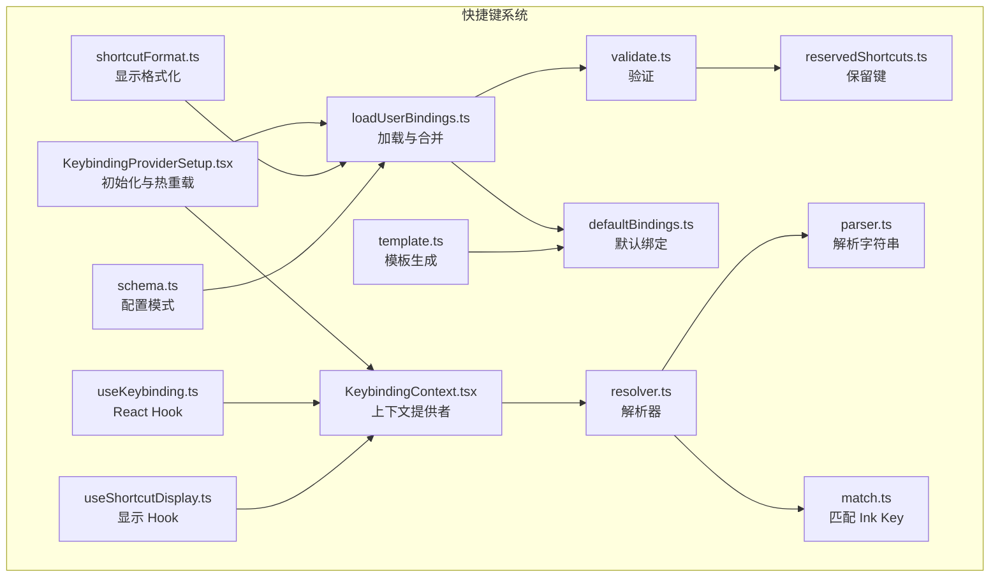
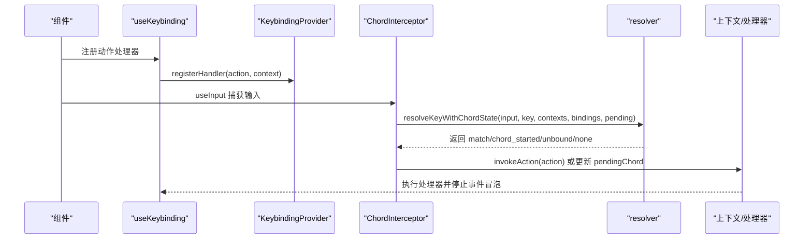
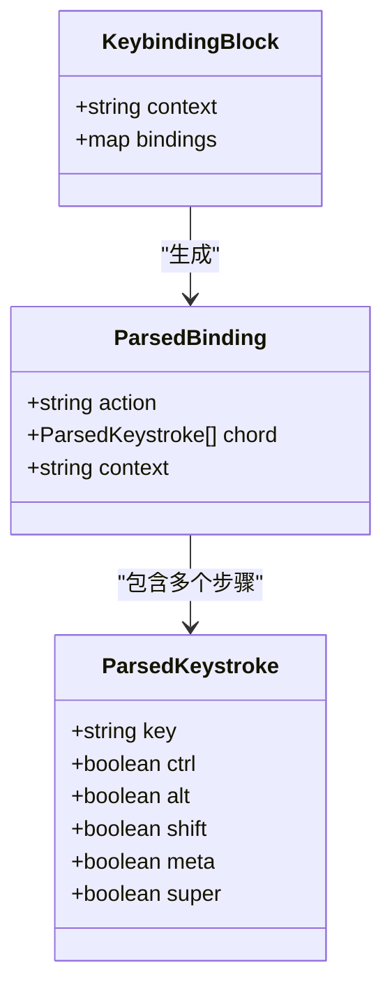
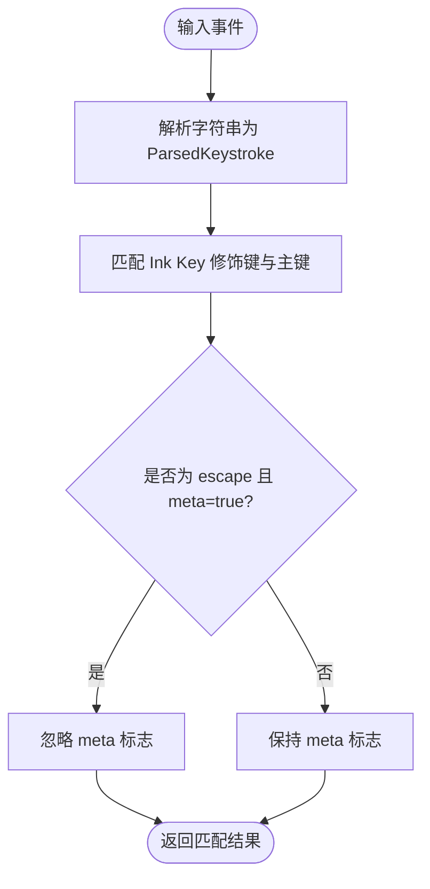
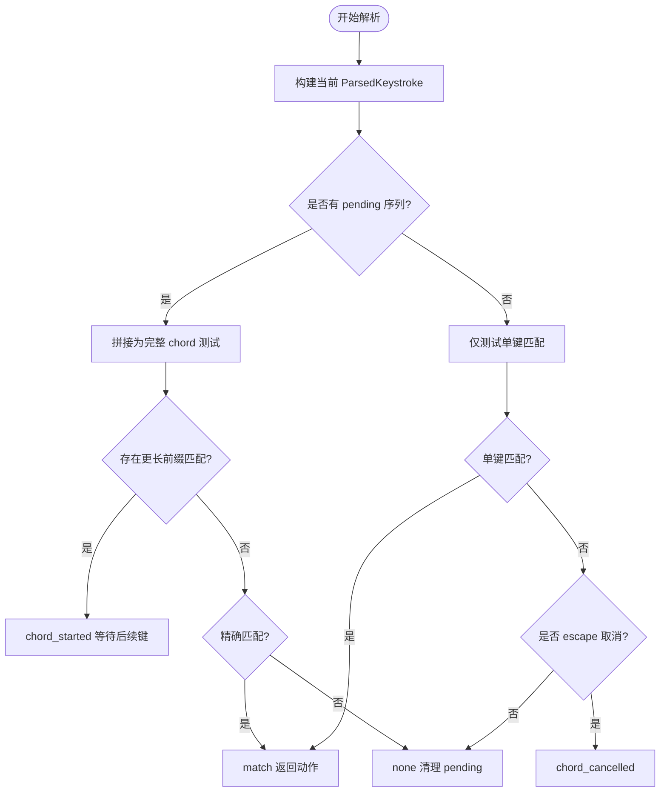
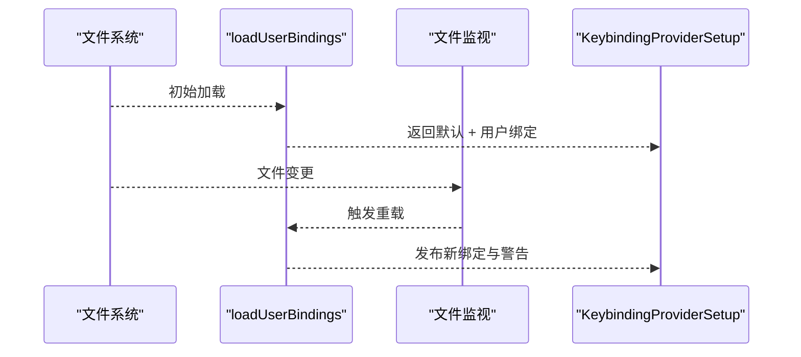
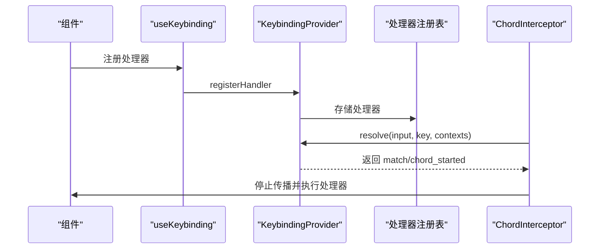
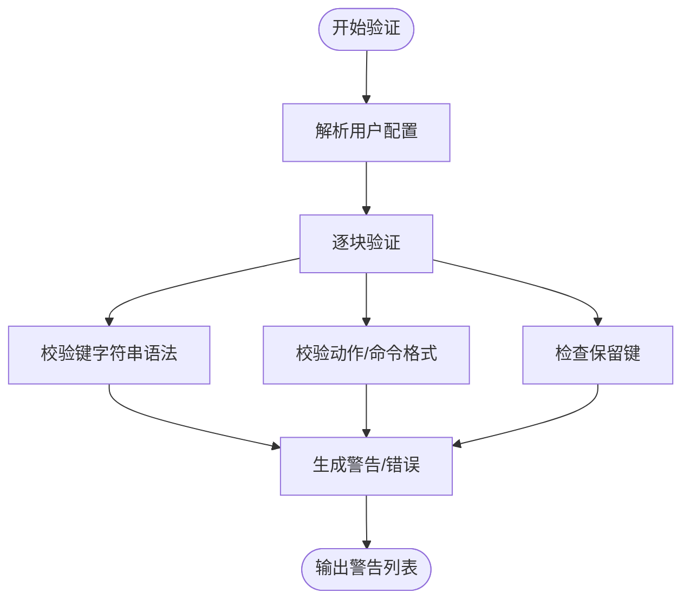
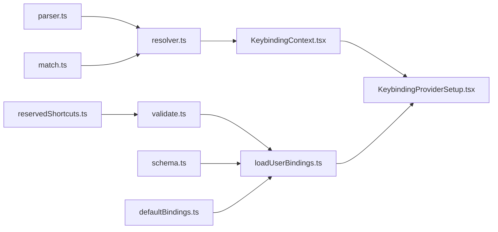

# 键盘快捷键系统

<cite>
**本文档引用的文件**
- [src/keybindings/types.ts](file://src/keybindings/types.ts)
- [src/keybindings/defaultBindings.ts](file://src/keybindings/defaultBindings.ts)
- [src/keybindings/schema.ts](file://src/keybindings/schema.ts)
- [src/keybindings/parser.ts](file://src/keybindings/parser.ts)
- [src/keybindings/match.ts](file://src/keybindings/match.ts)
- [src/keybindings/resolver.ts](file://src/keybindings/resolver.ts)
- [src/keybindings/loadUserBindings.ts](file://src/keybindings/loadUserBindings.ts)
- [src/keybindings/useKeybinding.ts](file://src/keybindings/useKeybinding.ts)
- [src/keybindings/validate.ts](file://src/keybindings/validate.ts)
- [src/keybindings/reservedShortcuts.ts](file://src/keybindings/reservedShortcuts.ts)
- [src/keybindings/shortcutFormat.ts](file://src/keybindings/shortcutFormat.ts)
- [src/keybindings/template.ts](file://src/keybindings/template.ts)
- [src/keybindings/KeybindingContext.tsx](file://src/keybindings/KeybindingContext.tsx)
- [src/keybindings/KeybindingProviderSetup.tsx](file://src/keybindings/KeybindingProviderSetup.tsx)
- [src/keybindings/useShortcutDisplay.ts](file://src/keybindings/useShortcutDisplay.ts)
</cite>

## 目录
1. [简介](#简介)
2. [项目结构](#项目结构)
3. [核心组件](#核心组件)
4. [架构总览](#架构总览)
5. [详细组件分析](#详细组件分析)
6. [依赖关系分析](#依赖关系分析)
7. [性能考虑](#性能考虑)
8. [故障排除指南](#故障排除指南)
9. [结论](#结论)
10. [附录](#附录)

## 简介
本文件全面阐述 Claude Code 的键盘快捷键系统，涵盖架构设计、解析机制、绑定注册、冲突检测与优先级处理、默认配置与用户自定义配置、上下文感知、事件传播、开发指南、测试与调试方法等。该系统以 React Hooks 与 Ink 输入框架为基础，支持单键与多键组合（Chord）序列、上下文优先级、热重载与严格校验。

## 项目结构
快捷键系统位于 `src/keybindings/` 目录，核心模块包括：
- 类型与模式：定义数据结构、上下文与动作枚举、Zod 模式
- 解析与匹配：将字符串解析为内部表示，匹配 Ink Key 事件
- 解析器：统一解析入口，支持单键与组合键序列
- 绑定加载与合并：默认绑定 + 用户绑定（JSON），热重载
- 上下文与提供者：React 提供者管理上下文、处理器注册、Chord 截获
- 验证与保留规则：重复键、保留键、平台差异
- 显示与模板：显示文本生成、模板文件生成

**图表来源**
- [src/keybindings/KeybindingContext.tsx:1-243](file://src/keybindings/KeybindingContext.tsx#L1-L243)
- [src/keybindings/KeybindingProviderSetup.tsx:1-308](file://src/keybindings/KeybindingProviderSetup.tsx#L1-L308)
- [src/keybindings/resolver.ts:1-245](file://src/keybindings/resolver.ts#L1-L245)
- [src/keybindings/parser.ts:1-204](file://src/keybindings/parser.ts#L1-L204)
- [src/keybindings/match.ts:1-121](file://src/keybindings/match.ts#L1-L121)
- [src/keybindings/loadUserBindings.ts:1-473](file://src/keybindings/loadUserBindings.ts#L1-L473)
- [src/keybindings/validate.ts:1-499](file://src/keybindings/validate.ts#L1-L499)
- [src/keybindings/reservedShortcuts.ts:1-128](file://src/keybindings/reservedShortcuts.ts#L1-L128)
- [src/keybindings/useKeybinding.ts:1-197](file://src/keybindings/useKeybinding.ts#L1-L197)
- [src/keybindings/useShortcutDisplay.ts:1-60](file://src/keybindings/useShortcutDisplay.ts#L1-L60)
- [src/keybindings/shortcutFormat.ts:1-64](file://src/keybindings/shortcutFormat.ts#L1-L64)
- [src/keybindings/template.ts:1-53](file://src/keybindings/template.ts#L1-L53)
- [src/keybindings/defaultBindings.ts:1-341](file://src/keybindings/defaultBindings.ts#L1-L341)
- [src/keybindings/schema.ts:1-237](file://src/keybindings/schema.ts#L1-L237)

**章节来源**
- [src/keybindings/types.ts:1-18](file://src/keybindings/types.ts#L1-L18)
- [src/keybindings/schema.ts:1-237](file://src/keybindings/schema.ts#L1-L237)

## 核心组件
- 数据类型与模式
  - 定义键位、绑定块、解析后的绑定结构，以及上下文与动作枚举
  - 使用 Zod 生成配置模式与描述，确保 JSON 结构正确
- 解析与匹配
  - 字符串到内部表示的转换（修饰键、主键名）
  - Ink Key 事件与内部表示的匹配，兼容终端限制（如 alt/meta 合并）
- 解析器
  - 单键与组合键序列解析，支持超时取消、前缀匹配、最后覆盖原则
- 绑定加载与合并
  - 默认绑定 + 用户绑定（~/.claude/keybindings.json），热重载监听
- 上下文与提供者
  - React 提供者维护活动上下文集合、处理器注册表、Chord 截获
- 验证与保留规则
  - 重复键检测、保留键（不可重新绑定）、平台特定拦截键
- 显示与模板
  - 动态显示当前配置的快捷键文本，生成可编辑模板

**章节来源**
- [src/keybindings/types.ts:1-18](file://src/keybindings/types.ts#L1-L18)
- [src/keybindings/schema.ts:1-237](file://src/keybindings/schema.ts#L1-L237)
- [src/keybindings/parser.ts:1-204](file://src/keybindings/parser.ts#L1-L204)
- [src/keybindings/match.ts:1-121](file://src/keybindings/match.ts#L1-L121)
- [src/keybindings/resolver.ts:1-245](file://src/keybindings/resolver.ts#L1-L245)
- [src/keybindings/loadUserBindings.ts:1-473](file://src/keybindings/loadUserBindings.ts#L1-L473)
- [src/keybindings/KeybindingContext.tsx:1-243](file://src/keybindings/KeybindingContext.tsx#L1-L243)
- [src/keybindings/KeybindingProviderSetup.tsx:1-308](file://src/keybindings/KeybindingProviderSetup.tsx#L1-L308)
- [src/keybindings/validate.ts:1-499](file://src/keybindings/validate.ts#L1-L499)
- [src/keybindings/reservedShortcuts.ts:1-128](file://src/keybindings/reservedShortcuts.ts#L1-L128)
- [src/keybindings/useShortcutDisplay.ts:1-60](file://src/keybindings/useShortcutDisplay.ts#L1-L60)
- [src/keybindings/shortcutFormat.ts:1-64](file://src/keybindings/shortcutFormat.ts#L1-L64)
- [src/keybindings/template.ts:1-53](file://src/keybindings/template.ts#L1-L53)

## 架构总览
快捷键系统采用“提供者 + Hook + 解析器”的分层架构：
- 提供者层：KeybindingProviderSetup 负责初始化、热重载、Chord 截获、上下文注册
- 解析层：resolver 聚合 parser 与 match，处理单键与组合键序列
- 配置层：loadUserBindings 合并默认与用户配置，validate 进行结构与语义校验
- 展示层：useShortcutDisplay 与 shortcutFormat 提供显示文本
- 开发层：useKeybinding 将动作与组件逻辑解耦，支持多键序列与优先级

**图表来源**
- [src/keybindings/KeybindingProviderSetup.tsx:211-308](file://src/keybindings/KeybindingProviderSetup.tsx#L211-L308)
- [src/keybindings/resolver.ts:166-245](file://src/keybindings/resolver.ts#L166-L245)
- [src/keybindings/KeybindingContext.tsx:1-243](file://src/keybindings/KeybindingContext.tsx#L1-L243)
- [src/keybindings/useKeybinding.ts:1-197](file://src/keybindings/useKeybinding.ts#L1-L197)

## 详细组件分析

### 数据模型与类型系统
- ParsedKeystroke：修饰键（ctrl/alt/shift/meta/super）与主键名
- ParsedBinding：动作标识 + 多步组合键序列 + 上下文
- KeybindingBlock：上下文 + 绑定映射（字符串到动作或 null）
- 动作与上下文枚举：通过 Zod Schema 严格约束

**图表来源**
- [src/keybindings/types.ts:1-18](file://src/keybindings/types.ts#L1-L18)
- [src/keybindings/parser.ts:1-204](file://src/keybindings/parser.ts#L1-L204)

**章节来源**
- [src/keybindings/types.ts:1-18](file://src/keybindings/types.ts#L1-L18)
- [src/keybindings/schema.ts:1-237](file://src/keybindings/schema.ts#L1-L237)

### 解析与匹配机制
- 字符串解析：支持多种修饰键别名（ctrl/control、alt/opt/option/meta/cmd/command/super/win），方向键与特殊键映射
- 匹配策略：将 Ink Key 的布尔标志映射为主键名；alt/meta 在终端中统一视为 meta；super（cmd/win）独立于 alt/meta
- 特殊处理：escape 在某些终端会设置 meta，解析器会忽略该特殊情况

**图表来源**
- [src/keybindings/parser.ts:13-75](file://src/keybindings/parser.ts#L13-L75)
- [src/keybindings/match.ts:29-105](file://src/keybindings/match.ts#L29-L105)

**章节来源**
- [src/keybindings/parser.ts:1-204](file://src/keybindings/parser.ts#L1-L204)
- [src/keybindings/match.ts:1-121](file://src/keybindings/match.ts#L1-L121)

### 解析器与组合键序列
- 单键阶段：仅匹配长度为 1 的绑定，按上下文顺序查找，最后覆盖
- 组合键阶段：构建当前键序列，检查是否存在更长的前缀匹配；若存在则等待后续键；否则尝试精确匹配
- 超时与取消：超过阈值未完成的组合键序列被取消
- 未命中与解除绑定：返回 none/unbound 并清理 pending

**图表来源**
- [src/keybindings/resolver.ts:166-245](file://src/keybindings/resolver.ts#L166-L245)

**章节来源**
- [src/keybindings/resolver.ts:1-245](file://src/keybindings/resolver.ts#L1-L245)

### 绑定加载与合并
- 默认绑定：来自 defaultBindings.ts，按平台与特性动态调整
- 用户绑定：从 ~/.claude/keybindings.json 加载，对象包装数组形式，支持 $schema 与 $docs
- 合并策略：默认在前，用户在后，后者覆盖前者（最后一条生效）
- 热重载：使用 chokidar 监听文件变更，稳定写入后触发重载
- 缓存：同步加载缓存，避免首次渲染阻塞

**图表来源**
- [src/keybindings/loadUserBindings.ts:133-237](file://src/keybindings/loadUserBindings.ts#L133-L237)
- [src/keybindings/KeybindingProviderSetup.tsx:188-204](file://src/keybindings/KeybindingProviderSetup.tsx#L188-L204)

**章节来源**
- [src/keybindings/defaultBindings.ts:1-341](file://src/keybindings/defaultBindings.ts#L1-L341)
- [src/keybindings/loadUserBindings.ts:1-473](file://src/keybindings/loadUserBindings.ts#L1-L473)
- [src/keybindings/schema.ts:1-237](file://src/keybindings/schema.ts#L1-L237)

### 上下文与事件传播
- 上下文优先级：注册的活动上下文优先于全局上下文；同优先级按注册顺序去重
- 处理器注册：useKeybinding 将动作处理器注册到提供者的处理器注册表
- Chord 截获：ChordInterceptor 在子组件之前捕获输入，阻止组合键被底层组件消费
- 事件停止传播：匹配成功后调用 stopImmediatePropagation，避免二次处理

**图表来源**
- [src/keybindings/KeybindingContext.tsx:1-243](file://src/keybindings/KeybindingContext.tsx#L1-L243)
- [src/keybindings/KeybindingProviderSetup.tsx:226-308](file://src/keybindings/KeybindingProviderSetup.tsx#L226-L308)
- [src/keybindings/useKeybinding.ts:1-197](file://src/keybindings/useKeybinding.ts#L1-L197)

**章节来源**
- [src/keybindings/KeybindingContext.tsx:1-243](file://src/keybindings/KeybindingContext.tsx#L1-L243)
- [src/keybindings/KeybindingProviderSetup.tsx:1-308](file://src/keybindings/KeybindingProviderSetup.tsx#L1-L308)
- [src/keybindings/useKeybinding.ts:1-197](file://src/keybindings/useKeybinding.ts#L1-L197)

### 验证与保留规则
- 结构验证：数组包装、上下文枚举、动作枚举、命令绑定格式
- 重复键检测：同一上下文中重复键（JSON 后面的值覆盖前面的）
- 保留键：不可重新绑定的系统保留键（如 ctrl+c、ctrl+d、ctrl+m），以及平台/终端拦截键
- 建议与警告：对不推荐的绑定给出警告（如 voice:pushToTalk 使用裸小写字母）

**图表来源**
- [src/keybindings/validate.ts:129-451](file://src/keybindings/validate.ts#L129-L451)
- [src/keybindings/reservedShortcuts.ts:1-128](file://src/keybindings/reservedShortcuts.ts#L1-L128)

**章节来源**
- [src/keybindings/validate.ts:1-499](file://src/keybindings/validate.ts#L1-L499)
- [src/keybindings/reservedShortcuts.ts:1-128](file://src/keybindings/reservedShortcuts.ts#L1-L128)

### 显示与模板
- 显示文本：优先从已解析绑定中获取，否则回退到硬编码文本并记录分析事件
- 模板生成：过滤不可重新绑定的键，生成可直接使用的 keybindings.json 模板
- 模式与文档：$schema 与 $docs 字段便于编辑器与文档导航

**章节来源**
- [src/keybindings/shortcutFormat.ts:1-64](file://src/keybindings/shortcutFormat.ts#L1-L64)
- [src/keybindings/template.ts:1-53](file://src/keybindings/template.ts#L1-L53)
- [src/keybindings/schema.ts:1-237](file://src/keybindings/schema.ts#L1-L237)

## 依赖关系分析
- 模块内聚与耦合
  - parser 与 match 独立负责字符串与 Ink Key 的转换与匹配
  - resolver 聚合 parser/match，实现解析与组合键序列处理
  - loadUserBindings 与 validate 独立于 UI，仅依赖配置与校验逻辑
  - KeybindingContext/ProviderSetup 作为 UI 层，协调解析与处理器
- 外部依赖
  - Ink 输入事件系统（useInput）
  - chokidar 文件监控
  - Zod 模式校验
  - 平台信息与特性门控

**图表来源**
- [src/keybindings/parser.ts:1-204](file://src/keybindings/parser.ts#L1-L204)
- [src/keybindings/match.ts:1-121](file://src/keybindings/match.ts#L1-L121)
- [src/keybindings/resolver.ts:1-245](file://src/keybindings/resolver.ts#L1-L245)
- [src/keybindings/KeybindingContext.tsx:1-243](file://src/keybindings/KeybindingContext.tsx#L1-L243)
- [src/keybindings/KeybindingProviderSetup.tsx:1-308](file://src/keybindings/KeybindingProviderSetup.tsx#L1-L308)
- [src/keybindings/loadUserBindings.ts:1-473](file://src/keybindings/loadUserBindings.ts#L1-L473)
- [src/keybindings/validate.ts:1-499](file://src/keybindings/validate.ts#L1-L499)
- [src/keybindings/reservedShortcuts.ts:1-128](file://src/keybindings/reservedShortcuts.ts#L1-L128)
- [src/keybindings/schema.ts:1-237](file://src/keybindings/schema.ts#L1-L237)
- [src/keybindings/defaultBindings.ts:1-341](file://src/keybindings/defaultBindings.ts#L1-L341)

**章节来源**
- [src/keybindings/KeybindingContext.tsx:1-243](file://src/keybindings/KeybindingContext.tsx#L1-L243)
- [src/keybindings/KeybindingProviderSetup.tsx:1-308](file://src/keybindings/KeybindingProviderSetup.tsx#L1-L308)

## 性能考虑
- 解析与匹配
  - 解析器使用 Set 过滤上下文，避免线性扫描开销
  - 组合键前缀匹配通过 Map 记录，减少重复计算
- 绑定加载
  - 默认绑定解析结果缓存，避免重复解析
  - 用户绑定热重载采用稳定写入阈值，降低抖动
- UI 更新
  - pendingChord 使用 ref + state 双通道，ref 提供即时访问，state 触发渲染
  - 处理器注册表使用 Map/Set，快速查找与去重

[本节为通用指导，无需具体文件分析]

## 故障排除指南
- 快捷键无效
  - 检查是否被系统/终端/平台拦截（保留键）
  - 确认上下文是否激活（注册的活动上下文优先）
  - 查看 /doctor 输出的验证警告
- 组合键不生效
  - 确认键序列是否完整，注意超时取消
  - 检查是否存在更长前缀匹配导致序列等待
- 用户配置问题
  - 检查 keybindings.json 格式与字段（bindings 数组、context、bindings 对象）
  - 关注重复键警告（JSON 后面值覆盖前面值）
- 调试技巧
  - 使用通知查看实时警告
  - 在非 React 环境使用 getShortcutDisplay 获取显示文本
  - 通过分析事件记录 fallback 使用情况

**章节来源**
- [src/keybindings/validate.ts:1-499](file://src/keybindings/validate.ts#L1-L499)
- [src/keybindings/reservedShortcuts.ts:1-128](file://src/keybindings/reservedShortcuts.ts#L1-L128)
- [src/keybindings/KeybindingProviderSetup.tsx:59-118](file://src/keybindings/KeybindingProviderSetup.tsx#L59-L118)
- [src/keybindings/shortcutFormat.ts:1-64](file://src/keybindings/shortcutFormat.ts#L1-L64)

## 结论
该快捷键系统通过清晰的分层设计与严格的校验机制，实现了跨平台、可扩展、可热重载的键盘交互体验。其组合键序列支持、上下文优先级与事件截获机制，确保了复杂场景下的可用性与一致性。开发者可通过模板与模式快速定制快捷键，并借助验证与调试工具保障质量。

[本节为总结，无需具体文件分析]

## 附录

### 默认快捷键配置概览
- 全局（Global）：中断、退出、重绘、切换待办、切换转录、全局搜索、快速打开、终端开关等
- 聊天（Chat）：取消、杀代理、模式循环、模型选择器、快速模式、思考切换、提交、历史导航、撤销、外部编辑器、暂存、图片粘贴、语音激活等
- 自动补全（Autocomplete）：接受、关闭、上一项、下一项
- 设置（Settings）：确认/取消、列表导航、激活/切换、保存关闭、搜索、重试
- 确认（Confirmation）：确认/取消、列表导航、切换模式、切换解释、权限调试
- 标签页（Tabs）：前后导航
- 转录（Transcript）：显示全部、退出、q 退出
- 历史搜索（HistorySearch）：下一个、接受、取消、执行
- 任务（Task）：后台运行
- 主题选择（ThemePicker）：切换语法高亮
- 滚动（Scroll）：翻页/滚动/跳转、复制
- 帮助（Help）：关闭
- 附件（Attachments）：前后、移除、退出
- 页脚（Footer）：上下/前后、打开选中、清除选择
- 消息选择器（MessageSelector）：上下/顶部/底部、选择
- 差异对话框（DiffDialog）：关闭、前后源、前后文件、查看详情
- 模型选择（ModelPicker）：降低/提高努力度
- 选择（Select）：前后、接受、取消
- 插件（Plugin）：切换、安装

**章节来源**
- [src/keybindings/defaultBindings.ts:1-341](file://src/keybindings/defaultBindings.ts#L1-L341)

### 用户自定义快捷键设置
- 文件位置：~/.claude/keybindings.json
- 格式要求：对象包装数组，包含 $schema 与 $docs 字段
- 合并规则：默认在前，用户在后，后者覆盖前者
- 热重载：文件变更自动重载，稳定写入后触发
- 模板生成：使用模板生成器创建初始配置

**章节来源**
- [src/keybindings/loadUserBindings.ts:115-132](file://src/keybindings/loadUserBindings.ts#L115-L132)
- [src/keybindings/schema.ts:214-237](file://src/keybindings/schema.ts#L214-L237)
- [src/keybindings/template.ts:1-53](file://src/keybindings/template.ts#L1-L53)

### 新快捷键开发指南
- 添加步骤
  - 在对应上下文中新增绑定（参考 defaultBindings）
  - 如需命令绑定，确保在 Chat 上下文并符合命令格式
  - 生成模板并手动编辑 keybindings.json
- 冲突解决
  - 避免与保留键冲突（参见保留规则）
  - 同一上下文内避免重复键（JSON 后面值覆盖）
  - 使用验证工具检查结构与警告
- 用户体验优化
  - 选择平台友好的键位（如 Windows 终端 VT 模式限制）
  - 提供清晰的显示文本与帮助提示
  - 通过 /doctor 检查潜在问题

**章节来源**
- [src/keybindings/reservedShortcuts.ts:1-128](file://src/keybindings/reservedShortcuts.ts#L1-L128)
- [src/keybindings/validate.ts:1-499](file://src/keybindings/validate.ts#L1-L499)
- [src/keybindings/template.ts:1-53](file://src/keybindings/template.ts#L1-L53)

### 快捷键测试与调试
- 单元测试
  - 使用重置函数清理状态
  - 检查解析、匹配、解析器行为
- 集成测试
  - 模拟输入事件，验证组合键序列
  - 验证上下文优先级与事件传播
- 调试工具
  - 使用通知查看验证警告
  - 分析事件记录 fallback 使用
  - 在非 React 环境使用 getShortcutDisplay 获取显示文本

**章节来源**
- [src/keybindings/loadUserBindings.ts:461-473](file://src/keybindings/loadUserBindings.ts#L461-L473)
- [src/keybindings/KeybindingProviderSetup.tsx:59-118](file://src/keybindings/KeybindingProviderSetup.tsx#L59-L118)
- [src/keybindings/shortcutFormat.ts:1-64](file://src/keybindings/shortcutFormat.ts#L1-L64)