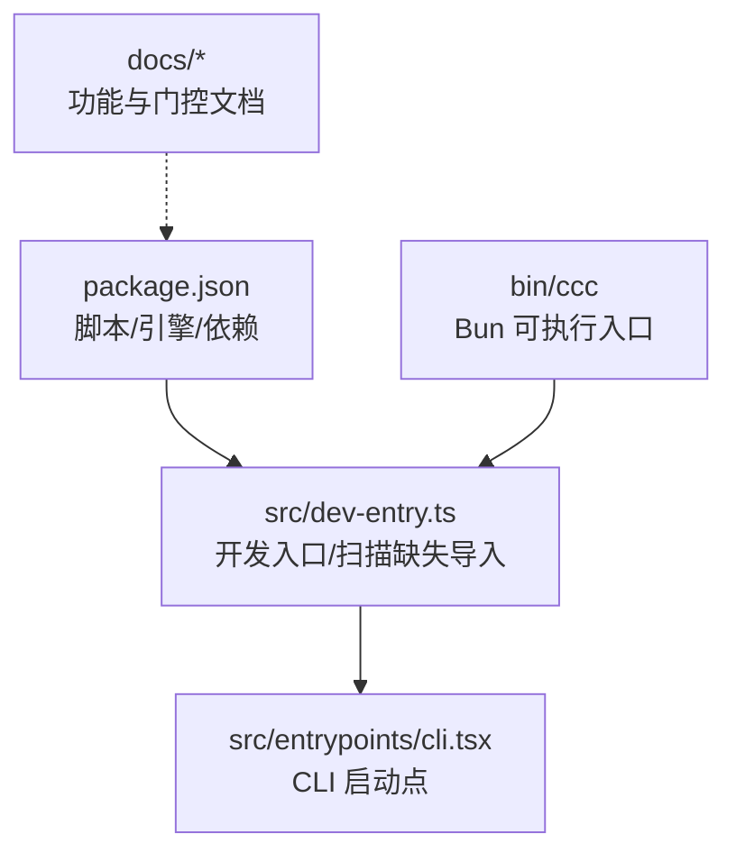
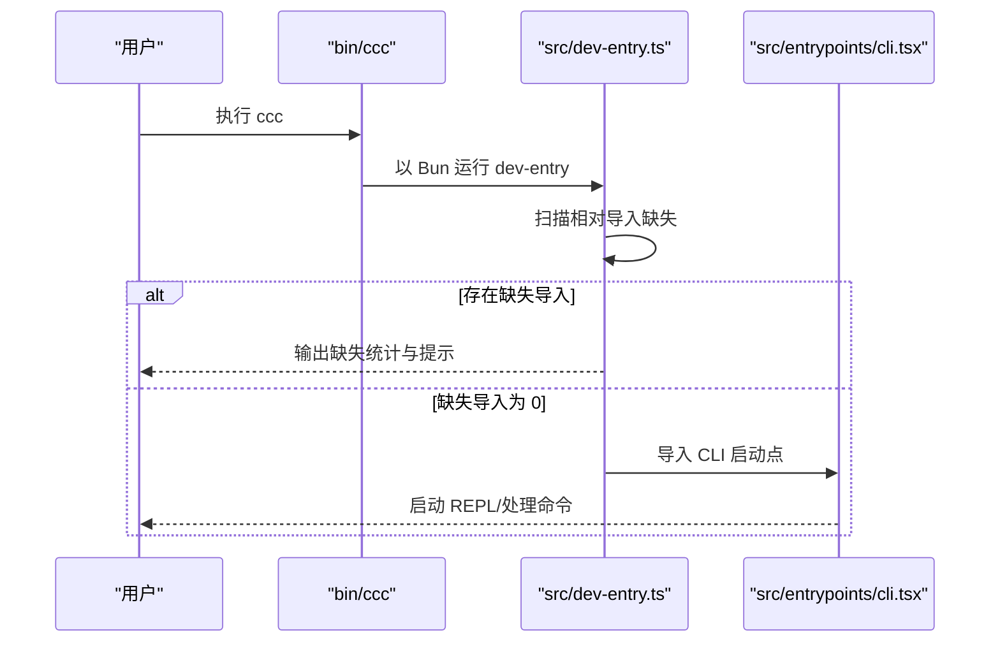
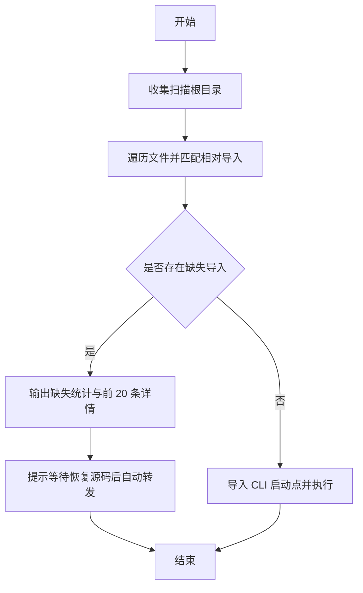
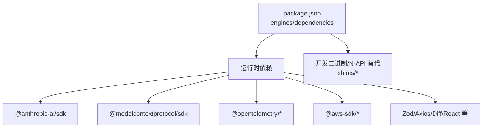

# 贡献指南

<cite>
**本文引用的文件**
- [package.json](file://package.json)
- [README.md](file://README.md)
- [src/dev-entry.ts](file://src/dev-entry.ts)
- [src/dev-entry.test.ts](file://src/dev-entry.test.ts)
- [bin/ccc](file://bin/ccc)
- [tsconfig.json](file://tsconfig.json)
- [docs/01-buddy.md](file://docs/01-buddy.md)
- [docs/02-kairos.md](file://docs/02-kairos.md)
- [docs/03-ultraplan.md](file://docs/03-ultraplan.md)
- [docs/04-coordinator.md](file://docs/04-coordinator.md)
- [docs/05-hidden-commands.md](file://docs/05-hidden-commands.md)
- [docs/06-bridge.md](file://docs/06-bridge.md)
- [docs/07-feature-gates.md](file://docs/07-feature-gates.md)
</cite>

## 目录
1. [简介](#简介)
2. [项目结构](#项目结构)
3. [核心组件](#核心组件)
4. [架构总览](#架构总览)
5. [详细组件分析](#详细组件分析)
6. [依赖分析](#依赖分析)
7. [性能考虑](#性能考虑)
8. [故障排查指南](#故障排查指南)
9. [结论](#结论)
10. [附录](#附录)

## 简介
本指南面向希望为 Claude Code 项目做出贡献的开发者，涵盖开发环境搭建、依赖与工具准备、代码贡献流程（分支管理、提交规范、代码评审与合并）、测试要求与持续集成、文档贡献方式、开发规范与最佳实践，以及社区行为准则与沟通渠道。  
本仓库为基于公开 npm 包 source map 还原的源码，仅供研究学习使用。

章节来源
- [README.md:1-361](file://README.md#L1-L361)

## 项目结构
- 核心源码位于 src/，包含工具、命令、服务、组件、钩子、功能模块等。
- CLI 启动入口通过 src/dev-entry.ts 与 src/entrypoints/cli.tsx 协作。
- 二进制入口 ccc 由 bin/ccc 提供，指向 Bun 运行时。
- 文档位于 docs/，包含多个功能专题与特性门控说明。
- 顶层 package.json 定义了包元数据、脚本、依赖与引擎版本。

图表来源
- [package.json:1-102](file://package.json#L1-L102)
- [src/dev-entry.ts:1-149](file://src/dev-entry.ts#L1-L149)
- [bin/ccc](file://bin/ccc)

章节来源
- [README.md:328-347](file://README.md#L328-L347)
- [package.json:1-102](file://package.json#L1-L102)
- [src/dev-entry.ts:1-149](file://src/dev-entry.ts#L1-L149)

## 核心组件
- 开发入口与打包校验：src/dev-entry.ts 负责扫描相对导入缺失、处理 --help/--version、并在缺失导入清零后路由到 CLI 主入口。
- CLI 启动：通过 src/entrypoints/cli.tsx 进入交互式 REPL 或命令处理。
- 二进制入口：bin/ccc 以 Bun shebang 方式提供全局命令 ccc。
- 文档与功能说明：docs/ 下各专题文档描述隐藏功能、编译开关与远程门控。

章节来源
- [src/dev-entry.ts:101-149](file://src/dev-entry.ts#L101-L149)
- [src/dev-entry.test.ts:1-41](file://src/dev-entry.test.ts#L1-L41)
- [bin/ccc](file://bin/ccc)

## 架构总览
下图展示从 ccc 入口到 CLI 主程序的运行链路，以及开发入口对缺失导入的检测与引导。

图表来源
- [src/dev-entry.ts:101-149](file://src/dev-entry.ts#L101-L149)
- [bin/ccc](file://bin/ccc)

## 详细组件分析

### 开发入口与测试（src/dev-entry.ts 与 src/dev-entry.test.ts）
- 功能要点
  - 扫描仓库内所有 TS/JS 文件，收集相对导入缺失项，排序去重。
  - 支持 --help 与 --version 输出，便于快速验证环境。
  - 当缺失导入计数为 0 时，转发到 CLI 主入口；否则输出提示并退出。
- 测试要点
  - 验证 package.json 的 bin 字段包含 ccc。
  - 验证仓库根路径解析逻辑。
  - 验证扫描根目录集合。
  - 验证 ccc 启动器 shebang 与不改变工作目录的行为。

图表来源
- [src/dev-entry.ts:37-99](file://src/dev-entry.ts#L37-L99)

章节来源
- [src/dev-entry.ts:1-149](file://src/dev-entry.ts#L1-L149)
- [src/dev-entry.test.ts:1-41](file://src/dev-entry.test.ts#L1-L41)

### CLI 启动与全局命令（bin/ccc 与 package.json）
- 全局命令 ccc 由 package.json 的 bin 字段声明，并由 bin/ccc 提供 Bun shebang。
- README 提供了全局链接与 PATH 配置方法，确保 ccc 可在任意目录使用。

章节来源
- [package.json:5-7](file://package.json#L5-L7)
- [bin/ccc](file://bin/ccc)
- [README.md:24-75](file://README.md#L24-L75)

### 功能与门控文档（docs/*）
- 功能专题：包含 BUDDY、KAIROS、ULTRAPLAN、Coordinator、Bridge 等隐藏功能说明。
- 门控体系：编译开关（feature）、用户类型（USER_TYPE）、远程门控（GrowthBook）三层控制。
- 环境变量：提供一系列运行期开关，用于调试与功能启用。

章节来源
- [docs/01-buddy.md](file://docs/01-buddy.md)
- [docs/02-kairos.md](file://docs/02-kairos.md)
- [docs/03-ultraplan.md](file://docs/03-ultraplan.md)
- [docs/04-coordinator.md](file://docs/04-coordinator.md)
- [docs/05-hidden-commands.md](file://docs/05-hidden-commands.md)
- [docs/06-bridge.md](file://docs/06-bridge.md)
- [docs/07-feature-gates.md](file://docs/07-feature-gates.md)
- [README.md:78-324](file://README.md#L78-L324)

## 依赖分析
- 引擎与包管理器：要求 Bun >= 1.3.5、Node.js >= 24；使用 Bun 作为包管理器。
- 关键依赖：包含 Claude SDK、MCP 生态、React + Ink、OpenTelemetry、AWS Bedrock 客户端、Zod、Axios、Diff、Highlight.js 等。
- 本地二进制与 N-API 替代：通过 shims 目录引入 color-diff-napi、modifiers-napi、url-handler-napi 等本地模块。

图表来源
- [package.json:16-19](file://package.json#L16-L19)
- [package.json:25-100](file://package.json#L25-L100)

章节来源
- [package.json:1-102](file://package.json#L1-L102)

## 性能考虑
- 由于本仓库为还原版源码，建议在本地运行时关注以下方面：
  - 减少不必要的文件扫描与导入缺失检测开销，保持 src/ 与 vendor/ 的扫描范围最小化。
  - 合理使用缓存与增量构建策略，避免重复初始化。
  - 在 CI 环境中优先使用已安装的 Bun/Node 版本，减少环境切换成本。

## 故障排查指南
- ccc 命令不可用
  - 确认已执行 bun link 并将 ~/.bun/bin 加入 PATH。
  - 使用 which ccc 验证路径指向。
- 缺失相对导入
  - 运行 dev-entry 会列出缺失导入数量与前 20 条详情，等待恢复源码后缺失导入归零再执行。
- 版本与帮助
  - 使用 --version 与 --help 快速确认环境与可用参数。

章节来源
- [README.md:24-75](file://README.md#L24-L75)
- [src/dev-entry.ts:104-129](file://src/dev-entry.ts#L104-L129)
- [src/dev-entry.ts:131-144](file://src/dev-entry.ts#L131-L144)

## 结论
本指南提供了从环境搭建到贡献流程、测试与文档规范的完整参考。请在遵循开源许可的前提下进行研究与学习，并结合功能门控文档理解不同用户类型的可用能力差异。

## 附录

### 开发环境搭建步骤
- 安装依赖
  - 使用 Bun 安装依赖，确保满足 engines 要求。
- 启动 CLI
  - 运行 dev 启动交互式 REPL；使用 version 验证版本。
- 全局使用 ccc
  - 执行 bun link 注册全局命令，并将 ~/.bun/bin 加入 PATH。

章节来源
- [README.md:14-22](file://README.md#L14-L22)
- [package.json:16-24](file://package.json#L16-L24)

### 代码贡献流程
- 分支管理
  - 建议采用功能分支开发，主分支保持稳定。
- 提交规范
  - 提交信息清晰描述变更目的与影响范围；必要时关联相关文档或问题。
- 代码评审
  - 提交 Pull Request 前确保本地测试通过，评审中关注功能门控与兼容性。
- 合并流程
  - 由维护者审核并通过后合并；合并前确保缺失导入计数为 0。

章节来源
- [src/dev-entry.ts:101-149](file://src/dev-entry.ts#L101-L149)

### 测试要求与标准
- 单元测试
  - 使用 Bun test，参考 src/dev-entry.test.ts 的组织方式。
- 覆盖率
  - 建议在 CI 中报告覆盖率指标，逐步提升关键路径覆盖率。
- 持续集成
  - 在 CI 中执行安装、测试与版本/帮助输出验证。

章节来源
- [src/dev-entry.test.ts:1-41](file://src/dev-entry.test.ts#L1-L41)

### 文档贡献方式
- 文档格式
  - 使用 Markdown，遵循仓库现有标题层级与语言风格。
- 内容标准
  - 清晰描述功能背景、使用场景、配置选项与注意事项。
- 发布流程
  - 更新 docs/ 下对应专题文档，必要时补充 README 中的功能索引与链接。

章节来源
- [docs/01-buddy.md](file://docs/01-buddy.md)
- [docs/02-kairos.md](file://docs/02-kairos.md)
- [docs/03-ultraplan.md](file://docs/03-ultraplan.md)
- [docs/04-coordinator.md](file://docs/04-coordinator.md)
- [docs/05-hidden-commands.md](file://docs/05-hidden-commands.md)
- [docs/06-bridge.md](file://docs/06-bridge.md)
- [docs/07-feature-gates.md](file://docs/07-feature-gates.md)

### 开发规范与最佳实践
- 代码风格
  - 使用 TypeScript/TSX，遵循 tsconfig.json 中的编译选项。
- 命名约定
  - 组件与模块命名清晰、语义化；避免缩写导致歧义。
- 注释规范
  - 对复杂逻辑与边界条件添加注释；对外部依赖与门控说明进行标注。
- 依赖管理
  - 严格遵守 engines 要求；谨慎升级依赖，确保 CI 通过。

章节来源
- [tsconfig.json](file://tsconfig.json)
- [package.json:16-19](file://package.json#L16-L19)

### 社区行为准则与沟通渠道
- 行为准则
  - 尊重版权与开源协议，仅用于学习研究，不得用于商业用途。
- 沟通渠道
  - 问题反馈与讨论请在仓库 Issues 中进行。

章节来源
- [README.md:9-10](file://README.md#L9-L10)
- [README.md:356-361](file://README.md#L356-L361)